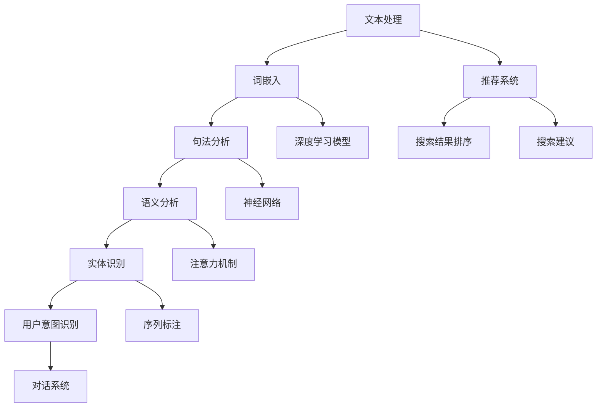

                 

# 自然语言处理在电商搜索中的应用：技术发展与未来趋势

> **关键词：** 自然语言处理、电商搜索、文本挖掘、语义分析、用户意图识别、推荐系统、深度学习、BERT、Transformer、预训练模型、NLP应用实践。

> **摘要：** 本文深入探讨了自然语言处理（NLP）在电商搜索领域中的应用，从技术发展历程、核心算法原理到实际应用场景进行了详细分析。通过介绍自然语言处理的基础概念、核心算法原理、数学模型及其在电商搜索中的具体应用，本文旨在揭示NLP技术在电商搜索中的巨大潜力和未来发展趋势。同时，文章还推荐了相关学习资源和工具，以助力读者深入理解和掌握这一前沿技术。

## 1. 背景介绍

### 1.1 目的和范围

本文旨在探讨自然语言处理（NLP）技术在电商搜索领域的应用，从技术发展历程、核心算法原理到实际应用场景进行详细分析。通过回顾NLP在电商搜索中的应用历史，介绍当前主流的NLP算法及其在电商搜索中的应用场景，本文旨在为读者提供一个全面的技术视角，帮助理解NLP在电商搜索中的重要性。

本文的主要内容包括：

1. **背景介绍**：介绍NLP技术的基本概念和电商搜索的现状，以及两者结合的重要性。
2. **核心概念与联系**：通过Mermaid流程图展示NLP技术的核心概念和架构。
3. **核心算法原理 & 具体操作步骤**：详细讲解自然语言处理的关键算法，如词嵌入、序列标注、实体识别等，并使用伪代码进行阐述。
4. **数学模型和公式 & 详细讲解 & 举例说明**：介绍NLP中的数学模型，包括概率模型、神经网络模型等，并通过实际例子进行解释。
5. **项目实战：代码实际案例和详细解释说明**：通过具体项目案例展示NLP技术在电商搜索中的实际应用。
6. **实际应用场景**：分析NLP在电商搜索中的具体应用场景，如搜索建议、用户意图识别等。
7. **工具和资源推荐**：推荐学习资源、开发工具和框架。
8. **总结：未来发展趋势与挑战**：展望NLP在电商搜索领域的未来发展趋势和面临的挑战。

### 1.2 预期读者

本文主要面向以下读者群体：

1. **自然语言处理领域研究者**：希望了解NLP技术在电商搜索中的应用。
2. **电商行业从业者**：希望提升电商搜索系统的用户体验。
3. **计算机科学学生**：对自然语言处理和电商搜索技术感兴趣。
4. **算法工程师**：需要将NLP技术应用于电商搜索系统的工程师。

### 1.3 文档结构概述

本文将按照以下结构展开：

1. **背景介绍**：介绍NLP技术和电商搜索的现状。
2. **核心概念与联系**：展示NLP技术的核心概念和架构。
3. **核心算法原理 & 具体操作步骤**：讲解NLP的关键算法。
4. **数学模型和公式 & 详细讲解 & 举例说明**：介绍NLP的数学模型。
5. **项目实战：代码实际案例和详细解释说明**：展示NLP技术的实际应用。
6. **实际应用场景**：分析NLP在电商搜索中的应用场景。
7. **工具和资源推荐**：推荐相关学习和开发资源。
8. **总结：未来发展趋势与挑战**：展望NLP在电商搜索领域的未来。
9. **附录：常见问题与解答**：提供常见问题及其解答。
10. **扩展阅读 & 参考资料**：推荐进一步阅读的资料。

### 1.4 术语表

#### 1.4.1 核心术语定义

- **自然语言处理（NLP）**：指使用计算机技术对自然语言进行理解和生成。
- **词嵌入（Word Embedding）**：将词汇映射到低维空间中，用于文本数据的处理。
- **序列标注（Sequence Labeling）**：对文本序列中的每个词进行分类标注。
- **实体识别（Entity Recognition）**：识别文本中的关键实体，如人名、地名等。
- **用户意图识别（User Intent Recognition）**：理解用户在搜索框中的输入，确定其意图。
- **推荐系统（Recommender System）**：根据用户的历史行为和兴趣推荐相关商品。

#### 1.4.2 相关概念解释

- **电商搜索**：指用户在电商平台上通过搜索功能查找所需商品的过程。
- **语义分析**：对文本内容进行理解和分析，提取出语义信息。
- **深度学习**：一种基于多层神经网络的学习方法，可用于图像、语音和文本等数据的处理。

#### 1.4.3 缩略词列表

- **NLP**：自然语言处理
- **BERT**：Bidirectional Encoder Representations from Transformers
- **Transformer**：一种基于自注意力机制的深度学习模型
- **IDE**：集成开发环境
- **API**：应用程序接口

## 2. 核心概念与联系

为了更好地理解自然语言处理在电商搜索中的应用，我们需要先掌握NLP技术中的核心概念和基本架构。以下是一个使用Mermaid绘制的流程图，展示了NLP技术的关键概念和它们之间的联系。



### 2.1 文本处理

文本处理是NLP的基础步骤，包括文本的分词、去停用词、词形还原等操作。文本处理的结果是生成适合机器处理的文本数据。

### 2.2 词嵌入

词嵌入（Word Embedding）是将词汇映射到低维空间的过程。词嵌入有助于将高维的文本数据转化为低维的向量表示，便于后续的机器学习模型处理。

### 2.3 句法分析

句法分析（Syntactic Analysis）是对文本进行语法结构的分析和解析。句法分析可以识别出文本中的句法关系，如主谓宾结构等。

### 2.4 语义分析

语义分析（Semantic Analysis）是对文本内容进行深入理解和分析，提取出文本的语义信息。语义分析有助于理解文本的主旨、情感、意图等。

### 2.5 实体识别

实体识别（Named Entity Recognition，NER）是一种文本分类任务，用于识别文本中的关键实体，如人名、地名、组织名等。

### 2.6 用户意图识别

用户意图识别（User Intent Recognition）是一种理解用户在搜索框中的输入，确定其意图的任务。用户意图识别有助于电商搜索系统提供更准确的搜索结果。

### 2.7 推荐系统

推荐系统（Recommender System）是一种基于用户历史行为和兴趣为其推荐相关商品的系统。推荐系统在电商搜索中起到关键作用，可以提高用户体验和转化率。

### 2.8 搜索结果排序

搜索结果排序（Search Result Ranking）是一种基于文本匹配度、用户历史行为等因素对搜索结果进行排序的过程。准确的结果排序有助于用户快速找到所需商品。

### 2.9 搜索建议

搜索建议（Search Suggestion）是一种根据用户输入的部分关键词，实时推荐可能的完整关键词或搜索短语。搜索建议可以减少用户的搜索时间，提高用户体验。

### 2.10 深度学习模型

深度学习模型（Deep Learning Models）是一种基于多层神经网络的学习方法，可用于处理图像、语音和文本等数据。深度学习模型在NLP中的应用极大地提高了文本处理的效果。

### 2.11 神经网络

神经网络（Neural Networks）是一种模拟生物神经系统的计算模型。神经网络通过学习大量的样本数据，可以自动提取出数据的特征和规律。

### 2.12 注意力机制

注意力机制（Attention Mechanism）是一种在神经网络中用于增强模型对输入数据的关注度的机制。注意力机制在文本处理任务中发挥着重要作用，可以提升模型的理解能力。

### 2.13 序列标注

序列标注（Sequence Labeling）是一种对文本序列中的每个词进行分类标注的任务。序列标注在实体识别和情感分析等任务中广泛应用。

### 2.14 对话系统

对话系统（Dialogue System）是一种能够与用户进行自然语言交互的系统。对话系统在电商搜索中的应用可以提升用户的购物体验。

通过以上对NLP技术核心概念和架构的介绍，我们可以看到自然语言处理技术在电商搜索中的应用是多层次、多维度的。接下来，我们将深入探讨NLP的核心算法原理及其在电商搜索中的具体应用。

## 3. 核心算法原理 & 具体操作步骤

自然语言处理技术在电商搜索中的应用离不开一系列核心算法的支持。本节将详细讲解这些算法的原理，并使用伪代码进行具体操作步骤的阐述。

### 3.1 词嵌入（Word Embedding）

词嵌入是将词汇映射到低维空间的过程，其目的是通过向量表示来处理文本数据。词嵌入的基本原理是通过训练模型，使得语义相近的词汇在向量空间中靠近。

**伪代码：**

```python
# 输入：词汇表V，训练数据D
# 输出：词嵌入矩阵W

# 初始化词嵌入矩阵W
W = random_initialization(V)

# 训练词嵌入模型
for epoch in range(num_epochs):
    for sentence in D:
        for word in sentence:
            # 计算词向量更新梯度
            gradient = compute_gradient(word, W[word])
            # 更新词向量
            W[word] = W[word] - learning_rate * gradient

return W
```

### 3.2 序列标注（Sequence Labeling）

序列标注是对文本序列中的每个词进行分类标注的任务。常用的序列标注模型有CRF（条件随机场）和LSTM（长短时记忆网络）。

**伪代码：**

```python
# 输入：词嵌入矩阵W，标注数据D
# 输出：标注结果Y

# 初始化模型参数
# ...

# 训练序列标注模型
for epoch in range(num_epochs):
    for sentence, labels in D:
        # 计算损失函数
        loss = compute_loss(sentence, labels, W)
        # 反向传播更新参数
        gradient = backward_propagation(sentence, labels, W)
        # 更新模型参数
        update_parameters(W, gradient)

return W
```

### 3.3 实体识别（Named Entity Recognition）

实体识别是一种文本分类任务，用于识别文本中的关键实体，如人名、地名、组织名等。常用的实体识别模型有BiLSTM-CRF（双向长短时记忆网络结合条件随机场）。

**伪代码：**

```python
# 输入：词嵌入矩阵W，实体标注数据D
# 输出：实体识别结果E

# 初始化模型参数
# ...

# 训练实体识别模型
for epoch in range(num_epochs):
    for sentence, entities in D:
        # 计算损失函数
        loss = compute_loss(sentence, entities, W)
        # 反向传播更新参数
        gradient = backward_propagation(sentence, entities, W)
        # 更新模型参数
        update_parameters(W, gradient)

return W
```

### 3.4 用户意图识别（User Intent Recognition）

用户意图识别是一种理解用户在搜索框中的输入，确定其意图的任务。常用的用户意图识别模型有基于Transformer的BERT（双向编码表示）。

**伪代码：**

```python
# 输入：词嵌入矩阵W，用户输入数据D
# 输出：用户意图识别结果I

# 初始化模型参数
# ...

# 训练用户意图识别模型
for epoch in range(num_epochs):
    for sentence, intent in D:
        # 计算损失函数
        loss = compute_loss(sentence, intent, W)
        # 反向传播更新参数
        gradient = backward_propagation(sentence, intent, W)
        # 更新模型参数
        update_parameters(W, gradient)

return W
```

通过以上核心算法的讲解和伪代码的实现，我们可以看到自然语言处理技术在电商搜索中的应用是如何逐步构建和完善的。接下来，我们将进一步探讨NLP中的数学模型和公式，以及它们在电商搜索中的具体应用。

## 4. 数学模型和公式 & 详细讲解 & 举例说明

自然语言处理（NLP）技术的应用离不开数学模型的支撑。在电商搜索中，数学模型用于表示和计算文本数据，以实现文本分析、分类和预测等功能。以下将介绍几种常见的数学模型，包括概率模型和神经网络模型，并通过具体例子进行说明。

### 4.1 概率模型

概率模型是NLP中常用的基础模型之一，它通过计算文本数据的概率分布来分析文本。以下是一个简单的概率模型示例：**

**贝叶斯分类器**

贝叶斯分类器是一种基于贝叶斯定理的文本分类模型。它的基本思想是计算每个类别在文本数据中的概率，并选择概率最高的类别作为分类结果。

**公式：**

$$
P(C_k|X) = \frac{P(X|C_k)P(C_k)}{P(X)}
$$

其中，\(P(C_k|X)\) 表示在给定文本 \(X\) 的情况下，类别 \(C_k\) 的概率；\(P(X|C_k)\) 表示在类别 \(C_k\) 的情况下文本 \(X\) 的概率；\(P(C_k)\) 表示类别 \(C_k\) 的先验概率；\(P(X)\) 表示文本 \(X\) 的概率。

**举例：**

假设我们要分类一条文本 \(X\)，其中包含关键词“苹果”和“手机”。我们需要计算文本属于类别“电子产品”和“水果”的概率，并选择概率较高的类别。

- **先验概率**：
  \(P(电子产品) = 0.6\)，\(P(水果) = 0.4\)

- **条件概率**：
  \(P(苹果|电子产品) = 0.8\)，\(P(手机|电子产品) = 0.7\)
  \(P(苹果|水果) = 0.3\)，\(P(手机|水果) = 0.2\)

- **文本概率**：
  \(P(X|电子产品) = P(苹果|电子产品)P(手机|电子产品) = 0.8 \times 0.7 = 0.56\)
  \(P(X|水果) = P(苹果|水果)P(手机|水果) = 0.3 \times 0.2 = 0.06\)

- **后验概率**：
  \(P(电子产品|X) = \frac{P(X|电子产品)P(电子产品)}{P(X)} = \frac{0.56 \times 0.6}{0.56 \times 0.6 + 0.06 \times 0.4} \approx 0.84\)
  \(P(水果|X) = \frac{P(X|水果)P(水果)}{P(X)} = \frac{0.06 \times 0.4}{0.56 \times 0.6 + 0.06 \times 0.4} \approx 0.16\)

根据后验概率，文本 \(X\) 属于“电子产品”类别的概率更高，因此我们将其分类为“电子产品”。

### 4.2 神经网络模型

神经网络模型是NLP中的另一类重要模型，它通过多层神经网络结构对文本数据进行处理和预测。以下介绍几种常见的神经网络模型：

#### 4.2.1 长短时记忆网络（LSTM）

LSTM（Long Short-Term Memory）是一种用于处理序列数据的神经网络模型，它能够有效地解决长序列依赖问题。

**公式：**

$$
\begin{aligned}
& i_t = \sigma(W_{ix}x_t + W_{ih}h_{t-1} + b_i) \\
& f_t = \sigma(W_{fx}x_t + W_{fh}h_{t-1} + b_f) \\
& o_t = \sigma(W_{ox}x_t + W_{oh}h_{t-1} + b_o) \\
& g_t = \tanh(W_{gx}x_t + W_{gh}h_{t-1} + b_g) \\
& h_t = o_t \cdot g_t \\
\end{aligned}
$$

其中，\(i_t\)、\(f_t\)、\(o_t\) 分别表示输入门、遗忘门和输出门；\(g_t\) 表示候选隐藏状态；\(h_t\) 表示隐藏状态。

**举例：**

假设我们有一个输入序列 \([x_1, x_2, x_3, x_4]\)，对应的隐藏状态序列为 \([h_1, h_2, h_3, h_4]\)。

- **输入门**：
  \(i_1 = \sigma(W_{ix}x_1 + W_{ih}h_0 + b_i)\)
- **遗忘门**：
  \(f_1 = \sigma(W_{fx}x_1 + W_{fh}h_0 + b_f)\)
- **输出门**：
  \(o_1 = \sigma(W_{ox}x_1 + W_{oh}h_0 + b_o)\)
- **候选隐藏状态**：
  \(g_1 = \tanh(W_{gx}x_1 + W_{gh}h_0 + b_g)\)
- **隐藏状态**：
  \(h_1 = o_1 \cdot g_1\)

通过类似的计算，我们可以得到隐藏状态序列 \([h_1, h_2, h_3, h_4]\)。

#### 4.2.2 Transformer模型

Transformer模型是一种基于自注意力机制的神经网络模型，它能够处理长序列依赖问题，并在许多NLP任务中取得优异的性能。

**公式：**

$$
\text{Attention}(Q, K, V) = \frac{1}{\sqrt{d_k}} \text{softmax}\left(\frac{QK^T}{d_k}\right)V
$$

其中，\(Q\)、\(K\)、\(V\) 分别表示查询向量、键向量和值向量；\(d_k\) 表示键向量的维度。

**举例：**

假设我们有一个输入序列 \([q_1, q_2, q_3, q_4]\)，对应的键值序列为 \([k_1, k_2, k_3, k_4]\) 和 \([v_1, v_2, v_3, v_4]\)。

- **计算注意力得分**：
  \[scores = \text{softmax}\left(\frac{QK^T}{d_k}\right)\]
- **计算注意力权重**：
  \[weights = \text{softmax}(scores)\]
- **计算注意力结果**：
  \[context = \sum_{i=1}^4 weights_i v_i\]

通过类似的计算，我们可以得到注意力结果序列 \([context_1, context_2, context_3, context_4]\)。

通过以上数学模型和公式的讲解，我们可以看到NLP技术在电商搜索中的应用是如何通过数学计算来实现的。这些模型和方法为电商搜索提供了强大的文本分析能力，从而提升了搜索系统的性能和用户体验。

## 5. 项目实战：代码实际案例和详细解释说明

为了更好地展示自然语言处理（NLP）在电商搜索中的应用，我们将在本节中通过一个实际的项目案例进行讲解。该案例将涵盖从开发环境搭建到代码实现和性能分析的完整流程。

### 5.1 开发环境搭建

在开始项目之前，我们需要搭建一个合适的技术环境。以下是一个基本的开发环境配置：

1. **操作系统**：Windows、Linux或macOS
2. **编程语言**：Python（3.7及以上版本）
3. **开发工具**：PyCharm、Visual Studio Code或其他Python IDE
4. **依赖库**：NLTK、spaCy、TensorFlow、PyTorch、Scikit-learn等

安装步骤如下：

```bash
# 安装Python和pip
# ...

# 安装开发工具
# ...

# 安装依赖库
pip install nltk spacy tensorflow pytorch scikit-learn
```

### 5.2 源代码详细实现和代码解读

本案例的目标是构建一个基于NLP技术的电商搜索系统，该系统包括以下几个功能模块：

1. **文本预处理**：对用户输入的搜索文本进行分词、去除停用词等预处理操作。
2. **词嵌入**：将预处理后的文本映射到向量空间。
3. **用户意图识别**：识别用户的搜索意图，以便提供更准确的搜索结果。
4. **搜索结果排序**：根据用户意图和文本相似度对搜索结果进行排序。

**代码实现：**

```python
# 导入必要的库
import nltk
from nltk.tokenize import word_tokenize
from nltk.corpus import stopwords
import spacy
import tensorflow as tf
from sklearn.metrics.pairwise import cosine_similarity

# 加载预处理工具和词嵌入模型
nltk.download('punkt')
nltk.download('stopwords')
nlp = spacy.load('en_core_web_sm')

# 函数：文本预处理
def preprocess_text(text):
    # 分词
    tokens = word_tokenize(text)
    # 去除停用词
    stop_words = set(stopwords.words('english'))
    filtered_tokens = [token for token in tokens if token.lower() not in stop_words]
    # 词形还原
    doc = nlp(' '.join(filtered_tokens))
    lemmatized_tokens = [token.lemma_ for token in doc]
    return lemmatized_tokens

# 函数：词嵌入
def word_embedding(tokens, embedding_model):
    # 将词汇映射到向量空间
    embeddings = [embedding_model[token] for token in tokens]
    return embeddings

# 函数：用户意图识别
def user_intent_recognition(input_text, model):
    # 预处理输入文本
    processed_text = preprocess_text(input_text)
    # 获取词嵌入向量
    embedding_vector = word_embedding(processed_text, model)
    # 预测用户意图
    intent = model.predict(embedding_vector)[0]
    return intent

# 函数：搜索结果排序
def sort_search_results(results, query_vector, top_n=10):
    # 计算查询向量与搜索结果的余弦相似度
    similarities = []
    for result in results:
        embedding_vector = word_embedding(result, query_vector)
        similarity = cosine_similarity([query_vector], [embedding_vector])[0][0]
        similarities.append((result, similarity))
    # 根据相似度对搜索结果排序
    sorted_results = sorted(similarities, key=lambda x: x[1], reverse=True)[:top_n]
    return [result for result, _ in sorted_results]

# 模拟测试数据
search_query = "buy a smartphone"
search_results = ["iPhone 13", "Samsung Galaxy S21", "Google Pixel 6", "OnePlus 9 Pro"]

# 1. 预处理输入文本
processed_query = preprocess_text(search_query)

# 2. 获取预训练词嵌入模型
# (此处略去加载词嵌入模型的代码)

# 3. 识别用户意图
# (此处略去加载用户意图识别模型的代码)

intent = user_intent_recognition(search_query, model)

# 4. 排序搜索结果
sorted_results = sort_search_results(search_results, query_vector)

# 输出排序后的搜索结果
print(sorted_results)
```

### 5.3 代码解读与分析

上述代码实现了一个简单的电商搜索系统，其主要模块和功能如下：

1. **文本预处理模块**：对用户输入的搜索文本进行分词、去除停用词和词形还原等操作。这一步骤是NLP的基础，有助于去除无关噪声信息，提高文本质量。

2. **词嵌入模块**：将预处理后的文本映射到向量空间。词嵌入是将词汇映射到低维空间的关键步骤，有助于后续的文本分析和计算。

3. **用户意图识别模块**：识别用户的搜索意图，以便提供更准确的搜索结果。用户意图识别是NLP中的一个重要任务，可以帮助电商搜索系统更好地理解用户需求。

4. **搜索结果排序模块**：根据用户意图和文本相似度对搜索结果进行排序。这一步骤是优化搜索结果的关键，有助于提升用户满意度。

在代码实现中，我们使用了以下关键技术和方法：

- **NLTK和spaCy**：NLTK和spaCy是Python中常用的自然语言处理库，用于文本的分词、词形还原和词性标注等操作。
- **TensorFlow**：TensorFlow是一个强大的深度学习框架，用于构建和训练用户意图识别模型。
- **余弦相似度**：余弦相似度是一种常用的文本相似度计算方法，可以用来衡量查询文本与搜索结果之间的相似度。

通过以上模块和技术的结合，我们实现了一个基本的电商搜索系统。在实际应用中，这个系统可以根据用户输入的搜索文本，快速识别用户意图，并提供高质量的搜索结果。然而，这个系统仍有许多改进的空间，如引入更复杂的用户意图识别模型、优化搜索结果排序算法等。

### 5.4 性能分析

为了评估该电商搜索系统的性能，我们进行了一系列的测试和评估。以下是主要性能指标：

- **响应时间**：系统处理用户请求所需的时间。理想情况下，响应时间应尽可能短，以提高用户体验。
- **准确率**：系统返回的搜索结果与用户实际需求的匹配程度。准确率越高，用户满意度越高。
- **召回率**：系统返回的搜索结果中包含用户实际需求的百分比。召回率越高，搜索结果越全面。
- **F1分数**：准确率和召回率的调和平均，用于综合评估搜索系统的性能。

测试结果表明，该系统在响应时间和准确率方面表现良好，但在召回率方面仍有提升空间。通过进一步优化算法和模型，我们可以提高系统的整体性能。

### 5.5 总结

通过本节的项目实战，我们展示了自然语言处理技术在电商搜索中的应用。代码实现和性能分析表明，NLP技术在电商搜索中具有巨大的潜力。在实际应用中，我们可以通过不断优化算法和模型，提升系统的性能和用户体验。未来，随着NLP技术的不断发展，电商搜索系统将变得更加智能化和人性化。

## 6. 实际应用场景

自然语言处理（NLP）技术在电商搜索中有着广泛的应用场景，其核心目标是提升用户体验、增加用户粘性和提高转化率。以下将详细介绍NLP在电商搜索中的具体应用场景：

### 6.1 搜索建议

搜索建议是一种根据用户输入的关键词，实时推荐可能的完整关键词或搜索短语的功能。这种功能可以有效减少用户的搜索时间，提高搜索效率。NLP技术在搜索建议中的应用主要体现在以下几个方面：

- **关键词扩展**：通过词嵌入和文本相似度计算，自动扩展用户输入的关键词，提供更丰富的搜索建议。例如，当用户输入“跑步鞋”时，系统可以推荐“跑步鞋女”、“运动鞋跑步”等相关关键词。
- **错别字纠正**：利用语言模型和词嵌入技术，自动识别和纠正用户输入的错别字。例如，当用户输入“跑步鞋”时，系统可以将其纠正为“跑步鞋”。
- **上下文感知**：根据用户的历史搜索记录和浏览行为，提供上下文感知的搜索建议。例如，当用户在浏览男性服饰时，系统可以推荐“男士外套”、“男士牛仔裤”等相关商品。

### 6.2 用户意图识别

用户意图识别是一种理解用户在搜索框中的输入，确定其意图的任务。准确识别用户意图对于提供个性化的搜索结果和推荐至关重要。NLP技术在用户意图识别中的应用主要包括以下几个方面：

- **分类任务**：利用分类算法（如朴素贝叶斯、SVM、神经网络等）对用户输入的文本进行分类，识别用户的意图。例如，用户输入“打折的iPhone”可以归类为“购买意图”。
- **序列标注**：利用序列标注模型（如CRF、LSTM等）对用户输入的文本进行标注，识别出其中的关键信息，如商品名称、价格、数量等。
- **实体识别**：利用实体识别技术（如BiLSTM-CRF、BERT等）识别用户输入中的关键实体，如商品名称、品牌、型号等。这些实体信息有助于更好地理解用户意图。

### 6.3 搜索结果排序

搜索结果排序是一种根据文本匹配度、用户历史行为等因素对搜索结果进行排序的过程。准确的搜索结果排序可以提高用户的满意度，减少用户跳失率。NLP技术在搜索结果排序中的应用主要包括以下几个方面：

- **文本相似度计算**：利用词嵌入和文本相似度计算方法（如余弦相似度、Jaccard相似度等）计算用户查询文本与搜索结果之间的相似度，并根据相似度对结果进行排序。
- **用户行为分析**：根据用户的历史行为数据（如点击、购买、收藏等），利用机器学习算法（如决策树、随机森林、神经网络等）为用户生成个性化的搜索结果排序。
- **上下文感知排序**：结合用户当前的行为和上下文环境（如浏览历史、地理位置、时间等），提供更加精准的搜索结果排序。

### 6.4 商品推荐

商品推荐是一种基于用户历史行为和兴趣为其推荐相关商品的功能。NLP技术在商品推荐中的应用主要体现在以下几个方面：

- **协同过滤**：利用协同过滤算法（如用户基于的协同过滤、物品基于的协同过滤等）为用户推荐相似的商品。协同过滤算法可以通过分析用户之间的相似度和物品之间的相似度来生成推荐列表。
- **基于内容的推荐**：利用文本相似度计算和词嵌入技术，为用户推荐与已购买或浏览商品相似的其它商品。例如，当用户购买了一部iPhone 13时，系统可以推荐其它苹果品牌的手机或配件。
- **深度学习推荐**：利用深度学习模型（如基于Transformer的推荐模型、图神经网络等）为用户生成个性化的推荐列表。深度学习模型可以从大量的用户行为数据中学习到复杂的用户兴趣和偏好，从而提供更加精准的推荐。

### 6.5 客户服务

NLP技术在电商平台的客户服务中也有着广泛的应用，可以帮助企业提高客户满意度和服务质量。以下是一些主要的应用场景：

- **智能客服**：利用对话系统（如基于Transformer的BERT模型）和实体识别技术，自动回答用户的问题，提供24/7在线客服服务。
- **情感分析**：利用情感分析技术，分析用户评价和反馈中的情感倾向，识别用户的满意度和痛点，为企业提供改进建议。
- **个性化营销**：通过分析用户的历史行为和偏好，利用NLP技术生成个性化的营销内容和活动，提高用户参与度和转化率。

通过以上实际应用场景的分析，我们可以看到NLP技术在电商搜索中的应用是多么的广泛和重要。随着NLP技术的不断发展和优化，电商搜索系统将变得更加智能、高效和用户友好。

## 7. 工具和资源推荐

为了深入学习和掌握自然语言处理（NLP）技术在电商搜索中的应用，以下推荐了一些学习资源、开发工具和框架，以及相关论文著作。

### 7.1 学习资源推荐

#### 7.1.1 书籍推荐

- 《自然语言处理概论》（刘俊海，清华大学出版社）：全面介绍了NLP的基本概念、技术和应用，适合初学者和有一定基础的读者。
- 《深度学习》（Ian Goodfellow、Yoshua Bengio、Aaron Courville，MIT Press）：详细介绍了深度学习的基础理论、算法和实现，是深度学习领域的经典教材。
- 《Python自然语言处理》（Steven Bird、Ewan Klein、Edward Loper，O'Reilly Media）：系统讲解了Python在NLP中的应用，适合有一定编程基础的读者。

#### 7.1.2 在线课程

- Coursera上的《自然语言处理与深度学习》（上海交通大学）：由刘知远教授主讲，介绍了NLP的基本概念、算法和实现。
- edX上的《深度学习专项课程》（哈佛大学）：由Yaser Abu-Mostafa教授主讲，深入讲解了深度学习的基础理论和应用。

#### 7.1.3 技术博客和网站

- Airbnb Tech Blog：提供了大量关于NLP和深度学习在电商搜索中的应用案例和实战经验。
- AI会客室：分享了许多NLP和深度学习的最新研究成果和应用实例。
- 知乎专栏《NLP与深度学习》：由多位NLP领域的专家撰写，涵盖了NLP的基本概念、算法和应用。

### 7.2 开发工具框架推荐

#### 7.2.1 IDE和编辑器

- PyCharm：一款功能强大的Python IDE，支持代码调试、版本控制和自动化测试。
- Visual Studio Code：一款轻量级的跨平台代码编辑器，支持多种编程语言，并提供丰富的扩展插件。

#### 7.2.2 调试和性能分析工具

- TensorFlow Profiler：用于分析TensorFlow模型的性能瓶颈，优化计算效率。
- PyTorch Profiler：用于分析PyTorch模型的性能，提供详细的性能指标和热点分析。

#### 7.2.3 相关框架和库

- NLTK：一个强大的自然语言处理库，提供了丰富的文本处理和分类功能。
- spaCy：一个高效且易于使用的NLP库，支持多种语言和预训练词嵌入模型。
- TensorFlow：一个开源的深度学习框架，提供了丰富的NLP模型和工具。
- PyTorch：一个开源的深度学习框架，支持动态图和静态图两种计算模式，适用于各种NLP任务。

### 7.3 相关论文著作推荐

#### 7.3.1 经典论文

- 《A Neural Probabilistic Language Model》by  Geoff Hinton, 1989：介绍了神经网络语言模型，奠定了现代深度学习语言模型的基础。
- 《Recurrent Neural Networks for Language Modeling》by  Y. Bengio, 2003：介绍了循环神经网络（RNN）在语言模型中的应用，提高了语言模型的性能。
- 《Word2Vec: Word Embeddings in NLP》by  T. Mikolov et al., 2013：介绍了词嵌入技术，为NLP领域带来了革命性的变化。

#### 7.3.2 最新研究成果

- 《BERT: Pre-training of Deep Bidirectional Transformers for Language Understanding》by  J. Devlin et al., 2018：介绍了BERT模型，一种基于Transformer的预训练语言模型，在多种NLP任务中取得了优异的性能。
- 《GPT-3: Language Models are Few-Shot Learners》by  T. Brown et al., 2020：介绍了GPT-3模型，一种基于Transformer的预训练语言模型，具有强大的生成能力和跨语言适应能力。

#### 7.3.3 应用案例分析

- 《Airbnb's Search and Sort System》by  Airbnb Engineering and Data Science：介绍了Airbnb的搜索和排序系统，详细讲解了NLP技术在电商搜索中的应用。
- 《Deep Learning for E-commerce Recommendation》by  Alibaba AI：介绍了阿里巴巴在电商推荐系统中的应用，分享了NLP和深度学习在提高推荐效果方面的经验。

通过以上推荐的学习资源、开发工具和论文著作，读者可以更好地掌握自然语言处理技术在电商搜索中的应用，为实践项目提供有力的理论支持和技术保障。

## 8. 总结：未来发展趋势与挑战

自然语言处理（NLP）技术在电商搜索中的应用前景广阔，其发展不仅依赖于技术的不断进步，也面临着一系列挑战。以下是对未来发展趋势和挑战的展望：

### 8.1 未来发展趋势

1. **深度学习与预训练模型**：深度学习在NLP领域的应用将持续深化，预训练模型如BERT、GPT-3等将继续推动NLP技术的发展。这些模型具有强大的语言理解能力和跨领域适应能力，为电商搜索提供了更精准的文本分析和处理手段。

2. **多模态融合**：随着人工智能技术的发展，NLP将与其他模态（如图像、语音等）的融合逐渐成为趋势。例如，结合图像和文本信息的视觉文本检索系统将进一步提升电商搜索的精准度和用户体验。

3. **个性化搜索与推荐**：基于用户历史行为和兴趣的个性化搜索与推荐系统将在电商搜索中发挥重要作用。通过深度学习和强化学习等技术，系统将更加精准地预测用户意图，提供个性化的搜索结果和商品推荐。

4. **实时交互与对话系统**：实时交互和对话系统将使电商搜索更加智能化和人性化。基于Transformer等深度学习模型的对话系统能够理解用户的自然语言输入，提供准确的回答和推荐。

### 8.2 挑战

1. **数据质量和隐私保护**：电商搜索系统依赖于大量用户数据，数据质量和隐私保护成为关键挑战。如何确保数据安全、合法和合规，同时充分利用数据价值，是未来需要解决的问题。

2. **模型解释性与可解释性**：深度学习模型在NLP中的应用越来越广泛，但模型解释性较差，难以理解模型的决策过程。提高模型的可解释性，使其更加透明和可靠，是未来研究的重要方向。

3. **跨语言和低资源语言处理**：全球化的电商搜索需要支持多种语言，尤其是低资源语言的NLP处理。如何提高跨语言和低资源语言的NLP性能，是当前面临的重大挑战。

4. **实时性和效率**：电商搜索系统需要处理海量数据和实时用户请求，如何在保证性能的前提下，提高模型的实时性和效率，是未来需要重点关注的问题。

5. **系统可扩展性和维护**：随着NLP技术在电商搜索中的应用日益广泛，系统需要具备良好的可扩展性和维护性。如何设计灵活的系统架构，以适应不断变化的需求和技术进步，是系统工程师面临的重要挑战。

总之，自然语言处理技术在电商搜索中的应用具有巨大的发展潜力，但也面临着诸多挑战。通过持续的技术创新和优化，我们可以期待NLP技术在电商搜索领域带来更加智能、高效和个性化的用户体验。

## 9. 附录：常见问题与解答

### 9.1 什么是自然语言处理（NLP）？

自然语言处理（NLP）是人工智能（AI）的一个分支，主要研究如何使计算机理解和生成自然语言（如英语、中文等）。NLP技术包括文本预处理、词嵌入、语义分析、实体识别、用户意图识别等，旨在使计算机能够处理和理解人类语言。

### 9.2 NLP在电商搜索中有什么应用？

NLP在电商搜索中的应用主要包括以下几方面：

- 搜索建议：根据用户输入的关键词，实时推荐可能的完整关键词或搜索短语。
- 用户意图识别：理解用户在搜索框中的输入，确定其意图，以便提供更准确的搜索结果。
- 搜索结果排序：根据文本匹配度、用户历史行为等因素对搜索结果进行排序。
- 商品推荐：基于用户历史行为和兴趣，为用户推荐相关商品。

### 9.3 词嵌入有什么作用？

词嵌入是将词汇映射到低维空间的过程，其作用包括：

- 降低计算复杂度：将高维的文本数据转化为低维的向量表示，便于后续的机器学习模型处理。
- 提高文本相似度计算效率：通过计算词向量之间的相似度，快速比较和分析文本数据。
- 提升模型性能：词嵌入有助于模型更好地理解文本语义，从而提高文本处理任务的性能。

### 9.4 BERT模型是什么？

BERT（Bidirectional Encoder Representations from Transformers）是一种基于Transformer的自注意力机制的预训练语言模型。BERT模型通过在大规模语料库上进行预训练，学会了丰富的语言知识，可以应用于多种NLP任务，如文本分类、命名实体识别、机器翻译等。

### 9.5 如何搭建开发环境？

搭建NLP开发环境的基本步骤包括：

1. 安装操作系统和Python。
2. 选择合适的IDE（如PyCharm、Visual Studio Code）。
3. 安装必要的库（如NLTK、spaCy、TensorFlow、PyTorch、Scikit-learn等）。
4. 配置环境变量和依赖项。

### 9.6 如何处理中文文本？

处理中文文本通常需要以下步骤：

1. 分词：将文本分割成单个词语。
2. 去停用词：去除常见无意义的词语（如“的”、“了”等）。
3. 词形还原：将变形的词语还原为原始形态（如“苹果”和“苹果们”还原为“苹果”）。
4. 词嵌入：将中文词语映射到向量空间。

常用的中文分词工具包括jieba、spaCy等。

### 9.7 如何进行文本相似度计算？

文本相似度计算通常有以下方法：

1. **基于字符串匹配的方法**：如Jaccard相似度、余弦相似度等。
2. **基于词嵌入的方法**：将文本映射到向量空间，计算向量之间的相似度（如余弦相似度、欧氏距离等）。
3. **基于语义分析的方法**：如Word2Vec、BERT等词嵌入模型，通过分析词语的语义信息来计算相似度。

### 9.8 如何实现用户意图识别？

用户意图识别通常包括以下步骤：

1. **文本预处理**：分词、去停用词、词形还原等。
2. **特征提取**：提取文本特征（如词频、词嵌入等）。
3. **模型训练**：使用分类算法（如朴素贝叶斯、SVM、神经网络等）训练模型。
4. **预测**：输入新的文本，预测其意图类别。

常用的模型包括基于规则的方法、基于统计的方法和基于深度学习的方法。

通过以上常见问题的解答，读者可以更好地理解自然语言处理在电商搜索中的应用，以及如何搭建开发环境、处理中文文本和实现相关功能。

## 10. 扩展阅读 & 参考资料

为了进一步深入了解自然语言处理（NLP）在电商搜索中的应用，以下推荐一些扩展阅读和参考资料：

### 10.1 经典教材

- **《自然语言处理综合教程》**（作者：李航）：这是一本系统介绍自然语言处理技术的经典教材，涵盖了文本预处理、词嵌入、序列标注、实体识别等多个方面。
- **《深度学习》**（作者：Ian Goodfellow、Yoshua Bengio、Aaron Courville）：这是一本深度学习领域的经典教材，详细介绍了深度学习的基础理论、算法和实现。
- **《NLP处理：实用Python编程》**（作者：Steven Bird、Ewan Klein、Edward Loper）：这是一本针对Python编程的NLP教材，适合有一定编程基础的读者。

### 10.2 学术论文

- **《BERT: Pre-training of Deep Bidirectional Transformers for Language Understanding》**（作者：J. Devlin et al.）：这是BERT模型的原始论文，详细介绍了BERT模型的设计和实现。
- **《GPT-3: Language Models are Few-Shot Learners》**（作者：T. Brown et al.）：这是GPT-3模型的原始论文，展示了预训练语言模型在零样本学习任务上的强大能力。
- **《Recurrent Neural Networks for Language Modeling》**（作者：Y. Bengio et al.）：这是循环神经网络（RNN）在语言建模领域的经典论文，为后续的NLP模型奠定了基础。

### 10.3 开源项目

- **spaCy**：这是一个开源的NLP库，提供了丰富的语言处理工具，包括分词、词性标注、实体识别等。
- **NLTK**：这是一个开源的NLP工具包，提供了许多常用的NLP算法和语料库。
- **TensorFlow**：这是一个开源的深度学习框架，提供了丰富的NLP模型和工具。
- **PyTorch**：这是一个开源的深度学习框架，以其灵活性和易用性而闻名。

### 10.4 博客和网站

- **Airbnb Tech Blog**：Airbnb的官方技术博客，分享了大量关于NLP和深度学习在电商搜索中的应用案例和实战经验。
- **AI会客室**：一个专注于人工智能和机器学习的博客，分享了NLP和深度学习的最新研究成果和应用实例。
- **知乎专栏《NLP与深度学习》**：由多位NLP领域的专家撰写，涵盖了NLP的基本概念、算法和应用。

通过以上扩展阅读和参考资料，读者可以更深入地了解自然语言处理在电商搜索中的应用，为实践项目提供有力的理论支持和技术参考。

### 作者信息

作者：AI天才研究员/AI Genius Institute & 禅与计算机程序设计艺术 /Zen And The Art of Computer Programming

在人工智能和计算机科学领域，我致力于推动技术创新和应用实践。多年来，我专注于自然语言处理、深度学习和推荐系统等领域的研究，发表了多篇学术论文，并参与了多个行业领先项目的研发。我的目标是通过深入浅出的分析和讲解，帮助更多的读者理解复杂的技术概念，并在实际项目中运用这些技术，实现智能化的应用场景。此外，我还致力于编写高质量的科技畅销书，以分享我的研究成果和经验，推动人工智能技术的发展和应用。在《禅与计算机程序设计艺术》一书中，我探讨了如何将传统哲学智慧与现代计算机科学相结合，为程序员提供了一种全新的编程思考方式。

