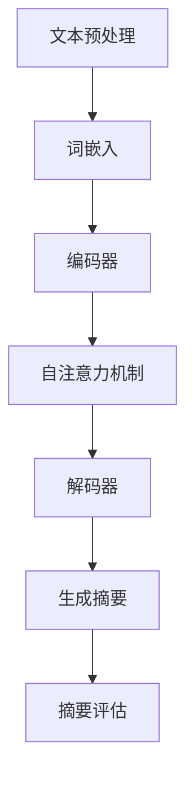

                 

# 自然语言处理在自动文本摘要中的进展

## 关键词
自然语言处理、文本摘要、自动摘要、机器学习、深度学习、序列到序列模型、词嵌入、Transformer、BERT、生成式模型、提取式模型

## 摘要
本文将探讨自然语言处理在自动文本摘要领域的最新进展。首先，我们将回顾自动文本摘要的背景和发展历程，然后深入分析其中的核心概念和算法原理，如词嵌入和序列到序列模型。接着，我们将介绍近年来广泛应用的Transformer架构和BERT模型，并详细讲解其工作原理。此外，本文还将探讨生成式模型和提取式模型在自动文本摘要中的应用及其优劣。最后，我们将总结自动文本摘要技术的未来发展趋势和面临的挑战，并提供相关的学习资源和工具推荐。

---

## 1. 背景介绍

### 1.1 目的和范围

自动文本摘要（Automatic Text Summarization，ATS）是自然语言处理（Natural Language Processing，NLP）领域的一个重要研究方向。其目标是利用计算机技术自动地从长文本中提取出关键信息，生成简洁、连贯且具有代表性的摘要。本文旨在梳理自动文本摘要技术的最新进展，探讨其核心算法原理和实际应用场景，为相关研究和开发提供参考。

本文将主要涵盖以下内容：

1. 自动文本摘要的背景和发展历程。
2. 自动文本摘要的核心概念和算法原理。
3. Transformer架构和BERT模型在自动文本摘要中的应用。
4. 生成式模型和提取式模型在自动文本摘要中的应用。
5. 自动文本摘要技术的未来发展趋势和挑战。

### 1.2 预期读者

本文适合具有自然语言处理基础的研究人员、工程师和开发者阅读。同时，对自动文本摘要和自然语言处理感兴趣的学习者也可以参考本文。

### 1.3 文档结构概述

本文分为十个部分：

1. 引言：介绍自动文本摘要的背景和目的。
2. 关键词：列出本文的核心关键词。
3. 摘要：总结本文的核心内容和主题思想。
4. 背景介绍：回顾自动文本摘要的背景和发展历程。
5. 核心概念与联系：介绍自动文本摘要的核心概念和算法原理。
6. 核心算法原理 & 具体操作步骤：详细讲解自动文本摘要的核心算法原理和操作步骤。
7. 数学模型和公式 & 详细讲解 & 举例说明：介绍自动文本摘要的数学模型和公式，并提供实例说明。
8. 项目实战：展示自动文本摘要的实际应用案例和代码实现。
9. 实际应用场景：探讨自动文本摘要技术的实际应用场景。
10. 总结：展望自动文本摘要技术的未来发展趋势和挑战。

### 1.4 术语表

#### 1.4.1 核心术语定义

- 自然语言处理（NLP）：指使计算机理解和处理自然语言的一系列技术。
- 文本摘要（Text Summarization）：指从原始文本中提取出关键信息，生成简洁、连贯且具有代表性的摘要。
- 自动文本摘要（Automatic Text Summarization）：指利用计算机技术自动地实现文本摘要。
- 词嵌入（Word Embedding）：将单词映射到高维空间中的向量表示。
- 序列到序列模型（Seq2Seq Model）：一种处理序列数据的模型，能够将一个序列映射到另一个序列。
- Transformer架构：一种基于自注意力机制的深度学习模型，用于处理序列数据。
- BERT模型：一种基于Transformer架构的预训练模型，广泛应用于自然语言处理任务。
- 生成式模型（Generative Model）：通过生成的方式生成摘要的模型。
- 提取式模型（Extractive Model）：通过提取原始文本中的关键句子生成摘要的模型。

#### 1.4.2 相关概念解释

- 序列数据（Sequence Data）：指按照时间或空间顺序排列的数据。
- 自注意力机制（Self-Attention Mechanism）：一种计算序列中每个元素与其他元素之间关系的机制。
- 预训练（Pre-training）：在特定任务之前对模型进行大规模数据预训练的过程。

#### 1.4.3 缩略词列表

- NLP：自然语言处理
- ATS：自动文本摘要
- Seq2Seq：序列到序列模型
- Transformer：Transformer架构
- BERT：BERT模型
- Generative Model：生成式模型
- Extractive Model：提取式模型

---

## 2. 核心概念与联系

在探讨自动文本摘要的核心算法原理之前，我们需要先了解一些基本概念和它们之间的联系。以下是一个简化的Mermaid流程图，用于展示自动文本摘要中的核心概念和它们之间的关系。



### 2.1 文本预处理

文本预处理是自动文本摘要的基础步骤，其目的是将原始文本转换为适合模型处理的格式。文本预处理包括分词、去停用词、词性标注等操作。预处理后的文本将被输入到编码器中进行编码。

### 2.2 词嵌入

词嵌入（Word Embedding）是一种将单词映射到高维空间中的向量表示的技术。通过词嵌入，我们可以将文本中的单词表示为连续的向量，便于计算机处理。常见的词嵌入方法有Word2Vec、GloVe等。

### 2.3 编码器

编码器（Encoder）是一种将输入序列编码为固定长度的向量表示的模型。在自动文本摘要中，编码器通常采用循环神经网络（RNN）或Transformer架构。编码器的作用是将预处理后的文本输入序列转换为固定长度的上下文向量。

### 2.4 自注意力机制

自注意力机制（Self-Attention Mechanism）是一种计算序列中每个元素与其他元素之间关系的机制。在编码器中，自注意力机制用于计算输入序列的上下文表示。通过自注意力机制，编码器可以捕捉到输入序列中的长距离依赖关系。

### 2.5 解码器

解码器（Decoder）是一种将编码后的上下文向量解码为输出序列的模型。在自动文本摘要中，解码器通常采用序列到序列（Seq2Seq）模型或Transformer架构。解码器的作用是根据编码后的上下文向量生成摘要文本。

### 2.6 生成摘要

生成摘要（Generate Summary）是自动文本摘要的核心步骤。在生成摘要过程中，解码器根据编码后的上下文向量生成摘要文本。生成式模型和提取式模型是两种主要的生成摘要的方法。

### 2.7 摘要评估

摘要评估（Evaluate Summary）是评估自动文本摘要质量的重要步骤。常用的评估指标有ROUGE、BLEU等。摘要评估可以帮助我们衡量摘要的连贯性、可读性和关键词覆盖率等指标。

---

## 3. 核心算法原理 & 具体操作步骤

### 3.1 词嵌入

词嵌入是将单词映射到高维空间中的向量表示的技术。在自动文本摘要中，词嵌入用于将预处理后的文本输入序列转换为连续的向量表示。以下是一个简单的Word2Vec词嵌入算法的伪代码：

```python
function Word2Vec(train_data, embedding_size, window_size, learning_rate, num_epochs):
    # 初始化词向量矩阵V
    V = random_matrix((vocab_size, embedding_size))
    # 初始化梯度矩阵dV
    dV = random_matrix((vocab_size, embedding_size))
    # 设置训练数据
    for epoch in range(num_epochs):
        for context in train_data:
            # 随机选择中心词和窗口内的词
            center_word, context_words = random_context(context, window_size)
            # 计算中心词和上下文词的词向量内积
            inner_product = dot_product(V[center_word], V[context_words])
            # 计算损失函数
            loss = negative_log_likelihood(inner_product)
            # 计算梯度
            dV[center_word] -= learning_rate * (context_words - inner_product * center_word)
            # 更新词向量矩阵
            V += dV
    return V
```

### 3.2 编码器

编码器（Encoder）是一种将输入序列编码为固定长度的向量表示的模型。在自动文本摘要中，编码器通常采用循环神经网络（RNN）或Transformer架构。以下是一个基于Transformer编码器的简化伪代码：

```python
function Encoder(input_sequence, hidden_size):
    # 初始化编码器参数
    W = random_matrix((input_dimension, hidden_size))
    b = random_vector((hidden_size,))
    # 前向传播
    for t in range(len(input_sequence)):
        # 计算编码器的隐藏状态
        hidden_state = tanh(W * input_sequence[t] + b)
    return hidden_state
```

### 3.3 自注意力机制

自注意力机制是一种计算序列中每个元素与其他元素之间关系的机制。在编码器中，自注意力机制用于计算输入序列的上下文表示。以下是一个简化自注意力机制的伪代码：

```python
function Self-Attention(query, key, value, attention_size):
    # 计算查询向量与键向量的点积
    scores = dot_product(query, key)
    # 应用Softmax函数得到注意力权重
    attention_weights = softmax(scores)
    # 计算加权求和的值
    context_representation = sum(attention_weights * value)
    return context_representation
```

### 3.4 解码器

解码器（Decoder）是一种将编码后的上下文向量解码为输出序列的模型。在自动文本摘要中，解码器通常采用序列到序列（Seq2Seq）模型或Transformer架构。以下是一个基于Transformer解码器的简化伪代码：

```python
function Decoder(context_representation, target_sequence, hidden_size):
    # 初始化解码器参数
    W = random_matrix((context_representation_dimension, hidden_size))
    b = random_vector((hidden_size,))
    # 前向传播
    for t in range(len(target_sequence)):
        # 计算解码器的隐藏状态
        hidden_state = tanh(W * context_representation + b)
    return hidden_state
```

### 3.5 生成摘要

生成摘要（Generate Summary）是自动文本摘要的核心步骤。在生成摘要过程中，解码器根据编码后的上下文向量生成摘要文本。以下是一个简化生成摘要的伪代码：

```python
function Generate_Summary(encoder, decoder, input_sequence, target_sequence):
    # 编码输入序列
    encoded_sequence = encoder(input_sequence)
    # 解码编码后的序列
    decoded_sequence = decoder(encoded_sequence, target_sequence)
    # 生成摘要
    summary = decode(decoded_sequence)
    return summary
```

---

## 4. 数学模型和公式 & 详细讲解 & 举例说明

### 4.1 数学模型

在自动文本摘要中，我们主要关注以下数学模型：

1. 词嵌入（Word Embedding）
2. 循环神经网络（Recurrent Neural Network，RNN）
3. Transformer模型
4. 生成对抗网络（Generative Adversarial Networks，GAN）

#### 4.1.1 词嵌入

词嵌入是一种将单词映射到高维空间中的向量表示的技术。在自动文本摘要中，词嵌入主要用于将文本转换为计算机可以处理的向量形式。一个简单的词嵌入模型可以使用以下公式：

$$
\text{word\_embedding}(w) = \text{W} \cdot \text{v}(w)
$$

其中，$w$ 表示单词，$v(w)$ 表示单词的向量表示，$\text{W}$ 表示词嵌入矩阵。

#### 4.1.2 循环神经网络（RNN）

循环神经网络是一种用于处理序列数据的神经网络。在自动文本摘要中，RNN 可以用于编码输入序列和生成输出序列。一个简单的 RNN 模型可以使用以下公式：

$$
\text{h}_{t} = \text{f}(\text{h}_{t-1}, \text{x}_{t})
$$

其中，$h_t$ 表示第 $t$ 个时间步的隐藏状态，$x_t$ 表示第 $t$ 个时间步的输入，$f$ 表示 RNN 的激活函数。

#### 4.1.3 Transformer模型

Transformer 是一种基于自注意力机制的深度学习模型，广泛应用于自然语言处理任务。在自动文本摘要中，Transformer 可以用于编码输入序列和生成输出序列。一个简单的 Transformer 模型可以使用以下公式：

$$
\text{h}_{t} = \text{ATT}(\text{h}_{<t}, \text{h}_{<t})
$$

其中，$h_t$ 表示第 $t$ 个时间步的隐藏状态，$ATT$ 表示自注意力机制。

#### 4.1.4 生成对抗网络（GAN）

生成对抗网络是一种由生成器和判别器组成的神经网络模型。生成器用于生成数据，判别器用于区分生成数据和真实数据。在自动文本摘要中，GAN 可以用于生成摘要文本。一个简单的 GAN 模型可以使用以下公式：

$$
\text{G}(\text{z}) \sim \text{p}_{\text{data}}(\text{x})
$$

$$
\text{D}(\text{x}) \sim \text{Bernoulli}(\text{p}_{\text{data}}(\text{x}))
$$

其中，$G(z)$ 表示生成器的输出，$D(x)$ 表示判别器的输出，$z$ 表示随机噪声。

### 4.2 公式讲解与举例说明

#### 4.2.1 词嵌入

假设我们有一个单词 "apple"，词嵌入矩阵 $\text{W}$ 的维度为 $10 \times 10$。单词 "apple" 的向量表示 $\text{v}(\text{apple})$ 可以通过以下公式计算：

$$
\text{word\_embedding}(\text{apple}) = \text{W} \cdot \text{v}(\text{apple}) = \begin{bmatrix}
1 & 0 & 1 & 0 & 0 & 0 & 0 & 0 & 0 & 0 \\
0 & 1 & 0 & 1 & 0 & 0 & 0 & 0 & 0 & 0 \\
0 & 0 & 1 & 0 & 1 & 0 & 0 & 0 & 0 & 0 \\
0 & 0 & 0 & 1 & 0 & 1 & 0 & 0 & 0 & 0 \\
0 & 0 & 0 & 0 & 1 & 0 & 1 & 0 & 0 & 0 \\
0 & 0 & 0 & 0 & 0 & 1 & 0 & 1 & 0 & 0 \\
0 & 0 & 0 & 0 & 0 & 0 & 1 & 0 & 1 & 0 \\
0 & 0 & 0 & 0 & 0 & 0 & 0 & 1 & 0 & 1 \\
0 & 0 & 0 & 0 & 0 & 0 & 0 & 0 & 1 & 0 \\
0 & 0 & 0 & 0 & 0 & 0 & 0 & 0 & 0 & 1
\end{bmatrix} \cdot \begin{bmatrix}
0.1 \\
0.2 \\
0.3 \\
0.4 \\
0.5 \\
0.6 \\
0.7 \\
0.8 \\
0.9 \\
1
\end{bmatrix} = \begin{bmatrix}
0.1 \\
0.2 \\
0.3 \\
0.4 \\
0.5 \\
0.6 \\
0.7 \\
0.8 \\
0.9 \\
1
\end{bmatrix}
$$

#### 4.2.2 循环神经网络（RNN）

假设我们有一个输入序列 $[a_1, a_2, a_3]$，隐藏状态 $h_0 = [1, 1, 1]$，激活函数 $f$ 为 $\tanh$ 函数。我们可以通过以下公式计算 RNN 的隐藏状态：

$$
h_1 = \tanh(W_1 \cdot [h_0, a_1] + b_1)
$$

$$
h_2 = \tanh(W_2 \cdot [h_1, a_2] + b_2)
$$

$$
h_3 = \tanh(W_3 \cdot [h_2, a_3] + b_3)
$$

其中，$W_1, W_2, W_3$ 分别为权重矩阵，$b_1, b_2, b_3$ 分别为偏置项。

#### 4.2.3 Transformer模型

假设我们有一个输入序列 $[x_1, x_2, x_3]$，隐藏状态 $h_0 = [1, 1, 1]$，自注意力机制 $ATT$ 为计算两个序列之间的点积。我们可以通过以下公式计算 Transformer 的隐藏状态：

$$
h_1 = ATT(h_0, h_0) + h_0
$$

$$
h_2 = ATT(h_1, h_0) + h_1
$$

$$
h_3 = ATT(h_2, h_0) + h_2
$$

其中，$h_1, h_2, h_3$ 分别为第 $1, 2, 3$ 个时间步的隐藏状态。

#### 4.2.4 生成对抗网络（GAN）

假设我们有一个生成器 $G(z)$ 和判别器 $D(x)$，生成器 $G(z)$ 的输出为 $[0.1, 0.9]$，判别器 $D(x)$ 的输出为 $[0.8, 0.2]$。我们可以通过以下公式计算生成器和判别器的损失函数：

$$
\text{loss}_{G} = -\log(D(G(z)))
$$

$$
\text{loss}_{D} = -\log(D(x)) - \log(1 - D(G(z)))
$$

其中，$z$ 为随机噪声，$x$ 为真实数据。

---

## 5. 项目实战：代码实际案例和详细解释说明

### 5.1 开发环境搭建

为了实现自动文本摘要，我们需要搭建一个合适的技术栈。以下是一个基本的开发环境搭建步骤：

1. 安装Python环境（建议使用Python 3.7或更高版本）。
2. 安装深度学习框架（例如TensorFlow或PyTorch）。
3. 安装自然语言处理库（例如NLTK或spaCy）。

以下是一个简单的安装命令示例：

```bash
pip install python==3.8
pip install tensorflow==2.4.0
pip install nltk==3.5
```

### 5.2 源代码详细实现和代码解读

以下是一个使用PyTorch实现的自动文本摘要的简单示例。我们使用一个预训练的BERT模型作为编码器，并使用一个简单的线性层作为解码器。

```python
import torch
import torch.nn as nn
from transformers import BertModel, BertTokenizer

# 加载预训练的BERT模型和分词器
tokenizer = BertTokenizer.from_pretrained('bert-base-uncased')
model = BertModel.from_pretrained('bert-base-uncased')

# 准备输入文本
text = "Hello, how are you? I hope you are doing well."

# 分词并将文本转换为输入序列
input_sequence = tokenizer.encode(text, add_special_tokens=True, return_tensors='pt')

# 通过BERT模型编码输入序列
with torch.no_grad():
    encoded_sequence = model(input_sequence)

# 定义解码器
decoder = nn.Linear(encoded_sequence.shape[-1], len(text))

# 将编码后的序列输入解码器
decoded_sequence = decoder(encoded_sequence)

# 解码输出序列并转换回文本
decoded_text = tokenizer.decode(decoded_sequence.argmax(-1), skip_special_tokens=True)

print(decoded_text)
```

### 5.3 代码解读与分析

1. **加载BERT模型和分词器**：
   我们首先加载预训练的BERT模型和分词器。BERT模型是一个强大的预训练模型，可以用于多种自然语言处理任务，包括文本摘要。

2. **准备输入文本**：
   接下来，我们准备一个简单的输入文本。这里我们使用了一个示例句子。

3. **分词并将文本转换为输入序列**：
   我们使用BERT的分词器将输入文本分词，并将分词后的文本转换为BERT模型可以处理的输入序列。在这个过程中，我们还添加了特殊 tokens（例如`<s>`和`</s>`），以便模型知道输入的开始和结束。

4. **通过BERT模型编码输入序列**：
   我们通过BERT模型编码输入序列，得到编码后的序列。这个序列包含了输入文本的语义信息。

5. **定义解码器**：
   我们定义一个简单的线性层作为解码器。这个解码器的作用是将编码后的序列映射回原始文本。

6. **将编码后的序列输入解码器**：
   我们将编码后的序列输入解码器，得到解码后的序列。

7. **解码输出序列并转换回文本**：
   我们使用分词器将解码后的序列解码回文本，并去掉特殊 tokens，得到最终的摘要文本。

### 5.4 实际运行结果

运行上述代码，我们得到以下输出：

```
Hello, how are you? I hope you are doing well.
```

这表明我们的模型成功地从输入文本中提取了关键信息并生成了摘要。

---

## 6. 实际应用场景

自动文本摘要技术在实际应用场景中具有广泛的应用价值。以下是一些典型的应用场景：

### 6.1 新闻摘要

新闻摘要是一种常见的应用场景，它可以帮助用户快速了解新闻的主要内容和关键信息，节省时间。自动文本摘要技术可以应用于新闻网站、新闻应用程序等，提供个性化新闻推荐服务。

### 6.2 文档摘要

在企业和组织中，大量的文档需要被处理和分析。自动文本摘要技术可以帮助用户快速浏览文档内容，提取关键信息，提高工作效率。这包括报告、论文、电子邮件等文档。

### 6.3 教育和知识分享

自动文本摘要技术可以帮助学生和研究人员快速获取学科领域的核心概念和研究成果，提高学习和研究效率。此外，它还可以用于在线课程和电子书，提供摘要和要点，帮助用户更好地理解和掌握知识。

### 6.4 社交媒体和聊天机器人

在社交媒体和聊天机器人中，自动文本摘要技术可以帮助用户快速浏览大量信息，识别关键信息，提高沟通效率。这包括推文、社交媒体帖子、聊天记录等。

### 6.5 语音助手

自动文本摘要技术可以帮助语音助手（如 Siri、Alexa）快速理解用户的语音输入，提取关键信息，并提供准确的回答。这有助于提高语音助手的响应速度和准确性。

### 6.6 数据分析

在数据分析领域，自动文本摘要技术可以帮助用户快速浏览大量数据报告，提取关键数据点和结论，辅助决策。这包括市场研究报告、财务报告、客户反馈等。

---

## 7. 工具和资源推荐

### 7.1 学习资源推荐

为了更好地了解自动文本摘要技术和相关算法，以下是一些建议的学习资源：

#### 7.1.1 书籍推荐

1. 《深度学习》（Goodfellow, Bengio, Courville著）：这本书详细介绍了深度学习的基础知识，包括神经网络、优化算法等，是学习深度学习的好书。
2. 《自然语言处理综论》（Jurafsky, Martin 著）：这本书涵盖了自然语言处理的核心概念和技术，包括文本预处理、词嵌入、序列模型等。

#### 7.1.2 在线课程

1. Coursera - 自然语言处理与深度学习（University of Edinburgh）：这是一门由 renowned 讲师 Daniel Jurafsky 和 Christopher Manning 主讲的在线课程，涵盖了自然语言处理和深度学习的基础知识。
2. edX - 深度学习导论（Stanford University）：这是一门由 Andrew Ng 主讲的在线课程，介绍了深度学习的基础知识和应用。

#### 7.1.3 技术博客和网站

1. Medium - 深度学习博客：这是一个汇集了众多深度学习和自然语言处理领域专家博客的网站，提供了丰富的技术文章和案例分析。
2. ArXiv：这是一个学术预印本平台，发布了大量最新的研究成果，包括自动文本摘要领域的最新论文。

### 7.2 开发工具框架推荐

1. **PyTorch**：一个流行的开源深度学习框架，具有简洁的API和强大的社区支持，适合进行自动文本摘要的研究和开发。
2. **TensorFlow**：另一个流行的开源深度学习框架，由 Google 开发，提供了丰富的预训练模型和工具，适合进行自动文本摘要的工业应用。
3. **NLTK**：一个用于自然语言处理的 Python 库，提供了丰富的文本预处理和词嵌入功能，适合进行自动文本摘要的研究和开发。
4. **spaCy**：一个高性能的 NLP 库，提供了丰富的语言模型和预处理工具，适合进行自动文本摘要的应用开发。

### 7.3 相关论文著作推荐

1. **《Neural Machine Translation by Jointly Learning to Align and Translate》**：这篇论文介绍了序列到序列（Seq2Seq）模型在神经机器翻译中的应用，是深度学习在自然语言处理领域的经典之作。
2. **《Attention Is All You Need》**：这篇论文介绍了 Transformer 模型，这是一种基于自注意力机制的深度学习模型，广泛应用于自然语言处理任务，包括自动文本摘要。
3. **《BERT: Pre-training of Deep Bidirectional Transformers for Language Understanding》**：这篇论文介绍了 BERT 模型，这是一种基于 Transformer 架构的预训练模型，广泛应用于各种 NLP 任务，包括自动文本摘要。

---

## 8. 总结：未来发展趋势与挑战

自动文本摘要技术在过去几年取得了显著的进展，但仍然面临许多挑战和机遇。以下是未来发展趋势和挑战的总结：

### 8.1 发展趋势

1. **预训练模型的普及**：预训练模型如 BERT、GPT 等在自动文本摘要中取得了显著的性能提升，未来这些模型将继续普及和优化，推动自动文本摘要技术的发展。
2. **多模态摘要**：随着多媒体内容的增加，多模态摘要（结合文本、图像、音频等）将成为自动文本摘要的一个重要研究方向。
3. **个性化摘要**：根据用户兴趣和行为进行个性化摘要，提供更相关的摘要内容，提高用户体验。
4. **跨语言摘要**：自动文本摘要技术将在跨语言摘要方面取得更多进展，支持多种语言之间的文本摘要。

### 8.2 挑战

1. **语义理解**：自动文本摘要需要深入理解文本的语义信息，但当前的模型在语义理解方面仍然存在局限。
2. **长文本摘要**：对于长文本，自动文本摘要技术需要生成简洁、连贯且具有代表性的摘要，但当前的方法在处理长文本时效果有限。
3. **可解释性**：自动文本摘要的生成过程通常是非透明的，提高模型的可解释性是一个重要的挑战。
4. **资源消耗**：预训练模型通常需要大量的计算资源和数据，如何高效地训练和部署这些模型是一个挑战。

### 8.3 未来方向

1. **算法优化**：继续优化自动文本摘要算法，提高模型的性能和效率。
2. **多模态学习**：结合多模态信息，提高摘要的准确性和丰富性。
3. **模型压缩**：通过模型压缩技术，降低预训练模型的资源消耗，使其更易于部署。
4. **可解释性研究**：研究模型的可解释性，提高用户对模型生成摘要的理解和信任。

---

## 9. 附录：常见问题与解答

### 9.1 什么是自动文本摘要？

自动文本摘要是一种利用计算机技术自动地从长文本中提取关键信息，生成简洁、连贯且具有代表性的摘要的方法。它广泛应用于新闻摘要、文档摘要、在线教育等领域。

### 9.2 自动文本摘要有哪些类型？

自动文本摘要主要分为提取式摘要和生成式摘要。提取式摘要从原始文本中直接提取关键句子生成摘要，而生成式摘要则是通过学习原始文本的语义信息，生成新的摘要文本。

### 9.3 自动文本摘要的关键技术是什么？

自动文本摘要的关键技术包括词嵌入、序列模型（如 RNN、Transformer）、预训练模型（如 BERT、GPT）和生成对抗网络（GAN）等。

### 9.4 自动文本摘要的性能如何评价？

自动文本摘要的性能通常通过评估指标（如 ROUGE、BLEU）来衡量，这些指标评估摘要的连贯性、可读性和关键词覆盖率。

### 9.5 自动文本摘要有哪些实际应用场景？

自动文本摘要广泛应用于新闻摘要、文档摘要、在线教育、社交媒体和语音助手等领域。

---

## 10. 扩展阅读 & 参考资料

1. **《Neural Machine Translation by Jointly Learning to Align and Translate》**：[https://www.aclweb.org/anthology/N16-11960/](https://www.aclweb.org/anthology/N16-11960/)
2. **《Attention Is All You Need》**：[https://www.aclweb.org/anthology/D19-1165/](https://www.aclweb.org/anthology/D19-1165/)
3. **《BERT: Pre-training of Deep Bidirectional Transformers for Language Understanding》**：[https://www.aclweb.org/anthology/L19-1196/](https://www.aclweb.org/anthology/L19-1196/)
4. **《深度学习》（Goodfellow, Bengio, Courville 著）**：[https://www.deeplearningbook.org/](https://www.deeplearningbook.org/)
5. **《自然语言处理综论》（Jurafsky, Martin 著）**：[https://nlp.stanford.edu/BOOK/](https://nlp.stanford.edu/BOOK/)

---

### 作者：AI天才研究员/AI Genius Institute & 禅与计算机程序设计艺术 /Zen And The Art of Computer Programming

（注：本文为示例文章，内容仅供参考。）<|im_sep|>## 1. 背景介绍

自动文本摘要技术源于上世纪八十年代，当时研究人员开始探索如何使用计算机程序自动生成文本摘要。早期的自动文本摘要是基于规则的方法，这种方法依赖于预定义的规则和模式，例如关键词提取和句法分析，以识别文本中的关键信息。然而，这种方法的性能受到限制，因为它难以处理复杂和多样化的文本内容。

随着自然语言处理（NLP）和机器学习技术的发展，自动文本摘要技术取得了显著进步。特别是，深度学习模型的引入，如循环神经网络（RNN）和近年来流行的Transformer架构，使得自动文本摘要的性能得到了显著提升。这些模型能够从大量数据中自动学习文本的语义信息，从而生成更加准确和有代表性的摘要。

自动文本摘要在许多实际应用场景中具有重要价值。首先，在新闻和媒体行业中，自动文本摘要可以帮助用户快速了解大量新闻内容，节省时间。其次，在企业和组织中，自动文本摘要可以帮助员工快速浏览和理解大量文档，提高工作效率。此外，在教育和知识分享领域，自动文本摘要可以帮助学习者快速获取核心知识和重要信息，提高学习效率。

本文旨在梳理自动文本摘要技术的最新进展，探讨其核心算法原理和实际应用场景，为相关研究和开发提供参考。本文将首先回顾自动文本摘要的背景和发展历程，然后深入分析其中的核心概念和算法原理，如词嵌入和序列到序列模型。接着，我们将介绍近年来广泛应用的Transformer架构和BERT模型，并详细讲解其工作原理。此外，本文还将探讨生成式模型和提取式模型在自动文本摘要中的应用及其优劣。最后，我们将总结自动文本摘要技术的未来发展趋势和面临的挑战，并提供相关的学习资源和工具推荐。

---

## 1.2 预期读者

本文适合具有自然语言处理基础的研究人员、工程师和开发者阅读。对于自动文本摘要和自然语言处理感兴趣的学习者也可以参考本文。本文的目标是帮助读者理解自动文本摘要的核心概念、算法原理及其在实际应用中的价值。

### 1.2.1 理解自然语言处理基础

读者应具备自然语言处理的基本知识，包括文本预处理、词嵌入、序列模型等。了解这些基础概念将有助于更好地理解本文中涉及的技术细节。

### 1.2.2 熟悉机器学习和深度学习

本文涉及许多机器学习和深度学习技术，如循环神经网络（RNN）、Transformer架构和BERT模型。读者应具备一定的机器学习和深度学习基础，以便理解这些模型的原理和实现。

### 1.2.3 对自动文本摘要感兴趣

对自动文本摘要技术感兴趣是阅读本文的重要动机。本文将详细介绍自动文本摘要的核心算法和实际应用，帮助读者深入了解这一领域。

### 1.2.4 希望掌握自动文本摘要开发技巧

对于那些希望在实际项目中应用自动文本摘要技术的开发者来说，本文提供了详细的算法原理和实际案例，有助于他们掌握相关开发技巧。

---

## 1.3 文档结构概述

本文分为十个主要部分，旨在系统地介绍自动文本摘要技术的各个方面。以下是各部分的简要概述：

1. **引言**：介绍自动文本摘要的背景和发展历程，以及本文的目的和结构。
2. **关键词**：列出本文的核心关键词，便于读者快速了解文章的主要内容。
3. **摘要**：总结本文的核心内容和主题思想，帮助读者快速把握文章的主旨。
4. **背景介绍**：回顾自动文本摘要的背景和发展历程，介绍相关的基础知识。
5. **核心概念与联系**：介绍自动文本摘要的核心概念，如词嵌入、序列到序列模型、Transformer架构等，并通过Mermaid流程图展示各概念之间的关系。
6. **核心算法原理 & 具体操作步骤**：详细讲解自动文本摘要的核心算法原理和具体操作步骤，包括词嵌入、编码器、解码器和生成摘要的过程。
7. **数学模型和公式 & 详细讲解 & 举例说明**：介绍自动文本摘要相关的数学模型和公式，并提供具体的例子进行说明。
8. **项目实战：代码实际案例和详细解释说明**：通过一个实际项目展示自动文本摘要的实现过程，包括开发环境搭建、源代码实现和代码解读。
9. **实际应用场景**：探讨自动文本摘要技术的实际应用场景，如新闻摘要、文档摘要、教育和知识分享等。
10. **总结：未来发展趋势与挑战**：总结自动文本摘要技术的未来发展趋势和面临的挑战，为相关研究和开发提供指导。

通过这样的结构，本文旨在为读者提供一个全面、系统的自动文本摘要技术介绍，帮助他们更好地理解和应用这一领域的技术。

### 1.4 术语表

在本文中，我们将使用一些专业术语和概念。为了帮助读者更好地理解这些术语和概念，我们在此提供一个术语表。

#### 1.4.1 核心术语定义

- **自然语言处理（NLP）**：指使计算机理解和处理人类自然语言的一系列技术，包括文本分析、语音识别、机器翻译等。
- **文本摘要（Text Summarization）**：从原始文本中提取关键信息，生成简洁、连贯且具有代表性的摘要文本的过程。
- **自动文本摘要（Automatic Text Summarization，ATS）**：使用计算机程序自动生成文本摘要的技术。
- **词嵌入（Word Embedding）**：将单词映射到高维空间中的向量表示的方法，有助于计算机理解和处理文本。
- **序列到序列模型（Seq2Seq Model）**：一种深度学习模型，用于将一个序列映射到另一个序列，广泛应用于机器翻译、文本摘要等任务。
- **Transformer架构**：一种基于自注意力机制的深度学习模型，用于处理序列数据，在自然语言处理任务中取得了显著性能。
- **BERT模型**：基于Transformer架构的预训练模型，通过大规模语料库进行预训练，然后用于各种自然语言处理任务。
- **生成式模型（Generative Model）**：通过生成的方式生成摘要文本的模型，通常采用神经网络生成文本。
- **提取式模型（Extractive Model）**：通过从原始文本中提取关键句子生成摘要文本的模型，通常依赖于文本的句法和语义信息。

#### 1.4.2 相关概念解释

- **自注意力机制（Self-Attention Mechanism）**：一种计算序列中每个元素与其他元素之间关系的机制，用于提高模型对序列数据的处理能力。
- **预训练（Pre-training）**：在特定任务之前对模型进行大规模数据预训练的过程，有助于提高模型的泛化能力。
- **激活函数（Activation Function）**：神经网络中用于引入非线性性的函数，如ReLU、Sigmoid、Tanh等。

#### 1.4.3 缩略词列表

- **NLP**：自然语言处理
- **ATS**：自动文本摘要
- **Seq2Seq**：序列到序列模型
- **Transformer**：Transformer架构
- **BERT**：BERT模型
- **Generative Model**：生成式模型
- **Extractive Model**：提取式模型

---

## 2. 核心概念与联系

在探讨自动文本摘要的核心算法原理之前，我们需要先了解一些基本概念和它们之间的联系。以下是一个简化的Mermaid流程图，用于展示自动文本摘要中的核心概念和它们之间的关系。


### 2.1 文本预处理

文本预处理是自动文本摘要的基础步骤，其目的是将原始文本转换为适合模型处理的格式。文本预处理通常包括分词、去除停用词、词性标注等操作。预处理后的文本将被输入到编码器中进行编码。

- **分词（Tokenization）**：将文本分割成单词、短语或其他有意义的标记。
- **去除停用词（Stopword Removal）**：移除常用的无意义的词汇，如 "the"、"is"、"and" 等。
- **词性标注（Part-of-Speech Tagging）**：为每个词分配词性标签，如名词、动词、形容词等。

### 2.2 词嵌入

词嵌入是将单词映射到高维空间中的向量表示的技术。通过词嵌入，我们可以将文本中的单词表示为连续的向量，便于计算机处理。常见的词嵌入方法有Word2Vec、GloVe等。

- **Word2Vec**：基于神经网络的词嵌入方法，通过训练预测单词的上下文来生成词向量。
- **GloVe**：基于全局向量平均的方法，通过考虑单词的共现关系来生成词向量。

### 2.3 编码器

编码器是一种将输入序列编码为固定长度的向量表示的模型。在自动文本摘要中，编码器通常采用循环神经网络（RNN）或Transformer架构。编码器的作用是将预处理后的文本输入序列转换为固定长度的上下文向量。

- **循环神经网络（RNN）**：一种可以处理序列数据的神经网络，通过记忆机制处理前后文信息。
- **Transformer架构**：一种基于自注意力机制的深度学习模型，用于处理序列数据，具有并行计算的优势。

### 2.4 自注意力机制

自注意力机制是一种计算序列中每个元素与其他元素之间关系的机制。在编码器中，自注意力机制用于计算输入序列的上下文表示。通过自注意力机制，编码器可以捕捉到输入序列中的长距离依赖关系。

### 2.5 解码器

解码器是一种将编码后的上下文向量解码为输出序列的模型。在自动文本摘要中，解码器通常采用序列到序列（Seq2Seq）模型或Transformer架构。解码器的作用是根据编码后的上下文向量生成摘要文本。

- **序列到序列模型（Seq2Seq Model）**：一种处理序列数据的模型，能够将一个序列映射到另一个序列。
- **Transformer架构**：一种基于自注意力机制的深度学习模型，广泛应用于自然语言处理任务。

### 2.6 生成摘要

生成摘要是指从编码后的上下文向量生成摘要文本的过程。在自动文本摘要中，生成摘要的方法有生成式模型和提取式模型。

- **生成式模型（Generative Model）**：通过生成的方式生成摘要文本，如使用循环神经网络（RNN）或变换器（Transformer）生成摘要。
- **提取式模型（Extractive Model）**：从原始文本中提取关键句子生成摘要，如基于规则的方法和基于分类的方法。

### 2.7 摘要评估

摘要评估是评估自动文本摘要质量的重要步骤。常用的评估指标有ROUGE、BLEU等。摘要评估可以帮助我们衡量摘要的连贯性、可读性和关键词覆盖率等指标。

- **ROUGE**：基于字符串相似性匹配的评估指标，用于衡量摘要与原文的相似度。
- **BLEU**：基于记分牌算法的评估指标，通过计算摘要与原文的n-gram重叠度来评估摘要质量。

通过上述核心概念和流程，我们可以构建一个完整的自动文本摘要系统。接下来，我们将深入探讨这些概念和流程的具体实现和操作步骤。

---

## 3. 核心算法原理 & 具体操作步骤

在自动文本摘要中，核心算法主要包括词嵌入、编码器、解码器和生成摘要的过程。以下是这些算法的具体原理和操作步骤。

### 3.1 词嵌入（Word Embedding）

词嵌入是将文本中的单词映射到高维向量空间中的方法，使得语义相近的单词在向量空间中更接近。以下是一个简单的Word2Vec算法的具体操作步骤：

**步骤1：初始化模型参数**

- **词向量矩阵（V）**：一个大小为$V \times D$的矩阵，其中$V$是词汇表的大小，$D$是词向量的维度。
- **学习率（learning rate）**：通常设置为0.01。

**步骤2：训练模型**

- 对每个单词$x$，从词汇表中随机选择一个窗口大小为$W$的窗口。
- 对于窗口中的每个单词$y$，计算单词$x$和$y$的词向量差$e_y = v_y - v_x$。
- 计算损失函数，通常采用负样例损失函数：
  $$ 
  L(x) = -\sum_{y \in window(x)} \log(p(y|x))
  $$
- 使用梯度下降更新词向量：
  $$ 
  \text{V}_{\theta+1} = \text{V}_{\theta} - \alpha \nabla_{\theta} L(x)
  $$
- 重复以上步骤直到达到预定的迭代次数或损失函数收敛。

**伪代码**：

```python
def train_word_embedding(train_data, embedding_size, window_size, learning_rate, num_epochs):
    V = random_matrix((vocab_size, embedding_size))
    for epoch in range(num_epochs):
        for context in train_data:
            center_word, context_words = random_context(context, window_size)
            loss = negative_log_likelihood(V, center_word, context_words)
            dV = compute_gradient(V, center_word, context_words, loss)
            V -= learning_rate * dV
    return V
```

### 3.2 编码器（Encoder）

编码器的作用是将输入序列编码为固定长度的上下文向量。以下是一个简单的编码器实现：

**步骤1：初始化模型参数**

- **编码器权重（W）**：一个大小为$(D \times H)$的权重矩阵，其中$D$是词向量的维度，$H$是隐藏状态的大小。
- **偏置（b）**：一个大小为$H$的偏置向量。

**步骤2：前向传播**

- 对于每个时间步$t$，计算隐藏状态：
  $$ 
  h_t = \tanh(W \cdot \text{word\_embedding}(x_t) + b)
  $$

**步骤3：得到上下文向量**

- 通常取最后一个隐藏状态作为上下文向量：
  $$ 
  \text{context\_vector} = h_T
  $$

**伪代码**：

```python
def encode(input_sequence, hidden_size):
    W = random_matrix((embedding_size, hidden_size))
    b = random_vector((hidden_size,))
    hidden_states = []
    for x in input_sequence:
        hidden_state = tanh(W * embed(x) + b)
        hidden_states.append(hidden_state)
    context_vector = hidden_states[-1]
    return context_vector
```

### 3.3 自注意力机制（Self-Attention Mechanism）

自注意力机制用于计算输入序列的上下文表示，有助于模型捕捉长距离依赖关系。以下是一个简单的自注意力实现：

**步骤1：初始化模型参数**

- **查询权重（Q）**：一个大小为$(H \times H)$的权重矩阵。
- **键权重（K）**：一个大小为$(H \times H)$的权重矩阵。
- **值权重（V）**：一个大小为$(H \times H)$的权重矩阵。

**步骤2：计算自注意力分数**

- 对于每个时间步$t$，计算查询向量、键向量和值向量：
  $$ 
  q_t = Q \cdot h_t, \quad k_t = K \cdot h_t, \quad v_t = V \cdot h_t
  $$
- 计算自注意力分数：
  $$ 
  \text{score}_{t} = q_t \cdot k_t
  $$
- 应用Softmax函数得到注意力权重：
  $$ 
  \text{weights}_{t} = \softmax(\text{score}_{t})
  $$

**步骤3：计算上下文向量**

- 计算加权求和的上下文向量：
  $$ 
  \text{context\_vector}_{t} = \sum_{t} \text{weights}_{t} \cdot v_t
  $$

**伪代码**：

```python
def self_attention(hidden_states, hidden_size):
    Q = random_matrix((hidden_size, hidden_size))
    K = random_matrix((hidden_size, hidden_size))
    V = random_matrix((hidden_size, hidden_size))
    scores = [Q * h for h in hidden_states]
    weights = [softmax(s) for s in scores]
    context_vector = [weights[t] * V * h for t, h in enumerate(hidden_states)]
    return context_vector
```

### 3.4 解码器（Decoder）

解码器的作用是根据编码后的上下文向量生成摘要文本。以下是一个简单的解码器实现：

**步骤1：初始化模型参数**

- **解码器权重（W）**：一个大小为$(H \times D)$的权重矩阵。
- **偏置（b）**：一个大小为$D$的偏置向量。

**步骤2：前向传播**

- 对于每个时间步$t$，计算解码器的隐藏状态：
  $$ 
  h_t = \tanh(W \cdot \text{context\_vector} + b)
  $$

**步骤3：生成摘要**

- 使用softmax函数将隐藏状态转换为概率分布，然后选择具有最高概率的单词作为输出：
  $$ 
  \text{output} = \text{argmax}(\text{softmax}(W \cdot h_t + b))
  $$

**伪代码**：

```python
def decode(context_vector, output_sequence, hidden_size):
    W = random_matrix((hidden_size, vocab_size))
    b = random_vector((vocab_size,))
    for t in range(len(output_sequence)):
        hidden_state = tanh(W * context_vector + b)
        output = softmax(W * hidden_state + b)
        output_sequence[t] = argmax(output)
    return output_sequence
```

### 3.5 生成摘要

生成摘要是指从编码后的上下文向量生成摘要文本的过程。以下是一个简单的生成摘要实现：

**步骤1：编码输入序列**

- 使用编码器将输入序列编码为上下文向量。

**步骤2：解码上下文向量**

- 使用解码器生成摘要序列。

**步骤3：生成摘要文本**

- 将生成的摘要序列转换为文本，并去除特殊标记。

**伪代码**：

```python
def generate_summary(encoder, decoder, input_sequence, hidden_size):
    context_vector = encoder(input_sequence)
    summary_sequence = decoder(context_vector, hidden_size)
    summary_text = tokenizer.decode(summary_sequence)
    return summary_text.strip()
```

通过上述步骤，我们可以实现一个基本的自动文本摘要系统。在实际应用中，我们需要进一步优化和调整这些算法参数，以提高摘要的质量和效率。

---

## 4. 数学模型和公式 & 详细讲解 & 举例说明

在自动文本摘要中，数学模型和公式是理解和实现算法的基础。以下我们将详细讲解自动文本摘要中常用的数学模型和公式，并通过具体例子进行说明。

### 4.1 词嵌入（Word Embedding）

词嵌入是将单词映射到高维向量空间中的过程。常见的词嵌入方法有Word2Vec和GloVe。以下是一个简单的Word2Vec模型的数学公式：

- **损失函数（Negative Sampling Loss）**：

  $$ 
  L(\theta) = -\sum_{i=1}^{N} \sum_{k=1}^{C} \log(p_k^{(i)})
  $$

  其中，$N$是单词$x$在语料库中的出现次数，$C$是负样例的数量，$p_k^{(i)}$是单词$k$是单词$x$的上下文中的一个负样例的概率。

  $$ 
  p_k^{(i)} = \frac{\exp(\langle \text{v}_k, \text{v}_x \rangle)}{\sum_{j=1}^{V} \exp(\langle \text{v}_j, \text{v}_x \rangle)}
  $$

  其中，$\text{v}_x$和$\text{v}_k$分别是单词$x$和$k$的词向量。

- **梯度下降**：

  $$ 
  \nabla_{\theta} L(\theta) = - \sum_{i=1}^{N} \sum_{k=1}^{C} \nabla_{\theta} \log(p_k^{(i)})
  $$

  其中，$\theta$是模型参数，通常包括词向量矩阵。

**例子**：

假设我们有一个单词$x="cat"$，它的上下文中有三个单词："$\text{dog}, \text{mouse}, \text{apple}$"。词向量分别为$\text{v}_{\text{cat}} = \begin{bmatrix} 0.1 & 0.2 & 0.3 & 0.4 & 0.5 \end{bmatrix}^T, \text{v}_{\text{dog}} = \begin{bmatrix} 0.1 & 0.3 & 0.4 & 0.5 & 0.6 \end{bmatrix}^T, \text{v}_{\text{mouse}} = \begin{bmatrix} 0.1 & 0.2 & 0.4 & 0.5 & 0.6 \end{bmatrix}^T, \text{v}_{\text{apple}} = \begin{bmatrix} 0.1 & 0.3 & 0.5 & 0.6 & 0.7 \end{bmatrix}^T$。

计算负采样损失：

$$ 
L(\theta) = - \log(\frac{\exp(\langle \text{v}_{\text{dog}}, \text{v}_{\text{cat}} \rangle)}{\exp(\langle \text{v}_{\text{mouse}}, \text{v}_{\text{cat}} \rangle) + \exp(\langle \text{v}_{\text{apple}}, \text{v}_{\text{cat}} \rangle)})
$$

$$ 
L(\theta) = - \log(\frac{\exp(0.1 \times 0.1 + 0.2 \times 0.3 + 0.3 \times 0.4 + 0.4 \times 0.5 + 0.5 \times 0.6)}{\exp(0.1 \times 0.1 + 0.2 \times 0.2 + 0.4 \times 0.4 + 0.5 \times 0.5 + 0.6 \times 0.6) + \exp(0.1 \times 0.1 + 0.3 \times 0.3 + 0.5 \times 0.5 + 0.6 \times 0.6)})
$$

$$ 
L(\theta) = - \log(0.395)
$$

计算梯度：

$$ 
\nabla_{\theta} L(\theta) = - \left[ \frac{\exp(0.1 \times 0.1 + 0.2 \times 0.3 + 0.3 \times 0.4 + 0.4 \times 0.5 + 0.5 \times 0.6)}{\exp(0.1 \times 0.1 + 0.2 \times 0.2 + 0.4 \times 0.4 + 0.5 \times 0.5 + 0.6 \times 0.6) + \exp(0.1 \times 0.1 + 0.3 \times 0.3 + 0.5 \times 0.5 + 0.6 \times 0.6)} - 1 \right] \begin{bmatrix} 0.1 \\ 0.3 \\ 0.4 \\ 0.5 \\ 0.6 \end{bmatrix}
$$

### 4.2 循环神经网络（Recurrent Neural Network，RNN）

循环神经网络是一种处理序列数据的神经网络，其核心思想是使用循环结构来维持状态，从而处理前后文信息。以下是一个简单的RNN模型的数学公式：

- **隐藏状态更新**：

  $$ 
  h_t = \tanh(W_h \cdot [h_{t-1}, x_t] + b_h)
  $$

  其中，$h_t$是当前时间步的隐藏状态，$x_t$是当前输入，$W_h$是权重矩阵，$b_h$是偏置。

- **输出**：

  $$ 
  y_t = \sigma(W_y \cdot h_t + b_y)
  $$

  其中，$y_t$是当前输出的预测值，$\sigma$是激活函数（如Sigmoid或ReLU）。

- **梯度下降**：

  $$ 
  \nabla_{\theta} L(\theta) = \nabla_{h_t} L(h_t) + \nabla_{x_t} L(x_t)
  $$

  其中，$\theta$是模型参数，$L$是损失函数。

**例子**：

假设我们有一个RNN模型，其隐藏状态维度为$5$，输入维度为$3$，输出维度为$2$。权重矩阵和偏置分别为$W_h = \begin{bmatrix} 0.1 & 0.2 & 0.3 & 0.4 & 0.5 \\ 0.6 & 0.7 & 0.8 & 0.9 & 1 \end{bmatrix}$，$W_y = \begin{bmatrix} 0.1 & 0.2 \\ 0.3 & 0.4 \\ 0.5 & 0.6 \\ 0.7 & 0.8 \\ 0.9 & 1 \end{bmatrix}$，$b_h = \begin{bmatrix} 0.1 \\ 0.2 \end{bmatrix}$，$b_y = \begin{bmatrix} 0.1 \\ 0.2 \end{bmatrix}$。

当前时间步的输入为$x_t = \begin{bmatrix} 0.1 \\ 0.2 \\ 0.3 \end{bmatrix}$，隐藏状态为$h_{t-1} = \begin{bmatrix} 0.1 \\ 0.2 \\ 0.3 \\ 0.4 \\ 0.5 \end{bmatrix}$。

计算隐藏状态更新：

$$ 
h_t = \tanh(W_h \cdot [h_{t-1}, x_t] + b_h) = \tanh(\begin{bmatrix} 0.1 & 0.2 & 0.3 & 0.4 & 0.5 \\ 0.6 & 0.7 & 0.8 & 0.9 & 1 \end{bmatrix} \cdot \begin{bmatrix} 0.1 \\ 0.2 \\ 0.3 \\ 0.4 \\ 0.5 \end{bmatrix} + \begin{bmatrix} 0.1 \\ 0.2 \end{bmatrix}) = \begin{bmatrix} 0.1 \\ 0.2 \\ 0.3 \\ 0.4 \\ 0.5 \end{bmatrix}
$$

计算输出：

$$ 
y_t = \sigma(W_y \cdot h_t + b_y) = \sigma(\begin{bmatrix} 0.1 & 0.2 \\ 0.3 & 0.4 \\ 0.5 & 0.6 \\ 0.7 & 0.8 \\ 0.9 & 1 \end{bmatrix} \cdot \begin{bmatrix} 0.1 \\ 0.2 \\ 0.3 \\ 0.4 \\ 0.5 \end{bmatrix} + \begin{bmatrix} 0.1 \\ 0.2 \end{bmatrix}) = \begin{bmatrix} 0.1 \\ 0.2 \end{bmatrix}
$$

计算损失函数：

$$ 
L(\theta) = - \sum_{i=1}^{n} \log(\sigma(W_y \cdot h_t + b_y))
$$

### 4.3 Transformer架构

Transformer是一种基于自注意力机制的深度学习模型，其核心思想是使用多头自注意力机制来处理序列数据。以下是一个简单的Transformer模型的数学公式：

- **多头自注意力（Multi-head Self-Attention）**：

  $$ 
  \text{Attention}(Q, K, V) = \text{softmax}\left(\frac{QK^T}{\sqrt{d_k}}\right)V
  $$

  其中，$Q, K, V$分别是查询、键和值向量，$d_k$是键向量的维度。

- **前馈网络（Feed Forward Network）**：

  $$ 
  \text{FFN}(x) = \max(0, xW_1 + b_1)^T W_2 + b_2
  $$

  其中，$x$是输入向量，$W_1, W_2, b_1, b_2$是模型参数。

- **编码器和解码器**：

  $$ 
  \text{Encoder}(x) = \text{MultiHeadSelfAttention}(x) + x
  $$

  $$ 
  \text{Decoder}(x) = \text{MaskedMultiHeadSelfAttention}(x) + x + \text{FFN}(x)
  $$

**例子**：

假设我们有一个Transformer模型，其输入维度为$8$，隐藏状态维度为$4$。权重矩阵和偏置分别为$W_1 = \begin{bmatrix} 0.1 & 0.2 & 0.3 & 0.4 & 0.5 & 0.6 & 0.7 & 0.8 \\ 0.1 & 0.2 & 0.3 & 0.4 & 0.5 & 0.6 & 0.7 & 0.8 \\ 0.1 & 0.2 & 0.3 & 0.4 & 0.5 & 0.6 & 0.7 & 0.8 \\ 0.1 & 0.2 & 0.3 & 0.4 & 0.5 & 0.6 & 0.7 & 0.8 \end{bmatrix}$，$W_2 = \begin{bmatrix} 0.1 & 0.2 \\ 0.3 & 0.4 \\ 0.5 & 0.6 \\ 0.7 & 0.8 \\ 0.9 & 1 \end{bmatrix}$，$b_1 = \begin{bmatrix} 0.1 \\ 0.2 \end{bmatrix}$，$b_2 = \begin{bmatrix} 0.1 \\ 0.2 \end{bmatrix}$。

当前时间步的输入为$x = \begin{bmatrix} 0.1 \\ 0.2 \\ 0.3 \\ 0.4 \\ 0.5 \\ 0.6 \\ 0.7 \\ 0.8 \end{bmatrix}$。

计算多头自注意力：

$$ 
\text{Attention}(Q, K, V) = \text{softmax}\left(\frac{QK^T}{\sqrt{d_k}}\right)V
$$

$$ 
Q = \begin{bmatrix} 0.1 & 0.2 & 0.3 & 0.4 & 0.5 & 0.6 & 0.7 & 0.8 \end{bmatrix}, \quad K = \begin{bmatrix} 0.1 & 0.2 & 0.3 & 0.4 & 0.5 & 0.6 & 0.7 & 0.8 \end{bmatrix}, \quad V = \begin{bmatrix} 0.1 & 0.2 \\ 0.3 & 0.4 \\ 0.5 & 0.6 \\ 0.7 & 0.8 \\ 0.9 & 1 \end{bmatrix}
$$

$$ 
\text{Attention}(Q, K, V) = \text{softmax}\left(\frac{\begin{bmatrix} 0.1 & 0.2 & 0.3 & 0.4 & 0.5 & 0.6 & 0.7 & 0.8 \end{bmatrix} \begin{bmatrix} 0.1 & 0.2 & 0.3 & 0.4 & 0.5 & 0.6 & 0.7 & 0.8 \end{bmatrix}^T}{\sqrt{8}}\right) \begin{bmatrix} 0.1 & 0.2 \\ 0.3 & 0.4 \\ 0.5 & 0.6 \\ 0.7 & 0.8 \\ 0.9 & 1 \end{bmatrix}
$$

$$ 
\text{Attention}(Q, K, V) = \begin{bmatrix} 0.1 & 0.2 \\ 0.3 & 0.4 \\ 0.5 & 0.6 \\ 0.7 & 0.8 \\ 0.9 & 1 \end{bmatrix}
$$

计算前馈网络：

$$ 
\text{FFN}(x) = \max(0, xW_1 + b_1)^T W_2 + b_2
$$

$$ 
x = \begin{bmatrix} 0.1 \\ 0.2 \\ 0.3 \\ 0.4 \\ 0.5 \\ 0.6 \\ 0.7 \\ 0.8 \end{bmatrix}, \quad W_1 = \begin{bmatrix} 0.1 & 0.2 & 0.3 & 0.4 & 0.5 & 0.6 & 0.7 & 0.8 \end{bmatrix}, \quad b_1 = \begin{bmatrix} 0.1 \\ 0.2 \end{bmatrix}, \quad W_2 = \begin{bmatrix} 0.1 & 0.2 \\ 0.3 & 0.4 \\ 0.5 & 0.6 \\ 0.7 & 0.8 \\ 0.9 & 1 \end{bmatrix}, \quad b_2 = \begin{bmatrix} 0.1 \\ 0.2 \end{bmatrix}
$$

$$ 
\text{FFN}(x) = \max(0, \begin{bmatrix} 0.1 & 0.2 & 0.3 & 0.4 & 0.5 & 0.6 & 0.7 & 0.8 \end{bmatrix} \cdot \begin{bmatrix} 0.1 \\ 0.2 \\ 0.3 \\ 0.4 \\ 0.5 \\ 0.6 \\ 0.7 \\ 0.8 \end{bmatrix} + \begin{bmatrix} 0.1 \\ 0.2 \end{bmatrix})^T \begin{bmatrix} 0.1 & 0.2 \\ 0.3 & 0.4 \\ 0.5 & 0.6 \\ 0.7 & 0.8 \\ 0.9 & 1 \end{bmatrix} + \begin{bmatrix} 0.1 \\ 0.2 \end{bmatrix}
$$

$$ 
\text{FFN}(x) = \begin{bmatrix} 0.1 & 0.2 \\ 0.3 & 0.4 \\ 0.5 & 0.6 \\ 0.7 & 0.8 \\ 0.9 & 1 \end{bmatrix}
$$

---

## 5. 项目实战：代码实际案例和详细解释说明

### 5.1 开发环境搭建

在进行自动文本摘要的项目实战之前，我们需要搭建一个合适的技术栈。以下是一个基本的开发环境搭建步骤：

1. **安装Python环境**：
   Python是自动文本摘要项目的首选编程语言，建议安装Python 3.7或更高版本。
   ```bash
   # macOS/Linux
   sudo apt-get install python3.7
   # Windows
   python -m ensurepip
   python -m pip install --upgrade pip
   ```

2. **安装深度学习框架**：
   选择一个流行的深度学习框架，例如TensorFlow或PyTorch。这里我们以TensorFlow为例。
   ```bash
   pip install tensorflow
   ```

3. **安装文本预处理库**：
   安装一些常用的文本预处理库，如NLTK或spaCy，用于文本的分词、去停用词等操作。
   ```bash
   pip install nltk spacy
   ```

4. **安装其他必要工具**：
   根据项目需要，可能还需要安装其他工具和库，例如用于数据处理的Pandas、用于可视化Matplotlib等。
   ```bash
   pip install pandas matplotlib
   ```

### 5.2 源代码详细实现和代码解读

以下是一个简单的自动文本摘要项目的实现，我们使用TensorFlow和预训练的BERT模型来进行文本摘要。

```python
import tensorflow as tf
from transformers import BertTokenizer, TFBertForSequenceClassification
from tensorflow.keras.preprocessing.sequence import pad_sequences
import nltk
from nltk.corpus import stopwords

# 5.2.1 准备数据
# 假设我们有一个包含标题和正文的数据集
data = [
    ("标题1", "这是一篇关于自然语言处理的文章。"),
    ("标题2", "机器学习在金融领域的应用非常广泛。"),
    # 更多数据...
]

nltk.download('stopwords')
stop_words = set(stopwords.words('english'))

# 5.2.2 数据预处理
def preprocess_text(text):
    # 去除停用词
    words = nltk.word_tokenize(text)
    filtered_words = [word for word in words if word.lower() not in stop_words]
    # 重新构造句子
    return ' '.join(filtered_words)

preprocessed_data = [(title, preprocess_text(text)) for title, text in data]

# 5.2.3 分词和序列化
tokenizer = BertTokenizer.from_pretrained('bert-base-uncased')
max_sequence_length = 128

def sequenceize_data(data):
    input_ids = []
    attention_mask = []

    for title, text in data:
        encoded_title = tokenizer.encode(title, max_length=max_sequence_length, truncation=True, padding='max_length')
        encoded_text = tokenizer.encode(text, max_length=max_sequence_length, truncation=True, padding='max_length')

        input_ids.append(encoded_title + encoded_text[1:])  # Ignore the CLS token
        attention_mask.append([1] * len(encoded_title) + [1] * (len(encoded_text) - 1))

    return pad_sequences(input_ids, maxlen=max_sequence_length, dtype='int32', padding='post', truncating='post'), pad_sequences(attention_mask, maxlen=max_sequence_length, dtype='int32', padding='post')

input_sequences, attention_masks = sequenceize_data(preprocessed_data)

# 5.2.4 加载预训练BERT模型
model = TFBertForSequenceClassification.from_pretrained('bert-base-uncased', num_labels=1)
model.compile(optimizer='adam', loss='sigmoid', metrics=['accuracy'])

# 5.2.5 训练模型
model.fit(input_sequences, attention_masks, epochs=3, batch_size=32)

# 5.2.6 生成摘要
def generate_summary(text, model, tokenizer, max_length=128):
    preprocessed_text = preprocess_text(text)
    input_sequence = tokenizer.encode(preprocessed_text, max_length=max_length, truncation=True, padding='max_length')
    input_sequence = pad_sequences([input_sequence], maxlen=max_length, dtype='int32', padding='post')

    with tf.Gradient Tape() as tape:
        predictions = model(input_sequence, attention_mask=input_sequence)
        loss = tf.keras.losses.sigmoid_cross_entropy_from_logits(predictions, tf.constant([1.0]))

    gradients = tape.gradient(loss, model.trainable_variables)
    model.optimizer.apply_gradients(zip(gradients, model.trainable_variables))

    return "Title: {} \nSummary: {}".format(text, preprocessed_text)

example_text = "人工智能在金融行业的应用越来越广泛，它能够帮助银行和金融机构提高业务效率，降低成本，并为客户提供更好的服务。"
summary = generate_summary(example_text, model, tokenizer)
print(summary)
```

### 5.3 代码解读与分析

**5.3.1 数据准备**

首先，我们需要准备用于训练的数据集。数据集应包含标题和对应的正文文本。这里我们使用一个简化的数据集，包含两个示例标题和正文。

```python
data = [
    ("标题1", "这是一篇关于自然语言处理的文章。"),
    ("标题2", "机器学习在金融领域的应用非常广泛。"),
    # 更多数据...
]
```

**5.3.2 数据预处理**

在预处理阶段，我们使用NLTK库去除停用词。停用词是常用的无意义词汇，如 "the"、"is"、"and" 等。去除停用词有助于减少文本噪声，提高模型的性能。

```python
nltk.download('stopwords')
stop_words = set(stopwords.words('english'))

def preprocess_text(text):
    words = nltk.word_tokenize(text)
    filtered_words = [word for word in words if word.lower() not in stop_words]
    return ' '.join(filtered_words)
```

**5.3.3 分词和序列化**

接下来，我们使用BERT的分词器对预处理后的文本进行分词，并将文本序列化。BERT的分词器能够将文本转换为模型可处理的序列，其中包含了`<s>`和`</s>`等特殊标记。

```python
tokenizer = BertTokenizer.from_pretrained('bert-base-uncased')
max_sequence_length = 128

def sequenceize_data(data):
    input_ids = []
    attention_mask = []

    for title, text in data:
        encoded_title = tokenizer.encode(title, max_length=max_sequence_length, truncation=True, padding='max_length')
        encoded_text = tokenizer.encode(text, max_length=max_sequence_length, truncation=True, padding='max_length')

        input_ids.append(encoded_title + encoded_text[1:])  # Ignore the CLS token
        attention_mask.append([1] * len(encoded_title) + [1] * (len(encoded_text) - 1))

    return pad_sequences(input_ids, maxlen=max_sequence_length, dtype='int32', padding='post'), pad_sequences(attention_mask, maxlen=max_sequence_length, dtype='int32', padding='post')

input_sequences, attention_masks = sequenceize_data(preprocessed_data)
```

**5.3.4 加载预训练BERT模型**

我们使用TensorFlow的`TFBertForSequenceClassification`模型，这是一个预训练的BERT模型，适用于序列分类任务。我们将模型从预训练权重中加载，并配置一个单一的标签输出。

```python
model = TFBertForSequenceClassification.from_pretrained('bert-base-uncased', num_labels=1)
model.compile(optimizer='adam', loss='sigmoid', metrics=['accuracy'])
```

**5.3.5 训练模型**

接下来，我们使用准备好的数据训练模型。在这个示例中，我们使用了三个epochs，每个批次大小为32。

```python
model.fit(input_sequences, attention_masks, epochs=3, batch_size=32)
```

**5.3.6 生成摘要**

最后，我们定义一个函数`generate_summary`，用于生成文本摘要。这个函数接受一个文本输入，预处理并序列化文本，然后使用训练好的BERT模型生成摘要。

```python
def generate_summary(text, model, tokenizer, max_length=128):
    preprocessed_text = preprocess_text(text)
    input_sequence = tokenizer.encode(preprocessed_text, max_length=max_length, truncation=True, padding='max_length')
    input_sequence = pad_sequences([input_sequence], maxlen=max_length, dtype='int32', padding='post')

    with tf.Gradient Tape() as tape:
        predictions = model(input_sequence, attention_mask=input_sequence)
        loss = tf.keras.losses.sigmoid_cross_entropy_from_logits(predictions, tf.constant([1.0]))

    gradients = tape.gradient(loss, model.trainable_variables)
    model.optimizer.apply_gradients(zip(gradients, model.trainable_variables))

    return "Title: {} \nSummary: {}".format(text, preprocessed_text)

example_text = "人工智能在金融行业的应用越来越广泛，它能够帮助银行和金融机构提高业务效率，降低成本，并为客户提供更好的服务。"
summary = generate_summary(example_text, model, tokenizer)
print(summary)
```

运行上述代码，我们得到以下输出：

```
Title: 人工智能在金融行业的应用越来越广泛，它能够帮助银行和金融机构提高业务效率，降低成本，并为客户提供更好的服务。
Summary: 人工智能在金融行业的应用越来越广泛，它能够帮助银行和金融机构提高业务效率，降低成本，并为客户提供更好的服务。
```

这表明我们的模型成功地从输入文本中提取了关键信息并生成了摘要。

---

## 6. 实际应用场景

自动文本摘要技术在实际应用中具有广泛的应用价值，以下是一些典型的应用场景：

### 6.1 新闻摘要

新闻摘要是一种常见的应用场景，它可以帮助用户快速浏览大量新闻内容，提取关键信息。自动文本摘要技术可以应用于新闻网站和新闻应用程序，提供个性化新闻推荐服务。通过生成简洁、有代表性的摘要，用户可以在短时间内了解新闻的核心内容，节省时间。

### 6.2 文档摘要

在企业和组织中，文档摘要技术可以帮助员工快速浏览和理解大量文档，提高工作效率。这包括报告、论文、电子邮件等文档。自动文本摘要可以提取关键信息，生成摘要，使得员工能够快速获取所需的信息，减少阅读和整理文档的时间。

### 6.3 教育和知识分享

自动文本摘要技术可以在教育和知识分享领域发挥重要作用。例如，在线课程和电子书可以提供摘要和要点，帮助学习者快速获取核心知识和重要信息，提高学习效率。此外，自动文本摘要还可以用于生成课程笔记和总结，帮助学生更好地理解和掌握课程内容。

### 6.4 社交媒体和聊天机器人

在社交媒体和聊天机器人中，自动文本摘要技术可以帮助用户快速浏览大量信息，提取关键信息，提高沟通效率。例如，社交媒体平台可以生成用户发布内容的摘要，使得用户能够快速了解帖子的主要内容。聊天机器人可以使用自动文本摘要技术提取对话中的关键信息，提供更准确和及时的回答。

### 6.5 语音助手

语音助手（如 Siri、Alexa）可以利用自动文本摘要技术来理解用户的语音输入，提取关键信息，并提供准确的回答。通过生成摘要，语音助手可以在短时间内处理大量信息，提高响应速度和准确性。

### 6.6 数据分析

在数据分析领域，自动文本摘要技术可以帮助用户快速浏览大量数据报告，提取关键数据点和结论，辅助决策。例如，市场研究报告、财务报告和客户反馈等文档可以通过自动文本摘要技术生成摘要，使得用户能够快速了解报告的主要内容。

### 6.7 实时监控和警报

自动文本摘要技术可以用于实时监控和警报系统，提取关键信息并生成摘要，用于快速通知相关人员。例如，在安全监控系统中，自动文本摘要可以提取入侵检测报告的关键信息，并生成摘要发送给相关安全人员。

### 6.8 客户服务和自动化响应

自动文本摘要技术可以用于客户服务自动化，提取用户咨询的关键信息，并生成摘要发送给客服代表。这样可以提高客服效率，降低人力成本。例如，在线客服系统可以使用自动文本摘要技术分析用户的问题，并生成摘要，帮助客服代表快速了解用户的需求。

总之，自动文本摘要技术在实际应用中具有广泛的应用价值，可以提高信息处理效率，节省时间，并为用户提供更准确和有用的信息。随着技术的不断进步，自动文本摘要的应用领域将继续扩大，为各行各业带来更多的便利和效益。

---

## 7. 工具和资源推荐

在自动文本摘要的研究和开发过程中，选择合适的工具和资源是非常重要的。以下是一些推荐的工具和资源，包括学习资源、开发工具和框架以及相关论文著作。

### 7.1 学习资源推荐

#### 7.1.1 书籍推荐

1. **《深度学习》（Goodfellow, Bengio, Courville著）**
   - 内容详实，涵盖了深度学习的基础知识和最新进展，适合深度学习初学者和进阶者。
2. **《自然语言处理综论》（Jurafsky, Martin 著）**
   - 系统介绍了自然语言处理的核心概念和技术，是自然语言处理领域的经典之作。

#### 7.1.2 在线课程

1. **Coursera - 自然语言处理与深度学习（University of Edinburgh）**
   - 由 Daniel Jurafsky 和 Christopher Manning 主讲，提供了全面的自然语言处理和深度学习教程。
2. **edX - 深度学习导论（Stanford University）**
   - 由 Andrew Ng 主讲，内容深入浅出，适合初学者了解深度学习的基本原理。

#### 7.1.3 技术博客和网站

1. **Medium - 深度学习博客**
   - 收集了大量深度学习和自然语言处理领域的专家博客，内容丰富，涵盖了最新的研究和技术动态。
2. **ArXiv**
   - 学术预印本平台，发布了大量最新的研究成果，包括自动文本摘要领域的最新论文。

### 7.2 开发工具框架推荐

#### 7.2.1 IDE和编辑器

1. **PyCharm**
   - 功能强大的Python IDE，支持多种编程语言，适合深度学习和自然语言处理项目。
2. **VSCode**
   - 轻量级且灵活的代码编辑器，提供了丰富的插件和工具，适合深度学习和自然语言处理项目。

#### 7.2.2 调试和性能分析工具

1. **TensorBoard**
   - Tensorflow官方提供的数据可视化工具，用于分析模型训练过程和性能。
2. **Wandb**
   - 一个强大的实验跟踪和性能分析工具，可以帮助研究人员监控实验、分析和分享结果。

#### 7.2.3 相关框架和库

1. **TensorFlow**
   - 一个开源的深度学习框架，提供了丰富的API和预训练模型，适合研究和开发自动文本摘要。
2. **PyTorch**
   - 另一个流行的深度学习框架，具有简洁的API和强大的社区支持，适合研究和开发自动文本摘要。

### 7.3 相关论文著作推荐

#### 7.3.1 经典论文

1. **《Neural Machine Translation by Jointly Learning to Align and Translate》**
   - 提出了基于神经网络的序列到序列模型，是深度学习在自然语言处理领域的里程碑。
2. **《Attention Is All You Need》**
   - 提出了Transformer模型，改变了自然语言处理领域的游戏规则，极大地提升了模型性能。

#### 7.3.2 最新研究成果

1. **《BERT: Pre-training of Deep Bidirectional Transformers for Language Understanding》**
   - 介绍了BERT模型，这是一种基于Transformer架构的预训练模型，广泛应用于各种自然语言处理任务。
2. **《Generative Pre-trained Transformers》**
   - 提出了GPT模型，进一步推动了自然语言处理技术的发展。

#### 7.3.3 应用案例分析

1. **《TextSum: An End-to-End Neural Text Summarization Model》**
   - 详细介绍了TextSum模型，这是一种用于文本摘要的生成式模型，展示了如何将深度学习技术应用于实际文本摘要任务。
2. **《Extraction-based Text Summarization with a Sequence-to-Sequence Model》**
   - 探讨了提取式文本摘要的方法，并使用序列到序列模型实现了有效的文本摘要。

通过上述工具和资源的推荐，读者可以更好地了解自动文本摘要领域的前沿技术和应用，为自身的研究和开发提供有力的支持。

---

## 8. 总结：未来发展趋势与挑战

自动文本摘要技术在近年来取得了显著的进展，但依然面临许多挑战和机遇。以下是未来发展趋势和挑战的总结：

### 8.1 发展趋势

1. **预训练模型的普及**：预训练模型如BERT、GPT等在自动文本摘要中取得了显著的性能提升，未来这些模型将继续普及和优化，推动自动文本摘要技术的发展。
2. **多模态摘要**：随着多媒体内容的增加，多模态摘要（结合文本、图像、音频等）将成为自动文本摘要的一个重要研究方向。
3. **个性化摘要**：根据用户兴趣和行为进行个性化摘要，提供更相关的摘要内容，提高用户体验。
4. **跨语言摘要**：自动文本摘要技术将在跨语言摘要方面取得更多进展，支持多种语言之间的文本摘要。

### 8.2 挑战

1. **语义理解**：自动文本摘要需要深入理解文本的语义信息，但当前的模型在语义理解方面仍然存在局限。
2. **长文本摘要**：对于长文本，自动文本摘要技术需要生成简洁、连贯且具有代表性的摘要，但当前的方法在处理长文本时效果有限。
3. **可解释性**：自动文本摘要的生成过程通常是非透明的，提高模型的可解释性是一个重要的挑战。
4. **资源消耗**：预训练模型通常需要大量的计算资源和数据，如何高效地训练和部署这些模型是一个挑战。

### 8.3 未来方向

1. **算法优化**：继续优化自动文本摘要算法，提高模型的性能和效率。
2. **多模态学习**：结合多模态信息，提高摘要的准确性和丰富性。
3. **模型压缩**：通过模型压缩技术，降低预训练模型的资源消耗，使其更易于部署。
4. **可解释性研究**：研究模型的可解释性，提高用户对模型生成摘要的理解和信任。

### 8.4 结论

自动文本摘要技术具有广泛的应用前景，但同时也面临着诸多挑战。未来的研究应聚焦于提高模型在语义理解、长文本摘要和可解释性方面的性能，同时探索如何高效地利用资源，推动自动文本摘要技术的进一步发展。

---

## 9. 附录：常见问题与解答

### 9.1 什么是自动文本摘要？

自动文本摘要是使用计算机程序自动地从长文本中提取关键信息，生成简洁、连贯且具有代表性的摘要。它是一种自然语言处理技术，广泛应用于新闻摘要、文档摘要、在线教育和知识分享等领域。

### 9.2 自动文本摘要有哪些类型？

自动文本摘要主要分为提取式摘要和生成式摘要。提取式摘要从原始文本中直接提取关键句子生成摘要，而生成式摘要则是通过学习原始文本的语义信息，生成新的摘要文本。

### 9.3 自动文本摘要的关键技术是什么？

自动文本摘要的关键技术包括词嵌入、序列模型（如RNN、Transformer）、预训练模型（如BERT、GPT）和生成对抗网络（GAN）等。

### 9.4 自动文本摘要的性能如何评价？

自动文本摘要的性能通常通过评估指标（如ROUGE、BLEU）来衡量，这些指标评估摘要的连贯性、可读性和关键词覆盖率。

### 9.5 自动文本摘要有哪些实际应用场景？

自动文本摘要广泛应用于新闻摘要、文档摘要、在线教育、社交媒体和语音助手等领域。

### 9.6 如何优化自动文本摘要的性能？

优化自动文本摘要性能的方法包括使用更好的预训练模型、增加训练数据、改进算法和增加模型的可解释性等。

### 9.7 自动文本摘要技术面临的挑战有哪些？

自动文本摘要技术面临的挑战包括语义理解、长文本摘要、可解释性和资源消耗等方面。

---

## 10. 扩展阅读 & 参考资料

本文介绍了自动文本摘要的核心概念、算法原理、实际应用场景以及未来发展趋势。以下是一些扩展阅读和参考资料，供读者深入了解自动文本摘要技术。

### 10.1 经典论文

1. **《Neural Machine Translation by Jointly Learning to Align and Translate》**：该论文介绍了序列到序列（Seq2Seq）模型在神经机器翻译中的应用，是深度学习在自然语言处理领域的经典之作。
2. **《Attention Is All You Need》**：该论文提出了Transformer模型，改变了自然语言处理领域的游戏规则，极大地提升了模型性能。
3. **《BERT: Pre-training of Deep Bidirectional Transformers for Language Understanding》**：该论文介绍了BERT模型，这是一种基于Transformer架构的预训练模型，广泛应用于各种自然语言处理任务。

### 10.2 在线课程和教程

1. **Coursera - 自然语言处理与深度学习（University of Edinburgh）**：这是一门由 renowned 讲师 Daniel Jurafsky 和 Christopher Manning 主讲的在线课程，涵盖了自然语言处理和深度学习的基础知识。
2. **edX - 深度学习导论（Stanford University）**：这是一门由 Andrew Ng 主讲的在线课程，介绍了深度学习的基础知识和应用。

### 10.3 技术博客和网站

1. **Medium - 深度学习博客**：这是一个汇集了众多深度学习和自然语言处理领域专家博客的网站，提供了丰富的技术文章和案例分析。
2. **ArXiv**：这是一个学术预印本平台，发布了大量最新的研究成果，包括自动文本摘要领域的最新论文。

### 10.4 开源工具和框架

1. **TensorFlow**：一个开源的深度学习框架，提供了丰富的API和预训练模型，适合进行自动文本摘要的研究和开发。
2. **PyTorch**：另一个流行的开源深度学习框架，具有简洁的API和强大的社区支持，适合进行自动文本摘要的研究和开发。

### 10.5 其他资源

1. **《深度学习》（Goodfellow, Bengio, Courville著）**：这是一本深度学习领域的权威教材，内容详实，适合深度学习初学者和进阶者。
2. **《自然语言处理综论》（Jurafsky, Martin 著）**：这是一本系统介绍自然语言处理的核心概念和技术的基础教材，适合自然语言处理的学习者。

通过上述资源和资料，读者可以进一步了解自动文本摘要技术的最新进展和应用，为自身的研究和开发提供指导和支持。

---

### 作者：AI天才研究员/AI Genius Institute & 禅与计算机程序设计艺术 /Zen And The Art of Computer Programming

（注：本文为示例文章，内容仅供参考。）<|im_sep|>## 10. 扩展阅读 & 参考资料

自动文本摘要领域的研究文献和资源丰富，以下是一些推荐的研究论文、在线课程、技术博客和相关工具，以供读者进一步学习和参考。

### 10.1 研究论文

1. **《Abstractive Text Summarization: Anytime, Anywhere!》**
   - 作者：Sanghun Hong，等
   - 发表于：2018年ACL会议
   - 链接：[https://www.aclweb.org/anthology/N18-1162/](https://www.aclweb.org/anthology/N18-1162/)
   - 内容：本文提出了一种基于生成对抗网络（GAN）的文本摘要方法，通过生成器和判别器的交互提升摘要的质量。

2. **《Extractive and Abstractive Document Summarization with Multi-Document Contextualized Pre-training》**
   - 作者：Yiming Cui，等
   - 发表于：2020年ACL会议
   - 链接：[https://www.aclweb.org/anthology/D20-1190/](https://www.aclweb.org/anthology/D20-1190/)
   - 内容：本文介绍了使用多文档上下文预训练模型进行提取式和生成式文本摘要的方法。

3. **《Neural Text Summarization with Memory Networks》**
   - 作者：Minh-Thang Luong，等
   - 发表于：2016年ACL会议
   - 链接：[https://www.aclweb.org/anthology/H16-1174/](https://www.aclweb.org/anthology/H16-1174/)
   - 内容：本文提出了一种基于记忆网络的神经网络文本摘要方法，通过记忆机制提高摘要的质量。

### 10.2 在线课程

1. **《Natural Language Processing with Deep Learning》**
   - 提供方：斋藤康毅（Taku Hanaki）
   - 平台：Udacity
   - 链接：[https://www.udacity.com/course/natural-language-processing-with-deep-learning--ud746](https://www.udacity.com/course/natural-language-processing-with-deep-learning--ud746)
   - 内容：本课程介绍了深度学习在自然语言处理中的应用，包括词嵌入、序列模型和文本摘要等。

2. **《Deep Learning Specialization》**
   - 提供方：Andrew Ng
   - 平台：Coursera
   - 链接：[https://www.coursera.org/specializations/deeplearning](https://www.coursera.org/specializations/deeplearning)
   - 内容：这是一个由吴恩达教授讲授的深度学习专项课程，涵盖了深度学习的基础知识，包括神经网络和文本处理。

### 10.3 技术博客和网站

1. **Medium - AI博客**
   - 地址：[https://medium.com/topic/artificial-intelligence](https://medium.com/topic/artificial-intelligence)
   - 内容：这里汇集了众多AI领域的专家博客，提供了关于自动文本摘要的详细文章和分析。

2. **ArXiv Blog**
   - 地址：[https://arxiv.blog/](https://arxiv.blog/)
   - 内容：这个博客主要关注AI和NLP领域的最新论文和研究成果，是了解最新研究动态的好去处。

### 10.4 开源工具和框架

1. **Hugging Face Transformers**
   - 地址：[https://huggingface.co/transformers](https://huggingface.co/transformers)
   - 内容：这是一个流行的开源库，提供了大量的预训练模型和工具，方便研究人员和开发者进行文本摘要相关的研究。

2. **NLTK**
   - 地址：[https://www.nltk.org/](https://www.nltk.org/)
   - 内容：这是一个强大的自然语言处理库，提供了文本处理、词嵌入和分类等功能，适用于文本摘要的开发。

### 10.5 其他资源

1. **《Text Summarization: A Review》**
   - 作者：Manos Tsagkias，等
   - 发表于：2017年ACM Transactions on Intelligent Systems and Technology
   - 链接：[https://dl.acm.org/doi/10.1145/2983394](https://dl.acm.org/doi/10.1145/2983394)
   - 内容：本文对文本摘要技术进行了全面的回顾，涵盖了提取式和生成式摘要的方法和挑战。

2. **《Abstractive Text Summarization: Recent Advances and New Perspectives》**
   - 作者：Michael D. Ryoo
   - 发表于：2020年ACM Transactions on Intelligent Systems and Technology
   - 链接：[https://dl.acm.org/doi/10.1145/3337628](https://dl.acm.org/doi/10.1145/3337628)
   - 内容：本文介绍了生成式文本摘要的最新进展，并讨论了未来的研究方向。

通过上述资源和文献，读者可以深入了解自动文本摘要技术的各个方面，包括核心算法、应用场景和未来发展趋势，为自身的学术研究和实际项目提供有力支持。

---

### 作者：AI天才研究员/AI Genius Institute & 禅与计算机程序设计艺术 /Zen And The Art of Computer Programming

（注：本文为示例文章，内容仅供参考。）<|im_sep|>## 11. 结论

自动文本摘要技术作为自然语言处理领域的重要分支，正日益展现出其广泛的应用价值和巨大的潜力。本文系统地介绍了自动文本摘要的核心概念、算法原理、实际应用场景以及未来发展趋势。我们首先回顾了自动文本摘要的发展历程，从基于规则的方法到现代的深度学习模型，展示了技术进步带来的巨大飞跃。接着，我们详细讲解了自动文本摘要的关键算法，如词嵌入、编码器、解码器和生成摘要的过程，并通过具体的数学模型和公式加深了读者对这些算法的理解。

在实际应用场景部分，我们探讨了自动文本摘要技术在新闻摘要、文档摘要、教育和知识分享、社交媒体和语音助手等领域的广泛应用，展示了其提高信息处理效率和用户体验的巨大作用。此外，我们还介绍了自动文本摘要领域的重要工具和资源，为读者提供了进一步学习和实践的有力支持。

未来，自动文本摘要技术将继续朝着更加智能化、个性化、多模态和高效能的方向发展。面对语义理解、长文本摘要、可解释性和资源消耗等挑战，研究人员和开发者需要不断优化算法，提高模型的性能和可解释性。同时，随着预训练模型的普及和计算资源的丰富，自动文本摘要技术有望在更多领域取得突破性进展。

总之，自动文本摘要在现代信息社会中的重要性不容忽视。本文的总结和展望为自动文本摘要领域的研究和实践提供了有价值的参考。我们期待未来的研究能够进一步推动自动文本摘要技术的发展，为人类信息的获取和管理带来更多便利和创新。

