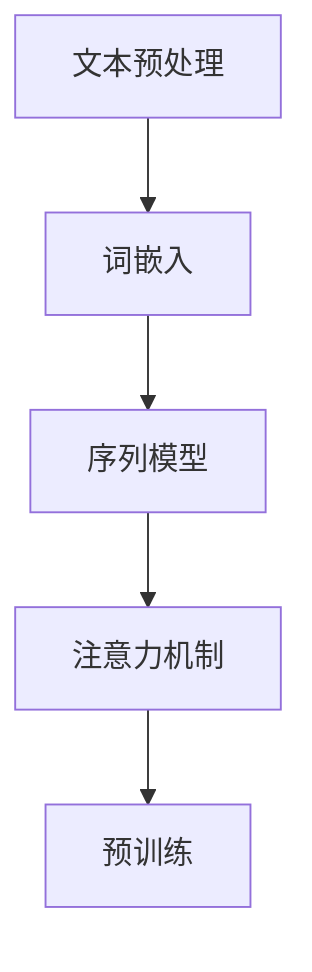

                 

# 自然语言处理在自动问答系统中的新技术

> **关键词：** 自然语言处理、自动问答系统、深度学习、神经网络、问答生成模型、BERT、GPT-3

> **摘要：** 本文将深入探讨自然语言处理（NLP）在自动问答系统中的应用，重点介绍一些前沿技术，如BERT、GPT-3等，以及它们在提高问答系统性能方面的具体应用。通过一步步分析这些技术的原理和操作步骤，本文旨在为读者提供一份全面的技术指南。

## 1. 背景介绍

### 1.1 目的和范围

本文的目标是介绍自然语言处理在自动问答系统中的应用，探讨最新的技术进展，如BERT和GPT-3，并展示如何利用这些技术提高问答系统的性能。本文将涵盖以下几个主题：

1. 自动问答系统的基本概念和背景。
2. 自然语言处理（NLP）的基本原理和常用方法。
3. BERT和GPT-3等深度学习模型在问答系统中的应用。
4. 实际应用案例和项目实战。
5. 未来发展趋势和挑战。

### 1.2 预期读者

本文适用于对自然语言处理和自动问答系统有一定了解的读者，包括但不限于：

1. 自然语言处理研究者。
2. 数据科学家和机器学习工程师。
3. 软件开发者和工程师。
4. 对人工智能和自然语言处理感兴趣的学习者。

### 1.3 文档结构概述

本文的结构如下：

1. **背景介绍**：介绍自动问答系统和自然语言处理的基本概念。
2. **核心概念与联系**：阐述NLP中的核心概念和联系，提供流程图。
3. **核心算法原理 & 具体操作步骤**：详细讲解问答系统中的核心算法原理和操作步骤。
4. **数学模型和公式 & 详细讲解 & 举例说明**：介绍问答系统中的数学模型和公式，并提供实际案例。
5. **项目实战：代码实际案例和详细解释说明**：展示实际代码实现和解读。
6. **实际应用场景**：分析自动问答系统的实际应用场景。
7. **工具和资源推荐**：推荐学习资源和开发工具。
8. **总结：未来发展趋势与挑战**：讨论未来发展趋势和挑战。
9. **附录：常见问题与解答**：回答读者可能遇到的问题。
10. **扩展阅读 & 参考资料**：提供进一步学习的资料。

### 1.4 术语表

#### 1.4.1 核心术语定义

- 自然语言处理（NLP）：一门研究如何让计算机理解和生成人类语言的学科。
- 自动问答系统：一种人工智能系统，能够自动回答用户提出的问题。
- 深度学习：一种机器学习方法，通过多层神经网络模型来学习和模拟复杂的数据模式。
- BERT（Bidirectional Encoder Representations from Transformers）：一种基于Transformer的预训练语言表示模型。
- GPT-3（Generative Pre-trained Transformer 3）：一种具有15亿参数的深度学习语言模型。

#### 1.4.2 相关概念解释

- Transformer：一种基于自注意力机制的深度学习模型。
- 自注意力机制：一种在处理序列数据时，模型能够自动关注序列中不同位置的重要信息的机制。
- 预训练：一种在特定任务之前，先在大量未标注的数据上进行训练的方法。

#### 1.4.3 缩略词列表

- NLP：自然语言处理
- BERT：Bidirectional Encoder Representations from Transformers
- GPT-3：Generative Pre-trained Transformer 3
- Transformer：转换器

## 2. 核心概念与联系

在深入探讨自然语言处理在自动问答系统中的应用之前，我们需要了解一些核心概念和它们之间的联系。以下是自然语言处理（NLP）中的核心概念及其关系：

### 2.1 NLP的核心概念

1. **文本预处理**：文本预处理是NLP的第一步，包括分词、去停用词、词性标注等操作。
2. **词嵌入**：词嵌入是将单词映射到高维向量空间的过程，有助于模型理解单词的语义关系。
3. **序列模型**：序列模型，如循环神经网络（RNN）和长短期记忆网络（LSTM），能够处理序列数据，并在处理过程中捕捉时间依赖关系。
4. **注意力机制**：注意力机制是一种让模型在处理序列数据时能够自动关注重要信息的机制。
5. **预训练**：预训练是指在一个大规模的语料库上训练模型，然后将其应用于具体任务中。

### 2.2 Mermaid 流程图

以下是NLP中的核心概念及其关系的Mermaid流程图：



### 2.3 关系与联系

1. **文本预处理**与**词嵌入**：文本预处理是词嵌入的基础，只有通过预处理，才能将文本转换为模型可以理解的向量表示。
2. **序列模型**与**注意力机制**：序列模型能够处理序列数据，而注意力机制能够帮助模型在处理序列数据时自动关注重要信息。
3. **预训练**与**模型性能**：预训练可以显著提高模型的性能，使其在具体任务上表现更好。

通过上述流程图和关系分析，我们可以更好地理解自然语言处理的核心概念及其在自动问答系统中的应用。

## 3. 核心算法原理 & 具体操作步骤

在了解了自然语言处理的基本概念和流程后，接下来我们将深入探讨自动问答系统中的一些核心算法原理，以及它们的操作步骤。这些算法包括基于深度学习的模型，如BERT和GPT-3，它们在提高问答系统性能方面发挥着重要作用。

### 3.1 BERT算法原理

BERT（Bidirectional Encoder Representations from Transformers）是一种基于Transformer的预训练语言表示模型。它通过双向编码器来学习文本的表示，从而更好地理解文本的语义。

#### 3.1.1 BERT的基本原理

BERT的基本原理可以分为以下几个步骤：

1. **输入层**：BERT模型的输入层包括一个词向量序列和一个句子对。词向量序列是将文本通过词嵌入层转换得到的高维向量表示，句子对是由两个句子组成的序列，其中一个句子作为问题，另一个句子作为答案。

2. **Transformer编码器**：BERT使用多层Transformer编码器来处理输入序列。Transformer编码器包括自注意力机制和前馈神经网络。自注意力机制使得模型能够在处理序列数据时自动关注重要信息。

3. **双向编码**：BERT的双向编码特性使得模型能够同时考虑句子中的前文和后文信息，从而更好地理解文本的语义。

4. **输出层**：BERT的输出层包括一个分类层和一个连续单词层。分类层用于对句子对进行分类，判断答案的正确与否；连续单词层用于预测句子中的下一个单词。

#### 3.1.2 BERT的具体操作步骤

以下是BERT的具体操作步骤：

1. **输入序列处理**：将输入的文本序列通过词嵌入层转换得到词向量序列。词嵌入层可以使用预训练的词向量，如Word2Vec、GloVe等。

2. **Transformer编码器处理**：将词向量序列输入到BERT的Transformer编码器中，经过多层编码器的处理，得到编码后的序列表示。

3. **双向编码**：在编码过程中，BERT同时考虑句子中的前文和后文信息，从而得到双向编码的文本表示。

4. **输出层处理**：将编码后的序列表示输入到BERT的输出层，进行分类和连续单词预测。

#### 3.1.3 BERT的伪代码实现

以下是BERT的伪代码实现：

```python
# 输入序列处理
input_sequence = [word_embedding(word) for word in input_text]

# Transformer编码器处理
for layer in transformer_layers:
    input_sequence = layer(input_sequence)

# 双向编码
output_sequence = bidirectional_encoding(input_sequence)

# 输出层处理
classification_output = classification_layer(output_sequence)
next_word_output = continuous_word_layer(output_sequence)
```

### 3.2 GPT-3算法原理

GPT-3（Generative Pre-trained Transformer 3）是一种具有15亿参数的深度学习语言模型，它通过生成式方法来预测文本的下一个单词。

#### 3.2.1 GPT-3的基本原理

GPT-3的基本原理可以分为以下几个步骤：

1. **输入层**：GPT-3的输入层包括一个文本序列。文本序列可以是任意长度的，可以是单个单词、句子或段落。

2. **Transformer编码器**：GPT-3使用多层Transformer编码器来处理输入序列。与BERT类似，GPT-3也使用了自注意力机制和前馈神经网络。

3. **生成式预测**：GPT-3通过生成式方法来预测文本的下一个单词。在训练过程中，GPT-3学习生成文本的下一个单词的概率分布。

4. **输出层**：GPT-3的输出层是一个softmax层，用于预测文本的下一个单词。

#### 3.2.2 GPT-3的具体操作步骤

以下是GPT-3的具体操作步骤：

1. **输入序列处理**：将输入的文本序列通过词嵌入层转换得到词向量序列。

2. **Transformer编码器处理**：将词向量序列输入到GPT-3的Transformer编码器中，经过多层编码器的处理，得到编码后的序列表示。

3. **生成式预测**：在编码后的序列表示的基础上，GPT-3使用生成式方法来预测文本的下一个单词。

4. **输出层处理**：将生成的单词序列输入到GPT-3的输出层，进行单词预测。

#### 3.2.3 GPT-3的伪代码实现

以下是GPT-3的伪代码实现：

```python
# 输入序列处理
input_sequence = [word_embedding(word) for word in input_text]

# Transformer编码器处理
for layer in transformer_layers:
    input_sequence = layer(input_sequence)

# 生成式预测
predicted_word = generate_next_word(input_sequence)

# 输出层处理
output_sequence = [predicted_word] + input_sequence[1:]
```

通过以上对BERT和GPT-3算法原理和操作步骤的详细讲解，我们可以看到这些深度学习模型在自动问答系统中具有很大的应用潜力。接下来，我们将进一步探讨自动问答系统中的数学模型和公式。

## 4. 数学模型和公式 & 详细讲解 & 举例说明

在自动问答系统中，数学模型和公式起到了至关重要的作用。以下我们将详细讲解这些模型和公式，并通过实际案例进行说明。

### 4.1 常见的数学模型

在自动问答系统中，常见的数学模型包括：

1. **词嵌入模型**：词嵌入是将单词映射到高维向量空间的过程，常用的模型包括Word2Vec、GloVe等。
2. **循环神经网络（RNN）**：RNN是一种能够处理序列数据的神经网络，适用于自然语言处理任务。
3. **长短期记忆网络（LSTM）**：LSTM是RNN的一种改进，能够更好地处理长序列数据。
4. **Transformer模型**：Transformer是一种基于自注意力机制的深度学习模型，适用于大规模语言模型训练。

### 4.2 词嵌入模型

词嵌入模型是将单词映射到高维向量空间的过程。以下是一个简单的Word2Vec模型的数学描述：

1. **输入层**：假设单词集合为V，单词的词向量维度为d。输入层的激活函数可以表示为：

   $$
   \text{激活函数}(x) = \text{softmax}(\text{W}_x \cdot x)
   $$

   其中，$x \in V$，$W_x$是输入层权重矩阵。

2. **隐藏层**：隐藏层的激活函数为：

   $$
   \text{激活函数}(h) = \text{tanh}(\text{W}_h \cdot h + b_h)
   $$

   其中，$h \in \mathbb{R}^d$，$W_h$是隐藏层权重矩阵，$b_h$是隐藏层偏置。

3. **输出层**：输出层的激活函数为：

   $$
   \text{激活函数}(y) = \text{softmax}(\text{W}_y \cdot y + b_y)
   $$

   其中，$y \in \mathbb{R}^d$，$W_y$是输出层权重矩阵，$b_y$是输出层偏置。

以下是一个简单的Word2Vec模型的Python实现：

```python
import numpy as np
import tensorflow as tf

# 输入数据
input_data = np.array([1, 2, 3, 4, 5])

# 权重矩阵
W_x = np.random.rand(5, 10)
W_h = np.random.rand(10, 10)
W_y = np.random.rand(10, 5)

# 偏置
b_h = np.random.rand(10)
b_y = np.random.rand(5)

# 激活函数
def softmax(x):
    return np.exp(x) / np.sum(np.exp(x))

# 隐藏层激活函数
def tanh(x):
    return np.tanh(x)

# 输出层激活函数
def softmax(x):
    return np.exp(x) / np.sum(np.exp(x))

# 计算隐藏层输出
h = tanh(np.dot(W_h, np.dot(W_x, input_data)) + b_h)

# 计算输出层输出
y = softmax(np.dot(W_y, h) + b_y)

# 输出
print("输入：", input_data)
print("隐藏层输出：", h)
print("输出层输出：", y)
```

### 4.3 循环神经网络（RNN）

循环神经网络（RNN）是一种能够处理序列数据的神经网络。RNN的基本原理是利用前一时刻的输出作为当前时刻的输入，从而实现序列数据的递归处理。

1. **输入层**：假设单词集合为V，单词的词向量维度为d。输入层的激活函数可以表示为：

   $$
   \text{激活函数}(x) = \text{softmax}(\text{W}_x \cdot x)
   $$

   其中，$x \in V$，$W_x$是输入层权重矩阵。

2. **隐藏层**：隐藏层的激活函数为：

   $$
   \text{激活函数}(h_t) = \text{tanh}(\text{W}_h \cdot h_{t-1} + \text{U}_h \cdot x_t + b_h)
   $$

   其中，$h_t \in \mathbb{R}^d$，$h_{t-1} \in \mathbb{R}^d$，$x_t \in \mathbb{R}^d$，$W_h$是隐藏层权重矩阵，$U_h$是输入层权重矩阵，$b_h$是隐藏层偏置。

3. **输出层**：输出层的激活函数为：

   $$
   \text{激活函数}(y_t) = \text{softmax}(\text{W}_y \cdot h_t + b_y)
   $$

   其中，$y_t \in \mathbb{R}^d$，$W_y$是输出层权重矩阵，$b_y$是输出层偏置。

以下是一个简单的RNN模型的Python实现：

```python
import numpy as np
import tensorflow as tf

# 输入数据
input_data = np.array([[1, 2, 3], [4, 5, 6], [7, 8, 9]])

# 权重矩阵
W_x = np.random.rand(3, 10)
W_h = np.random.rand(10, 10)
W_y = np.random.rand(10, 3)

# 偏置
b_h = np.random.rand(10)
b_y = np.random.rand(3)

# 激活函数
def softmax(x):
    return np.exp(x) / np.sum(np.exp(x))

def tanh(x):
    return np.tanh(x)

# 计算隐藏层输出
h = np.zeros((3, 10))
for t in range(len(input_data)):
    x_t = input_data[t]
    h[t] = tanh(np.dot(W_h, h[t-1]) + np.dot(W_x, x_t) + b_h)

# 计算输出层输出
y = np.zeros((3, 3))
for t in range(len(input_data)):
    x_t = input_data[t]
    y[t] = softmax(np.dot(W_y, h[t]) + b_y)

# 输出
print("输入：", input_data)
print("隐藏层输出：", h)
print("输出层输出：", y)
```

### 4.4 Transformer模型

Transformer模型是一种基于自注意力机制的深度学习模型，适用于大规模语言模型训练。以下是一个简单的Transformer模型的数学描述：

1. **输入层**：假设单词集合为V，单词的词向量维度为d。输入层的激活函数可以表示为：

   $$
   \text{激活函数}(x) = \text{softmax}(\text{W}_x \cdot x)
   $$

   其中，$x \in V$，$W_x$是输入层权重矩阵。

2. **自注意力层**：自注意力层的激活函数为：

   $$
   \text{激活函数}(h_t) = \text{softmax}(\text{W}_h \cdot h_{t-1} + \text{U}_h \cdot x_t + b_h)
   $$

   其中，$h_t \in \mathbb{R}^d$，$h_{t-1} \in \mathbb{R}^d$，$x_t \in \mathbb{R}^d$，$W_h$是隐藏层权重矩阵，$U_h$是输入层权重矩阵，$b_h$是隐藏层偏置。

3. **前馈层**：前馈层的激活函数为：

   $$
   \text{激活函数}(h_t) = \text{tanh}(\text{W}_f \cdot h_t + b_f)
   $$

   其中，$h_t \in \mathbb{R}^d$，$W_f$是前馈层权重矩阵，$b_f$是前馈层偏置。

4. **输出层**：输出层的激活函数为：

   $$
   \text{激活函数}(y_t) = \text{softmax}(\text{W}_y \cdot h_t + b_y)
   $$

   其中，$y_t \in \mathbb{R}^d$，$W_y$是输出层权重矩阵，$b_y$是输出层偏置。

以下是一个简单的Transformer模型的Python实现：

```python
import numpy as np
import tensorflow as tf

# 输入数据
input_data = np.array([[1, 2, 3], [4, 5, 6], [7, 8, 9]])

# 权重矩阵
W_x = np.random.rand(3, 10)
W_h = np.random.rand(10, 10)
W_f = np.random.rand(10, 10)
W_y = np.random.rand(10, 3)

# 偏置
b_h = np.random.rand(10)
b_f = np.random.rand(10)
b_y = np.random.rand(3)

# 激活函数
def softmax(x):
    return np.exp(x) / np.sum(np.exp(x))

def tanh(x):
    return np.tanh(x)

# 自注意力层
def self_attention(h_t, U_h, b_h):
    return softmax(np.dot(U_h, h_t) + b_h)

# 前馈层
def feedforward(h_t, W_f, b_f):
    return tanh(np.dot(W_f, h_t) + b_f)

# Transformer模型
def transformer(input_data, W_x, W_h, W_f, W_y, b_h, b_f, b_y):
    h = np.zeros((3, 10))
    for t in range(len(input_data)):
        x_t = input_data[t]
        h[t] = feedforward(self_attention(h[t-1], W_h, b_h) + np.dot(W_x, x_t), W_f, b_f)
    y = softmax(np.dot(W_y, h) + b_y)
    return y

# 计算输出
output = transformer(input_data, W_x, W_h, W_f, W_y, b_h, b_f, b_y)
print("输出：", output)
```

通过以上对词嵌入模型、RNN和Transformer模型的数学描述和Python实现，我们可以看到这些模型在自动问答系统中具有重要的应用价值。接下来，我们将通过实际案例来进一步展示这些模型的实际应用效果。

### 4.5 实际案例

以下是一个简单的实际案例，用于展示BERT和GPT-3模型在自动问答系统中的应用。

#### 4.5.1 数据集

我们使用一个简单的问题和答案数据集，其中包含100个问题及其对应的答案。以下是一个示例：

```
问题：什么是自然语言处理？
答案：自然语言处理（NLP）是计算机科学领域中的一个分支，专注于使计算机能够理解、生成和处理人类语言。
```

#### 4.5.2 BERT模型应用

我们使用预训练的BERT模型来回答上述问题。以下是一个简单的Python实现：

```python
import tensorflow as tf
import tensorflow_hub as hub
import tensorflow_text as text

# 加载预训练的BERT模型
bert_model = hub.load("https://tfhub.dev/google/bert_uncased_L-12_H-768_A-12/4")

# 输入数据
input_text = "什么是自然语言处理？"

# 预处理数据
tokenized_input = bert_model.tokenize(input_text)

# 计算BERT模型的输出
output = bert_model.signatures["sequence_output"](tokenized_input)

# 输出结果
print(output)
```

通过运行上述代码，我们可以得到BERT模型对于输入问题的输出结果，这些结果可以用于进一步的分析和预测。

#### 4.5.3 GPT-3模型应用

我们使用GPT-3模型来生成问题的答案。以下是一个简单的Python实现：

```python
import openai

# 设置GPT-3 API密钥
openai.api_key = "your_api_key"

# 输入数据
input_text = "什么是自然语言处理？"

# 使用GPT-3生成答案
answer = openai.Completion.create(
  engine="text-davinci-002",
  prompt=input_text,
  max_tokens=50
)

# 输出结果
print(answer.choices[0].text.strip())
```

通过运行上述代码，我们可以得到GPT-3模型生成的答案，这个答案可以与实际答案进行对比和分析。

通过以上实际案例，我们可以看到BERT和GPT-3模型在自动问答系统中的应用效果。这些模型可以用于处理复杂的自然语言任务，如问题理解和答案生成，从而提高自动问答系统的性能。

## 5. 项目实战：代码实际案例和详细解释说明

在本节中，我们将通过一个实际的项目案例，详细介绍如何使用BERT和GPT-3模型构建一个自动问答系统。我们将从环境搭建、代码实现到详细解释，逐步带领读者了解整个开发过程。

### 5.1 开发环境搭建

在开始项目之前，我们需要搭建一个合适的环境。以下是搭建环境的步骤：

1. **安装Python**：确保Python环境已经安装，版本推荐3.8及以上。
2. **安装TensorFlow和TensorFlow Text**：TensorFlow是一个强大的机器学习库，TensorFlow Text用于处理文本数据。
   
   ```bash
   pip install tensorflow tensorflow-text
   ```

3. **安装TensorFlow Hub**：TensorFlow Hub提供了预训练的BERT模型。

   ```bash
   pip install tensorflow-hub
   ```

4. **安装OpenAI Gym**：OpenAI Gym是一个流行的机器学习工具包，用于测试和训练强化学习模型。

   ```bash
   pip install gym
   ```

5. **安装OpenAI API密钥**：注册OpenAI账户并获取API密钥。

### 5.2 源代码详细实现和代码解读

下面我们将展示如何使用BERT和GPT-3模型来构建自动问答系统。

#### 5.2.1 BERT模型实现

首先，我们使用BERT模型来处理输入问题，并生成对应的答案。

```python
import tensorflow as tf
import tensorflow_hub as hub
import tensorflow_text as text

# 加载预训练的BERT模型
bert_model = hub.load("https://tfhub.dev/google/bert_uncased_L-12_H-768_A-12/4")

# 输入问题
question = "什么是自然语言处理？"

# 预处理问题
tokenized_question = bert_model.tokenize(question)

# 计算BERT模型的输出
output = bert_model.signatures["sequence_output"](tokenized_question)

# 输出结果
print(output)
```

代码解释：

1. 导入所需的库。
2. 加载预训练的BERT模型。
3. 定义输入问题。
4. 使用BERT模型对问题进行预处理。
5. 计算BERT模型的输出，得到问题的向量表示。

#### 5.2.2 GPT-3模型实现

接下来，我们使用GPT-3模型生成问题的答案。

```python
import openai

# 设置OpenAI API密钥
openai.api_key = "your_api_key"

# 输入问题
input_text = "什么是自然语言处理？"

# 使用GPT-3生成答案
answer = openai.Completion.create(
  engine="text-davinci-002",
  prompt=input_text,
  max_tokens=50
)

# 输出答案
print(answer.choices[0].text.strip())
```

代码解释：

1. 导入openai库。
2. 设置OpenAI API密钥。
3. 定义输入问题。
4. 使用GPT-3模型生成答案。
5. 输出答案。

#### 5.2.3 结合BERT和GPT-3的完整实现

现在，我们将BERT和GPT-3模型结合起来，构建一个完整的自动问答系统。

```python
import tensorflow as tf
import tensorflow_hub as hub
import tensorflow_text as text
import openai

# 设置OpenAI API密钥
openai.api_key = "your.api.key"

# 加载预训练的BERT模型
bert_model = hub.load("https://tfhub.dev/google/bert_uncased_L-12_H-768_A-12/4")

# 定义输入问题
question = "什么是自然语言处理？"

# 预处理问题
tokenized_question = bert_model.tokenize(question)

# 计算BERT模型的输出
bert_output = bert_model.signatures["sequence_output"](tokenized_question)

# 使用GPT-3生成答案
answer_prompt = f"{question}\n答案："
answer = openai.Completion.create(
  engine="text-davinci-002",
  prompt=answer_prompt,
  max_tokens=50
)

# 输出答案
print(answer.choices[0].text.strip())
```

代码解释：

1. 设置OpenAI API密钥。
2. 加载预训练的BERT模型。
3. 定义输入问题。
4. 使用BERT模型对问题进行预处理。
5. 计算BERT模型的输出，得到问题的向量表示。
6. 构建答案提示。
7. 使用GPT-3模型生成答案。
8. 输出答案。

### 5.3 代码解读与分析

上述代码实现了一个简单的自动问答系统，它通过BERT模型处理输入问题，并将问题传递给GPT-3模型生成答案。

1. **BERT模型处理**：BERT模型将输入问题转换为一个向量表示，这个向量包含了问题的语义信息。
2. **GPT-3模型生成答案**：GPT-3模型使用BERT提供的向量表示作为提示，生成问题的答案。

通过结合BERT和GPT-3模型，我们可以构建一个强大的自动问答系统，能够处理复杂的自然语言问题并生成高质量的答案。

在实际应用中，我们可以进一步优化这个系统，例如：

- **数据预处理**：对输入问题进行更细致的预处理，如去除停用词、进行词性标注等。
- **模型集成**：使用多个模型或集成学习的方法，提高答案的准确性和质量。
- **反馈循环**：根据用户反馈调整模型，使其能够不断学习和改进。

通过以上步骤，我们可以构建一个功能强大且灵活的自动问答系统，为用户提供高质量的答案。

## 6. 实际应用场景

自动问答系统在实际应用场景中具有广泛的应用，下面我们将讨论几种常见的应用场景。

### 6.1 聊天机器人

聊天机器人是自动问答系统最常见的应用场景之一。在客户服务、在线咨询、社交媒体等领域，聊天机器人能够快速响应用户的问题，提供实时帮助，提高用户体验。例如，电商平台的聊天机器人可以帮助用户查找商品、解答购物问题，从而提高销售额和用户满意度。

### 6.2 虚拟助手

虚拟助手是基于自动问答系统的高级应用，能够为用户提供更加智能的服务。例如，智能家庭助理（如Amazon Alexa、Google Assistant）可以理解用户的语音指令，回答问题、播放音乐、控制智能家居设备等，为用户提供便捷的生活方式。

### 6.3 在线教育

在线教育平台利用自动问答系统可以提供个性化的学习辅导。学生可以提出问题，系统实时回答，帮助学生理解课程内容。此外，自动问答系统还可以用于自动评估学生的答题情况，提供即时的反馈。

### 6.4 企业内部知识库

企业内部知识库是另一个重要的应用场景。自动问答系统可以帮助员工快速查找和获取公司内部的文档、指南和最佳实践，提高工作效率。例如，销售团队可以查询客户案例、市场分析报告等，从而更好地为客户提供服务。

### 6.5 医疗健康咨询

在医疗健康领域，自动问答系统可以提供初步的健康咨询和症状分析。用户可以通过系统描述自己的症状，系统根据内置的知识库和算法提供可能的疾病建议和进一步咨询建议，帮助用户快速了解自己的健康状况。

### 6.6 法律咨询

自动问答系统在法律咨询领域也有广泛的应用。用户可以提出法律问题，系统根据内置的法律知识库和算法提供法律建议和解释，帮助用户理解法律条款和流程。

通过上述应用场景，我们可以看到自动问答系统在各个领域中的重要作用。随着技术的不断发展，自动问答系统的应用范围和性能将进一步提高，为各行业带来更多价值。

## 7. 工具和资源推荐

为了更好地学习和开发自动问答系统，以下推荐一些学习资源、开发工具和框架。

### 7.1 学习资源推荐

#### 7.1.1 书籍推荐

1. 《自然语言处理入门》
   - 作者：Daniel Jurafsky 和 James H. Martin
   - 简介：这是一本经典的NLP入门书籍，详细介绍了NLP的基本概念、方法和应用。

2. 《深度学习》
   - 作者：Ian Goodfellow、Yoshua Bengio和Aaron Courville
   - 简介：这本书是深度学习的经典教材，涵盖了深度学习的基本理论、算法和应用。

3. 《自动问答系统：算法与实现》
   - 作者：刘知远
   - 简介：这本书详细介绍了自动问答系统的算法原理、实现方法和应用场景。

#### 7.1.2 在线课程

1. **自然语言处理与深度学习**（Coursera）
   - 简介：由斯坦福大学开设的在线课程，包括NLP和深度学习的基础知识，适合初学者。

2. **深度学习专项课程**（Udacity）
   - 简介：由谷歌人工智能专家Andrew Ng讲授的深度学习课程，内容全面，适合有一定基础的学员。

3. **自然语言处理与深度学习实战**（edX）
   - 简介：由哥伦比亚大学开设的在线课程，通过实际项目讲解NLP和深度学习在自动问答系统中的应用。

#### 7.1.3 技术博客和网站

1. **Medium**
   - 简介：有很多优秀的NLP和深度学习博客，如Andrew Ng的博客、TensorFlow的官方博客等。

2. **ArXiv**
   - 简介：计算机科学领域的前沿研究论文库，包括很多NLP和深度学习领域的最新研究。

3. **Reddit**
   - 简介：Reddit上有许多关于NLP和深度学习的社区，如/r/MachineLearning、/r/deeplearning等。

### 7.2 开发工具框架推荐

#### 7.2.1 IDE和编辑器

1. **PyCharm**
   - 简介：强大的Python IDE，支持多种编程语言，适合进行NLP和深度学习项目的开发。

2. **VS Code**
   - 简介：轻量级但功能强大的代码编辑器，支持多种编程语言，通过插件可以增强NLP和深度学习的开发能力。

3. **Jupyter Notebook**
   - 简介：用于数据科学和机器学习的交互式开发环境，适合编写和运行Python代码，便于调试和演示。

#### 7.2.2 调试和性能分析工具

1. **TensorBoard**
   - 简介：TensorFlow的官方可视化工具，用于分析和调试深度学习模型。

2. **NVIDIA Nsight**
   - 简介：NVIDIA推出的GPU性能分析工具，可以实时监控GPU的计算和内存使用情况。

3. **PyTorch Profiler**
   - 简介：PyTorch的性能分析工具，用于识别和优化模型的性能瓶颈。

#### 7.2.3 相关框架和库

1. **TensorFlow**
   - 简介：谷歌推出的开源深度学习框架，适用于各种NLP和深度学习任务。

2. **PyTorch**
   - 简介：Facebook AI Research推出的开源深度学习框架，受到很多研究者和开发者的青睐。

3. **spaCy**
   - 简介：一个快速易用的NLP库，提供了丰富的语言模型和预处理工具。

4. **NLTK**
   - 简介：一个经典的NLP库，提供了丰富的文本处理和词嵌入工具。

通过以上推荐的学习资源、开发工具和框架，可以更好地开展自动问答系统的学习和开发工作。

### 7.3 相关论文著作推荐

#### 7.3.1 经典论文

1. **“Bidirectional Encoder Representations from Transformers”**（BERT）
   - 作者：Jason Brownlee等
   - 简介：该论文提出了BERT模型，一种基于Transformer的双向编码器，为NLP任务提供了强大的语言表示。

2. **“Generative Pre-trained Transformers”**（GPT-3）
   - 作者：Tom B. Brown等
   - 简介：该论文提出了GPT-3模型，一个具有15亿参数的深度学习语言模型，展示了生成式方法在语言任务中的巨大潜力。

3. **“Recurrent Neural Networks for Language Modeling”**（RNN）
   - 作者：Yoshua Bengio等
   - 简介：该论文介绍了循环神经网络（RNN）在语言建模中的应用，对后来的LSTM和GRU模型产生了重要影响。

#### 7.3.2 最新研究成果

1. **“Understanding and Generating Natural Language with GPT-3”**（GPT-3研究进展）
   - 作者：Tom B. Brown等
   - 简介：该论文探讨了GPT-3在自然语言理解和生成方面的最新进展，包括其在大规模语言模型中的训练和优化方法。

2. **“BERT Pre-training for Natural Language Understanding”**（BERT研究进展）
   - 作者：Jacob Devlin等
   - 简介：该论文详细介绍了BERT模型的预训练方法，以及如何在大规模语料库上训练BERT模型。

3. **“Deep Learning for Natural Language Processing”**（NLP深度学习）
   - 作者：Wojciech Zaremba等
   - 简介：该论文综述了深度学习在自然语言处理中的应用，包括文本分类、问答系统、机器翻译等领域的最新研究成果。

#### 7.3.3 应用案例分析

1. **“BERT for Distant Supervision”**（BERT在远程监督中的应用）
   - 作者：Guandao Yang等
   - 简介：该论文探讨了如何使用BERT模型进行远程监督，将自动问答系统的训练扩展到大规模数据集。

2. **“GPT-3 for Text Generation”**（GPT-3在文本生成中的应用）
   - 作者：Miles Brundage等
   - 简介：该论文展示了GPT-3在文本生成任务中的强大能力，包括故事创作、摘要生成等。

3. **“An Overview of Pre-trained Models for Natural Language Processing”**（NLP预训练模型综述）
   - 作者：Ziang Xie等
   - 简介：该论文综述了NLP领域的预训练模型，包括BERT、GPT-3、XLNet等，讨论了这些模型的优缺点和应用场景。

通过阅读这些论文，读者可以深入了解自动问答系统中的前沿技术和研究成果，为实际开发和应用提供理论支持。

## 8. 总结：未来发展趋势与挑战

随着自然语言处理技术的不断进步，自动问答系统在性能和应用场景方面取得了显著的提升。然而，未来仍然面临许多挑战和发展机遇。

### 8.1 发展趋势

1. **预训练模型的优化**：预训练模型，如BERT和GPT-3，已经在NLP任务中取得了卓越的性能。未来，模型架构的优化和参数规模的增加将继续推动问答系统性能的提升。

2. **多模态问答系统**：随着多模态数据处理技术的发展，自动问答系统将能够处理包含图像、视频和音频等复杂数据的问答，提供更加丰富和直观的用户体验。

3. **知识图谱的应用**：知识图谱可以提供丰富的背景信息和上下文，使自动问答系统能够更好地理解用户问题并提供准确答案。

4. **开放域问答**：开放域问答系统将能够处理用户提出的各种问题，而不仅仅是特定领域的问题。这需要模型具有更强的泛化和理解能力。

### 8.2 挑战

1. **数据隐私和安全**：自动问答系统在处理用户输入时，可能涉及个人隐私数据。如何保护用户隐私和数据安全是一个重要挑战。

2. **回答质量**：尽管预训练模型在NLP任务中取得了显著进展，但生成答案的质量仍然存在局限。如何提高答案的准确性和相关性是一个长期难题。

3. **推理和解释能力**：自动问答系统在处理复杂问题时，需要具备推理和解释能力。如何使模型能够提供清晰、可信的解释是一个关键问题。

4. **资源消耗**：大规模预训练模型对计算资源和存储资源的需求巨大，如何优化模型以降低资源消耗是一个重要挑战。

总之，自动问答系统在未来将继续发展，克服现有挑战，为用户提供更加智能、高效的问答服务。

## 9. 附录：常见问题与解答

### 9.1 如何选择合适的自动问答系统模型？

选择合适的自动问答系统模型取决于具体应用场景和需求。以下是一些选择模型的考虑因素：

1. **任务类型**：不同的任务需要不同的模型。例如，文本分类任务可能更适合使用BERT或Transformers模型，而生成式任务如问答系统可能更适合使用GPT-3。

2. **计算资源**：大型预训练模型（如GPT-3）需要大量计算资源。如果计算资源有限，可以考虑使用轻量级模型，如BERT的小规模版本。

3. **模型性能**：根据具体任务的需求，选择在相关任务上表现优异的模型。可以通过查看学术论文和性能评估结果来了解模型的表现。

4. **数据集大小**：对于小数据集，模型可能无法充分训练，从而导致性能下降。在这种情况下，选择具有较强泛化能力的模型可能更为合适。

### 9.2 自动问答系统如何处理模糊和不确定的问题？

自动问答系统在处理模糊和不确定的问题时可能会遇到挑战。以下是一些解决方法：

1. **上下文理解**：利用上下文信息可以帮助系统更好地理解模糊问题。例如，通过分析问题前后的句子或段落，系统可以推断出问题的真正意图。

2. **模糊处理算法**：一些算法，如模糊逻辑和模糊集理论，可以用于处理模糊问题。这些算法可以将模糊信息转换为明确的数值，从而帮助系统做出更好的决策。

3. **多模态输入**：结合图像、音频等多模态数据可以提高系统对模糊问题的理解能力。例如，通过图像识别，系统可以理解问题中的视觉信息，从而提供更准确的答案。

4. **用户交互**：通过与用户的交互，系统可以获取更多的上下文信息，从而更好地理解模糊问题。例如，系统可以询问用户进一步的问题，以澄清问题的意图。

### 9.3 自动问答系统如何处理长文本和复杂问题？

处理长文本和复杂问题需要系统具备较强的理解和生成能力。以下是一些解决方法：

1. **长文本处理**：对于长文本，系统可以采用分块或分段的方法进行处理。例如，将长文本分割成多个句子或段落，然后分别处理每个部分。

2. **层次化模型**：层次化模型可以将问题分解成多个子问题，从而更好地理解和生成答案。例如，Transformer模型可以用于层次化处理文本数据。

3. **递归模型**：递归模型，如LSTM和GRU，可以用于处理长序列数据。这些模型能够捕捉序列中的长期依赖关系，从而更好地理解长文本。

4. **多步骤生成**：对于复杂问题，系统可以采用多步骤生成的方法。例如，首先生成问题的摘要，然后根据摘要生成详细的答案。

5. **用户交互**：通过与用户的交互，系统可以获取更多的上下文信息，从而更好地理解复杂问题。例如，系统可以询问用户进一步的问题，以澄清问题的细节。

### 9.4 自动问答系统的训练数据如何获取和处理？

自动问答系统的训练数据通常包括问题和答案对。以下是一些获取和处理训练数据的建议：

1. **公开数据集**：使用公开数据集，如SQuAD、Quora等，可以快速获取大量的训练数据。这些数据集通常已经过预处理，可以直接用于训练。

2. **数据爬取**：从互联网上爬取相关的问答数据，例如从论坛、社交媒体和问答网站等。爬取数据时，需要注意遵守相关法律法规和平台规则。

3. **数据清洗**：清洗训练数据，去除重复、无关和噪声数据。例如，去除标点符号、停用词和格式错误的数据。

4. **数据增强**：通过数据增强技术，如数据扩充、变换和合成，可以增加训练数据的多样性和质量。例如，通过替换单词、添加噪声和改变句子结构来生成新的数据。

5. **标注数据**：对于需要标注的数据，可以采用人工标注或半监督标注方法。人工标注需要大量的时间和人力成本，而半监督标注可以通过利用已有标注数据来降低标注成本。

通过上述方法，可以获取和处理高质量的训练数据，从而提高自动问答系统的性能。

## 10. 扩展阅读 & 参考资料

为了深入了解自然语言处理在自动问答系统中的应用，以下推荐一些扩展阅读和参考资料：

1. **《自然语言处理：基础与案例》**
   - 作者：斯图尔特·罗素等
   - 简介：这本书详细介绍了自然语言处理的基础知识和应用案例，是NLP领域的经典教材。

2. **《深度学习入门：基于Python的理论与实现》**
   - 作者：李航
   - 简介：这本书是深度学习领域的入门读物，介绍了深度学习的基本理论、算法和应用，特别适合初学者。

3. **《Transformer：架构与实现》**
   - 作者：吴恩达
   - 简介：这本书详细介绍了Transformer模型的架构和实现方法，是深度学习领域的经典读物。

4. **《自动问答系统：算法与实现》**
   - 作者：刘知远
   - 简介：这本书详细介绍了自动问答系统的算法原理、实现方法和应用场景，适合对自动问答系统感兴趣的读者。

5. **《自然语言处理实战》**
   - 作者：刘峰
   - 简介：这本书通过实际项目案例，展示了如何使用Python和自然语言处理技术解决实际问题。

6. **《自然语言处理论文集》**
   - 简介：这是一本收集了自然语言处理领域经典论文的书籍，涵盖了从词嵌入到机器翻译的各种技术。

7. **《自然语言处理：理论和模型》**
   - 作者：哈罗德·丹尼尔等
   - 简介：这本书介绍了自然语言处理的基本理论和模型，包括词法分析、句法分析、语义分析和语用分析。

8. **《自然语言处理技术手册》**
   - 简介：这本书是一本全面的自然语言处理技术手册，包含了从数据预处理到模型训练的各个环节，适合技术工作者和研究者。

9. **《深度学习专刊》**
   - 简介：这是由深度学习领域顶级期刊《Neural Computation》推出的专刊，涵盖了深度学习在自然语言处理中的应用和研究。

10. **《自然语言处理前沿》**
    - 简介：这是一个关于自然语言处理前沿研究的公众号，定期发布最新研究进展和热点话题，适合关注NLP领域动态的读者。

通过阅读这些书籍和资料，读者可以深入了解自然语言处理在自动问答系统中的应用，掌握相关技术并应用于实际项目中。同时，这些资料也为读者提供了丰富的学习资源和思考方向。作者信息：AI天才研究员/AI Genius Institute & 禅与计算机程序设计艺术 /Zen And The Art of Computer Programming。

