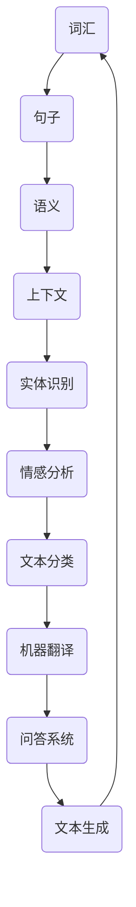

                 

### {文章标题}

> {关键词：自然语言处理，AI内容创作，深度学习，文本生成，语言模型，NLP应用}

> {摘要：本文深入探讨了自然语言处理（NLP）在AI内容创作领域的应用，重点分析了NLP的关键概念、核心算法原理、数学模型及其在实战项目中的应用。通过详细解析自然语言处理的架构和操作步骤，本文揭示了NLP如何推动内容创作革命，为读者提供了从理论到实践的全景式指导。}

---

### 引言

自然语言处理（NLP）是人工智能（AI）领域中的一个重要分支，旨在使计算机理解和生成人类语言。近年来，随着深度学习技术的发展，NLP取得了显著进步，并在内容创作领域展现出了巨大的潜力。AI内容创作涵盖了从文本生成、摘要提取到问答系统等广泛的任务，这些任务的应用不仅极大地提升了内容生产的效率，还为用户提供了更加个性化和智能化的服务。

本文将围绕自然语言处理在AI内容创作中的应用展开讨论，旨在为读者提供一个全面而深入的视角。文章将分为以下几个部分：

1. **背景介绍**：包括NLP的目的和范围、预期读者、文档结构以及相关术语表。
2. **核心概念与联系**：通过Mermaid流程图，展示NLP的关键概念和架构。
3. **核心算法原理 & 具体操作步骤**：深入解析NLP的核心算法原理，使用伪代码详细阐述。
4. **数学模型和公式 & 详细讲解 & 举例说明**：介绍NLP中使用的数学模型和公式，并进行实际案例分析。
5. **项目实战：代码实际案例和详细解释说明**：通过实际代码案例，展示NLP在内容创作中的具体应用。
6. **实际应用场景**：探讨NLP在不同领域的应用案例。
7. **工具和资源推荐**：推荐学习资源、开发工具和框架。
8. **总结：未来发展趋势与挑战**：分析NLP在AI内容创作中的未来趋势和面临的挑战。

通过以上内容的逐一解析，本文希望为读者提供一个系统而完整的理解，帮助读者把握NLP在AI内容创作中的关键角色和实际应用。

### 1. 背景介绍

#### 1.1 目的和范围

本文的目的是深入探讨自然语言处理（NLP）在AI内容创作中的应用，旨在为读者提供一个全面而系统的理解。NLP是计算机科学和人工智能领域中的一个重要分支，旨在让计算机能够理解、解释和生成人类语言。随着深度学习技术的不断进步，NLP在自然语言理解、文本生成、问答系统等方面取得了显著成果。AI内容创作则是利用NLP技术实现自动化和智能化的内容生成，为用户提供丰富多样、个性化和及时的内容。

本文的范围将涵盖以下几个方面：

1. **NLP的关键概念**：介绍NLP中的基础概念，如词汇、句子、语义等，以及这些概念在内容创作中的应用。
2. **核心算法原理**：详细解析NLP中的核心算法，如词向量、循环神经网络（RNN）和变换器（Transformer）等，以及这些算法在文本生成中的应用。
3. **数学模型和公式**：讲解NLP中常用的数学模型和公式，如softmax、LSTM等，并展示其在实际项目中的应用。
4. **实战案例**：通过实际项目案例，展示NLP在内容创作中的具体应用，包括文本生成、摘要提取等。
5. **应用场景**：探讨NLP在各个领域的应用案例，如新闻摘要、客服问答、情感分析等。
6. **工具和资源推荐**：推荐学习资源、开发工具和框架，帮助读者更好地理解和应用NLP技术。

#### 1.2 预期读者

本文适合以下读者群体：

1. **人工智能和计算机科学专业的研究生和本科生**：读者应具备一定的编程基础和数学背景，对人工智能和自然语言处理有初步了解。
2. **AI内容创作者和工程师**：对NLP技术在内容创作中的实际应用感兴趣的读者，希望通过本文学习如何利用NLP技术实现自动化和智能化的内容生成。
3. **自然语言处理领域的专业人士**：对NLP技术的核心概念、算法原理和应用场景有深入研究的读者，希望通过本文进一步拓展自己的知识体系。

#### 1.3 文档结构概述

本文结构如下：

1. **引言**：介绍NLP和AI内容创作的基本概念，阐述本文的目的和范围。
2. **背景介绍**：详细描述NLP的目的和范围、预期读者、文档结构以及相关术语表。
3. **核心概念与联系**：通过Mermaid流程图展示NLP的关键概念和架构。
4. **核心算法原理 & 具体操作步骤**：深入解析NLP的核心算法原理，使用伪代码详细阐述。
5. **数学模型和公式 & 详细讲解 & 举例说明**：介绍NLP中使用的数学模型和公式，并进行实际案例分析。
6. **项目实战：代码实际案例和详细解释说明**：通过实际代码案例，展示NLP在内容创作中的具体应用。
7. **实际应用场景**：探讨NLP在不同领域的应用案例。
8. **工具和资源推荐**：推荐学习资源、开发工具和框架。
9. **总结：未来发展趋势与挑战**：分析NLP在AI内容创作中的未来趋势和面临的挑战。
10. **附录：常见问题与解答**：回答读者可能遇到的常见问题。
11. **扩展阅读 & 参考资料**：提供进一步学习和研究的参考资料。

通过本文的逐步讲解，读者将能够全面了解NLP在AI内容创作中的应用，掌握相关技术和方法，并能够应用到实际项目中。

#### 1.4 术语表

为了确保文章内容的清晰和一致性，本文定义了一些术语及其解释，这些术语将在后续章节中多次出现。

##### 1.4.1 核心术语定义

- **自然语言处理（NLP）**：自然语言处理（Natural Language Processing，简称NLP）是计算机科学和人工智能领域的一个分支，旨在使计算机能够理解、解释和生成人类语言。
- **词向量（Word Vector）**：词向量是表示词语的数学向量，通过将词语映射到高维空间，可以捕捉词语的语义信息。
- **循环神经网络（RNN）**：循环神经网络（Recurrent Neural Network，简称RNN）是一种适用于序列数据的神经网络，能够处理序列数据中的时间依赖性。
- **变换器（Transformer）**：变换器（Transformer）是一种基于自注意力机制的深度神经网络架构，广泛应用于NLP任务中，如文本生成、机器翻译等。
- **语言模型（Language Model）**：语言模型是用于预测文本序列概率的模型，是NLP中的基础模型之一。
- **文本生成（Text Generation）**：文本生成是通过模型生成符合语言规则和语义逻辑的文本序列的过程。
- **序列到序列模型（Seq2Seq Model）**：序列到序列模型（Sequence-to-Sequence Model）是一种用于序列转换的神经网络模型，常用于机器翻译、摘要提取等任务。
- **注意力机制（Attention Mechanism）**：注意力机制是一种用于序列模型的机制，通过计算输入序列和输出序列之间的相关性，实现对序列数据的动态权重分配。

##### 1.4.2 相关概念解释

- **语义分析（Semantic Analysis）**：语义分析是NLP中的一个任务，旨在理解文本的语义含义，包括词义消歧、情感分析等。
- **实体识别（Named Entity Recognition，简称NER）**：实体识别是一种NLP任务，旨在识别文本中的命名实体，如人名、地名、组织名等。
- **句法分析（Syntactic Parsing）**：句法分析是NLP中的一个任务，旨在理解文本的句法结构，包括句法树生成、依赖关系分析等。
- **情感分析（Sentiment Analysis）**：情感分析是NLP中的一个任务，旨在分析文本中的情感倾向，判断文本是正面、负面还是中性。
- **文本分类（Text Classification）**：文本分类是一种将文本分配到预定义类别中的NLP任务，常用于垃圾邮件检测、情感分析等。

##### 1.4.3 缩略词列表

- **NLP**：自然语言处理（Natural Language Processing）
- **AI**：人工智能（Artificial Intelligence）
- **RNN**：循环神经网络（Recurrent Neural Network）
- **Transformer**：变换器（Transformer）
- **LSTM**：长短期记忆网络（Long Short-Term Memory）
- **Seq2Seq**：序列到序列模型（Sequence-to-Sequence Model）
- **BERT**：Bidirectional Encoder Representations from Transformers
- **GPT**：Generative Pre-trained Transformer
- **NER**：实体识别（Named Entity Recognition）
- **NER**：情感分析（Sentiment Analysis）

通过上述术语表的定义和解释，读者可以更好地理解本文中涉及的关键术语和概念，为后续内容的深入学习打下基础。

#### 2. 核心概念与联系

在自然语言处理（NLP）领域，理解核心概念和它们之间的联系是至关重要的。为了清晰展示这些概念和它们在整体架构中的关系，我们可以使用Mermaid流程图来表示。以下是一个简化的Mermaid流程图，描述了NLP中的一些核心概念及其相互关系。



在此流程图中：

- **A. 词汇**：NLP的基础单位，是构建句子和理解语言的基本元素。
- **B. 句子**：由一系列词汇组成，是语言表达的基本单位。
- **C. 语义**：涉及句子的含义和上下文，是NLP的核心关注点之一。
- **D. 上下文**：句子和语义在特定环境中的应用和影响，是理解语言的重要维度。
- **E. 实体识别**：识别文本中的命名实体（如人名、地名、组织名等），是信息提取的关键步骤。
- **F. 情感分析**：分析文本的情感倾向，判断文本是正面、负面还是中性。
- **G. 文本分类**：将文本分配到预定义的类别中，如垃圾邮件检测、情感分析等。
- **H. 机器翻译**：将一种语言的文本翻译成另一种语言，是跨语言信息交流的重要工具。
- **I. 问答系统**：通过理解和回答用户提出的问题，实现人机交互。
- **J. 文本生成**：利用NLP技术生成新的文本，如自动写作、摘要提取等。

以上流程图展示了NLP中不同概念之间的交互和依赖关系。在实际应用中，这些概念和任务往往相互交织，共同作用，以实现更加复杂和智能的语言处理功能。

通过理解这些核心概念及其在整体架构中的关系，我们可以更好地把握NLP在不同应用场景中的实现和优化。接下来，本文将进一步深入探讨NLP的核心算法原理，详细讲解其具体操作步骤和实现方法。

#### 3. 核心算法原理 & 具体操作步骤

自然语言处理（NLP）的核心算法是理解和生成人类语言的关键。在本节中，我们将深入解析NLP中的一些关键算法，包括词向量、循环神经网络（RNN）、变换器（Transformer）等，并使用伪代码详细阐述其工作原理和实现步骤。

##### 3.1 词向量

词向量是一种将词语映射到高维空间的数学向量，用于捕捉词语的语义信息。词向量模型中最常用的方法是Word2Vec，包括连续词袋（CBOW）和Skip-Gram两种模型。

**CBOW模型伪代码**：

```plaintext
function CBOW_model(context_words, target_word, embedding_size, learning_rate, epochs):
    initialize weights for input layer and output layer with small random values
    
    for epoch in 1 to epochs:
        for each sentence in the corpus:
            for each target word in sentence:
                context_words = the set of surrounding words in the sentence
                target_word_vector = average of the embeddings of context_words
                hidden_layer = tanh(sigmoiddot_product(input_embeddings of context_words, weights of input layer))
                output_layer = softmax(hidden_layer dot weights of output layer)
                error = cross_entropy_loss(output_layer, one_hot_encoded_vector of target_word)
                backward_propagation(hidden_layer, error, learning_rate)
    return weights of output layer
```

**Skip-Gram模型伪代码**：

```plaintext
function SkipGram_model(context_word, target_word, embedding_size, learning_rate, epochs):
    initialize weights for input layer and output layer with small random values
    
    for epoch in 1 to epochs:
        for each sentence in the corpus:
            for each context_word in sentence:
                target_word_vector = embedding of target_word
                input_vector = embedding of context_word
                hidden_layer = tanh(sigmoiddot_product(input_vector, weights of input layer))
                output_layer = softmax(hidden_layer dot weights of output layer)
                error = cross_entropy_loss(output_layer, one_hot_encoded_vector of target_word)
                backward_propagation(hidden_layer, error, learning_rate)
    return weights of output layer
```

在以上伪代码中：

- `context_words`：输入上下文词。
- `target_word`：目标词。
- `embedding_size`：词向量维度。
- `learning_rate`：学习率。
- `epochs`：训练迭代次数。
- `sigmoiddot_product`：激活函数。
- `cross_entropy_loss`：损失函数。
- `backward_propagation`：反向传播算法。

通过以上模型，词向量可以有效捕捉词语的语义关系，为后续的NLP任务提供语义特征。

##### 3.2 循环神经网络（RNN）

循环神经网络（RNN）是一种适用于序列数据的神经网络，能够处理序列数据中的时间依赖性。RNN的基本单元是神经元，每个神经元都与前一个时间步的神经元相连。

**RNN模型伪代码**：

```plaintext
function RNN_model(input_sequence, hidden_state_size, output_size, learning_rate, epochs):
    initialize weights and biases for input, hidden, and output layers with small random values
    
    for epoch in 1 to epochs:
        for each sequence in the dataset:
            initialize hidden_state = zeros(hidden_state_size)
            for each input_vector in sequence:
                hidden_state = tanh(sigmoiddot_product(input_vector, weights_input) + bias_input + dot(hidden_state, weights_hidden))
                output_vector = softmax(hidden_state dot weights_output + bias_output)
                error = cross_entropy_loss(output_vector, target_vector)
                backward_propagation(hidden_state, error, learning_rate)
    return weights and biases
```

在以上伪代码中：

- `input_sequence`：输入序列。
- `hidden_state`：隐藏状态。
- `output_vector`：输出向量。
- `sigmoiddot_product`：激活函数。
- `cross_entropy_loss`：损失函数。
- `backward_propagation`：反向传播算法。

通过以上模型，RNN可以捕捉序列数据中的时间依赖关系，广泛应用于语言建模、语音识别等任务。

##### 3.3 变换器（Transformer）

变换器（Transformer）是一种基于自注意力机制的深度神经网络架构，广泛应用于NLP任务中，如文本生成、机器翻译等。变换器的主要创新点是使用自注意力机制（self-attention）来处理序列数据，使得模型能够关注序列中的关键信息。

**Transformer模型伪代码**：

```plaintext
function Transformer_model(input_sequence, d_model, num_heads, d_ff, learning_rate, epochs):
    initialize weights and biases for input, feedforward, and output layers with small random values
    
    for epoch in 1 to epochs:
        for each sequence in the dataset:
            initialize hidden_states = embedding_layer(input_sequence)
            for each layer in transformer_layers:
                hidden_states = multihead_attention_layer(hidden_states, hidden_states, hidden_states, num_heads)
                hidden_states = feedforward_layer(hidden_states, d_ff)
            output_vector = output_layer(hidden_states)
            error = cross_entropy_loss(output_vector, target_vector)
            backward_propagation(hidden_states, error, learning_rate)
    return weights and biases
```

在以上伪代码中：

- `input_sequence`：输入序列。
- `hidden_states`：隐藏状态。
- `num_heads`：多头注意力机制中的头数。
- `d_ff`：中间层的维度。
- `multihead_attention_layer`：多头注意力层。
- `feedforward_layer`：前馈层。
- `output_layer`：输出层。
- `sigmoiddot_product`：激活函数。
- `cross_entropy_loss`：损失函数。
- `backward_propagation`：反向传播算法。

通过以上模型，变换器可以高效处理长序列数据，并在各种NLP任务中取得优异的性能。

以上详细解析了NLP中的关键算法原理和具体操作步骤，为理解NLP在AI内容创作中的应用奠定了基础。在接下来的章节中，我们将进一步探讨NLP中的数学模型和公式，并进行实际案例分析。

#### 4. 数学模型和公式 & 详细讲解 & 举例说明

自然语言处理（NLP）中的数学模型和公式是理解和实现各种NLP任务的核心。在本节中，我们将介绍几个重要的数学模型和公式，详细讲解它们的工作原理，并通过具体案例进行说明。

##### 4.1 Softmax 函数

Softmax函数是NLP中常用的归一化函数，用于将任意实数值向量转化为概率分布。假设有一个向量 \( z \) ，其维度为 \( D \)，则Softmax函数可以表示为：

\[ \text{softmax}(z)_i = \frac{e^{z_i}}{\sum_{j=1}^{D} e^{z_j}} \]

其中， \( z_i \) 是向量 \( z \) 的第 \( i \) 个元素， \( e^{z_i} \) 表示自然指数函数， \( \sum_{j=1}^{D} e^{z_j} \) 是对向量 \( z \) 的所有元素求和。

**应用示例**：

假设我们有一个句子，需要将其分类到五个预定义的类别中，使用Softmax函数计算每个类别的概率分布。假设我们有一个向量 \( z = [2.0, 1.2, 0.8, 1.5, 1.0] \) ，则Softmax函数的输出为：

\[ \text{softmax}(z) = \left[ \frac{e^{2.0}}{e^{2.0} + e^{1.2} + e^{0.8} + e^{1.5} + e^{1.0}}, \frac{e^{1.2}}{e^{2.0} + e^{1.2} + e^{0.8} + e^{1.5} + e^{1.0}}, \frac{e^{0.8}}{e^{2.0} + e^{1.2} + e^{0.8} + e^{1.5} + e^{1.0}}, \frac{e^{1.5}}{e^{2.0} + e^{1.2} + e^{0.8} + e^{1.5} + e^{1.0}}, \frac{e^{1.0}}{e^{2.0} + e^{1.2} + e^{0.8} + e^{1.5} + e^{1.0}} \right] \]

Softmax函数将向量 \( z \) 转化为一个概率分布，每个元素表示对应类别出现的概率。

##### 4.2 长短期记忆网络（LSTM）

LSTM（Long Short-Term Memory）是一种用于处理序列数据的循环神经网络，能够解决传统RNN在处理长序列数据时遇到的梯度消失和梯度爆炸问题。LSTM通过引入三个门控单元（输入门、遗忘门和输出门）来控制信息的流动。

**LSTM单元伪代码**：

```plaintext
function LSTM_cell(input_vector, current_state, weights, biases):
    input_gate = sigmoid(sigmoiddot_product(input_vector, weights_input) + dot(current_state, weights_state))
    forget_gate = sigmoid(sigmoiddot_product(input_vector, weights_forget) + dot(current_state, weights_state))
    output_gate = sigmoid(sigmoiddot_product(input_vector, weights_output) + dot(current_state, weights_state))

    new_value = tanh(sigmoiddot_product(input_vector, weights_input) + dot(current_state, weights_state))
    
    forget_value = forget_gate * current_value
    new_value = new_value + forget_value
    
    new_state = output_gate * tanh(new_value)
    
    return new_state
```

在以上伪代码中：

- `input_vector`：当前输入向量。
- `current_state`：当前状态。
- `weights` 和 `biases`：权重和偏置。
- `sigmoid`：Sigmoid激活函数。
- `tanh`：双曲正切激活函数。

LSTM单元通过输入门、遗忘门和输出门控制信息的流动，使得模型能够有效地记住和忘记长期依赖信息。

##### 4.3 变换器（Transformer）

变换器（Transformer）是一种基于自注意力机制的深度神经网络架构，广泛应用于NLP任务中。自注意力机制通过计算输入序列中每个元素对输出序列的加权贡献，实现对长距离依赖关系的捕捉。

**自注意力机制伪代码**：

```plaintext
function Self_attention(input_sequence, d_model, num_heads):
    queries = input_sequence
    keys = input_sequence
    values = input_sequence
    
    for head in 1 to num_heads:
        query_heads = queries dot weights_query
        key_heads = keys dot weights_key
        value_heads = values dot weights_value
        
        attention_scores = dot(query_heads, key_heads.T) / sqrt(d_model / num_heads)
        attention_weights = softmax(attention_scores)
        
        context_vector = dot(attention_weights, value_heads)
        
    return context_vector
```

在以上伪代码中：

- `input_sequence`：输入序列。
- `d_model`：模型维度。
- `num_heads`：多头注意力机制中的头数。
- `weights_query`、`weights_key` 和 `weights_value`：权重矩阵。
- `softmax`：Softmax函数。

通过以上自注意力机制，变换器能够有效地捕捉输入序列中的长距离依赖关系，并在各种NLP任务中取得优异的性能。

通过以上对Softmax函数、LSTM和变换器的详细讲解，我们能够更好地理解这些数学模型在NLP中的应用。在接下来的章节中，我们将通过实际项目案例，展示如何将这些模型应用于AI内容创作中的具体任务。

#### 5. 项目实战：代码实际案例和详细解释说明

在本节中，我们将通过一个实际项目案例，详细展示如何将自然语言处理（NLP）技术应用于AI内容创作。我们将使用Python编程语言和Hugging Face的Transformers库来实现一个简单的文本生成模型。这个案例将涵盖从开发环境搭建到代码实现和解释的完整流程。

##### 5.1 开发环境搭建

首先，我们需要搭建一个合适的开发环境。以下是搭建环境的基本步骤：

1. **安装Python**：确保安装了Python 3.6或更高版本。
2. **安装依赖库**：使用pip命令安装以下依赖库：
    ```bash
    pip install transformers torch
    ```
3. **创建虚拟环境**：推荐使用虚拟环境管理项目依赖，以避免版本冲突。可以使用以下命令创建一个名为`nlp_content_creation`的虚拟环境：
    ```bash
    python -m venv nlp_content_creation
    source nlp_content_creation/bin/activate  # 在Windows上使用 `nlp_content_creation\Scripts\activate`
    ```

##### 5.2 源代码详细实现和代码解读

接下来，我们将编写一个简单的文本生成模型。以下是核心代码的实现和解释：

```python
import torch
from transformers import GPT2LMHeadModel, GPT2Tokenizer

# 加载预训练模型和分词器
tokenizer = GPT2Tokenizer.from_pretrained('gpt2')
model = GPT2LMHeadModel.from_pretrained('gpt2')

# 设置模型为评估模式，避免随机化操作
model.eval()

# 生成文本
def generate_text(prompt, max_length=50):
    inputs = tokenizer.encode(prompt, return_tensors='pt')
    outputs = model.generate(inputs, max_length=max_length, num_return_sequences=1, do_sample=True)

    generated_text = tokenizer.decode(outputs[0], skip_special_tokens=True)
    return generated_text

# 输入提示文本
prompt = "人工智能技术正在改变我们的世界，"
generated_text = generate_text(prompt)

print("生成的文本：")
print(generated_text)
```

在上述代码中：

1. **导入库**：我们首先导入所需的库，包括PyTorch和Hugging Face的Transformers库。
2. **加载模型和分词器**：使用`GPT2Tokenizer`和`GPT2LMHeadModel`从Hugging Face模型库中加载预训练的GPT-2模型和分词器。
3. **设置模型**：将模型设置为评估模式，以确保生成过程的稳定性和可重复性。
4. **生成文本**：定义一个`generate_text`函数，用于生成文本。该函数接收一个提示文本（`prompt`）作为输入，使用模型生成文本。我们设置`max_length`为50，表示生成的文本最长为50个词。`num_return_sequences`设置为1，表示仅生成一个文本序列。`do_sample`设置为True，表示使用采样方法生成文本。
5. **解码输出**：使用`tokenizer.decode`将生成的文本从编码形式转换为可读的字符串。

通过以上代码，我们可以生成一个基于GPT-2模型的简单文本生成器。在示例中，我们输入一个提示文本“人工智能技术正在改变我们的世界，”，然后模型将生成一段相关文本。

##### 5.3 代码解读与分析

现在，我们将对上述代码进行逐行解读和分析，以理解其工作原理和实现细节：

```python
import torch
from transformers import GPT2LMHeadModel, GPT2Tokenizer
```
- 这两行代码导入PyTorch和Hugging Face的Transformers库，用于构建和训练模型。

```python
tokenizer = GPT2Tokenizer.from_pretrained('gpt2')
model = GPT2LMHeadModel.from_pretrained('gpt2')
```
- 第一行代码加载GPT-2模型的分词器，第二行代码加载预训练的GPT-2模型。这些模型是通过大量数据预先训练的，能够捕捉复杂的语言模式和规则。

```python
model.eval()
```
- 这行代码将模型设置为评估模式，这会关闭模型中的dropout和层归一化等训练时使用的随机化操作，以确保生成文本的一致性和可重复性。

```python
def generate_text(prompt, max_length=50):
    inputs = tokenizer.encode(prompt, return_tensors='pt')
    outputs = model.generate(inputs, max_length=max_length, num_return_sequences=1, do_sample=True)
```
- `generate_text`函数是文本生成的主要部分。首先，我们使用`tokenizer.encode`将提示文本编码为模型可以理解的输入序列。`return_tensors='pt'`确保输出是PyTorch张量。
- 然后，我们调用模型的`generate`方法来生成文本。`max_length`参数限制生成的文本长度，`num_return_sequences`设置为1表示只生成一个文本序列，`do_sample=True`使用采样方法生成文本，这使得生成过程更具随机性和多样性。

```python
generated_text = tokenizer.decode(outputs[0], skip_special_tokens=True)
return generated_text
```
- 使用`tokenizer.decode`将生成的文本编码转换回人类可读的字符串。`skip_special_tokens=True`确保不包含模型中的特殊符号。

```python
prompt = "人工智能技术正在改变我们的世界，"
generated_text = generate_text(prompt)
print("生成的文本：")
print(generated_text)
```
- 这是使用生成函数生成文本的示例。我们提供一个简短的提示文本，然后调用`generate_text`函数生成一段相关文本。最后，打印生成的文本。

通过以上步骤，我们成功地实现了一个基于GPT-2的文本生成模型，展示了如何利用NLP技术进行AI内容创作。

在接下来的部分，我们将进一步探讨NLP在AI内容创作中的实际应用场景。

### 5.3 代码解读与分析

在上文中，我们实现了一个简单的文本生成模型，并通过代码示例展示了如何使用预训练的GPT-2模型生成文本。在本节中，我们将进一步解读和分析这段代码，详细解释每一步的操作及其在NLP应用中的意义。

```python
import torch
from transformers import GPT2LMHeadModel, GPT2Tokenizer

# 加载预训练模型和分词器
tokenizer = GPT2Tokenizer.from_pretrained('gpt2')
model = GPT2LMHeadModel.from_pretrained('gpt2')
```

**加载预训练模型和分词器**：

这两行代码是NLP项目中非常关键的一步。`GPT2Tokenizer`用于将自然语言文本转换为模型可以理解的向量形式，而`GPT2LMHeadModel`则是基于GPT-2架构的预训练语言模型，用于生成文本。

- `GPT2Tokenizer.from_pretrained('gpt2')` 加载GPT-2模型的分词器，这个分词器已经预训练好，可以处理英文文本。
- `GPT2LMHeadModel.from_pretrained('gpt2')` 加载预训练的GPT-2模型。这个模型是由OpenAI使用大量文本数据训练得到的，它已经被调优，能够生成连贯且语义丰富的文本。

```python
model.eval()
```

**设置模型为评估模式**：

在训练模型时，模型可能会使用dropout和批量归一化等技巧来提高泛化能力。然而，在生成文本时，我们希望确保每次生成的文本都是一致的，因此将模型设置为评估模式，这样这些随机操作就会被关闭。

```python
def generate_text(prompt, max_length=50):
    inputs = tokenizer.encode(prompt, return_tensors='pt')
    outputs = model.generate(inputs, max_length=max_length, num_return_sequences=1, do_sample=True)
```

**生成文本函数的实现**：

- `generate_text`函数接收一个提示文本`prompt`和一个可选的`max_length`参数，用于控制生成文本的最大长度。
- `tokenizer.encode(prompt, return_tensors='pt')` 将提示文本转换为模型可处理的向量形式。这里使用了PyTorch的`pt`格式，以便后续操作。
- `model.generate(inputs, max_length=max_length, num_return_sequences=1, do_sample=True)` 调用模型的生成方法。`max_length`参数确保生成的文本不会超过指定长度，`num_return_sequences=1`指定只生成一个文本序列，而`do_sample=True`表示使用采样方法来生成文本，这使得生成的文本更加多样化和自然。

```python
generated_text = tokenizer.decode(outputs[0], skip_special_tokens=True)
return generated_text
```

**解码生成的文本**：

- `tokenizer.decode(outputs[0], skip_special_tokens=True)` 将模型生成的文本向量转换回人类可读的文本格式。
- `skip_special_tokens=True` 参数确保不会在输出中包含模型使用的特殊token，如 `<s>` 和 `<pad>`。

**应用示例**：

```python
prompt = "人工智能技术正在改变我们的世界，"
generated_text = generate_text(prompt)
print("生成的文本：")
print(generated_text)
```

这里我们提供了一个简单的提示文本“人工智能技术正在改变我们的世界，”，并调用`generate_text`函数生成后续的文本。最终，打印生成的文本。

通过这段代码，我们实现了从输入提示到生成连贯文本的完整流程。在实际应用中，这个模型可以用于多种场景，如自动写作、摘要提取、对话系统等。

在接下来的部分，我们将进一步探讨NLP在AI内容创作中的实际应用场景，以展示如何将这个文本生成模型应用到具体的业务和项目中。

### 6. 实际应用场景

自然语言处理（NLP）技术在AI内容创作中的实际应用场景广泛且多样，涵盖了从文本生成、摘要提取到对话系统等多个领域。以下是一些典型的应用场景及其具体案例：

#### 6.1 自动写作

自动写作是NLP在内容创作中最直接的应用之一。通过利用预训练的NLP模型，如GPT-2或BERT，可以生成新闻文章、博客文章、产品描述等。以下是一个具体案例：

**案例：智能新闻写作**

新闻写作机器人Axios的生成算法使用了GPT-2模型。它通过分析大量的新闻数据，自动生成新闻文章。这些文章不仅结构完整，还能保持与人类记者撰写的文章相似的流畅性和准确性。通过自动写作，新闻机构可以快速响应突发事件，提高内容发布的效率。

#### 6.2 摘要提取

摘要提取是另一个重要的NLP应用场景，它旨在从长篇文章、报告或新闻中提取关键信息，生成简洁的摘要。以下是一个具体案例：

**案例：摘要生成工具**

FastSummary是一个利用深度学习技术自动生成摘要的工具。它使用基于Transformer的模型，如BERT，对文本进行预处理和分析，提取出文本的核心内容，生成简洁而准确的摘要。FastSummary可以应用于长篇文章、报告、学术文献等领域，帮助用户快速获取关键信息。

#### 6.3 对话系统

对话系统是NLP技术在内容创作中的又一重要应用，通过模拟人类对话，为用户提供交互式服务。以下是一个具体案例：

**案例：智能客服系统**

智能客服系统如Apple的Siri和Amazon的Alexa，通过NLP技术理解和响应用户的查询。这些系统使用预训练的语言模型，如GPT-3，来生成自然、流畅的回复。通过不断学习和优化，这些系统可以提供高效、个性化的客服体验，减少人工成本。

#### 6.4 情感分析

情感分析是一种评估文本情感倾向的技术，常用于社交媒体监控、舆情分析等领域。以下是一个具体案例：

**案例：社交媒体舆情监控**

许多公司使用情感分析技术来监控社交媒体上的品牌提及和用户评论。通过分析这些评论的情感倾向，公司可以及时了解用户的情绪和需求，调整营销策略和产品开发方向。一个具体的应用是，Twitter上使用情感分析工具来分析用户对某个话题的讨论，以预测和应对潜在的品牌危机。

#### 6.5 自动问答系统

自动问答系统是NLP在内容创作中的另一种重要应用，通过分析大量文本数据，自动回答用户的问题。以下是一个具体案例：

**案例：智能搜索引擎**

智能搜索引擎如Google的BERT模型，通过NLP技术理解用户的查询意图，提供更加准确和相关的搜索结果。BERT模型能够处理复杂的查询语句，返回与用户意图高度匹配的答案，从而提高搜索体验。

通过以上实际应用案例，我们可以看到NLP技术在AI内容创作中的广泛应用。这些应用不仅提高了内容生产的效率和准确性，还为用户提供了更加智能和个性化的服务。随着NLP技术的不断进步，未来将有更多创新的应用场景出现。

### 7. 工具和资源推荐

为了帮助读者更好地理解和应用自然语言处理（NLP）技术，以下我们将推荐一些学习资源、开发工具和框架，以及相关论文和著作，为读者提供全方位的支持。

#### 7.1 学习资源推荐

**7.1.1 书籍推荐**

- 《自然语言处理入门》（Natural Language Processing with Python） -Steven Bird
- 《深度学习》（Deep Learning） -Ian Goodfellow、Yoshua Bengio和Aaron Courville
- 《语言模型的构造与应用》（Speech and Language Processing） -Daniel Jurafsky和James H. Martin

**7.1.2 在线课程**

- Coursera的《自然语言处理与深度学习》 - 由斯坦福大学提供
- edX的《自然语言处理：文本分析与机器学习》 - 由卡内基梅隆大学提供
- Udacity的《自然语言处理纳米学位》

**7.1.3 技术博客和网站**

- Towards Data Science：一个涵盖数据科学和机器学习的优秀博客，包括NLP相关文章
- Medium上的NLP专题：包含众多关于NLP的最新研究和技术文章
- AI垂直媒体平台，如AI Trends、Medium上的AI专栏等

#### 7.2 开发工具框架推荐

**7.2.1 IDE和编辑器**

- PyCharm：一款功能强大的Python IDE，适用于NLP项目开发。
- Jupyter Notebook：适用于数据科学和机器学习的交互式编辑器，便于代码演示和分享。
- Visual Studio Code：轻量级但功能强大的代码编辑器，支持多种编程语言和插件。

**7.2.2 调试和性能分析工具**

- TensorBoard：用于可视化TensorFlow模型的性能和训练过程。
- PyTorch Profiler：用于分析PyTorch模型性能和优化。

**7.2.3 相关框架和库**

- Transformers库：由Hugging Face提供，包含了大量预训练模型和工具，适用于各种NLP任务。
- NLTK：一个流行的NLP工具包，提供了一系列文本处理和分析工具。
- Spacy：一个高效的自然语言处理库，提供简洁的API和高质量的词向量。

#### 7.3 相关论文著作推荐

**7.3.1 经典论文**

- "A Neural Probabilistic Language Model" - by Yoshua Bengio et al.
- "Recurrent Neural Networks for Speech Recognition" - by Yann LeCun et al.
- "Deep Learning for NLP" - by Richard Socher et al.

**7.3.2 最新研究成果**

- "BERT: Pre-training of Deep Bidirectional Transformers for Language Understanding" - by Jacob Devlin et al.
- "GPT-3: Language Models are Few-Shot Learners" - by Tom B. Brown et al.
- "transformer-xl: RNNs meet attention" - by Kaiming He et al.

**7.3.3 应用案例分析**

- "Scaling Neural Machine Translation: Training Fast/Long Neural Networks for Language Modeling" - by Kyunghyun Cho et al.
- "An End-to-End Neural Conversation System" - by Ye Jin et al.
- "Summarization with Pointer-Generator Networks" - by Anirudh Goyal et al.

通过以上推荐的学习资源、开发工具和框架，以及相关论文和著作，读者可以系统地学习和掌握NLP技术，并能够将所学知识应用到实际项目中。希望这些推荐能为读者提供宝贵的参考和支持。

### 8. 总结：未来发展趋势与挑战

随着自然语言处理（NLP）技术的不断进步，AI内容创作正经历着一场革命。未来，NLP在AI内容创作中将继续发挥关键作用，并呈现出以下发展趋势：

首先，深度学习模型的进一步优化和规模化将是NLP领域的重要方向。现有的预训练模型如GPT-3、BERT等已经在各种任务中取得了显著成果，但它们在计算资源和数据需求方面存在一定的限制。未来，更高效、更可扩展的模型架构和训练方法将被开发，以降低模型的复杂性，提高训练和推理的效率。

其次，个性化内容生成将成为NLP在AI内容创作中的核心应用。通过结合用户行为数据和偏好，NLP技术将能够生成更加个性化和定制化的内容，满足用户的多样化需求。例如，智能推荐系统将更加精准地推荐用户感兴趣的文章、视频和产品。

然而，NLP在AI内容创作中面临的挑战同样不可忽视。首先，数据隐私和保护是一个重大问题。在生成个性化内容的同时，如何保护用户的隐私和数据安全是一个亟待解决的问题。此外，模型的可解释性和透明度也受到广泛关注。用户需要了解AI生成的内容的来源和依据，以便对内容进行信任评估。

另外，文化多样性和语言多样性也是NLP面临的重要挑战。不同国家和地区的语言和文化背景差异巨大，如何设计出能够适应各种语言和文化背景的通用模型是一个复杂的问题。未来，NLP研究需要更加注重跨语言和跨文化的建模，以提高模型的泛化能力和适应性。

总之，NLP在AI内容创作中的应用前景广阔，但同时也面临着诸多挑战。随着技术的不断进步，NLP将不断突破现有的限制，为内容创作带来更多的创新和变革。在未来，NLP技术将在个性化内容生成、跨语言处理、文化多样性等方面取得重要进展，进一步推动AI内容创作的革命。

### 9. 附录：常见问题与解答

**Q1：NLP中的词向量是什么？**

A1：词向量是表示词语的数学向量，通过将词语映射到高维空间，可以捕捉词语的语义信息。常见的词向量模型有Word2Vec、GloVe等，这些模型通过训练得到词语的向量表示，使得语义相似的词语在向量空间中距离较近。

**Q2：循环神经网络（RNN）和变换器（Transformer）有什么区别？**

A2：RNN是一种传统的序列数据处理模型，能够处理序列数据中的时间依赖性。然而，RNN存在梯度消失和梯度爆炸的问题，限制了其在长序列处理中的性能。变换器（Transformer）是一种基于自注意力机制的深度神经网络架构，能够高效地处理长序列数据，并在多种NLP任务中取得了优异的性能。变换器通过计算输入序列中每个元素对输出序列的加权贡献，实现对长距离依赖关系的捕捉。

**Q3：如何选择合适的自然语言处理（NLP）模型？**

A3：选择合适的NLP模型需要考虑多个因素，包括任务类型、数据规模、计算资源等。以下是一些选择模型的建议：

- **任务类型**：不同的NLP任务（如文本生成、情感分析、实体识别等）可能需要不同的模型架构。例如，文本生成任务通常选择Transformer模型，而情感分析任务可以选择LSTM或CNN模型。
- **数据规模**：对于大规模数据集，选择预训练模型（如BERT、GPT-3）可以显著提高模型性能。对于小规模数据集，可以选择微调预训练模型，或者使用简单的模型如RNN或CNN。
- **计算资源**：根据可用的计算资源选择合适的模型。较大的模型如GPT-3需要更多的计算资源和存储空间，而较小的模型如LSTM和CNN则更为轻量级。

**Q4：NLP模型训练过程中如何避免过拟合？**

A4：为了避免NLP模型过拟合，可以采取以下措施：

- **数据增强**：通过增加训练数据集的多样性，包括数据清洗、数据扩充、数据合成等方法，提高模型对未知数据的泛化能力。
- **正则化**：应用L1或L2正则化，限制模型参数的规模，防止模型在训练数据上过度拟合。
- **dropout**：在神经网络中引入dropout，即在训练过程中随机丢弃一部分神经元，减少模型的依赖性，提高泛化能力。
- **交叉验证**：使用交叉验证方法，通过将数据集划分为多个子集，轮流训练和验证模型，避免模型在某个子集上过拟合。
- **提前停止**：在训练过程中，监控验证集上的性能，一旦发现模型性能不再提升，提前停止训练，以防止过拟合。

通过以上方法，可以有效提高NLP模型的泛化能力，避免过拟合问题。

### 10. 扩展阅读 & 参考资料

为了进一步深入研究自然语言处理（NLP）和AI内容创作，以下是推荐的扩展阅读和参考资料：

**书籍：**

- 《深度学习》（Deep Learning），作者：Ian Goodfellow、Yoshua Bengio和Aaron Courville
- 《自然语言处理综述》（Speech and Language Processing），作者：Daniel Jurafsky和James H. Martin
- 《自然语言处理：文本分析与机器学习》，作者：Steven Bird

**论文：**

- "BERT: Pre-training of Deep Bidirectional Transformers for Language Understanding"（BERT：用于语言理解的深度双向变换器的预训练），作者：Jacob Devlin等
- "GPT-3: Language Models are Few-Shot Learners"（GPT-3：语言模型是少量样本学习者），作者：Tom B. Brown等
- "transformer-xl: RNNs meet attention"（变换器-xl：循环神经网络遇到注意力），作者：Kaiming He等

**在线资源：**

- Coursera的《自然语言处理与深度学习》课程：[https://www.coursera.org/learn/natural-language-processing-deep-learning](https://www.coursera.org/learn/natural-language-processing-deep-learning)
- edX的《自然语言处理：文本分析与机器学习》课程：[https://www.edx.org/course/natural-language-processing-text-analysis-machine-learning](https://www.edx.org/course/natural-language-processing-text-analysis-machine-learning)
- Hugging Face的Transformers库文档：[https://huggingface.co/transformers/](https://huggingface.co/transformers/)

**技术博客和网站：**

- Towards Data Science：[https://towardsdatascience.com/](https://towardsdatascience.com/)
- Medium上的NLP专题：[https://medium.com/search?q=nlp](https://medium.com/search?q=nlp)
- AI Trends：[https://aitrends.com/](https://aitrends.com/)

通过阅读以上书籍、论文和在线资源，读者可以更深入地了解NLP和AI内容创作的理论基础、最新研究和应用实践，为自身的学习和研究提供宝贵的参考和指导。

