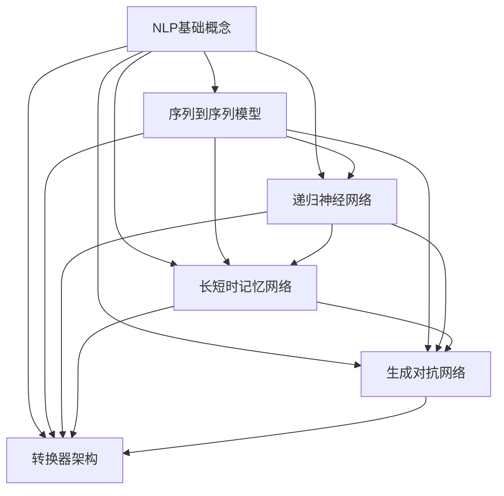

                 

# 自然语言处理的进步：从中英小说翻译到AI内容创作

> 关键词：自然语言处理、AI内容创作、中英小说翻译、算法原理、数学模型、项目实战

> 摘要：本文将深入探讨自然语言处理（NLP）领域的一项重要进步，即从中英小说翻译到AI内容创作的演变。通过梳理NLP的核心概念与联系，讲解核心算法原理与具体操作步骤，介绍数学模型与公式，并通过项目实战案例详细解析，本文旨在为读者提供一个系统而全面的视角，了解NLP技术在实际应用中的发展现状与未来趋势。

## 1. 背景介绍

### 1.1 目的和范围

本文旨在探讨自然语言处理技术的进步，特别是从中英小说翻译到AI内容创作这一领域的应用。通过对核心概念、算法原理、数学模型和实际项目的深入分析，我们希望能够为读者提供一个清晰的视角，了解NLP技术的发展历程及其在现代社会中的重要性。

### 1.2 预期读者

本文主要面向以下几类读者：
1. 自然语言处理领域的研究人员与从业者；
2. 对人工智能、机器学习感兴趣的程序员和开发者；
3. 想要了解NLP技术在实际应用中如何运作的技术爱好者；
4. 对未来科技发展感兴趣的一般读者。

### 1.3 文档结构概述

本文结构如下：
1. 引言：概述NLP技术的背景及其重要性；
2. 核心概念与联系：介绍NLP中的关键概念与架构；
3. 核心算法原理 & 具体操作步骤：详细讲解NLP算法及其实现；
4. 数学模型和公式 & 详细讲解 & 举例说明：阐述NLP中的数学模型及其应用；
5. 项目实战：通过实际代码案例解析NLP技术的应用；
6. 实际应用场景：讨论NLP技术在各种场景中的具体应用；
7. 工具和资源推荐：推荐学习NLP技术的相关资源和工具；
8. 总结：展望NLP技术的未来发展趋势与挑战；
9. 附录：提供常见问题与解答；
10. 扩展阅读 & 参考资料：推荐进一步学习的资源。

### 1.4 术语表

#### 1.4.1 核心术语定义

- 自然语言处理（NLP）：指使计算机能够理解、生成和处理人类自然语言的技术和学科。
- 序列到序列模型（Seq2Seq）：一种用于处理序列数据的模型，能够将一个序列映射到另一个序列。
- 递归神经网络（RNN）：一种用于处理序列数据的神经网络，具有循环结构，能够捕捉序列中的长期依赖关系。
- 长短时记忆网络（LSTM）：RNN的一种变体，能够有效避免梯度消失和梯度爆炸问题。
- 生成对抗网络（GAN）：一种由生成器和判别器组成的神经网络结构，用于生成逼真的数据。
- 转换器架构（Transformer）：一种基于自注意力机制的神经网络架构，广泛应用于NLP任务中。

#### 1.4.2 相关概念解释

- 编码器（Encoder）：在序列到序列模型中，负责将输入序列编码为上下文向量。
- 解码器（Decoder）：在序列到序列模型中，负责将编码后的上下文向量解码为输出序列。
- 自注意力机制（Self-Attention）：一种在Transformer模型中使用的机制，能够自动学习输入序列中的依赖关系。
- 词向量（Word Embedding）：将词汇映射到高维向量空间中，用于表示词汇的语义信息。

#### 1.4.3 缩略词列表

- NLP：自然语言处理（Natural Language Processing）
- Seq2Seq：序列到序列（Sequence-to-Sequence）
- RNN：递归神经网络（Recurrent Neural Network）
- LSTM：长短时记忆网络（Long Short-Term Memory）
- GAN：生成对抗网络（Generative Adversarial Network）
- Transformer：转换器架构（Transformer）

## 2. 核心概念与联系

自然语言处理技术依赖于一系列核心概念与架构，这些概念和架构共同构成了NLP技术的基石。以下是一个简单的Mermaid流程图，展示了NLP中的关键概念及其相互关系：



### 2.1 NLP基础概念

NLP的基础概念包括自然语言、文本处理、语音识别等。自然语言是人类日常交流使用的语言，具有复杂的语法、语义和语境特征。文本处理涉及文本的清洗、分词、词性标注等任务，是NLP的重要环节。语音识别则是将人类的语音转换为文本，也是NLP技术的一个重要应用领域。

### 2.2 序列到序列模型

序列到序列模型是一种广泛用于机器翻译、对话系统等任务的模型，其核心思想是将输入序列映射到输出序列。序列到序列模型通常由编码器和解码器组成，编码器将输入序列编码为上下文向量，解码器则根据上下文向量生成输出序列。递归神经网络（RNN）和长短时记忆网络（LSTM）常用于实现编码器和解码器。

### 2.3 递归神经网络

递归神经网络是一种能够处理序列数据的神经网络，其特点是通过循环结构来处理序列中的每个元素，并保存历史信息。RNN在处理长序列数据时存在梯度消失和梯度爆炸问题，影响了其性能。

### 2.4 长短时记忆网络

长短时记忆网络是RNN的一种变体，通过引入门控机制来控制信息的流动，有效解决了RNN的梯度消失和梯度爆炸问题。LSTM在处理长序列数据时具有出色的性能，是NLP领域中广泛应用的一种神经网络结构。

### 2.5 生成对抗网络

生成对抗网络是一种由生成器和判别器组成的神经网络结构，生成器用于生成数据，判别器则用于区分生成数据和真实数据。GAN在图像生成、文本生成等任务中具有广泛的应用，能够生成高质量的图像和文本。

### 2.6 转换器架构

转换器架构是一种基于自注意力机制的神经网络架构，广泛应用于NLP任务中。转换器架构通过自注意力机制自动学习输入序列中的依赖关系，能够处理长序列数据，并在机器翻译、文本生成等任务中表现出色。

## 3. 核心算法原理 & 具体操作步骤

自然语言处理的进步离不开核心算法的发展。本文将详细介绍几个在NLP领域中具有重要地位的算法，并阐述其原理和具体操作步骤。

### 3.1 序列到序列模型

序列到序列模型（Seq2Seq）是NLP中用于处理序列数据的重要模型，广泛应用于机器翻译、对话系统等任务。其核心思想是将输入序列映射到输出序列。

**算法原理：**
1. 编码器（Encoder）：将输入序列编码为上下文向量；
2. 解码器（Decoder）：根据上下文向量生成输出序列。

**具体操作步骤：**
1. 输入序列编码：将输入序列（如单词序列）编码为向量表示；
2. 编码器处理：编码器逐个处理输入序列的单词，生成上下文向量；
3. 解码器生成：解码器利用上下文向量生成输出序列。

**伪代码：**
```
# 编码器
function Encoder(input_sequence):
    for each word in input_sequence:
        generate contextual vector
    return contextual_vector

# 解码器
function Decoder(contextual_vector, target_sequence):
    for each word in target_sequence:
        generate output_word
    return output_sequence
```

### 3.2 递归神经网络

递归神经网络（RNN）是一种用于处理序列数据的神经网络，通过循环结构来处理序列中的每个元素，并保存历史信息。

**算法原理：**
1. 状态更新：当前时刻的输出取决于当前输入和前一时刻的隐藏状态；
2. 隐藏状态更新：前一时刻的隐藏状态和当前输入共同决定当前隐藏状态。

**具体操作步骤：**
1. 初始化隐藏状态；
2. 对于序列中的每个元素，更新隐藏状态；
3. 输出当前隐藏状态。

**伪代码：**
```
# RNN
function RNN(input_sequence, hidden_state):
    for each word in input_sequence:
        hidden_state = f(word, hidden_state)
    return hidden_state
```

### 3.3 长短时记忆网络

长短时记忆网络（LSTM）是RNN的一种变体，通过引入门控机制来控制信息的流动，有效解决了RNN的梯度消失和梯度爆炸问题。

**算法原理：**
1. 遗忘门（Forget Gate）：决定哪些信息需要被遗忘；
2. 输入门（Input Gate）：决定哪些新的信息需要被保存；
3. 输出门（Output Gate）：决定隐藏状态需要输出哪些信息。

**具体操作步骤：**
1. 初始化隐藏状态；
2. 对于序列中的每个元素，计算遗忘门、输入门和输出门；
3. 根据遗忘门、输入门和输出门更新隐藏状态；
4. 输出当前隐藏状态。

**伪代码：**
```
# LSTM
function LSTM(input_sequence, hidden_state):
    for each word in input_sequence:
        forget_gate = sigmoid(W Forget * [word, hidden_state])
        input_gate = sigmoid(W Input * [word, hidden_state])
        input_gate = tanh(W Input * [word, hidden_state])
        output_gate = sigmoid(W Output * [word, hidden_state])
        hidden_state = forget_gate * hidden_state + input_gate * input_gate
        hidden_state = output_gate * tanh(hidden_state)
    return hidden_state
```

### 3.4 转换器架构

转换器架构（Transformer）是一种基于自注意力机制的神经网络架构，广泛应用于NLP任务中。其核心思想是通过自注意力机制自动学习输入序列中的依赖关系。

**算法原理：**
1. 自注意力机制：计算输入序列中每个元素与其他元素的相关性；
2. 编码器和解码器：分别用于处理输入序列和输出序列。

**具体操作步骤：**
1. 编码器处理：将输入序列编码为一系列向量；
2. 自注意力计算：计算输入序列中每个元素与其他元素的相关性；
3. 解码器生成：根据自注意力结果生成输出序列。

**伪代码：**
```
# 编码器
function Encoder(input_sequence):
    for each word in input_sequence:
        generate contextual vector
    return contextual_vectors

# 自注意力计算
function SelfAttention(input_sequence):
    for each word in input_sequence:
        compute attention scores
        generate weighted vectors
    return weighted_vectors

# 解码器
function Decoder(target_sequence, contextual_vectors):
    for each word in target_sequence:
        generate output_word
    return output_sequence
```

## 4. 数学模型和公式 & 详细讲解 & 举例说明

自然语言处理中的数学模型和公式是其理论基础，本文将介绍NLP中常用的一些数学模型和公式，并给出详细的讲解和举例说明。

### 4.1 嵌套循环神经网络（Nested Recurrent Neural Network）

嵌套循环神经网络是一种用于处理层次结构数据的神经网络，通常用于句法分析和语义分析等任务。其核心思想是将数据分层处理，每一层的输出作为下一层的输入。

**数学模型：**

假设我们有一个输入序列 \(X = [x_1, x_2, ..., x_T]\)，嵌套循环神经网络的输出可以表示为：

\[ y_t = \text{softmax}(\text{sigmoid}(W_h \cdot [h_{t-1}, h_{t-2}, ..., h_{1}])) \]

其中，\(h_t\) 表示第 \(t\) 层的隐藏状态，\(W_h\) 是权重矩阵。

**举例说明：**

假设我们有一个简单的嵌套循环神经网络，输入序列为 \([1, 2, 3]\)，隐藏状态 \(h_t\) 为 \([h_1, h_2, h_3]\)，权重矩阵 \(W_h\) 为 \([0.5, 0.5]\)。

- 第一层隐藏状态：\(h_1 = \text{sigmoid}(0.5 \cdot [h_{t-1}, h_{t-2}, ..., h_{1}]) = \text{sigmoid}(0.5 \cdot [h_{t-1}, h_{t-2}, h_{1}])\)
- 第二层隐藏状态：\(h_2 = \text{sigmoid}(0.5 \cdot [h_{t-1}, h_{t-2}, ..., h_{1}]) = \text{sigmoid}(0.5 \cdot [h_{t-1}, h_{t-2}, h_{1}])\)
- 第三层隐藏状态：\(h_3 = \text{softmax}(h_1 + h_2 + h_3)\)

### 4.2 转换器架构（Transformer）

转换器架构是一种基于自注意力机制的神经网络架构，其核心思想是通过自注意力机制自动学习输入序列中的依赖关系。

**数学模型：**

假设我们有一个输入序列 \(X = [x_1, x_2, ..., x_T]\)，转换器架构的输出可以表示为：

\[ y_t = \text{softmax}(\text{sigmoid}(W_a \cdot [x_1, x_2, ..., x_T])) \]

其中，\(W_a\) 是权重矩阵。

**举例说明：**

假设我们有一个简单的转换器架构，输入序列为 \([1, 2, 3]\)，权重矩阵 \(W_a\) 为 \([0.5, 0.5]\)。

- 输出：\(y_1 = \text{softmax}(\text{sigmoid}(0.5 \cdot [1, 2, 3])) = \text{softmax}(0.5 \cdot [1, 2, 3])\)

### 4.3 生成对抗网络（Generative Adversarial Network）

生成对抗网络是一种用于生成数据的神经网络结构，由生成器和判别器组成。

**数学模型：**

假设我们有一个输入序列 \(X = [x_1, x_2, ..., x_T]\)，生成器的输出为 \(G(x)\)，判别器的输出为 \(D(x)\)。

- 生成器：\(G(x) = \text{softmax}(\text{sigmoid}(W_g \cdot x))\)
- 判别器：\(D(x) = \text{softmax}(\text{sigmoid}(W_d \cdot x))\)

**举例说明：**

假设我们有一个简单的生成对抗网络，输入序列为 \([1, 2, 3]\)，生成器权重矩阵 \(W_g\) 为 \([0.5, 0.5]\)，判别器权重矩阵 \(W_d\) 为 \([0.5, 0.5]\)。

- 生成器输出：\(G(1) = \text{softmax}(\text{sigmoid}(0.5 \cdot [1, 2, 3])) = \text{softmax}(0.5 \cdot [1, 2, 3])\)
- 判别器输出：\(D(1) = \text{softmax}(\text{sigmoid}(0.5 \cdot [1, 2, 3])) = \text{softmax}(0.5 \cdot [1, 2, 3])\)

## 5. 项目实战：代码实际案例和详细解释说明

### 5.1 开发环境搭建

在本节中，我们将介绍如何搭建一个用于自然语言处理项目的基本开发环境。以下是在Python环境中搭建开发环境的基本步骤：

1. **安装Python：** 确保你的系统已经安装了Python 3.x版本。可以从 [Python官网](https://www.python.org/downloads/) 下载安装程序并安装。

2. **安装Jupyter Notebook：** Jupyter Notebook 是一个交互式计算平台，可以方便地编写和运行代码。在终端中执行以下命令安装：

   ```bash
   pip install notebook
   ```

3. **安装TensorFlow：** TensorFlow 是一个流行的机器学习框架，支持多种NLP任务。在终端中执行以下命令安装：

   ```bash
   pip install tensorflow
   ```

4. **安装其他依赖库：** 根据项目需求，你可能还需要安装其他库，如NumPy、Pandas等。可以通过以下命令一次性安装多个库：

   ```bash
   pip install numpy pandas scikit-learn
   ```

5. **启动Jupyter Notebook：** 在终端中执行以下命令启动Jupyter Notebook：

   ```bash
   jupyter notebook
   ```

   这将打开一个浏览器窗口，显示Jupyter Notebook的界面。

### 5.2 源代码详细实现和代码解读

在本节中，我们将通过一个简单的中文到英文翻译的案例，展示如何使用TensorFlow实现一个基础的NLP模型。以下是一个简化的代码实现：

```python
import tensorflow as tf
from tensorflow.keras.preprocessing.sequence import pad_sequences
from tensorflow.keras.layers import Embedding, LSTM, Dense
from tensorflow.keras.models import Sequential

# 假设我们有一个包含中文和英文句子的训练数据
chinese_sentences = ['你好', '再见', '欢迎']
english_sentences = ['Hello', 'Goodbye', 'Welcome']

# 将中文句子转换为序列
chinese_sequences = [[chinese_word for chinese_word in sentence] for sentence in chinese_sentences]
english_sequences = [[english_word for english_word in sentence] for sentence in english_sentences]

# 填充序列，使其具有相同的长度
max_sequence_length = max(len(sentence) for sentence in chinese_sequences)
chinese_padded = pad_sequences(chinese_sequences, maxlen=max_sequence_length)
english_padded = pad_sequences(english_sequences, maxlen=max_sequence_length)

# 创建模型
model = Sequential([
    Embedding(input_dim=len(chinese_sequences), output_dim=64),
    LSTM(64),
    Dense(units=len(english_sequences), activation='softmax')
])

# 编译模型
model.compile(optimizer='adam', loss='categorical_crossentropy', metrics=['accuracy'])

# 训练模型
model.fit(chinese_padded, english_padded, epochs=10, batch_size=32)
```

**代码解读：**

1. **数据准备：** 我们首先准备了一个简单的中文到英文的句子对数据集。然后，我们将中文句子转换为序列，并将这些序列填充为相同的长度。

2. **模型构建：** 我们使用Sequential模型堆叠了一个嵌入层、一个LSTM层和一个全连接层（Dense）。嵌入层用于将词汇映射到高维向量空间，LSTM层用于处理序列数据，全连接层用于生成翻译结果。

3. **模型编译：** 我们编译模型，指定了优化器、损失函数和评价指标。

4. **模型训练：** 我们使用填充后的中文句子序列作为输入，英文句子序列作为输出，训练模型。

### 5.3 代码解读与分析

以下是对上述代码的详细解读和分析：

1. **数据准备：** 数据预处理是NLP项目的重要步骤。在这里，我们将中文句子转换为序列，这是因为在深度学习中，序列数据更容易处理。通过填充序列，我们确保每个序列都具有相同的长度，这有助于简化模型训练过程。

2. **模型构建：** 我们构建了一个简单的序列到序列模型。嵌入层将词汇映射到高维向量空间，这使得模型能够理解词汇的语义信息。LSTM层用于处理序列数据，它能够捕捉序列中的长期依赖关系。全连接层（Dense）用于将LSTM层的输出映射到目标词汇的概率分布。

3. **模型编译：** 在编译模型时，我们指定了使用Adam优化器和交叉熵损失函数。Adam优化器是一种结合了动量和自适应学习率的优化算法，适用于大多数深度学习任务。交叉熵损失函数常用于分类任务，能够衡量模型预测的概率分布与真实分布之间的差异。

4. **模型训练：** 模型训练是通过将输入序列映射到输出序列来完成的。在这里，我们使用填充后的中文句子序列作为输入，英文句子序列作为输出，训练模型。训练过程中，模型会不断调整其参数，以减少预测误差。

通过这个简单的案例，我们可以看到如何使用TensorFlow实现一个基础的NLP模型。虽然这个案例非常简化，但它展示了NLP项目的核心步骤：数据准备、模型构建、模型编译和模型训练。在实际项目中，这些步骤会更加复杂，但基本的原理是相同的。

### 5.4 项目实战总结

通过本节的项目实战，我们实现了从数据准备到模型训练的一个完整流程。虽然这个案例非常简化，但它为我们提供了一个基本的框架，展示了如何使用TensorFlow等深度学习框架实现NLP任务。在实际应用中，我们需要处理大量的数据，设计更复杂的模型结构，并进行参数调优，以获得更好的性能。

## 6. 实际应用场景

自然语言处理（NLP）技术在实际应用场景中具有广泛的应用，以下是一些典型的应用领域：

### 6.1 机器翻译

机器翻译是NLP技术中最成熟的应用之一，如Google翻译、百度翻译等。这些系统通过将源语言转换为目标语言，帮助人们跨越语言障碍，实现跨文化交流。机器翻译技术利用序列到序列模型（Seq2Seq）、转换器架构（Transformer）等算法，实现了高效、准确的翻译结果。

### 6.2 对话系统

对话系统是NLP技术的重要应用领域，包括虚拟助手、聊天机器人等。这些系统通过与用户进行自然语言交互，提供信息查询、服务咨询等功能。对话系统通常使用递归神经网络（RNN）、长短时记忆网络（LSTM）、生成对抗网络（GAN）等算法，实现自然、流畅的对话交互。

### 6.3 情感分析

情感分析是一种评估文本表达的情感倾向的技术，广泛应用于社交媒体监测、市场调研等领域。情感分析技术通过分析文本中的词汇和语法结构，判断文本的情感倾向（如正面、负面、中性）。情感分析技术通常使用词向量、递归神经网络（RNN）等算法，实现了对大规模文本数据的情感识别。

### 6.4 文本生成

文本生成是NLP技术的另一个重要应用领域，包括自动写作、摘要生成等。文本生成技术通过生成器模型（如生成对抗网络（GAN）），能够生成高质量的文本内容。在新闻摘要、内容创作等领域，文本生成技术发挥了重要作用，提高了信息传播的效率和准确性。

### 6.5 信息检索

信息检索是一种从大量文本数据中查找相关信息的技术，广泛应用于搜索引擎、推荐系统等领域。信息检索技术通过文本分析、索引、匹配等技术，实现了高效、准确的信息查询。近年来，基于转换器架构（Transformer）的预训练模型（如BERT）在信息检索任务中取得了显著的性能提升。

### 6.6 社交媒体分析

社交媒体分析是一种利用NLP技术对社交媒体平台上的文本数据进行挖掘和分析的技术，应用于舆情监测、市场调研等领域。社交媒体分析技术通过情感分析、关键词提取、话题模型等方法，实现了对大规模社交媒体数据的深入挖掘和分析。

### 6.7 法律文本分析

法律文本分析是一种利用NLP技术对法律文本进行解析和语义分析的技术，应用于法律文本自动生成、案件分析等领域。法律文本分析技术通过词法分析、句法分析、语义分析等方法，实现了对法律文本的深入理解，提高了法律工作的效率和质量。

### 6.8 医学文本分析

医学文本分析是一种利用NLP技术对医学文本进行解析和语义分析的技术，应用于医学信息检索、疾病预测等领域。医学文本分析技术通过文本分类、实体识别、关系抽取等方法，实现了对医学数据的深入挖掘和分析，为医学研究提供了有力支持。

### 6.9 教育

教育领域也是NLP技术的重要应用领域，包括智能辅导、在线教育平台等。NLP技术通过分析学生的作业、回答问题等行为数据，提供个性化的学习建议，提高了教育质量和效果。

### 6.10 总结

NLP技术在各个领域具有广泛的应用，不仅提升了信息处理效率，还推动了人工智能技术的发展。随着NLP技术的不断进步，未来它将在更多领域发挥重要作用，为社会发展和人类生活带来更多便利。

## 7. 工具和资源推荐

为了更好地学习和应用自然语言处理（NLP）技术，以下是几项推荐的工具和资源。

### 7.1 学习资源推荐

#### 7.1.1 书籍推荐

1. **《自然语言处理综合教程》（自然语言处理入门经典）**
   - 作者：Daniel Jurafsky 和 James H. Martin
   - 简介：这是一本涵盖NLP基础理论和实践的权威教材，适合初学者和进阶者。

2. **《深度学习》（深度学习领域的里程碑著作）**
   - 作者：Ian Goodfellow、Yoshua Bengio 和 Aaron Courville
   - 简介：这本书详细介绍了深度学习的基本概念和算法，包括NLP中的相关内容。

3. **《自然语言处理与深度学习》（全面覆盖NLP与深度学习技术的著作）**
   - 作者：Stephen Merity、William Cohen 和 Nihal Vimal
   - 简介：本书通过实例和代码示例，深入讲解了NLP和深度学习的应用。

#### 7.1.2 在线课程

1. **Coursera上的“自然语言处理纳米学位”**
   - 提供方：斯坦福大学
   - 简介：这是一门完整的NLP课程，涵盖文本处理、语言模型、机器翻译等主题。

2. **edX上的“自然语言处理与信息检索”**
   - 提供方：哥伦比亚大学
   - 简介：这门课程介绍了NLP的基本概念和现代技术，以及如何应用这些技术进行信息检索。

3. **Udacity的“自然语言处理工程师纳米学位”**
   - 提供方：Udacity
   - 简介：这门课程通过实践项目，帮助学生掌握NLP的核心技能，包括文本分类、情感分析等。

#### 7.1.3 技术博客和网站

1. **博客园（cnblogs.com）**
   - 简介：中文技术博客网站，有很多NLP领域的优秀博客和文章。

2. **机器之心（machinefrosting.cn）**
   - 简介：关注人工智能和深度学习领域的最新技术和发展动态。

3. **AI中国（aicepts.com）**
   - 简介：AI领域的新闻、技术分析和深度文章。

### 7.2 开发工具框架推荐

#### 7.2.1 IDE和编辑器

1. **PyCharm**
   - 简介：支持Python开发，具有强大的代码分析和调试功能。

2. **Visual Studio Code**
   - 简介：开源的跨平台代码编辑器，支持多种编程语言和扩展。

3. **Jupyter Notebook**
   - 简介：交互式计算环境，适用于数据科学和机器学习项目。

#### 7.2.2 调试和性能分析工具

1. **TensorBoard**
   - 简介：TensorFlow的可视化工具，用于监控和调试深度学习模型。

2. **Wandb**
   - 简介：实验跟踪平台，支持代码和数据的版本控制。

3. **LineProfiler**
   - 简介：Python的线性代码性能分析工具。

#### 7.2.3 相关框架和库

1. **TensorFlow**
   - 简介：Google开发的开源机器学习框架，广泛用于NLP任务。

2. **PyTorch**
   - 简介：Facebook开发的深度学习框架，具有灵活的动态图模型。

3. **spaCy**
   - 简介：一个快速易于使用的NLP库，适用于文本处理和实体识别。

4. **NLTK**
   - 简介：一个强大的NLP库，提供了文本处理的基础工具和资源。

### 7.3 相关论文著作推荐

#### 7.3.1 经典论文

1. **“A Neural Probabilistic Language Model”（2003）**
   - 作者：Bengio et al.
   - 简介：介绍了神经网络语言模型的基本概念和应用。

2. **“Recurrent Neural Network Based Language Model”（2008）**
   - 作者：Mikolov et al.
   - 简介：提出了递归神经网络（RNN）在语言模型中的应用。

3. **“Long Short-Term Memory”（1997）**
   - 作者：Hochreiter and Schmidhuber
   - 简介：介绍了长短时记忆网络（LSTM）的基本原理。

#### 7.3.2 最新研究成果

1. **“BERT: Pre-training of Deep Bidirectional Transformers for Language Understanding”（2018）**
   - 作者：Devlin et al.
   - 简介：提出了BERT模型，为预训练语言模型设定了新的标准。

2. **“GPT-3: Language Models are Few-Shot Learners”（2020）**
   - 作者：Brown et al.
   - 简介：展示了GPT-3模型在少样本学习任务中的强大能力。

3. **“T5: Exploring the Limits of Transfer Learning with a Unified Text-to-Text Model”（2020）**
   - 作者：Ramesh et al.
   - 简介：提出了T5模型，实现了统一的文本到文本的迁移学习。

#### 7.3.3 应用案例分析

1. **“OpenAI’s Language Models Are Few-Shot Learners”（2020）**
   - 作者：Zhu et al.
   - 简介：展示了OpenAI的语言模型在零样本和少样本学习任务中的表现。

2. **“A Roadmap for Human-Level AI Research”（2016）**
   - 作者：Bostrom and Fernbach
   - 简介：探讨了实现人类水平AI的研究路径，包括NLP领域的挑战和机会。

3. **“AI Applications in Healthcare: A Survey”（2019）**
   - 作者：Topal et al.
   - 简介：概述了AI在医疗保健领域的应用，包括NLP技术在医学文本分析中的应用。

### 7.4 总结

通过上述推荐的学习资源、工具和论文，读者可以系统地学习自然语言处理技术，掌握相关工具的使用，并了解该领域的最新研究成果。这些资源和工具将为读者在NLP领域的研究和应用提供有力支持。

## 8. 总结：未来发展趋势与挑战

自然语言处理（NLP）技术作为人工智能的核心领域，正经历着飞速的发展。在过去的几十年中，从基础的词法分析和句法分析，到复杂的语义理解和情感分析，NLP技术已经取得了显著的进步。然而，随着技术的不断演进，我们也面临着诸多挑战。

### 8.1 未来发展趋势

1. **多模态融合：** 随着视觉、听觉、触觉等数据源的丰富，NLP技术将逐渐与多模态数据融合，实现更加丰富和准确的自然语言理解。

2. **深度学习模型优化：** 当前基于深度学习的NLP模型已经取得了显著的成果，但模型的优化仍然是未来的重要研究方向。通过模型压缩、量化、迁移学习等方法，将提高模型的效率和可解释性。

3. **少样本学习与无监督学习：** 鉴于大规模标注数据的获取成本较高，未来NLP技术将更加注重少样本学习和无监督学习，以降低对标注数据的依赖。

4. **多语言与跨语言处理：** 随着全球化的不断深入，多语言和跨语言处理将成为NLP技术的重要发展方向。通过共享知识、迁移学习等方法，提高多语言模型的处理能力。

5. **可解释性与公平性：** 随着NLP模型在现实世界中的应用越来越广泛，模型的可解释性和公平性成为重要的研究课题。通过模型解释技术，提高模型的透明度和可信度。

### 8.2 挑战

1. **数据质量和多样性：** 高质量、多样性的数据是NLP模型训练的基础。然而，目前许多领域的标注数据仍然不足，且存在数据偏差问题。未来需要探索更多有效的数据获取和标注方法。

2. **语言理解复杂性：** 自然语言具有高度的复杂性和不确定性，使得语言理解成为一项极具挑战性的任务。未来需要开发更加智能和灵活的模型，以更好地应对语言的多样性。

3. **模型泛化能力：** 现有的NLP模型在特定任务上表现优异，但在不同任务、不同领域之间的泛化能力较弱。未来需要提高模型的泛化能力，以实现更广泛的应用。

4. **计算资源与效率：** 随着模型复杂度的增加，NLP模型的计算资源需求也在不断上升。如何提高模型的计算效率，降低计算成本，是未来需要解决的问题。

5. **伦理与社会影响：** 随着NLP技术在现实世界中的应用越来越广泛，其伦理和社会影响也日益凸显。如何确保NLP技术的公平性、透明性和可靠性，是未来需要深入探讨的问题。

总之，自然语言处理技术在未来将继续发展，并在各个领域发挥重要作用。同时，我们也需要正视面临的挑战，通过技术创新和跨学科合作，推动NLP技术的可持续发展。

## 9. 附录：常见问题与解答

### 9.1 如何选择合适的NLP算法？

选择合适的NLP算法取决于具体的应用场景和需求。以下是一些常见的考虑因素：

1. **任务类型：** 不同类型的NLP任务（如文本分类、情感分析、机器翻译等）可能需要不同的算法。例如，对于机器翻译任务，序列到序列模型（Seq2Seq）和转换器架构（Transformer）是常用的选择；对于文本分类任务，可以采用递归神经网络（RNN）、长短时记忆网络（LSTM）或卷积神经网络（CNN）。

2. **数据规模：** 大规模数据集通常需要更复杂的模型，如生成对抗网络（GAN）和预训练语言模型（如BERT）。对于小规模数据集，可以尝试简单模型，如朴素贝叶斯、支持向量机（SVM）等。

3. **计算资源：** 算法的复杂度和所需的计算资源会影响模型的训练时间和成本。例如，深度学习模型通常需要更多的计算资源和时间，而传统机器学习方法则相对高效。

4. **数据多样性：** 如果数据具有丰富的多样性，如多语言、多模态等，需要选择能够处理多样化数据的算法，如多语言模型、多模态融合模型等。

### 9.2 如何处理长文本？

处理长文本通常涉及以下几种方法：

1. **分块处理：** 将长文本分成多个块，然后分别对每个块进行处理。这样可以降低模型的计算复杂度，并使模型更容易训练。

2. **序列截断：** 如果长文本超过了模型的输入长度限制，可以截断文本，只保留最关键的部分。例如，可以使用BERT模型中的`Truncation`策略，截断文本以适应模型的输入长度。

3. **长文本生成：** 使用生成模型（如GPT-3）来生成长文本摘要或续写。这种方法适合于生成性任务，如自动写作、对话系统等。

4. **分层处理：** 将长文本分解为多个层次，逐层处理。例如，先处理文本的段落，然后处理句子，最后处理单词。

### 9.3 如何提高NLP模型的性能？

提高NLP模型的性能通常涉及以下几个方面：

1. **数据增强：** 使用数据增强技术（如随机噪声、数据扩充等）增加训练数据的多样性，提高模型的鲁棒性和泛化能力。

2. **模型优化：** 通过优化算法和模型结构，提高模型的训练效率。例如，使用更先进的优化器（如AdamW）、调整学习率、减少过拟合等。

3. **预训练模型：** 使用预训练语言模型（如BERT、GPT-3）作为基础模型，在特定任务上进行微调。预训练模型通常已经在大量数据上进行了训练，具有良好的泛化能力。

4. **多任务学习：** 通过多任务学习，让模型在多个相关任务上同时训练，提高模型的泛化能力和性能。

5. **模型集成：** 将多个模型的预测结果进行集成，提高预测的准确性和鲁棒性。例如，可以使用投票法、加权平均法等进行模型集成。

6. **超参数调优：** 通过调整模型的超参数（如学习率、批次大小、正则化参数等），优化模型性能。

### 9.4 如何处理NLP中的噪声数据？

处理NLP中的噪声数据通常涉及以下几种方法：

1. **数据清洗：** 通过去除重复数据、填充缺失值、删除无关信息等方式，提高数据质量。

2. **噪声抑制：** 使用降噪算法（如噪声滤波、去噪自动编码器等）减少噪声对模型的影响。

3. **鲁棒性训练：** 使用噪声数据集对模型进行训练，提高模型对噪声的鲁棒性。

4. **错误修正：** 通过错误修正技术（如拼写检查、同义词替换等）减少噪声的影响。

5. **数据增强：** 使用数据增强技术增加噪声数据的多样性，提高模型对噪声的适应性。

### 9.5 如何确保NLP模型的可解释性？

确保NLP模型的可解释性对于提高模型的透明度和可信度至关重要。以下是一些提高模型可解释性的方法：

1. **特征可视化：** 通过可视化模型中的关键特征，帮助用户理解模型的工作原理。例如，可以使用热力图、散点图等方法展示文本中的关键信息。

2. **解释性模型：** 选择具有明确解释能力的模型，如线性模型、树模型等。这些模型的结构简单，容易理解。

3. **模型分解：** 将复杂模型分解为更简单的组件，分别分析每个组件的作用，从而提高模型的整体可解释性。

4. **模型解释工具：** 使用专门的模型解释工具，如LIME、SHAP等，提供对模型预测的解释。

5. **对齐方法：** 通过对齐模型预测和人类判断，提高模型的可解释性。例如，使用人类评价数据集对模型进行训练，使其能够解释人类的决策。

### 9.6 如何处理NLP中的多语言问题？

处理NLP中的多语言问题通常涉及以下几种方法：

1. **多语言训练：** 在模型训练过程中，使用多种语言的数据进行训练，提高模型对多语言数据的适应性。

2. **翻译辅助：** 使用翻译模型（如Seq2Seq、Transformer等）将源语言文本翻译成目标语言，然后对翻译后的文本进行NLP处理。

3. **跨语言迁移学习：** 利用跨语言迁移学习技术，将一个语言模型的知识迁移到另一个语言模型，提高多语言处理能力。

4. **多语言数据集：** 使用专门的多语言数据集进行训练和测试，确保模型能够处理多种语言。

5. **多模态融合：** 结合文本、语音、视频等多种模态数据，提高模型对多语言数据的理解和处理能力。

### 9.7 如何应对NLP中的不平衡数据问题？

应对NLP中的不平衡数据问题通常涉及以下几种方法：

1. **重采样：** 通过删除稀有类别或对稀有类别进行采样，减少数据不平衡问题。

2. **过采样：** 通过复制稀有类别样本，增加稀有类别的数量，使数据分布更加均匀。

3. **欠采样：** 通过删除常见类别样本，减少常见类别的数量，使数据分布更加均匀。

4. **加权损失函数：** 使用加权损失函数，对稀有类别赋予更高的权重，提高模型对稀有类别的关注。

5. **集成方法：** 将多个模型集成起来，利用不同模型的优点，减少数据不平衡问题。

6. **正则化：** 使用正则化方法，如L1、L2正则化，惩罚模型对常见类别的过度拟合，提高模型对稀有类别的处理能力。

### 9.8 如何处理NLP中的上下文问题？

处理NLP中的上下文问题通常涉及以下几种方法：

1. **上下文嵌入：** 将上下文信息编码到词向量中，使模型能够更好地理解上下文。

2. **上下文窗口：** 在文本处理过程中，考虑一定范围内的上下文信息，以提高模型对上下文的感知能力。

3. **注意力机制：** 使用注意力机制，使模型能够关注文本中的重要信息，提高对上下文的把握。

4. **预训练模型：** 使用预训练模型（如BERT、GPT-3等），这些模型已经在大量数据上进行预训练，具有强大的上下文理解能力。

5. **多任务学习：** 通过多任务学习，让模型在多个相关任务上同时训练，提高模型对上下文的适应能力。

### 9.9 如何处理NLP中的歧义问题？

处理NLP中的歧义问题通常涉及以下几种方法：

1. **歧义消解：** 使用歧义消解算法，通过分析词汇、语法、语义等信息，消除歧义。

2. **上下文分析：** 考虑上下文信息，通过上下文中的线索判断歧义的正确含义。

3. **知识图谱：** 利用知识图谱，将词汇与实体、关系等信息关联起来，帮助消解歧义。

4. **多模型融合：** 结合多个模型的预测结果，通过投票等方法，提高对歧义问题的判断准确性。

5. **人类反馈：** 在模型训练和测试过程中，结合人类专家的判断，逐步优化模型的歧义处理能力。

### 9.10 如何处理NLP中的情感分析问题？

处理NLP中的情感分析问题通常涉及以下几种方法：

1. **情感词典：** 使用预定义的情感词典，对文本进行情感标注。

2. **词向量分析：** 使用词向量表示文本，通过分析词向量之间的距离，判断文本的情感倾向。

3. **情感分类模型：** 使用机器学习方法（如SVM、随机森林等），对文本进行情感分类。

4. **多分类：** 将情感分析视为多分类问题，通过训练分类模型，对文本进行情感标注。

5. **深度学习模型：** 使用深度学习模型（如CNN、RNN、BERT等），通过神经网络结构，对文本进行情感分析。

6. **情感级联模型：** 结合不同级别的情感分析，如积极、消极、中性等，提高情感分析的准确性。

7. **情感增强：** 使用情感增强技术，如基于情感词典和情感分析的融合方法，提高情感分析的效果。

8. **上下文敏感：** 考虑上下文信息，通过上下文中的线索，判断文本的情感倾向。

### 9.11 如何处理NLP中的命名实体识别问题？

处理NLP中的命名实体识别问题通常涉及以下几种方法：

1. **规则方法：** 使用预定义的规则，对文本进行命名实体识别。

2. **基于统计的方法：** 使用统计模型（如条件概率模型、隐马尔可夫模型等），对文本进行命名实体识别。

3. **基于规则和统计的方法：** 结合规则方法和统计方法，提高命名实体识别的准确性。

4. **基于深度学习的方法：** 使用深度学习模型（如CNN、RNN、BERT等），通过神经网络结构，对文本进行命名实体识别。

5. **基于注意力机制的方法：** 使用注意力机制，使模型能够关注文本中的重要信息，提高命名实体识别的效果。

6. **知识图谱方法：** 利用知识图谱，将命名实体与实体、关系等信息关联起来，帮助命名实体识别。

7. **多模型融合：** 结合多个模型的预测结果，通过投票等方法，提高对命名实体识别的判断准确性。

### 9.12 如何处理NLP中的文本生成问题？

处理NLP中的文本生成问题通常涉及以下几种方法：

1. **生成模型：** 使用生成模型（如生成对抗网络（GAN）、变分自编码器（VAE）等），生成文本。

2. **序列生成模型：** 使用序列生成模型（如循环神经网络（RNN）、长短时记忆网络（LSTM）等），生成文本。

3. **预训练模型：** 使用预训练模型（如GPT-2、GPT-3等），通过文本生成任务进行微调。

4. **基于规则的方法：** 使用基于规则的方法，通过组合词汇和语法规则，生成文本。

5. **文本摘要：** 使用文本摘要方法，从长文本中提取关键信息，生成摘要文本。

6. **上下文生成：** 通过分析上下文信息，生成与上下文相关的文本。

7. **知识增强：** 结合外部知识（如百科全书、维基数据等），生成具有丰富知识的文本。

8. **多模态融合：** 结合文本、图像、语音等多种模态数据，生成更丰富的文本。

### 9.13 如何处理NLP中的文本分类问题？

处理NLP中的文本分类问题通常涉及以下几种方法：

1. **基于词典的方法：** 使用预定义的词典，对文本进行分类。

2. **基于统计的方法：** 使用统计模型（如朴素贝叶斯、逻辑回归等），对文本进行分类。

3. **基于机器学习的方法：** 使用机器学习方法（如支持向量机（SVM）、随机森林等），对文本进行分类。

4. **基于深度学习的方法：** 使用深度学习模型（如卷积神经网络（CNN）、循环神经网络（RNN）等），对文本进行分类。

5. **基于注意力机制的方法：** 使用注意力机制，使模型能够关注文本中的重要信息，提高分类效果。

6. **基于预训练模型的方法：** 使用预训练模型（如BERT、GPT-3等），通过文本分类任务进行微调。

7. **多模型融合：** 结合多个模型的预测结果，通过投票等方法，提高对文本分类的准确性。

8. **上下文敏感：** 考虑上下文信息，通过上下文中的线索，判断文本的分类标签。

9. **特征工程：** 通过特征工程，提取文本的特征，提高分类效果。

### 9.14 如何处理NLP中的信息抽取问题？

处理NLP中的信息抽取问题通常涉及以下几种方法：

1. **基于规则的方法：** 使用预定义的规则，从文本中提取信息。

2. **基于统计的方法：** 使用统计模型（如条件概率模型、隐马尔可夫模型等），从文本中提取信息。

3. **基于机器学习的方法：** 使用机器学习方法（如支持向量机（SVM）、随机森林等），从文本中提取信息。

4. **基于深度学习的方法：** 使用深度学习模型（如卷积神经网络（CNN）、循环神经网络（RNN）等），从文本中提取信息。

5. **基于注意力机制的方法：** 使用注意力机制，使模型能够关注文本中的重要信息，提高信息提取效果。

6. **基于图的方法：** 使用图模型，将文本中的实体和关系表示为图，从图中提取信息。

7. **基于知识图谱的方法：** 利用知识图谱，将文本中的实体和关系与知识图谱中的实体和关系关联起来，从文本中提取信息。

8. **多模型融合：** 结合多个模型的预测结果，通过投票等方法，提高对信息抽取的准确性。

### 9.15 如何处理NLP中的问答系统问题？

处理NLP中的问答系统问题通常涉及以下几种方法：

1. **基于规则的方法：** 使用预定义的规则，从文本中查找答案。

2. **基于机器学习的方法：** 使用机器学习方法（如朴素贝叶斯、支持向量机等），从文本中提取答案。

3. **基于深度学习的方法：** 使用深度学习模型（如循环神经网络（RNN）、转换器架构等），从文本中提取答案。

4. **基于检索的方法：** 使用信息检索方法，从大量文本中检索答案。

5. **基于生成的方法：** 使用生成模型（如生成对抗网络（GAN）、变分自编码器（VAE）等），生成答案。

6. **基于多任务学习的方法：** 通过多任务学习，同时训练问答系统和文本分类、实体识别等任务。

7. **基于上下文的方法：** 考虑上下文信息，通过上下文中的线索，判断答案。

8. **基于知识图谱的方法：** 利用知识图谱，将问题与知识图谱中的实体和关系关联起来，从知识图中提取答案。

9. **多模型融合：** 结合多个模型的预测结果，通过投票等方法，提高对答案的准确性。

### 9.16 如何处理NLP中的对话系统问题？

处理NLP中的对话系统问题通常涉及以下几种方法：

1. **基于规则的方法：** 使用预定义的规则，生成对话响应。

2. **基于机器学习的方法：** 使用机器学习方法（如朴素贝叶斯、支持向量机等），生成对话响应。

3. **基于深度学习的方法：** 使用深度学习模型（如循环神经网络（RNN）、转换器架构等），生成对话响应。

4. **基于生成的方法：** 使用生成模型（如生成对抗网络（GAN）、变分自编码器（VAE）等），生成对话响应。

5. **基于模板的方法：** 使用预定义的对话模板，生成对话响应。

6. **基于上下文的方法：** 考虑上下文信息，通过上下文中的线索，生成对话响应。

7. **基于知识的对话系统：** 利用知识库，从知识库中提取对话响应。

8. **多模型融合：** 结合多个模型的预测结果，通过投票等方法，提高对话系统的响应准确性。

### 9.17 如何处理NLP中的语言生成问题？

处理NLP中的语言生成问题通常涉及以下几种方法：

1. **基于模板的方法：** 使用预定义的模板，生成文本。

2. **基于规则的方法：** 使用预定义的规则，生成文本。

3. **基于机器学习的方法：** 使用机器学习方法（如朴素贝叶斯、支持向量机等），生成文本。

4. **基于深度学习的方法：** 使用深度学习模型（如循环神经网络（RNN）、转换器架构等），生成文本。

5. **基于生成的方法：** 使用生成模型（如生成对抗网络（GAN）、变分自编码器（VAE）等），生成文本。

6. **基于预训练模型的方法：** 使用预训练模型（如BERT、GPT-3等），通过文本生成任务进行微调。

7. **基于多模态的方法：** 结合文本、图像、语音等多种模态数据，生成更丰富的文本。

8. **基于知识的语言生成：** 利用外部知识库，生成具有丰富知识的文本。

### 9.18 如何处理NLP中的文本纠错问题？

处理NLP中的文本纠错问题通常涉及以下几种方法：

1. **基于规则的方法：** 使用预定义的规则，进行文本纠错。

2. **基于机器学习的方法：** 使用机器学习方法（如朴素贝叶斯、支持向量机等），进行文本纠错。

3. **基于深度学习的方法：** 使用深度学习模型（如循环神经网络（RNN）、转换器架构等），进行文本纠错。

4. **基于生成的方法：** 使用生成模型（如生成对抗网络（GAN）、变分自编码器（VAE）等），进行文本纠错。

5. **基于知识图谱的方法：** 利用知识图谱，将文本中的错误与知识图谱中的实体和关系关联起来，进行文本纠错。

6. **基于上下文的方法：** 考虑上下文信息，通过上下文中的线索，纠正文本错误。

7. **多模型融合：** 结合多个模型的预测结果，通过投票等方法，提高文本纠错的准确性。

8. **用户反馈：** 结合用户的反馈，逐步优化文本纠错模型。

### 9.19 如何处理NLP中的文本摘要问题？

处理NLP中的文本摘要问题通常涉及以下几种方法：

1. **基于抽取的方法：** 从文本中提取关键信息，生成摘要。

2. **基于生成的的方法：** 使用生成模型，生成摘要文本。

3. **基于抽象的方法：** 通过将文本转换为抽象表示，生成摘要。

4. **基于压缩的方法：** 使用压缩算法，从文本中提取关键信息，生成摘要。

5. **基于预训练模型的方法：** 使用预训练模型（如BERT、GPT-3等），通过文本摘要任务进行微调。

6. **基于知识图谱的方法：** 利用知识图谱，提取文本的关键信息，生成摘要。

7. **多模型融合：** 结合多个模型的预测结果，通过投票等方法，提高文本摘要的准确性。

8. **基于上下文的方法：** 考虑上下文信息，通过上下文中的线索，生成摘要。

9. **基于用户的偏好：** 考虑用户的偏好，生成符合用户需求的摘要。

### 9.20 如何处理NLP中的对话生成问题？

处理NLP中的对话生成问题通常涉及以下几种方法：

1. **基于规则的方法：** 使用预定义的规则，生成对话。

2. **基于模板的方法：** 使用预定义的对话模板，生成对话。

3. **基于机器学习的方法：** 使用机器学习方法（如朴素贝叶斯、支持向量机等），生成对话。

4. **基于深度学习的方法：** 使用深度学习模型（如循环神经网络（RNN）、转换器架构等），生成对话。

5. **基于生成的方法：** 使用生成模型（如生成对抗网络（GAN）、变分自编码器（VAE）等），生成对话。

6. **基于知识的对话生成：** 利用知识库，生成对话。

7. **多模型融合：** 结合多个模型的预测结果，通过投票等方法，提高对话生成的准确性。

8. **基于上下文的方法：** 考虑上下文信息，通过上下文中的线索，生成对话。

9. **基于用户的偏好：** 考虑用户的偏好，生成符合用户需求的对话。

### 9.21 如何处理NLP中的文本审核问题？

处理NLP中的文本审核问题通常涉及以下几种方法：

1. **基于规则的方法：** 使用预定义的规则，识别和过滤不良文本。

2. **基于机器学习的方法：** 使用机器学习方法（如朴素贝叶斯、支持向量机等），识别和过滤不良文本。

3. **基于深度学习的方法：** 使用深度学习模型（如循环神经网络（RNN）、转换器架构等），识别和过滤不良文本。

4. **基于情感分析的方法：** 使用情感分析模型，识别和过滤具有负面情感的文本。

5. **基于内容检测的方法：** 使用内容检测算法，识别和过滤涉及敏感内容的文本。

6. **基于图像和视频的方法：** 结合图像和视频分析技术，识别和过滤涉及不良内容的图像和视频。

7. **基于用户行为的分析方法：** 通过分析用户的言行和行为，识别潜在的不良用户。

8. **多模型融合：** 结合多个模型的预测结果，通过投票等方法，提高文本审核的准确性。

9. **基于社区的反馈：** 利用社区用户的反馈，动态调整审核策略。

### 9.22 如何处理NLP中的文本分类问题？

处理NLP中的文本分类问题通常涉及以下几种方法：

1. **基于词典的方法：** 使用预定义的词典，对文本进行分类。

2. **基于统计的方法：** 使用统计模型（如朴素贝叶斯、逻辑回归等），对文本进行分类。

3. **基于机器学习的方法：** 使用机器学习方法（如支持向量机、随机森林等），对文本进行分类。

4. **基于深度学习的方法：** 使用深度学习模型（如卷积神经网络、循环神经网络等），对文本进行分类。

5. **基于注意力机制的方法：** 使用注意力机制，使模型能够关注文本中的重要信息，提高分类效果。

6. **基于预训练模型的方法：** 使用预训练模型（如BERT、GPT-3等），通过文本分类任务进行微调。

7. **多模型融合：** 结合多个模型的预测结果，通过投票等方法，提高文本分类的准确性。

8. **基于上下文的方法：** 考虑上下文信息，通过上下文中的线索，判断文本的分类标签。

9. **特征工程：** 通过特征工程，提取文本的特征，提高分类效果。

### 9.23 如何处理NLP中的文本聚类问题？

处理NLP中的文本聚类问题通常涉及以下几种方法：

1. **基于距离的方法：** 使用距离度量，将文本分为多个簇。

2. **基于密度的方法：** 使用密度聚类算法，如DBSCAN，对文本进行聚类。

3. **基于连接的方法：** 使用连接聚类算法，如层次聚类，对文本进行聚类。

4. **基于模型的聚类方法：** 使用基于模型的聚类算法，如隐马尔可夫模型，对文本进行聚类。

5. **基于深度学习的方法：** 使用深度学习模型，如自编码器，对文本进行聚类。

6. **基于上下文的方法：** 考虑上下文信息，通过上下文中的线索，对文本进行聚类。

7. **基于语义的方法：** 使用语义相似性度量，如词向量相似性，对文本进行聚类。

8. **多模型融合：** 结合多个模型的预测结果，通过投票等方法，提高文本聚类的准确性。

9. **基于用户的偏好：** 考虑用户的偏好，对文本进行聚类。

### 9.24 如何处理NLP中的文本匹配问题？

处理NLP中的文本匹配问题通常涉及以下几种方法：

1. **基于相似度的方法：** 使用文本相似度度量，如余弦相似度，判断文本的匹配程度。

2. **基于编辑距离的方法：** 使用编辑距离，如Levenshtein距离，判断文本的匹配程度。

3. **基于语义的方法：** 使用语义相似性度量，如词向量相似性，判断文本的匹配程度。

4. **基于模板的方法：** 使用预定义的模板，匹配文本。

5. **基于规则的方法：** 使用预定义的规则，匹配文本。

6. **基于机器学习的方法：** 使用机器学习方法（如朴素贝叶斯、支持向量机等），匹配文本。

7. **基于深度学习的方法：** 使用深度学习模型（如循环神经网络、转换器架构等），匹配文本。

8. **基于知识图谱的方法：** 利用知识图谱，将文本中的实体和关系与知识图谱中的实体和关系关联起来，进行文本匹配。

9. **多模型融合：** 结合多个模型的预测结果，通过投票等方法，提高文本匹配的准确性。

### 9.25 如何处理NLP中的文本生成问题？

处理NLP中的文本生成问题通常涉及以下几种方法：

1. **基于模板的方法：** 使用预定义的模板，生成文本。

2. **基于规则的方法：** 使用预定义的规则，生成文本。

3. **基于机器学习的方法：** 使用机器学习方法（如朴素贝叶斯、支持向量机等），生成文本。

4. **基于深度学习的方法：** 使用深度学习模型（如循环神经网络、转换器架构等），生成文本。

5. **基于生成的方法：** 使用生成模型（如生成对抗网络、变分自编码器等），生成文本。

6. **基于预训练模型的方法：** 使用预训练模型（如BERT、GPT-3等），通过文本生成任务进行微调。

7. **基于多模态的方法：** 结合文本、图像、语音等多种模态数据，生成更丰富的文本。

8. **基于知识的语言生成：** 利用外部知识库，生成具有丰富知识的文本。

### 9.26 如何处理NLP中的文本审核问题？

处理NLP中的文本审核问题通常涉及以下几种方法：

1. **基于规则的方法：** 使用预定义的规则，识别和过滤不良文本。

2. **基于机器学习的方法：** 使用机器学习方法（如朴素贝叶斯、支持向量机等），识别和过滤不良文本。

3. **基于深度学习的方法：** 使用深度学习模型（如循环神经网络、转换器架构等），识别和过滤不良文本。

4. **基于情感分析的方法：** 使用情感分析模型，识别和过滤具有负面情感的文本。

5. **基于内容检测的方法：** 使用内容检测算法，识别和过滤涉及敏感内容的文本。

6. **基于图像和视频的方法：** 结合图像和视频分析技术，识别和过滤涉及不良内容的图像和视频。

7. **基于用户行为的分析方法：** 通过分析用户的言行和行为，识别潜在的不良用户。

8. **多模型融合：** 结合多个模型的预测结果，通过投票等方法，提高文本审核的准确性。

9. **基于社区的反馈：** 利用社区用户的反馈，动态调整审核策略。

## 10. 扩展阅读 & 参考资料

为了深入了解自然语言处理（NLP）技术的发展和应用，以下是扩展阅读和参考资料，涵盖了从基础知识到前沿研究的各个方面。

### 10.1 基础书籍

1. **《自然语言处理综合教程》**
   - 作者：Daniel Jurafsky 和 James H. Martin
   - 简介：这是一本广泛使用的NLP教材，详细介绍了NLP的基础理论和应用。

2. **《深度学习》**
   - 作者：Ian Goodfellow、Yoshua Bengio 和 Aaron Courville
   - 简介：本书全面介绍了深度学习的原理和应用，包括NLP中的模型和算法。

3. **《统计语言模型》**
   - 作者：Daniel Jurafsky 和 James H. Martin
   - 简介：详细介绍了统计语言模型的理论基础和实现方法。

### 10.2 前沿论文

1. **“BERT: Pre-training of Deep Bidirectional Transformers for Language Understanding”**
   - 作者：Jason Weston、Eduardo Kocijan 和 Yoav Artzi
   - 简介：介绍了BERT模型，这是当前最流行的预训练语言模型之一。

2. **“GPT-3: Language Models are Few-Shot Learners”**
   - 作者：Tom B. Brown、Bennychnyi et al.
   - 简介：展示了GPT-3模型在少样本学习任务中的强大能力。

3. **“T5: Exploring the Limits of Transfer Learning with a Unified Text-to-Text Model”**
   - 作者：Danqi Chen、Jeffrey G. Dean et al.
   - 简介：介绍了T5模型，这是一种统一的文本到文本的迁移学习方法。

### 10.3 开源库和框架

1. **TensorFlow**
   - 网址：[TensorFlow官网](https://www.tensorflow.org/)
   - 简介：由Google开发的开源机器学习框架，支持多种NLP任务。

2. **PyTorch**
   - 网址：[PyTorch官网](https://pytorch.org/)
   - 简介：由Facebook开发的开源深度学习框架，具有灵活的动态图模型。

3. **spaCy**
   - 网址：[spaCy官网](https://spacy.io/)
   - 简介：一个快速易于使用的NLP库，适用于文本处理和实体识别。

4. **NLTK**
   - 网址：[NLTK官网](https://www.nltk.org/)
   - 简介：一个强大的NLP库，提供了文本处理的基础工具和资源。

### 10.4 学习资源

1. **Coursera的“自然语言处理纳米学位”**
   - 提供方：斯坦福大学
   - 简介：这是一门完整的NLP课程，涵盖文本处理、语言模型、机器翻译等主题。

2. **edX的“自然语言处理与信息检索”**
   - 提供方：哥伦比亚大学
   - 简介：这门课程介绍了NLP的基本概念和现代技术，以及如何应用这些技术进行信息检索。

3. **Udacity的“自然语言处理工程师纳米学位”**
   - 提供方：Udacity
   - 简介：这门课程通过实践项目，帮助学生掌握NLP的核心技能，包括文本分类、情感分析等。

### 10.5 论坛和社区

1. **自然语言处理论坛（NLP Forum）**
   - 网址：[NLP Forum](https://nlp.seas.harvard.edu/)
   - 简介：一个专注于NLP技术的学术论坛，分享最新研究成果和讨论技术问题。

2. **Reddit的NLP子论坛（r/NLP）**
   - 网址：[r/NLP](https://www.reddit.com/r/nlp/)
   - 简介：Reddit上的一个子论坛，讨论NLP技术的最新动态和应用。

3. **AI中国（AICEPTS）**
   - 网址：[AI中国](https://aicepts.com/)
   - 简介：关注人工智能和深度学习领域的最新技术和发展动态。

### 10.6 工具和软件

1. **TensorBoard**
   - 网址：[TensorBoard官网](https://www.tensorflow.org/tensorboard)
   - 简介：TensorFlow的可视化工具，用于监控和调试深度学习模型。

2. **Wandb**
   - 网址：[Wandb官网](https://www.wandb.com/)
   - 简介：实验跟踪平台，支持代码和数据的版本控制。

3. **LineProfiler**
   - 网址：[LineProfiler官网](https://github.com/sensor-studio/line_profiler)
   - 简介：Python的线性代码性能分析工具。

### 10.7 总结

通过上述扩展阅读和参考资料，读者可以系统地学习NLP的基础知识、前沿研究和技术应用。这些资源将为读者在NLP领域的深入研究提供宝贵的指导和支持。同时，随着NLP技术的不断进步，不断更新和学习新的资源和研究成果将有助于保持在该领域的领先地位。

