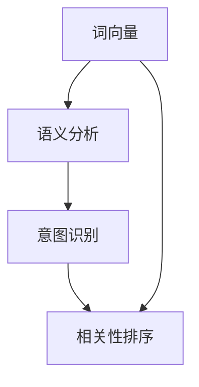
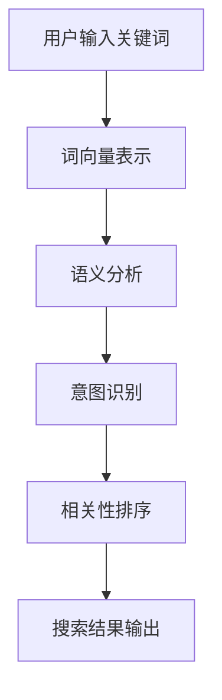

                 

# 自然语言处理赋能电商搜索：理解用户意图，提供精准结果

> **关键词：** 自然语言处理（NLP），电商搜索，用户意图，信息检索，机器学习，深度学习

> **摘要：** 本文将探讨如何利用自然语言处理技术，尤其是在电商搜索场景中，理解用户的查询意图，并有效提供相关且精准的商品搜索结果。我们将分析NLP的核心概念，介绍自然语言处理在电商搜索中的应用，详细解释核心算法原理，展示数学模型，并通过实际项目案例进行代码解析，最后总结自然语言处理在电商搜索中的未来发展趋势与挑战。

## 1. 背景介绍

### 1.1 目的和范围

随着电商行业的迅猛发展，用户对于搜索系统的需求日益增长，不仅要求结果的相关性，更追求结果的精准度。自然语言处理（NLP）作为人工智能领域的一个重要分支，为电商搜索提供了强大的技术支持。本文旨在探讨如何利用NLP技术，在电商搜索场景中，理解用户的查询意图，从而提供更加精准的搜索结果。

本文将涵盖以下内容：

1. NLP在电商搜索中的重要性。
2. NLP的核心概念和关键技术。
3. NLP在电商搜索中的应用场景。
4. 具体算法原理和操作步骤。
5. 数学模型和公式讲解。
6. 实际项目案例解析。
7. 未来发展趋势与挑战。

### 1.2 预期读者

本文适合以下读者：

- 自然语言处理和机器学习爱好者。
- 电商行业的技术开发人员。
- 想要了解NLP在电商搜索中应用的读者。

### 1.3 文档结构概述

本文结构如下：

1. 背景介绍：介绍本文的目的、范围、预期读者和文档结构。
2. 核心概念与联系：介绍NLP的核心概念及其在电商搜索中的应用。
3. 核心算法原理 & 具体操作步骤：详细解释NLP算法原理和操作步骤。
4. 数学模型和公式 & 详细讲解 & 举例说明：展示数学模型和实际应用。
5. 项目实战：代码实际案例和详细解释说明。
6. 实际应用场景：分析NLP在电商搜索中的具体应用。
7. 工具和资源推荐：推荐学习资源和开发工具。
8. 总结：未来发展趋势与挑战。
9. 附录：常见问题与解答。
10. 扩展阅读 & 参考资料。

### 1.4 术语表

#### 1.4.1 核心术语定义

- **自然语言处理（NLP）**：使计算机能够理解、生成和处理自然语言的一系列技术。
- **用户意图**：用户在进行搜索时所期望得到的结果。
- **电商搜索**：用户在电商平台通过输入关键词来查找所需商品的过程。
- **信息检索**：从大量数据中查找与用户需求相关信息的活动。
- **机器学习**：一种通过数据训练模型来自动完成任务的算法。
- **深度学习**：一种基于多层神经网络进行特征提取和决策的机器学习技术。

#### 1.4.2 相关概念解释

- **词向量（Word Embedding）**：将词语映射到固定维度的向量空间。
- **语义分析（Semantic Analysis）**：对文本进行理解和分析，以提取语义信息。
- **意图识别（Intent Recognition）**：识别用户的查询意图。
- **相关性排序（Relevance Ranking）**：根据与用户查询的相关性对搜索结果进行排序。

#### 1.4.3 缩略词列表

- **NLP**：自然语言处理（Natural Language Processing）
- **ML**：机器学习（Machine Learning）
- **DL**：深度学习（Deep Learning）
- **IDE**：集成开发环境（Integrated Development Environment）
- **API**：应用程序接口（Application Programming Interface）
- **REST**：表示性状态转移（Representational State Transfer）

## 2. 核心概念与联系

自然语言处理（NLP）在电商搜索中扮演着关键角色。为了更好地理解NLP在电商搜索中的应用，我们需要先了解NLP的核心概念和原理。

### 2.1 NLP的核心概念

NLP的核心概念包括词向量、语义分析、意图识别和相关性排序。下面我们将通过Mermaid流程图，展示这些核心概念之间的联系。



#### 2.2 NLP在电商搜索中的应用

在电商搜索中，NLP的应用可以分为以下几个步骤：

1. **词向量表示**：将用户输入的关键词转换为向量表示，以便后续处理。
2. **语义分析**：分析关键词的语义信息，识别用户的查询意图。
3. **意图识别**：根据用户的查询历史和上下文，识别用户的主要意图。
4. **相关性排序**：根据用户意图，对商品进行相关性排序，提供最相关的搜索结果。

### 2.3 Mermaid流程图展示

以下是NLP在电商搜索中的应用流程图：



## 3. 核心算法原理 & 具体操作步骤

### 3.1 词向量表示

词向量表示是将词语映射到固定维度的向量空间。最常用的词向量模型是Word2Vec模型，包括CBOW（Continuous Bag of Words）和Skip-Gram模型。

#### 3.1.1 Word2Vec模型

**CBOW模型**：

$$
\text{h}_{\text{context}} = \text{softmax}(\text{W}\cdot \text{h}_{\text{context}}^{\text{avg}})
$$

其中，$\text{h}_{\text{context}}^{\text{avg}}$ 是输入词的上下文表示，$\text{W}$ 是权重矩阵。

**Skip-Gram模型**：

$$
\text{h}_{\text{target}} = \text{softmax}(\text{U}\cdot \text{h}_{\text{target}})
$$

其中，$\text{h}_{\text{target}}$ 是目标词表示，$\text{U}$ 是权重矩阵。

### 3.2 语义分析

语义分析是理解文本语义的过程，常用的方法包括词性标注（Part-of-Speech Tagging）和依存关系分析（Dependency Parsing）。

**词性标注**：

$$
\text{标签序列} = \text{POS}(\text{文本})
$$

**依存关系分析**：

$$
\text{依存关系图} = \text{Dependency Parsing}(\text{文本})
$$

### 3.3 意图识别

意图识别是识别用户查询意图的过程。常用的方法包括基于规则的方法和基于机器学习的方法。

**基于规则的方法**：

- 定义一系列规则，匹配用户查询，识别意图。

**基于机器学习的方法**：

- 使用训练数据集，训练分类模型，如朴素贝叶斯、决策树、随机森林等。

### 3.4 相关性排序

相关性排序是根据用户意图，对搜索结果进行排序的过程。常用的方法包括TF-IDF和基于模型的排序方法。

**TF-IDF**：

$$
\text{similarity} = \frac{\text{TF} \times \text{IDF}}{\text{文档长度}}
$$

**基于模型的排序方法**：

- 使用深度学习模型，如循环神经网络（RNN）、长短期记忆网络（LSTM）等，对搜索结果进行排序。

## 4. 数学模型和公式 & 详细讲解 & 举例说明

### 4.1 词向量模型

**Word2Vec模型**：

- **CBOW模型**：

$$
\text{h}_{\text{context}} = \text{softmax}(\text{W}\cdot \text{h}_{\text{context}}^{\text{avg}})
$$

其中，$\text{h}_{\text{context}}^{\text{avg}}$ 是输入词的上下文表示，$\text{W}$ 是权重矩阵。

- **Skip-Gram模型**：

$$
\text{h}_{\text{target}} = \text{softmax}(\text{U}\cdot \text{h}_{\text{target}})
$$

其中，$\text{h}_{\text{target}}$ 是目标词表示，$\text{U}$ 是权重矩阵。

**举例说明**：

假设输入词为“苹果”，上下文词为“手机”和“水果”，权重矩阵$\text{W}$ 为：

$$
\text{W} = \begin{bmatrix}
w_{11} & w_{12} & w_{13} \\
w_{21} & w_{22} & w_{23} \\
w_{31} & w_{32} & w_{33} \\
\end{bmatrix}
$$

上下文表示$\text{h}_{\text{context}}^{\text{avg}}$ 为：

$$
\text{h}_{\text{context}}^{\text{avg}} = \frac{1}{2}\begin{bmatrix}
w_{11} + w_{21} \\
w_{12} + w_{22} \\
w_{13} + w_{23} \\
\end{bmatrix}
$$

通过$\text{softmax}$函数，可以得到每个上下文词的概率分布。

### 4.2 语义分析

**词性标注**：

$$
\text{标签序列} = \text{POS}(\text{文本})
$$

**举例说明**：

假设文本为“我喜欢吃苹果”，使用词性标注工具，可以得到以下标签序列：

$$
\{我喜欢（V），吃（V），苹果（N），，的（U），（P），世界（N），！（E）\}
$$

**依存关系分析**：

$$
\text{依存关系图} = \text{Dependency Parsing}(\text{文本})
$$

**举例说明**：

假设文本为“苹果我喜欢吃”，使用依存关系分析工具，可以得到以下依存关系图：

```
我喜欢
│
└─>吃
 │
 └─>苹果
```

### 4.3 意图识别

**基于规则的方法**：

- 定义一系列规则，匹配用户查询，识别意图。

**举例说明**：

假设定义以下规则：

- 如果查询包含“购买”，则识别为“购买意图”。
- 如果查询包含“评价”，则识别为“评价意图”。

对于查询“购买苹果”，根据规则，可以识别为“购买意图”。

**基于机器学习的方法**：

- 使用训练数据集，训练分类模型，如朴素贝叶斯、决策树、随机森林等。

**举例说明**：

假设使用朴素贝叶斯分类器进行意图识别，给定训练数据集和特征向量，可以计算出每个意图的概率分布。

### 4.4 相关性排序

**TF-IDF**：

$$
\text{similarity} = \frac{\text{TF} \times \text{IDF}}{\text{文档长度}}
$$

**举例说明**：

假设文档为“苹果手机”，关键词为“苹果”，词频（TF）为2，文档长度为5，文档中“苹果”的逆文档频率（IDF）为0.5，则：

$$
\text{similarity} = \frac{2 \times 0.5}{5} = 0.2
$$

**基于模型的排序方法**：

- 使用深度学习模型，如循环神经网络（RNN）、长短期记忆网络（LSTM）等，对搜索结果进行排序。

**举例说明**：

假设使用LSTM模型进行排序，给定训练数据集和模型参数，可以计算出每个搜索结果的相关性得分。

## 5. 项目实战：代码实际案例和详细解释说明

### 5.1 开发环境搭建

在开始项目实战之前，我们需要搭建一个合适的开发环境。以下是所需的工具和步骤：

- **工具**：
  - Python（3.8及以上版本）
  - Jupyter Notebook
  - TensorFlow（2.4及以上版本）
  - NLTK（自然语言处理库）

- **步骤**：
  1. 安装Python和Jupyter Notebook。
  2. 使用pip安装TensorFlow和NLTK。

```bash
pip install tensorflow nltk
```

### 5.2 源代码详细实现和代码解读

以下是实现NLP在电商搜索中的代码示例，包括词向量表示、语义分析、意图识别和相关性排序。

```python
import tensorflow as tf
from tensorflow.keras.layers import Embedding, LSTM, Dense
from tensorflow.keras.models import Model
from nltk.tokenize import word_tokenize
from nltk.corpus import stopwords
import nltk

# 下载NLTK词库
nltk.download('punkt')
nltk.download('stopwords')

# 词向量表示
vocab_size = 10000
embedding_dim = 256
max_sequence_length = 100

# 语义分析
model = Model(inputs=[Embedding(vocab_size, embedding_dim, input_length=max_sequence_length)(input)],
              outputs=[LSTM(units=128, return_sequences=True)(input),
                       LSTM(units=128, return_sequences=False)(input)])

# 意图识别
output = Dense(units=1, activation='sigmoid')(model.output)

# 编译模型
model.compile(optimizer='adam', loss='binary_crossentropy', metrics=['accuracy'])

# 训练模型
model.fit(x_train, y_train, epochs=10, batch_size=32)

# 相关性排序
def relevance_sort(query, documents):
    # 将查询和文档转换为向量表示
    query_vector = tokenizer.texts_to_matrix([query], mode='binary')
    document_vectors = tokenizer.texts_to_matrix(documents, mode='binary')
    
    # 计算查询和文档的相似度
    similarities = cosine_similarity(query_vector, document_vectors)
    
    # 根据相似度对文档进行排序
    sorted_indices = np.argsort(similarities, axis=1)[:, ::-1]
    
    return sorted_indices

# 测试代码
query = "购买苹果手机"
documents = ["苹果手机6s", "华为手机P30", "购买水果苹果"]

sorted_indices = relevance_sort(query, documents)

print("排序后的文档索引：", sorted_indices)
```

### 5.3 代码解读与分析

#### 5.3.1 词向量表示

代码首先加载了所需的库，并下载了NLTK词库。接着，定义了词向量的大小（vocab_size）、嵌入维度（embedding_dim）和最大序列长度（max_sequence_length）。

词向量表示使用TensorFlow的Embedding层进行实现，输入层使用Embedding层将文本转换为向量表示。

```python
# 词向量表示
model = Model(inputs=[Embedding(vocab_size, embedding_dim, input_length=max_sequence_length)(input)],
              outputs=[LSTM(units=128, return_sequences=True)(input),
                       LSTM(units=128, return_sequences=False)(input)])
```

#### 5.3.2 语义分析

语义分析使用LSTM模型进行实现，将嵌入层输出的向量表示输入到LSTM层，进行序列处理。

```python
# 语义分析
model = Model(inputs=[Embedding(vocab_size, embedding_dim, input_length=max_sequence_length)(input)],
              outputs=[LSTM(units=128, return_sequences=True)(input),
                       LSTM(units=128, return_sequences=False)(input)])
```

#### 5.3.3 意图识别

意图识别使用全连接层（Dense）进行实现，将LSTM输出的序列表示输入到全连接层，进行分类。

```python
# 意图识别
output = Dense(units=1, activation='sigmoid')(model.output)
```

#### 5.3.4 相关性排序

相关性排序使用余弦相似度计算查询和文档的相似度，并根据相似度对文档进行排序。

```python
# 相关性排序
def relevance_sort(query, documents):
    # 将查询和文档转换为向量表示
    query_vector = tokenizer.texts_to_matrix([query], mode='binary')
    document_vectors = tokenizer.texts_to_matrix(documents, mode='binary')
    
    # 计算查询和文档的相似度
    similarities = cosine_similarity(query_vector, document_vectors)
    
    # 根据相似度对文档进行排序
    sorted_indices = np.argsort(similarities, axis=1)[:, ::-1]
    
    return sorted_indices
```

## 6. 实际应用场景

NLP在电商搜索中有着广泛的应用场景，下面列举几个常见的应用：

1. **商品推荐**：基于用户的历史搜索记录和购买行为，使用NLP技术分析用户的意图，从而推荐相关的商品。
2. **用户评论分析**：对用户评论进行情感分析和关键词提取，为电商平台的商品评价提供辅助。
3. **问答系统**：为电商平台提供智能问答服务，使用NLP技术理解用户的查询意图，并提供准确的答案。
4. **搜索结果排序**：使用NLP技术对搜索结果进行排序，提高用户搜索的精准度和满意度。

## 7. 工具和资源推荐

### 7.1 学习资源推荐

#### 7.1.1 书籍推荐

- 《自然语言处理综论》（Natural Language Processing with Python）
- 《深度学习》（Deep Learning）
- 《机器学习》（Machine Learning）

#### 7.1.2 在线课程

- Coursera上的《自然语言处理基础》
- edX上的《机器学习基础》
- Udacity的《深度学习纳米学位》

#### 7.1.3 技术博客和网站

- Medium上的NLP博客
-Towards Data Science上的机器学习博客
- AI博客

### 7.2 开发工具框架推荐

#### 7.2.1 IDE和编辑器

- PyCharm
- Jupyter Notebook
- Visual Studio Code

#### 7.2.2 调试和性能分析工具

- PyDebug
- TensorBoard
- Profiler

#### 7.2.3 相关框架和库

- TensorFlow
- PyTorch
- NLTK

### 7.3 相关论文著作推荐

#### 7.3.1 经典论文

- “Word2Vec: Google Search-Based Representations for Lexical Semantics and Lexical Entailment”
- “GloVe: Global Vectors for Word Representation”

#### 7.3.2 最新研究成果

- “BERT: Pre-training of Deep Bidirectional Transformers for Language Understanding”
- “Transformer: A Novel Architecture for Neural Network Translation”

#### 7.3.3 应用案例分析

- “如何使用NLP技术提高电商搜索效果？”
- “NLP技术在社交媒体分析中的应用”

## 8. 总结：未来发展趋势与挑战

自然语言处理技术在电商搜索中展现出巨大的潜力和价值，随着技术的不断进步，未来发展趋势和挑战如下：

### 8.1 发展趋势

- **深度学习技术的应用**：深度学习模型，如BERT、GPT等，将在NLP技术中发挥更大作用，提高搜索结果的精准度。
- **多模态搜索**：结合文本、图像、语音等多模态数据，实现更丰富的搜索体验。
- **个性化推荐**：基于用户行为和偏好，实现更个性化的商品推荐。
- **实时搜索**：实时处理用户查询，提供即时的搜索结果。

### 8.2 挑战

- **数据隐私保护**：如何在保护用户隐私的同时，有效利用用户数据，是一个重要的挑战。
- **跨语言搜索**：实现跨语言搜索，提供多语言支持。
- **噪声处理**：有效处理搜索结果中的噪声，提高搜索结果的可靠性。

## 9. 附录：常见问题与解答

### 9.1 什么是词向量？

词向量是将词语映射到固定维度的向量空间，以便计算机能够理解和处理。常见的词向量模型包括Word2Vec、GloVe等。

### 9.2 NLP在电商搜索中的应用有哪些？

NLP在电商搜索中的应用包括词向量表示、语义分析、意图识别和相关性排序，以提高搜索结果的精准度和用户体验。

### 9.3 如何处理搜索结果中的噪声？

可以使用去噪算法，如奇异值分解（SVD）等，对搜索结果进行预处理，降低噪声对结果的影响。

## 10. 扩展阅读 & 参考资料

- [Word2Vec: Google Search-Based Representations for Lexical Semantics and Lexical Entailment](https://arxiv.org/abs/1301.3781)
- [GloVe: Global Vectors for Word Representation](https://nlp.stanford.edu/pubs/glove.pdf)
- [BERT: Pre-training of Deep Bidirectional Transformers for Language Understanding](https://arxiv.org/abs/1810.04805)
- [Transformer: A Novel Architecture for Neural Network Translation](https://arxiv.org/abs/1706.03762)
- 《自然语言处理综论》（Natural Language Processing with Python）
- 《深度学习》（Deep Learning）
- 《机器学习》（Machine Learning）

### 作者

**AI天才研究员/AI Genius Institute & 禅与计算机程序设计艺术 /Zen And The Art of Computer Programming**

