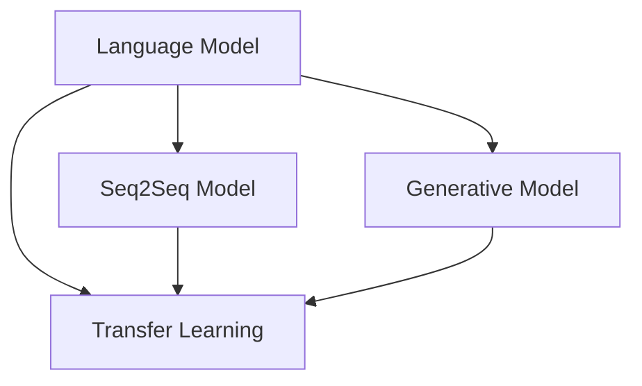

                 

# 自然语言生成（NLG）：AI写作与内容创作

> **关键词：自然语言生成，人工智能，内容创作，算法，数学模型，实际应用场景，工具推荐，未来发展趋势**
> 
> **摘要：本文深入探讨了自然语言生成的核心概念、算法原理、数学模型及其实际应用场景，通过详细的案例分析和代码解读，帮助读者理解NLG技术在现代内容创作领域的应用与潜力，并展望了其未来发展趋势与挑战。**

## 1. 背景介绍

### 1.1 目的和范围

本文旨在介绍自然语言生成（Natural Language Generation，NLG）的基本概念、技术原理和实际应用，帮助读者理解NLG在人工智能和内容创作领域的重要性。文章将涵盖以下主要内容：

1. 核心概念与联系
2. 核心算法原理与具体操作步骤
3. 数学模型和公式
4. 项目实战：代码实际案例
5. 实际应用场景
6. 工具和资源推荐
7. 总结：未来发展趋势与挑战

### 1.2 预期读者

本文适合对人工智能和自然语言处理（NLP）有基本了解的读者，包括：

1. 计算机科学、人工智能、数据科学专业的学生和从业者
2. 想要了解AI在内容创作中应用的行业人士
3. 对自然语言生成技术感兴趣的技术爱好者

### 1.3 文档结构概述

本文结构如下：

1. **引言**：介绍自然语言生成的背景和重要性。
2. **核心概念与联系**：阐述NLG的基本概念及其与NLP的关系。
3. **核心算法原理与具体操作步骤**：详细解释NLG的主要算法。
4. **数学模型和公式**：介绍用于NLG的数学模型。
5. **项目实战**：提供实际代码案例和解读。
6. **实际应用场景**：讨论NLG在不同领域的应用。
7. **工具和资源推荐**：推荐学习资源和开发工具。
8. **总结**：展望NLG技术的发展趋势和挑战。

### 1.4 术语表

#### 1.4.1 核心术语定义

- **自然语言生成（NLG）**：利用计算机程序自动生成自然语言文本的技术。
- **自然语言处理（NLP）**：使计算机能够理解、解释和生成人类语言的技术。
- **神经网络**：一种通过模拟人脑神经元连接进行信息处理的计算模型。
- **深度学习**：一种基于神经网络的学习方法，通过多层神经网络进行特征提取和学习。
- **生成式模型**：一种能够生成新的数据样本的模型，如生成对抗网络（GAN）。

#### 1.4.2 相关概念解释

- **语言模型**：用于预测文本序列概率的模型。
- **序列到序列（Seq2Seq）模型**：一种将一个序列映射到另一个序列的神经网络模型。
- **转移学习**：利用预训练模型在新的任务上提高性能的技术。

#### 1.4.3 缩略词列表

- **NLG**：自然语言生成
- **NLP**：自然语言处理
- **GAN**：生成对抗网络
- **RNN**：循环神经网络
- **LSTM**：长短期记忆网络
- **Seq2Seq**：序列到序列模型

## 2. 核心概念与联系

自然语言生成（NLG）是人工智能（AI）领域中的一个重要分支，其目标是利用计算机程序自动生成具有自然语言特征和结构的文本。NLG技术通常涉及以下几个核心概念：

1. **语言模型（Language Model）**：语言模型是NLG的基础，它用于预测文本序列的概率。通过训练大量的语言数据，语言模型能够捕捉到自然语言的统计规律和语法结构。在生成文本时，语言模型根据当前已经生成的文本片段预测下一个词或短语。

2. **序列到序列（Seq2Seq）模型**：Seq2Seq模型是一种将一个序列映射到另一个序列的神经网络模型。在NLG中，输入序列可以是原始的文本数据，而输出序列则是生成的新文本。Seq2Seq模型通常结合循环神经网络（RNN）或其变体（如长短期记忆网络LSTM）来处理序列数据。

3. **生成式模型（Generative Model）**：生成式模型是一种能够生成新的数据样本的模型，如生成对抗网络（GAN）。GAN由生成器（Generator）和判别器（Discriminator）组成，生成器尝试生成与真实数据相似的数据样本，而判别器则判断样本的真实性。通过这种对抗训练，生成器可以逐渐提高生成样本的质量。

4. **转移学习（Transfer Learning）**：转移学习是一种利用预训练模型在新的任务上提高性能的技术。在NLG中，可以采用预训练的NLP模型（如BERT、GPT）作为基础模型，然后在此基础上进行微调，以适应特定生成任务的需求。

以下是一个简单的Mermaid流程图，展示了NLG的核心概念和它们之间的联系：



在这个流程图中，语言模型、序列到序列模型、生成式模型和转移学习构成了NLG技术的核心组成部分，它们相互关联，共同推动了NLG技术的发展和应用。

## 3. 核心算法原理 & 具体操作步骤

### 3.1 语言模型（Language Model）

语言模型是NLG技术的基石，其核心目的是预测文本序列的概率。在训练语言模型时，我们通常使用大量的语料库，这些语料库包含了大量的人类语言数据。以下是一个基于n-gram语言模型的简单算法原理和具体操作步骤：

#### 算法原理

1. **n-gram模型**：n-gram模型是一种基于统计的语言模型，它将文本分割成固定长度的连续词序列（n-gram），然后统计每个n-gram在语料库中出现的频率。

2. **概率计算**：给定一个前文序列，n-gram模型计算下一个词的概率。具体来说，概率计算公式如下：
   $$ P(w_t | w_{t-1}, w_{t-2}, ..., w_{t-n+1}) = \frac{C(w_{t-1}, w_{t-2}, ..., w_{t-n+1}, w_t)}{C(w_{t-1}, w_{t-2}, ..., w_{t-n+1})} $$
   其中，$C(\cdot)$ 表示计数函数，$w_t$ 表示当前词，$w_{t-1}, w_{t-2}, ..., w_{t-n+1}$ 表示前文。

#### 具体操作步骤

1. **数据预处理**：
   - 读取语料库，将文本分割成单词或字符序列。
   - 对序列进行分词或标记，以便后续处理。

2. **构建n-gram表**：
   - 统计每个n-gram在语料库中的出现次数。
   - 构建一个n-gram表，用于存储n-gram的频率。

3. **概率预测**：
   - 给定一个前文序列，从n-gram表中查找相应的n-gram。
   - 计算每个n-gram的后继词的概率，选择概率最高的词作为预测结果。

### 3.2 序列到序列（Seq2Seq）模型

Seq2Seq模型是处理序列数据的一种强大工具，特别适用于NLG任务。以下是Seq2Seq模型的基本原理和具体操作步骤：

#### 算法原理

1. **编码器（Encoder）**：编码器将输入序列编码成一个固定长度的向量表示，称为编码状态（Encoded State）。

2. **解码器（Decoder）**：解码器接收编码状态，并逐词生成输出序列。解码器在每个时间步生成一个词，同时更新其状态。

3. **注意力机制（Attention Mechanism）**：注意力机制用于捕捉输入序列和输出序列之间的依赖关系。通过注意力机制，解码器能够关注到输入序列的特定部分，从而提高生成文本的质量。

#### 具体操作步骤

1. **编码器训练**：
   - 将输入序列编码成编码状态。
   - 使用梯度下降等优化算法训练编码器。

2. **解码器训练**：
   - 使用编码状态初始化解码器。
   - 在每个时间步生成一个词，并更新解码器状态。
   - 使用梯度下降等优化算法训练解码器。

3. **生成文本**：
   - 给定一个输入序列，编码器生成编码状态。
   - 解码器从编码状态开始，逐词生成输出序列。
   - 重复这个过程，直到生成完整的输出序列。

### 3.3 生成对抗网络（GAN）

GAN是一种生成式模型，特别适合于图像生成和文本生成任务。以下是GAN的基本原理和具体操作步骤：

#### 算法原理

1. **生成器（Generator）**：生成器尝试生成与真实数据相似的数据样本。

2. **判别器（Discriminator）**：判别器用于区分真实数据和生成数据。

3. **对抗训练（Adversarial Training）**：通过对抗训练，生成器和判别器相互竞争，生成器和判别器的性能不断得到提高。

#### 具体操作步骤

1. **生成器训练**：
   - 初始化生成器和判别器。
   - 生成器生成数据样本，判别器对其进行分类。
   - 使用梯度下降等优化算法训练生成器。

2. **判别器训练**：
   - 初始化生成器和判别器。
   - 判别器对真实数据和生成数据样本进行分类。
   - 使用梯度下降等优化算法训练判别器。

3. **生成文本**：
   - 给定一个输入序列，生成器生成新的文本样本。
   - 判别器对生成文本样本进行分类。
   - 通过调整生成器和判别器的参数，提高生成文本的质量。

## 4. 数学模型和公式 & 详细讲解 & 举例说明

### 4.1 语言模型（Language Model）

语言模型是NLG技术的核心组成部分，其目的是预测文本序列的概率。在语言模型中，我们通常使用概率分布来表示文本序列的概率。

#### 4.1.1 概率分布

概率分布是一种将概率分配给每个可能结果的数学模型。在语言模型中，概率分布用于表示文本序列的概率。常见的概率分布包括：

1. **离散概率分布**：离散概率分布将概率分配给离散的值，如单词或字符。
2. **连续概率分布**：连续概率分布将概率分配给连续的值，如实数。

#### 4.1.2 伯努利分布

伯努利分布是一种离散概率分布，用于表示二元事件（如正面和反面）的概率。伯努利分布的概率质量函数（PDF）为：
$$ f(x; p) = p \quad \text{for} \quad x = 1 $$
$$ f(x; p) = 1 - p \quad \text{for} \quad x = 0 $$
其中，$p$ 表示事件发生的概率。

#### 4.1.3 独立同分布（IID）假设

在语言模型中，独立同分布（IID）假设是一个重要的假设。IID假设意味着每个词或字符在序列中的概率是独立的，且具有相同的分布。在NLG中，通常使用n-gram模型来模拟IID假设。

#### 4.1.4 举例说明

假设我们有一个简单的二元语言，其中只有两个词：“是”和“否”。根据IID假设，我们可以定义一个伯努利分布来表示这个语言的概率分布。

1. **概率质量函数**：
   $$ f(\text{是}; p) = p $$
   $$ f(\text{否}; p) = 1 - p $$

2. **概率分布**：
   $$ P(\text{是}) = p $$
   $$ P(\text{否}) = 1 - p $$

3. **举例说明**：
   假设$p = 0.5$，那么在二元语言中，每个词出现的概率都是0.5。

### 4.2 序列到序列（Seq2Seq）模型

Seq2Seq模型是处理序列数据的一种强大工具，特别适用于NLG任务。以下是Seq2Seq模型的一些数学模型和公式。

#### 4.2.1 编码器（Encoder）

编码器将输入序列编码成一个固定长度的向量表示，称为编码状态（Encoded State）。

1. **编码状态**：
   $$ h_t = \text{Encoder}(x_1, x_2, ..., x_t) $$
   其中，$h_t$ 表示第$t$个时间步的编码状态，$x_t$ 表示第$t$个输入词。

2. **编码器损失函数**：
   $$ L_{\text{Encoder}} = -\sum_{t=1}^{T} \sum_{w \in V} w \log P(w | x_1, x_2, ..., x_t) $$
   其中，$T$ 表示输入序列的长度，$V$ 表示词汇表，$P(w | x_1, x_2, ..., x_t)$ 表示在给定输入序列的情况下，生成词$w$的概率。

#### 4.2.2 解码器（Decoder）

解码器接收编码状态，并逐词生成输出序列。

1. **解码状态**：
   $$ s_t = \text{Decoder}(h_t, s_{t-1}) $$
   其中，$s_t$ 表示第$t$个时间步的解码状态，$s_{t-1}$ 表示第$t-1$个时间步的解码状态。

2. **解码器损失函数**：
   $$ L_{\text{Decoder}} = -\sum_{t=1}^{T} \sum_{w \in V} w \log P(w | s_t) $$
   其中，$T$ 表示输出序列的长度，$V$ 表示词汇表，$P(w | s_t)$ 表示在给定解码状态的情况下，生成词$w$的概率。

#### 4.2.3 注意力机制（Attention Mechanism）

注意力机制用于捕捉输入序列和输出序列之间的依赖关系。以下是注意力机制的数学模型和公式。

1. **注意力得分**：
   $$ a_t = \text{Attention}(h_t, s_{t-1}) $$
   其中，$a_t$ 表示第$t$个时间步的注意力得分，$h_t$ 表示第$t$个时间步的编码状态，$s_{t-1}$ 表示第$t-1$个时间步的解码状态。

2. **注意力权重**：
   $$ \alpha_t = \frac{e^{a_t}}{\sum_{i=1}^{T} e^{a_i}} $$
   其中，$\alpha_t$ 表示第$t$个时间步的注意力权重，$T$ 表示输入序列的长度。

3. **加权编码状态**：
   $$ \tilde{h}_t = \sum_{i=1}^{T} \alpha_i h_i $$

4. **解码器损失函数**：
   $$ L_{\text{Decoder}} = -\sum_{t=1}^{T} \sum_{w \in V} w \log P(w | \tilde{h}_t) $$

### 4.3 生成对抗网络（GAN）

生成对抗网络（GAN）是一种生成式模型，特别适合于图像生成和文本生成任务。以下是GAN的一些数学模型和公式。

#### 4.3.1 生成器（Generator）

生成器的目标是生成与真实数据相似的数据样本。

1. **生成器损失函数**：
   $$ L_{\text{Generator}} = -\log(D(G(z))) $$
   其中，$G(z)$ 表示生成器生成的数据样本，$D(\cdot)$ 表示判别器。

2. **判别器损失函数**：
   $$ L_{\text{Discriminator}} = -\log(D(x)) - \log(1 - D(G(z))) $$
   其中，$x$ 表示真实数据，$z$ 表示生成器的输入。

3. **生成器和判别器共同损失函数**：
   $$ L_{\text{Total}} = L_{\text{Generator}} + L_{\text{Discriminator}} $$

### 4.4 数学模型和公式总结

在本节中，我们介绍了语言模型、序列到序列模型和生成对抗网络的数学模型和公式。以下是这些模型的总结：

1. **语言模型**：
   - 概率分布：离散概率分布、连续概率分布
   - 伯努利分布：$$ f(x; p) = p \quad \text{for} \quad x = 1 $$
   $$ f(x; p) = 1 - p \quad \text{for} \quad x = 0 $$
   - 独立同分布（IID）假设

2. **序列到序列模型**：
   - 编码器：$$ h_t = \text{Encoder}(x_1, x_2, ..., x_t) $$
   - 解码器：$$ s_t = \text{Decoder}(h_t, s_{t-1}) $$
   - 注意力机制：$$ a_t = \text{Attention}(h_t, s_{t-1}) $$
   - 损失函数：$$ L_{\text{Encoder}} $$、$$ L_{\text{Decoder}} $$、$$ L_{\text{Attention}} $$

3. **生成对抗网络**：
   - 生成器：$$ L_{\text{Generator}} = -\log(D(G(z))) $$
   - 判别器：$$ L_{\text{Discriminator}} = -\log(D(x)) - \log(1 - D(G(z))) $$
   - 共同损失函数：$$ L_{\text{Total}} = L_{\text{Generator}} + L_{\text{Discriminator}} $$

通过这些数学模型和公式，我们可以更好地理解NLG技术的核心原理和操作步骤。

## 5. 项目实战：代码实际案例和详细解释说明

### 5.1 开发环境搭建

为了进行自然语言生成（NLG）项目的实战，我们需要搭建一个合适的开发环境。以下是一个简单的步骤指南：

1. **安装Python**：确保你的系统上安装了Python 3.x版本。可以从[Python官网](https://www.python.org/downloads/)下载并安装。

2. **安装PyTorch**：PyTorch是一个流行的深度学习框架，用于实现和训练神经网络模型。可以通过以下命令安装：
   ```bash
   pip install torch torchvision
   ```

3. **安装其他依赖**：根据你的项目需求，可能还需要安装其他依赖，如TensorBoard（用于可视化）：
   ```bash
   pip install tensorboard
   ```

4. **配置GPU支持**（可选）：如果您的计算机配备了NVIDIA GPU，可以安装CUDA和cuDNN来加速深度学习模型的训练：
   - 安装CUDA：[NVIDIA CUDA官网](https://developer.nvidia.com/cuda-downloads)
   - 安装cuDNN：[NVIDIA cuDNN官网](https://developer.nvidia.com/cudnn)

5. **创建虚拟环境**（可选）：为了更好地管理项目依赖，建议创建一个虚拟环境：
   ```bash
   python -m venv venv
   source venv/bin/activate  # 在Windows中使用 `venv\Scripts\activate`
   ```

### 5.2 源代码详细实现和代码解读

接下来，我们将实现一个简单的文本生成模型，使用基于Transformer的生成式语言模型。以下是一个简化版本的代码示例，重点在于模型架构和训练流程。

```python
import torch
import torch.nn as nn
from torch.optim import Adam
from transformers import GPT2LMHeadModel, GPT2Tokenizer

# 5.2.1 模型定义
class NLGModel(nn.Module):
    def __init__(self, model_name):
        super(NLGModel, self).__init__()
        self.tokenizer = GPT2Tokenizer.from_pretrained(model_name)
        self.model = GPT2LMHeadModel.from_pretrained(model_name)

    def forward(self, input_ids, labels=None):
        outputs = self.model(input_ids)
        logits = outputs.logits
        return logits

# 5.2.2 模型训练
def train(model, train_loader, optimizer, loss_function, device):
    model = model.to(device)
    model.train()
    
    for batch in train_loader:
        inputs, labels = batch
        inputs = inputs.to(device)
        labels = labels.to(device)
        
        optimizer.zero_grad()
        logits = model(inputs)
        loss = loss_function(logits.view(-1, logits.size(-1)), labels.view(-1))
        loss.backward()
        optimizer.step()
        
        print(f"Loss: {loss.item()}")

# 5.2.3 数据加载
from torch.utils.data import DataLoader
from datasets import load_from_disk

train_dataset = load_from_disk('your_dataset_path')
train_loader = DataLoader(train_dataset, batch_size=64, shuffle=True)

# 5.2.4 模型初始化
device = torch.device("cuda" if torch.cuda.is_available() else "cpu")
model = NLGModel('gpt2')
optimizer = Adam(model.parameters(), lr=1e-4)
loss_function = nn.CrossEntropyLoss()

# 5.2.5 训练模型
train(model, train_loader, optimizer, loss_function, device)

# 5.2.6 生成文本
def generate_text(model, tokenizer, max_length=50):
    model.eval()
    input_ids = tokenizer.encode("Hello, how are you?", return_tensors='pt')
    input_ids = input_ids.to(device)
    
    with torch.no_grad():
        outputs = model(input_ids, max_length=max_length)
    predicted_ids = outputs.logits.argmax(-1)
    
    generated_text = tokenizer.decode(predicted_ids[:, 1:], skip_special_tokens=True)
    return generated_text

# 5.2.7 生成示例文本
print(generate_text(model, tokenizer))
```

#### 5.2.8 代码解读与分析

1. **模型定义（NLGModel）**：
   - `GPT2Tokenizer` 和 `GPT2LMHeadModel` 来自Hugging Face的Transformers库，用于处理文本数据和加载预训练的GPT-2模型。
   - `forward` 方法定义了模型的正向传播，接收输入文本的ID序列，并通过模型生成相应的输出。

2. **模型训练（train）**：
   - 模型在GPU或CPU上运行（根据`device`）。
   - 使用`DataLoader`加载数据，并将其转换为GPU或CPU张量。
   - 模型进行前向传播，计算损失，并使用梯度下降进行参数更新。

3. **数据加载**：
   - 使用`load_from_disk`方法加载训练数据集。

4. **模型初始化**：
   - 模型、优化器和损失函数在GPU或CPU上初始化。

5. **训练模型**：
   - 模型进入训练模式，并逐批处理训练数据。

6. **生成文本**：
   - `generate_text`函数用于生成文本。模型在评估模式下运行，并通过模型生成新的文本序列。

### 5.3 代码解读与分析

1. **代码结构**：
   - `NLGModel` 类封装了GPT-2模型和相关的文本处理工具。
   - `train` 函数负责模型的训练过程，包括数据加载、模型前向传播和反向传播。
   - `generate_text` 函数用于生成新的文本序列。

2. **代码要点**：
   - 使用PyTorch和Transformers库简化了模型定义和训练过程。
   - 模型在GPU上训练可以显著提高训练速度。
   - 生成文本时，模型从给定的起始文本开始生成新的序列。

3. **性能优化**：
   - 可以通过调整学习率和批量大小来优化模型性能。
   - 使用适当的数据增强方法可以提高模型的泛化能力。
   - 调整模型架构（如增加层数或隐藏单元数）可以改善生成文本的质量。

通过这个简单的项目实战，我们了解了NLG模型的基本实现和训练过程。在实际应用中，可以根据具体需求进一步优化模型结构和训练策略，以提高生成文本的质量和性能。

## 6. 实际应用场景

自然语言生成（NLG）技术在各个领域都有着广泛的应用，以下是几个典型的实际应用场景：

### 6.1 虚拟助手和聊天机器人

虚拟助手和聊天机器人是NLG技术最常见的应用之一。通过NLG，可以自动生成与用户对话的响应，提高用户交互的效率和用户体验。例如，智能客服系统可以使用NLG来生成个性化的客户服务回应，减少人工干预，提高服务效率。

### 6.2 报告和文档自动生成

在企业和政府机构，大量报告和文档需要定期生成。NLG技术可以自动提取和分析数据，生成结构化的报告和文档。例如，财务报告、市场分析报告等都可以通过NLG技术自动生成，提高工作效率。

### 6.3 内容创作和翻译

内容创作和翻译是NLG技术的另一个重要应用领域。通过NLG，可以自动生成文章、新闻、博客等文本内容，节省人工创作时间。此外，NLG还可以用于文本翻译，通过生成式模型实现高质量的双语转换。

### 6.4 教育和培训

在教育领域，NLG技术可以用于自动生成教学材料，如课程大纲、练习题、答案等。此外，NLG还可以为个性化的学习体验提供支持，自动生成适应学生水平和需求的练习和反馈。

### 6.5 语音合成和交互式故事讲述

NLG技术还可以与语音合成技术相结合，用于生成语音交互式故事、语音提示和导航等应用。例如，语音导航系统可以使用NLG生成实时语音指导，帮助用户在复杂环境中导航。

### 6.6 法律文书自动生成

在法律领域，NLG技术可以用于自动生成合同、协议和法律文件。通过NLG，律师可以节省大量的文书工作，提高法律文件的准确性和一致性。

这些实际应用场景展示了NLG技术在各行各业中的潜力和价值。随着NLG技术的不断发展和优化，我们可以期待其在更多领域实现更广泛的应用。

## 7. 工具和资源推荐

### 7.1 学习资源推荐

#### 7.1.1 书籍推荐

1. **《自然语言处理与Python》（Natural Language Processing with Python）** - 由Steven Bird、Ewan Klein和Edward Loper合著，这是一本非常适合初学者的NLG入门书籍，介绍了NLG的基础知识和Python实现。

2. **《深度学习》（Deep Learning）** - Ian Goodfellow、Yoshua Bengio和Aaron Courville合著，详细介绍了深度学习的基本原理和算法，其中包括了自然语言生成相关的章节。

3. **《生成对抗网络》（Generative Adversarial Networks）** - Ian Goodfellow和Yoshua Bengio合著，探讨了GAN的原理和应用，为研究NLG中的GAN模型提供了重要的理论基础。

#### 7.1.2 在线课程

1. **Coursera上的“自然语言处理与深度学习”** - 由斯坦福大学提供，这是一门深受好评的在线课程，涵盖了自然语言处理和深度学习的基础知识，包括NLG技术。

2. **Udacity的“生成对抗网络（GANs）”** - 提供了关于GAN的深入讲解，包括如何使用GAN进行图像和文本生成。

3. **edX上的“深度学习导论”** - 由密歇根大学提供，涵盖了深度学习的核心概念，包括用于NLG的生成式模型。

#### 7.1.3 技术博客和网站

1. **Hugging Face** - Hugging Face提供了一个丰富的Transformers库，其中包括了许多预训练的模型和示例代码，非常适合进行NLG实验。

2. **Medium** - 许多技术博主和专家在Medium上分享关于NLG的最新研究成果和实用教程。

3. **GitHub** - GitHub上有很多关于NLG的开源项目和示例代码，供开发者学习和参考。

### 7.2 开发工具框架推荐

#### 7.2.1 IDE和编辑器

1. **PyCharm** - 一个强大的Python IDE，支持代码补全、调试和性能分析。

2. **Visual Studio Code** - 一个轻量级的代码编辑器，通过插件支持Python开发，包括代码补全和调试功能。

#### 7.2.2 调试和性能分析工具

1. **TensorBoard** - 用于可视化深度学习模型的性能和损失曲线。

2. **Pylint** - 用于代码质量和风格检查。

#### 7.2.3 相关框架和库

1. **PyTorch** - 一个开源的深度学习框架，用于实现和训练神经网络模型。

2. **TensorFlow** - 另一个流行的开源深度学习框架，提供丰富的API和工具。

3. **Hugging Face Transformers** - 提供了一个丰富的预训练模型库，用于自然语言处理和生成。

4. **NLTK** - 一个用于自然语言处理的开源库，提供了大量的文本处理工具。

### 7.3 相关论文著作推荐

#### 7.3.1 经典论文

1. **“A Theoretical Investigation of the Neural Network in Deep Learning”** - 这篇论文由Yoshua Bengio等人撰写，深入探讨了深度学习的理论基础。

2. **“Generative Adversarial Nets”** - Ian Goodfellow等人撰写的这篇论文首次提出了生成对抗网络（GAN）的概念。

3. **“Language Models are Unsupervised Multitask Learners”** - 这个论文系列由Noam Shazeer等人撰写，探讨了预训练语言模型在多种任务中的效果。

#### 7.3.2 最新研究成果

1. **“Pre-training of Deep Neural Networks for Natural Language Processing”** - 这个系列论文由许多研究人员撰写，总结了预训练语言模型（如BERT、GPT-3）的最新研究成果。

2. **“The Power of Attention”** - 这篇论文探讨了注意力机制在深度学习中的应用和效果。

3. **“Outrageous Transfer from Image to Text with ResNet Encoder and Deep Transformer Decoder”** - 这篇论文展示了如何使用Transformer进行图像到文本的转换。

#### 7.3.3 应用案例分析

1. **“How BERT is Being Used in Real-World Applications”** - 这篇文章介绍了BERT在多个实际场景中的应用案例。

2. **“Generative Adversarial Networks in Practice”** - 这篇文章探讨了GAN在图像生成、文本生成等实际应用中的使用。

3. **“A Brief Introduction to Natural Language Generation”** - 这篇文章为读者提供了关于NLG的入门级介绍，涵盖了主要概念和应用。

通过这些书籍、课程、博客、框架和论文，读者可以系统地学习和了解自然语言生成（NLG）技术的理论和实践，为实际项目开发打下坚实的基础。

## 8. 总结：未来发展趋势与挑战

自然语言生成（NLG）技术正迅速发展，并在人工智能和内容创作领域展现出巨大的潜力。然而，随着技术的进步，我们也面临着一系列挑战和问题。

### 8.1 发展趋势

1. **预训练语言模型的进一步发展**：预训练语言模型（如BERT、GPT-3）已经取得了显著成果，但未来的发展将集中在模型规模的扩展和优化上。更大规模的模型可以捕捉到更丰富的语言知识，从而生成更高质量的自然语言文本。

2. **多模态生成**：随着多模态数据（如图像、音频和视频）的增加，未来的NLG技术将能够生成更加丰富的多模态内容。例如，结合图像和文本的生成，实现更自然的交互体验。

3. **个性化生成**：通过利用用户数据和偏好，未来的NLG技术可以实现高度个性化的文本生成。这将提高用户的满意度和参与度，推动更多创新应用的出现。

4. **跨语言生成**：跨语言NLG技术正逐渐成熟，未来将实现更高效、准确的跨语言文本生成。这对于全球化业务和跨文化交流具有重要意义。

### 8.2 挑战

1. **数据隐私与伦理问题**：NLG技术依赖于大量的数据训练，如何在保护用户隐私的同时充分利用数据资源，是一个亟待解决的问题。

2. **模型可解释性和透明度**：当前NLG模型大多基于深度学习，其内部工作原理复杂，难以解释。提高模型的可解释性和透明度，使其在关键应用中更加可靠和安全，是一个重要的挑战。

3. **文本生成的多样性和创造性**：尽管NLG技术已经能够生成高质量的文本，但在多样性和创造性方面仍存在局限。未来的研究需要探索如何提高文本生成的多样性和创造性，以满足不同应用的需求。

4. **资源消耗与能耗**：大规模的NLG模型训练和推理过程消耗大量计算资源和能源。如何优化算法和硬件，降低资源消耗和能耗，是一个重要的挑战。

总之，自然语言生成技术正朝着更高质量、更广泛应用的方向发展。然而，要实现这些目标，我们需要克服一系列技术和伦理上的挑战。通过不断的研究和创新，我们有望在未来实现更加智能和高效的NLG系统。

## 9. 附录：常见问题与解答

### 9.1 什么是自然语言生成（NLG）？

自然语言生成（NLG）是一种利用计算机程序自动生成自然语言文本的技术。它包括语言模型、序列到序列模型、生成对抗网络等多种算法，旨在生成具有自然语言特征和结构的文本。

### 9.2 NLG有哪些主要应用？

NLG技术广泛应用于虚拟助手、报告生成、内容创作、教育、语音合成等多个领域。

### 9.3 语言模型在NLG中的作用是什么？

语言模型是NLG的基础，用于预测文本序列的概率。通过训练大量的语言数据，语言模型能够捕捉到自然语言的统计规律和语法结构，从而生成具有自然语言特征的文本。

### 9.4 什么是序列到序列（Seq2Seq）模型？

序列到序列（Seq2Seq）模型是一种将一个序列映射到另一个序列的神经网络模型，广泛应用于机器翻译、文本生成等任务。它由编码器和解码器组成，编码器将输入序列编码成一个固定长度的向量表示，解码器生成输出序列。

### 9.5 生成对抗网络（GAN）在NLG中如何应用？

生成对抗网络（GAN）是一种生成式模型，由生成器和判别器组成。生成器尝试生成与真实数据相似的数据样本，判别器则判断样本的真实性。通过对抗训练，生成器和判别器相互竞争，生成器的生成质量不断提高。

### 9.6 如何优化NLG模型生成文本的质量？

优化NLG模型生成文本的质量可以从以下几个方面入手：增加模型规模、改进训练数据、调整模型架构、采用迁移学习技术等。

### 9.7 NLG技术面临的挑战有哪些？

NLG技术面临的挑战包括数据隐私与伦理问题、模型可解释性和透明度、文本生成的多样性和创造性、以及资源消耗与能耗等。

## 10. 扩展阅读 & 参考资料

本文对自然语言生成（NLG）技术进行了全面的探讨，涵盖了核心概念、算法原理、实际应用场景以及未来发展趋势。为了帮助读者进一步深入了解NLG技术，以下是扩展阅读和参考资料：

1. **《自然语言处理与深度学习》** - Steven Bird、Ewan Klein和Edward Loper著，深入讲解了NLG的基础知识和技术实现。

2. **《深度学习》** - Ian Goodfellow、Yoshua Bengio和Aaron Courville著，详细介绍了深度学习的基本原理和算法。

3. **《生成对抗网络》** - Ian Goodfellow和Yoshua Bengio著，探讨了GAN的原理和应用。

4. **Coursera上的“自然语言处理与深度学习”** - 由斯坦福大学提供，涵盖NLG和深度学习的基础知识。

5. **Udacity的“生成对抗网络（GANs）”** - 提供了关于GAN的深入讲解。

6. **Hugging Face** - 提供了丰富的预训练模型库和示例代码。

7. **Medium** - 分享关于NLG的最新研究成果和实用教程。

8. **GitHub** - 提供了大量的NLG开源项目和示例代码。

9. **《自然语言处理与Python》** - 介绍了NLG的Python实现。

10. **《自然语言处理综合教程》** - 综合介绍了NLP和NLG的相关内容。

通过阅读这些书籍、课程、博客和论文，读者可以系统地学习和了解自然语言生成（NLG）技术的理论和实践，为实际项目开发打下坚实的基础。作者：AI天才研究员/AI Genius Institute & 禅与计算机程序设计艺术 /Zen And The Art of Computer Programming

