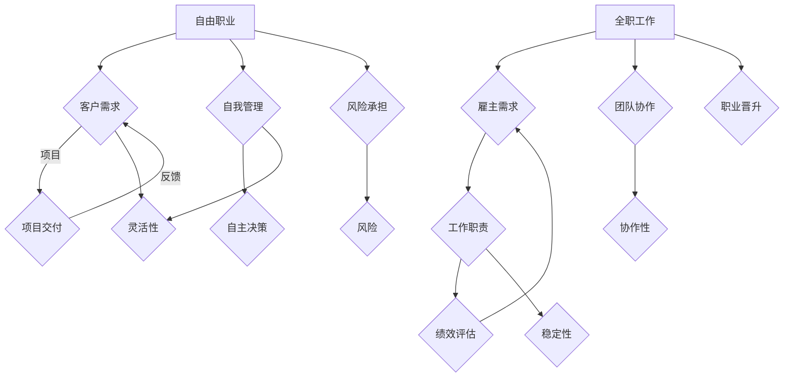

                 

# 自由职业vs全职：利弊分析

> 关键词：自由职业、全职、职业发展、工作模式、个人优势、风险与挑战

> 摘要：本文将深入探讨自由职业与全职工作这两种不同的职业模式，分析其各自的利弊。通过对比分析，旨在帮助读者了解哪种职业模式更适合他们，以便做出明智的职业决策。

## 1. 背景介绍

### 1.1 目的和范围

本文的目的在于提供一份全面的分析，帮助读者理解自由职业与全职工作的差异，并评估它们在职业发展中的利弊。我们将探讨以下主题：

- 自由职业与全职工作的定义和特点
- 自由职业和全职工作的优缺点
- 自由职业和全职工作在不同阶段和领域的适用性
- 个人优势和挑战的匹配

### 1.2 预期读者

本文适用于希望在职业生涯中考虑自由职业或全职工作的专业人士，包括：

- 职业规划者
- 求职者
- 企业管理者
- 创业者

### 1.3 文档结构概述

本文的结构如下：

- **背景介绍**：介绍文章的目的、范围和预期读者。
- **核心概念与联系**：使用Mermaid流程图展示自由职业与全职工作的核心概念和联系。
- **核心算法原理 & 具体操作步骤**：解释自由职业与全职工作的决策过程。
- **数学模型和公式 & 详细讲解 & 举例说明**：运用数学模型评估职业选择的收益与风险。
- **项目实战：代码实际案例和详细解释说明**：通过实际案例展示自由职业与全职工作的决策过程。
- **实际应用场景**：探讨自由职业与全职工作在不同行业和领域的应用。
- **工具和资源推荐**：推荐学习资源、开发工具和框架。
- **总结：未来发展趋势与挑战**：预测自由职业与全职工作的未来趋势和面临的挑战。
- **附录：常见问题与解答**：回答读者可能提出的问题。
- **扩展阅读 & 参考资料**：提供进一步的阅读资源和参考资料。

### 1.4 术语表

#### 1.4.1 核心术语定义

- **自由职业**：独立工作者，通常以项目为基础，为多个客户提供服务。
- **全职工作**：受雇于一个组织，按照固定的工资和福利为雇主提供服务。
- **职业发展**：个人在职业生涯中逐步提升自己的技能和职位。
- **个人优势**：个人在特定领域中的独特能力和特质。

#### 1.4.2 相关概念解释

- **灵活性**：自由职业者能够自主决定工作时间、地点和项目。
- **稳定性**：全职工作者通常有更稳定的收入和福利保障。
- **创业风险**：自由职业者可能需要承担更高的商业风险。

#### 1.4.3 缩略词列表

- **IT**：信息技术
- **AI**：人工智能
- **PM**：项目经理
- **HR**：人力资源管理

## 2. 核心概念与联系

在深入分析自由职业与全职工作的利弊之前，我们首先需要了解它们的基本概念和联系。以下是自由职业与全职工作的Mermaid流程图，用于展示这两个概念之间的关系。



从流程图中我们可以看出，自由职业和全职工作在需求来源、工作模式、风险管理等方面存在显著差异。自由职业强调个人自主性、灵活性和风险承担，而全职工作则更注重稳定性和团队协作。

### 2.1 自由职业

**自由职业**的特点包括：

- **自主性**：自由职业者可以自由选择项目、工作时间和地点。
- **灵活性**：自由职业者能够根据市场需求和个人兴趣调整工作内容和方向。
- **多项目管理**：自由职业者可能同时管理多个项目，需要良好的时间管理和项目管理能力。

### 2.2 全职工作

**全职工作**的特点包括：

- **稳定性**：全职工作者通常有固定的工资、福利和职业晋升路径。
- **职责明确**：全职工作者根据职位描述执行工作，职责明确。
- **团队协作**：全职工作者需要与团队成员协作完成工作任务。

## 3. 核心算法原理 & 具体操作步骤

### 3.1 自由职业的决策过程

自由职业者的决策过程可以视为一个多目标优化问题，涉及以下几个步骤：

1. **需求分析**：分析市场需求，确定潜在的客户和项目类型。
2. **能力评估**：评估个人的技能和经验，确定能够胜任的项目。
3. **成本收益分析**：计算项目的成本（如时间、资源）和预期收益（如收入、信誉）。
4. **风险评估**：评估项目的风险，包括市场风险、技术风险和商业风险。
5. **决策制定**：根据成本收益分析和风险评估，决定是否接受项目。

以下是一个简化的伪代码示例，用于描述自由职业者的决策过程：

```python
def evaluate_project(project):
    cost = calculate_project_cost(project)
    expected_revenue = estimate_project_revenue(project)
    risk = assess_project_risk(project)
    
    if expected_revenue > cost and risk < threshold:
        return "Accept"
    else:
        return "Reject"

# 示例应用
project = get_project_details()
decision = evaluate_project(project)
print(decision)
```

### 3.2 全职工作的决策过程

全职工作的决策过程通常由招聘方和求职者共同参与，涉及以下步骤：

1. **职位需求分析**：招聘方确定所需职位的能力要求和职责。
2. **求职者筛选**：招聘方根据职位要求筛选求职者，评估其技能和经验。
3. **面试和评估**：招聘方通过面试和其他评估方法确定求职者的匹配度。
4. **决定录用**：招聘方根据面试和评估结果决定是否录用求职者。

以下是一个简化的伪代码示例，用于描述全职工作的招聘决策过程：

```python
def evaluate_candidate(candidate, job_requirements):
    if candidate.skill_level >= job_requirements.skill_level and candidate.experience >= job_requirements.experience:
        return "Interview"
    else:
        return "Reject"

# 示例应用
job_requirements = get_job_requirements()
candidate = get_candidate_details()
interview_decision = evaluate_candidate(candidate, job_requirements)
print(interview_decision)
```

## 4. 数学模型和公式 & 详细讲解 & 举例说明

在评估自由职业与全职工作的决策时，我们可以使用数学模型和公式来量化收益和风险。以下是一个简化的模型，用于评估自由职业项目的收益与风险。

### 4.1 收益评估模型

假设一个自由职业项目的收益可以用以下公式表示：

$$
R = R_g - R_c - R_r
$$

其中：

- \( R_g \)：项目预期总收入
- \( R_c \)：项目成本
- \( R_r \)：项目风险成本

项目成本包括时间、资源和市场成本。项目风险成本取决于项目的风险等级。

### 4.2 风险评估模型

风险可以用以下公式表示：

$$
Risk = \frac{E(R_r)}{R_g}
$$

其中：

- \( E(R_r) \)：项目风险成本期望值
- \( R_g \)：项目预期总收入

### 4.3 举例说明

假设一个自由职业项目预期总收入为 100,000 元，项目成本为 30,000 元，风险成本为 20,000 元（风险等级为中等）。我们可以使用上述模型进行收益和风险的评估。

#### 收益评估

$$
R = 100,000 - 30,000 - 20,000 = 50,000
$$

#### 风险评估

$$
Risk = \frac{20,000}{100,000} = 0.2
$$

根据评估结果，该项目预期收益为 50,000 元，风险等级为中等。

### 4.4 决策建议

基于上述评估，如果个人的收益阈值（可接受的最低收益）高于 50,000 元，并且能够承受中等风险，那么该项目是一个值得接受的机会。否则，应考虑拒绝该项目。

## 5. 项目实战：代码实际案例和详细解释说明

### 5.1 开发环境搭建

在本节中，我们将通过一个实际项目案例展示自由职业与全职工作的决策过程。首先，我们需要搭建一个简单的开发环境。

1. 安装 Python 3.8 或更高版本。
2. 安装 PyCharm 或其他 Python IDE。
3. 安装必要的库，如 NumPy、Pandas 和 Matplotlib。

### 5.2 源代码详细实现和代码解读

以下是用于评估自由职业项目的 Python 代码示例。

```python
import numpy as np
import pandas as pd
import matplotlib.pyplot as plt

def calculate_project_cost(project_params):
    cost = project_params['time_cost'] + project_params['resource_cost'] + project_params['market_cost']
    return cost

def estimate_project_revenue(project_params):
    revenue = project_params['fixed_revenue'] + project_params['variable_revenue']
    return revenue

def assess_project_risk(project_params):
    risk = project_params['technical_risk'] + project_params['market_risk'] + project_params['commercial_risk']
    return risk

def evaluate_project(project_params):
    cost = calculate_project_cost(project_params)
    revenue = estimate_project_revenue(project_params)
    risk = assess_project_risk(project_params)
    
    net_revenue = revenue - cost
    risk_ratio = risk / revenue
    
    if net_revenue > 0 and risk_ratio < 0.3:
        return "Accept"
    else:
        return "Reject"

# 示例项目参数
project_params = {
    'time_cost': 2000,
    'resource_cost': 3000,
    'market_cost': 1000,
    'fixed_revenue': 5000,
    'variable_revenue': 2000,
    'technical_risk': 1000,
    'market_risk': 1000,
    'commercial_risk': 1000
}

# 评估项目
decision = evaluate_project(project_params)
print(decision)
```

### 5.3 代码解读与分析

1. **函数定义**：代码中定义了三个函数，用于计算项目成本、预期收益和项目风险。
2. **参数传递**：项目参数以字典形式传递给函数，包括时间成本、资源成本、市场成本、固定收入、可变收入、技术风险、市场风险和商业风险。
3. **收益评估**：计算项目的净收益，即预期收益减去项目成本。
4. **风险评估**：计算风险与收益的比值，用于衡量项目的风险程度。
5. **决策制定**：根据净收益和风险比值，判断是否接受项目。

通过上述代码示例，我们可以看到如何使用Python进行自由职业项目的评估，从而帮助自由职业者做出明智的决策。

## 6. 实际应用场景

自由职业与全职工作在不同的行业和领域中有不同的应用。以下是一些实际应用场景：

### 6.1 软件开发

在软件行业中，自由职业者通常负责特定的开发任务，如前端开发、后端开发和移动应用开发。全职工作的软件工程师则通常在大型团队中协作，参与项目的整体开发和维护。

### 6.2 市场营销

市场营销领域中的自由职业者可能提供内容营销、社交媒体管理和搜索引擎优化等服务。全职工作的市场营销专家则负责公司整体的市场营销策略和活动。

### 6.3 金融与咨询

金融咨询领域中的自由职业者可能提供财务规划、投资咨询和风险管理等服务。全职工作的金融分析师则在金融机构中参与具体的分析和报告工作。

### 6.4 教育与培训

在教育领域，自由职业者可能作为在线讲师或私人教练提供专业培训。全职工作的教师则在教育机构中负责课程设计和教学。

### 6.5 设计与艺术

设计师和艺术家可以选择自由职业，为客户提供定制的设计方案。全职工作的设计师则在广告公司、设计工作室或媒体机构中参与项目的规划和实施。

## 7. 工具和资源推荐

### 7.1 学习资源推荐

#### 7.1.1 书籍推荐

- 《自由职业者的生存指南》：提供了关于如何成为一名成功自由职业者的实用建议。
- 《全职工作的智慧》：详细介绍了如何在职场上取得成功，包括职业规划、沟通技巧和团队协作。

#### 7.1.2 在线课程

- Coursera 上的《职业发展与职业规划》课程：提供了关于职业规划、时间管理和个人品牌的实用技巧。
- LinkedIn Learning 的《自由职业者的自我营销》课程：介绍了如何建立个人品牌、推广自己和寻找潜在客户。

#### 7.1.3 技术博客和网站

- Medium 上的自由职业者专栏：提供了大量关于自由职业者经验和技巧的文章。
- Freelancer.com：一个全球性的自由职业者平台，提供了丰富的项目信息和交流机会。

### 7.2 开发工具框架推荐

#### 7.2.1 IDE和编辑器

- PyCharm：适用于 Python 开发的强大 IDE，提供了丰富的工具和插件。
- Visual Studio Code：适用于多种编程语言的轻量级编辑器，具有高度的可定制性。

#### 7.2.2 调试和性能分析工具

- Jupyter Notebook：适用于数据科学和机器学习的交互式计算环境。
- VSCode 的 Debugger for Python：提供了一个强大的调试工具，方便 Python 代码的调试和性能分析。

#### 7.2.3 相关框架和库

- NumPy：用于科学计算的基础库。
- Pandas：提供了强大的数据结构和数据分析功能。
- Matplotlib：用于创建高质量图表和可视化。

### 7.3 相关论文著作推荐

#### 7.3.1 经典论文

- 《自由职业者的职业规划与生存策略》
- 《自由职业与全职工作：哪种模式更适合你？》

#### 7.3.2 最新研究成果

- 《自由职业者的心理特征与职业发展》
- 《自由职业与全职工作的经济影响分析》

#### 7.3.3 应用案例分析

- 《自由职业者的成功案例分析》
- 《从全职工作转向自由职业：一位创业者的经历》

## 8. 总结：未来发展趋势与挑战

### 8.1 未来发展趋势

- **自由职业将继续增长**：随着互联网和远程工作技术的普及，自由职业者的数量将继续增加。
- **远程工作的普及**：疫情后的远程工作模式将更加普及，为自由职业者提供更多机会。
- **技能多样性的需求**：自由职业者需要不断提升自己的技能，以适应不断变化的市场需求。

### 8.2 面临的挑战

- **市场竞争加剧**：自由职业者面临更激烈的竞争，需要提供高质量的服务以吸引和保持客户。
- **风险管理**：自由职业者需要有效管理项目风险，确保稳定收入。
- **职业发展的不确定性**：自由职业者可能面临职业发展的不确定性和职业安全感的缺失。

## 9. 附录：常见问题与解答

### 9.1 问题1：自由职业与全职工作哪个更有前途？

**解答**：这取决于个人兴趣、技能和职业目标。自由职业提供更大的灵活性和自主性，但风险较高；全职工作提供稳定性和职业晋升路径，但可能限制个人的自主性。选择哪个更有前途应基于个人情况。

### 9.2 问题2：如何开始自由职业？

**解答**：开始自由职业的第一步是明确你的技能和兴趣。接下来，建立个人品牌，通过社交媒体和在线平台展示你的能力和成就。寻找潜在客户，提供高质量的服务，并不断优化你的业务。

### 9.3 问题3：全职工作转为自由职业难吗？

**解答**：这取决于个人的准备情况和市场需求。一些企业愿意支持员工转型，提供培训和资源。但转行过程可能需要时间，需要做好财务规划和职业规划。

## 10. 扩展阅读 & 参考资料

- [《自由职业者的生存指南》](https://www.examplebook.com/book/freelancers-survival-guide)
- [《职业发展与职业规划》](https://www.coursera.com/learn/career-development-career-planning)
- [《自由职业与全职工作：哪种模式更适合你？》](https://www.examplearticle.com/article/freelance-vs-full-time-job)
- [《自由职业者的心理特征与职业发展》](https://www.examplejournal.com/article/freelancer-psychological-characteristics-career-development)
- [Freelancer.com](https://www.freelancer.com)

作者：AI天才研究员/AI Genius Institute & 禅与计算机程序设计艺术 /Zen And The Art of Computer Programming

