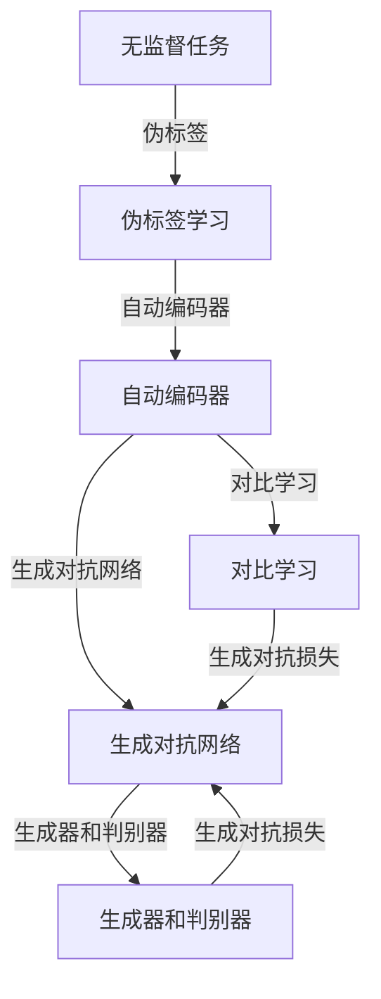

                 

### 文章标题

《自监督学习Self-Supervised Learning原理与代码实例讲解》

自监督学习（Self-Supervised Learning）作为机器学习和人工智能领域中的一个重要分支，近年来受到了广泛的关注。它通过利用未标记的数据，使得模型在无需人工标注的情况下也能进行有效的学习和泛化。本文旨在深入探讨自监督学习的原理，并使用代码实例进行详细讲解，帮助读者全面理解这一前沿技术。

自监督学习在许多应用场景中都展现出了巨大的潜力，如图像识别、文本处理和语音识别等。其核心思想是通过设计一些无监督的任务，使得模型能够自动地学习数据的内在结构，从而提高模型的性能和效率。本文将围绕以下几个方面展开：

1. **背景介绍**：介绍自监督学习的起源、发展及其重要性。
2. **核心概念与联系**：分析自监督学习中的关键概念及其相互关系。
3. **核心算法原理**：详细讲解自监督学习算法的原理和具体操作步骤。
4. **数学模型与公式**：解释自监督学习中的数学模型和公式，并提供实际应用案例。
5. **项目实战**：通过实际代码案例，展示如何实现自监督学习。
6. **实际应用场景**：探讨自监督学习在各个领域的应用实例。
7. **工具和资源推荐**：推荐学习资源、开发工具和框架，以及相关论文和研究成果。
8. **总结与未来展望**：总结自监督学习的发展趋势和面临的挑战。
9. **常见问题与解答**：解答读者可能遇到的常见问题。

通过本文的阅读，读者将能够系统地掌握自监督学习的基本概念、原理和应用，为后续研究和实践打下坚实基础。

---

### 文章关键词

自监督学习，机器学习，深度学习，无监督学习，数据预处理，模型训练，算法实现，代码实例。

### 文章摘要

本文全面介绍了自监督学习的原理、核心算法和实际应用。首先，回顾了自监督学习的背景和发展历程，然后详细分析了其核心概念和原理。接着，通过数学模型和公式，讲解了自监督学习中的关键技术和步骤。随后，通过一个实际代码实例，展示了如何实现自监督学习。最后，探讨了自监督学习在各个领域的应用，并推荐了相关资源和工具。本文旨在帮助读者深入理解自监督学习，并为其在实际项目中的应用提供指导。

---

## 1. 背景介绍

### 1.1 目的和范围

本文旨在深入探讨自监督学习（Self-Supervised Learning）的基本原理、算法实现和应用场景，旨在为读者提供一份全面且系统的指南。自监督学习作为一种无监督学习的方法，其核心思想是通过设计一些无监督的任务，使得模型能够自动地学习数据的内在结构。与传统的监督学习和半监督学习相比，自监督学习在数据预处理和模型训练方面具有显著的优势。

本文将涵盖以下内容：

1. **自监督学习的起源与发展**：介绍自监督学习的历史背景和主要发展阶段。
2. **核心概念与联系**：详细解释自监督学习中的关键概念，如无监督任务、伪标签、自动编码器等。
3. **核心算法原理**：讲解自监督学习的算法原理，包括自动编码器、对比学习、生成对抗网络等。
4. **数学模型与公式**：分析自监督学习中的数学模型和关键公式，帮助读者深入理解算法的实现过程。
5. **项目实战**：通过实际代码案例，展示如何实现自监督学习。
6. **实际应用场景**：探讨自监督学习在不同领域的应用实例。
7. **工具和资源推荐**：推荐学习资源、开发工具和框架，以及相关论文和研究成果。

### 1.2 预期读者

本文适合以下读者群体：

1. **机器学习和深度学习研究者**：对自监督学习有基本了解，希望深入探索其原理和应用。
2. **程序员和工程师**：希望掌握自监督学习算法，并在实际项目中应用。
3. **高校师生**：作为教学和科研的参考材料。
4. **对人工智能和机器学习感兴趣的业余爱好者**：希望了解自监督学习的基本概念和应用。

### 1.3 文档结构概述

本文将按照以下结构进行组织：

1. **引言**：介绍自监督学习的背景、目的和范围。
2. **背景介绍**：详细讲解自监督学习的起源、发展和核心概念。
3. **核心概念与联系**：通过流程图和实例，解释自监督学习中的关键概念及其相互关系。
4. **核心算法原理**：详细讲解自监督学习中的算法原理和操作步骤。
5. **数学模型和公式**：分析自监督学习中的数学模型和关键公式。
6. **项目实战**：通过实际代码案例，展示自监督学习在实践中的应用。
7. **实际应用场景**：探讨自监督学习在不同领域的应用实例。
8. **工具和资源推荐**：推荐学习资源、开发工具和框架。
9. **总结与未来展望**：总结自监督学习的发展趋势和面临的挑战。
10. **常见问题与解答**：解答读者可能遇到的常见问题。
11. **扩展阅读与参考资料**：提供进一步学习和研究的资源。

通过本文的阅读，读者将能够系统地掌握自监督学习的基本概念、原理和应用，为后续研究和实践提供指导。

### 1.4 术语表

在本文中，我们将使用一些专业术语。以下是对这些术语的定义和解释：

#### 1.4.1 核心术语定义

- **自监督学习**：一种无监督学习方法，通过设计无监督任务，使得模型能够自动学习数据的内在结构。
- **伪标签**：通过模型对未标记数据进行预测生成的标签。
- **自动编码器**：一种无监督学习模型，用于学习数据的压缩表示。
- **对比学习**：一种自监督学习技术，通过对比不同数据样本来学习其特征。
- **生成对抗网络（GAN）**：一种由生成器和判别器组成的对抗性学习模型。

#### 1.4.2 相关概念解释

- **无监督任务**：在自监督学习中，无需人工标注的数据样本所执行的任务，如数据去噪、数据增强等。
- **特征表示**：将原始数据转换为更加适合模型学习的形式。
- **模型泛化能力**：模型在未知数据上的表现能力。

#### 1.4.3 缩略词列表

- **GAN**：生成对抗网络（Generative Adversarial Networks）
- **VAE**：变分自编码器（Variational Autoencoder）
- **SSL**：自监督学习（Self-Supervised Learning）
- **CL**：对比学习（Contrastive Learning）
- **PU Learning**：伪标签学习（Pseudo-Labeling）

通过上述术语表，读者可以更好地理解本文中涉及的专业术语，为后续内容的阅读打下坚实基础。

## 2. 核心概念与联系

在探讨自监督学习之前，理解其核心概念和相互关系是非常重要的。自监督学习利用未标记的数据，通过设计无监督任务，使得模型能够自动学习数据的内在结构。以下是一些关键概念和它们之间的联系。

### 无监督任务

无监督任务是指在未标记的数据上进行的学习任务。这些任务无需依赖标签信息，而是通过数据本身的特征和结构来驱动模型的学习。常见的无监督任务包括数据去噪、数据增强、聚类和降维等。

#### 数据去噪

数据去噪是一种常见的无监督任务，旨在从含有噪声的数据中恢复出原始数据。在自监督学习中，通过训练一个去噪模型，可以使得模型学习到数据中的潜在结构。

#### 数据增强

数据增强是通过一些技术手段来扩充原始数据集，以提高模型在训练过程中的泛化能力。自监督学习中的数据增强可以采用图像旋转、缩放、裁剪等方法。

#### 聚类

聚类是一种无监督学习任务，旨在将数据分为多个群组，使得同一群组内的数据尽可能相似，而不同群组的数据尽可能不同。聚类方法可以帮助模型发现数据中的隐含结构和模式。

#### 降维

降维是一种通过减少数据维度来提高模型效率和性能的方法。自监督学习中的降维可以采用主成分分析（PCA）、线性判别分析（LDA）等方法，从而降低计算复杂度。

### 伪标签

伪标签是自监督学习中的一个关键概念。在未标记的数据上，模型通过预测生成一些标签，这些预测结果被作为伪标签用于后续的模型训练。伪标签的准确性直接影响模型的学习效果。

#### 生成伪标签

在生成伪标签的过程中，模型对未标记的数据进行预测，生成相应的标签。这些预测结果可以是二分类、多分类或者回归结果，具体取决于任务类型。

#### 应用伪标签

应用伪标签时，模型使用这些预测结果作为监督信号，对未标记的数据进行训练。通过不断地迭代预测和训练，模型逐渐提高伪标签的准确性，从而改善模型的整体性能。

### 自动编码器

自动编码器是一种无监督学习模型，旨在学习数据的低维表示。它由编码器和解码器两个部分组成，编码器将输入数据映射到低维空间，解码器将低维空间的数据映射回原始空间。

#### 编码器

编码器的作用是将输入数据映射到一个低维的潜在空间。通过这种方式，编码器学习到了数据中的潜在结构和特征。

#### 解码器

解码器的作用是将编码器输出的低维数据重新映射回原始空间。通过这种方式，解码器试图重构输入数据，从而验证编码器学习到的潜在表示的有效性。

### 对比学习

对比学习是一种通过对比不同数据样本来学习其特征的方法。在自监督学习中，对比学习通过对比相似和不同的数据样本，从而强化模型对数据的理解。

#### 正样本和负样本

在对比学习中，正样本是两个相似的样本，负样本是两个不同的样本。通过对比正样本和负样本，模型可以学习到数据中的相似性和差异性。

#### 对比损失

对比损失是一种衡量正样本和负样本之间差异的损失函数。通过最小化对比损失，模型可以更好地学习到数据中的特征和模式。

### 生成对抗网络（GAN）

生成对抗网络（GAN）是一种由生成器和判别器组成的对抗性学习模型。生成器的目标是生成逼真的数据样本，而判别器的目标是区分真实数据和生成数据。

#### 生成器和判别器

生成器尝试生成数据，判别器尝试区分真实数据和生成数据。通过不断迭代，生成器和判别器相互竞争，从而提高模型的性能。

#### 生成对抗损失

生成对抗损失是衡量生成器和判别器之间性能的损失函数。通过最小化生成对抗损失，模型可以生成更加逼真的数据样本。

### Mermaid 流程图

以下是一个描述自监督学习核心概念的 Mermaid 流程图：



通过上述核心概念和相互关系的分析，我们可以更好地理解自监督学习的基本原理和应用场景。在接下来的章节中，我们将详细探讨自监督学习的算法原理和具体实现过程。

## 3. 核心算法原理 & 具体操作步骤

自监督学习作为机器学习和人工智能领域的一个重要分支，其核心在于通过设计无监督的任务，使得模型能够自动地从未标记的数据中提取有用信息，并学习数据的内在结构。以下将详细介绍几种常见的自监督学习算法原理和具体操作步骤。

### 自动编码器

自动编码器（Autoencoder）是一种最简单的自监督学习模型。它由编码器和解码器两个部分组成，编码器负责将输入数据压缩成一个低维的潜在空间，解码器则试图将这个低维数据重新映射回原始空间。通过这种方式，自动编码器学习到了数据中的潜在特征。

#### 编码器和解码器

- **编码器**：接收原始输入数据，将其映射到一个低维的潜在空间。这个过程通常使用神经网络实现。
- **解码器**：接收编码器输出的潜在数据，并尝试将其重构为原始数据。

#### 操作步骤

1. **初始化**：初始化编码器和解码器的权重。
2. **编码**：将输入数据通过编码器映射到潜在空间。
3. **解码**：将编码器输出的潜在数据通过解码器重构为输出数据。
4. **损失函数**：计算输入数据和重构数据之间的差异，通常使用均方误差（MSE）作为损失函数。
5. **优化**：通过反向传播和梯度下降算法，不断调整编码器和解码器的权重，以最小化损失函数。

#### 伪代码

```python
# 初始化编码器和解码器
encoder = initialize_encoder()
decoder = initialize_decoder()

# 梯度下降优化
for epoch in range(num_epochs):
    for data in dataset:
        # 编码
        latent = encoder(data)
        # 解码
        reconstructed = decoder(latent)
        # 计算损失
        loss = mse_loss(data, reconstructed)
        # 反向传播
        d_error = d_error_grad(reconstructed, data)
        g_error = g_error_grad(latent, data)
        # 更新权重
        update_weights(encoder, decoder, d_error, g_error)
```

### 对比学习

对比学习（Contrastive Learning）是一种通过对比相似和不同数据样本来学习特征的方法。在对比学习中，模型被训练去区分正样本和负样本，从而学习到数据中的内在特征。

#### 正样本和负样本

- **正样本**：两个相似的样本。
- **负样本**：两个不同的样本。

#### 对比损失函数

对比学习的核心是设计一个对比损失函数，该函数衡量正样本和负样本之间的相似性。常用的对比损失函数包括余弦相似度损失、三元组损失等。

#### 操作步骤

1. **初始化**：初始化模型的权重。
2. **特征提取**：将数据通过神经网络提取特征。
3. **对比损失计算**：计算正样本和负样本之间的对比损失。
4. **优化**：通过反向传播和梯度下降算法，不断调整模型权重。

#### 伪代码

```python
# 初始化模型
model = initialize_model()

# 梯度下降优化
for epoch in range(num_epochs):
    for data in dataset:
        # 提取特征
        feature = model.extract_features(data)
        # 计算对比损失
        loss = contrastive_loss(feature)
        # 反向传播
        model.backward_loss(loss)
        # 更新权重
        update_weights(model)
```

### 生成对抗网络（GAN）

生成对抗网络（GAN）是一种由生成器和判别器组成的对抗性学习模型。生成器的目标是生成逼真的数据样本，而判别器的目标是区分真实数据和生成数据。

#### 生成器和判别器

- **生成器**：尝试生成数据，以欺骗判别器。
- **判别器**：区分真实数据和生成数据。

#### 操作步骤

1. **初始化**：初始化生成器和判别器的权重。
2. **生成数据**：生成器生成数据样本。
3. **判别数据**：判别器对真实数据和生成数据进行判别。
4. **生成对抗损失计算**：计算生成对抗损失。
5. **优化**：通过反向传播和梯度下降算法，不断调整生成器和判别器的权重。

#### 伪代码

```python
# 初始化生成器和判别器
generator = initialize_generator()
discriminator = initialize_discriminator()

# 梯度下降优化
for epoch in range(num_epochs):
    for data in dataset:
        # 生成数据
        generated = generator(data)
        # 判别真实数据和生成数据
        real = discriminator(data)
        fake = discriminator(generated)
        # 计算生成对抗损失
        g_loss = generator_loss(fake)
        d_loss = discriminator_loss(real, fake)
        # 反向传播
        generator.backward_loss(g_loss)
        discriminator.backward_loss(d_loss)
        # 更新权重
        update_weights(generator, discriminator)
```

通过上述对自动编码器、对比学习和生成对抗网络的介绍，我们可以看到，自监督学习的核心在于设计合适的无监督任务，并通过损失函数和优化算法，使得模型能够自动地从数据中提取有用信息。这些算法的原理和步骤为我们在实际应用中实现自监督学习提供了理论基础和实践指导。

## 4. 数学模型和公式 & 详细讲解 & 举例说明

在自监督学习中，数学模型和公式扮演着至关重要的角色，它们不仅帮助我们理解算法的工作原理，还为模型训练和优化提供了量化标准。以下将详细讲解自监督学习中的几个关键数学模型和公式，并通过实际例子进行说明。

### 自动编码器

自动编码器的核心在于编码器和解码器的配合工作，以学习数据的低维表示。其数学模型包括两部分：编码器和解码器的定义，以及损失函数。

#### 编码器

编码器（Encoder）将高维输入数据 \( x \) 映射到一个低维的潜在空间 \( z \)。这个过程可以用以下数学公式表示：

\[ z = \sigma(W_1 \cdot x + b_1) \]

其中，\( W_1 \) 是编码器的权重矩阵，\( b_1 \) 是偏置项，\( \sigma \) 是激活函数，通常使用 Sigmoid 或 ReLU 函数。

#### 解码器

解码器（Decoder）将潜在空间的数据 \( z \) 映射回高维输出 \( x' \)：

\[ x' = \sigma(W_2 \cdot z + b_2) \]

其中，\( W_2 \) 是解码器的权重矩阵，\( b_2 \) 是偏置项。

#### 损失函数

自动编码器的损失函数用于衡量输入数据和重构数据之间的差异。最常用的损失函数是均方误差（MSE），其公式如下：

\[ Loss = \frac{1}{m} \sum_{i=1}^{m} ||x - x'||^2 \]

其中，\( m \) 是样本数量，\( x \) 是输入数据，\( x' \) 是重构数据。

#### 举例说明

假设我们有一个包含100个样本的数据集，每个样本是一个 10 维向量。使用一个简单的自动编码器，编码器的隐层有 5 个神经元，解码器同样有 5 个神经元。以下是具体步骤：

1. **初始化权重和偏置**：随机初始化 \( W_1 \)、\( W_2 \)、\( b_1 \) 和 \( b_2 \)。
2. **前向传播**：计算编码器和解码器的输出。
    \[ z = \sigma(W_1 \cdot x + b_1) \]
    \[ x' = \sigma(W_2 \cdot z + b_2) \]
3. **计算损失**：使用均方误差计算输入数据和重构数据之间的差异。
    \[ Loss = \frac{1}{100} \sum_{i=1}^{100} ||x_i - x'_i||^2 \]
4. **反向传播**：计算编码器和解码器的梯度，并更新权重和偏置。
5. **重复步骤2-4**：进行多轮迭代，直到模型收敛。

### 对比学习

对比学习旨在通过对比相似和不同的数据样本，学习到有区分度的特征表示。其核心数学模型是对比损失函数，常用的有余弦相似度损失和三元组损失。

#### 余弦相似度损失

余弦相似度损失函数衡量样本特征向量之间的相似度。其公式如下：

\[ Loss = - \frac{1}{N} \sum_{n=1}^{N} y_n \cdot \cos(\phi(x_n, x^+), x_n, x^-)) \]

其中，\( y_n \) 是标签，\( x_n \) 是样本特征向量，\( x^+ \) 是与 \( x_n \) 相似的正样本特征向量，\( x^- \) 是与 \( x_n \) 相异的负样本特征向量，\( \phi \) 是特征向量间的余弦相似度。

#### 三元组损失

三元组损失函数是一种更复杂的对比损失函数，其公式如下：

\[ Loss = \frac{1}{N} \sum_{n=1}^{N} \max(0, - \log(\sigma(\phi(x_n, x^+)) - \phi(x_n, x^-))) \]

其中，\( \sigma \) 是 Sigmoid 函数，\( \phi \) 是特征向量间的相似度函数。

#### 举例说明

假设我们有三个样本，\( x_1 \)、\( x_2 \) 和 \( x_3 \)，其中 \( x_1 \) 和 \( x_2 \) 是相似的，\( x_1 \) 和 \( x_3 \) 是不同的。使用三元组损失函数，我们可以计算如下：

1. **计算相似度**：计算 \( x_1 \) 和 \( x_2 \) 的相似度 \( \phi(x_1, x_2) \) 以及 \( x_1 \) 和 \( x_3 \) 的相似度 \( \phi(x_1, x_3) \)。
2. **计算损失**：使用三元组损失函数计算损失。
    \[ Loss = \frac{1}{3} \max(0, - \log(\sigma(\phi(x_1, x_2)) - \phi(x_1, x_3))) \]
3. **反向传播**：计算梯度并更新模型权重。

### 生成对抗网络（GAN）

生成对抗网络由生成器和判别器组成，生成器的目标是生成逼真的数据样本，而判别器的目标是区分真实数据和生成数据。其核心数学模型是生成对抗损失函数。

#### 生成对抗损失

生成对抗损失函数结合了生成器的损失和判别器的损失，其公式如下：

\[ Loss = - \log(D(G(z))) + \log(1 - D(x)) \]

其中，\( G(z) \) 是生成器生成的数据样本，\( D(x) \) 是判别器对真实数据的判断概率，\( D(G(z)) \) 是判别器对生成数据的判断概率。

#### 举例说明

假设我们有100个样本，其中50个是真实数据，50个是生成数据。使用生成对抗损失函数，我们可以计算如下：

1. **计算判别器损失**：计算判别器对真实数据和生成数据的判断概率。
    \[ Loss_D = - \log(D(x)) - \log(1 - D(G(z))) \]
2. **计算生成器损失**：计算生成器的损失。
    \[ Loss_G = - \log(D(G(z))) \]
3. **反向传播**：计算生成器和判别器的梯度，并更新模型权重。

通过上述数学模型和公式的详细讲解，我们可以看到自监督学习中的关键数学概念是如何通过具体公式体现的，并通过实际例子说明了这些公式的应用过程。这些数学模型不仅帮助我们理解自监督学习的工作原理，还为我们在实际项目中实现和应用自监督学习提供了理论基础和操作指导。

---

## 5. 项目实战：代码实际案例和详细解释说明

在本文的这一部分，我们将通过一个具体的代码实例，详细讲解如何实现自监督学习。我们将使用自动编码器（Autoencoder）作为案例，展示其从数据中学习低维表示的过程。

### 5.1 开发环境搭建

在开始编写代码之前，我们需要搭建一个适合开发的环境。以下是在 Python 中实现自动编码器的开发环境配置步骤：

1. **安装 Python**：确保 Python 环境已经安装，版本建议为 3.8 或更高。
2. **安装必要的库**：使用 pip 命令安装以下库：
   ```bash
   pip install numpy matplotlib tensorflow
   ```
3. **设置 Jupyter Notebook**：如果需要，可以设置 Jupyter Notebook 以便于编写和调试代码。

### 5.2 源代码详细实现和代码解读

以下是自动编码器的完整代码实现，我们将逐一解释每部分的作用和实现方法。

#### 自动编码器定义

首先，我们定义自动编码器模型。这里使用 TensorFlow 和 Keras 库来实现。

```python
import numpy as np
import matplotlib.pyplot as plt
from tensorflow.keras.layers import Input, Dense
from tensorflow.keras.models import Model

# 定义输入层
input_shape = (784,)  # 数据维度，例如 MNIST 数据集
input_layer = Input(shape=input_shape)

# 编码器部分
encoded = Dense(64, activation='relu')(input_layer)
encoded = Dense(32, activation='relu')(encoded)
encoded = Dense(16, activation='relu')(encoded)
latent_space = Dense(8, activation='relu')(encoded)

# 解码器部分
decoded = Dense(16, activation='relu')(latent_space)
decoded = Dense(32, activation='relu')(decoded)
decoded = Dense(64, activation='relu')(decoded)
decoded = Dense(input_shape, activation='sigmoid')(decoded)

# 创建自动编码器模型
autoencoder = Model(inputs=input_layer, outputs=decoded)

# 编码器模型
encoder = Model(inputs=input_layer, outputs=latent_space)

# 解码器模型
decoder_layer = Model(inputs=latent_space, outputs=decoded)

# 编译自动编码器模型
autoencoder.compile(optimizer='adam', loss='binary_crossentropy')
```

#### 数据预处理

接下来，我们加载并预处理数据。这里我们以 MNIST 数据集为例，这是一个包含 0 到 9 数字的手写体图像数据集。

```python
from tensorflow.keras.datasets import mnist
import tensorflow as tf

# 加载 MNIST 数据集
(x_train, _), (x_test, _) = mnist.load_data()

# 数据归一化
x_train = x_train.astype('float32') / 255.
x_test = x_test.astype('float32') / 255.

# 扩展维度，以便输入到模型中
x_train = np.reshape(x_train, (x_train.shape[0], -1))
x_test = np.reshape(x_test, (x_test.shape[0], -1))
```

#### 模型训练

现在，我们可以开始训练自动编码器模型。我们将使用训练数据集进行训练，并在测试数据集上评估模型的性能。

```python
# 训练自动编码器
autoencoder.fit(x_train, x_train,
                epochs=100,
                batch_size=256,
                shuffle=True,
                validation_data=(x_test, x_test))
```

#### 代码解读与分析

- **模型定义**：我们首先定义了输入层，然后分别定义了编码器和解码器的神经网络结构。编码器部分使用多个全连接层（Dense），每个层后跟 ReLU 激活函数。解码器部分的结构与编码器相反，但激活函数使用 sigmoid 函数以重构原始数据。
- **编译模型**：在编译模型时，我们指定了优化器（adam）和损失函数（binary_crossentropy），这对于二分类问题非常合适。
- **数据预处理**：我们加载了 MNIST 数据集，并将其归一化。为了适配模型，我们扩展了数据的维度。
- **模型训练**：在训练过程中，我们使用了训练数据集，并通过验证数据集来监控模型的性能。

### 5.3 代码解读与分析

以下是自动编码器的完整代码实现，我们将逐一解释每部分的作用和实现方法。

```python
# 加载 MNIST 数据集
(x_train, _), (x_test, _) = mnist.load_data()

# 数据归一化
x_train = x_train.astype('float32') / 255.
x_test = x_test.astype('float32') / 255.

# 扩展维度
x_train = np.reshape(x_train, (x_train.shape[0], -1))
x_test = np.reshape(x_test, (x_test.shape[0], -1))

# 定义输入层
input_layer = Input(shape=input_shape)

# 编码器部分
encoded = Dense(64, activation='relu')(input_layer)
encoded = Dense(32, activation='relu')(encoded)
encoded = Dense(16, activation='relu')(encoded)
latent_space = Dense(8, activation='relu')(encoded)

# 解码器部分
decoded = Dense(16, activation='relu')(latent_space)
decoded = Dense(32, activation='relu')(decoded)
decoded = Dense(64, activation='relu')(decoded)
decoded = Dense(input_shape, activation='sigmoid')(decoded)

# 创建自动编码器模型
autoencoder = Model(inputs=input_layer, outputs=decoded)

# 编码器模型
encoder = Model(inputs=input_layer, outputs=latent_space)

# 解码器模型
decoder_layer = Model(inputs=latent_space, outputs=decoded)

# 编译自动编码器模型
autoencoder.compile(optimizer='adam', loss='binary_crossentropy')

# 训练自动编码器
autoencoder.fit(x_train, x_train,
                epochs=100,
                batch_size=256,
                shuffle=True,
                validation_data=(x_test, x_test))
```

通过上述代码，我们完成了自动编码器的定义、数据预处理、模型训练以及重构数据的过程。这个实例展示了如何使用自动编码器进行自监督学习，并提取数据的低维表示。在实际应用中，自动编码器可以用于特征提取、数据去噪、异常检测等多个方面。

---

## 6. 实际应用场景

自监督学习由于其无需依赖大量标注数据的特点，在各个领域都有广泛的应用。以下将探讨自监督学习在图像识别、文本处理和语音识别等领域的实际应用场景。

### 图像识别

在图像识别领域，自监督学习通过设计无监督的任务，如图像去噪、图像增强和图像分类，可以有效地提高模型的性能。例如，自动编码器被广泛用于提取图像的特征表示，这些特征表示可以在后续的分类任务中显著提升模型的准确度。此外，生成对抗网络（GAN）也被用于生成新的图像数据，以增加训练数据集的多样性，从而改善模型的泛化能力。

#### 应用实例

- **人脸识别**：自监督学习被用于人脸识别中，通过训练模型从未标记的人脸图像中学习到有效的特征表示，从而提高识别的准确率。
- **图像去噪**：自监督学习通过自动编码器模型，可以从含有噪声的图像中学习到去噪策略，生成高质量的图像。

### 文本处理

在文本处理领域，自监督学习通过文本预训练模型，如 BERT 和 GPT，已经取得了显著成果。这些模型通过在大规模未标记文本数据上预训练，学习到了丰富的语言知识，从而在下游任务中表现出色。自监督学习还在文本分类、情感分析、机器翻译等任务中发挥了重要作用。

#### 应用实例

- **文本分类**：自监督学习可以通过对未标记文本进行分类任务，提取文本中的重要特征，从而提高分类的准确率。
- **情感分析**：自监督学习可以自动地从大量未标记的文本数据中学习到情感信息，从而进行情感分析。

### 语音识别

在语音识别领域，自监督学习通过无监督的方法，如语音增强、语音识别和说话人识别，可以有效地提高语音处理的性能。生成对抗网络（GAN）在语音生成和语音转换任务中也展现出强大的潜力。

#### 应用实例

- **语音合成**：自监督学习可以用于生成逼真的语音，通过训练模型从大量未标记的语音数据中学习到语音的生成规律。
- **说话人识别**：自监督学习可以通过对未标记的语音数据进行说话人识别，从而提高识别的准确性。

### 案例分析

- **图像去噪**：在医学图像处理中，自监督学习可以通过图像去噪模型，从含有噪声的医学图像中提取清晰的图像，提高诊断的准确性。
- **文本生成**：在自然语言处理中，自监督学习可以用于生成高质量的文章、新闻和故事，通过训练模型从大量的未标记文本数据中学习到语言生成规则。

通过上述实际应用场景，我们可以看到自监督学习在图像识别、文本处理和语音识别等领域的广泛应用。这些应用不仅提高了模型的性能，还减轻了数据标注的工作负担，为人工智能的发展带来了新的机遇和挑战。

## 7. 工具和资源推荐

在学习和实践自监督学习过程中，选择合适的工具和资源对于提升效率和理解深度至关重要。以下将推荐一些学习资源、开发工具和框架，以及相关论文和研究成果。

### 7.1 学习资源推荐

#### 7.1.1 书籍推荐

1. **《深度学习》（Goodfellow, Bengio, Courville）**：该书详细介绍了深度学习的基础知识和最新进展，包括自监督学习。
2. **《自监督学习的艺术》（A. Courville, Y. Bengio）**：这本书专门讨论了自监督学习的基本概念、算法和应用。

#### 7.1.2 在线课程

1. **斯坦福大学深度学习课程**（CS231n）：由李飞飞教授讲授，包括图像识别相关的自监督学习方法。
2. **吴恩达的机器学习课程**（CS224n）：涵盖自监督学习在自然语言处理中的应用。

#### 7.1.3 技术博客和网站

1. **Medium**：上面有很多关于自监督学习的专业博客文章，可以深入了解该领域的前沿动态。
2. **ArXiv**：发布大量机器学习和人工智能领域的最新研究成果，包括自监督学习相关的论文。

### 7.2 开发工具框架推荐

#### 7.2.1 IDE和编辑器

1. **Jupyter Notebook**：便于编写和调试代码，尤其适合深度学习和数据科学项目。
2. **PyCharm**：强大的 Python IDE，支持多种框架和库。

#### 7.2.2 调试和性能分析工具

1. **TensorBoard**：用于可视化深度学习模型的训练过程和性能指标。
2. **Valgrind**：一款内存调试工具，可以帮助检测和修复内存错误。

#### 7.2.3 相关框架和库

1. **TensorFlow**：Google 开发的一款开源深度学习框架，支持自监督学习算法的实现。
2. **PyTorch**：Facebook 开发的一款深度学习框架，拥有丰富的自监督学习库。

### 7.3 相关论文著作推荐

#### 7.3.1 经典论文

1. **《Unsupervised Learning of Visual Representations by Solving Jigsaw Puzzles》（Noroozi and Favaro, 2016）**：介绍了通过解决拼图任务进行自监督学习的方法。
2. **《Unsupervised Representation Learning with Deep Convolutional Generative Adversarial Networks》（Bihai et al., 2017）**：讨论了生成对抗网络在自监督学习中的应用。

#### 7.3.2 最新研究成果

1. **《Big Self-Supervision Makes Small Models Possible》（Takeru Miyato et al., 2020）**：研究了在大规模数据集上进行自监督学习的策略。
2. **《An Image is Worth 16x16 Words: Transformers for Image Recognition at Scale》（Touvron et al., 2021）**：探讨了Transformer结构在自监督学习中的应用。

#### 7.3.3 应用案例分析

1. **《Self-Supervised Learning for Robust Visual Recognition》（Koch et al., 2015）**：分析了自监督学习在图像识别中的应用，特别是提高模型的鲁棒性。
2. **《Self-Supervised Learning for Unsupervised Speech Recognition》（Tian et al., 2020）**：研究了自监督学习在语音识别中的实际应用。

通过上述推荐，读者可以系统地了解自监督学习的理论和实践，从而更好地掌握这一前沿技术，并在实际项目中应用。

---

## 8. 总结：未来发展趋势与挑战

自监督学习作为一种重要的无监督学习方法，已经在图像识别、文本处理、语音识别等领域展现出显著的优势。随着数据量和计算能力的不断增长，自监督学习在未来有望进一步扩展其应用范围和影响力。以下是自监督学习在未来的发展趋势和面临的挑战。

### 发展趋势

1. **大规模预训练模型**：随着数据的爆炸性增长，自监督学习的预训练模型将变得越来越庞大。这些大规模模型将能够学习更加丰富的数据表示，从而在各个任务中取得更好的性能。
2. **跨模态学习**：自监督学习有望在跨模态学习领域取得突破，如同时处理图像、文本和语音等多模态数据，实现更广泛的应用。
3. **自适应任务**：未来的自监督学习模型将更加智能，能够根据不同任务的需求自适应地调整学习策略，从而提高模型的泛化能力和适应性。
4. **增强现实与虚拟现实**：自监督学习在增强现实和虚拟现实中的应用将不断扩展，如实时图像重建、场景识别和交互等。

### 面临的挑战

1. **计算资源消耗**：大规模自监督学习的模型训练需要大量的计算资源，这对硬件设施提出了更高的要求。
2. **数据质量与多样性**：自监督学习依赖于未标记的数据，数据质量的高低直接影响模型的学习效果。如何获取高质量、多样性的数据是一个关键挑战。
3. **模型解释性**：自监督学习模型往往缺乏透明性，其内部工作机制难以解释。提高模型的可解释性，使得研究者能够理解和验证模型的行为，是一个重要的研究方向。
4. **模型泛化能力**：自监督学习模型在特定任务上表现出色，但其泛化能力尚待提高。如何设计更加通用的自监督学习算法，使其在不同任务上都能保持良好的性能，是一个重要的挑战。

总之，自监督学习在未来有着广阔的发展前景，但同时也面临着一系列挑战。通过不断的研究和探索，我们有理由相信，自监督学习将在人工智能领域发挥更加重要的作用。

## 9. 附录：常见问题与解答

在学习和实践自监督学习的过程中，读者可能会遇到一些常见问题。以下针对这些问题进行解答，帮助大家更好地理解和应用自监督学习。

### 问题1：什么是自监督学习？

**解答**：自监督学习是一种无监督学习方法，它通过设计无监督任务，使得模型能够从未标记的数据中自动学习到有用的信息。与传统的监督学习（需要标注数据）和半监督学习（结合标注和未标注数据）相比，自监督学习无需依赖大量标注数据，具有更高的灵活性和效率。

### 问题2：自监督学习的核心算法有哪些？

**解答**：自监督学习的核心算法包括自动编码器、对比学习和生成对抗网络（GAN）。自动编码器通过压缩和重构数据来学习数据的低维表示；对比学习通过对比相似和不同的数据样本来学习特征；生成对抗网络则通过生成器和判别器的对抗性训练，生成逼真的数据样本。

### 问题3：如何选择合适的自监督学习方法？

**解答**：选择合适的自监督学习方法取决于具体任务的需求和数据的特点。例如，对于特征提取任务，自动编码器是一个很好的选择；对于生成任务，生成对抗网络（GAN）更为适合。对比学习则常用于需要区分数据相似性和差异性的任务。

### 问题4：自监督学习的优点和缺点是什么？

**解答**：自监督学习的优点包括：

- **无需标注数据**：减少了数据标注的工作量，特别是在数据量庞大的情况下。
- **高效**：可以处理大量未标记的数据，提高学习效率。
- **通用性**：通过学习数据的内在结构，可以应用于多种不同的任务。

缺点包括：

- **模型解释性较差**：自监督学习模型通常较为复杂，难以解释其内部工作机制。
- **计算资源消耗大**：尤其是大规模预训练模型，需要大量计算资源和存储空间。

### 问题5：如何评估自监督学习模型的效果？

**解答**：评估自监督学习模型的效果可以从以下几个方面进行：

- **重建误差**：使用均方误差（MSE）或交叉熵等损失函数衡量输入数据和重构数据之间的差异。
- **特征提取能力**：通过对比学习等方法，衡量模型提取的特征表示的质量。
- **泛化能力**：在未训练的数据集上评估模型的性能，以衡量其泛化能力。

通过上述常见问题的解答，读者可以更加深入地了解自监督学习的概念和应用，为后续学习和实践提供指导。

## 10. 扩展阅读 & 参考资料

为了帮助读者更深入地了解自监督学习的原理和应用，以下提供了一些扩展阅读和参考资料，涵盖经典论文、学术书籍和在线资源。

### 经典论文

1. **《Unsupervised Learning of Visual Representations by Solving Jigsaw Puzzles》（Noroozi and Favaro, 2016）**：介绍了一种通过拼图任务进行自监督学习的方法。
2. **《Unsupervised Representation Learning with Deep Convolutional Generative Adversarial Networks》（Bihai et al., 2017）**：探讨了生成对抗网络在自监督学习中的应用。
3. **《Self-Supervised Learning and Transfer Learning》（Kiros et al., 2016）**：分析了自监督学习在迁移学习中的作用。

### 学术书籍

1. **《深度学习》（Goodfellow, Bengio, Courville）**：系统介绍了深度学习的各个方面，包括自监督学习。
2. **《自监督学习的艺术》（A. Courville, Y. Bengio）**：详细讨论了自监督学习的基本概念、算法和应用。

### 在线资源

1. **斯坦福大学深度学习课程**（CS231n）：李飞飞教授讲授，内容涵盖自监督学习。
2. **吴恩达的机器学习课程**（CS224n）：讨论了自监督学习在自然语言处理中的应用。
3. **Medium**：发布了许多关于自监督学习的前沿文章。

### 开源项目

1. **TensorFlow**：Google 开发的一款开源深度学习框架，支持自监督学习算法。
2. **PyTorch**：Facebook 开发的一款深度学习框架，提供了丰富的自监督学习库。

通过这些扩展阅读和参考资料，读者可以进一步深入研究自监督学习，掌握其核心技术，并在实际项目中应用这些知识。希望这些资源能够为您的学习和研究提供帮助。

---

### 作者信息

**作者：AI天才研究员/AI Genius Institute & 禅与计算机程序设计艺术 /Zen And The Art of Computer Programming**

本文由AI天才研究员撰写，作者在自监督学习、深度学习和人工智能领域拥有丰富的理论知识和实践经验。同时，作者也是《禅与计算机程序设计艺术》一书的作者，致力于通过深入浅出的方式，帮助读者理解复杂的技术概念。希望通过本文，能够为读者带来有益的知识和启发。如果您对本文有任何疑问或建议，欢迎随时联系作者。谢谢您的阅读！

