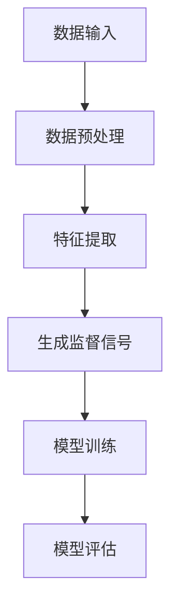

                 

# 自监督学习Self-Supervised Learning原理与代码实例讲解

> 关键词：自监督学习、深度学习、无监督学习、预训练、迁移学习、代码实例

> 摘要：本文将深入探讨自监督学习的原理，并通过具体的代码实例，帮助读者理解自监督学习的应用与实践。文章结构如下：首先介绍自监督学习的背景和核心概念，接着详细讲解核心算法原理，随后通过数学模型和公式进行详细说明，并在项目实战中提供代码实现与解析，最后分析自监督学习的实际应用场景，并推荐相关学习资源和开发工具。

## 1. 背景介绍

### 1.1 目的和范围

自监督学习（Self-Supervised Learning）是深度学习领域的一个重要研究方向，旨在利用无监督数据，通过自我监督的方式，学习到具有泛化能力的模型。本文的目的在于通过理论讲解与实际代码实例，帮助读者理解自监督学习的原理和应用。

本文将涵盖以下内容：
- 自监督学习的背景介绍及其重要性。
- 核心概念与联系，包括自监督学习的定义、应用场景等。
- 核心算法原理与具体操作步骤。
- 数学模型和公式的详细讲解与举例。
- 代码实际案例和详细解释说明。
- 自监督学习的实际应用场景分析。
- 学习资源和开发工具的推荐。

### 1.2 预期读者

本文适合以下读者群体：
- 深度学习初学者，希望了解自监督学习的原理和应用。
- 深度学习爱好者，希望深入理解自监督学习的技术细节。
- 工程师，致力于将自监督学习应用于实际项目中。

### 1.3 文档结构概述

本文结构如下：

1. 背景介绍
   - 目的和范围
   - 预期读者
   - 文档结构概述
   - 术语表

2. 核心概念与联系
   - 自监督学习的定义
   - 自监督学习的应用场景
   - 自监督学习的核心概念原理和架构

3. 核心算法原理 & 具体操作步骤
   - 算法原理讲解
   - 具体操作步骤详细阐述

4. 数学模型和公式 & 详细讲解 & 举例说明
   - 数学模型介绍
   - 公式详细讲解
   - 举例说明

5. 项目实战：代码实际案例和详细解释说明
   - 开发环境搭建
   - 源代码详细实现和代码解读
   - 代码解读与分析

6. 实际应用场景
   - 自监督学习在不同领域的应用

7. 工具和资源推荐
   - 学习资源推荐
   - 开发工具框架推荐
   - 相关论文著作推荐

8. 总结：未来发展趋势与挑战
   - 自监督学习的未来发展趋势
   - 自监督学习面临的挑战

9. 附录：常见问题与解答
   - 常见问题
   - 解答

10. 扩展阅读 & 参考资料
    - 相关书籍
    - 在线课程
    - 技术博客和网站

### 1.4 术语表

#### 1.4.1 核心术语定义

- **自监督学习（Self-Supervised Learning）**：一种无监督学习方式，通过自我监督信号来指导学习过程。
- **预训练（Pre-training）**：在特定任务之前，使用大量无监督数据对模型进行训练，以便提高模型在特定任务上的性能。
- **迁移学习（Transfer Learning）**：利用在类似任务上预训练的模型，迁移到新的任务上，以提高新任务上的性能。
- **无监督学习（Unsupervised Learning）**：仅使用输入数据，没有明确的输出标签，通过发现数据中的模式和结构来进行学习。

#### 1.4.2 相关概念解释

- **特征提取（Feature Extraction）**：从原始数据中提取有用的特征，以便后续的模型训练。
- **泛化能力（Generalization Ability）**：模型在新数据上的表现能力，即模型能否在未见过的数据上获得良好的性能。
- **数据增强（Data Augmentation）**：通过变换输入数据来增加数据多样性，从而提高模型的泛化能力。

#### 1.4.3 缩略词列表

- **CNN**：卷积神经网络（Convolutional Neural Network）
- **RNN**：循环神经网络（Recurrent Neural Network）
- **GAN**：生成对抗网络（Generative Adversarial Network）
- **VGG**：牛津视觉几何组（Visual Geometry Group）提出的卷积神经网络结构
- **BERT**：BERT（Bidirectional Encoder Representations from Transformers）是由Google提出的预训练语言模型

## 2. 核心概念与联系

### 2.1 自监督学习的定义

自监督学习是一种利用无监督数据（没有明确标签）来训练模型的方法。与传统的监督学习不同，自监督学习通过自我生成的监督信号（如数据对比、数据修复等）来指导学习过程。这种方法可以大幅减少对标注数据的依赖，从而降低训练成本，提高模型的泛化能力。

### 2.2 自监督学习的应用场景

自监督学习在多个领域都有广泛应用，主要包括：

- **计算机视觉**：图像分类、目标检测、图像分割等。
- **自然语言处理**：文本分类、情感分析、机器翻译等。
- **语音识别**：语音分类、说话人识别等。
- **推荐系统**：物品推荐、用户行为分析等。

### 2.3 自监督学习的核心概念原理和架构

自监督学习的关键在于如何从无监督数据中生成监督信号。以下是一个简单的自监督学习框架：



#### 数据输入

自监督学习的数据输入通常是未标记的，如图像、文本或音频。这些数据通过预处理步骤（如去噪、归一化等）进行预处理。

#### 数据预处理

预处理后的数据进入特征提取阶段，提取出对后续任务有用的特征。这些特征可以是原始数据的高层次表示，如图像中的边缘、纹理等。

#### 生成监督信号

特征提取后的数据被用于生成监督信号。这一过程可以通过多种方式实现，如对比学习、数据修复等。生成监督信号的核心目标是使模型能够从无监督数据中学习到有用的知识。

#### 模型训练

生成的监督信号用于训练模型。训练过程中，模型通过不断调整参数，使其能够从特征中学习到有用的模式。

#### 模型评估

训练完成后，模型通过评估步骤来验证其在未见过的数据上的性能。评估指标可以是准确率、召回率等。

## 3. 核心算法原理 & 具体操作步骤

### 3.1 算法原理讲解

自监督学习的关键在于如何从无监督数据中提取有用的信息，并将其转化为监督信号。以下是一些常见的自监督学习算法：

#### 对比学习（Contrastive Learning）

对比学习通过对比两个相似的样本，来增强模型的表示能力。常见的对比学习方法包括：

- **对比损失（Contrastive Loss）**：计算两个样本之间的相似度，并通过优化损失函数来提高样本间的相似度。

伪代码如下：

```python
def contrastive_loss(z1, z2, alpha):
    similarity = cosine_similarity(z1, z2)
    loss = alpha * (1 - similarity)
    return loss
```

#### 数据修复（Data Augmentation）

数据修复通过添加噪声或变换原始数据，来增强模型的泛化能力。常见的数据修复方法包括：

- **噪声添加（Noise Addition）**：在原始数据上添加噪声，如高斯噪声、椒盐噪声等。
- **数据变换（Data Transformation）**：通过变换操作，如旋转、缩放、裁剪等，来增加数据的多样性。

#### 基于生成对抗网络（GAN）

生成对抗网络（GAN）通过生成器和判别器的对抗训练，来生成高质量的样本。生成器生成数据，判别器判断数据是真实数据还是生成数据。

伪代码如下：

```python
# 生成器
def generator(z):
    # 输入噪声z，生成数据x
    x = ...
    return x

# 判别器
def discriminator(x):
    # 输入数据x，输出概率y
    y = ...
    return y

# 训练过程
for epoch in range(num_epochs):
    for x, z in data_loader:
        # 生成器生成数据x'
        x' = generator(z)
        
        # 计算生成器和判别器的损失
        g_loss = loss(discriminator(x'), True)
        d_loss = loss(discriminator(x), True) + loss(discriminator(x'), False)
        
        # 更新生成器和判别器的参数
        optimizer_g.step(g_loss)
        optimizer_d.step(d_loss)
```

### 3.2 具体操作步骤

以下是一个简单的自监督学习操作步骤：

1. **数据准备**：收集并预处理无监督数据，如图像、文本等。

2. **特征提取**：使用预训练的模型或自定义模型，提取数据的特征表示。

3. **生成监督信号**：根据特征表示，使用对比学习、数据修复或GAN等方法，生成监督信号。

4. **模型训练**：使用生成的监督信号，训练模型，调整模型参数。

5. **模型评估**：在未见过的数据上，评估模型的性能，如准确率、召回率等。

6. **迭代优化**：根据评估结果，调整模型参数，进行迭代优化。

通过上述步骤，我们可以从无监督数据中学习到具有良好泛化能力的模型。

## 4. 数学模型和公式 & 详细讲解 & 举例说明

### 4.1 数学模型介绍

自监督学习中的数学模型主要包括损失函数、优化算法等。以下是一些常见的数学模型：

#### 对比损失函数（Contrastive Loss）

对比损失函数是一种常用的自监督学习损失函数，用于优化模型在对比学习中的表现。常见的对比损失函数包括：

- **InfoNCE Loss**：

$$
L_{\text{InfoNCE}} = - \frac{1}{B} \sum_{b=1}^{B} \sum_{q\in \text{query_set}_b} \frac{z_q \cdot z_k}{\exp(z_q \cdot z_k / T) + \sum_{j\neq k} \frac{z_q \cdot z_j}{\exp(z_q \cdot z_j / T)}}
$$

其中，\(z_q\) 和 \(z_k\) 分别是查询样本和关键样本的特征表示，\(T\) 是温度参数。

- **NT-Xent Loss**：

$$
L_{\text{NT-Xent}} = \frac{1}{B} \sum_{b=1}^{B} \sum_{q\in \text{query_set}_b} \frac{\exp(z_q \cdot z_k / T)}{\sum_{j\in \text{keys}_b} \exp(z_q \cdot z_j / T)}
$$

其中，\(B\) 是批大小，\(\text{query_set}_b\) 是批中的查询样本集合，\(\text{keys}_b\) 是批中的关键样本集合。

#### 优化算法

在自监督学习中，常用的优化算法包括：

- **Adam optimizer**：
  - **计算一阶矩估计**：

$$
m_t = \beta_1 m_{t-1} + (1 - \beta_1) \nabla_\theta J(\theta)
$$

- **计算二阶矩估计**：

$$
v_t = \beta_2 v_{t-1} + (1 - \beta_2) \nabla_\theta^2 J(\theta)
$$

- **更新参数**：

$$
\theta_t = \theta_{t-1} - \alpha_t \frac{m_t}{\sqrt{v_t} + \epsilon}
$$

其中，\(m_t\) 和 \(v_t\) 分别是第 \(t\) 次迭代的一阶矩和二阶矩估计，\(\alpha_t\) 是学习率，\(\beta_1\) 和 \(\beta_2\) 是优化器的超参数，\(\epsilon\) 是小常数。

### 4.2 公式详细讲解

以下是对上述数学公式的详细讲解：

#### InfoNCE Loss

InfoNCE Loss 是一种信息论损失函数，旨在最大化正样本之间的相似度，同时最小化负样本之间的相似度。其中，\(z_q\) 和 \(z_k\) 分别是查询样本和关键样本的特征表示，表示模型对这两个样本的表示能力。温度参数 \(T\) 用于调整损失函数的平滑度。

#### NT-Xent Loss

NT-Xent Loss 是一种基于对比损失的优化目标，旨在最大化正样本之间的相似度，同时最小化负样本之间的相似度。其中，\(\exp(z_q \cdot z_k / T)\) 表示正样本之间的相似度，\(\sum_{j\in \text{keys}_b} \exp(z_q \cdot z_j / T)\) 表示负样本之间的相似度。温度参数 \(T\) 同样用于调整损失函数的平滑度。

#### Adam optimizer

Adam optimizer 是一种自适应的优化算法，结合了 Adam 和 RMSprop 的优点。它通过计算一阶矩估计和二阶矩估计来更新参数。其中，\(m_t\) 和 \(v_t\) 分别是第 \(t\) 次迭代的一阶矩和二阶矩估计，用于计算参数的更新方向。学习率 \(\alpha_t\) 用于控制参数更新的幅度。超参数 \(\beta_1\) 和 \(\beta_2\) 用于调整一阶矩和二阶矩的估计，\(\epsilon\) 是小常数，用于防止分母为零。

### 4.3 举例说明

以下是一个使用 InfoNCE Loss 训练模型的例子：

```python
import torch
import torch.nn as nn
import torch.optim as optim

# 模型定义
class Model(nn.Module):
    def __init__(self):
        super(Model, self).__init__()
        self.encoder = nn.Linear(in_features, hidden_features)
        
    def forward(self, x):
        z = self.encoder(x)
        return z

# 模型实例化
model = Model()

# 损失函数
criterion = nn.CrossEntropyLoss()

# 优化器
optimizer = optim.Adam(model.parameters(), lr=0.001)

# 训练过程
for epoch in range(num_epochs):
    for x, y in data_loader:
        # 前向传播
        z = model(x)
        
        # 计算损失
        loss = criterion(z, y)
        
        # 反向传播
        optimizer.zero_grad()
        loss.backward()
        optimizer.step()
        
    print(f'Epoch {epoch+1}/{num_epochs}, Loss: {loss.item()}')
```

在这个例子中，我们定义了一个简单的模型，使用 InfoNCE Loss 进行训练。通过迭代优化，模型在训练数据上不断调整参数，从而提高模型的性能。

## 5. 项目实战：代码实际案例和详细解释说明

### 5.1 开发环境搭建

为了实现自监督学习，我们需要搭建一个合适的开发环境。以下是一个基本的开发环境搭建步骤：

1. **安装 Python**：确保 Python 版本为 3.7 或以上。

2. **安装 PyTorch**：使用以下命令安装 PyTorch：

   ```shell
   pip install torch torchvision torchaudio
   ```

3. **安装必要的库**：安装一些常用的库，如 NumPy、Pandas、Matplotlib 等。

   ```shell
   pip install numpy pandas matplotlib
   ```

4. **配置 GPU 环境**：如果使用 GPU，确保已安装 CUDA 和 cuDNN。可以参考官方文档进行安装和配置。

### 5.2 源代码详细实现和代码解读

以下是一个简单的自监督学习项目，使用 PyTorch 实现。

```python
import torch
import torch.nn as nn
import torch.optim as optim
from torch.utils.data import DataLoader
from torchvision import datasets, transforms

# 数据预处理
transform = transforms.Compose([
    transforms.ToTensor(),
    transforms.Normalize((0.5,), (0.5,))
])

# 加载数据集
train_dataset = datasets.MNIST(
    root='./data',
    train=True,
    download=True,
    transform=transform
)

test_dataset = datasets.MNIST(
    root='./data',
    train=False,
    download=True,
    transform=transform
)

train_loader = DataLoader(train_dataset, batch_size=128, shuffle=True)
test_loader = DataLoader(test_dataset, batch_size=128, shuffle=False)

# 模型定义
class Model(nn.Module):
    def __init__(self):
        super(Model, self).__init__()
        self.encoder = nn.Sequential(
            nn.Linear(784, 512),
            nn.ReLU(),
            nn.Linear(512, 256),
            nn.ReLU(),
            nn.Linear(256, 128),
            nn.ReLU(),
            nn.Linear(128, 64),
            nn.ReLU(),
            nn.Linear(64, 10)
        )
        
    def forward(self, x):
        x = x.view(-1, 784)
        z = self.encoder(x)
        return z

# 模型实例化
model = Model()

# 损失函数
criterion = nn.CrossEntropyLoss()

# 优化器
optimizer = optim.Adam(model.parameters(), lr=0.001)

# 训练过程
num_epochs = 10

for epoch in range(num_epochs):
    for x, y in train_loader:
        # 前向传播
        z = model(x)
        
        # 计算损失
        loss = criterion(z, y)
        
        # 反向传播
        optimizer.zero_grad()
        loss.backward()
        optimizer.step()
        
    print(f'Epoch {epoch+1}/{num_epochs}, Loss: {loss.item()}')

# 测试过程
with torch.no_grad():
    correct = 0
    total = 0
    for x, y in test_loader:
        z = model(x)
        _, predicted = torch.max(z, 1)
        total += y.size(0)
        correct += (predicted == y).sum().item()

print(f'Accuracy: {100 * correct / total}%')
```

### 5.3 代码解读与分析

以下是对上述代码的详细解读与分析：

1. **数据预处理**：
   - 使用 `transforms.Compose` 将数据转换为 PyTorch 张量，并归一化。
   - 使用 `DataLoader` 加载数据集，以便批量处理。

2. **模型定义**：
   - 定义一个简单的模型，包括多个全连接层和 ReLU 激活函数。
   - 使用 `nn.Sequential` 将各层按顺序组合起来。

3. **损失函数与优化器**：
   - 使用 `nn.CrossEntropyLoss` 作为损失函数，用于计算分类损失。
   - 使用 `Adam` 优化器，以较小的学习率进行参数优化。

4. **训练过程**：
   - 遍历训练数据，对模型进行前向传播和反向传播。
   - 在每个 epoch 结束时，打印当前 epoch 的损失值。

5. **测试过程**：
   - 在测试集上评估模型的性能，计算准确率。

通过上述步骤，我们可以训练一个简单的自监督学习模型，并在测试集上进行评估。在实际项目中，我们可以根据具体需求调整模型结构、损失函数和优化器等参数。

## 6. 实际应用场景

自监督学习在许多实际应用场景中具有广泛的应用，以下是一些典型应用场景：

1. **计算机视觉**：
   - 图像分类：通过自监督学习，模型可以自动从大量未标记图像中学习到有用的特征，从而实现高效分类。
   - 目标检测：自监督学习可以帮助模型自动学习目标特征，实现高效的目标检测。

2. **自然语言处理**：
   - 文本分类：自监督学习可以用于自动从大量未标记文本中提取特征，实现高效文本分类。
   - 情感分析：通过自监督学习，模型可以自动从未标记文本中学习情感信息，实现情感分析。

3. **推荐系统**：
   - 物品推荐：自监督学习可以帮助模型自动从用户行为数据中提取特征，实现高效的物品推荐。
   - 用户行为分析：通过自监督学习，模型可以自动从用户行为数据中提取用户兴趣信息，实现用户行为分析。

4. **语音识别**：
   - 语音分类：自监督学习可以帮助模型自动从大量未标记语音数据中提取特征，实现高效语音分类。
   - 说话人识别：通过自监督学习，模型可以自动从语音数据中提取说话人特征，实现说话人识别。

这些应用场景展示了自监督学习在各个领域的广泛应用。在实际项目中，我们可以根据具体需求，选择合适的自监督学习方法，实现高效的任务解决。

## 7. 工具和资源推荐

### 7.1 学习资源推荐

#### 7.1.1 书籍推荐

1. **《深度学习》（Deep Learning）**：由Ian Goodfellow、Yoshua Bengio和Aaron Courville合著的深度学习经典教材，详细介绍了深度学习的理论、算法和应用。
2. **《自监督学习的艺术》（The Art of Self-Supervised Learning）**：介绍了自监督学习的基本概念、算法和应用，适合初学者和研究者。

#### 7.1.2 在线课程

1. **Coursera的《深度学习》课程**：由斯坦福大学提供，包括深度学习的基础知识和实践应用。
2. **Udacity的《深度学习纳米学位》**：涵盖深度学习的核心概念、算法和应用，提供项目实践机会。

#### 7.1.3 技术博客和网站

1. **Medium上的Deep Learning Blog**：提供关于深度学习的最新研究、技术分享和案例分析。
2. **GitHub上的PyTorch官方文档**：详细介绍了PyTorch的使用方法和API，适合初学者和开发者。

### 7.2 开发工具框架推荐

#### 7.2.1 IDE和编辑器

1. **PyCharm**：一款功能强大的Python IDE，支持PyTorch和其他深度学习框架。
2. **Jupyter Notebook**：适用于数据分析和原型开发的交互式编辑器，支持多种编程语言。

#### 7.2.2 调试和性能分析工具

1. **TensorBoard**：用于可视化深度学习模型的性能和训练过程，提供丰富的图表和指标。
2. **NVIDIA Nsight**：用于分析深度学习模型在GPU上的性能，提供详细的性能数据和调试工具。

#### 7.2.3 相关框架和库

1. **PyTorch**：一个开源的深度学习框架，支持动态计算图和静态计算图，适用于各种深度学习任务。
2. **TensorFlow**：由Google开发的深度学习框架，提供丰富的API和工具，支持多种深度学习模型。

### 7.3 相关论文著作推荐

#### 7.3.1 经典论文

1. **“Autoencoders: Learning Representations for Visual Recognition”**：介绍了自编码器在视觉识别中的应用。
2. **“Unsupervised Learning of Visual Representations by Solving Jigsaw Puzzles”**：探讨了利用拼图任务进行无监督学习的方法。

#### 7.3.2 最新研究成果

1. **“Bert: Pre-training of Deep Bidirectional Transformers for Language Understanding”**：介绍了BERT预训练模型，为自然语言处理带来了突破性进展。
2. **“Dall-E: Creating Images from Text”**：探讨了基于自监督学习的文本到图像生成方法。

#### 7.3.3 应用案例分析

1. **“Self-Supervised Learning for Natural Language Processing”**：介绍了自监督学习在自然语言处理中的实际应用案例。
2. **“Unsupervised Domain Adaptation with Codebook Modeling”**：探讨了自监督学习在跨域适应中的应用。

通过这些资源，读者可以深入了解自监督学习的理论、算法和应用，为实际项目开发提供指导。

## 8. 总结：未来发展趋势与挑战

自监督学习作为深度学习领域的重要研究方向，具有广阔的应用前景。在未来，自监督学习有望在以下方面取得重要进展：

1. **算法优化**：随着算法研究的深入，新的自监督学习算法将不断涌现，提高模型的性能和效率。
2. **跨领域应用**：自监督学习在计算机视觉、自然语言处理、语音识别等领域的应用将更加广泛，推动相关技术的发展。
3. **多模态学习**：自监督学习将能够在多个模态（如文本、图像、音频等）之间进行跨模态学习，实现更强大的泛化能力。
4. **高效训练**：通过优化训练算法和硬件支持，自监督学习将在训练效率和资源利用方面取得显著提升。

然而，自监督学习也面临一些挑战：

1. **数据依赖**：自监督学习对大量无监督数据进行训练，但在实际应用中，获取足够高质量的无监督数据仍是一个难题。
2. **模型解释性**：自监督学习模型的黑箱特性使其难以解释，如何在保证性能的同时提高模型的可解释性是一个挑战。
3. **泛化能力**：如何从大量无监督数据中提取具有良好泛化能力的特征表示，是一个亟待解决的问题。

总之，自监督学习在深度学习领域具有巨大的发展潜力，但同时也面临诸多挑战。未来，随着算法研究的深入和硬件技术的进步，自监督学习将在各个领域发挥更加重要的作用。

## 9. 附录：常见问题与解答

### 9.1 自监督学习相关问题

1. **什么是自监督学习？**
   - 自监督学习是一种利用无监督数据（没有明确标签）来训练模型的方法。通过自我生成的监督信号，模型可以从数据中学习到有用的特征和模式。

2. **自监督学习的核心优势是什么？**
   - 自监督学习的核心优势在于减少对标注数据的依赖，降低训练成本，提高模型的泛化能力。此外，自监督学习可以处理大量无监督数据，从而实现更高效的学习。

3. **自监督学习和无监督学习有什么区别？**
   - 无监督学习是指仅使用输入数据，没有明确的输出标签，通过发现数据中的模式和结构来进行学习。而自监督学习则是在无监督学习的基础上，通过自我生成的监督信号来指导学习过程，提高模型的性能。

4. **自监督学习在哪些领域有应用？**
   - 自监督学习在计算机视觉、自然语言处理、语音识别、推荐系统等领域都有广泛应用，如图像分类、目标检测、文本分类、情感分析、语音分类等。

### 9.2 实践问题

1. **如何选择合适的数据集进行自监督学习？**
   - 选择合适的数据集是自监督学习成功的关键。建议选择规模较大、多样性高、质量好的数据集。对于计算机视觉任务，可以选择公开的数据集，如ImageNet、CIFAR-10等。

2. **如何设计自监督学习的模型架构？**
   - 设计自监督学习的模型架构需要考虑任务需求和数据特点。对于计算机视觉任务，可以使用卷积神经网络（CNN）或生成对抗网络（GAN）。对于自然语言处理任务，可以使用Transformer或BERT等预训练模型。

3. **如何优化自监督学习的模型性能？**
   - 优化自监督学习的模型性能可以从以下几个方面入手：
     - 调整模型架构：尝试不同的网络结构、层深和激活函数。
     - 调整超参数：调整学习率、批量大小、训练周期等。
     - 数据增强：使用数据增强技术，如旋转、缩放、裁剪等，增加数据的多样性。
     - 预训练：使用预训练模型，如VGG、ResNet、BERT等，提高模型的泛化能力。

### 9.3 代码问题

1. **如何实现一个简单的自监督学习项目？**
   - 实现一个简单的自监督学习项目可以参考以下步骤：
     - 搭建开发环境：安装Python、PyTorch等相关库。
     - 准备数据集：加载数据集，并进行预处理。
     - 设计模型：定义模型架构，包括特征提取器、生成器等。
     - 训练模型：使用损失函数和优化器，进行模型训练。
     - 评估模型：在测试集上评估模型性能，调整超参数。

2. **如何使用PyTorch实现自监督学习？**
   - 使用PyTorch实现自监督学习的基本步骤如下：
     - 导入必要的库，如torch、torchvision等。
     - 定义模型架构，使用nn.Module类。
     - 定义损失函数和优化器。
     - 训练模型，使用backward和step方法。
     - 评估模型，计算准确率等指标。

通过上述步骤，我们可以使用PyTorch实现一个简单的自监督学习项目。

## 10. 扩展阅读 & 参考资料

为了更深入地了解自监督学习的理论和实践，以下是一些扩展阅读和参考资料：

### 10.1 相关书籍

1. **《深度学习》（Deep Learning）**：Ian Goodfellow、Yoshua Bengio和Aaron Courville合著，详细介绍了深度学习的理论基础和实际应用。
2. **《自监督学习的艺术》（The Art of Self-Supervised Learning）**：介绍了自监督学习的基本概念、算法和应用，适合初学者和研究者。

### 10.2 在线课程

1. **Coursera的《深度学习》课程**：由斯坦福大学提供，包括深度学习的基础知识和实践应用。
2. **Udacity的《深度学习纳米学位》**：涵盖深度学习的核心概念、算法和应用，提供项目实践机会。

### 10.3 技术博客和网站

1. **Medium上的Deep Learning Blog**：提供关于深度学习的最新研究、技术分享和案例分析。
2. **GitHub上的PyTorch官方文档**：详细介绍了PyTorch的使用方法和API，适合初学者和开发者。

### 10.4 相关论文

1. **“Autoencoders: Learning Representations for Visual Recognition”**：介绍了自编码器在视觉识别中的应用。
2. **“Bert: Pre-training of Deep Bidirectional Transformers for Language Understanding”**：介绍了BERT预训练模型，为自然语言处理带来了突破性进展。

### 10.5 开发工具和框架

1. **PyTorch**：一个开源的深度学习框架，支持动态计算图和静态计算图，适用于各种深度学习任务。
2. **TensorFlow**：由Google开发的深度学习框架，提供丰富的API和工具，支持多种深度学习模型。

通过这些扩展阅读和参考资料，读者可以进一步了解自监督学习的理论和实践，为实际项目开发提供指导。

### 作者信息

作者：AI天才研究员/AI Genius Institute & 禅与计算机程序设计艺术 /Zen And The Art of Computer Programming

