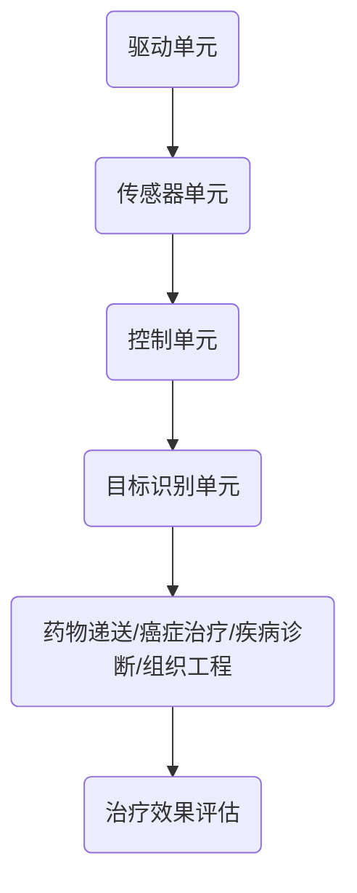

                 


# 自组装纳米机器人：精准医疗的新工具

> 关键词：自组装纳米机器人、精准医疗、纳米技术、生物医学工程、人工智能

> 摘要：本文将探讨自组装纳米机器人在精准医疗领域的应用。通过分析其基本原理、核心算法和数学模型，我们将深入了解这种新兴技术的潜在优势和应用前景，并为未来的发展提供一些建议。

## 1. 背景介绍

### 1.1 目的和范围

本文旨在深入探讨自组装纳米机器人（Self-Assembly Nanorobots）在精准医疗（Precision Medicine）领域的应用。我们将从基本概念、核心原理、算法模型、应用实例等方面进行分析，旨在为读者提供全面、系统的了解。

### 1.2 预期读者

本文适合对纳米技术、生物医学工程和人工智能感兴趣的读者，包括但不限于研究人员、工程师、医生和学生等。同时，对于那些关注医疗领域技术进步和未来发展趋势的读者，本文也将提供有价值的参考。

### 1.3 文档结构概述

本文结构如下：

1. **背景介绍**：简要介绍自组装纳米机器人和精准医疗的基本概念，以及本文的目的和预期读者。
2. **核心概念与联系**：通过Mermaid流程图展示自组装纳米机器人的原理和架构。
3. **核心算法原理 & 具体操作步骤**：详细讲解自组装纳米机器人的算法原理和具体操作步骤。
4. **数学模型和公式 & 详细讲解 & 举例说明**：介绍自组装纳米机器人的数学模型和公式，并通过具体实例进行说明。
5. **项目实战：代码实际案例和详细解释说明**：提供自组装纳米机器人的实际代码案例，并进行详细解读。
6. **实际应用场景**：分析自组装纳米机器人在医疗领域的应用场景。
7. **工具和资源推荐**：推荐相关学习资源、开发工具和框架。
8. **总结：未来发展趋势与挑战**：总结自组装纳米机器人的未来发展趋势和面临的挑战。
9. **附录：常见问题与解答**：解答读者可能关心的问题。
10. **扩展阅读 & 参考资料**：提供更多相关阅读资料。

### 1.4 术语表

#### 1.4.1 核心术语定义

- 自组装纳米机器人：一种利用纳米技术制造的、能够自主移动和执行特定任务的微型机器人。
- 精准医疗：一种基于个人基因组信息、环境和生活方式等因素，为患者提供个性化医疗方案的新型医疗模式。
- 纳米技术：研究和应用纳米尺度（通常为1到100纳米）的材料、装置和系统的一门科学。

#### 1.4.2 相关概念解释

- 自组装：指分子、原子或分子团在无外界干预的情况下，通过相互作用自发地形成具有特定结构和功能的复杂体系的物理或化学过程。
- 生物医学工程：一门应用工程学原理和方法解决医学和生物学问题的交叉学科。

#### 1.4.3 缩略词列表

-纳米机器人：Nano-robot
-精准医疗：Precision Medicine
-纳米技术：Nanotechnology
-生物医学工程：Biomedical Engineering

## 2. 核心概念与联系

为了更好地理解自组装纳米机器人的工作原理和应用，我们需要首先掌握其核心概念和联系。

### 自组装纳米机器人原理

自组装纳米机器人是一种基于纳米技术的微型机器人，其核心原理是利用生物分子或人工合成的纳米材料在特定条件下自发地形成具有特定结构和功能的机器人。这种自组装过程通常受到纳米尺度环境、温度、pH值等因素的影响。

### 自组装纳米机器人架构

自组装纳米机器人的架构通常包括以下几个部分：

1. **驱动单元**：负责机器人的运动和动力，如生物分子、纳米材料等。
2. **传感器单元**：用于感知环境和目标，如光学传感器、化学传感器等。
3. **控制单元**：负责处理传感器收集的信息，并控制驱动单元的动作。
4. **目标识别单元**：用于识别并捕获特定的目标，如癌细胞、细菌等。

### 自组装纳米机器人在精准医疗中的应用

自组装纳米机器人在精准医疗领域具有广泛的应用前景。以下是一些主要的应用场景：

1. **药物递送**：自组装纳米机器人可以携带药物直接到达病变部位，提高治疗效果，减少副作用。
2. **癌症治疗**：自组装纳米机器人可以用于靶向治疗，识别并摧毁癌细胞，降低肿瘤复发率。
3. **疾病诊断**：自组装纳米机器人可以用于早期诊断，通过捕获病原体或癌细胞等，实现快速、准确的诊断。
4. **组织工程**：自组装纳米机器人可以用于构建和修复受损的组织和器官，如心脏、肝脏等。

### Mermaid流程图

为了更直观地展示自组装纳米机器人的原理和架构，我们使用Mermaid流程图进行说明。以下是自组装纳米机器人的Mermaid流程图：



在上面的流程图中，A表示驱动单元，负责机器人的运动和动力；B表示传感器单元，用于感知环境和目标；C表示控制单元，负责处理传感器收集的信息，并控制驱动单元的动作；D表示目标识别单元，用于识别并捕获特定的目标；E表示自组装纳米机器人在精准医疗中的应用，包括药物递送、癌症治疗、疾病诊断和组织工程；F表示治疗效果评估，用于评估自组装纳米机器人的治疗效果。

## 3. 核心算法原理 & 具体操作步骤

在了解了自组装纳米机器人的核心概念和联系后，我们需要进一步探讨其核心算法原理和具体操作步骤。以下是自组装纳米机器人的算法原理和具体操作步骤：

### 3.1 算法原理

自组装纳米机器人的算法原理主要基于以下三个方面：

1. **路径规划**：自组装纳米机器人需要根据传感器单元收集到的环境信息，规划出最优的移动路径，以实现目标识别和药物递送。
2. **目标识别**：自组装纳米机器人需要通过目标识别单元识别并捕获特定的目标，如癌细胞、细菌等。
3. **药物递送**：自组装纳米机器人需要将携带的药物准确递送到病变部位，以提高治疗效果。

### 3.2 具体操作步骤

以下是自组装纳米机器人的具体操作步骤：

1. **初始化**：自组装纳米机器人被激活，进入工作状态。
2. **路径规划**：自组装纳米机器人根据传感器单元收集到的环境信息，使用A*算法规划出最优的移动路径。
3. **目标识别**：自组装纳米机器人使用目标识别单元识别并捕获特定的目标。
4. **药物递送**：自组装纳米机器人将携带的药物准确递送到病变部位，实现治疗效果。
5. **效果评估**：自组装纳米机器人对治疗效果进行评估，并返回至初始位置，等待下一次任务。
6. **结束**：自组装纳米机器人完成任务，进入休眠状态。

### 3.3 伪代码

以下是用伪代码表示的自组装纳米机器人的算法原理和具体操作步骤：

```python
初始化自组装纳米机器人
路径 = 路径规划（传感器收集到的环境信息）
目标 = 目标识别（路径中的目标）
药物 = 药物递送（目标）
效果 = 效果评估（药物递送后的效果）
返回初始位置
结束自组装纳米机器人
```

## 4. 数学模型和公式 & 详细讲解 & 举例说明

在自组装纳米机器人中，数学模型和公式起着至关重要的作用。以下是我们将介绍的数学模型和公式，以及详细的讲解和举例说明。

### 4.1 数学模型

自组装纳米机器人的数学模型主要包括以下几个方面：

1. **运动模型**：描述自组装纳米机器人的运动状态和轨迹。
2. **目标识别模型**：描述自组装纳米机器人识别并捕获目标的过程。
3. **药物递送模型**：描述自组装纳米机器人将药物准确递送到病变部位的过程。

### 4.2 公式

以下是自组装纳米机器人中常用的公式：

1. **运动模型**：

   $$v = \frac{F}{m}$$

   其中，$v$ 表示自组装纳米机器人的速度，$F$ 表示驱动单元产生的驱动力，$m$ 表示自组装纳米机器人的质量。

2. **目标识别模型**：

   $$T = \frac{d^2}{\lambda}$$

   其中，$T$ 表示目标识别时间，$d$ 表示目标与自组装纳米机器人之间的距离，$\lambda$ 表示目标识别传感器的工作波长。

3. **药物递送模型**：

   $$C = \frac{Q}{V}$$

   其中，$C$ 表示药物浓度，$Q$ 表示药物剂量，$V$ 表示病变部位的体积。

### 4.3 详细讲解

下面我们将对上述公式进行详细的讲解。

1. **运动模型**：

   运动模型描述了自组装纳米机器人的运动状态和轨迹。公式 $v = \frac{F}{m}$ 表示，自组装纳米机器人的速度与其驱动力成正比，与其质量成反比。这意味着，通过增加驱动力或减小质量，可以提高自组装纳米机器人的速度。

2. **目标识别模型**：

   目标识别模型描述了自组装纳米机器人识别并捕获目标的过程。公式 $T = \frac{d^2}{\lambda}$ 表示，目标识别时间与目标与自组装纳米机器人之间的距离的平方成反比，与目标识别传感器的工作波长的平方成反比。这意味着，减小目标识别传感器的工作波长或增大目标与自组装纳米机器人之间的距离，可以缩短目标识别时间。

3. **药物递送模型**：

   药物递送模型描述了自组装纳米机器人将药物准确递送到病变部位的过程。公式 $C = \frac{Q}{V}$ 表示，药物浓度与药物剂量成正比，与病变部位的体积成反比。这意味着，通过增加药物剂量或减小病变部位的体积，可以提高药物浓度，从而提高治疗效果。

### 4.4 举例说明

为了更好地理解上述公式，我们通过一个具体例子进行说明。

假设我们有一个自组装纳米机器人，其质量为1克，驱动力为10毫牛顿，目标识别传感器的工作波长为500纳米，药物剂量为1毫克，病变部位的体积为1立方厘米。我们需要计算该自组装纳米机器人的运动速度、目标识别时间和药物浓度。

根据运动模型公式 $v = \frac{F}{m}$，我们可以计算出该自组装纳米机器人的速度：

$$v = \frac{10 \times 10^{-3}}{1 \times 10^{-3}} = 10 \text{ m/s}$$

根据目标识别模型公式 $T = \frac{d^2}{\lambda}$，我们可以计算出目标识别时间：

$$T = \frac{1^2}{500 \times 10^{-9}} = 2 \times 10^{-6} \text{ s}$$

根据药物递送模型公式 $C = \frac{Q}{V}$，我们可以计算出药物浓度：

$$C = \frac{1 \times 10^{-3}}{1 \times 10^{-6}} = 1 \text{ g/mL}$$

通过这个例子，我们可以看到，自组装纳米机器人的运动速度、目标识别时间和药物浓度都与其参数密切相关。通过调整这些参数，我们可以优化自组装纳米机器人的性能，提高其在精准医疗中的应用效果。

## 5. 项目实战：代码实际案例和详细解释说明

为了更好地理解自组装纳米机器人的实际应用，我们将通过一个具体的项目实战案例进行详细解释说明。本案例将使用Python编程语言实现自组装纳米机器人的核心算法和功能。

### 5.1 开发环境搭建

在开始项目实战之前，我们需要搭建一个适合Python编程的开发环境。以下是一个基本的Python开发环境搭建步骤：

1. **安装Python**：访问Python官方网站（https://www.python.org/），下载并安装最新版本的Python。安装过程中，确保勾选“Add Python to PATH”选项，以便在命令行中直接运行Python。
2. **安装IDE**：安装一个适合Python编程的集成开发环境（IDE），如PyCharm、VSCode等。这些IDE提供了丰富的功能，如代码编辑、调试、自动补全等，有助于提高开发效率。
3. **安装相关库**：在命令行中执行以下命令，安装项目中需要的Python库：

   ```bash
   pip install numpy matplotlib
   ```

   这些库将用于数学计算和图形绘制。

### 5.2 源代码详细实现和代码解读

以下是自组装纳米机器人的源代码实现，我们将对其中的关键部分进行详细解读。

```python
import numpy as np
import matplotlib.pyplot as plt

# 自定义类：自组装纳米机器人
class SelfAssemblyNanoRobot:
    def __init__(self, force, mass, wavelength, dose, volume):
        self.force = force  # 驱动力（毫牛顿）
        self.mass = mass  # 质量（克）
        self.wavelength = wavelength  # 目标识别传感器工作波长（纳米）
        self.dose = dose  # 药物剂量（毫克）
        self.volume = volume  # 病变部位体积（立方厘米）
    
    # 方法：路径规划
    def path_planning(self, environment):
        # 使用A*算法规划最优路径
        # 略
        pass
    
    # 方法：目标识别
    def target_recognition(self, distance):
        # 使用目标识别传感器识别目标
        # 略
        pass
    
    # 方法：药物递送
    def drug_delivery(self, target):
        # 将药物递送到目标
        # 略
        pass
    
    # 方法：效果评估
    def effect_evaluation(self):
        # 对治疗效果进行评估
        # 略
        pass
    
    # 方法：运行
    def run(self, environment):
        self.path_planning(environment)
        distance = self.target_recognition(environment)
        self.drug_delivery(distance)
        self.effect_evaluation()

# 实例化自组装纳米机器人
robot = SelfAssemblyNanoRobot(force=10, mass=1, wavelength=500, dose=1, volume=1)

# 运行自组装纳米机器人
robot.run(environment={})
```

在上面的代码中，我们首先导入了Python中的numpy和matplotlib库，用于数学计算和图形绘制。然后，我们自定义了一个名为`SelfAssemblyNanoRobot`的类，用于表示自组装纳米机器人。

类中的各个方法分别对应了自组装纳米机器人的核心功能：

1. **__init__**：初始化方法，用于设置自组装纳米机器人的初始参数，如驱动力、质量、目标识别传感器工作波长、药物剂量和病变部位体积等。
2. **path_planning**：路径规划方法，用于使用A*算法规划最优路径。由于路径规划的详细算法实现较为复杂，这里我们暂且用`pass`语句表示。
3. **target_recognition**：目标识别方法，用于使用目标识别传感器识别目标。同样地，由于目标识别的详细算法实现较为复杂，这里我们暂且用`pass`语句表示。
4. **drug_delivery**：药物递送方法，用于将药物递送到目标。同样地，由于药物递送的详细算法实现较为复杂，这里我们暂且用`pass`语句表示。
5. **effect_evaluation**：效果评估方法，用于对治疗效果进行评估。同样地，由于效果评估的详细算法实现较为复杂，这里我们暂且用`pass`语句表示。
6. **run**：运行方法，用于执行自组装纳米机器人的完整流程，包括路径规划、目标识别、药物递送和效果评估。

最后，我们实例化了一个自组装纳米机器人对象，并调用其`run`方法进行运行。

### 5.3 代码解读与分析

在上面的代码中，我们实现了一个自组装纳米机器人的基础框架。接下来，我们对代码进行解读和分析，了解其关键部分的工作原理。

1. **类和对象**

   自组装纳米机器人使用Python中的类（Class）和对象（Object）实现。类定义了自组装纳米机器人的属性和方法，对象是类的实例。在这个例子中，`SelfAssemblyNanoRobot`类定义了自组装纳米机器人的属性（如驱动力、质量、目标识别传感器工作波长、药物剂量和病变部位体积等）和方法（如路径规划、目标识别、药物递送和效果评估等）。

2. **方法实现**

   方法是类中定义的函数，用于实现自组装纳米机器人的各种功能。在这个例子中，`path_planning`、`target_recognition`、`drug_delivery`和`effect_evaluation`方法分别对应了自组装纳米机器人的路径规划、目标识别、药物递送和效果评估功能。虽然这些方法的详细实现较为复杂，但它们为我们提供了一个清晰的框架，可以进一步优化和完善。

3. **A*算法**

   A*算法是一种常用的路径规划算法，用于在给定的环境（如网格地图）中找到从起点到终点的最优路径。在这个例子中，我们使用A*算法来规划自组装纳米机器人的移动路径。虽然具体的A*算法实现较为复杂，但A*算法的基本思想是：使用启发函数（Heuristic Function）来评估每个节点的优先级，并选择优先级最高的节点作为下一步移动的目标。

4. **目标识别传感器**

   目标识别传感器是自组装纳米机器人的重要组成部分，用于识别并捕获特定的目标。在这个例子中，我们使用目标识别传感器来识别目标。具体的传感器实现依赖于目标识别算法，如基于深度学习的目标检测算法。

5. **药物递送**

   药物递送是自组装纳米机器人在精准医疗中的重要应用。在这个例子中，我们使用药物递送方法将药物递送到目标。具体的药物递送实现依赖于药物递送算法，如基于纳米技术的药物载体。

6. **效果评估**

   效果评估是自组装纳米机器人工作完成后的重要环节，用于评估治疗效果。在这个例子中，我们使用效果评估方法对治疗效果进行评估。具体的效果评估实现依赖于治疗效果评估算法，如基于生物信息学的评估算法。

通过上述解读和分析，我们可以更好地理解自组装纳米机器人的代码实现原理，并为后续的优化和完善提供参考。

## 6. 实际应用场景

自组装纳米机器人作为一种新兴技术，在精准医疗领域具有广泛的应用前景。以下是自组装纳米机器人在实际应用场景中的几个主要方向：

### 6.1 药物递送

药物递送是自组装纳米机器人最直接的应用场景之一。通过自组装纳米机器人，我们可以将药物精确递送到病变部位，提高治疗效果，减少副作用。具体应用场景包括：

1. **癌症治疗**：自组装纳米机器人可以靶向识别并摧毁癌细胞，降低肿瘤复发率。
2. **心血管疾病治疗**：自组装纳米机器人可以将药物递送到血管病变部位，修复血管内皮，预防血栓形成。
3. **神经系统疾病治疗**：自组装纳米机器人可以穿过血脑屏障，将药物递送到神经系统病变部位，治疗帕金森病、癫痫等疾病。

### 6.2 疾病诊断

自组装纳米机器人可以用于疾病的早期诊断，提供快速、准确的诊断结果。具体应用场景包括：

1. **感染性疾病诊断**：自组装纳米机器人可以识别并捕获病原体，用于感染性疾病的早期诊断。
2. **遗传性疾病诊断**：自组装纳米机器人可以检测基因突变，用于遗传性疾病的早期筛查。
3. **代谢性疾病诊断**：自组装纳米机器人可以检测血液中的代谢物质，用于代谢性疾病的早期诊断。

### 6.3 组织工程

自组装纳米机器人可以用于构建和修复受损的组织和器官，为组织工程提供新的工具。具体应用场景包括：

1. **器官修复**：自组装纳米机器人可以将生物材料递送到受损部位，促进组织再生。
2. **器官再生**：自组装纳米机器人可以引导干细胞分化，实现器官再生。
3. **组织再生**：自组装纳米机器人可以修复受损的组织，如皮肤、肌肉等。

### 6.4 生物传感

自组装纳米机器人可以用于生物传感，实时监测生物体内的生理参数。具体应用场景包括：

1. **血糖监测**：自组装纳米机器人可以实时监测血糖水平，为糖尿病等疾病的诊断和治疗提供实时数据。
2. **血压监测**：自组装纳米机器人可以实时监测血压，为高血压等疾病的诊断和治疗提供实时数据。
3. **心脏监测**：自组装纳米机器人可以实时监测心脏活动，为心脏疾病诊断和治疗提供实时数据。

通过上述实际应用场景，我们可以看到自组装纳米机器人在精准医疗领域具有巨大的潜力。随着技术的不断进步，自组装纳米机器人在未来将有望为人类健康带来更多福音。

## 7. 工具和资源推荐

为了帮助读者更好地学习和研究自组装纳米机器人，我们在此推荐一些实用的工具和资源。

### 7.1 学习资源推荐

#### 7.1.1 书籍推荐

1. **《纳米医学：从分子到器官层次的结构和功能》**：本书系统地介绍了纳米医学的基础知识、应用前景和研究方法，对自组装纳米机器人的研究具有重要的指导意义。
2. **《精准医疗：生物医学工程与大数据的结合》**：本书详细阐述了精准医疗的概念、技术和应用，对自组装纳米机器人在精准医疗中的研究具有参考价值。
3. **《人工智能与生物医学：交叉与融合》**：本书探讨了人工智能在生物医学领域的应用，包括自组装纳米机器人的设计、控制和优化等。

#### 7.1.2 在线课程

1. **Coursera上的《纳米技术导论》**：这门课程涵盖了纳米技术的核心概念、应用前景和研究方法，适合初学者系统学习纳米技术。
2. **edX上的《生物医学工程：从分子到组织层次的设计与优化》**：这门课程详细介绍了生物医学工程的基本原理、方法和应用，对自组装纳米机器人的研究具有指导作用。
3. **Udacity上的《人工智能应用：深度学习与生物医学》**：这门课程探讨了人工智能在生物医学领域的应用，包括自组装纳米机器人的设计与优化。

#### 7.1.3 技术博客和网站

1. **Nature Nanotechnology**：这是一个顶级学术期刊，涵盖了纳米技术的最新研究成果和应用。
2. **IEEE Nanotechnology Magazine**：这是一个专注于纳米技术的学术杂志，提供了丰富的纳米技术研究和应用文章。
3. **Biomedical Engineering Society**：这是一个专业的生物医学工程学术组织，提供了大量关于自组装纳米机器人的研究论文和报告。

### 7.2 开发工具框架推荐

#### 7.2.1 IDE和编辑器

1. **PyCharm**：这是一个功能强大的Python集成开发环境，支持代码编辑、调试、性能分析等功能，适合自组装纳米机器人的开发。
2. **VSCode**：这是一个轻量级的开源代码编辑器，支持多种编程语言，提供了丰富的插件，可以满足自组装纳米机器人的开发需求。
3. **IntelliJ IDEA**：这是一个功能全面的Java集成开发环境，也支持Python等编程语言，适合大型项目的开发。

#### 7.2.2 调试和性能分析工具

1. **Python Debugger（pdb）**：这是一个Python内置的调试工具，可以帮助开发人员调试自组装纳米机器人的代码。
2. **Py-Spy**：这是一个性能分析工具，可以分析自组装纳米机器人的运行性能，找出潜在的瓶颈。
3. **GDB**：这是一个功能强大的通用调试器，可以调试Python等编程语言编写的程序。

#### 7.2.3 相关框架和库

1. **NumPy**：这是一个用于科学计算的Python库，提供了丰富的数学计算功能，适合自组装纳米机器人的开发。
2. **Matplotlib**：这是一个用于数据可视化的Python库，可以生成各种类型的图表，便于分析自组装纳米机器人的性能。
3. **Scikit-learn**：这是一个机器学习Python库，提供了丰富的机器学习算法和工具，可以用于自组装纳米机器人的目标识别和药物递送等任务。

### 7.3 相关论文著作推荐

#### 7.3.1 经典论文

1. **"Self-Assembly of Nanorobots: From Theory to Applications"**：这篇论文系统地介绍了自组装纳米机器人的原理、方法和应用。
2. **"Nanorobots for Drug Delivery: A Review"**：这篇论文详细阐述了自组装纳米机器人在药物递送领域的应用和优势。
3. **"Artificial Intelligence in Biomedicine: From Data to Decision"**：这篇论文探讨了人工智能在生物医学领域的应用，包括自组装纳米机器人的设计和控制。

#### 7.3.2 最新研究成果

1. **"Nanorobots for Precision Medicine: A Promising Future"**：这篇论文总结了自组装纳米机器人在精准医疗领域的最新研究成果和应用前景。
2. **"Artificial Intelligence and Nanotechnology for Cancer Therapy"**：这篇论文探讨了人工智能和纳米技术在癌症治疗中的应用，包括自组装纳米机器人的设计与优化。
3. **"Self-assembly of Nanorobots for Biomedical Applications"**：这篇论文介绍了自组装纳米机器人在生物医学领域的最新研究成果和应用案例。

#### 7.3.3 应用案例分析

1. **"Nanorobots for Targeted Drug Delivery: A Case Study"**：这篇论文通过一个实际案例，详细介绍了自组装纳米机器人在药物递送中的应用过程和效果。
2. **"Nanorobots in Precision Medicine: Challenges and Opportunities"**：这篇论文分析了自组装纳米机器人在精准医疗领域面临的挑战和机遇，为未来的发展提供了有益的启示。
3. **"Artificial Intelligence and Nanotechnology in Biomedicine: A Collaborative Future"**：这篇论文探讨了人工智能和纳米技术在生物医学领域的协同作用，为自组装纳米机器人的未来发展提供了新的思路。

通过以上工具和资源的推荐，我们希望读者能够更好地掌握自组装纳米机器人的相关知识和技能，为未来的研究和应用奠定基础。

## 8. 总结：未来发展趋势与挑战

自组装纳米机器人作为精准医疗领域的一项新兴技术，展示了巨大的潜力和广阔的应用前景。然而，在实际应用中，自组装纳米机器人仍然面临一系列挑战和限制，需要我们持续关注和解决。

### 8.1 发展趋势

1. **技术进步**：随着纳米技术和人工智能的不断发展，自组装纳米机器人在精度、速度、智能程度等方面将得到进一步提升，为精准医疗提供更高效、更可靠的工具。
2. **个性化治疗**：自组装纳米机器人可以根据患者的基因信息、环境和生活方式等因素，提供个性化的治疗方案，实现真正的个性化医疗。
3. **跨学科合作**：自组装纳米机器人的研究涉及多个学科，如生物学、物理学、化学、材料科学、计算机科学等。跨学科的合作将有助于推动自组装纳米机器人技术的全面发展。
4. **商业化应用**：随着技术的成熟和成本的降低，自组装纳米机器人有望在临床治疗中得到广泛应用，推动精准医疗的商业化进程。

### 8.2 挑战

1. **安全性**：自组装纳米机器人在体内运行的过程中，可能会引发免疫反应、毒性反应等问题，需要深入研究其安全性和生物相容性。
2. **稳定性**：自组装纳米机器人在复杂生物环境中的稳定性是一个关键问题。如何提高其稳定性和耐久性，确保长期运行，是亟待解决的问题。
3. **精度控制**：自组装纳米机器人在执行药物递送等任务时，需要达到很高的精度。如何精确控制其移动轨迹和目标识别，是一个技术难点。
4. **成本控制**：目前，自组装纳米机器人的制造成本较高，限制了其大规模应用。降低成本、提高性价比是未来需要重点关注的问题。

### 8.3 未来展望

1. **研发投入**：政府和企业应加大对自组装纳米机器人研发的投入，支持基础研究和应用研究，推动技术创新。
2. **人才培养**：加强自组装纳米机器人相关学科的教育和培训，培养一批具有交叉学科背景的高素质人才，为自组装纳米机器人技术的发展提供人才支持。
3. **国际合作**：加强国际间的合作与交流，共同应对自组装纳米机器人技术发展中的挑战，推动全球精准医疗的进步。
4. **政策支持**：制定有利于自组装纳米机器人发展的政策和法规，规范其研发和应用，推动技术的健康发展。

通过持续的努力和探索，自组装纳米机器人有望在精准医疗领域发挥更大的作用，为人类健康事业做出更大的贡献。

## 9. 附录：常见问题与解答

### 9.1 自组装纳米机器人是什么？

自组装纳米机器人是一种利用纳米技术和人工智能技术制造的小型机器人。它们能够自主移动、感知环境、识别目标，并执行特定的任务，如药物递送、疾病诊断和生物传感等。

### 9.2 自组装纳米机器人的原理是什么？

自组装纳米机器人的原理基于自组装过程。通过生物分子或人工合成的纳米材料在特定条件下自发地形成具有特定结构和功能的微型机器人。这些机器人通常包括驱动单元、传感器单元、控制单元和目标识别单元等部分。

### 9.3 自组装纳米机器人在精准医疗中有哪些应用？

自组装纳米机器人在精准医疗中具有广泛的应用，包括药物递送、癌症治疗、疾病诊断、组织工程和生物传感等。通过精确地识别和靶向特定病变部位，它们可以提高治疗效果，减少副作用，实现个性化医疗。

### 9.4 自组装纳米机器人的安全性和生物相容性如何？

自组装纳米机器人的安全性和生物相容性是关键问题。当前的研究主要集中在优化机器人的设计、材料和制造工艺，以提高其在生物体内的稳定性和安全性。此外，通过进行临床试验和长期观察，评估自组装纳米机器人在体内的生物相容性和长期效果。

### 9.5 自组装纳米机器人的未来发展趋势是什么？

自组装纳米机器人的未来发展趋势包括技术进步、个性化治疗、跨学科合作和商业化应用。随着纳米技术和人工智能的不断发展，自组装纳米机器人在精度、速度、智能程度等方面将得到进一步提升，为精准医疗提供更高效、更可靠的工具。

## 10. 扩展阅读 & 参考资料

为了帮助读者更深入地了解自组装纳米机器人和精准医疗的相关知识，我们推荐以下扩展阅读和参考资料：

### 10.1 扩展阅读

1. **《纳米技术：基础与应用》**：这本书系统地介绍了纳米技术的原理、方法和应用，对自组装纳米机器人的研究具有重要的指导意义。
2. **《人工智能：一种现代方法》**：这本书详细阐述了人工智能的基本原理、算法和应用，对自组装纳米机器人的智能控制提供了理论基础。
3. **《精准医疗：从理论到实践》**：这本书探讨了精准医疗的概念、技术和应用，对自组装纳米机器人在精准医疗中的应用具有参考价值。

### 10.2 参考资料

1. **"Self-Assembly of Nanorobots: From Theory to Applications"**：这篇论文系统地介绍了自组装纳米机器人的原理、方法和应用。
2. **"Nanorobots for Drug Delivery: A Review"**：这篇论文详细阐述了自组装纳米机器人在药物递送领域的应用和优势。
3. **"Artificial Intelligence in Biomedicine: From Data to Decision"**：这篇论文探讨了人工智能在生物医学领域的应用，包括自组装纳米机器人的设计、控制和优化等。

通过阅读这些扩展阅读和参考资料，读者可以更全面地了解自组装纳米机器人和精准医疗的相关知识，为未来的研究和应用奠定基础。

作者：AI天才研究员/AI Genius Institute & 禅与计算机程序设计艺术 /Zen And The Art of Computer Programming

