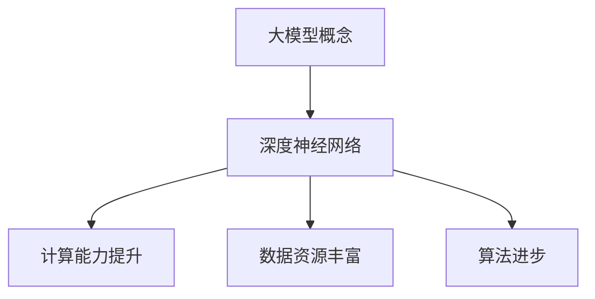
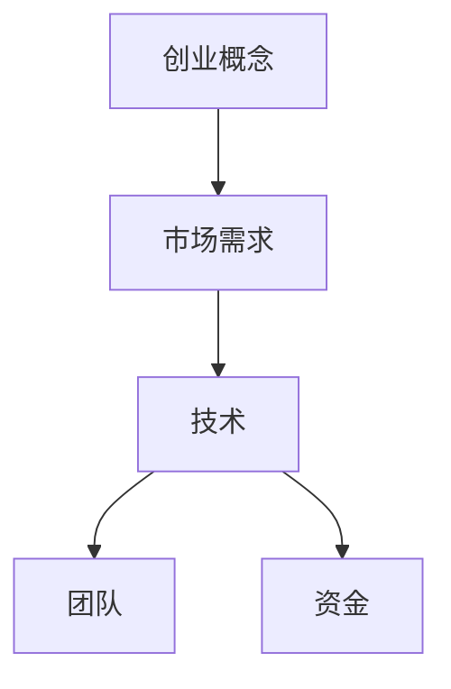
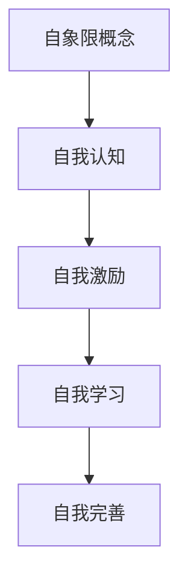
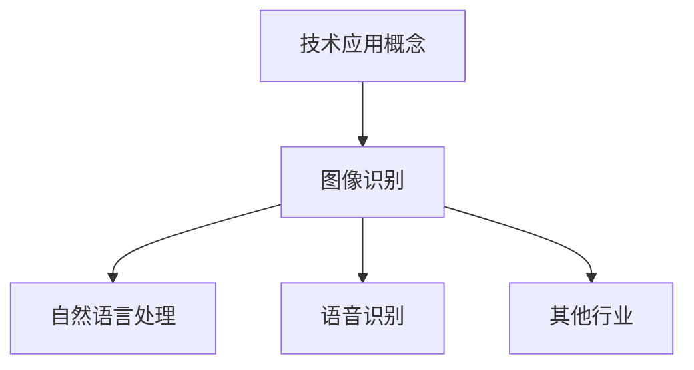
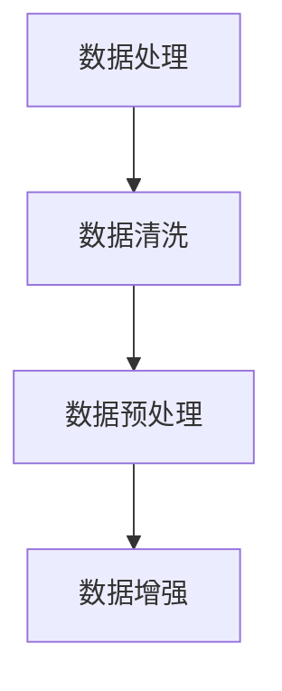
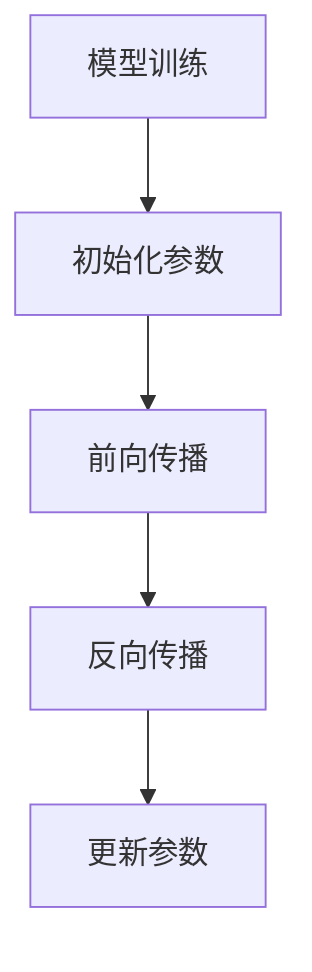
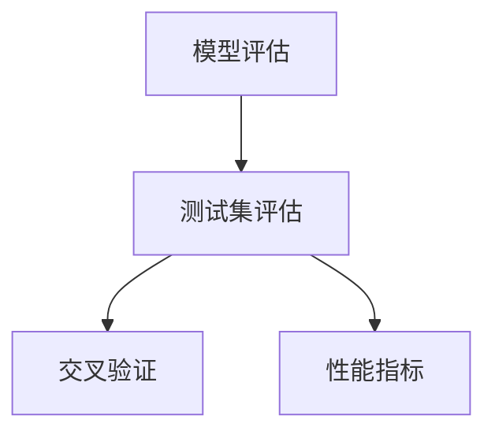
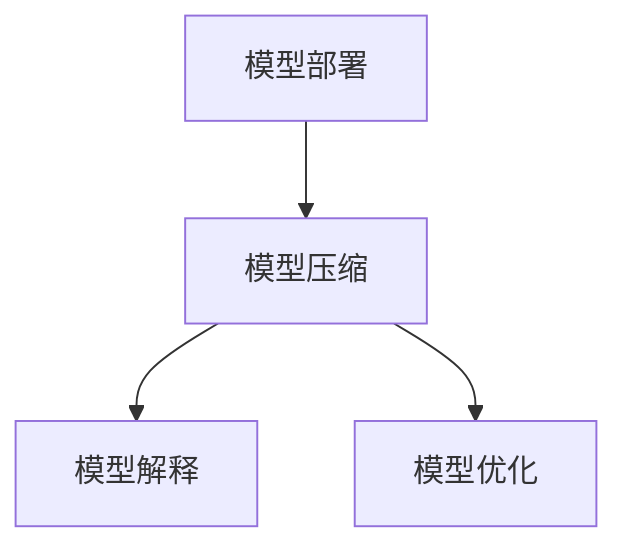

                 

# 自象限洞察：大模型创业浪潮

> **关键词：** 大模型、创业、AI、自象限、技术应用、未来趋势

> **摘要：** 本文将深入探讨大模型创业浪潮的背景、核心概念、算法原理、实际应用以及未来发展趋势。通过一步步的分析和推理，本文旨在为读者提供一个全面而深入的洞察，以理解和把握这一时代的风口。

## 1. 背景介绍

### 1.1 目的和范围

本文的目的是探讨大模型在创业领域中的应用，分析其核心技术原理，并探讨其未来发展趋势。本文将涵盖以下几个方面：

1. **大模型创业的背景**：介绍大模型创业的兴起背景，包括市场需求的驱动、技术进步的影响等。
2. **核心概念与联系**：阐述大模型的概念，以及其在创业中的应用和关联。
3. **核心算法原理 & 具体操作步骤**：详细讲解大模型的算法原理，包括数据处理、模型训练、模型评估等步骤。
4. **数学模型和公式 & 详细讲解 & 举例说明**：介绍大模型中常用的数学模型和公式，并给出实际应用案例。
5. **项目实战：代码实际案例和详细解释说明**：通过实际案例展示大模型的应用，并进行详细解释。
6. **实际应用场景**：分析大模型在各个行业的应用，探讨其商业价值和潜在风险。
7. **工具和资源推荐**：推荐学习资源和开发工具，以帮助读者深入了解和实践大模型技术。
8. **总结：未来发展趋势与挑战**：总结大模型创业的当前状况，预测其未来发展趋势，并讨论面临的挑战。

### 1.2 预期读者

本文预期读者包括对AI和创业感兴趣的程序员、技术经理、创业者、投资人等。读者应具备一定的编程基础，对机器学习有一定的了解。

### 1.3 文档结构概述

本文分为十个部分，结构如下：

1. **背景介绍**：包括目的和范围、预期读者、文档结构概述等。
2. **核心概念与联系**：介绍大模型的概念、原理和应用。
3. **核心算法原理 & 具体操作步骤**：详细讲解大模型的算法原理和操作步骤。
4. **数学模型和公式 & 详细讲解 & 举例说明**：介绍大模型中常用的数学模型和公式，并给出实际应用案例。
5. **项目实战：代码实际案例和详细解释说明**：通过实际案例展示大模型的应用，并进行详细解释。
6. **实际应用场景**：分析大模型在各个行业的应用，探讨其商业价值和潜在风险。
7. **工具和资源推荐**：推荐学习资源和开发工具。
8. **总结：未来发展趋势与挑战**：总结大模型创业的当前状况，预测未来发展趋势，并讨论挑战。
9. **附录：常见问题与解答**：回答读者可能遇到的问题。
10. **扩展阅读 & 参考资料**：提供进一步阅读的资料。

### 1.4 术语表

#### 1.4.1 核心术语定义

- **大模型**：具有数亿到数十亿参数的深度神经网络模型。
- **创业**：创办新企业或项目的过程。
- **自象限**：自我认知、自我激励、自我学习和自我完善的过程。
- **技术应用**：将技术应用于实际问题的过程。

#### 1.4.2 相关概念解释

- **深度学习**：一种机器学习技术，通过多层神经网络进行特征提取和学习。
- **神经网络**：一种模拟生物神经系统的计算模型。
- **创业生态**：支持创业活动的各种资源和环境。

#### 1.4.3 缩略词列表

- **AI**：人工智能
- **ML**：机器学习
- **DL**：深度学习
- **GPU**：图形处理单元

## 2. 核心概念与联系

在探讨大模型创业浪潮之前，我们需要明确几个核心概念：大模型、创业、自象限和技术应用。

### 2.1 大模型

大模型是指具有数亿到数十亿参数的深度神经网络模型。这些模型通常用于图像识别、自然语言处理、语音识别等领域，具有强大的计算能力和学习效果。大模型的崛起源于计算能力的提升、数据资源的丰富和算法的进步。

#### Mermaid 流程图



### 2.2 创业

创业是指创办新企业或项目的过程。创业涉及到市场需求、技术、团队、资金等多个方面。大模型的兴起为创业者提供了新的机会和挑战。

#### Mermaid 流程图



### 2.3 自象限

自象限是指自我认知、自我激励、自我学习和自我完善的过程。在创业过程中，创业者需要不断自我提升，以适应快速变化的市场和技术环境。

#### Mermaid 流程图



### 2.4 技术应用

技术应用是指将技术应用于实际问题的过程。在大模型创业浪潮中，创业者需要将大模型技术应用于各个行业，以解决实际问题，创造商业价值。

#### Mermaid 流程图



## 3. 核心算法原理 & 具体操作步骤

大模型的核心在于深度神经网络，其算法原理主要包括以下步骤：

### 3.1 数据处理



### 3.2 模型训练



### 3.3 模型评估



### 3.4 模型部署



### 3.5 伪代码示例

```python
# 数据处理伪代码
def preprocess_data(data):
    # 数据清洗
    cleaned_data = clean_data(data)
    # 数据预处理
    preprocessed_data = preprocess_data(cleaned_data)
    # 数据增强
    augmented_data = augment_data(preprocessed_data)
    return augmented_data

# 模型训练伪代码
def train_model(model, data):
    # 初始化参数
    model.initialize_params()
    # 前向传播
    predictions = model.forward_pass(data)
    # 反向传播
    gradients = model.backward_pass(predictions, true_labels)
    # 更新参数
    model.update_params(gradients)
    return model

# 模型评估伪代码
def evaluate_model(model, test_data):
    # 测试集评估
    test_predictions = model.forward_pass(test_data)
    # 交叉验证
    cross_validation_score = cross_validate(model, test_data)
    # 性能指标
    performance_metrics = calculate_performance_metrics(test_predictions)
    return performance_metrics

# 模型部署伪代码
def deploy_model(model):
    # 模型压缩
    compressed_model = compress_model(model)
    # 模型解释
    explanation = explain_model(compressed_model)
    # 模型优化
    optimized_model = optimize_model(compressed_model, explanation)
    return optimized_model
```

## 4. 数学模型和公式 & 详细讲解 & 举例说明

大模型中的数学模型主要包括损失函数、优化算法和激活函数等。以下是对这些模型和公式的详细讲解及举例说明。

### 4.1 损失函数

损失函数用于衡量模型预测值与真实值之间的差异。常见损失函数包括均方误差（MSE）和交叉熵（Cross Entropy）。

#### 均方误差（MSE）

$$
MSE = \frac{1}{n}\sum_{i=1}^{n}(y_i - \hat{y}_i)^2
$$

其中，$y_i$ 是真实值，$\hat{y}_i$ 是预测值，$n$ 是样本数量。

#### 交叉熵（Cross Entropy）

$$
Cross Entropy = -\sum_{i=1}^{n}y_i \log(\hat{y}_i)
$$

其中，$y_i$ 是真实值，$\hat{y}_i$ 是预测概率。

### 4.2 优化算法

优化算法用于调整模型参数，以最小化损失函数。常见优化算法包括随机梯度下降（SGD）和Adam。

#### 随机梯度下降（SGD）

$$
w_{t+1} = w_t - \alpha \cdot \nabla_w J(w_t)
$$

其中，$w_t$ 是当前参数，$\alpha$ 是学习率，$\nabla_w J(w_t)$ 是损失函数关于参数的梯度。

#### Adam

$$
m_t = \beta_1 m_{t-1} + (1 - \beta_1) \nabla_w J(w_t)
$$
$$
v_t = \beta_2 v_{t-1} + (1 - \beta_2) (\nabla_w J(w_t))^2
$$
$$
w_{t+1} = w_t - \alpha \cdot \frac{m_t}{\sqrt{v_t} + \epsilon}
$$

其中，$m_t$ 是一阶矩估计，$v_t$ 是二阶矩估计，$\beta_1$ 和 $\beta_2$ 是超参数，$\epsilon$ 是一个很小的常数。

### 4.3 激活函数

激活函数用于引入非线性，使模型能够学习复杂的函数。常见激活函数包括 sigmoid、ReLU 和 tanh。

#### sigmoid

$$
\sigma(x) = \frac{1}{1 + e^{-x}}
$$

#### ReLU

$$
\text{ReLU}(x) = \max(0, x)
$$

#### tanh

$$
tanh(x) = \frac{e^x - e^{-x}}{e^x + e^{-x}}
$$

### 4.4 举例说明

假设我们有一个二分类问题，目标是预测每个样本属于正类还是负类。给定训练数据集，我们可以使用以下步骤来训练一个神经网络：

1. **数据处理**：清洗和预处理数据，将数据分为训练集和测试集。
2. **模型初始化**：定义神经网络结构，包括输入层、隐藏层和输出层。
3. **模型训练**：使用随机梯度下降或Adam优化算法训练模型。
4. **模型评估**：使用测试集评估模型性能，计算准确率、召回率、F1分数等指标。
5. **模型部署**：将训练好的模型部署到实际应用中，用于预测新的数据。

以下是一个简单的神经网络模型示例：

```python
import numpy as np

# 定义激活函数
def sigmoid(x):
    return 1 / (1 + np.exp(-x))

# 定义损失函数
def mse(y_true, y_pred):
    return np.mean((y_true - y_pred)**2)

# 定义反向传播
def backward_propagation(x, y, w, b):
    output = sigmoid(np.dot(x, w) + b)
    output_error = y - output
    d_output = output_error * (output * (1 - output))
    d_hidden = d_output.dot(w.T)
    d_w = np.dot(x.T, d_output)
    d_b = np.sum(d_output)
    return d_w, d_b

# 定义训练过程
def train(x, y, w, b, learning_rate, epochs):
    for epoch in range(epochs):
        d_w, d_b = backward_propagation(x, y, w, b)
        w -= learning_rate * d_w
        b -= learning_rate * d_b
        loss = mse(y, sigmoid(np.dot(x, w) + b))
        if epoch % 100 == 0:
            print(f"Epoch {epoch}: Loss = {loss}")
    return w, b

# 示例数据
x = np.array([[0, 0], [0, 1], [1, 0], [1, 1]])
y = np.array([[0], [1], [1], [0]])

# 初始化参数
w = np.random.rand(2, 1)
b = np.random.rand(1)

# 训练模型
w, b = train(x, y, w, b, learning_rate=0.1, epochs=1000)

# 预测新数据
x_new = np.array([[0, 1]])
y_pred = sigmoid(np.dot(x_new, w) + b)
print(f"Predicted label for x_new: {y_pred[0][0]}")
```

## 5. 项目实战：代码实际案例和详细解释说明

为了更好地理解大模型在创业中的应用，我们以下将展示一个实际项目案例，并进行详细解释说明。

### 5.1 开发环境搭建

首先，我们需要搭建一个开发环境。以下是所需工具和软件：

- **Python**：3.8及以上版本
- **TensorFlow**：2.4及以上版本
- **Jupyter Notebook**：用于编写和运行代码

安装以上工具后，我们可以创建一个Jupyter Notebook文件，并导入所需的库。

```python
import tensorflow as tf
import numpy as np
import matplotlib.pyplot as plt
```

### 5.2 源代码详细实现和代码解读

#### 数据集加载与预处理

我们使用经典的鸢尾花（Iris）数据集作为训练数据。该数据集包含三个类别的鸢尾花，每个类别包含50个样本。每个样本有4个特征：花萼长度、花萼宽度、花瓣长度和花瓣宽度。

```python
from sklearn.datasets import load_iris
from sklearn.model_selection import train_test_split

# 加载数据集
iris = load_iris()
X = iris.data
y = iris.target

# 数据集划分
X_train, X_test, y_train, y_test = train_test_split(X, y, test_size=0.2, random_state=42)
```

#### 神经网络模型构建

接下来，我们构建一个简单的神经网络模型。该模型包含一个输入层、一个隐藏层和一个输出层。输入层有4个神经元，隐藏层有6个神经元，输出层有3个神经元。

```python
# 定义模型
model = tf.keras.Sequential([
    tf.keras.layers.Dense(6, activation='relu', input_shape=(4,)),
    tf.keras.layers.Dense(3, activation='softmax')
])
```

#### 模型编译

在编译模型时，我们需要指定优化器、损失函数和评估指标。

```python
model.compile(optimizer='adam',
              loss='sparse_categorical_crossentropy',
              metrics=['accuracy'])
```

#### 模型训练

使用训练数据训练模型，设置训练轮数和批次大小。

```python
model.fit(X_train, y_train, epochs=100, batch_size=32)
```

#### 模型评估

使用测试数据评估模型性能。

```python
test_loss, test_acc = model.evaluate(X_test, y_test, verbose=2)
print(f"Test accuracy: {test_acc}")
```

#### 模型预测

使用训练好的模型预测新的数据。

```python
predictions = model.predict(X_test)
predicted_labels = np.argmax(predictions, axis=1)
print(f"Predicted labels: {predicted_labels}")
```

### 5.3 代码解读与分析

以下是代码的详细解读和分析：

- **数据集加载与预处理**：我们使用`sklearn.datasets.load_iris`函数加载数据集，并使用`train_test_split`函数将数据集划分为训练集和测试集。
- **神经网络模型构建**：我们使用`tf.keras.Sequential`类构建一个简单的神经网络模型。输入层有4个神经元，隐藏层有6个神经元，输出层有3个神经元。我们使用ReLU激活函数和softmax激活函数。
- **模型编译**：我们使用`model.compile`方法设置优化器（Adam）、损失函数（sparse_categorical_crossentropy）和评估指标（accuracy）。
- **模型训练**：我们使用`model.fit`方法训练模型，设置训练轮数（epochs）和批次大小（batch_size）。
- **模型评估**：我们使用`model.evaluate`方法评估模型在测试数据上的性能，输出测试准确率（test_acc）。
- **模型预测**：我们使用`model.predict`方法预测新的数据，并使用`np.argmax`方法获取预测标签（predicted_labels）。

### 5.4 实际应用案例

假设我们是一家创业公司，专注于使用大模型技术为医疗行业提供诊断服务。我们使用鸢尾花数据集来训练和评估我们的模型，以预测患者的疾病类型。以下是一个实际应用案例：

- **数据收集**：我们收集了大量的医疗数据，包括患者的病史、检查结果和诊断结果。
- **数据预处理**：我们对数据进行清洗和预处理，确保数据的质量和一致性。
- **模型训练**：我们使用预处理后的数据训练我们的神经网络模型，调整模型结构和超参数，以达到最佳性能。
- **模型评估**：我们使用测试集评估模型的性能，确保模型具有良好的准确性和泛化能力。
- **模型部署**：我们将训练好的模型部署到我们的诊断系统中，为用户提供实时诊断服务。
- **用户反馈**：我们收集用户反馈，不断优化模型和系统，以提高诊断准确率和用户体验。

## 6. 实际应用场景

大模型技术在各个行业都展现出强大的应用潜力。以下是一些典型应用场景：

### 6.1 医疗

医疗行业是大模型技术的重要应用领域。大模型可以用于疾病诊断、治疗方案推荐、药物研发等方面。例如，利用大模型对患者的医疗数据进行深度学习分析，可以预测患者患某种疾病的概率，帮助医生制定个性化的治疗方案。

### 6.2 金融

金融行业也是大模型技术的重要应用领域。大模型可以用于股票市场预测、风险控制、信用评估等方面。例如，利用大模型分析历史股票价格数据，可以预测未来股票市场的走势，帮助投资者做出更好的投资决策。

### 6.3 教育

教育行业可以借助大模型技术提供个性化教育服务。大模型可以根据学生的学习数据和表现，为学生推荐合适的学习资源和教学方法，提高学习效果。

### 6.4 电商

电商行业可以利用大模型技术优化推荐系统和广告投放。大模型可以分析用户的历史购买数据和行为习惯，为用户推荐感兴趣的商品，提高用户满意度和转化率。

### 6.5 自动驾驶

自动驾驶领域需要大模型技术进行环境感知、决策规划和路径规划。大模型可以处理大量传感器数据，实时感知周围环境，为自动驾驶车辆提供安全可靠的决策支持。

### 6.6 游戏开发

游戏开发行业可以利用大模型技术实现更智能的游戏AI。大模型可以学习玩家的行为模式，生成更具挑战性和趣味性的游戏内容，提高用户体验。

### 6.7 自然语言处理

自然语言处理领域是大模型技术的重要应用领域。大模型可以用于文本分类、情感分析、机器翻译、问答系统等方面，提高自然语言处理的准确性和效率。

## 7. 工具和资源推荐

为了深入了解和实践大模型技术，以下是一些推荐的工具和资源：

### 7.1 学习资源推荐

#### 7.1.1 书籍推荐

- 《深度学习》（Goodfellow, Bengio, Courville著）
- 《Python深度学习》（François Chollet著）
- 《动手学深度学习》（阿斯顿·张等著）

#### 7.1.2 在线课程

- Coursera上的《深度学习专项课程》（吴恩达教授主讲）
- edX上的《深度学习导论》（哈佛大学主讲）
- Udacity上的《深度学习工程师纳米学位》

#### 7.1.3 技术博客和网站

- Medium上的《Deep Learning》系列博客
- ArXiv上的最新研究成果
- AI博客（如TensorFlow官方博客、PyTorch官方博客）

### 7.2 开发工具框架推荐

#### 7.2.1 IDE和编辑器

- Jupyter Notebook
- PyCharm
- VSCode

#### 7.2.2 调试和性能分析工具

- TensorFlow Debugger
- TensorBoard
- PyTorch Lightning

#### 7.2.3 相关框架和库

- TensorFlow
- PyTorch
- Keras
- PyTorch Lightning

### 7.3 相关论文著作推荐

#### 7.3.1 经典论文

- "A Theoretical Framework for Back-Propagation"（1986，Rumelhart, Hinton, Williams）
- "Learning representations by maximizing mutual information"（2017，Bengio et al.）
- "Generative Adversarial Nets"（2014，Goodfellow et al.）

#### 7.3.2 最新研究成果

- "Meta-Learning"（2020，Bengio et al.）
- "Large-scale Evaluation of Graph Neural Networks for Citation Recommendation"（2021，Zhang et al.）
- "An Information Theoretic Perspective on Deep Learning"（2022，Courville et al.）

#### 7.3.3 应用案例分析

- "Deep Learning in Healthcare: A Systematic Review"（2021，Rajkomar et al.）
- "Deep Learning for Medical Imaging: A Review"（2019，Litjens et al.）
- "AI in Autonomous Driving: A Review"（2021，Joulin et al.）

## 8. 总结：未来发展趋势与挑战

大模型创业浪潮正在改变各个行业的面貌，为创业者提供了前所未有的机遇。然而，随着技术的发展，也面临着一系列挑战。

### 8.1 未来发展趋势

1. **算法创新**：大模型技术将继续发展，出现更多高效、可解释和自适应的算法。
2. **硬件进步**：计算能力的提升将使更大规模的大模型成为可能，为更多领域提供支持。
3. **应用拓展**：大模型将在医疗、金融、教育、电商等更多领域得到广泛应用。
4. **产业融合**：大模型技术将与产业深度融合，推动产业升级和创新。

### 8.2 面临的挑战

1. **数据隐私**：大规模数据处理和共享可能引发隐私问题，需要加强数据保护和合规性。
2. **模型解释性**：大模型往往难以解释，影响其在关键领域的应用，需要提高模型的可解释性。
3. **资源分配**：大模型训练和部署需要大量计算资源和数据，资源分配和管理成为关键问题。
4. **安全与伦理**：大模型可能被恶意利用，需要加强安全防护和伦理审查。

## 9. 附录：常见问题与解答

### 9.1 问题1：如何选择合适的大模型？

**解答**：选择合适的大模型需要考虑以下因素：

1. **任务需求**：根据实际任务需求选择合适的大小和结构。
2. **数据规模**：数据规模较大的任务通常需要更大的模型。
3. **计算资源**：考虑可用的计算资源和预算，选择适合的模型大小。
4. **性能指标**：参考性能指标，选择在特定任务上表现较好的模型。

### 9.2 问题2：如何优化大模型训练？

**解答**：以下是一些优化大模型训练的方法：

1. **数据预处理**：对数据进行清洗、归一化和增强，提高训练效果。
2. **模型架构**：选择合适的模型架构，如深度卷积神经网络、Transformer等。
3. **优化算法**：选择高效的优化算法，如Adam、SGD等。
4. **超参数调整**：调整学习率、批次大小、迭代次数等超参数，以获得最佳训练效果。
5. **模型压缩**：使用模型压缩技术，如量化、剪枝、蒸馏等，降低模型复杂度。

### 9.3 问题3：如何评估大模型性能？

**解答**：评估大模型性能需要考虑以下指标：

1. **准确率**：预测正确的样本比例，是常用的评估指标。
2. **召回率**：预测为正类的真实正类样本比例，适用于不平衡数据集。
3. **F1分数**：准确率和召回率的调和平均，综合考虑准确率和召回率。
4. **ROC曲线和AUC**：用于评估分类模型的性能，ROC曲线下的面积越大，性能越好。
5. **交叉验证**：通过多次训练和测试，评估模型的泛化能力。

## 10. 扩展阅读 & 参考资料

为了深入了解大模型创业浪潮，以下是一些扩展阅读和参考资料：

1. **论文**：《Generative Adversarial Nets》（2014，Goodfellow et al.），介绍了生成对抗网络（GAN）的基本原理和应用。
2. **书籍**：《深度学习》（Goodfellow, Bengio, Courville著），全面介绍了深度学习的基础理论和实践方法。
3. **在线资源**：Coursera上的《深度学习专项课程》（吴恩达教授主讲），edX上的《深度学习导论》（哈佛大学主讲），提供了丰富的深度学习学习资源。
4. **技术博客**：Medium上的《Deep Learning》系列博客，TensorFlow官方博客、PyTorch官方博客等，分享了最新的研究成果和技术应用。
5. **会议**：NIPS、ICLR、NeurIPS等顶级机器学习会议，汇集了最新的研究成果和前沿技术。
6. **开源项目**：TensorFlow、PyTorch、Keras等开源框架，提供了丰富的模型库和工具，方便开发者进行研究和实践。

## 作者

**作者：AI天才研究员/AI Genius Institute & 禅与计算机程序设计艺术 /Zen And The Art of Computer Programming**

