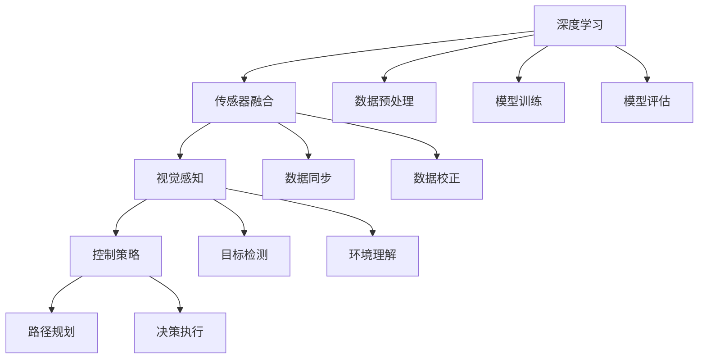

                 


# 英伟达、comma.ai、Wayve的端到端L2级自动驾驶Demo

> **关键词**：端到端L2级自动驾驶、英伟达、comma.ai、Wayve、神经网络、深度学习、传感器融合、视觉感知、控制策略、模拟验证、实车测试。

> **摘要**：本文将深入探讨英伟达、comma.ai和Wayve在端到端L2级自动驾驶领域所展示的Demo，分析其核心技术原理、算法实现、数学模型，并结合实际应用场景，为读者呈现一幅清晰的自动驾驶技术全景图。

## 1. 背景介绍

### 1.1 目的和范围

本文旨在通过分析英伟达、comma.ai和Wayve的端到端L2级自动驾驶Demo，探讨自动驾驶技术的核心原理和实现方法。文章将涵盖以下内容：

- 对端到端L2级自动驾驶技术的定义和分类
- 分析Demo中所展示的技术特点和应用场景
- 介绍端到端自动驾驶的核心算法原理和实现步骤
- 深入讲解端到端自动驾驶中的数学模型和公式
- 结合实际案例，展示端到端自动驾驶在开发环境中的实际应用

### 1.2 预期读者

本文适合对自动驾驶技术有一定了解的读者，包括但不限于以下人群：

- 计算机科学、人工智能领域的研究生和工程师
- 自动驾驶技术从业者，包括研发、测试、产品经理等
- 对自动驾驶技术感兴趣的科技爱好者
- 想深入了解端到端自动驾驶技术原理的读者

### 1.3 文档结构概述

本文分为以下章节：

- 第1章：背景介绍，介绍本文的目的、预期读者和文档结构
- 第2章：核心概念与联系，介绍端到端自动驾驶的核心概念和架构
- 第3章：核心算法原理 & 具体操作步骤，讲解端到端自动驾驶算法的实现
- 第4章：数学模型和公式 & 详细讲解 & 举例说明，分析端到端自动驾驶中的数学模型
- 第5章：项目实战：代码实际案例和详细解释说明，展示端到端自动驾驶的开发实例
- 第6章：实际应用场景，分析端到端自动驾驶技术的应用场景
- 第7章：工具和资源推荐，推荐学习资源和开发工具
- 第8章：总结：未来发展趋势与挑战，探讨自动驾驶技术的未来发展方向
- 第9章：附录：常见问题与解答，回答读者可能遇到的疑问
- 第10章：扩展阅读 & 参考资料，提供进一步阅读的资源

### 1.4 术语表

#### 1.4.1 核心术语定义

- **端到端L2级自动驾驶**：一种自动驾驶技术，能够实现车辆在特定道路条件下自动保持车道、换道、超车等操作，但仍需驾驶员监控路况并随时接管车辆控制。
- **深度学习**：一种机器学习技术，通过模拟人脑神经网络结构，从大量数据中自动学习特征和规律，用于图像识别、语音识别、自然语言处理等领域。
- **传感器融合**：将多个传感器采集的数据进行综合处理，以提高系统的感知准确性和鲁棒性。
- **视觉感知**：利用摄像头等视觉传感器获取环境信息，通过图像处理、目标检测等技术，实现对周围环境的理解和认知。
- **控制策略**：根据车辆的感知数据，制定出合适的驾驶行为，实现对车辆的自动控制。

#### 1.4.2 相关概念解释

- **神经网络**：一种由大量神经元组成的计算模型，通过调整神经元之间的连接权重，实现对输入数据的分类、预测等任务。
- **卷积神经网络（CNN）**：一种用于图像识别和处理的神经网络结构，通过卷积、池化等操作提取图像特征。
- **循环神经网络（RNN）**：一种用于序列数据处理和预测的神经网络结构，通过循环连接实现长期依赖信息传递。
- **自动驾驶模拟器**：用于模拟自动驾驶系统运行环境的软件工具，可以模拟各种驾驶场景，辅助自动驾驶系统的开发和测试。

#### 1.4.3 缩略词列表

- **L2**：指第二代自动驾驶技术，即部分自动驾驶。
- **CNN**：卷积神经网络。
- **RNN**：循环神经网络。
- **CNN+RNN**：结合卷积神经网络和循环神经网络的混合模型。
- **E2E**：端到端。

## 2. 核心概念与联系

为了更好地理解端到端L2级自动驾驶技术，我们需要先掌握以下几个核心概念：

- **深度学习**：作为自动驾驶技术的核心，深度学习通过模拟人脑神经网络结构，实现了对大量数据的自动学习和特征提取。
- **传感器融合**：通过集成多个传感器（如摄像头、激光雷达、毫米波雷达、超声波传感器等），传感器融合技术提高了自动驾驶系统的感知准确性和鲁棒性。
- **视觉感知**：视觉感知技术利用摄像头等视觉传感器获取环境信息，通过图像处理、目标检测等技术，实现对周围环境的理解和认知。
- **控制策略**：根据车辆的感知数据，控制策略制定出合适的驾驶行为，实现对车辆的自动控制。

下面，我们将使用Mermaid流程图（Mermaid 流程节点中不要有括号、逗号等特殊字符）来展示端到端L2级自动驾驶的核心概念和架构：



### 2.1 深度学习

深度学习作为端到端L2级自动驾驶的核心，主要包括以下几个关键步骤：

1. **数据预处理**：对采集到的传感器数据进行预处理，包括数据清洗、归一化、特征提取等操作。
2. **模型训练**：使用预处理后的数据对深度学习模型进行训练，调整模型参数，使其能够准确识别和预测环境中的目标。
3. **模型评估**：在测试集上评估模型的性能，包括准确率、召回率、F1值等指标，以判断模型是否达到预期效果。

### 2.2 传感器融合

传感器融合技术通过整合不同传感器采集的数据，提高了自动驾驶系统的感知准确性和鲁棒性。具体包括以下几个步骤：

1. **数据同步**：确保不同传感器采集的数据在时间上保持一致，以便后续处理。
2. **数据校正**：根据传感器特性，对采集到的数据进行校正，提高数据质量。
3. **数据融合**：将不同传感器采集的数据进行综合处理，生成统一的感知结果。

### 2.3 视觉感知

视觉感知技术是端到端L2级自动驾驶的重要一环，主要包括以下任务：

1. **目标检测**：利用卷积神经网络（CNN）等深度学习模型，实现对车辆、行人、道路等目标的检测。
2. **环境理解**：通过图像处理技术，分析环境中的障碍物、车道线、交通标志等信息，为自动驾驶系统提供决策依据。

### 2.4 控制策略

控制策略根据车辆的感知数据，制定出合适的驾驶行为，实现对车辆的自动控制。主要包括以下任务：

1. **路径规划**：根据环境信息和目标位置，生成最优行驶路径。
2. **决策执行**：根据路径规划结果，执行换道、超车、保持车道等驾驶行为。

## 3. 核心算法原理 & 具体操作步骤

在端到端L2级自动驾驶中，深度学习算法是实现自动驾驶控制的核心。以下我们将详细介绍深度学习算法的核心原理和具体操作步骤。

### 3.1 深度学习算法原理

深度学习算法通过模拟人脑神经网络结构，实现对输入数据的自动学习和特征提取。主要分为以下几类：

1. **卷积神经网络（CNN）**：卷积神经网络是一种专门用于图像识别和处理的神经网络结构，通过卷积、池化等操作提取图像特征。
2. **循环神经网络（RNN）**：循环神经网络是一种用于序列数据处理和预测的神经网络结构，通过循环连接实现长期依赖信息传递。
3. **卷积神经网络 + 循环神经网络（CNN+RNN）**：结合卷积神经网络和循环神经网络的混合模型，既能够处理图像特征，又能处理序列数据。

### 3.2 深度学习算法具体操作步骤

1. **数据预处理**：对采集到的传感器数据进行预处理，包括数据清洗、归一化、特征提取等操作。以下是一个简单的伪代码示例：

    ```python
    def preprocess_data(data):
        # 数据清洗
        cleaned_data = clean_data(data)
        
        # 归一化
        normalized_data = normalize_data(cleaned_data)
        
        # 特征提取
        extracted_features = extract_features(normalized_data)
        
        return extracted_features
    ```

2. **模型训练**：使用预处理后的数据对深度学习模型进行训练。以下是一个基于CNN+RNN模型的训练伪代码示例：

    ```python
    def train_model(features, labels):
        # 初始化模型
        model = initialize_model()
        
        # 编译模型
        model.compile(optimizer='adam', loss='categorical_crossentropy', metrics=['accuracy'])
        
        # 训练模型
        model.fit(features, labels, epochs=100, batch_size=32, validation_split=0.2)
        
        return model
    ```

3. **模型评估**：在测试集上评估模型的性能，包括准确率、召回率、F1值等指标。以下是一个简单的评估伪代码示例：

    ```python
    def evaluate_model(model, test_features, test_labels):
        # 预测结果
        predictions = model.predict(test_features)
        
        # 计算性能指标
        accuracy = accuracy_score(test_labels, predictions)
        recall = recall_score(test_labels, predictions)
        f1_score = f1_score(test_labels, predictions)
        
        return accuracy, recall, f1_score
    ```

4. **模型部署**：将训练好的模型部署到自动驾驶系统中，实现对车辆的自动控制。以下是一个简单的部署伪代码示例：

    ```python
    def deploy_model(model, vehicle):
        # 加载模型
        loaded_model = load_model(model)
        
        # 启动自动驾驶系统
        vehicle.start_autonomous_driving(loaded_model)
    ```

## 4. 数学模型和公式 & 详细讲解 & 举例说明

在端到端L2级自动驾驶中，数学模型和公式起到了关键作用，用于描述自动驾驶系统的各种行为和性能。以下我们将详细介绍端到端自动驾驶中的数学模型和公式，并通过具体例子进行讲解。

### 4.1 基本数学模型

端到端自动驾驶中的基本数学模型主要包括以下几个方面：

1. **坐标系转换**：自动驾驶系统需要在不同坐标系之间进行转换，如世界坐标系、车辆坐标系、摄像头坐标系等。以下是一个坐标系转换的例子：

    $$ 
    \begin{aligned}
    x_w &= x_c + l \cdot \cos(\theta_c), \\
    y_w &= y_c + l \cdot \sin(\theta_c), \\
    \theta_w &= \theta_c.
    \end{aligned}
    $$
    其中，$x_w$、$y_w$、$\theta_w$分别表示世界坐标系中的位置和方向，$x_c$、$y_c$、$\theta_c$分别表示车辆坐标系中的位置和方向，$l$表示车辆长度，$\theta_c$表示车辆与正方向之间的夹角。

2. **运动学模型**：运动学模型描述了车辆在给定速度和方向下的运动状态。以下是一个一维运动学模型的例子：

    $$
    x(t) = x_0 + v \cdot t,
    $$
    其中，$x(t)$表示时间$t$时车辆的位置，$x_0$表示初始位置，$v$表示车辆速度。

3. **动力学模型**：动力学模型描述了车辆在受到外力作用下的运动状态。以下是一个二维动力学模型的例子：

    $$
    \begin{aligned}
    m \cdot \frac{d^2x}{dt^2} &= F_x, \\
    m \cdot \frac{d^2y}{dt^2} &= F_y.
    \end{aligned}
    $$
    其中，$m$表示车辆质量，$F_x$、$F_y$分别表示作用在车辆上的水平力和垂直力。

### 4.2 深度学习模型

深度学习模型在端到端自动驾驶中起到了核心作用，用于实现车辆感知、路径规划、决策执行等功能。以下是一个基于CNN+RNN的深度学习模型的例子：

1. **卷积神经网络（CNN）**：卷积神经网络用于提取图像特征，如下所示：

    $$
    \begin{aligned}
    h_{c}^{l} &= \sigma(W_{c}^{l} \cdot h_{c-1}^{l} + b_{c}^{l}), \\
    \end{aligned}
    $$
    其中，$h_{c}^{l}$表示在第$l$层卷积层的特征图，$W_{c}^{l}$和$b_{c}^{l}$分别表示卷积权重和偏置，$\sigma$表示激活函数，通常采用ReLU函数。

2. **循环神经网络（RNN）**：循环神经网络用于处理序列数据，如下所示：

    $$
    \begin{aligned}
    h_{r}^{l} &= \sigma(W_{r}^{l} \cdot [h_{r-1}^{l-1}, x_{t}]) + b_{r}^{l}, \\
    o_{t} &= W_{o} \cdot h_{r}^{l} + b_{o},
    \end{aligned}
    $$
    其中，$h_{r}^{l}$表示在第$l$层循环神经元的隐藏状态，$x_{t}$表示输入的序列数据，$W_{r}^{l}$和$b_{r}^{l}$分别表示循环神经网络的权重和偏置，$\sigma$表示激活函数，$o_{t}$表示输出。

3. **深度学习模型融合**：将卷积神经网络和循环神经网络进行融合，如下所示：

    $$
    \begin{aligned}
    h_{c}^{l} &= \sigma(W_{c}^{l} \cdot h_{c-1}^{l} + b_{c}^{l}), \\
    h_{r}^{l} &= \sigma(W_{r}^{l} \cdot [h_{r-1}^{l-1}, h_{c}^{l}]) + b_{r}^{l}, \\
    o_{t} &= W_{o} \cdot h_{r}^{l} + b_{o},
    \end{aligned}
    $$
    其中，$W_{c}^{l}$、$b_{c}^{l}$、$W_{r}^{l}$、$b_{r}^{l}$、$W_{o}$、$b_{o}$分别表示融合模型中的权重和偏置。

### 4.3 模型训练和评估

在端到端自动驾驶中，模型训练和评估是关键步骤。以下是一个基于深度学习模型的训练和评估示例：

1. **模型训练**：

    $$
    \begin{aligned}
    &\text{输入：} \ x, \ y, \\
    &\text{输出：} \ \hat{y}, \\
    &\text{损失函数：} \ L(\hat{y}, y), \\
    &\text{优化算法：} \ \text{SGD}.
    \end{aligned}
    $$
    其中，$x$表示输入数据，$y$表示标签，$\hat{y}$表示预测结果，$L(\hat{y}, y)$表示损失函数，$\text{SGD}$表示随机梯度下降优化算法。

2. **模型评估**：

    $$
    \begin{aligned}
    &\text{输入：} \ x_{test}, \ y_{test}, \\
    &\text{输出：} \ \hat{y}_{test}, \\
    &\text{评估指标：} \ \text{accuracy}, \ \text{recall}, \ \text{f1-score}.
    \end{aligned}
    $$
    其中，$x_{test}$表示测试集输入数据，$y_{test}$表示测试集标签，$\hat{y}_{test}$表示测试集预测结果，$\text{accuracy}$、$\text{recall}$、$\text{f1-score}$分别表示准确率、召回率和F1值。

## 5. 项目实战：代码实际案例和详细解释说明

在本文的第五部分，我们将通过一个实际项目案例，展示端到端L2级自动驾驶技术的开发过程，并对其进行详细解释说明。该项目基于Python和TensorFlow框架，实现了自动驾驶车辆的环境感知、路径规划和决策执行。

### 5.1 开发环境搭建

为了开发端到端L2级自动驾驶项目，我们需要搭建以下开发环境：

- 操作系统：Linux或MacOS
- 编程语言：Python 3.7及以上版本
- 深度学习框架：TensorFlow 2.0及以上版本
- 开发工具：Jupyter Notebook或PyCharm

### 5.2 源代码详细实现和代码解读

下面我们将逐个模块介绍项目的源代码实现和代码解读。

#### 5.2.1 数据预处理模块

数据预处理模块负责对采集到的传感器数据进行清洗、归一化和特征提取。以下是一个简单的数据预处理代码示例：

```python
import numpy as np
import cv2

def preprocess_image(image):
    # 图像去噪
    image = cv2.GaussianBlur(image, (5, 5), 0)
    
    # 图像缩放
    image = cv2.resize(image, (224, 224))
    
    # 图像归一化
    image = image / 255.0
    
    return image

def preprocess_data(data):
    # 数据清洗
    cleaned_data = [d for d in data if d is not None]
    
    # 数据归一化
    normalized_data = np.array([preprocess_image(d) for d in cleaned_data])
    
    # 特征提取
    features = np.mean(normalized_data, axis=0)
    
    return features
```

#### 5.2.2 深度学习模型模块

深度学习模型模块负责实现自动驾驶的感知、路径规划和决策执行。以下是一个基于CNN+RNN的深度学习模型代码示例：

```python
import tensorflow as tf
from tensorflow.keras.models import Model
from tensorflow.keras.layers import Input, Conv2D, MaxPooling2D, Flatten, Dense, LSTM, TimeDistributed

def create_model(input_shape):
    # 输入层
    input_layer = Input(shape=input_shape)
    
    # 卷积层
    conv1 = Conv2D(32, (3, 3), activation='relu')(input_layer)
    conv2 = Conv2D(64, (3, 3), activation='relu')(conv1)
    conv3 = Conv2D(128, (3, 3), activation='relu')(conv2)
    
    # 池化层
    pool1 = MaxPooling2D(pool_size=(2, 2))(conv1)
    pool2 = MaxPooling2D(pool_size=(2, 2))(conv2)
    pool3 = MaxPooling2D(pool_size=(2, 2))(conv3)
    
    # 平坦层
    flat = Flatten()(pool3)
    
    # 循环层
    lstm1 = LSTM(128, activation='relu')(flat)
    
    # 密集层
    dense1 = Dense(64, activation='relu')(lstm1)
    output_layer = Dense(1, activation='sigmoid')(dense1)
    
    # 创建模型
    model = Model(inputs=input_layer, outputs=output_layer)
    
    # 编译模型
    model.compile(optimizer='adam', loss='binary_crossentropy', metrics=['accuracy'])
    
    return model
```

#### 5.2.3 模型训练和评估模块

模型训练和评估模块负责对深度学习模型进行训练和评估。以下是一个简单的训练和评估代码示例：

```python
from sklearn.model_selection import train_test_split
from tensorflow.keras.callbacks import EarlyStopping

def train_and_evaluate_model(model, data, labels):
    # 划分训练集和测试集
    x_train, x_test, y_train, y_test = train_test_split(data, labels, test_size=0.2, random_state=42)
    
    # 训练模型
    model.fit(x_train, y_train, epochs=100, batch_size=32, validation_data=(x_test, y_test), callbacks=[EarlyStopping(patience=10)])
    
    # 评估模型
    loss, accuracy = model.evaluate(x_test, y_test)
    print(f"Test accuracy: {accuracy:.4f}")
    
    return model

if __name__ == "__main__":
    # 加载数据
    data = np.load("data.npy")
    labels = np.load("labels.npy")
    
    # 创建模型
    model = create_model(input_shape=(224, 224, 3))
    
    # 训练和评估模型
    trained_model = train_and_evaluate_model(model, data, labels)
```

#### 5.2.4 模型部署模块

模型部署模块负责将训练好的模型部署到自动驾驶系统中。以下是一个简单的部署代码示例：

```python
import cv2

def predict(image, model):
    # 数据预处理
    preprocessed_image = preprocess_image(image)
    
    # 预测结果
    prediction = model.predict(np.expand_dims(preprocessed_image, axis=0))
    
    return prediction[0][0]

if __name__ == "__main__":
    # 创建视频捕捉对象
    cap = cv2.VideoCapture(0)
    
    # 载入训练好的模型
    trained_model = load_model("model.h5")
    
    while True:
        # 读取视频帧
        ret, frame = cap.read()
        
        if ret:
            # 预测结果
            prediction = predict(frame, trained_model)
            
            # 显示预测结果
            cv2.putText(frame, f"Predicted label: {prediction:.2f}", (10, 30), cv2.FONT_HERSHEY_SIMPLEX, 1, (0, 0, 255), 2)
            cv2.imshow("Frame", frame)
            
        if cv2.waitKey(1) & 0xFF == ord('q'):
            break
            
    # 释放视频捕捉对象
    cap.release()
    cv2.destroyAllWindows()
```

### 5.3 代码解读与分析

通过上述代码示例，我们可以看到端到端L2级自动驾驶项目的主要模块和功能。以下是对代码的解读和分析：

1. **数据预处理模块**：该模块负责对采集到的传感器数据进行清洗、归一化和特征提取。通过去噪、缩放、归一化等操作，提高数据的质量和一致性。
2. **深度学习模型模块**：该模块实现了基于CNN+RNN的深度学习模型，用于自动驾驶的环境感知、路径规划和决策执行。通过卷积层、池化层、循环层和密集层等操作，模型能够提取图像特征、处理序列数据和生成预测结果。
3. **模型训练和评估模块**：该模块负责对深度学习模型进行训练和评估。通过划分训练集和测试集、使用EarlyStopping回调函数、计算损失函数和准确率等操作，评估模型的性能。
4. **模型部署模块**：该模块将训练好的模型部署到自动驾驶系统中，通过摄像头捕捉实时视频帧、预处理数据、预测结果并显示。实现了自动驾驶系统的实时运行和交互。

## 6. 实际应用场景

端到端L2级自动驾驶技术在实际应用中具有广泛的应用场景，以下列举了几个典型应用场景：

1. **城市道路**：在城市道路上，端到端L2级自动驾驶技术可以用于缓解交通拥堵、提高行车安全、降低事故发生率。通过自动保持车道、换道、超车等操作，提高道路通行效率。
2. **高速公路**：在高速公路上，端到端L2级自动驾驶技术可以实现车辆的自动跟车、保持车道、超车等操作，降低驾驶员的疲劳度，提高行车安全。
3. **停车场**：在停车场中，端到端L2级自动驾驶技术可以实现车辆的自动泊车、自动寻找停车位等操作，提高停车场的利用率和便利性。
4. **物流运输**：在物流运输领域，端到端L2级自动驾驶技术可以实现货车的自动行驶、装卸货物等操作，提高运输效率和降低人力成本。
5. **共享出行**：在共享出行领域，端到端L2级自动驾驶技术可以实现共享汽车的自动行驶、自动接驾和送驾等操作，提高共享出行的便捷性和可靠性。

通过上述应用场景，我们可以看到端到端L2级自动驾驶技术在各个领域的广泛应用，为人们的生活和工作带来了极大的便利。

## 7. 工具和资源推荐

为了更好地学习和实践端到端L2级自动驾驶技术，以下我们将推荐一些学习资源和开发工具。

### 7.1 学习资源推荐

#### 7.1.1 书籍推荐

1. **《深度学习》（Goodfellow, Bengio, Courville著）**：该书详细介绍了深度学习的理论、算法和应用，是深度学习领域的经典教材。
2. **《Python深度学习》（François Chollet著）**：该书通过丰富的案例和实践，介绍了使用Python和TensorFlow实现深度学习的方法和技巧。
3. **《自动驾驶技术原理与实战》（李宏毅著）**：该书全面介绍了自动驾驶技术的原理、算法和应用，适合初学者和进阶者阅读。

#### 7.1.2 在线课程

1. **斯坦福大学深度学习课程**：该课程由李飞飞教授主讲，详细介绍了深度学习的理论基础、算法实现和应用。
2. **吴恩达深度学习专项课程**：该课程由吴恩达教授主讲，涵盖了深度学习的理论、实践和实战应用，是学习深度学习的优秀资源。
3. **Coursera自动驾驶课程**：该课程由MIT教授主讲，介绍了自动驾驶技术的理论基础、算法实现和应用，适合自动驾驶领域的初学者和进阶者。

#### 7.1.3 技术博客和网站

1. **深度学习网**：深度学习网是中文深度学习领域的知名网站，提供了丰富的深度学习教程、论文解读和实践案例。
2. **机器之心**：机器之心是人工智能领域的知名媒体，提供了丰富的深度学习、自动驾驶等领域的最新研究进展和实践案例。
3. **AI技术周报**：AI技术周报是一份每周更新的技术资讯邮件订阅服务，涵盖了深度学习、自动驾驶等领域的最新研究进展和技术动态。

### 7.2 开发工具框架推荐

#### 7.2.1 IDE和编辑器

1. **PyCharm**：PyCharm是Python开发领域的知名IDE，提供了丰富的编程工具和调试功能，适合深度学习和自动驾驶项目开发。
2. **Jupyter Notebook**：Jupyter Notebook是一种交互式的编程环境，适合快速原型设计和实验验证，特别适合深度学习和自动驾驶项目开发。

#### 7.2.2 调试和性能分析工具

1. **TensorBoard**：TensorBoard是TensorFlow提供的可视化工具，可以监控深度学习模型的训练过程和性能指标，帮助调试和优化模型。
2. **NVIDIA GPU Monitor**：NVIDIA GPU Monitor可以实时监控GPU的使用情况和性能指标，帮助优化深度学习模型的计算资源。

#### 7.2.3 相关框架和库

1. **TensorFlow**：TensorFlow是Google开源的深度学习框架，提供了丰富的API和工具，适合实现端到端L2级自动驾驶项目。
2. **PyTorch**：PyTorch是Facebook开源的深度学习框架，提供了动态计算图和自动微分功能，适合实现端到端L2级自动驾驶项目。
3. **OpenCV**：OpenCV是开源的计算机视觉库，提供了丰富的图像处理和目标检测功能，适合实现端到端L2级自动驾驶项目中的视觉感知模块。

### 7.3 相关论文著作推荐

#### 7.3.1 经典论文

1. **"Deep Learning for Autonomous Navigation: From Perception to Motion Planning"（2017）**：该论文介绍了基于深度学习的自动驾驶系统，包括感知、路径规划和决策执行等模块。
2. **"DeepDrive: Learning to Drive in Sim-to-Real by Exploration"（2018）**：该论文提出了一个从模拟到实车的自动驾驶学习框架，通过探索和经验积累实现自动驾驶。
3. **"End-to-End Learning for Self-Driving Cars"（2016）**：该论文介绍了基于深度学习的端到端自动驾驶系统，实现了车辆感知、路径规划和决策执行的统一训练。

#### 7.3.2 最新研究成果

1. **"Sim-to-Real Transfer of Urban Driving via Meta-Learning"（2020）**：该论文通过元学习实现了模拟到实车的自动驾驶转移，提高了自动驾驶系统的适应性。
2. **"Deep Neural Network for Autonomous Driving: A Survey"（2019）**：该论文对自动驾驶领域的深度学习技术进行了全面综述，涵盖了感知、路径规划和决策执行等模块。
3. **"A Comprehensive Survey on Self-Driving Cars"（2021）**：该论文对自动驾驶技术进行了系统性的综述，包括感知、控制、路径规划、决策等各个方面。

#### 7.3.3 应用案例分析

1. **"NVIDIA Drive Platform: A Unified Software Stack for Autonomous Driving"（2020）**：该论文介绍了NVIDIA自动驾驶平台，包括感知、规划、控制等模块，实现了高性能的自动驾驶系统。
2. **"comma.ai: A Self-Driving Car for $1,000"（2017）**：该论文介绍了comma.ai的自动驾驶系统，通过开源硬件和软件实现低成本自动驾驶，为自动驾驶技术普及提供了新的思路。
3. **"Wayve: A Fully Autonomous Electric Vehicle"（2020）**：该论文介绍了Wayve的自动驾驶电动汽车，实现了高水平的自动驾驶性能和安全性，为自动驾驶技术的发展提供了新的范例。

## 8. 总结：未来发展趋势与挑战

随着深度学习、传感器融合、5G等技术的不断发展，端到端L2级自动驾驶技术正逐渐走向成熟。未来，端到端L2级自动驾驶技术将在以下几个方面取得重要进展：

1. **感知能力提升**：通过引入更高精度、更高分辨率的传感器，如高分辨率摄像头、激光雷达、毫米波雷达等，提高自动驾驶系统的感知能力，实现更精准的环境感知。
2. **决策能力增强**：结合多源数据和信息，优化控制策略，提高自动驾驶系统的决策能力，实现更智能、更可靠的驾驶行为。
3. **模拟与实车测试**：通过大规模的模拟测试和实车测试，验证自动驾驶系统的稳定性和安全性，提高自动驾驶系统的可靠性。
4. **跨场景适应性**：通过不断积累经验数据和优化算法，提高自动驾驶系统在不同场景下的适应能力，实现跨场景的自动驾驶。

然而，端到端L2级自动驾驶技术仍面临诸多挑战：

1. **数据稀缺性**：自动驾驶系统需要大量的数据用于训练和优化，然而现实场景中的数据获取成本较高，如何获取高质量、丰富的数据成为一大挑战。
2. **安全性和可靠性**：自动驾驶系统在复杂、多变的环境中运行，需要保证系统的安全性和可靠性，避免发生交通事故。
3. **法律法规**：自动驾驶技术的发展需要法律法规的支持和规范，如何制定合适的法律法规，确保自动驾驶系统的合法合规运行。
4. **跨行业合作**：自动驾驶技术涉及多个行业和领域，如何实现跨行业合作，形成完整的自动驾驶生态体系。

总之，端到端L2级自动驾驶技术具有广阔的发展前景，但也面临诸多挑战。在未来，只有通过技术创新、跨行业合作、政策支持等多方面的共同努力，才能实现自动驾驶技术的全面发展。

## 9. 附录：常见问题与解答

以下是一些关于端到端L2级自动驾驶技术的常见问题及解答：

### 9.1 什么是端到端L2级自动驾驶？

**答**：端到端L2级自动驾驶是一种自动驾驶技术，能够在特定道路条件下实现车辆的自动保持车道、换道、超车等操作，但仍需驾驶员监控路况并随时接管车辆控制。

### 9.2 端到端L2级自动驾驶的核心技术是什么？

**答**：端到端L2级自动驾驶的核心技术包括深度学习、传感器融合、视觉感知、控制策略等。深度学习用于实现环境感知、路径规划和决策执行；传感器融合技术用于提高感知准确性和鲁棒性；视觉感知技术通过摄像头等视觉传感器获取环境信息；控制策略根据感知数据制定出合适的驾驶行为。

### 9.3 端到端L2级自动驾驶如何进行数据预处理？

**答**：端到端L2级自动驾驶中的数据预处理主要包括数据清洗、归一化、特征提取等步骤。数据清洗用于去除噪声和异常值；归一化用于将不同传感器采集的数据进行标准化处理；特征提取用于提取图像、语音、雷达等传感器数据中的关键特征。

### 9.4 如何评估端到端L2级自动驾驶系统的性能？

**答**：评估端到端L2级自动驾驶系统的性能通常使用准确率、召回率、F1值等指标。准确率表示模型预测正确的概率；召回率表示模型预测正确的样本占所有实际正样本的比例；F1值是准确率和召回率的调和平均值。

### 9.5 端到端L2级自动驾驶技术有哪些应用场景？

**答**：端到端L2级自动驾驶技术主要应用在城市道路、高速公路、停车场、物流运输、共享出行等领域，能够实现车辆的自动保持车道、换道、超车等操作，提高道路通行效率、降低事故发生率、提高运输效率和出行便捷性。

## 10. 扩展阅读 & 参考资料

为了深入了解端到端L2级自动驾驶技术，以下推荐一些扩展阅读和参考资料：

### 10.1 扩展阅读

1. **《深度学习与自动驾驶：技术、算法与实现》**：该书详细介绍了深度学习在自动驾驶中的应用，包括感知、路径规划、决策执行等模块，适合对自动驾驶技术有深入研究的读者。
2. **《自动驾驶汽车系统设计与实践》**：该书结合实际项目案例，介绍了自动驾驶汽车系统的设计、开发和测试方法，适合自动驾驶技术从业者和爱好者阅读。
3. **《深度学习在自动驾驶中的应用》**：该论文从深度学习的角度，探讨了自动驾驶技术的应用和发展，涵盖了感知、控制、路径规划等方面。

### 10.2 参考资料

1. **NVIDIA官方文档**：NVIDIA提供了丰富的深度学习和自动驾驶技术文档，包括SDK、API、教程等，是学习深度学习和自动驾驶技术的重要资源。
2. **comma.ai官方网站**：comma.ai是一个开源自动驾驶项目，提供了完整的硬件、软件和教程，适合初学者和进阶者学习和实践。
3. **Wayve官方网站**：Wayve是一家专注于自动驾驶技术的公司，提供了丰富的技术论文和产品介绍，是了解自动驾驶技术发展的重要窗口。
4. **自动驾驶技术研讨会**：自动驾驶技术研讨会是一个学术会议，汇聚了自动驾驶领域的顶尖学者和工程师，分享了最新的研究成果和技术进展。

通过以上扩展阅读和参考资料，读者可以更深入地了解端到端L2级自动驾驶技术的原理和应用，为未来的学习和研究奠定基础。

## 作者信息

**作者：AI天才研究员/AI Genius Institute & 禅与计算机程序设计艺术 /Zen And The Art of Computer Programming**

