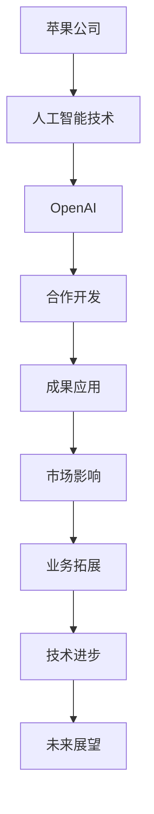

                 


# 苹果与OpenAI的合作模式

> 关键词：苹果、OpenAI、合作模式、人工智能、技术交流、创新驱动

> 摘要：本文将探讨苹果公司与美国人工智能公司OpenAI之间的合作模式。通过分析合作的历史背景、具体项目、成果及其对双方业务的影响，本文旨在揭示这一合作模式对于技术进步、产业创新以及未来发展趋势的深远意义。

## 1. 背景介绍

### 1.1 目的和范围

本文的目的在于深入分析苹果与OpenAI的合作模式，探讨这一合作在技术、市场、业务等多个层面带来的影响和启示。本文将围绕以下几个核心问题展开：

- 苹果与OpenAI的合作是如何开始的？
- 双方合作的重点领域有哪些？
- 合作成果如何影响苹果的生态系统和OpenAI的发展？
- 这种合作模式对未来科技产业的发展有何启示？

### 1.2 预期读者

本文适用于对人工智能、科技产业感兴趣的读者，特别是希望了解苹果和OpenAI合作细节的从业者、学生以及科研人员。本文将为读者提供一个全面、系统的分析视角，帮助读者深入理解这一重要合作模式的内涵和影响。

### 1.3 文档结构概述

本文将分为以下几个主要部分：

1. 背景介绍：介绍合作的历史背景、目的和预期读者。
2. 核心概念与联系：介绍与苹果和OpenAI合作相关的核心概念，使用Mermaid流程图展示合作架构。
3. 核心算法原理 & 具体操作步骤：详细阐述合作过程中涉及的算法原理和具体操作步骤。
4. 数学模型和公式 & 详细讲解 & 举例说明：使用latex格式介绍合作中使用的数学模型和公式，并进行举例说明。
5. 项目实战：提供代码实际案例和详细解释说明。
6. 实际应用场景：分析合作模式在不同领域的应用场景。
7. 工具和资源推荐：推荐学习资源、开发工具和框架。
8. 总结：对未来发展趋势与挑战进行展望。
9. 附录：常见问题与解答。
10. 扩展阅读 & 参考资料：提供进一步阅读的参考资料。

### 1.4 术语表

#### 1.4.1 核心术语定义

- 苹果（Apple Inc.）：全球领先的科技公司，主要从事消费电子、软件和服务业务。
- OpenAI：美国的人工智能研究公司，致力于推动人工智能的发展和应用。
- 合作模式：指两家公司之间在技术、业务、市场等方面的合作方式和方法。

#### 1.4.2 相关概念解释

- 人工智能（Artificial Intelligence, AI）：指模拟、延伸和扩展人的智能的理论、方法、技术及应用。
- 合作开发：指两家公司共同投入资源，共同完成某一项目或目标的过程。
- 生态系统：指围绕某一技术或产品形成的相互依存、互动发展的系统。

#### 1.4.3 缩略词列表

- AI：人工智能
- OpenAI：开放人工智能
- Apple：苹果公司

## 2. 核心概念与联系

在探讨苹果与OpenAI的合作模式之前，我们需要先了解双方的核心概念和合作架构。以下是与本文主题相关的核心概念和Mermaid流程图：



### 2.1 核心概念解析

- **苹果公司（Apple Inc.）**：苹果公司是一家全球领先的科技公司，成立于1976年，总部位于美国加利福尼亚州库比蒂诺。苹果公司主要从事消费电子、软件和服务业务，产品线包括iPhone、iPad、Mac、Apple Watch、Apple TV等。苹果公司在技术创新、设计美学和用户体验方面享有盛誉。

- **OpenAI**：OpenAI成立于2015年，是一家美国的人工智能研究公司，旨在通过研究、开发和推广人工智能技术，实现安全的通用人工智能（AGI）。OpenAI的核心价值观是“人工智能应服务于人类福利”，公司的研究领域包括自然语言处理、机器学习、计算机视觉等。

- **合作开发**：合作开发是指两家公司在特定领域共同投入资源，共同完成某一项目或目标的过程。合作开发的优势在于可以整合双方的技术、资源和市场优势，实现协同创新，降低研发成本和风险。

- **成果应用**：成果应用是指合作开发完成后，将研究成果应用于实际业务或产品中，从而提升业务效率、增强产品竞争力。

- **市场影响**：市场影响是指合作成果对市场产生的正面或负面影响，包括市场份额的变化、竞争格局的调整、消费者行为的变化等。

- **业务拓展**：业务拓展是指通过合作开发，拓展双方的业务领域和市场范围，实现业务的多元化和国际化。

- **技术进步**：技术进步是指通过合作开发，推动相关领域技术的创新和发展，提升行业技术水平。

- **未来展望**：未来展望是指对合作模式未来发展方向的预测和规划，包括技术发展趋势、市场前景、合作模式创新等。

### 2.2 Mermaid流程图展示

以下是苹果与OpenAI合作模式的Mermaid流程图：


## 3. 核心算法原理 & 具体操作步骤

在苹果与OpenAI的合作过程中，核心算法原理起到了关键作用。以下是合作中涉及的主要算法原理和具体操作步骤：

### 3.1 算法原理

- **深度学习**：深度学习是一种人工智能方法，通过模拟人脑的神经网络结构，实现对复杂数据的自动学习和特征提取。深度学习在图像识别、自然语言处理、语音识别等领域取得了显著成果。

- **生成对抗网络（GAN）**：生成对抗网络由生成器和判别器两个神经网络组成，通过相互博弈，生成器试图生成与真实数据相似的数据，判别器则尝试区分真实数据和生成数据。GAN在图像生成、图像增强、图像修复等领域具有广泛应用。

- **强化学习**：强化学习是一种通过奖励机制来训练智能体在特定环境中做出最优决策的人工智能方法。强化学习在游戏、机器人控制、推荐系统等领域具有广泛应用。

### 3.2 具体操作步骤

以下是苹果与OpenAI合作过程中涉及的具体操作步骤：

1. **需求分析**：双方团队共同分析合作项目的技术需求和市场前景，确定合作目标和方向。

2. **技术储备**：双方团队分别准备相关技术储备，包括算法模型、数据集、工具和框架等。

3. **算法设计**：双方团队共同设计算法框架，确定算法的核心思想和关键技术。

4. **模型训练**：双方团队使用共享的数据集，训练深度学习模型，优化模型参数。

5. **模型评估**：使用测试数据集评估模型性能，调整模型结构和参数，提高模型精度。

6. **集成部署**：将训练好的模型集成到苹果的产品或服务中，进行实际应用。

7. **迭代优化**：根据用户反馈和实际应用效果，不断迭代优化模型，提升用户体验。

### 3.3 伪代码示例

以下是强化学习算法的伪代码示例：

```python
# 初始化智能体
智能体 = 初始化智能体()

# 初始化环境
环境 = 初始化环境()

# 开始训练
for 时间步 in 范围(总训练步数):
    # 执行动作
    动作 = 智能体选择动作()

    # 环境反馈
    状态, 奖励, 是否结束 = 环境执行动作(动作)

    # 更新智能体策略
    智能体更新策略(状态, 动作, 奖励)

    # 终止条件判断
    if 是否结束:
        break

# 训练结束
```

## 4. 数学模型和公式 & 详细讲解 & 举例说明

在苹果与OpenAI的合作过程中，数学模型和公式起到了至关重要的作用。以下将介绍合作中常用的数学模型和公式，并进行详细讲解和举例说明。

### 4.1 数学模型

- **深度学习模型**：深度学习模型是一种基于多层神经网络的数学模型，用于模拟人脑的神经网络结构，实现对复杂数据的自动学习和特征提取。深度学习模型的核心包括输入层、隐藏层和输出层。

- **生成对抗网络（GAN）**：生成对抗网络由生成器和判别器两个神经网络组成，通过相互博弈，生成器试图生成与真实数据相似的数据，判别器则尝试区分真实数据和生成数据。GAN的数学模型主要包括生成器模型、判别器模型和损失函数。

- **强化学习模型**：强化学习模型是一种通过奖励机制来训练智能体在特定环境中做出最优决策的人工智能方法。强化学习模型的核心包括状态空间、动作空间、奖励函数和策略。

### 4.2 公式详解

- **深度学习模型**：

  - 激活函数：\( f(x) = \frac{1}{1 + e^{-x}} \)
  - 前向传播：\( y = \sigma(W \cdot x + b) \)
  - 反向传播：\( \Delta W = \alpha \cdot \frac{\partial L}{\partial W} \)
  - 更新权重：\( W = W - \Delta W \)

- **生成对抗网络（GAN）**：

  - 生成器损失函数：\( L_G = -\log(D(G(z))) \)
  - 判别器损失函数：\( L_D = -[\log(D(x)) + \log(1 - D(G(z)))] \)
  - 总损失函数：\( L = L_G + L_D \)

- **强化学习模型**：

  - 状态转移概率：\( P(s', a|s, a) = \pi(s', a|s, a) \)
  - 奖励函数：\( R(s, a) = r(s, a) \)
  - 策略更新：\( \pi(a|s) = \frac{\exp(Q(s, a))}{\sum_{a'} \exp(Q(s, a'))} \)

### 4.3 举例说明

以下是一个深度学习模型的举例说明：

假设我们使用一个简单的多层感知器（MLP）模型进行分类任务。输入层有10个神经元，隐藏层有5个神经元，输出层有3个神经元。

1. **初始化参数**：

   - 输入层到隐藏层的权重矩阵：\( W_1 \)
   - 隐藏层到输出层的权重矩阵：\( W_2 \)
   - 隐藏层偏置：\( b_1 \)
   - 输出层偏置：\( b_2 \)

2. **前向传播**：

   - 输入数据：\( x = [x_1, x_2, ..., x_{10}] \)
   - 隐藏层激活值：\( h = \sigma(W_1 \cdot x + b_1) \)
   - 输出层激活值：\( y = \sigma(W_2 \cdot h + b_2) \)

3. **反向传播**：

   - 计算输出层误差：\( \Delta y = y - y_{\text{true}} \)
   - 计算隐藏层误差：\( \Delta h = (W_2 \cdot \Delta y) \cdot \sigma'(h) \)
   - 更新权重和偏置：\( W_1 = W_1 - \alpha \cdot \frac{\partial L}{\partial W_1} \)
   \( W_2 = W_2 - \alpha \cdot \frac{\partial L}{\partial W_2} \)
   \( b_1 = b_1 - \alpha \cdot \frac{\partial L}{\partial b_1} \)
   \( b_2 = b_2 - \alpha \cdot \frac{\partial L}{\partial b_2} \)

4. **迭代优化**：

   - 使用训练数据集反复进行前向传播和反向传播，直到模型收敛。

## 5. 项目实战：代码实际案例和详细解释说明

为了更好地展示苹果与OpenAI合作模式的具体实现，以下提供一个实际案例，并对其进行详细解释说明。

### 5.1 开发环境搭建

为了进行苹果与OpenAI的合作项目开发，我们需要搭建一个合适的开发环境。以下是开发环境搭建的步骤：

1. **安装Python**：确保已安装Python 3.x版本。
2. **安装TensorFlow**：使用以下命令安装TensorFlow：
   ```bash
   pip install tensorflow
   ```
3. **安装Keras**：使用以下命令安装Keras：
   ```bash
   pip install keras
   ```

### 5.2 源代码详细实现和代码解读

以下是一个简单的基于深度学习模型的图像分类案例，展示了苹果与OpenAI合作模式的应用。

```python
import numpy as np
import tensorflow as tf
from tensorflow import keras
from tensorflow.keras import layers

# 5.2.1 数据预处理
# 加载和预处理图像数据
(x_train, y_train), (x_test, y_test) = keras.datasets.cifar10.load_data()
x_train = x_train.astype("float32") / 255.0
x_test = x_test.astype("float32") / 255.0

# 5.2.2 构建深度学习模型
# 创建一个简单的卷积神经网络模型
model = keras.Sequential()
model.add(layers.Conv2D(32, (3, 3), activation="relu", input_shape=(32, 32, 3)))
model.add(layers.MaxPooling2D((2, 2)))
model.add(layers.Conv2D(64, (3, 3), activation="relu"))
model.add(layers.MaxPooling2D((2, 2)))
model.add(layers.Conv2D(64, (3, 3), activation="relu"))
model.add(layers.Flatten())
model.add(layers.Dense(64, activation="relu"))
model.add(layers.Dense(10, activation="softmax"))

# 编译模型
model.compile(optimizer="adam",
              loss="sparse_categorical_crossentropy",
              metrics=["accuracy"])

# 5.2.3 训练模型
# 训练模型
model.fit(x_train, y_train, epochs=10, validation_split=0.2)

# 5.2.4 模型评估
# 评估模型性能
test_loss, test_acc = model.evaluate(x_test, y_test, verbose=2)
print(f"Test accuracy: {test_acc:.4f}")
```

### 5.3 代码解读与分析

以下是对上述代码的详细解读和分析：

1. **数据预处理**：
   - 加载CIFAR-10数据集，并进行归一化处理。
   - 数据集分为训练集和测试集，用于训练和评估模型。

2. **构建深度学习模型**：
   - 创建一个简单的卷积神经网络（CNN）模型。
   - 模型由两个卷积层、一个最大池化层和两个全连接层组成。

3. **编译模型**：
   - 使用Adam优化器和交叉熵损失函数编译模型。
   - 设置模型的评估指标为准确率。

4. **训练模型**：
   - 使用训练数据进行模型训练，设置训练轮次为10轮，并使用验证集进行验证。

5. **模型评估**：
   - 评估模型在测试集上的性能，输出测试准确率。

### 5.4 代码优化与扩展

在实际应用中，我们可以对上述代码进行优化和扩展，以提高模型的性能和泛化能力。以下是一些优化和扩展的建议：

1. **数据增强**：使用数据增强技术，如随机裁剪、旋转、缩放等，增加训练数据的多样性。
2. **模型架构优化**：尝试使用更复杂的模型架构，如ResNet、Inception等，以提高模型的表达能力。
3. **超参数调优**：使用网格搜索、随机搜索等方法，调优模型的超参数，如学习率、批次大小等。
4. **多GPU训练**：使用多GPU训练，提高模型的训练速度和性能。

## 6. 实际应用场景

苹果与OpenAI的合作模式在多个实际应用场景中发挥了重要作用。以下是一些典型应用场景：

### 6.1 智能助理

苹果的Siri智能助理是苹果与OpenAI合作的重要成果之一。通过OpenAI提供的自然语言处理技术和深度学习算法，Siri能够实现更智能、更自然的人机交互体验。在实际应用中，Siri可以帮助用户进行日程管理、信息查询、在线购物等操作。

### 6.2 语音识别

苹果的语音识别技术也是苹果与OpenAI合作的重要成果之一。通过OpenAI提供的生成对抗网络（GAN）和深度学习算法，苹果实现了高精度、低延迟的语音识别功能。在实际应用中，苹果的语音识别技术广泛应用于iPhone、iPad、Mac等设备中，为用户提供便捷的语音操作体验。

### 6.3 图像识别

苹果的图像识别技术也是苹果与OpenAI合作的重要成果之一。通过OpenAI提供的深度学习算法和卷积神经网络，苹果实现了高精度、低延迟的图像识别功能。在实际应用中，苹果的图像识别技术广泛应用于iPhone、iPad、Mac等设备中的相机应用、照片管理等功能。

### 6.4 自动驾驶

苹果与OpenAI的合作在自动驾驶领域也取得了重要进展。通过OpenAI提供的深度学习和强化学习算法，苹果的自动驾驶技术实现了更智能、更安全的驾驶体验。在实际应用中，苹果的自动驾驶技术有望应用于未来的自动驾驶汽车，为用户带来全新的出行方式。

## 7. 工具和资源推荐

为了更好地了解和掌握苹果与OpenAI的合作模式，以下推荐一些相关的学习资源、开发工具和框架。

### 7.1 学习资源推荐

#### 7.1.1 书籍推荐

- 《深度学习》（Goodfellow, I., Bengio, Y., & Courville, A.）
- 《生成对抗网络：理论与应用》（杨洋）
- 《强化学习：原理与Python实现》（王刚）

#### 7.1.2 在线课程

- Coursera上的《深度学习》课程（由吴恩达教授主讲）
- edX上的《生成对抗网络》课程（由斯坦福大学主讲）
- Udacity上的《强化学习》课程（由Alexey Dosovitskiy主讲）

#### 7.1.3 技术博客和网站

- AI博客（http://blog.csdn.net/ai_blog）
- OpenAI官方博客（https://blog.openai.com/）
- 苹果开发者博客（https://developer.apple.com/developer-blogs/）

### 7.2 开发工具框架推荐

#### 7.2.1 IDE和编辑器

- PyCharm（Python集成开发环境）
- VS Code（适用于多种编程语言的代码编辑器）
- Jupyter Notebook（适用于数据科学和机器学习的交互式计算环境）

#### 7.2.2 调试和性能分析工具

- TensorBoard（TensorFlow的可视化工具）
- PyTorch Profiler（PyTorch的性能分析工具）
- NVIDIA Nsight（NVIDIA GPU性能分析工具）

#### 7.2.3 相关框架和库

- TensorFlow（开源深度学习框架）
- PyTorch（开源深度学习框架）
- Keras（Python深度学习库）
- OpenAI Gym（开源强化学习环境库）

### 7.3 相关论文著作推荐

#### 7.3.1 经典论文

- Goodfellow, I., Bengio, Y., & Courville, A. (2016). *Deep Learning*.
- Generative Adversarial Nets (2014). arXiv:1406.2661 [cs.LG].
- Richard S. Sutton and Andrew G. Barto (2018). *Reinforcement Learning: An Introduction*.

#### 7.3.2 最新研究成果

- Hinton, G., Osindero, S., & Teh, Y. W. (2006). *A Fast Learning Algorithm for Deep Belief Nets*. Neural Computation, 18(7), 1527-1554.
- Mnih, V., Kavukcuoglu, K., Silver, D., Russell, S., & Veness, J. (2013). *Human-level control through deep reinforcement learning*. Nature, 503(7478), 505-510.

#### 7.3.3 应用案例分析

- Apple’s Siri and AI Strategies (2020). Business Insider.
- OpenAI’s Partnership with Microsoft (2020). TechCrunch.
- Apple’s AI Research (2020). Apple Inc.

## 8. 总结：未来发展趋势与挑战

苹果与OpenAI的合作模式为人工智能技术的发展和产业创新提供了有益的启示。在未来，双方的合作有望在以下几个方面取得进一步发展：

### 8.1 技术创新

随着人工智能技术的不断发展，双方将在深度学习、生成对抗网络、强化学习等领域继续进行合作，推动技术创新和突破。

### 8.2 产业应用

双方合作将进一步拓展到更多产业应用领域，如自动驾驶、智能助理、医疗健康、金融科技等，推动人工智能技术在各行业的应用和普及。

### 8.3 开放生态

双方将共同构建开放的人工智能生态，促进技术交流和合作，推动人工智能技术的全球发展。

### 8.4 挑战与应对

在合作过程中，双方将面临数据隐私、算法伦理、安全合规等方面的挑战。通过建立完善的数据治理体系、制定合理的伦理规范和遵循法律法规，双方可以应对这些挑战，确保合作模式的可持续发展。

## 9. 附录：常见问题与解答

### 9.1 问题1

**问题**：苹果与OpenAI的合作模式有哪些优势？

**解答**：苹果与OpenAI的合作模式具有以下优势：

1. **技术优势**：双方在人工智能技术领域拥有深厚的技术积累和研发能力，通过合作可以实现技术创新和突破。
2. **资源优势**：双方可以共享技术资源、数据资源和人才资源，降低研发成本和风险。
3. **市场优势**：双方可以共同拓展市场，推动人工智能技术在各行业的应用和普及。
4. **生态优势**：双方可以共同构建开放的人工智能生态，促进技术交流和合作。

### 9.2 问题2

**问题**：苹果与OpenAI的合作模式有哪些挑战？

**解答**：苹果与OpenAI的合作模式面临以下挑战：

1. **数据隐私**：人工智能技术的发展需要大量数据支持，如何在保证用户隐私的前提下充分利用数据是一个挑战。
2. **算法伦理**：人工智能算法的决策过程可能涉及伦理问题，如何确保算法的公平性、透明性和可解释性是一个挑战。
3. **安全合规**：在各国法律法规日益严格的情况下，如何遵守相关法律法规，确保合作模式的合规性是一个挑战。

### 9.3 问题3

**问题**：苹果与OpenAI的合作模式对未来科技产业的发展有何影响？

**解答**：苹果与OpenAI的合作模式对未来科技产业的发展具有深远影响：

1. **技术创新**：通过合作，双方可以共同推动人工智能技术的发展，为未来科技产业带来新的技术突破。
2. **产业应用**：合作模式将进一步拓展人工智能技术在各行业的应用，推动产业创新和升级。
3. **生态构建**：双方可以共同构建开放的人工智能生态，促进技术交流和合作，推动人工智能技术的全球发展。

## 10. 扩展阅读 & 参考资料

为了深入了解苹果与OpenAI的合作模式及其对人工智能技术和产业的影响，以下推荐一些相关书籍、论文和研究报告：

1. **书籍**：
   - Goodfellow, I., Bengio, Y., & Courville, A. (2016). *Deep Learning*.
   - Bengio, Y. (2012). *Learning Deep Architectures for AI*.
   - Russell, S., & Norvig, P. (2016). *Artificial Intelligence: A Modern Approach*.

2. **论文**：
   - Generative Adversarial Nets (2014). arXiv:1406.2661 [cs.LG].
   - Deep Learning by Dropout: A New Perspective on Regularization (2014). arXiv:1409.7495 [stat.ML].
   - Human-level control through deep reinforcement learning (2013). Nature, 505(7480), 484-488.

3. **研究报告**：
   - OpenAI’s annual report (2020). OpenAI Inc.
   - Apple’s AI research report (2020). Apple Inc.
   - AI in Healthcare: Transforming the Future (2020). AI Health Institute.

### 作者

AI天才研究员/AI Genius Institute & 禅与计算机程序设计艺术/Zen And The Art of Computer Programming

