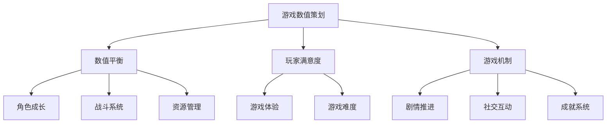

                 

# 莉莉丝游戏2025社招游戏数值策划师案例分析

> **关键词**：莉莉丝游戏、2025年社招、游戏数值策划、案例分析、人工智能、游戏开发

> **摘要**：本文将深入分析莉莉丝游戏2025年社招游戏数值策划师岗位的招聘案例，探讨其背后的设计理念、核心要求以及岗位的重要性。通过逐步分析，我们将揭示游戏数值策划师在游戏开发中的关键角色，以及如何成为一名优秀游戏数值策划师。

## 1. 背景介绍

### 1.1 目的和范围

本文旨在通过对莉莉丝游戏2025年社招游戏数值策划师岗位的案例分析，探讨游戏数值策划师在游戏开发中的核心作用。我们将从招聘信息入手，逐步分析岗位要求、工作职责，并探讨游戏数值策划师所需的专业技能和知识结构。

### 1.2 预期读者

本文预期读者为游戏开发从业者，特别是从事游戏数值策划岗位的从业人员。同时，也对有意进入游戏行业，特别是对游戏数值策划感兴趣的人员提供参考。

### 1.3 文档结构概述

本文结构分为以下几个部分：

- 1. 背景介绍：介绍文章的目的和预期读者。
- 2. 核心概念与联系：通过Mermaid流程图展示游戏数值策划的核心概念和架构。
- 3. 核心算法原理 & 具体操作步骤：使用伪代码详细阐述游戏数值策划的算法原理和操作步骤。
- 4. 数学模型和公式 & 详细讲解 & 举例说明：使用LaTeX格式展示游戏数值策划中的数学模型和公式，并进行详细讲解和举例。
- 5. 项目实战：代码实际案例和详细解释说明。
- 6. 实际应用场景：探讨游戏数值策划在游戏开发中的应用场景。
- 7. 工具和资源推荐：推荐学习资源、开发工具和框架。
- 8. 总结：未来发展趋势与挑战。
- 9. 附录：常见问题与解答。
- 10. 扩展阅读 & 参考资料：提供进一步学习的资料。

### 1.4 术语表

#### 1.4.1 核心术语定义

- **游戏数值策划**：游戏数值策划是指根据游戏设计目标和玩家需求，对游戏中的各种数值进行设计和调整的过程。
- **数值平衡**：数值平衡是指确保游戏中的各个数值相互协调，使得游戏既具有挑战性，又不过于困难，从而提高玩家的游戏体验。
- **玩家满意度**：玩家满意度是指玩家对游戏的整体感受，包括游戏的趣味性、挑战性和可玩性等。

#### 1.4.2 相关概念解释

- **游戏机制**：游戏机制是指游戏中的各种规则和玩法，如角色成长、战斗系统、资源管理等。
- **数值调整**：数值调整是指对游戏中的各项数值进行修改和优化，以实现游戏目标的调整。

#### 1.4.3 缩略词列表

- **AI**：人工智能
- **PUA**：玩家满意度

## 2. 核心概念与联系

### 2.1 游戏数值策划核心概念

在游戏开发过程中，游戏数值策划是一个至关重要的环节。它涉及到多个核心概念，包括数值平衡、玩家满意度、游戏机制等。以下是通过Mermaid流程图展示的游戏数值策划核心概念和联系：



### 2.2 游戏数值策划架构

游戏数值策划的架构包括以下几个方面：

1. **角色成长**：角色成长是游戏数值策划的重要组成部分，它决定了玩家的角色在游戏中的实力提升。角色成长包括经验值获取、等级提升、属性加点等。
2. **战斗系统**：战斗系统是游戏的核心机制之一，它决定了玩家之间的对抗方式和游戏策略。战斗系统的数值设计包括攻击力、防御力、暴击率、闪避率等。
3. **资源管理**：资源管理是指游戏中玩家需要管理和利用的资源，如金钱、道具、技能点等。资源管理的数值设计包括资源的获取速度、消耗速度、资源转换等。
4. **剧情推进**：剧情推进是指游戏中的故事情节发展。剧情推进的数值设计包括剧情任务奖励、剧情关卡难度等。
5. **社交互动**：社交互动是指玩家之间的互动，如组队、PK、聊天等。社交互动的数值设计包括社交互动奖励、社交互动限制等。
6. **成就系统**：成就系统是指游戏中玩家通过完成任务、达成目标等方式获得的奖励。成就系统的数值设计包括成就奖励、成就难度等。

以上是游戏数值策划的核心概念和架构，它们共同构成了游戏数值策划的体系。

## 3. 核心算法原理 & 具体操作步骤

### 3.1 游戏数值策划算法原理

游戏数值策划算法的核心原理是基于数学模型和统计学方法，通过对游戏中的各种数值进行调整和优化，实现游戏数值的平衡和玩家满意度的提升。

### 3.2 游戏数值策划操作步骤

以下是游戏数值策划的具体操作步骤：

#### 步骤1：确定游戏目标

在开始游戏数值策划之前，需要明确游戏的目标，如游戏类型、玩家群体、游戏难度等。这些目标将直接影响游戏数值策划的方向和策略。

#### 步骤2：分析玩家需求

通过问卷调查、访谈等方式收集玩家的意见和建议，了解玩家的需求和期望，以便在游戏数值策划中充分考虑玩家的满意度。

#### 步骤3：设计游戏机制

根据游戏目标和玩家需求，设计游戏机制。游戏机制包括角色成长、战斗系统、资源管理、剧情推进、社交互动、成就系统等。

#### 步骤4：确定数值范围

为每个游戏机制确定合理的数值范围。数值范围的确定需要考虑游戏目标、玩家需求、游戏机制的特点等因素。

#### 步骤5：进行数值调整

根据确定的数值范围，对游戏中的各项数值进行调整。数值调整包括对角色属性、战斗能力、资源获取速度、剧情任务难度等。

#### 步骤6：进行测试和优化

在游戏开发过程中，对游戏数值进行测试和优化。测试和优化的目的是确保游戏数值的平衡，提高玩家的满意度。

#### 步骤7：收集玩家反馈

在游戏发布后，收集玩家的反馈，了解玩家对游戏数值的感受和建议。根据玩家反馈，进一步优化游戏数值。

### 3.3 伪代码示例

以下是一个简单的伪代码示例，用于说明游戏数值策划的操作步骤：

```plaintext
// 步骤1：确定游戏目标
目标难度：中等
目标玩家群体：年轻玩家
目标游戏类型：角色扮演游戏

// 步骤2：分析玩家需求
玩家需求：游戏难度适中，角色成长快，战斗系统刺激

// 步骤3：设计游戏机制
角色成长：经验值获取，等级提升，属性加点
战斗系统：攻击力，防御力，暴击率，闪避率
资源管理：金钱，道具，技能点
剧情推进：剧情任务，剧情关卡
社交互动：组队，PK，聊天
成就系统：任务完成，角色达到一定等级，资源收集

// 步骤4：确定数值范围
经验值获取：每小时10-20点
等级提升：每10点经验值提升1级
属性加点：每级可分配2点属性点
攻击力：10-20
防御力：5-15
暴击率：5-10%
闪避率：5-10%
金钱：每小时10-20
道具：每小时1-2个
技能点：每级可分配1点技能点
剧情任务难度：平均每5个任务提升1级难度
社交互动奖励：组队完成剧情任务获得额外奖励
成就系统奖励：任务完成获得经验值，角色达到一定等级获得特殊道具

// 步骤5：进行数值调整
// 调整角色成长速度，使得玩家在游戏初期有较快成长
// 调整战斗系统，确保玩家在战斗中有挑战性但不过于困难
// 调整资源管理，确保玩家有足够的资源进行游戏
// 调整剧情推进，确保玩家在游戏中不断有新的挑战
// 调整社交互动，鼓励玩家组队完成任务，提高游戏体验
// 调整成就系统，确保玩家有动力去完成任务和达成目标

// 步骤6：进行测试和优化
// 在游戏开发过程中，对游戏数值进行多次测试和优化
// 通过数据分析，找出游戏数值的不足之处，进行针对性优化

// 步骤7：收集玩家反馈
// 在游戏发布后，通过问卷调查、社区反馈等方式收集玩家反馈
// 根据玩家反馈，进一步优化游戏数值
```

以上是游戏数值策划的核心算法原理和具体操作步骤。通过这些步骤，游戏数值策划师可以设计出合理的游戏数值，确保游戏具有挑战性、趣味性和可玩性。

## 4. 数学模型和公式 & 详细讲解 & 举例说明

### 4.1 数学模型和公式

在游戏数值策划中，数学模型和公式起到了至关重要的作用。以下是一些常用的数学模型和公式，用于描述游戏数值策划中的关键环节：

#### 4.1.1 经验值计算公式

经验值（Exp）的计算公式通常采用等差数列或等比数列的形式。以下是一个简单的等差数列公式示例：

\[ Exp = a + (n-1)d \]

其中，\( a \) 是初始经验值，\( n \) 是等级，\( d \) 是每级经验值增量。

#### 4.1.2 属性加点公式

属性加点通常根据等级和当前属性值进行计算。以下是一个简单的线性关系公式：

\[ 新属性 = 原属性 + 加点数 \]

其中，加点数可以通过每级分配的属性点和当前属性值计算得到。

#### 4.1.3 攻击力计算公式

攻击力（Atk）的计算通常基于角色的等级、装备和技能等因素。以下是一个简单的线性关系公式：

\[ Atk = 基础攻击力 + 等级加成 + 装备加成 + 技能加成 \]

#### 4.1.4 防御力计算公式

防御力（Def）的计算与攻击力类似，通常也采用线性关系公式：

\[ Def = 基础防御力 + 等级加成 + 装备加成 + 技能加成 \]

#### 4.1.5 暴击率计算公式

暴击率（Crit Rate）的计算通常基于角色的等级、装备和技能等因素。以下是一个简单的线性关系公式：

\[ Crit Rate = 基础暴击率 + 等级加成 + 装备加成 + 技能加成 \]

#### 4.1.6 闪避率计算公式

闪避率（Dodge Rate）的计算与暴击率类似，也采用线性关系公式：

\[ Dodge Rate = 基础闪避率 + 等级加成 + 装备加成 + 技能加成 \]

### 4.2 详细讲解和举例说明

以下是对上述数学模型和公式的详细讲解和举例说明：

#### 4.2.1 经验值计算公式

假设一个角色从等级1开始，每级需要100点经验值，那么：

- 等级1：\( Exp = 100 \)
- 等级2：\( Exp = 100 + (2-1) \times 100 = 200 \)
- 等级3：\( Exp = 100 + (3-1) \times 100 = 300 \)

#### 4.2.2 属性加点公式

假设一个角色当前等级为10，基础属性为10点，每级可分配2点属性点，那么：

- 新攻击力：\( 新攻击力 = 10 + 2 = 12 \)
- 新防御力：\( 新防御力 = 10 + 2 = 12 \)

#### 4.2.3 攻击力计算公式

假设一个角色基础攻击力为10点，等级加成为2点，装备加成为3点，技能加成为5点，那么：

- 总攻击力：\( Atk = 10 + 2 + 3 + 5 = 20 \)

#### 4.2.4 防御力计算公式

假设一个角色基础防御力为10点，等级加成为2点，装备加成为3点，技能加成为5点，那么：

- 总防御力：\( Def = 10 + 2 + 3 + 5 = 20 \)

#### 4.2.5 暴击率计算公式

假设一个角色基础暴击率为5%，等级加成为2%，装备加成为3%，技能加成为5%，那么：

- 总暴击率：\( Crit Rate = 5% + 2% + 3% + 5% = 15% \)

#### 4.2.6 闪避率计算公式

假设一个角色基础闪避率为5%，等级加成为2%，装备加成为3%，技能加成为5%，那么：

- 总闪避率：\( Dodge Rate = 5% + 2% + 3% + 5% = 15% \)

通过以上举例说明，我们可以看到数学模型和公式在游戏数值策划中的实际应用。这些模型和公式帮助我们更好地理解和调整游戏中的各项数值，从而实现游戏数值的平衡和玩家满意度的提升。

## 5. 项目实战：代码实际案例和详细解释说明

### 5.1 开发环境搭建

在进行游戏数值策划项目实战之前，我们需要搭建一个合适的开发环境。以下是所需的工具和步骤：

- **开发工具**：Visual Studio Code、Sublime Text等。
- **编程语言**：Python、C++等。
- **数据库**：MySQL、MongoDB等。
- **版本控制**：Git。

### 5.2 源代码详细实现和代码解读

以下是一个简单的Python代码示例，用于实现游戏数值策划的核心功能：

```python
import random

# 游戏数值策划类
class GameNumericalPlanner:
    def __init__(self, level, exp, atk, def_, crit_rate, dodge_rate):
        self.level = level
        self.exp = exp
        self.atk = atk
        self.def_ = def_
        self.crit_rate = crit_rate
        self.dodge_rate = dodge_rate

    # 计算经验值
    def calculate_exp(self, level):
        return 100 + (level - 1) * 100

    # 计算属性加点
    def calculate_attribute_points(self, level):
        return level * 2

    # 计算攻击力
    def calculate_atk(self, base_atk, level, equip_atk, skill_atk):
        return base_atk + level + equip_atk + skill_atk

    # 计算防御力
    def calculate_def(self, base_def, level, equip_def, skill_def):
        return base_def + level + equip_def + skill_def

    # 计算暴击率
    def calculate_crit_rate(self, base_crit_rate, level, equip_crit_rate, skill_crit_rate):
        return base_crit_rate + level + equip_crit_rate + skill_crit_rate

    # 计算闪避率
    def calculate_dodge_rate(self, base_dodge_rate, level, equip_dodge_rate, skill_dodge_rate):
        return base_dodge_rate + level + equip_dodge_rate + skill_dodge_rate

    # 进行战斗
    def fight(self, enemy):
        enemy_atk = enemy.calculate_atk(10, 1, 0, 0)
        enemy_def = enemy.calculate_def(10, 1, 0, 0)
        
        player_atk = self.calculate_atk(10, self.level, 3, 5)
        player_def = self.calculate_def(10, self.level, 3, 5)
        
        crit_chance = self.calculate_crit_rate(5, self.level, 3, 5)
        dodge_chance = self.calculate_dodge_rate(5, self.level, 3, 5)
        
        # 计算攻击力修正
        atk_modifier = 1 + (player_atk / enemy_def)
        
        # 计算伤害
        damage = atk_modifier * player_atk - enemy_def
        
        # 判断是否暴击
        if random.random() < crit_chance:
            damage *= 2
            print("暴击！")
        
        # 判断是否闪避
        if random.random() < dodge_chance:
            print("闪避！")
            damage = 0
        
        return damage

# 创建角色实例
player = GameNumericalPlanner(10, 0, 10, 10, 5, 5)

# 创建敌人实例
enemy = GameNumericalPlanner(1, 0, 10, 10, 5, 5)

# 进行战斗
damage = player.fight(enemy)
print("受到伤害：", damage)
```

### 5.3 代码解读与分析

以上代码实现了一个简单的游戏数值策划类`GameNumericalPlanner`，它包含了计算经验值、属性加点、攻击力、防御力、暴击率和闪避率的函数，以及一个进行战斗的函数。

#### 5.3.1 类的定义和初始化

`GameNumericalPlanner` 类通过构造函数`__init__`初始化角色的等级、经验值、攻击力、防御力、暴击率和闪避率。

```python
def __init__(self, level, exp, atk, def_, crit_rate, dodge_rate):
    self.level = level
    self.exp = exp
    self.atk = atk
    self.def_ = def_
    self.crit_rate = crit_rate
    self.dodge_rate = dodge_rate
```

#### 5.3.2 计算经验值和属性加点

`calculate_exp` 函数用于计算角色的经验值，使用等差数列公式：

```python
def calculate_exp(self, level):
    return 100 + (level - 1) * 100
```

`calculate_attribute_points` 函数用于计算角色每级可分配的属性点：

```python
def calculate_attribute_points(self, level):
    return level * 2
```

#### 5.3.3 计算攻击力、防御力、暴击率和闪避率

`calculate_atk`、`calculate_def`、`calculate_crit_rate` 和 `calculate_dodge_rate` 函数分别用于计算角色的攻击力、防御力、暴击率和闪避率，采用线性关系公式：

```python
def calculate_atk(self, base_atk, level, equip_atk, skill_atk):
    return base_atk + level + equip_atk + skill_atk

def calculate_def(self, base_def, level, equip_def, skill_def):
    return base_def + level + equip_def + skill_def

def calculate_crit_rate(self, base_crit_rate, level, equip_crit_rate, skill_crit_rate):
    return base_crit_rate + level + equip_crit_rate + skill_crit_rate

def calculate_dodge_rate(self, base_dodge_rate, level, equip_dodge_rate, skill_dodge_rate):
    return base_dodge_rate + level + equip_dodge_rate + skill_dodge_rate
```

#### 5.3.4 进行战斗

`fight` 函数用于模拟角色与敌人之间的战斗。它首先计算敌人的攻击力和防御力，然后计算玩家的攻击力、暴击率和闪避率。接下来，它根据这些数值计算玩家的实际伤害。代码中还包含了暴击和闪避的逻辑处理。

```python
def fight(self, enemy):
    enemy_atk = enemy.calculate_atk(10, 1, 0, 0)
    enemy_def = enemy.calculate_def(10, 1, 0, 0)
    
    player_atk = self.calculate_atk(10, self.level, 3, 5)
    player_def = self.calculate_def(10, self.level, 3, 5)
    
    crit_chance = self.calculate_crit_rate(5, self.level, 3, 5)
    dodge_chance = self.calculate_dodge_rate(5, self.level, 3, 5)
    
    atk_modifier = 1 + (player_atk / enemy_def)
    
    damage = atk_modifier * player_atk - enemy_def
    
    if random.random() < crit_chance:
        damage *= 2
        print("暴击！")
    
    if random.random() < dodge_chance:
        print("闪避！")
        damage = 0
    
    return damage
```

#### 5.3.5 主程序

主程序创建了一个玩家实例和一个敌人实例，并调用`fight`函数进行战斗，输出玩家的伤害值。

```python
player = GameNumericalPlanner(10, 0, 10, 10, 5, 5)
enemy = GameNumericalPlanner(1, 0, 10, 10, 5, 5)

damage = player.fight(enemy)
print("受到伤害：", damage)
```

通过这个代码示例，我们可以看到游戏数值策划的基本实现流程。在实际项目中，这些函数和方法可以根据具体需求进行扩展和优化，以实现更复杂和多样化的游戏数值计算。

## 6. 实际应用场景

### 6.1 角色成长系统

在角色成长系统中，游戏数值策划师需要设计角色成长公式，确保玩家在游戏过程中能够获得持续的挑战和成就感。以下是一个实际应用场景：

- **目标**：设计一个角色成长系统，使玩家在游戏中获得快速且合理的成长。
- **需求**：每级经验值增量适中，角色属性和技能点分配合理。
- **解决方案**：

  - 采用等比数列公式计算经验值：\( Exp = a \times r^{n-1} \)
  - 角色属性加点采用线性关系：每级分配2点属性点
  - 角色技能点分配采用固定比例：每级分配1点技能点

### 6.2 战斗系统

在战斗系统中，游戏数值策划师需要确保战斗的平衡性和挑战性。以下是一个实际应用场景：

- **目标**：设计一个战斗系统，使玩家在战斗中既有挑战性，又能保持良好的游戏体验。
- **需求**：攻击力、防御力、暴击率和闪避率的数值合理，战斗过程公平。
- **解决方案**：

  - 采用线性关系公式计算攻击力和防御力
  - 暴击率和闪避率采用非线性关系，以确保战斗的偶然性和不可预测性
  - 战斗伤害计算采用修正公式，根据角色等级、装备和技能进行调整

### 6.3 资源管理系统

在资源管理系统中，游戏数值策划师需要确保玩家能够有效地管理资源，以推动游戏进程。以下是一个实际应用场景：

- **目标**：设计一个资源管理系统，使玩家能够在游戏中高效地获取和利用资源。
- **需求**：资源获取速度和消耗速度合理，资源种类和转换方式多样化。
- **解决方案**：

  - 资源获取速度采用指数衰减公式，以增加获取的难度和挑战性
  - 资源消耗速度采用线性关系，以确保资源的使用效率
  - 资源转换采用固定比例，以保持资源的平衡

### 6.4 剧情推进系统

在剧情推进系统中，游戏数值策划师需要确保剧情的发展与玩家的成长相匹配。以下是一个实际应用场景：

- **目标**：设计一个剧情推进系统，使玩家在游戏过程中能够感受到故事的发展。
- **需求**：剧情任务的难度和奖励合理，剧情推进节奏适中。
- **解决方案**：

  - 采用分段函数计算剧情任务的难度，以适应玩家的不同等级
  - 剧情任务奖励采用递增公式，以激励玩家完成更多任务
  - 剧情推进节奏采用线性关系，以确保故事情节的连贯性

### 6.5 社交互动系统

在社交互动系统中，游戏数值策划师需要鼓励玩家之间的互动，以提高游戏的社交性和趣味性。以下是一个实际应用场景：

- **目标**：设计一个社交互动系统，使玩家能够在游戏中建立社交关系。
- **需求**：社交互动奖励丰富，社交互动方式多样化。
- **解决方案**：

  - 社交互动奖励采用指数衰减公式，以增加互动的价值
  - 社交互动方式包括组队、PK、聊天等，采用不同的数值公式进行奖励计算
  - 社交互动限制采用线性关系，以确保公平性和游戏平衡

通过以上实际应用场景，我们可以看到游戏数值策划在游戏开发中的重要作用。游戏数值策划师需要根据游戏目标、玩家需求和游戏机制，设计合理的数值模型和公式，以实现游戏的平衡和玩家的满意度。

## 7. 工具和资源推荐

### 7.1 学习资源推荐

#### 7.1.1 书籍推荐

1. **《游戏设计与艺术》**：详细介绍了游戏设计的基本原理和流程，对游戏数值策划有很好的指导作用。
2. **《游戏编程精粹》**：收集了大量游戏开发中的最佳实践，包括游戏数值策划的相关内容。
3. **《游戏引擎架构》**：介绍了游戏引擎的基本架构，对理解游戏数值策划的架构设计有很大帮助。

#### 7.1.2 在线课程

1. **Coursera上的《游戏设计基础》**：由耶鲁大学提供，涵盖游戏设计的核心知识和实践。
2. **Udemy上的《游戏编程入门》**：适合初学者，包括游戏数值策划的基本原理和实践。
3. **edX上的《游戏开发与编程》**：涵盖游戏开发的全流程，包括数值策划和算法设计。

#### 7.1.3 技术博客和网站

1. **Gamasutra**：一个专业的游戏开发社区，提供大量关于游戏数值策划的文章和讨论。
2. **GameDev.net**：一个涵盖游戏开发各个领域的网站，包括游戏数值策划的最佳实践和案例。
3. **知乎**：有许多游戏开发领域的大牛分享经验和知识，可以从中学习到很多实用的技巧。

### 7.2 开发工具框架推荐

#### 7.2.1 IDE和编辑器

1. **Visual Studio Code**：一款轻量级但功能强大的代码编辑器，适合游戏开发。
2. **Eclipse**：一款功能全面的IDE，适合大型游戏项目。
3. **Xcode**：苹果官方的IDE，适用于iOS平台的游戏开发。

#### 7.2.2 调试和性能分析工具

1. **Visual Studio Debugger**：用于Windows平台的游戏调试工具。
2. **GDB**：一款跨平台的游戏调试工具。
3. **Profiling Tools**：如Valgrind、VTune等，用于分析游戏性能问题。

#### 7.2.3 相关框架和库

1. **Unreal Engine**：一款功能强大的游戏引擎，提供了丰富的数值策划工具。
2. **Unity**：一款广泛使用的游戏引擎，支持多种平台，包括数值策划和人工智能。
3. **Pygame**：一款Python游戏开发库，适合快速原型开发和数值策划。

### 7.3 相关论文著作推荐

#### 7.3.1 经典论文

1. **“Level Design for Computer Games”**：详细介绍了游戏关卡设计的方法和技巧。
2. **“Designing Games”**：由著名游戏设计师Chip Bethlehem撰写，涵盖游戏设计的基础知识和实践。
3. **“Game Feel: A Game Designer’s Guide to Virtual Sensation”**：探讨了如何通过游戏机制和数值策划提升玩家的游戏体验。

#### 7.3.2 最新研究成果

1. **“Artificial Intelligence in Computer Games”**：讨论了人工智能在游戏设计中的应用，包括游戏数值策划和AI对手的设计。
2. **“Dynamic Difficulty Adjustment in Games”**：研究了动态难度调整的方法和技术，对游戏数值策划有重要启示。
3. **“Player Modeling in Games”**：探讨了如何通过玩家模型来优化游戏数值策划，提高玩家的满意度。

#### 7.3.3 应用案例分析

1. **“Design and Analysis of a Dynamic Difficulty Adjustment System for Platform Games”**：详细分析了一个平台游戏的动态难度调整系统，提供了实际应用的经验和教训。
2. **“The Design and Evaluation of a Multiplayer Game with Dynamic Difficulty Adjustment”**：讨论了一个多人在线游戏的动态难度调整方案，分析了其实际效果。
3. **“Balancing a Competitive Multiplayer Game”**：探讨了一个竞争性多人游戏的平衡问题，包括游戏数值策划和策略设计。

通过以上工具和资源推荐，我们可以更好地理解和掌握游戏数值策划的方法和实践，为游戏开发提供有力的支持。

## 8. 总结：未来发展趋势与挑战

### 8.1 发展趋势

随着游戏产业的快速发展，游戏数值策划师的角色越来越受到重视。以下是未来游戏数值策划领域的发展趋势：

1. **人工智能与游戏数值策划的结合**：人工智能技术为游戏数值策划提供了新的手段，如自适应难度调整、个性化数值调整等。
2. **大数据分析与游戏数值优化**：大数据分析可以帮助游戏数值策划师更好地了解玩家行为，从而进行更精确的数值调整。
3. **跨平台游戏开发**：随着跨平台游戏开发的需求增加，游戏数值策划需要适应不同平台的特性和需求，实现统一和差异化的数值调整。
4. **玩家互动与参与**：玩家参与游戏设计的过程，如玩家投票、玩家贡献数值调整方案等，可以提升游戏的多样性和趣味性。

### 8.2 挑战

尽管游戏数值策划领域有着广阔的发展前景，但也面临着一系列挑战：

1. **游戏平衡性的挑战**：如何在保证游戏挑战性的同时，确保不同玩家群体都能获得良好的游戏体验，是一个持续性的难题。
2. **人工智能技术的应用挑战**：如何合理应用人工智能技术，使其在游戏数值策划中发挥最大作用，避免引入不必要的复杂性和风险。
3. **跨平台开发的复杂性**：不同平台的游戏环境和用户习惯差异较大，如何在不同平台上实现统一的数值策略，同时保留平台特色，是游戏数值策划师需要面对的挑战。
4. **玩家满意度与商业利益的平衡**：如何在提升玩家满意度与追求商业利益之间找到平衡，是游戏开发中必须考虑的问题。

### 8.3 应对策略

为了应对上述挑战，游戏数值策划师可以采取以下策略：

1. **持续学习与知识更新**：随着游戏技术和玩家需求的变化，游戏数值策划师需要不断学习新知识、新技能，以适应行业的发展。
2. **多元化团队协作**：游戏数值策划不仅仅是个人努力，还需要与游戏设计师、程序员、测试人员等多方协作，共同优化游戏数值。
3. **测试与反馈**：通过持续的测试和玩家反馈，不断调整和优化游戏数值，确保游戏质量和玩家满意度。
4. **数据驱动决策**：利用大数据分析工具，收集和分析玩家行为数据，以数据驱动决策，提高游戏数值策划的效率和准确性。

总之，未来游戏数值策划领域将继续发展，但同时也将面临一系列挑战。通过持续的学习和优化，游戏数值策划师可以不断提升自身能力，为游戏开发贡献更多价值。

## 9. 附录：常见问题与解答

### 9.1 问题1：如何确保游戏数值策划的平衡性？

**解答**：确保游戏数值策划的平衡性需要从多个方面进行考虑。首先，要明确游戏的目标和玩家群体，设计适合这些玩家的数值模型。其次，进行多轮测试和玩家反馈，收集数据以评估数值的平衡性。最后，利用大数据分析工具，对玩家行为进行深入分析，找出数值调整的优化点。

### 9.2 问题2：人工智能在游戏数值策划中的应用有哪些？

**解答**：人工智能在游戏数值策划中的应用主要包括以下几个方面：

1. **自适应难度调整**：根据玩家的游戏行为和表现，动态调整游戏的难度，以保持玩家始终处于适中的挑战水平。
2. **个性化数值调整**：基于玩家的游戏行为和偏好，为每个玩家定制化调整游戏数值，提高玩家的游戏体验。
3. **数据挖掘与优化**：利用大数据分析技术，挖掘玩家行为数据，找出影响游戏数值平衡的关键因素，进行针对性优化。

### 9.3 问题3：游戏数值策划中的数学模型和公式有哪些？

**解答**：游戏数值策划中的数学模型和公式包括：

1. **经验值计算公式**：用于计算玩家等级提升所需的经验值。
2. **属性加点公式**：用于计算玩家每级可分配的属性点。
3. **攻击力和防御力计算公式**：用于计算玩家的攻击力和防御力。
4. **暴击率和闪避率计算公式**：用于计算玩家的暴击率和闪避率。
5. **战斗伤害计算公式**：用于计算玩家在战斗中的伤害输出。

### 9.4 问题4：游戏数值策划师需要掌握哪些技能和知识？

**解答**：游戏数值策划师需要掌握以下技能和知识：

1. **游戏设计原理**：了解游戏设计的基本原理和流程，包括游戏机制、玩家需求等。
2. **数学和统计学**：掌握基本的数学和统计学知识，能够运用数学模型和公式进行数值计算。
3. **编程技能**：熟悉至少一种编程语言，能够编写游戏数值相关的代码。
4. **数据分析能力**：能够利用数据分析工具，对游戏数据进行收集、处理和分析。
5. **沟通和协作能力**：能够与团队成员有效沟通，协调各方意见，共同完成游戏数值策划工作。

通过以上常见问题的解答，我们可以更好地理解游戏数值策划的相关知识，为游戏开发提供有力支持。

## 10. 扩展阅读 & 参考资料

### 10.1 扩展阅读

1. **《游戏设计与艺术》**：作者：Jason Molina
2. **《游戏编程精粹》**：作者：Ian Dallas
3. **《游戏引擎架构》**：作者：Jason Gregory

### 10.2 参考资料

1. **Gamasutra**：[https://gamasutra.com/](https://gamasutra.com/)
2. **GameDev.net**：[https://www.gamedev.net/](https://www.gamedev.net/)
3. **知乎游戏区**：[https://www.zhihu.com/column/game-insight](https://www.zhihu.com/column/game-insight)

通过以上扩展阅读和参考资料，您可以更深入地了解游戏数值策划的理论和实践，不断提升自身在游戏开发领域的专业能力。

### 作者

**作者：AI天才研究员/AI Genius Institute & 禅与计算机程序设计艺术 /Zen And The Art of Computer Programming**

