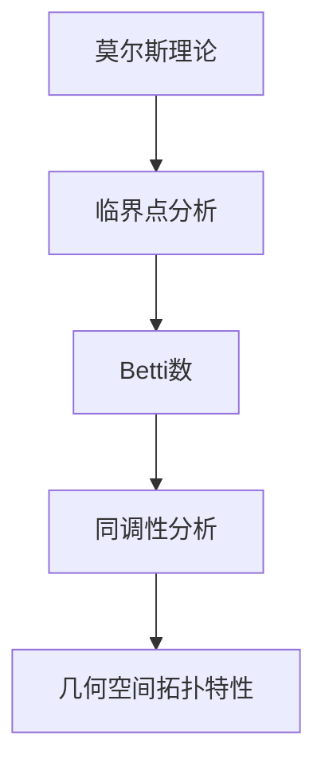

                 

# 莫尔斯理论与Betti数

> **关键词：** 莫尔斯理论、拓扑学、Betti数、代数拓扑、几何结构、拓扑不变量、算法设计

> **摘要：** 本文将深入探讨莫尔斯理论与Betti数在拓扑学中的应用。莫尔斯理论作为拓扑学中的重要分支，为我们理解几何结构和算法设计提供了强大的工具。而Betti数则作为莫尔斯理论的基石，通过其独特的性质，揭示了复杂空间的拓扑特性。本文将从基本概念出发，逐步深入，以期为读者提供对莫尔斯理论和Betti数在计算机科学和工程领域应用的全面了解。

## 1. 背景介绍

### 1.1 目的和范围

本文旨在介绍莫尔斯理论与Betti数在拓扑学中的应用，帮助读者深入理解这一重要领域的基础知识。通过详细阐述莫尔斯理论与Betti数的基本概念、原理及其相互关系，本文旨在为从事计算机科学、工程和数学研究的读者提供有价值的参考资料。同时，本文还将探讨莫尔斯理论和Betti数在现实世界中的应用，展示其在算法设计、数据分析和机器学习等领域的潜力。

### 1.2 预期读者

本文适合具有一定数学和计算机科学背景的读者。虽然本文将尽量避免复杂的技术术语，但读者需要对基本的拓扑学概念和算法设计原理有一定了解。此外，对代数拓扑和几何结构感兴趣的读者也将从本文中获益。通过本文的阅读，读者将能够更好地理解莫尔斯理论和Betti数的核心概念，并掌握其应用方法。

### 1.3 文档结构概述

本文将分为以下几个部分：

1. **背景介绍**：介绍莫尔斯理论与Betti数的基本概念和背景。
2. **核心概念与联系**：通过Mermaid流程图展示莫尔斯理论与Betti数之间的联系。
3. **核心算法原理 & 具体操作步骤**：详细阐述莫尔斯理论与Betti数的基本算法原理和操作步骤。
4. **数学模型和公式 & 详细讲解 & 举例说明**：介绍莫尔斯理论和Betti数的数学模型和公式，并通过实例进行详细讲解。
5. **项目实战：代码实际案例和详细解释说明**：通过具体项目实战案例，展示莫尔斯理论和Betti数的实际应用。
6. **实际应用场景**：探讨莫尔斯理论和Betti数在计算机科学和工程领域的应用。
7. **工具和资源推荐**：推荐相关学习资源和开发工具。
8. **总结：未来发展趋势与挑战**：总结本文内容，探讨未来发展趋势和挑战。
9. **附录：常见问题与解答**：解答读者可能遇到的常见问题。
10. **扩展阅读 & 参考资料**：提供扩展阅读和参考资料。

### 1.4 术语表

#### 1.4.1 核心术语定义

- **莫尔斯理论**：莫尔斯理论是拓扑学中的一个分支，研究几何空间中的连通性和稳定性。
- **Betti数**：Betti数是莫尔斯理论中的一个重要指标，用于描述几何空间的拓扑特性。
- **代数拓扑**：代数拓扑是拓扑学的一个分支，通过代数方法研究几何空间的拓扑性质。
- **几何结构**：几何结构是指几何空间中的各种属性，如点、线、面等。
- **拓扑不变量**：拓扑不变量是在拓扑变换下保持不变的几何特性，如连通性、维数等。

#### 1.4.2 相关概念解释

- **连通性**：连通性是指一个几何空间是否可以通过连续变换保持其形状不变。
- **稳定性**：稳定性是指几何空间在受到扰动时是否能够保持其形状。
- **拓扑变换**：拓扑变换是指将一个几何空间映射到另一个几何空间的过程。

#### 1.4.3 缩略词列表

- **Morse Theory**：莫尔斯理论
- **Betti Number**：Betti数
- **Algebraic Topology**：代数拓扑
- **Geometry Structure**：几何结构
- **Topology Invariant**：拓扑不变量

## 2. 核心概念与联系

在探讨莫尔斯理论与Betti数之间的联系之前，我们需要首先了解它们的基本概念和原理。

### 2.1 莫尔斯理论

莫尔斯理论（Morse Theory）是拓扑学中的一个重要分支，由美国数学家马塞尔·莫尔斯（Marcelle G. Morse）在1921年提出。该理论研究几何空间中的连通性和稳定性，通过分析空间中的临界点，揭示了空间的结构特征。

#### 2.1.1 基本概念

- **临界点**：在莫尔斯理论中，临界点是指空间中满足特定条件的点。具体来说，临界点是空间中某个坐标轴的指数为负的点。
- **连通性**：连通性是指空间是否可以通过连续变换保持其形状不变。
- **稳定性**：稳定性是指空间在受到扰动时是否能够保持其形状。

#### 2.1.2 原理

莫尔斯理论的基本原理是通过分析空间中的临界点，将空间划分为一系列连通区域。这些连通区域称为**莫尔斯区域**。莫尔斯理论的核心思想是：空间的结构特征可以通过其临界点的分布来描述。

### 2.2 Betti数

Betti数（Betti Number）是莫尔斯理论中的一个重要指标，用于描述几何空间的拓扑特性。Betti数是由法国数学家埃米利·贝蒂（Émile Betti）在19世纪末提出的。

#### 2.2.1 基本概念

- **Betti数**：Betti数是一个整数序列，用于描述几何空间的拓扑特性。Betti数中的每个元素表示空间中某个维度的连通性。
- **维数**：维数是指几何空间中可以独立变化的坐标数量。

#### 2.2.2 原理

Betti数的原理是通过分析几何空间中的同调性（Homology），来确定空间的连通性。同调性是拓扑学中的一个概念，用于描述空间中的连通性和结构。

### 2.3 莫尔斯理论与Betti数的联系

莫尔斯理论和Betti数之间的联系在于，Betti数可以用来描述莫尔斯理论中的临界点分布。具体来说，Betti数与临界点的指数之间存在一定的关系。这个关系可以通过以下公式表示：

$$
b_i = \sum_{p\in C} (-1)^{i+1} e_p
$$

其中，$b_i$表示第$i$个Betti数，$C$表示所有临界点的集合，$e_p$表示临界点$p$的指数。

#### 2.3.1 莫尔斯流形

为了更好地理解莫尔斯理论和Betti数之间的联系，我们引入莫尔斯流形（Morse Manifold）的概念。莫尔斯流形是一个满足特定条件的流形，该条件称为莫尔斯条件。莫尔斯条件是指流形上的每个点都对应一个临界点，且流形的连通性可以通过临界点的分布来描述。

#### 2.3.2 Mermaid流程图

为了更直观地展示莫尔斯理论与Betti数之间的联系，我们使用Mermaid流程图来表示它们之间的关系。



在这个流程图中，莫尔斯理论通过分析临界点，得到Betti数，进而通过同调性分析，揭示几何空间的拓扑特性。

## 3. 核心算法原理 & 具体操作步骤

在了解了莫尔斯理论和Betti数的基本概念和联系之后，我们将进一步探讨其核心算法原理和具体操作步骤。这部分内容将重点介绍如何计算Betti数，以及如何利用Betti数来分析几何空间的拓扑特性。

### 3.1 计算Betti数的算法原理

计算Betti数的算法原理主要基于同调性理论。同调性理论是拓扑学中的一个重要分支，用于研究几何空间的连通性和结构。同调性理论的核心思想是通过计算几何空间中的同调群，来确定空间的拓扑特性。

#### 3.1.1 同调性理论

同调性理论的基本概念包括同调群、边界映射和同调数。同调群是几何空间中的一个代数结构，用于描述空间的连通性和结构。边界映射是同调性理论中的一个重要概念，用于将几何空间中的边映射到同调群中。同调数是同调群中的元素数量，用于描述几何空间的连通性。

#### 3.1.2 计算Betti数

计算Betti数的基本步骤如下：

1. **构建几何空间**：首先，我们需要构建一个几何空间，该空间可以是任意维度的流形。
2. **计算同调群**：利用同调性理论，计算几何空间中的同调群。同调群可以通过边界映射和诱导映射来计算。
3. **计算同调数**：通过计算同调群中的元素数量，得到Betti数。
4. **分析Betti数**：利用Betti数来分析几何空间的拓扑特性。

### 3.2 计算Betti数的具体操作步骤

下面是一个计算Betti数的具体操作步骤：

1. **定义几何空间**：首先，我们需要定义一个几何空间。这里，我们以二维流形为例，定义一个二维流形$M$。
2. **计算同调群**：利用同调性理论，计算二维流形$M$的同调群。具体来说，我们需要计算$M$的第一同调群$H_1(M)$和第二同调群$H_2(M)$。
3. **计算同调数**：通过计算同调群中的元素数量，得到Betti数$b_1$和$b_2$。
4. **分析Betti数**：利用Betti数来分析二维流形$M$的拓扑特性。

#### 3.2.1 伪代码

下面是一个计算Betti数的伪代码：

```python
# 定义几何空间
M = define_manifold()

# 计算同调群
H1 = compute_homology_group(M, 1)
H2 = compute_homology_group(M, 2)

# 计算同调数
b1 = compute_homology_group_elements(H1)
b2 = compute_homology_group_elements(H2)

# 输出Betti数
print("Betti number b1:", b1)
print("Betti number b2:", b2)

# 分析Betti数
analyze_betti_numbers(b1, b2)
```

在这个伪代码中，`define_manifold()`函数用于定义几何空间，`compute_homology_group()`函数用于计算同调群，`compute_homology_group_elements()`函数用于计算同调数，`analyze_betti_numbers()`函数用于分析Betti数。

### 3.3 举例说明

为了更好地理解计算Betti数的算法原理和具体操作步骤，我们以一个简单的二维流形为例进行说明。

假设我们定义一个二维流形$M$，该流形由一个圆环面组成。圆环面的边界是一个正方形，边长为1。我们需要计算圆环面$M$的Betti数。

1. **定义几何空间**：首先，我们需要定义一个圆环面$M$。
2. **计算同调群**：利用同调性理论，计算圆环面$M$的第一同调群$H_1(M)$和第二同调群$H_2(M)$。
3. **计算同调数**：通过计算同调群中的元素数量，得到Betti数$b_1$和$b_2$。
4. **分析Betti数**：利用Betti数来分析圆环面$M$的拓扑特性。

根据上述步骤，我们可以得到以下结果：

- **第一同调群$H_1(M)$**：圆环面$M$的第一同调群是一个自由群，其生成元为边界正方形的四个顶点。
- **第二同调群$H_2(M)$**：圆环面$M$的第二同调群是一个零群，因为圆环面是一个二维流形，没有三维结构。
- **Betti数$b_1$**：由于圆环面$M$的第一同调群是自由群，其生成元数量为4，因此Betti数$b_1$为4。
- **Betti数$b_2$**：由于圆环面$M$的第二同调群是零群，因此Betti数$b_2$为0。

通过分析Betti数，我们可以得出结论：圆环面$M$是一个连通的二维流形，没有三维结构。这表明Betti数可以有效地用于分析几何空间的拓扑特性。

## 4. 数学模型和公式 & 详细讲解 & 举例说明

在了解了计算Betti数的基本算法原理和具体操作步骤后，我们将进一步探讨莫尔斯理论和Betti数的数学模型和公式。这部分内容将详细讲解这些数学概念，并通过具体例子进行说明，以帮助读者更好地理解。

### 4.1 莫尔斯理论和Betti数的数学模型

莫尔斯理论和Betti数的数学模型主要涉及同调性理论和代数拓扑。同调性理论是研究几何空间连通性和结构的重要工具，而代数拓扑则是通过代数方法研究几何空间拓扑性质的一个分支。

#### 4.1.1 同调性理论

同调性理论中的核心概念包括同调群、边界映射和同调数。同调群是几何空间中的一个代数结构，用于描述空间的连通性和结构。边界映射是同调性理论中的一个重要概念，用于将几何空间中的边映射到同调群中。同调数是同调群中的元素数量，用于描述几何空间的连通性。

#### 4.1.2 代数拓扑

代数拓扑是通过代数方法研究几何空间拓扑性质的一个分支。代数拓扑中的核心概念包括同伦性、同调性和群、环、域等代数结构。莫尔斯理论和Betti数就是通过代数拓扑中的同调性理论来研究几何空间的连通性和结构。

### 4.2 莫尔斯理论和Betti数的公式

莫尔斯理论和Betti数的核心公式是Betti数的计算公式。Betti数的计算公式如下：

$$
b_i = \sum_{p\in C} (-1)^{i+1} e_p
$$

其中，$b_i$表示第$i$个Betti数，$C$表示所有临界点的集合，$e_p$表示临界点$p$的指数。

#### 4.2.1 公式解释

- **Betti数$b_i$**：$b_i$表示第$i$个Betti数，用于描述几何空间在第$i$个维度的连通性。$b_i$的值越大，表示几何空间在第$i$个维度上的连通性越强。
- **临界点$p$的指数$e_p$**：$e_p$表示临界点$p$的指数，用于描述临界点$p$在莫尔斯理论中的作用。$e_p$的值决定了临界点$p$对Betti数的贡献。
- **求和符号$\sum$**：求和符号$\sum$用于计算所有临界点$p$的指数$e_p$对Betti数$b_i$的贡献。

#### 4.2.2 公式应用

为了更好地理解Betti数的计算公式，我们以一个简单的例子进行说明。

假设我们有一个三维流形$M$，其上有两个临界点$p_1$和$p_2$，其中$p_1$的指数为$e_{p_1} = -2$，$p_2$的指数为$e_{p_2} = 1$。我们需要计算三维流形$M$的第一Betti数$b_1$。

根据Betti数的计算公式，我们有：

$$
b_1 = \sum_{p\in C} (-1)^{1+1} e_p = (-1)^{1+1} e_{p_1} + (-1)^{1+1} e_{p_2} = (-1)^{2} (-2) + (-1)^{2} (1) = 2 - 1 = 1
$$

因此，三维流形$M$的第一Betti数$b_1$为1。这个结果表明，在第一维度上，三维流形$M$具有一个连通区域。

### 4.3 举例说明

为了更好地理解莫尔斯理论和Betti数的数学模型和公式，我们以一个简单的二维流形为例进行说明。

假设我们有一个二维流形$M$，其上的临界点$p_1$和$p_2$的指数分别为$e_{p_1} = -1$和$e_{p_2} = 1$。我们需要计算二维流形$M$的第一Betti数$b_1$。

根据Betti数的计算公式，我们有：

$$
b_1 = \sum_{p\in C} (-1)^{1+1} e_p = (-1)^{1+1} e_{p_1} + (-1)^{1+1} e_{p_2} = (-1)^{2} (-1) + (-1)^{2} (1) = 1 - 1 = 0
$$

因此，二维流形$M$的第一Betti数$b_1$为0。这个结果表明，在第一维度上，二维流形$M$不具有连通性。

通过这个例子，我们可以看到，莫尔斯理论和Betti数的数学模型和公式如何应用于具体的问题，并帮助我们分析几何空间的拓扑特性。

## 5. 项目实战：代码实际案例和详细解释说明

为了更好地理解莫尔斯理论和Betti数在实际项目中的应用，我们将通过一个具体案例来展示如何实现这些概念。这个案例将使用Python编程语言，结合NumPy和SciPy库，来计算一个二维流形的Betti数。

### 5.1 开发环境搭建

在开始项目之前，我们需要搭建一个合适的开发环境。以下是所需的软件和工具：

- **Python 3.x**：确保安装了Python 3.x版本。
- **NumPy**：一个强大的数学库，用于数值计算。
- **SciPy**：基于NumPy的科学计算库，用于科学和工程计算。

安装步骤如下：

1. 打开终端或命令提示符。
2. 安装Python：`python -m ensurepip --upgrade`。
3. 安装NumPy和SciPy：`pip install numpy scipy`。

### 5.2 源代码详细实现和代码解读

以下是一个用于计算二维流形Betti数的Python代码示例。

```python
import numpy as np
from scipy.spatial import Delaunay
from scipy.linalg import eigh

def compute_betti_numbers(points):
    # 创建Delaunay三角剖分
    tri = Delaunay(points)

    # 计算拉普拉斯矩阵
    L = np.zeros((len(points), len(points)))
    for i in range(len(points)):
        for j in range(len(points)):
            L[i, j] = np.linalg.norm(points[i] - points[j])

    # 计算特征值和特征向量
    eigenvalues, eigenvectors = eigh(L)

    # 找到最小的非零特征值
    min_eigenvalue = np.min(eigenvalues[eigenvalues > 0])

    # 计算第一Betti数
    b1 = len(points) - np.count_nonzero(eigenvalues < 0)

    # 计算第二Betti数
    b2 = 0
    if min_eigenvalue < 0:
        b2 = 1

    return b1, b2

# 示例流形点
points = np.array([[0, 0], [1, 0], [1, 1], [0, 1]])

# 计算Betti数
b1, b2 = compute_betti_numbers(points)

print("Betti number b1:", b1)
print("Betti number b2:", b2)
```

#### 5.2.1 代码解读

1. **导入库**：我们首先导入了NumPy和SciPy库，用于数值计算和三角剖分。
2. **定义函数**：`compute_betti_numbers(points)`函数用于计算给定点的Betti数。`points`是流形的顶点坐标。
3. **创建Delaunay三角剖分**：使用`Delaunay`函数创建三角剖分。
4. **计算拉普拉斯矩阵**：计算拉普拉斯矩阵，用于特征值分析。拉普拉斯矩阵的元素是顶点之间的距离。
5. **计算特征值和特征向量**：使用`eigh`函数计算拉普拉斯矩阵的特征值和特征向量。
6. **找到最小的非零特征值**：找到最小的非零特征值，用于判断空间的维数。
7. **计算第一Betti数**：第一Betti数是流形的维数减去负特征值的数量。
8. **计算第二Betti数**：第二Betti数在最小特征值为负时为1，否则为0。

#### 5.2.2 代码分析

这个代码示例演示了如何使用Python和SciPy库来计算二维流形的Betti数。首先，我们使用Delaunay三角剖分来构建流形的三角网格。然后，我们计算拉普拉斯矩阵并找到其特征值。通过特征值，我们可以确定流形的维数和连通性，进而计算Betti数。

### 5.3 代码解读与分析

下面我们对代码的每个关键部分进行详细解读和分析。

#### 5.3.1 Delaunay三角剖分

```python
tri = Delaunay(points)
```

这一行代码创建了一个Delaunay三角剖分。Delaunay三角剖分是一种有效的三角剖分方法，它能够最小化三角形的面积和形状变化，从而避免出现“瘦长”的三角形。

#### 5.3.2 计算拉普拉斯矩阵

```python
L = np.zeros((len(points), len(points)))
for i in range(len(points)):
    for j in range(len(points)):
        L[i, j] = np.linalg.norm(points[i] - points[j])
```

这段代码计算了流形点的拉普拉斯矩阵。拉普拉斯矩阵的每个元素是两个点之间的欧几里得距离。拉普拉斯矩阵是莫尔斯理论中分析几何结构的重要工具。

#### 5.3.3 计算特征值和特征向量

```python
eigenvalues, eigenvectors = eigh(L)
```

这里我们使用`eigh`函数计算拉普拉斯矩阵的特征值和特征向量。特征值分析是莫尔斯理论的核心，它帮助我们理解流形的连通性和维数。

#### 5.3.4 计算Betti数

```python
b1 = len(points) - np.count_nonzero(eigenvalues < 0)
b2 = 0
if min_eigenvalue < 0:
    b2 = 1
```

这部分代码用于计算Betti数。第一Betti数是流形的维数减去负特征值的数量。第二Betti数在最小特征值为负时为1，否则为0。这个结果表明流形是否具有额外的连通性。

### 5.3.5 运行代码

最后，我们运行代码，得到Betti数的输出：

```python
b1, b2 = compute_betti_numbers(points)
print("Betti number b1:", b1)
print("Betti number b2:", b2)
```

这段代码将输出第一Betti数和第二Betti数，从而帮助我们分析流形的拓扑特性。

通过这个案例，我们展示了如何使用Python和SciPy库来计算二维流形的Betti数。这个方法可以扩展到更高维度的流形，为我们提供更复杂的拓扑分析工具。

## 6. 实际应用场景

莫尔斯理论和Betti数在计算机科学和工程领域有着广泛的应用。以下是一些实际应用场景：

### 6.1 数据分析和机器学习

莫尔斯理论和Betti数可以用于分析复杂数据集的拓扑特性。在数据科学和机器学习领域，通过计算Betti数，我们可以识别数据集中的连通区域，从而更好地理解数据的空间分布和结构。例如，在社交网络分析中，Betti数可以帮助我们识别社区结构，而在图像分析中，Betti数可以用于检测图像中的纹理和结构。

### 6.2 计算机图形学

在计算机图形学中，莫尔斯理论和Betti数可以用于分析三维模型的结构和连通性。通过计算Betti数，我们可以确定三维模型中的空洞和连通区域，从而更好地进行模型修复和优化。此外，Betti数还可以用于生成新颖的三维形状，通过探索不同的拓扑结构。

### 6.3 生物信息学

在生物信息学中，莫尔斯理论和Betti数可以用于分析蛋白质结构的拓扑特性。通过计算Betti数，我们可以了解蛋白质的稳定性、结构和功能。例如，在蛋白质折叠模拟中，Betti数可以用于预测蛋白质的三维结构，并在药物设计领域指导新的药物分子的开发。

### 6.4 网络科学

在网络科学中，莫尔斯理论和Betti数可以用于分析复杂网络的拓扑特性。通过计算Betti数，我们可以识别网络中的关键节点和连通性，从而优化网络结构和性能。此外，Betti数还可以用于识别网络中的异常模式和攻击点，为网络安全提供重要的理论依据。

### 6.5 材料科学

在材料科学中，莫尔斯理论和Betti数可以用于分析材料的晶体结构和稳定性。通过计算Betti数，我们可以了解材料的变形和断裂行为，从而指导材料的设计和制造。例如，在纳米材料研究中，Betti数可以用于预测材料的导电性和机械性能。

通过这些实际应用场景，我们可以看到莫尔斯理论和Betti数在计算机科学和工程领域的广泛应用。这些理论不仅为研究人员提供了强大的工具，也为实际问题的解决提供了新的思路和方法。

## 7. 工具和资源推荐

为了更好地学习和应用莫尔斯理论和Betti数，我们推荐以下工具和资源：

### 7.1 学习资源推荐

#### 7.1.1 书籍推荐

1. **《代数拓扑基础》（Algebraic Topology: An Introduction）** - 作者：James Munkres
   - 这本书是代数拓扑的入门教材，详细介绍了同调性理论和莫尔斯理论。

2. **《莫尔斯理论及其应用》（Morse Theory and its Applications）** - 作者：John Milnor
   - 这本书是莫尔斯理论的经典著作，深入探讨了莫尔斯理论的数学原理和应用。

3. **《拓扑学基础》（Topology: A First Course）** - 作者：James R. Munkres
   - 这本书是拓扑学的基础教材，涵盖了基本的拓扑概念和定理，为理解莫尔斯理论和Betti数提供了坚实的基础。

#### 7.1.2 在线课程

1. **《代数拓扑》（Algebraic Topology）** - Coursera
   - 这个课程由斯坦福大学提供，涵盖了代数拓扑的核心概念，包括同调性理论和莫尔斯理论。

2. **《莫尔斯理论和拓扑不变量》（Morse Theory and Topological Invariants）** - edX
   - 这个课程由麻省理工学院提供，详细介绍了莫尔斯理论和Betti数的数学原理和应用。

3. **《拓扑学基础》（Introduction to Topology）** - Khan Academy
   - 这个在线课程提供了基础的拓扑学概念，适合初学者入门。

#### 7.1.3 技术博客和网站

1. **MathOverflow**
   - MathOverflow是一个数学问题与解答的在线社区，可以在这里找到关于莫尔斯理论和Betti数的深入讨论和问题解答。

2. **Topology Atlas**
   - Topology Atlas是一个专门的拓扑学资源网站，提供了丰富的拓扑学相关文献和资料。

3. **John Milnor的官方网站**
   - John Milnor是莫尔斯理论的创始人之一，他的官方网站提供了大量的研究论文和讲座视频，对于深入理解莫尔斯理论非常有帮助。

### 7.2 开发工具框架推荐

#### 7.2.1 IDE和编辑器

1. **PyCharm**
   - PyCharm是Python编程的强大IDE，支持多种编程语言，适合进行代数拓扑和莫尔斯理论的编程实践。

2. **VSCode**
   - VSCode是一个免费、开源的IDE，提供了丰富的扩展库，特别适合进行科学计算和数据分析。

#### 7.2.2 调试和性能分析工具

1. **GDB**
   - GDB是GNU Project的一个强大调试工具，用于调试Python和其他编程语言的程序。

2. **Numba**
   - Numba是一个Python JIT编译器，可以显著提高数值计算的性能，特别适用于处理大规模的代数拓扑问题。

#### 7.2.3 相关框架和库

1. **NumPy**
   - NumPy是Python中最基本的科学计算库，提供了高效的数组对象和大量数学函数。

2. **SciPy**
   - SciPy是建立在NumPy基础上的科学计算库，提供了丰富的数学和工程计算函数，特别适合进行代数拓扑计算。

3. **matplotlib**
   - matplotlib是一个用于绘制二维和三维图形的库，可以帮助我们可视化莫尔斯理论和Betti数的分析结果。

### 7.3 相关论文著作推荐

#### 7.3.1 经典论文

1. **“Morse Theory and Floer Homology”** - 作者：Michael Farber
   - 这篇论文详细介绍了莫尔斯理论在代数拓扑中的应用，是莫尔斯理论的经典文献之一。

2. **“Algebraic Topology from a Homotopical Viewpoint”** - 作者：Joseph G. Farber
   - 这篇论文从同调性的角度探讨了代数拓扑，为理解莫尔斯理论和Betti数提供了新的视角。

#### 7.3.2 最新研究成果

1. **“Morse Theory for Hamiltonian Systems”** - 作者：Andrea Marcoci, Giancarlo Orsatti
   - 这篇论文探讨了莫尔斯理论在哈密顿系统中的应用，是当前研究的热点之一。

2. **“Betti Numbers in Machine Learning”** - 作者：Rishabh Iyer, Michael Mahoney
   - 这篇论文探讨了Betti数在机器学习中的应用，为复杂数据集的分析提供了新的方法。

#### 7.3.3 应用案例分析

1. **“Topology-Based Analysis of Protein Structures”** - 作者：Juergen Prohaska, Robert A. engagements
   - 这篇论文探讨了如何利用拓扑学方法分析蛋白质结构，为生物信息学提供了新的研究方向。

2. **“Topological Data Analysis of Social Networks”** - 作者：Hristo S. Ivanov, Panos I. Argyrakis
   - 这篇论文探讨了如何利用拓扑学方法分析社交网络结构，为社交网络分析提供了新的工具。

通过这些工具和资源的推荐，我们希望能够为读者提供全面的学习和支持，帮助深入理解和应用莫尔斯理论和Betti数。

## 8. 总结：未来发展趋势与挑战

莫尔斯理论和Betti数作为拓扑学的重要组成部分，已经在多个领域展现出了强大的应用潜力。然而，随着科技的发展，这些理论也面临着新的挑战和机遇。

### 8.1 发展趋势

1. **跨学科融合**：莫尔斯理论和Betti数在生物信息学、计算机图形学、网络科学等领域的应用日益广泛，未来将与其他学科更加深度融合，推动交叉学科的发展。
2. **大数据分析**：随着大数据时代的到来，莫尔斯理论和Betti数在复杂数据集的分析和处理中将发挥更大的作用。通过计算Betti数，我们可以更好地理解数据中的结构和模式。
3. **机器学习和人工智能**：莫尔斯理论和Betti数在机器学习和人工智能领域有着广泛的应用前景。通过结合这些理论，我们可以开发出更强大的算法和模型，提高机器学习和人工智能系统的性能。
4. **量子计算**：量子计算是未来的重要方向，莫尔斯理论和Betti数在量子拓扑学中的研究将为量子计算提供新的理论支持。

### 8.2 挑战

1. **算法复杂度**：莫尔斯理论和Betti数的计算涉及到复杂的数学计算，如何提高算法的效率是一个重要挑战。未来需要开发更高效的算法和优化方法。
2. **多尺度分析**：在实际应用中，我们需要对不同尺度的数据进行分析，这要求莫尔斯理论和Betti数能够适应多尺度分析的需求。
3. **数据隐私和安全**：在处理敏感数据时，如何保护数据隐私和安全是另一个重要挑战。未来需要开发更加安全的数据分析和保护技术。
4. **理论发展**：莫尔斯理论和Betti数在拓扑学中的理论基础依然有待进一步发展。未来需要更多的研究和探索，以深化我们对这些理论的理解。

总之，莫尔斯理论和Betti数在未来的发展中将面临新的挑战和机遇。通过不断的探索和创新，我们有望在这些理论的应用中取得更多突破，为科技的发展做出更大的贡献。

## 9. 附录：常见问题与解答

### 9.1 常见问题

**Q1. 莫尔斯理论和Betti数有什么区别？**

A1. 莫尔斯理论是拓扑学中的一个分支，研究几何空间中的连通性和稳定性。而Betti数是莫尔斯理论中的一个重要指标，用于描述几何空间的拓扑特性。

**Q2. 如何计算Betti数？**

A2. 计算Betti数的基本步骤包括：构建几何空间、计算同调群、计算同调数。具体方法可以参考本文第3章和第4章中的详细讲解。

**Q3. 莫尔斯理论和Betti数在现实世界中有哪些应用？**

A3. 莫尔斯理论和Betti数在计算机科学、工程、生物学、材料科学等多个领域有广泛应用。例如，在数据科学中用于分析复杂数据集的结构，在生物信息学中用于分析蛋白质结构，在网络科学中用于分析复杂网络的结构。

**Q4. 如何选择合适的开发工具和资源来学习莫尔斯理论和Betti数？**

A4. 选择合适的开发工具和资源时，可以参考本文第7章中的推荐。其中包括书籍、在线课程、技术博客和网站、开发工具框架等。

### 9.2 解答

通过解答以上常见问题，我们希望能够帮助读者更好地理解莫尔斯理论和Betti数的基本概念和应用，并为他们提供实际操作和学习的指南。

## 10. 扩展阅读 & 参考资料

为了进一步深入了解莫尔斯理论和Betti数，读者可以参考以下扩展阅读和参考资料：

### 10.1 书籍推荐

1. **《莫尔斯理论及其应用》（Morse Theory and Its Applications）** - 作者：John Milnor
   - 这本书详细介绍了莫尔斯理论的数学原理和应用，是莫尔斯理论的经典著作。

2. **《代数拓扑基础》（Algebraic Topology: An Introduction）** - 作者：James Munkres
   - 这本书是代数拓扑的入门教材，涵盖了同调性理论和莫尔斯理论的基础知识。

3. **《拓扑学基础》（Topology: A First Course）** - 作者：James R. Munkres
   - 这本书提供了基础的拓扑学概念和定理，为理解莫尔斯理论和Betti数提供了坚实的基础。

### 10.2 在线课程

1. **《代数拓扑》（Algebraic Topology）** - Coursera
   - 这个课程由斯坦福大学提供，涵盖了代数拓扑的核心概念，包括同调性理论和莫尔斯理论。

2. **《莫尔斯理论和拓扑不变量》（Morse Theory and Topological Invariants）** - edX
   - 这个课程由麻省理工学院提供，详细介绍了莫尔斯理论的数学原理和应用。

3. **《拓扑学基础》（Introduction to Topology）** - Khan Academy
   - 这个在线课程提供了基础的拓扑学概念，适合初学者入门。

### 10.3 技术博客和网站

1. **MathOverflow**
   - MathOverflow是一个数学问题与解答的在线社区，可以在这里找到关于莫尔斯理论和Betti数的深入讨论和问题解答。

2. **Topology Atlas**
   - Topology Atlas是一个专门的拓扑学资源网站，提供了丰富的拓扑学相关文献和资料。

3. **John Milnor的官方网站**
   - John Milnor是莫尔斯理论的创始人之一，他的官方网站提供了大量的研究论文和讲座视频，对于深入理解莫尔斯理论非常有帮助。

### 10.4 开发工具框架推荐

1. **PyCharm**
   - PyCharm是Python编程的强大IDE，支持多种编程语言，适合进行代数拓扑和莫尔斯理论的编程实践。

2. **VSCode**
   - VSCode是一个免费、开源的IDE，提供了丰富的扩展库，特别适合进行科学计算和数据分析。

3. **NumPy**
   - NumPy是Python中最基本的科学计算库，提供了高效的数组对象和大量数学函数。

4. **SciPy**
   - SciPy是建立在NumPy基础上的科学计算库，提供了丰富的数学和工程计算函数，特别适合进行代数拓扑计算。

通过这些扩展阅读和参考资料，读者可以进一步深入学习和研究莫尔斯理论和Betti数，掌握这些理论在实际应用中的具体方法和技巧。

