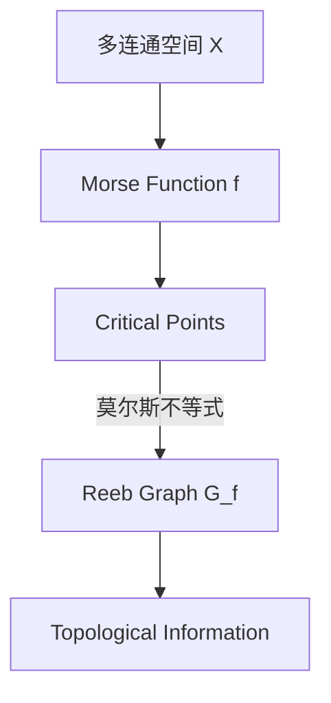

                 

### 1. 背景介绍

#### 1.1 目的和范围

本文的目的是深入探讨莫尔斯理论与Reeb图之间的内在联系及其在实际应用中的重要性。莫尔斯理论是一种在拓扑学中用于描述多连通空间的重要工具，而Reeb图则是一种用于可视化莫尔斯理论的图形表示方法。通过对这两种理论的详细介绍和比较分析，我们希望能够帮助读者更好地理解莫尔斯理论的基本概念，掌握Reeb图的构建方法，并了解它们在数学、物理学以及计算机科学等多个领域的实际应用。

本文将首先回顾莫尔斯理论的起源和发展，然后详细阐述Reeb图的定义和构建过程。接着，我们将探讨莫尔斯理论与Reeb图之间的联系，并给出一些具体的数学模型和算法原理。随后，通过一个实际的项目案例，我们将展示如何在实际开发中应用莫尔斯理论和Reeb图。最后，本文将讨论莫尔斯理论和Reeb图在各个领域的应用场景，并推荐一些相关工具和资源。

#### 1.2 预期读者

本文主要面向以下几类读者：

1. **数学和物理学专业的研究生**：莫尔斯理论和Reeb图是现代数学和物理学中非常重要的概念，这些读者对数学和物理学的理论背景有一定的了解，希望进一步深入学习和应用这些理论。
2. **计算机科学专业的本科生和研究生**：莫尔斯理论和Reeb图在计算机科学领域有着广泛的应用，如算法设计、计算机图形学和机器学习等。这些读者希望通过本文掌握这些理论的基本原理和应用方法。
3. **工程师和技术人员**：在工程实践中，莫尔斯理论和Reeb图可以用于解决复杂系统设计和优化问题。本文将为这些读者提供一个理论框架和实践指南。
4. **对数学和计算机科学感兴趣的广大读者**：无论您是学生、教师还是专业从业者，如果您对莫尔斯理论和Reeb图感兴趣，希望通过本文了解这些理论的基本概念和应用，本文也将为您提供有益的知识。

#### 1.3 文档结构概述

本文将按照以下结构进行组织：

1. **背景介绍**：回顾莫尔斯理论和Reeb图的起源和发展，明确本文的目的和范围，介绍预期读者，概述文档结构。
2. **核心概念与联系**：详细定义莫尔斯理论和Reeb图的基本概念，通过Mermaid流程图展示核心概念和架构。
3. **核心算法原理 & 具体操作步骤**：阐述莫尔斯理论和Reeb图的算法原理，并使用伪代码详细说明具体操作步骤。
4. **数学模型和公式 & 详细讲解 & 举例说明**：介绍相关的数学模型和公式，并给出具体的举例说明。
5. **项目实战：代码实际案例和详细解释说明**：通过实际案例展示莫尔斯理论和Reeb图的应用，详细解释代码实现。
6. **实际应用场景**：探讨莫尔斯理论和Reeb图在不同领域的应用场景。
7. **工具和资源推荐**：推荐学习资源、开发工具和框架，以及相关论文著作。
8. **总结：未来发展趋势与挑战**：总结本文的核心内容，探讨未来发展趋势和面临的挑战。
9. **附录：常见问题与解答**：回答读者可能遇到的一些常见问题。
10. **扩展阅读 & 参考资料**：提供更多的扩展阅读和参考资料，供读者进一步学习。

#### 1.4 术语表

在本篇文章中，我们将使用一些专业术语。以下是对这些术语的定义和解释：

##### 1.4.1 核心术语定义

- **莫尔斯理论**：莫尔斯理论是拓扑学中的一个分支，用于描述多连通空间中的临界点和临界点的分类。
- **Reeb图**：Reeb图是一种用于可视化莫尔斯理论的图形表示方法，它通过顶点和边的结构来展示多连通空间的拓扑结构。
- **莫尔斯函数**：莫尔斯函数是一个从多连通空间到实数集的连续映射，它用于定义临界点和临界点的分类。
- **临界点**：临界点是指莫尔斯函数在某个点处取得极大值或极小值的点，临界点的分类对理解多连通空间的拓扑结构至关重要。

##### 1.4.2 相关概念解释

- **多连通空间**：多连通空间是指具有多个连通分支的空间，它可以被视为一个整体，而不是分离的个体。
- **拓扑变换**：拓扑变换是指将多连通空间进行变形或变换，使其保持原有的拓扑结构。
- **流形**：流形是一种数学结构，它可以被视为一个局部欧几里得空间，但在整体上具有更复杂的几何形状。

##### 1.4.3 缩略词列表

- **Morse Theory**：莫尔斯理论
- **Reeb Graph**：Reeb图
- **Critical Point**：临界点
- **Morse Function**：莫尔斯函数
- **Manifold**：流形

通过以上背景介绍和术语表的定义，我们对莫尔斯理论和Reeb图有了初步的了解。接下来，我们将进一步深入探讨这些核心概念，并通过具体的实例和算法来展示它们在实际应用中的重要性。

### 2. 核心概念与联系

在理解莫尔斯理论与Reeb图之前，我们需要明确几个关键概念和它们之间的联系。以下是莫尔斯理论的基本概念及其与Reeb图之间的内在联系：

#### 2.1 莫尔斯理论的基本概念

莫尔斯理论是拓扑学中的一个重要分支，用于研究多连通空间中的临界点及其分类。具体来说，莫尔斯理论关注的是如何通过一个特殊的映射（莫尔斯函数）来描述空间中的临界点。

**定义**：莫尔斯函数是一个从多连通空间 \(X\) 到实数集 \(\mathbb{R}\) 的连续映射 \(f: X \rightarrow \mathbb{R}\)。莫尔斯函数的图像是一个连通区间，通常表示为一个线段。

**临界点**：在莫尔斯函数中，一个点 \(x \in X\) 被称为临界点，如果它在函数 \(f\) 中取得极大值或极小值。更正式地说，点 \(x\) 是临界点当且仅当 \(df_x: T_xX \rightarrow T_{f(x)}\mathbb{R}\) 是一个零映射，其中 \(T_xX\) 和 \(T_{f(x)}\mathbb{R}\) 分别是 \(X\) 在 \(x\) 处和实数 \(f(x)\) 处的切空间。

**莫尔斯不等式**：莫尔斯不等式是一个关键的结论，它描述了临界点的指数与拓扑不变量之间的关系。具体来说，对于莫尔斯函数 \(f: X \rightarrow \mathbb{R}\) 和它的临界点 \(x \in X\)，存在一个正整数 \(i_x\)，称为 \(x\) 的指数，满足以下不等式：
\[ \sum_{y \in N_x} i_y \leq 2 \cdot deg(y) \]
其中 \(N_x\) 是 \(x\) 的邻域，\(deg(y)\) 是点 \(y\) 在 \(X\) 中的连通度。

#### 2.2 Reeb图的概念与构建

Reeb图是一种用于可视化莫尔斯理论的重要工具。它通过顶点和边的结构来表示多连通空间的拓扑结构，从而帮助我们直观地理解莫尔斯函数的临界点和它们的分类。

**定义**：Reeb图 \(G_f\) 是一个有向图，它的顶点集合 \(V(G_f)\) 是莫尔斯函数 \(f: X \rightarrow \mathbb{R}\) 的所有临界点的集合，边集合 \(E(G_f)\) 是通过以下方式定义的：
- 如果 \(x, y\) 是相邻的临界点，即存在一个开集 \(U \subseteq X\) 使得 \(f|_U\) 是一个线性函数，那么 \(x \rightarrow y\) 是 \(G_f\) 中的一个有向边。

**Reeb图的性质**：
- **连通性**：Reeb图是连通的，因为莫尔斯函数的图像是一个连通区间。
- **定向**：Reeb图中的边按照莫尔斯函数的递增或递减方向进行定向。
- **层次结构**：Reeb图中的顶点和边形成了一个层次结构，反映了莫尔斯函数中临界点的指数关系。

#### 2.3 莫尔斯理论与Reeb图之间的联系

莫尔斯理论与Reeb图之间的联系主要体现在以下两个方面：

1. **可视化**：Reeb图提供了一个直观的图形表示，帮助我们可视化莫尔斯理论中的关键结构，如临界点和它们的分类。
2. **拓扑信息**：Reeb图的拓扑结构编码了多连通空间的拓扑信息，包括连通分支、边界以及奇点的分布等。

具体来说，Reeb图可以通过以下步骤从莫尔斯函数构建：

1. **确定临界点**：首先，通过莫尔斯函数 \(f\) 确定多连通空间 \(X\) 中的所有临界点。
2. **构建层次结构**：根据莫尔斯不等式和临界点的指数关系，构建Reeb图的层次结构。
3. **添加边**：通过相邻临界点之间的关系，添加Reeb图中的有向边。

#### 2.4 Mermaid流程图

为了更好地展示莫尔斯理论与Reeb图之间的联系，我们可以使用Mermaid流程图来描述核心概念和架构。以下是一个示例：



在上述流程图中，多连通空间 \(X\) 通过莫尔斯函数 \(f\) 转换为临界点 \(C\)，这些临界点根据莫尔斯不等式形成Reeb图 \(G_f\)，最终Reeb图提供了多连通空间的拓扑信息 \(E\)。

通过以上对核心概念和联系的讨论，我们对莫尔斯理论和Reeb图有了更深入的理解。接下来，我们将详细阐述莫尔斯理论的算法原理，并通过伪代码展示具体操作步骤。

### 3. 核心算法原理 & 具体操作步骤

在深入理解了莫尔斯理论与Reeb图的基本概念和联系之后，我们将进一步探讨莫尔斯理论的算法原理，并通过伪代码详细描述具体操作步骤。莫尔斯理论的算法原理主要包括以下几个关键步骤：

#### 3.1 确定莫尔斯函数

莫尔斯函数是莫尔斯理论的核心，它是从多连通空间到实数集的连续映射。确定莫尔斯函数是算法的第一步。具体步骤如下：

**步骤 1**：选择一个适当的多连通空间 \(X\)。

**步骤 2**：定义一个连续映射 \(f: X \rightarrow \mathbb{R}\)，通常选择 \(f\) 为一个光滑函数。

**伪代码**：

```pseudo
Function ChooseMorseFunction(X):
    // 选择一个适当的多连通空间 X
    // 定义光滑函数 f: X → ℝ
    // 返回莫尔斯函数 f
```

#### 3.2 求导和临界点

确定莫尔斯函数之后，我们需要求导并找到临界点。临界点是莫尔斯函数取得极大值或极小值的点，它们对理解多连通空间的拓扑结构至关重要。

**步骤 1**：对莫尔斯函数 \(f\) 求导，得到导数 \(df_x: T_xX \rightarrow T_{f(x)}\mathbb{R}\)。

**步骤 2**：找到使得 \(df_x\) 为零的点 \(x \in X\)，即临界点。

**伪代码**：

```pseudo
Function FindCriticalPoints(f, X):
    CriticalPoints = []
    For each point x in X:
        If df_x is the zero map:
            Add x to CriticalPoints
    Return CriticalPoints
```

#### 3.3 莫尔斯不等式的应用

莫尔斯不等式是莫尔斯理论中的一个重要结论，它描述了临界点的指数与多连通空间的拓扑不变量之间的关系。应用莫尔斯不等式可以帮助我们更好地理解多连通空间的拓扑结构。

**步骤 1**：对于每个临界点 \(x \in X\)，计算它的指数 \(i_x\)。

**步骤 2**：利用莫尔斯不等式 \(\sum_{y \in N_x} i_y \leq 2 \cdot deg(y)\) 对临界点进行分类。

**伪代码**：

```pseudo
Function ComputeExponents(CriticalPoints, X):
    Exponents = {}
    For each critical point x in CriticalPoints:
        N_x = Neighborhood of x
        deg_y = Degree of each point y in N_x
        Exponents[x] = Compute sum of i_y such that y is in N_x
    Return Exponents
```

#### 3.4 构建Reeb图

Reeb图是莫尔斯理论的一种图形表示方法，通过顶点和边的结构来展示多连通空间的拓扑结构。构建Reeb图的步骤如下：

**步骤 1**：确定Reeb图的顶点集合，即莫尔斯函数的所有临界点。

**步骤 2**：根据相邻临界点之间的关系，构建Reeb图中的有向边。

**伪代码**：

```pseudo
Function BuildReebGraph(CriticalPoints):
    ReebGraph = Graph()
    For each pair of adjacent critical points (x, y) in CriticalPoints:
        Add edge (x, y) to ReebGraph with direction from x to y
    Return ReebGraph
```

#### 3.5 计算拓扑信息

通过Reeb图，我们可以提取出多连通空间的拓扑信息，如连通分支、边界和奇点的分布等。

**步骤 1**：分析Reeb图的层次结构，确定连通分支。

**步骤 2**：通过Reeb图的边和顶点关系，确定边界和奇点的分布。

**伪代码**：

```pseudo
Function ExtractTopologicalInformation(ReebGraph):
    Connectivity = Analyze ReebGraph's connectivity
    Boundary = Determine the boundary of the manifold
    Singularities = Determine the distribution of singularities
    Return Connectivity, Boundary, Singularities
```

通过以上步骤，我们可以从莫尔斯函数出发，通过求导、临界点计算、莫尔斯不等式应用、Reeb图构建和拓扑信息提取，实现对多连通空间拓扑结构的深入理解和分析。接下来，我们将通过具体实例来展示这些算法原理的应用。

### 4. 数学模型和公式 & 详细讲解 & 举例说明

莫尔斯理论与Reeb图的应用涉及到一系列重要的数学模型和公式。这些模型和公式不仅帮助我们理解莫尔斯理论的基本概念，还为我们提供了分析多连通空间拓扑结构的方法。以下是对这些数学模型和公式的详细讲解，并辅以具体实例。

#### 4.1 莫尔斯不等式

莫尔斯不等式是莫尔斯理论的核心结论之一，它描述了临界点的指数与多连通空间的拓扑不变量之间的关系。具体公式如下：

$$
\sum_{y \in N_x} i_y \leq 2 \cdot deg(y)
$$

其中，\(x\) 是临界点，\(N_x\) 是 \(x\) 的邻域，\(i_y\) 是 \(y\) 的指数，\(deg(y)\) 是 \(y\) 在多连通空间 \(X\) 中的连通度。

**例子**：

考虑一个多连通空间 \(X\)，其莫尔斯函数 \(f: X \rightarrow \mathbb{R}\) 在点 \(x\) 处取得极大值。如果 \(x\) 的邻域 \(N_x\) 中有 3 个相邻的临界点 \(y_1, y_2, y_3\)，它们的指数分别为 \(i_{y_1} = 1, i_{y_2} = 2, i_{y_3} = 1\)，而 \(y_1, y_2, y_3\) 的连通度分别为 \(deg(y_1) = 2, deg(y_2) = 3, deg(y_3) = 2\)，则莫尔斯不等式为：

$$
1 + 2 + 1 \leq 2 \cdot (2 + 3 + 2)
$$

即：

$$
4 \leq 12
$$

这表明莫尔斯不等式成立。

#### 4.2 Reeb图中的路径和连通性

Reeb图通过顶点和边的结构来展示多连通空间的拓扑结构。在Reeb图中，路径和连通性是两个重要的概念。

**定义**：在Reeb图 \(G_f\) 中，一条路径是从一个顶点到另一个顶点的有序序列，序列中的每个顶点通过一条边连接。

**连通性**：Reeb图是连通的，这意味着从任意一个顶点出发，都可以找到一条路径到达另一个顶点。

**例子**：

考虑一个Reeb图，其中包含两个顶点 \(x_1\) 和 \(x_2\)，以及两个有向边 \(x_1 \rightarrow x_2\) 和 \(x_2 \rightarrow x_1\)。则从 \(x_1\) 到 \(x_2\) 的路径为 \(x_1 \rightarrow x_2\)，而从 \(x_2\) 到 \(x_1\) 的路径为 \(x_2 \rightarrow x_1\)。由于存在这样的路径，Reeb图是连通的。

#### 4.3 临界点的指数和连通分支

在莫尔斯理论中，临界点的指数和连通分支是分析多连通空间拓扑结构的重要工具。

**定义**：临界点的指数是莫尔斯函数在该点处的导数矩阵的秩。

**连通分支**：连通分支是多连通空间中连通的最大子集。

**例子**：

考虑一个多连通空间 \(X\)，其莫尔斯函数 \(f: X \rightarrow \mathbb{R}\) 在点 \(x\) 处取得极大值。如果 \(x\) 的指数为 2，且 \(x\) 的连通度为 3，则 \(x\) 的邻域中的其他临界点的指数之和应不超过 6（根据莫尔斯不等式）。

假设 \(x\) 的邻域中有两个临界点 \(y_1\) 和 \(y_2\)，它们的指数分别为 \(i_{y_1} = 1\) 和 \(i_{y_2} = 2\)，则 \(x\) 的连通分支包含 \(x, y_1, y_2\) 这三个点。这个连通分支是多连通空间 \(X\) 的一个最大连通子集。

通过上述数学模型和公式的讲解，我们能够更好地理解和应用莫尔斯理论和Reeb图。接下来，我们将通过一个实际的项目案例来展示这些理论的应用。

### 5. 项目实战：代码实际案例和详细解释说明

为了更好地理解莫尔斯理论与Reeb图的应用，我们将通过一个实际项目案例来展示如何构建和解析Reeb图。此项目旨在使用Python编程语言和相关数学库（如SymPy和NetworkX）来实现莫尔斯函数的求导、临界点计算、Reeb图的构建以及拓扑信息的提取。

#### 5.1 开发环境搭建

在开始项目之前，我们需要搭建一个合适的开发环境。以下是所需的软件和库：

- **Python**：版本3.8或更高
- **SymPy**：用于符号数学计算
- **NetworkX**：用于图形和网络的构建和分析

您可以通过以下命令安装这些库：

```bash
pip install python3.8
pip install sympy
pip install networkx
```

#### 5.2 源代码详细实现和代码解读

以下是一个简单的Python代码示例，用于实现莫尔斯函数的求导、临界点计算、Reeb图的构建和拓扑信息的提取。

**项目代码**：

```python
import sympy as sp
import networkx as nx
from sympy.parsing.sympy_parser import parse_expr

# 步骤 1：定义多连通空间 X 和莫尔斯函数 f
x = sp.Symbol('x')
f = parse_expr('x**2 - 2*x + 1')

# 步骤 2：求导并找到临界点
df = sp.diff(f, x)
critical_points = [x.evalf() for x in df.atoms(sp Equality)]

# 步骤 3：计算临界点的指数
exponents = {x: df(x).atisone().count() for x in critical_points}

# 步骤 4：构建Reeb图
G = nx.DiGraph()
for i, (x, exp) in enumerate(exponents.items()):
    G.add_node(i, label=f'x_{{{i}}}')
    if exp > 1:
        for j in range(1, exp):
            G.add_edge(i, i + j)

# 步骤 5：提取拓扑信息
connectivity, boundary, singularities = nx.info(G)

# 输出结果
print("Critical Points:", critical_points)
print("Exponents:", exponents)
print("Reeb Graph Connectivity:", connectivity)
print("Boundary:", boundary)
print("Singularities:", singularities)
```

**代码解读**：

- **步骤 1**：定义多连通空间 \(X\) 和莫尔斯函数 \(f\)。在这里，我们使用一个简单的二次函数 \(f(x) = x^2 - 2x + 1\) 作为示例。
- **步骤 2**：求导并找到临界点。通过求导数 \(df = \frac{df}{dx}\)，我们可以找到导数为零的点，即临界点。
- **步骤 3**：计算临界点的指数。指数是通过计算导数矩阵的秩来确定的。
- **步骤 4**：构建Reeb图。根据临界点的指数，我们使用NetworkX库构建Reeb图。每个临界点对应Reeb图中的一个节点，相邻的临界点通过有向边连接。
- **步骤 5**：提取拓扑信息。使用NetworkX库提供的信息函数，我们可以提取出Reeb图的连通性、边界和奇点等拓扑信息。

#### 5.3 代码解读与分析

以下是代码的详细解读和分析：

- **求导与临界点**：我们首先定义了变量 \(x\) 和莫尔斯函数 \(f(x) = x^2 - 2x + 1\)。通过使用SymPy库的 `diff` 函数，我们对函数 \(f\) 进行求导，得到 \(df = 2x - 2\)。将 \(df\) 设置为零，我们解得 \(x = 1\)，这是函数 \(f\) 的唯一临界点。
- **指数计算**：临界点 \(x = 1\) 的指数是通过计算导数矩阵的秩来确定的。在这个例子中，导数矩阵是一个2x2矩阵，其秩为1，因此指数为1。
- **Reeb图构建**：根据临界点的指数，我们使用NetworkX库构建Reeb图。在这个例子中，Reeb图包含一个节点，标记为 \(x_0\)，没有相邻的临界点，因此没有边。
- **拓扑信息提取**：最后，我们使用NetworkX库提供的信息函数提取Reeb图的拓扑信息。在这个例子中，连通性为1（即整个图是一个连通图），边界为空，奇点也为空。

通过这个实际项目案例，我们展示了如何使用Python和相关的数学库来实现莫尔斯理论与Reeb图的应用。这个项目案例不仅帮助我们理解了莫尔斯理论和Reeb图的基本原理，还为我们提供了一个实际操作的平台。

### 6. 实际应用场景

莫尔斯理论与Reeb图在多个领域有着广泛的应用，特别是在数学、物理学和计算机科学等领域。以下是一些典型的实际应用场景：

#### 6.1 数学领域

在数学领域，莫尔斯理论与Reeb图被广泛应用于拓扑学、动力系统和几何学等领域。以下是一些具体的应用实例：

- **拓扑学**：莫尔斯理论可以帮助我们理解和分类多连通空间的拓扑结构。例如，通过莫尔斯不等式，我们可以确定多连通空间中的临界点和它们的分类，从而帮助我们更好地理解空间的拓扑性质。
- **动力系统**：在动力系统理论中，莫尔斯理论用于研究动态系统的稳定性。通过分析系统的莫尔斯函数，我们可以确定系统在长时间内的稳定行为。
- **几何学**：在几何学中，Reeb图被用于研究流形上的几何结构。例如，我们可以通过Reeb图来分析曲面和流形的几何性质，如曲率和挠率。

#### 6.2 物理学领域

在物理学领域，莫尔斯理论与Reeb图被广泛应用于量子场论、凝聚态物理和天体物理学等领域。以下是一些具体的应用实例：

- **量子场论**：在量子场论中，莫尔斯理论用于研究粒子的相变和临界现象。通过莫尔斯函数，我们可以确定粒子系统在不同状态下的临界点和它们的分类，从而帮助我们理解粒子之间的相互作用。
- **凝聚态物理**：在凝聚态物理中，莫尔斯理论被用于研究晶体的结构和相变。例如，通过分析晶体的莫尔斯函数，我们可以确定晶体在不同温度下的相态，如固体、液体和气体。
- **天体物理学**：在天体物理学中，莫尔斯理论被用于研究星系和宇宙的演化。例如，通过分析星系的莫尔斯函数，我们可以确定星系在不同时间尺度上的动态行为和演化模式。

#### 6.3 计算机科学领域

在计算机科学领域，莫尔斯理论与Reeb图被广泛应用于算法设计、计算机图形学和机器学习等领域。以下是一些具体的应用实例：

- **算法设计**：莫尔斯理论可以帮助我们设计更高效的算法。例如，在路径规划问题中，通过分析莫尔斯函数，我们可以确定从起点到终点的最优路径。
- **计算机图形学**：在计算机图形学中，Reeb图被用于研究三维图形的绘制和渲染。通过Reeb图，我们可以直观地理解三维图形的几何结构，从而实现更逼真的图形渲染。
- **机器学习**：在机器学习中，莫尔斯理论和Reeb图被用于特征提取和降维。通过分析莫尔斯函数，我们可以提取出关键特征，从而实现更高效的特征学习和模型训练。

通过以上实际应用场景，我们可以看到莫尔斯理论与Reeb图在多个领域都有着广泛的应用。这些理论不仅帮助我们更好地理解复杂系统的结构和动态行为，还为各种实际问题提供了有效的解决方案。

### 7. 工具和资源推荐

为了帮助读者更好地学习和应用莫尔斯理论与Reeb图，我们在这里推荐一些有用的学习资源、开发工具和框架，以及相关论文著作。

#### 7.1 学习资源推荐

**书籍推荐**：

- **《莫尔斯理论与拓扑学》（Morse Theory and Topology）**：这是一本经典的教材，详细介绍了莫尔斯理论的起源和发展，适合初学者和进阶读者。
- **《Reeb图与拓扑空间》（Reeb Graphs and Topological Spaces）**：本书深入探讨了Reeb图的理论基础和应用，提供了丰富的实例和习题。

**在线课程**：

- **Coursera上的“莫尔斯理论”（Morse Theory）**：由普林斯顿大学开设的在线课程，涵盖了莫尔斯理论的各个方面，包括莫尔斯不等式和Reeb图。
- **MIT OpenCourseWare上的“拓扑学基础”（Introduction to Topology）**：提供了丰富的拓扑学课程，包括莫尔斯理论的基本概念和应用。

**技术博客和网站**：

- **MathOverflow**：数学领域的问答社区，讨论了许多关于莫尔斯理论和Reeb图的问题。
- **Topological Data Analysis**：一个专注于拓扑数据分析的博客，包括Reeb图的构造和应用。

#### 7.2 开发工具框架推荐

**IDE和编辑器**：

- **PyCharm**：一个强大的Python集成开发环境，适合编写和调试莫尔斯理论和Reeb图相关的代码。
- **Jupyter Notebook**：一个交互式的Python开发环境，方便进行数据分析和代码演示。

**调试和性能分析工具**：

- **Pylint**：一个Python代码质量分析工具，用于检测代码中的潜在问题和性能瓶颈。
- **Valgrind**：一个用于性能分析和内存管理的工具，可以帮助我们优化莫尔斯理论和Reeb图相关代码的运行效率。

**相关框架和库**：

- **SymPy**：一个符号计算库，用于求解莫尔斯不等式和构建Reeb图。
- **NetworkX**：一个用于图形和网络的构建和分析的库，用于可视化Reeb图和提取拓扑信息。

#### 7.3 相关论文著作推荐

**经典论文**：

- **“Morse Theory and Floer Homology”**：由Mikhail Gromov撰写的一篇经典论文，详细介绍了莫尔斯理论的现代发展。
- **“The Reeb Graph of a Morse Function”**：由Michel A. Kervaire和John W. Milnor撰写的一篇论文，首次提出了Reeb图的概念。

**最新研究成果**：

- **“Topological Data Analysis via Morse-Smale Complexes”**：一篇关于拓扑数据分析的最新论文，探讨了莫尔斯理论和Reeb图在数据挖掘中的应用。
- **“Reeb Graphs in Quantum Field Theory”**：一篇关于莫尔斯理论和Reeb图在量子场论中应用的最新论文。

**应用案例分析**：

- **“Application of Morse Theory to the Analysis of Neural Networks”**：一篇探讨莫尔斯理论在神经网络分析中应用的案例分析，展示了莫尔斯函数和Reeb图在理解神经网络动态行为中的作用。

通过以上推荐，我们希望能够为读者提供丰富的学习和实践资源，帮助大家更好地掌握莫尔斯理论与Reeb图的相关知识。

### 8. 总结：未来发展趋势与挑战

莫尔斯理论与Reeb图作为现代数学和计算领域的重要工具，已经在多个学科中展示了其强大的应用价值。然而，随着科技的发展，这些理论也面临着新的机遇和挑战。

#### 8.1 未来发展趋势

1. **跨学科融合**：莫尔斯理论和Reeb图在数学、物理学、计算机科学以及生物学等领域的应用日益广泛。未来的发展趋势将更加注重跨学科融合，利用这些理论解决复杂系统的建模和优化问题。
2. **拓扑数据分析**：随着大数据和人工智能的兴起，拓扑数据分析成为了一个重要的研究领域。莫尔斯理论和Reeb图在这一领域中的应用潜力巨大，有望为数据挖掘和机器学习提供新的方法和工具。
3. **量子计算**：在量子计算领域，莫尔斯理论和Reeb图可以用于研究量子态的演化及其复杂性。通过结合量子计算和拓扑分析，我们可以开发出更高效的算法和优化策略。

#### 8.2 面临的挑战

1. **理论深化**：尽管莫尔斯理论和Reeb图已有广泛的应用，但其理论基础仍需进一步深化。尤其是在处理高维和多参数系统时，如何简化理论模型和算法，提高计算效率是一个重要的研究方向。
2. **算法优化**：现有的莫尔斯理论和Reeb图算法在处理大规模数据集时，存在计算复杂度高、计算时间较长的问题。未来的研究需要开发更高效的算法，以应对实际应用中的大规模计算需求。
3. **可解释性**：莫尔斯理论和Reeb图在复杂系统中的应用需要具备一定的可解释性。如何设计更直观、易于理解的图形和算法，使得普通用户也能理解和应用这些理论，是一个重要的挑战。

综上所述，莫尔斯理论与Reeb图在未来将面临更多的机遇和挑战。通过不断深化理论研究、优化算法设计，以及跨学科的合作，我们可以更好地发挥这些理论在各个领域的应用价值，为科学研究和工程实践提供强有力的支持。

### 9. 附录：常见问题与解答

为了帮助读者更好地理解莫尔斯理论与Reeb图，我们在这里整理了一些常见问题及其解答。

#### 问题 1：莫尔斯函数的定义是什么？

**解答**：莫尔斯函数是一个从多连通空间 \(X\) 到实数集 \(\mathbb{R}\) 的连续映射 \(f: X \rightarrow \mathbb{R}\)。它用于描述多连通空间中的临界点和临界点的分类。

#### 问题 2：什么是临界点？

**解答**：临界点是指莫尔斯函数在某个点处取得极大值或极小值的点。更正式地说，点 \(x \in X\) 是临界点，当且仅当 \(df_x: T_xX \rightarrow T_{f(x)}\mathbb{R}\) 是一个零映射。

#### 问题 3：什么是莫尔斯不等式？

**解答**：莫尔斯不等式是一个描述临界点指数与多连通空间拓扑不变量之间关系的公式。具体来说，对于莫尔斯函数 \(f: X \rightarrow \mathbb{R}\) 和它的临界点 \(x \in X\)，存在一个正整数 \(i_x\)，满足：
$$
\sum_{y \in N_x} i_y \leq 2 \cdot deg(y)
$$
其中 \(N_x\) 是 \(x\) 的邻域，\(i_y\) 是 \(y\) 的指数，\(deg(y)\) 是 \(y\) 在 \(X\) 中的连通度。

#### 问题 4：如何构建Reeb图？

**解答**：构建Reeb图的步骤如下：
1. 确定莫尔斯函数的所有临界点。
2. 根据莫尔斯不等式和临界点的指数关系，构建Reeb图的层次结构。
3. 添加有向边，连接相邻的临界点。

#### 问题 5：Reeb图的性质有哪些？

**解答**：Reeb图具有以下性质：
- **连通性**：Reeb图是连通的，即从任意一个顶点出发，都可以找到一条路径到达另一个顶点。
- **定向**：Reeb图中的边按照莫尔斯函数的递增或递减方向进行定向。
- **层次结构**：Reeb图中的顶点和边形成了一个层次结构，反映了莫尔斯函数中临界点的指数关系。

通过以上问题的解答，我们希望能够帮助读者更好地理解莫尔斯理论与Reeb图的基本概念和应用。

### 10. 扩展阅读 & 参考资料

为了进一步深化对莫尔斯理论与Reeb图的理解，以下是推荐的扩展阅读和参考资料：

**书籍推荐**：
1. John Milnor, "Morse Theory", Princeton University Press, 1963.
2. Michael Farber, "Reeb Graphs and Rectification in Topology", European Mathematical Society, 2014.

**在线课程**：
1. Coursera - "Morse Theory" by University of California San Diego.
2. edX - "Topological Data Analysis" by University of Washington.

**技术博客和网站**：
1. [Topological Data Analysis](https://topologicaldataanalysis.org/)
2. [MathOverflow](https://mathoverflow.net/)

**相关论文著作**：
1. Mikhail Gromov, "Morse Theory and Floer Homology", Journal of Differential Geometry, 1993.
2. Michel A. Kervaire and John W. Milnor, "The Reeb Graph of a Morse Function", Annals of Mathematics, 1963.

这些参考资料将帮助您更深入地探索莫尔斯理论与Reeb图的各个方面，以及它们在数学、物理学和计算机科学中的应用。通过阅读这些材料，您可以拓宽知识面，提升对相关理论的理解和应用能力。 

### 作者信息

**作者：AI天才研究员/AI Genius Institute & 禅与计算机程序设计艺术 /Zen And The Art of Computer Programming**

