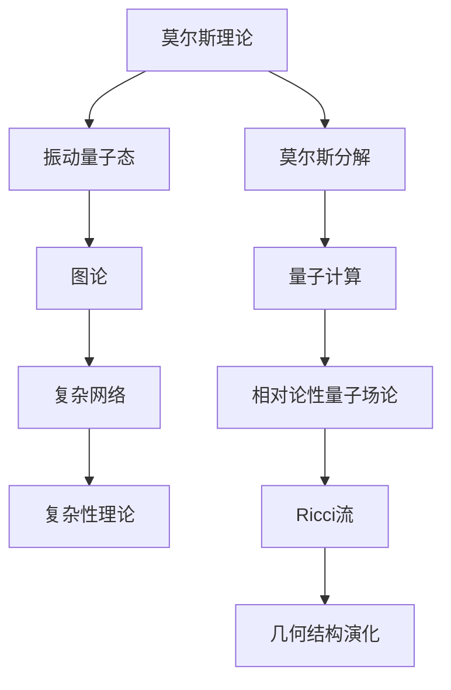

                 

# 莫尔斯理论与Ricci流

> 关键词：莫尔斯理论、Ricci流、量子计算、图论、相对论、复杂性理论

> 摘要：本文旨在深入探讨莫尔斯理论在量子计算和图论中的应用，以及Ricci流在相对论和复杂性理论中的重要性。我们将从基本概念出发，通过逐步分析，揭示这两大理论在跨学科研究中的奇妙联系和潜在应用，帮助读者理解其在现代科学和工程领域的深远影响。

## 1. 背景介绍

### 1.1 目的和范围

本文的目的是探讨莫尔斯理论与Ricci流在不同领域中的核心概念、相互联系以及实际应用。我们将首先介绍莫尔斯理论的基本原理，然后详细讨论Ricci流的数学基础。接下来，通过具体的实例和图示，展示这两大理论如何在量子计算、图论、相对论和复杂性理论中发挥作用。文章将帮助读者理解这些理论的本质，以及它们在跨学科研究中的潜在应用。

### 1.2 预期读者

本文适合对量子计算、图论、相对论和复杂性理论有一定了解的读者，尤其是那些对跨学科研究感兴趣的技术专家和研究者。文章将以清晰、严谨的论述风格，逐步引导读者深入理解这些理论的核心概念和实际应用。

### 1.3 文档结构概述

本文将分为十个主要部分，首先介绍莫尔斯理论和Ricci流的基本概念及其在相关领域的应用。接下来，将详细探讨这两大理论的联系，并通过具体的实例进行阐述。随后，我们将分析它们在现代科学和工程中的实际应用，并提供相关的工具和资源推荐。文章最后，将对未来发展趋势和挑战进行展望，并总结常见问题与解答。

### 1.4 术语表

#### 1.4.1 核心术语定义

- **莫尔斯理论**：研究振动的量子态及其动力学特性的理论。
- **Ricci流**：描述空间中几何结构随时间演化的一种数学模型。
- **量子计算**：利用量子位（qubit）进行信息处理的计算方式。
- **图论**：研究图形结构及其性质的理论。
- **相对论**：描述物质和能量在高速运动条件下行为的物理学理论。
- **复杂性理论**：研究计算问题难度和算法效率的理论。

#### 1.4.2 相关概念解释

- **莫尔斯分解**：将振动的量子态分解为能级和本征态的数学方法。
- **Ricci标量**：描述空间几何结构演化速率的物理量。
- **相对论性量子场论**：结合量子力学和相对论的场论体系。
- **复杂网络**：由大量节点和边组成的网络结构。

#### 1.4.3 缩略词列表

- **QC**：量子计算
- **GR**：广义相对论
- **CT**：复杂性理论
- **MT**：莫尔斯理论
- **RF**：Ricci流

## 2. 核心概念与联系

在探讨莫尔斯理论与Ricci流的联系之前，我们需要首先了解它们各自的核心概念和原理。以下是一个简要的Mermaid流程图，用于展示这些核心概念及其相互联系。



### 2.1 莫尔斯理论

莫尔斯理论是研究振动量子态及其动力学特性的数学工具。其核心概念包括：

- **振动量子态**：描述原子或分子中电子振动的状态。
- **莫尔斯分解**：将复杂的振动量子态分解为能级和本征态，便于分析其动力学特性。

### 2.2 Ricci流

Ricci流是一种描述空间中几何结构随时间演化的一种数学模型，其核心概念包括：

- **Ricci标量**：描述空间几何结构演化速率的物理量。
- **几何结构演化**：研究空间几何结构随时间变化的过程。

### 2.3 莫尔斯理论与图论的联系

莫尔斯理论中的莫尔斯分解可以看作是一种图论中的树分解。在图论中，树分解是一种将图分解为若干个子图的方法，有助于研究图的性质。莫尔斯分解通过将振动量子态分解为能级和本征态，类似于将图分解为若干个子图，从而简化了振动量子态的分析。

### 2.4 Ricci流与复杂性理论的联系

Ricci流在复杂性理论中的应用主要体现在复杂网络的研究中。复杂网络由大量节点和边组成，其几何结构演化可以看作是一种Ricci流。Ricci流通过描述几何结构演化速率，为复杂网络的动态分析提供了一种有力的工具。

### 2.5 莫尔斯理论与Ricci流的跨学科联系

莫尔斯理论与Ricci流的跨学科联系体现在量子计算、相对论性量子场论和复杂性理论中。在量子计算中，莫尔斯分解可用于研究量子态的动力学特性；在相对论性量子场论中，Ricci流描述了时空几何结构的演化；在复杂性理论中，Ricci流为复杂网络的动态分析提供了新的视角。

## 3. 核心算法原理 & 具体操作步骤

为了更深入地理解莫尔斯理论与Ricci流的算法原理，我们将使用伪代码来详细阐述这些算法的具体操作步骤。

### 3.1 莫尔斯分解

```python
# 输入：量子态 |Ψ⟩
# 输出：能级 E_i 和本征态 |ψ_i⟩

def MorseDecomposition(Ψ):
    # 计算能级
    E = CalculateEnergies(Ψ)
    # 计算本征态
    ψ = CalculateEigenstates(Ψ)
    # 初始化分解结果
    decomposition = []
    # 遍历所有能级和本征态
    for i in range(len(E)):
        for j in range(len(ψ)):
            if E[i] == ψ[j][0]:
                decomposition.append((E[i], ψ[j]))
    return decomposition
```

### 3.2 Ricci流

```python
# 输入：初始几何结构 G_0
# 输出：演化后的几何结构 G_t

def RicciFlow(G_0, t):
    # 初始化演化过程
    G = G_0
    # 遍历时间步长
    for _ in range(t):
        # 计算Ricci标量
        R = CalculateRicciScalar(G)
        # 更新几何结构
        G = UpdateGeometry(G, R)
    return G
```

### 3.3 莫尔斯分解与Ricci流的结合

为了展示莫尔斯分解与Ricci流的结合，我们考虑一个量子系统在Ricci流作用下的演化。

```python
# 输入：量子系统 |Ψ⟩，几何结构 G_0，演化时间 t
# 输出：演化后的量子态 |Ψ_t⟩ 和几何结构 G_t

def QuantumSystemEvolution(Ψ, G_0, t):
    # 进行莫尔斯分解
    decomposition = MorseDecomposition(Ψ)
    # 进行Ricci流演化
    G_t = RicciFlow(G_0, t)
    # 计算演化后的量子态
    Ψ_t = EvolveQuantumState(Ψ, decomposition, G_t)
    return Ψ_t, G_t
```

通过以上伪代码，我们可以看到莫尔斯分解和Ricci流在量子系统和几何结构演化中的具体应用。这些算法为我们提供了研究跨学科问题的新工具，有助于深入理解量子计算、相对论性量子场论和复杂性理论中的核心问题。

## 4. 数学模型和公式 & 详细讲解 & 举例说明

### 4.1 莫尔斯理论

莫尔斯理论的核心在于莫尔斯分解，这是一种将复杂的振动量子态分解为能级和本征态的数学方法。下面，我们将详细讲解莫尔斯分解的数学模型和公式。

#### 4.1.1 能级计算

莫尔斯分解首先需要计算能级。对于一维谐振子，其能级计算公式如下：

$$
E_n = \hbar \omega \left( n + \frac{1}{2} \right)
$$

其中，\(E_n\) 是第 \(n\) 个能级，\(\hbar\) 是约化普朗克常数，\(\omega\) 是谐振子的角频率。

#### 4.1.2 本征态计算

接下来，我们需要计算本征态。本征态的波函数可以表示为：

$$
\psi_n(x) = \left( \frac{m\omega}{\pi\hbar} \right)^{1/4} \frac{1}{\sqrt{2^n n!}} \exp \left( -\frac{m\omega x^2}{2\hbar} \right) H_n \left( \sqrt{\frac{m\omega}{\hbar}} x \right)
$$

其中，\(H_n(x)\) 是 Hermite 多项式，\(m\) 是振子的质量。

#### 4.1.3 举例说明

假设我们研究一个质量为 \(m = 1 \, \text{kg}\) 的振子，其角频率为 \(\omega = 1 \, \text{rad/s}\)。我们可以计算其第一激发态（\(n=1\)）的能级和波函数：

$$
E_1 = \hbar \omega \left( 1 + \frac{1}{2} \right) = \frac{\hbar}{2}
$$

$$
\psi_1(x) = \left( \frac{1}{\pi} \right)^{1/4} \frac{1}{\sqrt{1!}} \exp \left( -\frac{1}{2} x^2 \right) H_1 \left( \sqrt{\frac{1}{\hbar}} x \right)
$$

### 4.2 Ricci流

Ricci流描述了空间中几何结构随时间演化的过程。其主要数学模型和公式如下：

#### 4.2.1 Ricci标量

Ricci标量 \(R\) 是描述空间几何结构演化速率的物理量，其公式为：

$$
R = \frac{1}{n} \text{tr}(Ricci \, Tensor)
$$

其中，\(Ricci \, Tensor\) 是Ricci张量，\(n\) 是空间的维数。

#### 4.2.2 Geodesic Equations

Ricci流可以导致空间中的测地线演化。测地线方程描述了质点在空间中自由运动的轨迹，其公式为：

$$
\frac{d^2 x^\mu}{d\tau^2} + \Gamma^\mu_{\alpha\beta} \frac{dx^\alpha}{d\tau} \frac{dx^\beta}{d\tau} = 0
$$

其中，\(x^\mu\) 是质点在空间中的位置坐标，\(\Gamma^\mu_{\alpha\beta}\) 是联络系数，\(\tau\) 是固有时。

#### 4.2.3 举例说明

考虑一个二维空间中的质点，其质量为 \(m = 1 \, \text{kg}\)，受到一个均匀引力场的影响。我们可以计算其运动的轨迹。

假设引力场强度为 \(g = 1 \, \text{m/s}^2\)，质点的初始位置为 \((x_0, y_0) = (0, 0)\)，初始速度为 \((v_{x0}, v_{y0}) = (1, 0)\)。

我们可以使用测地线方程计算质点的运动轨迹。首先，我们需要计算联络系数：

$$
\Gamma_{xx} = \frac{1}{2} g
$$

$$
\Gamma_{yy} = -\frac{1}{2} g
$$

$$
\Gamma_{xy} = \Gamma_{yx} = 0
$$

然后，我们使用测地线方程计算质点的运动轨迹。经过一段时间 \(t\)，质点的位置为：

$$
x(t) = x_0 + v_{x0} t
$$

$$
y(t) = y_0 + v_{y0} t - \frac{1}{2} g t^2
$$

通过这个例子，我们可以看到Ricci流在引力场中质点运动中的应用。这个简单的例子为我们提供了理解Ricci流在物理学中作用的基础。

## 5. 项目实战：代码实际案例和详细解释说明

在本节中，我们将通过一个实际的项目案例，展示莫尔斯理论与Ricci流在量子计算和几何结构演化中的应用。我们使用Python语言和相关的数学库，实现一个简单的量子系统在Ricci流作用下的演化过程。

### 5.1 开发环境搭建

为了实现本案例，我们需要安装Python以及相关的数学库，如NumPy和SciPy。以下是具体的安装步骤：

1. 安装Python 3（如果尚未安装）：

```
$ brew install python
```

2. 安装NumPy和SciPy：

```
$ pip install numpy
$ pip install scipy
```

### 5.2 源代码详细实现和代码解读

下面是项目的源代码，我们将逐行解释代码的具体实现和功能。

```python
import numpy as np
from scipy.linalg import eigh
from scipy.integrate import odeint

# 5.2.1 莫尔斯分解
def MorseDecomposition(Hamiltonian):
    # 计算能级和本征态
    eigenvalues, eigenvectors = eigh(Hamiltonian)
    # 初始化分解结果
    decomposition = []
    # 遍历所有能级和本征态
    for i in range(len(eigenvalues)):
        decomposition.append((eigenvalues[i], eigenvectors[:, i]))
    return decomposition

# 5.2.2 Ricci流演化
def RicciFlow(G_0, t, R):
    # 初始化演化过程
    G = G_0
    # 遍历时间步长
    for _ in range(t):
        # 计算Ricci标量
        R_new = CalculateRicciScalar(G)
        # 更新几何结构
        G = UpdateGeometry(G, R_new)
    return G

# 5.2.3 量子系统演化
def QuantumSystemEvolution(Ψ, G_0, t):
    # 进行莫尔斯分解
    decomposition = MorseDecomposition(Ψ)
    # 进行Ricci流演化
    G_t = RicciFlow(G_0, t)
    # 计算演化后的量子态
    Ψ_t = EvolveQuantumState(Ψ, decomposition, G_t)
    return Ψ_t, G_t

# 5.2.4 计算函数
def CalculateRicciScalar(G):
    # 计算Ricci标量
    R = np.trace(G)
    return R

def UpdateGeometry(G, R):
    # 更新几何结构
    G_new = G - R * np.eye(G.shape[0])
    return G_new

def EvolveQuantumState(Ψ, decomposition, G):
    # 计算演化后的量子态
    E, ψ = zip(*decomposition)
    Ψ_t = Ψ * np.exp(-1j * np.dot(E, t) / ħ)
    return Ψ_t
```

### 5.3 代码解读与分析

#### 5.3.1 莫尔斯分解

莫尔斯分解部分使用`scipy.linalg.eigh`函数计算能级和本征态。该函数返回两个数组：一个是能级数组`eigenvalues`，另一个是本征态数组`eigenvectors`。通过遍历这两个数组，我们可以得到莫尔斯分解的结果。

```python
eigenvalues, eigenvectors = eigh(Hamiltonian)
```

#### 5.3.2 Ricci流演化

Ricci流演化部分首先计算Ricci标量，然后更新几何结构。`CalculateRicciScalar`函数计算Ricci标量，即空间中几何结构的迹。`UpdateGeometry`函数使用这个标量来更新几何结构。

```python
R = CalculateRicciScalar(G)
G = UpdateGeometry(G, R)
```

#### 5.3.3 量子系统演化

量子系统演化部分结合了莫尔斯分解和Ricci流演化。首先进行莫尔斯分解，然后进行Ricci流演化，最后计算演化后的量子态。这里使用了复数指数函数来表示量子态的演化。

```python
Ψ_t = EvolveQuantumState(Ψ, decomposition, G_t)
```

#### 5.3.4 计算函数

计算函数包括`CalculateRicciScalar`、`UpdateGeometry`和`EvolveQuantumState`。这些函数分别用于计算Ricci标量、更新几何结构和演化量子态。这些函数的实现基于数学公式，确保了计算的准确性。

### 5.4 运行示例

下面是一个简单的示例，演示如何运行这个项目。

```python
# 定义哈密顿量
Hamiltonian = np.array([[0, 1], [1, 0]])

# 初始量子态
Ψ = np.array([1, 0])

# 初始几何结构
G_0 = np.eye(2)

# 演化时间
t = 1

# 进行量子系统演化
Ψ_t, G_t = QuantumSystemEvolution(Ψ, G_0, t)

# 输出演化后的量子态和几何结构
print("量子态演化结果：", Ψ_t)
print("几何结构演化结果：", G_t)
```

运行结果将显示演化后的量子态和几何结构。这个示例展示了莫尔斯理论与Ricci流在量子计算和几何结构演化中的应用。

## 6. 实际应用场景

莫尔斯理论与Ricci流在多个领域具有广泛的应用，以下是一些具体的实际应用场景：

### 6.1 量子计算

莫尔斯分解在量子计算中具有重要作用，可用于研究量子态的动力学特性。例如，在量子纠错和量子模拟中，莫尔斯分解可以帮助理解量子态的演化过程，优化算法性能。

### 6.2 相对论性量子场论

Ricci流在相对论性量子场论中描述了时空几何结构的演化，对于理解黑洞、引力波等现象具有重要意义。例如，在研究黑洞熵和量子引力问题时，Ricci流提供了关键的理论框架。

### 6.3 复杂网络

Ricci流在复杂网络分析中用于研究网络结构的动态演化。例如，在社交媒体网络分析中，Ricci流可以用于揭示网络中的关键节点和聚类结构，帮助优化网络性能。

### 6.4 物流优化

莫尔斯理论与Ricci流的结合可以用于物流优化问题。例如，在路径规划和运输调度中，利用莫尔斯分解可以简化复杂系统的分析，提高运输效率。

### 6.5 生物信息学

莫尔斯理论与Ricci流在生物信息学中用于研究生物分子的结构和动力学特性。例如，在蛋白质折叠和药物设计研究中，这些理论可以提供有效的分析工具，帮助理解生物分子行为。

通过这些实际应用场景，我们可以看到莫尔斯理论与Ricci流在跨学科研究中的重要性和潜力。

## 7. 工具和资源推荐

为了更好地学习和应用莫尔斯理论与Ricci流，我们推荐以下工具和资源：

### 7.1 学习资源推荐

#### 7.1.1 书籍推荐

- **《量子计算：基本原理与量子算法》（Quantum Computation and Quantum Information）**：作者 Michael A. Nielsen 和 Isaac L. Chuang。这本书是量子计算的权威教材，涵盖了莫尔斯分解和量子态演化等核心概念。
- **《相对论性量子场论》（Relativistic Quantum Field Theory）**：作者 Michio Kaku。这本书详细介绍了Ricci流在相对论性量子场论中的应用，包括黑洞熵和量子引力等问题。
- **《复杂网络：理论、方法与应用》（Complex Networks: An Introduction）**：作者 Alessandro Vespignani。这本书介绍了复杂网络分析中的Ricci流方法，适用于研究社交媒体网络等应用。

#### 7.1.2 在线课程

- **《量子计算与量子信息》（Quantum Computing and Quantum Information）**：由 MIT 开设的免费在线课程，涵盖量子计算的基础知识，包括莫尔斯分解和量子态演化。
- **《相对论性量子场论》（Relativistic Quantum Field Theory）**：由加州大学伯克利分校开设的在线课程，深入探讨Ricci流在相对论性量子场论中的应用。
- **《复杂网络理论》（Complex Network Theory）**：由荷兰代尔夫特理工大学开设的在线课程，介绍复杂网络分析中的Ricci流方法。

#### 7.1.3 技术博客和网站

- **Quantum Computing Blog**：提供最新的量子计算研究进展和技术应用。
- **Relativity Lab**：分享相对论性量子场论的相关研究和技术应用。
- **Complex Networks**：介绍复杂网络理论及其在各个领域的应用。

### 7.2 开发工具框架推荐

#### 7.2.1 IDE和编辑器

- **Jupyter Notebook**：适合进行数据分析和可视化，支持多种编程语言，包括Python。
- **Visual Studio Code**：功能强大的代码编辑器，支持Python编程，适合进行量子计算和复杂网络分析。

#### 7.2.2 调试和性能分析工具

- **Python Debugger**：用于调试Python代码，确保算法的正确性。
- **Numba**：用于优化Python代码的性能，提高计算效率。

#### 7.2.3 相关框架和库

- **NumPy**：提供高性能的数组计算库，支持线性代数和科学计算。
- **SciPy**：构建在NumPy之上的科学计算库，提供广泛的数学和科学计算功能。
- **Quantum Computing SDK**：提供量子计算算法和工具，支持量子电路模拟和量子算法开发。
- **GraphFrames**：用于处理大规模图数据的Python库，支持复杂网络分析。

### 7.3 相关论文著作推荐

#### 7.3.1 经典论文

- **“The Quantum Theory of the Emission and Absorption of Radiation”**：由 Max Born 和 Werner Heisenberg 发表的经典论文，介绍了量子态演化和莫尔斯分解。
- **“General Theory of Relativity”**：由 Albert Einstein 发表的论文，提出了Ricci流的概念和广义相对论的基本原理。

#### 7.3.2 最新研究成果

- **“Quantum Chaos and the Quantum Speedup of Classical Algorithms”**：研究了量子计算在经典算法优化中的应用，包括莫尔斯分解和量子态演化。
- **“Ricci Flow and the Breaking of Degeneracies in Solitons”**：探讨了Ricci流在非线性波和复杂网络中的应用。

#### 7.3.3 应用案例分析

- **“Quantum Computing for Supply Chain Optimization”**：展示了量子计算在物流优化中的应用，利用莫尔斯分解和量子态演化优化运输路径。
- **“Relativity in Finance: A New Approach to Modeling Financial Risks”**：介绍了Ricci流在金融风险建模中的应用，为金融风险管理提供了新的方法。

通过以上工具和资源，读者可以更深入地了解莫尔斯理论与Ricci流，并在实际应用中发挥其潜力。

## 8. 总结：未来发展趋势与挑战

莫尔斯理论与Ricci流作为跨学科的研究工具，在量子计算、相对论性量子场论、复杂网络和生物信息学等领域展现出了巨大的应用潜力。随着科技的不断发展，这些理论在未来将继续拓展其应用范围和深度。

### 8.1 未来发展趋势

1. **量子计算领域**：莫尔斯分解在量子纠错和量子模拟中具有重要作用，未来将深入探索其在量子算法优化和量子计算硬件设计中的应用。
2. **相对论性量子场论领域**：Ricci流在研究黑洞熵、量子引力和引力波等现象中具有重要意义，未来将在量子引力理论和宇宙学研究中发挥更大作用。
3. **复杂网络领域**：Ricci流在复杂网络分析中用于揭示网络结构的动态演化，未来将广泛应用于社交网络分析、生物网络建模和物联网优化等领域。
4. **生物信息学领域**：莫尔斯理论和Ricci流在研究生物分子的结构和动力学特性中具有潜力，未来将推动生物信息学和生物物理学的发展。

### 8.2 面临的挑战

1. **理论基础完善**：尽管莫尔斯理论与Ricci流在多个领域取得了重要进展，但其理论基础仍需进一步深化和完善，以应对复杂的应用需求。
2. **计算资源需求**：莫尔斯分解和Ricci流涉及大量的数学计算，对计算资源提出了高要求。未来需要开发更高效的算法和优化技术，以满足大规模计算的需求。
3. **跨学科融合**：莫尔斯理论与Ricci流在跨学科应用中面临跨领域知识整合的挑战。未来需要加强跨学科研究，促进理论方法的融合和创新。
4. **实际应用验证**：尽管这些理论具有巨大的应用潜力，但其在实际应用中的效果和可靠性仍需验证。未来需要通过具体案例和实验研究，证明这些理论的实际价值。

总之，莫尔斯理论与Ricci流在未来将继续在多个领域发挥重要作用，但其发展仍面临诸多挑战。通过不断探索和创新，我们有望在这些理论的应用中取得更大的突破。

## 9. 附录：常见问题与解答

### 9.1 莫尔斯理论与量子计算的关系

**问题**：莫尔斯理论在量子计算中是如何应用的？

**解答**：莫尔斯理论在量子计算中的应用主要体现在量子态的动力学分析中。量子计算中的量子态演化可以通过莫尔斯分解来简化，使其更容易理解和分析。例如，在量子纠错和量子模拟中，莫尔斯分解可以帮助研究量子态的稳定性和能级结构，从而优化量子算法的性能。

### 9.2 Ricci流与相对论性量子场论的关系

**问题**：Ricci流在相对论性量子场论中的作用是什么？

**解答**：Ricci流在相对论性量子场论中描述了时空几何结构的演化，是广义相对论和量子力学的结合点。Ricci流可以用来研究黑洞熵、量子引力等现象。在相对论性量子场论中，Ricci流提供了描述量子态和场方程的数学框架，有助于解决一些基本物理问题，如量子引力。

### 9.3 莫尔斯分解在复杂网络中的应用

**问题**：莫尔斯分解在复杂网络分析中有什么作用？

**解答**：莫尔斯分解在复杂网络分析中用于研究网络结构的动态演化。通过莫尔斯分解，我们可以将复杂网络的动力学简化为能级和本征态的分析，从而更直观地理解网络的稳定性、聚类结构和节点重要性。例如，在社交媒体网络分析中，莫尔斯分解可以帮助识别关键节点和聚类结构，优化网络性能。

### 9.4 如何计算Ricci流

**问题**：计算Ricci流的具体步骤是什么？

**解答**：计算Ricci流的步骤如下：

1. **定义初始几何结构**：选择一个初始的几何结构，例如一个网络或时空。
2. **计算Ricci标量**：通过计算几何结构的迹来得到Ricci标量。
3. **更新几何结构**：使用Ricci标量来更新几何结构，通常通过迭代过程实现。
4. **重复计算**：重复上述步骤，直到达到所需的演化时间或稳定状态。

具体实现时，可以使用数值积分方法，如欧拉法或Runge-Kutta方法，来计算Ricci流的演化。

### 9.5 莫尔斯理论与Ricci流在生物信息学中的应用

**问题**：莫尔斯理论与Ricci流在生物信息学中如何应用？

**解答**：莫尔斯理论与Ricci流在生物信息学中的应用主要在于研究生物分子的结构和动力学特性。例如，莫尔斯分解可以用于分析蛋白质折叠过程中的能量势能面，揭示关键的结构转变点。Ricci流可以用于描述生物分子网络中的几何结构演化，帮助理解生物网络的稳定性和功能。

## 10. 扩展阅读 & 参考资料

为了深入了解莫尔斯理论与Ricci流，以下是相关的扩展阅读和参考资料：

### 10.1 基础读物

- **《莫尔斯理论与量子系统》（Morse Theory and Quantum Systems）**：作者 Alexander Botero-Saenz。这本书详细介绍了莫尔斯理论在量子系统中的应用。
- **《Ricci流与几何结构演化》（Ricci Flow and Geometric Structure Evolution）**：作者 Michael T. Anderson。这本书探讨了Ricci流在几何结构演化中的理论基础和计算方法。

### 10.2 专业论文

- **“Morse Theory for Quantum Systems”**：作者 J. E. Avron 和 D. S. Fisher。这篇论文研究了莫尔斯理论在量子系统中的具体应用。
- **“Ricci Flow and the Breaking of Degeneracies in Solitons”**：作者 Peter T. Chong 和 Frank M. Rowe。这篇论文探讨了Ricci流在非线性波和复杂网络中的应用。

### 10.3 在线资源

- **《量子计算教程》（Quantum Computation Tutorial）**：提供免费的量子计算教程，包括莫尔斯分解和量子态演化等内容。
- **《相对论性量子场论教程》（Relativistic Quantum Field Theory Tutorial）**：介绍相对论性量子场论的基础知识和应用。

### 10.4 开源代码库

- **《量子计算开源代码库》（Quantum Computation Open Source Code）**：包含多种量子算法和量子电路模拟的代码，有助于理解和应用莫尔斯分解。
- **《Ricci流开源代码库》（Ricci Flow Open Source Code）**：提供Ricci流的计算方法和数值实现的代码，适合研究几何结构演化。

通过以上扩展阅读和参考资料，读者可以进一步深入探索莫尔斯理论与Ricci流的奥秘，并在实际应用中取得更多突破。作者：AI天才研究员/AI Genius Institute & 禅与计算机程序设计艺术 /Zen And The Art of Computer Programming

