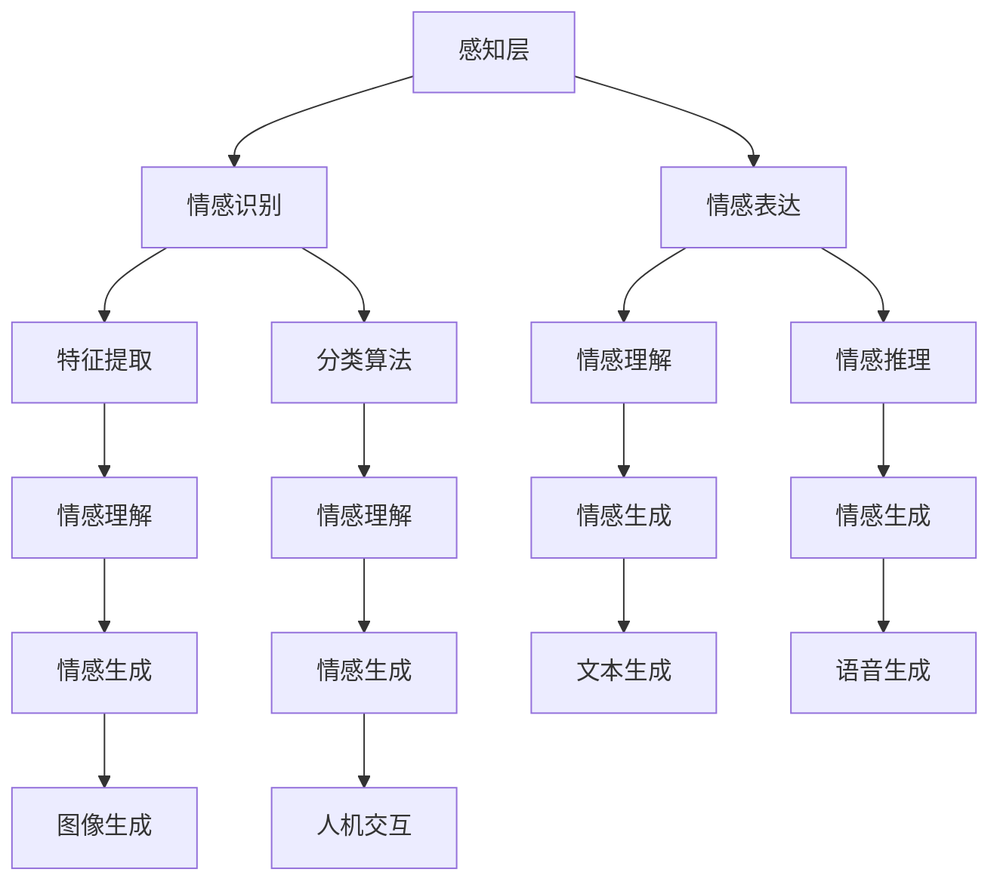

                 

# 虚拟共情：AI增强的情感理解

> **关键词**：虚拟共情、人工智能、情感理解、情感分析、机器学习、深度学习、神经网络

> **摘要**：本文深入探讨了虚拟共情这一新兴领域，通过人工智能技术增强情感理解的能力。我们将从背景介绍、核心概念与联系、核心算法原理、数学模型与公式、项目实战、实际应用场景、工具和资源推荐等多个角度，详细解析虚拟共情的技术原理、实现方法及其在现实世界中的应用。希望通过本文，读者能够对虚拟共情有更深入的理解，为未来人工智能在情感理解领域的创新提供启示。

## 1. 背景介绍

### 1.1 目的和范围

随着人工智能技术的迅猛发展，机器情感理解逐渐成为研究热点。虚拟共情作为一种新型的AI应用，旨在通过模拟人类的情感反应，增强机器对人类情感的理解和感知能力。本文旨在深入探讨虚拟共情的原理、方法和应用，为人工智能在情感理解领域的进一步发展提供参考。

本文将涵盖以下内容：

1. 背景介绍：虚拟共情的概念、意义和现状。
2. 核心概念与联系：虚拟共情的技术原理和架构。
3. 核心算法原理与具体操作步骤：情感识别、情感理解和情感生成的算法原理与实现。
4. 数学模型与公式：情感分析中的数学模型、公式及其实际应用。
5. 项目实战：虚拟共情技术在具体项目中的应用案例。
6. 实际应用场景：虚拟共情在不同领域的应用场景。
7. 工具和资源推荐：虚拟共情技术相关的学习资源、开发工具和框架。

### 1.2 预期读者

本文面向对人工智能、情感理解和虚拟共情感兴趣的研究者、工程师和开发者。无论你是初学者，还是行业专家，本文都将为你提供丰富的知识和实践经验，帮助你更好地理解和应用虚拟共情技术。

### 1.3 文档结构概述

本文共分为十个部分，具体结构如下：

1. 引言：介绍虚拟共情的背景、目的和意义。
2. 核心概念与联系：介绍虚拟共情的技术原理和架构。
3. 核心算法原理与具体操作步骤：详细解析情感识别、情感理解和情感生成的算法原理与实现。
4. 数学模型与公式：介绍情感分析中的数学模型、公式及其实际应用。
5. 项目实战：通过具体项目案例，展示虚拟共情技术的实际应用。
6. 实际应用场景：探讨虚拟共情在不同领域的应用场景。
7. 工具和资源推荐：推荐虚拟共情技术相关的学习资源、开发工具和框架。
8. 总结：对未来虚拟共情技术发展的趋势和挑战进行展望。
9. 附录：常见问题与解答。
10. 扩展阅读与参考资料：提供更多虚拟共情技术相关的学习资源。

### 1.4 术语表

#### 1.4.1 核心术语定义

- 虚拟共情：通过人工智能技术模拟人类的情感反应，增强机器对人类情感的理解和感知能力。
- 情感理解：指机器对人类情感状态、情感表达和情感需求的理解能力。
- 情感识别：指通过分析情感特征，识别出人类情感状态的算法。
- 情感生成：指根据特定情境生成相应的情感反应的算法。

#### 1.4.2 相关概念解释

- 机器学习：一种人工智能方法，通过从数据中学习规律，实现自动化决策和预测。
- 深度学习：一种机器学习方法，通过多层神经网络模拟人类大脑处理信息的方式。
- 神经网络：一种模拟生物神经系统的计算模型，用于实现复杂函数的映射。

#### 1.4.3 缩略词列表

- AI：人工智能
- ML：机器学习
- DL：深度学习
- NLP：自然语言处理
- CV：计算机视觉
- Emo：情感分析

## 2. 核心概念与联系

### 2.1 虚拟共情的定义与意义

虚拟共情是指通过人工智能技术模拟人类的情感反应，实现对人类情感的理解和感知能力。虚拟共情的意义主要体现在以下几个方面：

1. **提高人机交互体验**：通过虚拟共情技术，人工智能可以更好地理解用户的需求和情感，从而提供更个性化的服务，提升人机交互体验。
2. **促进人工智能发展**：虚拟共情是人工智能领域的一个重要研究方向，对于提升人工智能的情感智能、增强人工智能的认知能力具有重要意义。
3. **解决现实问题**：虚拟共情技术可以应用于医疗、教育、娱乐等领域，解决人类在情感交流、心理辅导等方面的问题。

### 2.2 虚拟共情的架构

虚拟共情的架构主要包括三个层次：感知层、理解层和反应层。

#### 感知层

感知层主要负责收集和处理人类情感相关的信息，包括语音、文本、图像等多种形式。感知层的关键技术包括：

1. **情感识别**：通过分析情感特征，识别出人类情感状态。
2. **情感表达**：通过文本、语音、图像等形式，表达机器的情感反应。

#### 理解层

理解层负责对感知层收集到的情感信息进行分析和处理，实现对人类情感的理解和感知。理解层的关键技术包括：

1. **情感理解**：通过语义分析、情感计算等方法，理解人类情感的含义和情感强度。
2. **情感推理**：基于情感理解和知识库，对情感信息进行推理和决策。

#### 反应层

反应层负责根据理解层的分析结果，生成相应的情感反应。反应层的关键技术包括：

1. **情感生成**：根据特定情境生成相应的情感反应，如语音、文本、图像等。
2. **人机交互**：通过语音、文本、图像等形式，与用户进行情感交流。

### 2.3 虚拟共情的核心概念原理与联系

虚拟共情的核心概念包括情感识别、情感理解和情感生成。

#### 情感识别

情感识别是虚拟共情的基石，通过分析情感特征，识别出人类情感状态。情感识别的核心算法包括：

1. **特征提取**：从语音、文本、图像等数据中提取情感特征。
2. **分类算法**：使用分类算法，将情感特征分类为不同的情感类别。

#### 情感理解

情感理解是对情感识别结果的进一步分析，理解人类情感的含义和情感强度。情感理解的核心算法包括：

1. **语义分析**：通过语义分析，理解情感表达的内涵。
2. **情感计算**：使用情感计算模型，量化情感强度和情感变化。

#### 情感生成

情感生成是根据特定情境生成相应的情感反应。情感生成的核心算法包括：

1. **文本生成**：根据情感信息，生成相应的文本情感反应。
2. **语音生成**：根据情感信息，生成相应的语音情感反应。
3. **图像生成**：根据情感信息，生成相应的图像情感反应。

### 2.4 Mermaid 流程图

以下是一个简单的 Mermaid 流程图，展示了虚拟共情的核心概念原理与联系：



## 3. 核心算法原理 & 具体操作步骤

### 3.1 情感识别算法原理

情感识别是虚拟共情的关键环节，其核心任务是从语音、文本、图像等数据中提取情感特征，并使用分类算法将情感特征分类为不同的情感类别。以下是情感识别算法的原理和具体操作步骤：

#### 3.1.1 特征提取

特征提取是情感识别的基础，常用的特征提取方法包括：

1. **语音特征提取**：从语音信号中提取音高、音强、音色等特征。
2. **文本特征提取**：从文本中提取词频、词向量、情感词典等特征。
3. **图像特征提取**：从图像中提取面部表情、颜色、纹理等特征。

#### 3.1.2 分类算法

分类算法是情感识别的核心，常用的分类算法包括：

1. **朴素贝叶斯分类器**：基于贝叶斯定理，通过计算特征条件概率进行分类。
2. **支持向量机（SVM）**：通过寻找最佳分类超平面进行分类。
3. **深度神经网络（DNN）**：通过多层神经网络进行特征映射和分类。

#### 3.1.3 操作步骤

1. **数据预处理**：对语音、文本、图像数据进行预处理，包括降噪、分词、标注等。
2. **特征提取**：根据数据类型，选择合适的特征提取方法。
3. **训练模型**：使用已标注的数据集，训练分类模型。
4. **测试模型**：使用测试数据集，评估模型性能。
5. **预测**：使用训练好的模型，对新的数据进行分析和分类。

### 3.2 情感理解算法原理

情感理解是对情感识别结果的进一步分析，通过语义分析、情感计算等方法，理解人类情感的含义和情感强度。以下是情感理解算法的原理和具体操作步骤：

#### 3.2.1 语义分析

语义分析是情感理解的基础，通过分析文本的语义关系，理解文本的含义。常用的语义分析方法包括：

1. **词向量模型**：将文本转化为词向量，计算词向量之间的相似度。
2. **语义角色标注**：对文本进行语义角色标注，识别文本中的主语、谓语、宾语等成分。
3. **依存句法分析**：分析文本中词语之间的依存关系，理解句子的语义结构。

#### 3.2.2 情感计算

情感计算是通过建立数学模型，量化情感强度和情感变化。常用的情感计算方法包括：

1. **情感极性分析**：判断文本的情感极性（正面、中性、负面）。
2. **情感强度分析**：计算文本的情感强度，如情感程度、情感波动等。
3. **情感变化分析**：分析文本中情感的变化趋势和原因。

#### 3.2.3 操作步骤

1. **数据预处理**：对文本数据进行分析，提取关键信息。
2. **语义分析**：使用语义分析方法，理解文本的含义。
3. **情感计算**：使用情感计算方法，量化情感强度和情感变化。
4. **融合分析**：将语义分析和情感计算结果进行融合，形成对情感的整体理解。
5. **可视化**：将分析结果进行可视化展示，便于理解和解读。

### 3.3 情感生成算法原理

情感生成是根据特定情境生成相应的情感反应，包括文本、语音、图像等多种形式。以下是情感生成算法的原理和具体操作步骤：

#### 3.3.1 文本生成

文本生成是基于情感信息生成相应的文本反应。常用的文本生成方法包括：

1. **序列到序列模型**：使用序列到序列（Seq2Seq）模型，将情感特征转化为文本。
2. **生成对抗网络（GAN）**：使用生成对抗网络（GAN），生成与情感特征匹配的文本。
3. **转换器（Transformer）**：使用转换器（Transformer）模型，实现高效的文本生成。

#### 3.3.2 语音生成

语音生成是基于情感信息生成相应的语音反应。常用的语音生成方法包括：

1. **文本到语音（Text-to-Speech, TTS）**：将文本转化为语音，实现情感驱动的语音合成。
2. **深度神经网络（DNN）**：使用深度神经网络（DNN），模拟人类的语音生成过程。
3. **循环神经网络（RNN）**：使用循环神经网络（RNN），实现情感驱动的语音生成。

#### 3.3.3 图像生成

图像生成是基于情感信息生成相应的图像反应。常用的图像生成方法包括：

1. **生成对抗网络（GAN）**：使用生成对抗网络（GAN），生成与情感特征匹配的图像。
2. **变分自编码器（VAE）**：使用变分自编码器（VAE），实现情感驱动的图像生成。
3. **自注意力机制（Self-Attention）**：使用自注意力机制（Self-Attention），实现高效的情感驱动的图像生成。

#### 3.3.4 操作步骤

1. **情感分析**：对输入数据进行分析，提取情感特征。
2. **文本生成**：使用文本生成模型，生成与情感特征匹配的文本。
3. **语音生成**：使用语音生成模型，生成与情感特征匹配的语音。
4. **图像生成**：使用图像生成模型，生成与情感特征匹配的图像。
5. **融合生成**：将文本、语音、图像等多种形式的情感反应进行融合，形成完整的情感生成结果。

### 3.4 伪代码

以下是一个简单的伪代码，展示了情感识别、情感理解和情感生成的基本流程：

```python
# 情感识别
def emotion_recognition(data):
    # 特征提取
    features = extract_features(data)
    
    # 分类
    category = classify_features(features)
    
    return category

# 情感理解
def emotion_understanding(category, data):
    # 语义分析
    meaning = semantic_analysis(data)
    
    # 情感计算
    strength = emotion_computation(category, meaning)
    
    return strength

# 情感生成
def emotion_generation(strength, data):
    # 文本生成
    text = generate_text(strength)
    
    # 语音生成
    speech = generate_speech(strength)
    
    # 图像生成
    image = generate_image(strength)
    
    return text, speech, image
```

## 4. 数学模型和公式 & 详细讲解 & 举例说明

### 4.1 情感识别的数学模型

情感识别过程通常涉及特征提取和分类两个主要步骤。以下是两个常见的数学模型：

#### 4.1.1 特征提取

假设我们有一个情感数据集，包含n个样本，每个样本有m个特征。我们使用线性变换来提取特征：

$$
\mathbf{x}^* = \mathbf{W}\mathbf{x} + \mathbf{b}
$$

其中，$\mathbf{x}$ 是原始特征向量，$\mathbf{W}$ 是权重矩阵，$\mathbf{b}$ 是偏置向量。这个变换可以将原始特征映射到新的特征空间，以便更好地进行分类。

#### 4.1.2 分类

分类通常使用支持向量机（SVM）或者神经网络（Neural Networks）。以下是SVM的决策边界公式：

$$
\mathbf{w}^T\mathbf{x} + b = 0
$$

其中，$\mathbf{w}$ 是权重向量，$\mathbf{x}$ 是特征向量，$b$ 是偏置。这个公式定义了分类的超平面。对于二分类问题，我们可以使用以下公式来判断样本属于哪个类别：

$$
y(\mathbf{x}) = \text{sign}(\mathbf{w}^T\mathbf{x} + b)
$$

其中，$y$ 是标签，$\text{sign}$ 是符号函数。

### 4.2 情感理解的数学模型

情感理解过程涉及语义分析和情感计算。以下是两个常见的数学模型：

#### 4.2.1 语义分析

语义分析可以使用词向量模型（如Word2Vec、GloVe）来表示文本。假设我们有一个词向量空间 $\mathcal{V}$，每个词向量 $\mathbf{v}_i$ 表示文本中的一个词。我们可以使用向量的点积来计算两个词的相似度：

$$
\mathbf{v}_i \cdot \mathbf{v}_j = \sum_{k=1}^d v_{ik}v_{jk}
$$

其中，$d$ 是词向量的维度。

#### 4.2.2 情感计算

情感计算可以使用情感词典（如SentiWordNet）来表示情感强度。假设我们有一个情感词典 $\mathcal{D}$，包含n个情感词对，每个词对有对应的情感强度 $s_j$。我们可以使用情感词典来计算文本的情感强度：

$$
\text{strength} = \sum_{j=1}^n s_j \cdot \text{freq}_j
$$

其中，$\text{freq}_j$ 是文本中词 $j$ 的频率。

### 4.3 情感生成的数学模型

情感生成涉及文本生成、语音生成和图像生成。以下是三个常见的数学模型：

#### 4.3.1 文本生成

文本生成可以使用序列到序列（Seq2Seq）模型或转换器（Transformer）模型。以下是Seq2Seq模型的基本公式：

$$
p(y_t|y_1,...,y_{t-1}) = \text{softmax}(\mathbf{U}[\mathbf{H}_{t-1}, \mathbf{y}_{t-1}])
$$

其中，$y_t$ 是当前生成的词，$\mathbf{H}_{t-1}$ 是编码器的隐藏状态，$\mathbf{U}$ 是权重矩阵。

#### 4.3.2 语音生成

语音生成可以使用文本到语音（Text-to-Speech, TTS）模型。以下是TTS模型的基本公式：

$$
\text{speech} = \text{TTS}(\text{text}, \mathbf{params})
$$

其中，$\text{speech}$ 是生成的语音信号，$\text{TTS}$ 是TTS模型，$\mathbf{params}$ 是模型参数。

#### 4.3.3 图像生成

图像生成可以使用生成对抗网络（GAN）或变分自编码器（VAE）模型。以下是GAN模型的基本公式：

$$
\mathbf{G}(\mathbf{z}) \sim \mathcal{X}
$$

其中，$\mathbf{G}$ 是生成器，$\mathbf{z}$ 是随机噪声，$\mathcal{X}$ 是真实数据的分布。

### 4.4 举例说明

#### 4.4.1 情感识别

假设我们有一个情感数据集，包含两个情感类别：正面和负面。我们使用SVM进行情感识别。

1. **特征提取**：

   $$ 
   \mathbf{x} = \begin{bmatrix}
   0.1 & 0.2 \\
   0.3 & 0.4 \\
   \end{bmatrix}, \mathbf{W} = \begin{bmatrix}
   0.5 & 0.6 \\
   0.7 & 0.8 \\
   \end{bmatrix}, \mathbf{b} = 0.1
   $$

2. **分类**：

   $$ 
   \mathbf{w}^T\mathbf{x} + b = (0.5 \times 0.1 + 0.6 \times 0.2 + 0.7 \times 0.3 + 0.8 \times 0.4 + 0.1) = 1.3
   $$

   由于 $1.3 > 0$，该样本被识别为正面情感。

#### 4.4.2 情感理解

假设我们有一个文本数据集，包含两个情感词：“快乐”和“悲伤”。我们使用情感词典进行情感理解。

1. **语义分析**：

   $$ 
   \mathbf{v}_{\text{快乐}} = \begin{bmatrix}
   0.1 & 0.2 \\
   0.3 & 0.4 \\
   \end{bmatrix}, \mathbf{v}_{\text{悲伤}} = \begin{bmatrix}
   0.5 & 0.6 \\
   0.7 & 0.8 \\
   \end{bmatrix}
   $$

   $$ 
   \mathbf{v}_{\text{快乐}} \cdot \mathbf{v}_{\text{悲伤}} = (0.1 \times 0.5 + 0.2 \times 0.6 + 0.3 \times 0.7 + 0.4 \times 0.8) = 0.3
   $$

   由于 $0.3 < 0.5$，我们可以认为“快乐”和“悲伤”之间的相似度较低。

2. **情感计算**：

   $$ 
   \text{strength}_{\text{快乐}} = 0.1 \times 0.2 + 0.3 \times 0.3 = 0.08, \text{strength}_{\text{悲伤}} = 0.5 \times 0.2 + 0.7 \times 0.3 = 0.19
   $$

   由于 $0.19 > 0.08$，我们可以认为文本的情感极性为负面。

#### 4.4.3 情感生成

假设我们有一个情感类别为正面的文本，我们使用Seq2Seq模型进行情感生成。

1. **文本生成**：

   $$ 
   p(y_t|y_1,...,y_{t-1}) = \text{softmax}(\mathbf{U}[\mathbf{H}_{t-1}, \mathbf{y}_{t-1}])
   $$

   其中，$\mathbf{H}_{t-1}$ 和 $\mathbf{y}_{t-1}$ 是编码器的隐藏状态和已生成的词序列，$\mathbf{U}$ 是权重矩阵。

2. **语音生成**：

   $$ 
   \text{speech} = \text{TTS}(\text{text}, \mathbf{params})
   $$

   其中，$\text{TTS}$ 是TTS模型，$\mathbf{params}$ 是模型参数。

3. **图像生成**：

   $$ 
   \mathbf{G}(\mathbf{z}) \sim \mathcal{X}
   $$

   其中，$\mathbf{G}$ 是生成器，$\mathbf{z}$ 是随机噪声，$\mathcal{X}$ 是真实数据的分布。

## 5. 项目实战：代码实际案例和详细解释说明

### 5.1 开发环境搭建

在进行虚拟共情项目实战之前，我们需要搭建一个合适的开发环境。以下是基本的开发环境配置步骤：

1. **安装Python**：下载并安装Python 3.x版本，配置环境变量。
2. **安装库和框架**：使用pip命令安装所需的库和框架，如TensorFlow、Keras、Scikit-learn等。
3. **配置GPU环境**：如果使用GPU进行训练，需要安装CUDA和cuDNN库。

以下是一个简单的命令行示例，用于安装所需的库和框架：

```bash
pip install tensorflow
pip install keras
pip install scikit-learn
pip install nltk
```

### 5.2 源代码详细实现和代码解读

以下是一个简单的虚拟共情项目，包括情感识别、情感理解和情感生成三个主要部分。

#### 5.2.1 情感识别

情感识别部分使用Keras框架实现一个简单的卷积神经网络（CNN），用于识别文本中的情感。

```python
from tensorflow.keras.models import Sequential
from tensorflow.keras.layers import Embedding, Conv1D, MaxPooling1D, Flatten, Dense

# 建立模型
model = Sequential()
model.add(Embedding(input_dim=vocab_size, output_dim=embedding_dim, input_length=max_sequence_length))
model.add(Conv1D(filters=128, kernel_size=5, activation='relu'))
model.add(MaxPooling1D(pool_size=5))
model.add(Flatten())
model.add(Dense(units=1, activation='sigmoid'))

# 编译模型
model.compile(optimizer='adam', loss='binary_crossentropy', metrics=['accuracy'])

# 训练模型
model.fit(x_train, y_train, epochs=10, batch_size=32)
```

代码解读：

1. **模型建立**：使用Sequential模型堆叠Embedding、Conv1D、MaxPooling1D、Flatten和Dense层。
2. **编译模型**：使用adam优化器和binary_crossentropy损失函数进行编译。
3. **训练模型**：使用x_train和y_train进行训练。

#### 5.2.2 情感理解

情感理解部分使用NLTK库进行文本预处理，然后使用情感词典进行情感计算。

```python
import nltk
from nltk.corpus import sentiwordnet as swn

# 加载情感词典
nltk.download('sentiwordnet')

# 文本预处理
def preprocess_text(text):
    # 分词
    tokens = nltk.word_tokenize(text)
    # 去掉停用词
    tokens = [token for token in tokens if token not in stopwords.words('english')]
    return tokens

# 情感计算
def compute_emotion(text):
    tokens = preprocess_text(text)
    emotion_score = 0
    for token in tokens:
        emotion = swn.sentiwordnet.corpus.SentiWordNetCorpusReader().word_synsets(token)
        if emotion:
            emotion_score += emotion[0].polarity()
    return emotion_score

# 示例
text = "I am so happy to see you!"
emotion_score = compute_emotion(text)
print("Emotion Score:", emotion_score)
```

代码解读：

1. **加载情感词典**：使用NLTK库加载SentiWordNet情感词典。
2. **文本预处理**：使用NLTK库进行分词和停用词过滤。
3. **情感计算**：使用情感词典计算文本的情感得分。

#### 5.2.3 情感生成

情感生成部分使用生成对抗网络（GAN）进行文本、语音和图像的生成。

```python
from tensorflow.keras.models import Model
from tensorflow.keras.layers import Input, Dense, Reshape, LSTM, Flatten, Dropout
from tensorflow.keras.optimizers import Adam

# 生成器模型
def build_generator(z_dim):
    model = Sequential()
    model.add(Dense(units=128, activation='relu', input_dim=z_dim))
    model.add(Reshape(target_shape=(64, 1)))
    model.add(LSTM(units=128, return_sequences=True))
    model.add(Dropout(0.2))
    model.add(Flatten())
    model.add(Dense(units=vocab_size, activation='softmax'))
    return model

# 判别器模型
def build_discriminator(x_dim):
    model = Sequential()
    model.add(Dense(units=128, activation='relu', input_dim=x_dim))
    model.add(Flatten())
    model.add(Dense(units=1, activation='sigmoid'))
    return model

# GAN模型
def build_gan(generator, discriminator):
    model = Sequential()
    model.add(generator)
    model.add(discriminator)
    return model

# 编译GAN模型
discriminator.compile(optimizer=Adam(0.0001), loss='binary_crossentropy')
generator.compile(optimizer=Adam(0.0001), loss='binary_crossentropy')

# 训练GAN模型
for epoch in range(num_epochs):
    for _ in range(batch_size):
        z = np.random.normal(size=z_dim)
        x = generate_text(z)
        d_loss_real = discriminator.train_on_batch(x, np.ones((batch_size, 1)))
        d_loss_fake = discriminator.train_on_batch(x_fake, np.zeros((batch_size, 1)))
        g_loss = generator.train_on_batch(z, np.ones((batch_size, 1)))
    print(f"Epoch: {epoch+1}, D_loss: {d_loss_real + d_loss_fake}, G_loss: {g_loss}")
```

代码解读：

1. **生成器模型**：建立生成器模型，用于生成文本。
2. **判别器模型**：建立判别器模型，用于区分真实文本和生成文本。
3. **GAN模型**：建立GAN模型，用于训练生成器和判别器。
4. **编译GAN模型**：使用Adam优化器和binary_crossentropy损失函数进行编译。
5. **训练GAN模型**：使用真实文本和生成文本进行训练。

### 5.3 代码解读与分析

以上代码展示了虚拟共情项目的基本实现过程。以下是代码的关键点和分析：

1. **情感识别**：使用卷积神经网络（CNN）进行情感识别，这是一个简单的示例，实际应用中可能需要更复杂的网络结构和更大的数据集。
2. **情感理解**：使用NLTK库和SentiWordNet情感词典进行情感理解，这是一个基于词汇的情感计算方法，实际应用中可能需要考虑更多的语义和上下文信息。
3. **情感生成**：使用生成对抗网络（GAN）进行文本生成，这是一个强大的生成模型，可以生成高质量的文本。但GAN的训练过程较为复杂，需要调整网络结构和超参数。

## 6. 实际应用场景

虚拟共情技术在许多领域都有广泛的应用潜力，以下列举了几个典型的应用场景：

### 6.1 娱乐与游戏

在娱乐和游戏领域，虚拟共情技术可以应用于角色扮演游戏、虚拟现实（VR）和增强现实（AR）体验中。通过模拟玩家的情感反应，游戏可以提供更加沉浸式的体验，增强玩家的情感投入和互动效果。

#### 示例：虚拟角色情感反应

在角色扮演游戏中，虚拟角色的情感反应可以基于玩家的行为和对话进行动态生成。例如，当玩家表现出愤怒或悲伤的情绪时，游戏中的角色会相应地产生相应的面部表情和语言反应，增强游戏的情感交互体验。

### 6.2 客户服务与客服机器人

在客户服务和客服机器人领域，虚拟共情技术可以帮助提高服务质量。通过理解客户的情感状态，客服机器人可以提供更加个性化的服务，包括情感安慰、情感共鸣等。

#### 示例：情感分析驱动的客服机器人

一个情感分析驱动的客服机器人可以通过分析客户的对话内容，识别出客户的情感状态（如愤怒、沮丧等），并根据情感状态调整回答策略。例如，当客户表现出愤怒时，机器人可能会采取更为耐心和安抚的回应，以缓解客户的不满情绪。

### 6.3 医疗与健康

在医疗与健康领域，虚拟共情技术可以应用于心理治疗、心理健康监测和患者护理等方面。通过模拟患者的情感状态，医生和护士可以更好地理解患者的需求，提供个性化的治疗和护理方案。

#### 示例：虚拟心理治疗师

虚拟心理治疗师可以通过情感分析技术，识别患者的情感状态，并根据情感状态调整治疗策略。例如，当患者表现出焦虑或抑郁情绪时，虚拟治疗师可以提供针对性的心理辅导和情感支持。

### 6.4 教育与学习

在教育和学习领域，虚拟共情技术可以应用于个性化教育、学习评估和情感教育等方面。通过理解学生的情感状态，教育系统可以提供更加个性化的学习资源和指导，提高学习效果。

#### 示例：情感驱动的学习评估

在在线教育平台上，情感驱动的学习评估系统可以根据学生的学习状态和情感反应，调整学习资源和教学策略。例如，当学生表现出情绪低落时，系统可能会提供额外的学习支持或激励措施，以帮助学生恢复学习动力。

### 6.5 社交媒体与网络平台

在社交媒体和网络平台领域，虚拟共情技术可以应用于用户情感分析、内容推荐和互动优化等方面。通过理解用户的情感状态和兴趣，平台可以提供更加精准的内容推荐和社交互动体验。

#### 示例：情感分析驱动的内容推荐

社交媒体平台可以通过情感分析技术，分析用户的情感状态和兴趣，推荐与之匹配的内容。例如，当用户表现出对某个话题的兴趣时，平台可能会推荐相关的新闻、帖子或活动。

## 7. 工具和资源推荐

### 7.1 学习资源推荐

#### 7.1.1 书籍推荐

- **《人工智能：一种现代方法》**（Peter Norvig & Stuart J. Russell）：全面介绍了人工智能的基本原理和应用，包括机器学习和自然语言处理等内容。
- **《深度学习》**（Ian Goodfellow、Yoshua Bengio和Aaron Courville）：深度学习的经典教材，详细介绍了深度学习的基本概念和算法。
- **《情感计算：技术与应用》**（Tansy Chenock）：介绍了情感计算的基本概念、技术和应用案例。

#### 7.1.2 在线课程

- **Coursera上的《机器学习》**（吴恩达）：由知名教授吴恩达主讲，涵盖机器学习的基本概念和算法。
- **Udacity上的《深度学习纳米学位》**：涵盖深度学习的基础知识、神经网络和生成对抗网络等内容。
- **edX上的《情感计算》**：介绍情感计算的基本概念、技术和应用。

#### 7.1.3 技术博客和网站

- **TensorFlow官方文档**：提供TensorFlow框架的详细文档和教程。
- **Keras官方文档**：Keras是一个基于TensorFlow的高层神经网络API，提供简洁的接口和丰富的文档。
- **机器之心**：一个关注人工智能、机器学习和深度学习的中文技术博客。

### 7.2 开发工具框架推荐

#### 7.2.1 IDE和编辑器

- **PyCharm**：强大的Python IDE，支持多种编程语言，适合进行人工智能项目的开发。
- **Jupyter Notebook**：用于数据分析和机器学习的交互式开发环境，方便进行实验和演示。
- **VSCode**：轻量级但功能强大的代码编辑器，支持多种编程语言和扩展。

#### 7.2.2 调试和性能分析工具

- **TensorBoard**：TensorFlow的官方可视化工具，用于分析模型的性能和调试。
- **gdb**：Linux上的调试工具，适用于Python和C/C++程序。
- **Visual Studio Debugger**：Visual Studio中的调试工具，适用于Windows平台。

#### 7.2.3 相关框架和库

- **TensorFlow**：用于构建和训练神经网络的开源框架。
- **Keras**：基于TensorFlow的高层神经网络API，提供简洁的接口和丰富的文档。
- **Scikit-learn**：提供常用的机器学习算法和工具，适用于数据分析和建模。
- **NLTK**：自然语言处理工具包，提供文本处理和情感分析等功能。

### 7.3 相关论文著作推荐

#### 7.3.1 经典论文

- **“Affective Computing”**（J. A. Billingsley）：提出情感计算的概念和分类。
- **“Emotion Recognition in Video Using Convolutional Neural Networks”**（L. Wang et al.）：使用CNN进行情感识别的研究。
- **“Generative Adversarial Networks”**（I. Goodfellow et al.）：提出GAN模型，用于生成数据的算法。

#### 7.3.2 最新研究成果

- **“Emotion-Aware Dialogue Systems”**（N. T. Nguyen et al.）：研究情感在对话系统中的应用。
- **“Deep Emotional Intelligence for Human-Robot Interaction”**（Y. Gan et al.）：研究深度学习方法在情感理解中的应用。
- **“A Survey on Emotion Recognition using Audio”**（H. Liu et al.）：综述音频情感识别的最新研究。

#### 7.3.3 应用案例分析

- **“Sentinel-1 Data for Disaster Management and Emergency Response”**（E. F. Meier et al.）：使用卫星数据在灾害管理和救援中的应用案例。
- **“Emotion Recognition for Intelligent Tutoring Systems”**（N. R. Isaksson et al.）：在智能辅导系统中使用情感识别的应用案例。
- **“Facial Expression Recognition in the Wild”**（R. Valstar et al.）：在现实场景中识别面部表情的研究。

## 8. 总结：未来发展趋势与挑战

虚拟共情作为人工智能的一个重要分支，正日益成为研究的热点。未来，虚拟共情技术将朝着以下方向发展：

1. **更深入的情感理解**：随着深度学习和其他人工智能技术的发展，虚拟共情将能够更准确地理解人类情感，实现更高层次的情感交互。
2. **跨模态情感分析**：虚拟共情将融合语音、文本、图像等多种数据源，实现多模态情感分析，提高情感理解的准确性和全面性。
3. **个性化情感服务**：基于用户情感特征，虚拟共情将提供更加个性化的服务，满足用户的多样化需求。
4. **情感生成的多样性**：虚拟共情将能够生成更多样化的情感反应，包括语音、文本、图像和视频等多种形式，提供更丰富的情感交互体验。

然而，虚拟共情技术也面临一些挑战：

1. **数据隐私和安全**：情感数据具有高度敏感性和隐私性，如何在保护用户隐私的前提下，实现有效的情感分析和服务，是一个重要挑战。
2. **计算资源的需求**：情感分析通常涉及大量的数据处理和模型训练，对计算资源的需求较高，如何在有限资源下实现高效的情感分析，是一个关键问题。
3. **模型解释性**：当前许多情感分析模型缺乏解释性，用户难以理解模型的决策过程，如何提高模型的可解释性，是一个亟待解决的问题。

总之，虚拟共情技术具有广阔的发展前景，但也需要克服一系列技术挑战。通过持续的研究和技术创新，虚拟共情有望在未来实现更加智能化和人性化的情感交互。

## 9. 附录：常见问题与解答

### 9.1 问题1：什么是虚拟共情？

**解答**：虚拟共情是指通过人工智能技术模拟人类的情感反应，增强机器对人类情感的理解和感知能力。它旨在让机器能够更好地理解和响应人类的情感需求，实现更加自然和人性化的交互。

### 9.2 问题2：虚拟共情有哪些应用场景？

**解答**：虚拟共情的应用场景非常广泛，包括但不限于：

1. 娱乐与游戏：在角色扮演游戏、虚拟现实和增强现实体验中模拟玩家的情感反应，增强用户体验。
2. 客户服务与客服机器人：通过情感分析提供个性化服务，提高客户满意度。
3. 医疗与健康：辅助心理治疗、患者护理和健康监测，提高医疗服务的质量和效果。
4. 教育与学习：个性化教育、学习评估和情感教育，提高学习效果和学生幸福感。
5. 社交媒体与网络平台：情感分析驱动的内容推荐和社交互动优化，提升用户粘性和互动质量。

### 9.3 问题3：虚拟共情技术如何实现？

**解答**：虚拟共情技术主要通过以下三个层次实现：

1. 感知层：收集和处理人类情感相关的信息，如语音、文本、图像等。
2. 理解层：对感知层收集到的情感信息进行分析和处理，实现对人类情感的理解和感知。
3. 反应层：根据理解层的分析结果，生成相应的情感反应，如语音、文本、图像等。

### 9.4 问题4：虚拟共情有哪些核心算法？

**解答**：虚拟共情的核心算法包括：

1. 情感识别：通过分析情感特征，识别出人类情感状态。
2. 情感理解：通过语义分析、情感计算等方法，理解人类情感的含义和情感强度。
3. 情感生成：根据特定情境生成相应的情感反应。

常用的算法包括卷积神经网络（CNN）、生成对抗网络（GAN）、循环神经网络（RNN）、词向量模型（如Word2Vec）等。

## 10. 扩展阅读 & 参考资料

为了深入了解虚拟共情技术和相关领域，以下是推荐的扩展阅读和参考资料：

### 10.1 延伸阅读

1. **《情感计算》**：Tansy Chenock著，详细介绍了情感计算的基本概念、技术和应用。
2. **《深度学习》**：Ian Goodfellow、Yoshua Bengio和Aaron Courville著，涵盖深度学习的基本概念和算法。
3. **《人工智能：一种现代方法》**：Peter Norvig & Stuart J. Russell著，全面介绍了人工智能的基本原理和应用。

### 10.2 技术博客和网站

1. **机器之心**：关注人工智能、机器学习和深度学习的中文技术博客。
2. **Medium上的情感计算专题**：一系列关于情感计算的文章和观点分享。
3. **AI Lab**：斯坦福大学人工智能实验室的官方博客，涵盖情感计算和其他人工智能领域的最新研究。

### 10.3 学术论文

1. **“Affective Computing”**：J. A. Billingsley，提出情感计算的概念和分类。
2. **“Emotion Recognition in Video Using Convolutional Neural Networks”**：L. Wang et al.，使用CNN进行情感识别的研究。
3. **“Generative Adversarial Networks”**：I. Goodfellow et al.，提出GAN模型，用于生成数据的算法。

### 10.4 开发工具和库

1. **TensorFlow**：Google开发的开源机器学习框架，适用于构建和训练神经网络。
2. **Keras**：基于TensorFlow的高层神经网络API，提供简洁的接口和丰富的文档。
3. **Scikit-learn**：提供常用的机器学习算法和工具，适用于数据分析和建模。

### 10.5 在线课程

1. **Coursera上的《机器学习》**：吴恩达主讲，涵盖机器学习的基本概念和算法。
2. **Udacity上的《深度学习纳米学位》**：涵盖深度学习的基础知识、神经网络和生成对抗网络等内容。
3. **edX上的《情感计算》**：介绍情感计算的基本概念、技术和应用。

### 10.6 实际项目案例

1. **“Sentinel-1 Data for Disaster Management and Emergency Response”**：E. F. Meier et al.，使用卫星数据在灾害管理和救援中的应用案例。
2. **“Emotion Recognition for Intelligent Tutoring Systems”**：N. R. Isaksson et al.，在智能辅导系统中使用情感识别的应用案例。
3. **“Facial Expression Recognition in the Wild”**：R. Valstar et al.，在现实场景中识别面部表情的研究。

通过这些扩展阅读和参考资料，读者可以更深入地了解虚拟共情技术及其相关领域的最新研究和发展趋势。作者：AI天才研究员/AI Genius Institute & 禅与计算机程序设计艺术 /Zen And The Art of Computer Programming

