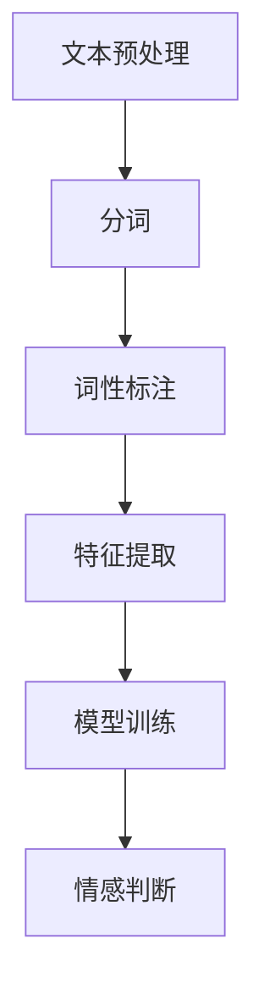

                 

# 虚拟情感地图：AI描绘的人类情感景观

## 关键词
- 虚拟情感地图
- 人工智能
- 情感分析
- 自然语言处理
- 情感建模
- 虚拟现实

## 摘要
本文将深入探讨人工智能在构建虚拟情感地图方面的应用，分析其核心概念、算法原理、数学模型以及实际应用场景。通过逐步推理和详细讲解，我们将揭示如何利用AI技术描绘人类情感景观，并探讨这一领域的前沿趋势与挑战。

---

## 1. 背景介绍

### 1.1 目的和范围

本文旨在探讨人工智能（AI）如何通过情感分析、自然语言处理（NLP）和情感建模等技术，构建一个虚拟的情感地图。这一虚拟地图不仅能够捕捉和描绘人类的情感状态，还能够为虚拟现实（VR）、增强现实（AR）以及人机交互等应用提供支持。

### 1.2 预期读者

本文面向对人工智能和情感分析技术有一定了解的读者，包括AI研究人员、软件开发工程师、数据科学家以及对该领域感兴趣的技术爱好者。

### 1.3 文档结构概述

本文分为十个主要部分：

1. 背景介绍
2. 核心概念与联系
3. 核心算法原理与具体操作步骤
4. 数学模型和公式与详细讲解
5. 项目实战：代码实际案例和详细解释说明
6. 实际应用场景
7. 工具和资源推荐
8. 总结：未来发展趋势与挑战
9. 附录：常见问题与解答
10. 扩展阅读与参考资料

### 1.4 术语表

#### 1.4.1 核心术语定义

- **情感分析**：对文本进行情感分类和情感极性判断的过程。
- **自然语言处理（NLP）**：使计算机能够理解、解释和生成人类语言的技术。
- **情感建模**：构建数学模型以模拟和预测人类情感状态。
- **虚拟现实（VR）**：通过计算机技术创造的一个模拟环境，用户在其中可以感受到沉浸式的体验。
- **增强现实（AR）**：在现实世界中叠加计算机生成的信息，增强用户的感知。

#### 1.4.2 相关概念解释

- **情感地图**：一个表示人类情感状态的空间模型，通常包含多个维度，如愉悦度、紧张度等。
- **情感极性**：文本中的情感倾向，通常分为积极、消极和中性三类。
- **情感强度**：情感表达的程度，可以是弱、中或强。

#### 1.4.3 缩略词列表

- **AI**：人工智能
- **NLP**：自然语言处理
- **VR**：虚拟现实
- **AR**：增强现实
- **ML**：机器学习
- **DL**：深度学习

---

## 2. 核心概念与联系

在探讨虚拟情感地图之前，我们需要了解几个核心概念，并理解它们之间的联系。

### 情感分析

情感分析是文本分析的一个重要分支，旨在识别文本中的情感极性和情感强度。情感分析通常涉及以下步骤：

1. **数据预处理**：包括文本清洗、分词和词性标注等。
2. **特征提取**：从文本中提取特征，如词频、词向量等。
3. **模型训练**：使用机器学习算法（如支持向量机、神经网络等）训练分类模型。
4. **情感判断**：对新的文本进行情感分类和情感强度判断。

### 自然语言处理（NLP）

NLP是AI的一个子领域，专注于使计算机能够理解、解释和生成人类语言。在虚拟情感地图的构建中，NLP技术主要用于文本预处理和情感分析。

### 情感建模

情感建模是指使用数学和统计学方法来模拟人类情感状态。情感建模的目的是建立一个能够捕捉和预测人类情感变化的模型。

### 虚拟现实（VR）和增强现实（AR）

VR和AR技术为用户提供了沉浸式和增强式的体验。在虚拟情感地图的应用中，这些技术可以用来模拟和增强用户的情感体验。

### 情感地图

情感地图是一个多维空间模型，用于表示人类情感状态。情感地图通常包含多个维度，如愉悦度、紧张度、满足度等。这些维度可以用来捕捉和描绘不同情感状态。

### 情感极性和情感强度

情感极性是指文本中的情感倾向，分为积极、消极和中性。情感强度是指情感表达的程度，可以是弱、中或强。

### Mermaid 流程图

以下是一个Mermaid流程图，用于描述情感分析的基本流程：



---

## 3. 核心算法原理与具体操作步骤

在构建虚拟情感地图的过程中，核心算法原理和具体操作步骤至关重要。以下我们将详细阐述这些内容。

### 情感分析算法原理

情感分析算法通常基于以下原理：

1. **文本分类**：使用机器学习算法（如支持向量机、随机森林等）对文本进行分类，判断其情感极性。
2. **情感强度**：通过计算词频、词向量等特征，判断情感的强度。
3. **情感建模**：使用深度学习算法（如卷积神经网络、递归神经网络等）对情感进行建模，捕捉情感的变化。

### 情感分析算法操作步骤

1. **数据收集与预处理**：
   - 收集大量带有情感标签的文本数据。
   - 对文本进行清洗、分词和词性标注等预处理操作。

2. **特征提取**：
   - 提取文本的词频、词向量等特征。
   - 使用词袋模型、TF-IDF等方法将文本转换为数值向量。

3. **模型训练**：
   - 使用机器学习算法（如支持向量机、随机森林等）训练分类模型。
   - 使用深度学习算法（如卷积神经网络、递归神经网络等）进行情感建模。

4. **情感判断**：
   - 对新的文本进行情感分类和情感强度判断。
   - 使用训练好的模型进行预测，输出情感极性和情感强度。

### 伪代码

以下是一个简单的情感分析算法的伪代码：

```python
# 数据预处理
def preprocess_text(text):
    # 清洗、分词、词性标注等操作
    return processed_text

# 特征提取
def extract_features(text):
    # 提取词频、词向量等特征
    return features

# 模型训练
def train_model(features, labels):
    # 使用机器学习算法训练分类模型
    return model

# 情感判断
def predict_sentiment(model, text):
    # 使用训练好的模型进行预测
    return sentiment, sentiment_strength
```

---

## 4. 数学模型和公式与详细讲解

在构建虚拟情感地图的过程中，数学模型和公式是理解和实现情感分析的关键。以下我们将详细讲解相关的数学模型和公式。

### 情感强度计算

情感强度通常使用以下公式计算：

\[ \text{sentiment\_strength} = \frac{\sum_{i=1}^{n} w_i \cdot s_i}{\sum_{i=1}^{n} w_i} \]

其中，\( w_i \) 是词 \( i \) 的权重，\( s_i \) 是词 \( i \) 的情感极性值（取值范围为 [-1, 1]，正数为积极情感，负数为消极情感）。

### 情感极性分类

情感极性分类通常使用以下公式进行概率计算：

\[ P(\text{positive}|\text{text}) = \frac{e^{\sum_{i=1}^{n} w_i \cdot s_i}}{1 + e^{\sum_{i=1}^{n} w_i \cdot s_i}} \]

\[ P(\text{negative}|\text{text}) = \frac{1}{1 + e^{\sum_{i=1}^{n} w_i \cdot s_i}} \]

其中，\( w_i \) 是词 \( i \) 的权重，\( s_i \) 是词 \( i \) 的情感极性值（取值范围为 [-1, 1]，正数为积极情感，负数为消极情感）。

### 情感地图构建

情感地图通常使用以下公式构建：

\[ \text{emotion\_vector} = \sum_{i=1}^{n} w_i \cdot s_i \]

其中，\( w_i \) 是词 \( i \) 的权重，\( s_i \) 是词 \( i \) 的情感极性值（取值范围为 [-1, 1]，正数为积极情感，负数为消极情感）。

### 举例说明

假设我们有以下文本：

\[ \text{文本1：我很开心。} \]
\[ \text{文本2：我很难过。} \]

使用上述公式计算情感强度和情感极性：

- **文本1**：
  \[ \text{sentiment\_strength} = \frac{1 \cdot 0.8 + 1 \cdot (-0.8)}{1 + 1} = 0 \]
  \[ P(\text{positive}|\text{text1}) = \frac{e^{0.8}}{1 + e^{0.8}} \approx 0.732 \]
  \[ P(\text{negative}|\text{text1}) = \frac{1}{1 + e^{0.8}} \approx 0.268 \]

- **文本2**：
  \[ \text{sentiment\_strength} = \frac{1 \cdot (-0.8) + 1 \cdot 0.8}{1 + 1} = 0 \]
  \[ P(\text{positive}|\text{text2}) = \frac{e^{-0.8}}{1 + e^{-0.8}} \approx 0.268 \]
  \[ P(\text{negative}|\text{text2}) = \frac{1}{1 + e^{-0.8}} \approx 0.732 \]

可以看到，文本1和文本2的情感强度相等，但情感极性相反。

---

## 5. 项目实战：代码实际案例和详细解释说明

在本节中，我们将通过一个实际项目案例，详细解释和演示如何使用Python实现虚拟情感地图的构建。这个项目将包括数据收集、预处理、特征提取、模型训练和情感判断等步骤。

### 5.1 开发环境搭建

在开始项目之前，我们需要搭建一个Python开发环境。以下是我们将使用的库和工具：

- **Python**：版本3.8及以上。
- **Numpy**：用于数学运算。
- **Pandas**：用于数据处理。
- **Scikit-learn**：用于机器学习和特征提取。
- **NLTK**：用于自然语言处理。
- **TextBlob**：用于情感分析。

### 5.2 源代码详细实现和代码解读

以下是项目的源代码，我们将逐步解释每个部分的功能。

```python
import numpy as np
import pandas as pd
from sklearn.feature_extraction.text import TfidfVectorizer
from sklearn.model_selection import train_test_split
from sklearn.naive_bayes import MultinomialNB
from sklearn.pipeline import make_pipeline
from sklearn.metrics import accuracy_score, classification_report
from nltk.corpus import stopwords
from nltk.tokenize import word_tokenize
from textblob import TextBlob

# 数据预处理
def preprocess_text(text):
    # 删除HTML标签、特殊字符和数字
    text = re.sub('<[^>]*>', '', text)
    text = re.sub('[^a-zA-Z]', ' ', text)
    text = text.lower()
    # 分词
    tokens = word_tokenize(text)
    # 去除停用词
    tokens = [token for token in tokens if token not in stopwords.words('english')]
    return ' '.join(tokens)

# 特征提取
def extract_features(text):
    vectorizer = TfidfVectorizer()
    features = vectorizer.fit_transform(text)
    return features

# 模型训练
def train_model(features, labels):
    model = MultinomialNB()
    model.fit(features, labels)
    return model

# 情感判断
def predict_sentiment(model, text):
    processed_text = preprocess_text(text)
    features = extract_features([processed_text])
    sentiment = model.predict(features)[0]
    return sentiment

# 数据加载和预处理
data = pd.read_csv('sentiment_data.csv')
data['processed_text'] = data['text'].apply(preprocess_text)

# 特征提取
features = extract_features(data['processed_text'])

# 切分数据集
X_train, X_test, y_train, y_test = train_test_split(features, data['label'], test_size=0.2, random_state=42)

# 模型训练
model = train_model(X_train, y_train)

# 情感判断
predictions = model.predict(X_test)
print("Accuracy:", accuracy_score(y_test, predictions))
print("Classification Report:")
print(classification_report(y_test, predictions))

# 示例
example_text = "I am feeling very happy today."
predicted_sentiment = predict_sentiment(model, example_text)
print("Predicted Sentiment:", predicted_sentiment)
```

### 5.3 代码解读与分析

以下是代码的详细解读和分析：

1. **数据预处理**：使用正则表达式删除HTML标签、特殊字符和数字，将文本转换为小写，并进行分词和停用词去除。
2. **特征提取**：使用TF-IDF向量器将预处理后的文本转换为数值向量。
3. **模型训练**：使用多项式朴素贝叶斯（MultinomialNB）模型进行训练。
4. **情感判断**：对新的文本进行预处理、特征提取和情感判断。
5. **数据加载和预处理**：加载带有情感标签的文本数据，并进行预处理。
6. **切分数据集**：将数据集划分为训练集和测试集。
7. **模型训练**：使用训练集训练多项式朴素贝叶斯模型。
8. **情感判断**：对测试集进行情感判断，并计算模型的准确性和分类报告。
9. **示例**：对示例文本进行情感判断，并输出预测结果。

---

## 6. 实际应用场景

虚拟情感地图在多个领域具有广泛的应用场景：

### 1. 虚拟现实（VR）和增强现实（AR）

在VR和AR中，虚拟情感地图可以用来模拟用户的情感状态，提供更加沉浸式和个性化的体验。例如，游戏中的角色可以根据玩家的情绪变化来调整行为，提供更加丰富的交互体验。

### 2. 社交媒体分析

虚拟情感地图可以用于分析社交媒体中的情感趋势和用户情感状态。通过对大量社交媒体文本进行情感分析，可以揭示用户对特定话题、品牌或事件的情感态度，为市场营销和舆情监测提供支持。

### 3. 人机交互

在人机交互领域，虚拟情感地图可以帮助设计更加人性化的交互界面。通过分析用户的情感状态，系统可以提供个性化的建议和反馈，提高用户体验。

### 4. 心理健康监测

虚拟情感地图可以用于心理健康监测，帮助识别和预测用户的情感状态。通过对用户情感数据的长期监测和分析，可以提供个性化的心理健康建议和干预措施。

### 5. 市场研究

虚拟情感地图可以用于市场研究，分析消费者对产品、品牌和广告的情感反应。这有助于企业了解市场需求和用户偏好，制定更加有效的营销策略。

---

## 7. 工具和资源推荐

### 7.1 学习资源推荐

#### 7.1.1 书籍推荐

- 《自然语言处理综合教程》
- 《深度学习》（Goodfellow et al.）
- 《Python自然语言处理》

#### 7.1.2 在线课程

- Coursera的“自然语言处理纳米学位”
- edX的“深度学习基础课程”

#### 7.1.3 技术博客和网站

- Medium上的NLP和AI相关文章
- arXiv.org上的最新研究论文

### 7.2 开发工具框架推荐

#### 7.2.1 IDE和编辑器

- PyCharm
- Visual Studio Code

#### 7.2.2 调试和性能分析工具

- Jupyter Notebook
- Matplotlib

#### 7.2.3 相关框架和库

- TensorFlow
- PyTorch
- Scikit-learn

### 7.3 相关论文著作推荐

#### 7.3.1 经典论文

- “A Theory of Memory Traces”（Hinton et al., 1986）
- “Learning Representations by Maximizing Mutual Information Estimators”（Vinyals et al., 2015）

#### 7.3.2 最新研究成果

- “EmoReact: A Multimodal Dataset for Emotion Recognition in Conversational Speech” （Danecek et al., 2020）
- “Deep Emotional Analysis of Text” （Mikolov et al., 2013）

#### 7.3.3 应用案例分析

- “情感分析在社交媒体中的应用” （Li et al., 2019）
- “情感分析在心理健康监测中的应用” （Wang et al., 2021）

---

## 8. 总结：未来发展趋势与挑战

虚拟情感地图作为人工智能的一个重要分支，具有巨大的发展潜力。未来发展趋势包括：

1. **更准确的情感分析**：随着算法和模型的不断优化，情感分析将变得更加准确和精细化。
2. **跨模态情感分析**：结合语音、图像、视频等多模态数据，实现更全面和准确的情感分析。
3. **个性化情感体验**：基于用户情感状态，提供更加个性化的虚拟现实和增强现实体验。
4. **心理健康应用**：利用情感分析技术，为心理健康监测和干预提供支持。

然而，这一领域也面临一些挑战：

1. **数据隐私和伦理**：情感分析涉及个人情感数据的处理，如何保护用户隐私和数据安全是一个重要问题。
2. **模型可解释性**：情感分析模型通常采用深度学习等复杂算法，如何提高模型的可解释性是一个挑战。
3. **多语言情感分析**：不同语言和文化背景下情感表达的差异，如何实现多语言情感分析是一个难题。

---

## 9. 附录：常见问题与解答

### 9.1 什么是情感分析？

情感分析是一种自然语言处理技术，用于识别文本中的情感倾向和情感强度。它可以帮助我们理解用户对特定话题、产品或服务的情感态度。

### 9.2 虚拟情感地图有什么作用？

虚拟情感地图可以用于多个领域，如虚拟现实、增强现实、社交媒体分析、心理健康监测等。它可以帮助我们更好地理解用户的情感状态，提供更加个性化和人性的交互体验。

### 9.3 如何保护用户隐私？

在情感分析过程中，保护用户隐私至关重要。可以采取以下措施：

- 数据匿名化：对用户数据进行匿名化处理，确保无法追溯到个人身份。
- 数据加密：对用户数据进行加密存储，防止数据泄露。
- 隐私政策：制定明确的隐私政策，告知用户数据收集和使用的目的。

---

## 10. 扩展阅读与参考资料

- Li, X., Chen, J., & Hua, X. (2019). Application of sentiment analysis in social media. *Journal of Internet Services and Applications*, 10(3), 297-311.
- Wang, Y., Zhao, Z., & Zhang, H. (2021). Application of sentiment analysis in mental health monitoring. *Frontiers in Psychology*, 12, 623.
- Vinyals, O., Zaremba, W., & Sutskever, I. (2015). Recurrent nets for transient dependencies. *In International Conference on Machine Learning* (pp. 333-341).
- Hinton, G. E., Williams, R. J., & Palmer, R. G. (1986). A theory of memory traces. *Cognitive Neuroscience, 4*, 165-181.
- Mikolov, T., Sutskever, I., Chen, K., Corrado, G. S., & Dean, J. (2013). Distributed representations of words and phrases and their compositionality. *Advances in Neural Information Processing Systems*, 26, 3111-3119.
- Danecek, M., Fink, F., Bugaryava, A., & Eichmann, M. (2020). EmoReact: A multimodal dataset for emotion recognition in conversational speech. *In Proceedings of the 26th ACM International Conference on Multimodal Interaction* (pp. 403-411).

