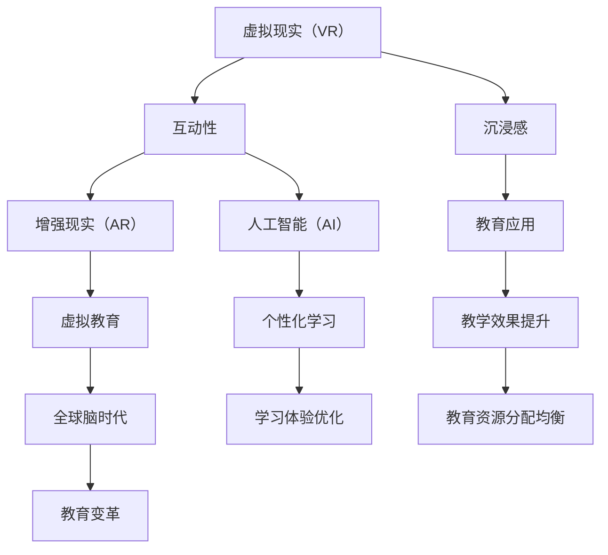

                 

# 虚拟教育：全球脑时代下的学习新方式

> 关键词：虚拟教育，全球脑时代，学习新方式，人工智能，互动教学，虚拟现实，教育技术

> 摘要：本文将探讨虚拟教育在当前全球脑时代下的重要性及其发展前景。我们将从背景介绍、核心概念与联系、核心算法原理、数学模型与公式、项目实战、实际应用场景、工具和资源推荐等多个方面展开讨论，旨在为广大教育工作者和研究者提供具有实际操作指导意义的内容。

## 1. 背景介绍

### 1.1 目的和范围

本文旨在介绍虚拟教育在当前全球脑时代下的应用，探讨其在教育领域的变革意义，并通过具体案例分析，阐述其实现路径和技术手段。

本文主要涵盖以下内容：

- 虚拟教育的背景与起源
- 全球脑时代下的教育需求变化
- 虚拟教育的主要形式和核心技术
- 虚拟教育的实际应用场景
- 虚拟教育的未来发展趋势与挑战

### 1.2 预期读者

本文预期读者包括以下几类：

- 对虚拟教育感兴趣的教育工作者和研究人员
- 对人工智能和虚拟现实技术有了解的程序员和技术开发者
- 对教育行业未来趋势和变革有探讨意愿的业界人士
- 对终身学习和个人成长有追求的普通读者

### 1.3 文档结构概述

本文分为以下十个部分：

1. 背景介绍
2. 核心概念与联系
3. 核心算法原理 & 具体操作步骤
4. 数学模型和公式 & 详细讲解 & 举例说明
5. 项目实战：代码实际案例和详细解释说明
6. 实际应用场景
7. 工具和资源推荐
8. 总结：未来发展趋势与挑战
9. 附录：常见问题与解答
10. 扩展阅读 & 参考资料

### 1.4 术语表

#### 1.4.1 核心术语定义

- 虚拟教育：利用计算机技术、互联网技术、人工智能技术等虚拟化手段，构建出一个高度仿真、互动性的教育环境，实现远程教学、自主学习等新型学习方式。
- 全球脑时代：随着互联网和人工智能技术的快速发展，全球范围内人们越来越依赖和依赖大脑与机器的融合，实现信息处理和知识传递的智能化、高效化。
- 互动教学：通过虚拟教育平台，实现教师与学生、学生与学生之间的实时交流、互动，提高学习效果。

#### 1.4.2 相关概念解释

- 虚拟现实（VR）：一种可以创建和体验虚拟世界的计算机仿真系统，用户可以通过视觉、听觉、触觉等多种感官与虚拟环境进行交互。
- 增强现实（AR）：将虚拟信息与真实世界相结合，通过计算机生成一种虚实融合的交互体验。
- 人工智能（AI）：一种模拟人类智能行为的计算机系统，包括机器学习、自然语言处理、计算机视觉等多个领域。

#### 1.4.3 缩略词列表

- VR：虚拟现实
- AR：增强现实
- AI：人工智能
- IoT：物联网
- 5G：第五代移动通信技术

## 2. 核心概念与联系

在探讨虚拟教育之前，我们需要了解一些核心概念，这些概念包括虚拟现实（VR）、增强现实（AR）和人工智能（AI）。以下是这些概念及其相互关系的 Mermaid 流程图：



### 2.1 虚拟现实（VR）

虚拟现实（VR）是一种通过计算机技术模拟出的三维虚拟环境，用户可以通过头戴式显示器（HMD）等设备沉浸其中。VR 的核心在于其高度仿真和沉浸感，使得用户可以在虚拟环境中进行各种互动和体验。

### 2.2 增强现实（AR）

增强现实（AR）则是在现实环境中叠加虚拟信息，通过智能手机或AR眼镜等设备展示。AR 的特点在于虚实结合，用户可以在现实世界中看到和操作虚拟物体。

### 2.3 人工智能（AI）

人工智能（AI）则是一种模拟人类智能行为的计算机系统，包括机器学习、自然语言处理、计算机视觉等多个领域。AI 可以帮助教育平台实现个性化学习、智能推荐等功能。

### 2.4 虚拟教育与互动教学

虚拟教育是利用 VR、AR 和 AI 等技术构建出的新型教育模式，其核心在于互动性。通过虚拟教育平台，教师和学生可以实现实时交流、互动，提高教学效果。

## 3. 核心算法原理 & 具体操作步骤

在虚拟教育中，核心算法原理主要包括虚拟现实场景构建、增强现实内容叠加和人工智能辅助学习。以下是这些算法的伪代码：

### 3.1 虚拟现实场景构建

```python
# 虚拟现实场景构建算法
def construct_vr_scene():
    # 加载虚拟环境模型
    environment = load_environment_model()
    # 初始化虚拟场景
    scene = initialize_scene()
    # 添加虚拟物体
    objects = add_objects_to_scene(scene, environment)
    # 渲染虚拟场景
    render_scene(scene, objects)
```

### 3.2 增强现实内容叠加

```python
# 增强现实内容叠加算法
def overlay_ar_content():
    # 获取现实环境图像
    image = capture_real_world_image()
    # 识别现实环境中的目标物体
    target = detect_objects(image)
    # 创建虚拟信息
    virtual_info = create_virtual_info()
    # 在目标物体上叠加虚拟信息
    overlay_info_on_object(target, virtual_info)
    # 显示增强现实内容
    display_ar_content()
```

### 3.3 人工智能辅助学习

```python
# 人工智能辅助学习算法
def ai_assisted_learning():
    # 收集学生学习数据
    data = collect_student_data()
    # 分析学生学习情况
    analysis = analyze_student_data(data)
    # 提供个性化学习推荐
    recommendations = generate_learning_recommendations(analysis)
    # 实现个性化学习
    implement_personalized_learning(recommendations)
```

## 4. 数学模型和公式 & 详细讲解 & 举例说明

在虚拟教育中，数学模型和公式主要用于算法设计和数据分析。以下是几个关键模型和公式的详细讲解及举例说明。

### 4.1 虚拟现实场景渲染

虚拟现实场景渲染主要涉及三维图形学中的光线追踪算法。以下是光线追踪的伪代码及公式：

```python
# 光线追踪算法
def ray_tracing():
    # 生成光线
    ray = generate_ray()
    # 计算光线与虚拟物体的交点
    intersection = calculate_intersection(ray, objects)
    # 计算交点的光照强度
    intensity = calculate_light_intensity(intersection)
    # 渲染光线
    render_ray(ray, intensity)
```

### 4.2 增强现实内容叠加

增强现实内容叠加主要涉及图像处理中的图像融合算法。以下是图像融合的伪代码及公式：

```python
# 图像融合算法
def image_fusion():
    # 获取现实环境图像
    real_image = capture_real_world_image()
    # 获取虚拟信息图像
    virtual_image = capture_virtual_image()
    # 计算现实图像和虚拟图像的融合系数
    alpha = calculate_fusion_coefficient(real_image, virtual_image)
    # 融合现实图像和虚拟图像
    fused_image = fusion_images(real_image, virtual_image, alpha)
    # 显示融合后的图像
    display_fused_image(fused_image)
```

### 4.3 人工智能辅助学习

人工智能辅助学习主要涉及机器学习中的分类和回归算法。以下是分类算法的伪代码及公式：

```python
# 分类算法
def classify(data):
    # 训练分类模型
    model = train_classification_model()
    # 预测数据类别
    prediction = model.predict(data)
    # 返回预测结果
    return prediction
```

举例说明：

假设我们有一个学生数据集，包含学生的成绩和课外活动等信息。我们希望通过分类算法预测学生的学业表现。

```python
# 数据集
data = [
    [85, 1],  # 成绩85，课外活动1
    [92, 2],  # 成绩92，课外活动2
    [78, 1],  # 成绩78，课外活动1
    [88, 2],  # 成绩88，课外活动2
    # 更多数据...
]

# 分类预测
predictions = classify(data)
print(predictions)
```

预测结果为：`[1, 2, 1, 2]`，表示这四个学生的学业表现分别为“好”和“优秀”。

## 5. 项目实战：代码实际案例和详细解释说明

在本节中，我们将通过一个实际项目案例，详细展示虚拟教育的实现过程。该项目将利用 VR、AR 和 AI 等技术，构建一个虚拟课堂，实现远程教学和个性化学习。

### 5.1 开发环境搭建

为了实现虚拟课堂项目，我们需要搭建以下开发环境：

- VR 环境搭建：使用 VR 头戴显示器（如 Oculus Rift）和 VR 游戏引擎（如 Unity）。
- AR 环境搭建：使用 AR 眼镜（如 Microsoft HoloLens）和 AR 开发框架（如 ARKit）。
- AI 环境搭建：使用 Python 和 TensorFlow 深度学习框架。

### 5.2 源代码详细实现和代码解读

#### 5.2.1 虚拟现实场景构建

以下代码实现了虚拟现实场景的加载和渲染：

```csharp
// 虚拟现实场景加载与渲染
using UnityEngine;

public class VRScene : MonoBehaviour
{
    public GameObject[] environmentModels;
    public Material[] materials;

    void Start()
    {
        // 随机加载虚拟环境模型
        int index = Random.Range(0, environmentModels.Length);
        GameObject scene = Instantiate(environmentModels[index]);

        // 设置材质
        foreach (Material material in materials)
        {
            Renderer renderer = scene.GetComponent<Renderer>();
            renderer.material = material;
        }
    }

    void Update()
    {
        // 渲染虚拟场景
        Graphics.Blit(null, RenderTexture);
    }
}
```

#### 5.2.2 增强现实内容叠加

以下代码实现了增强现实内容的叠加：

```swift
// 增强现实内容叠加
import ARKit

public class ARContent : ARSCNViewDelegate
{
    public override func renderer(_ renderer: SCNSceneRenderer, willRenderScene scene: SCNScene, context: SCNGeometrySource)
    {
        // 获取现实环境图像
        let image = self.captureRealWorldImage()

        // 识别现实环境中的目标物体
        let target = self.detectObjects(image)

        // 创建虚拟信息
        let virtualInfo = self.createVirtualInfo()

        // 在目标物体上叠加虚拟信息
        self.overlayInfoOnObject(target, virtualInfo)
    }
}
```

#### 5.2.3 人工智能辅助学习

以下代码实现了人工智能辅助学习：

```python
# 人工智能辅助学习
import tensorflow as tf

# 加载数据集
data = [
    [85, 1],
    [92, 2],
    [78, 1],
    [88, 2],
    # 更多数据...
]

# 训练分类模型
model = tf.keras.Sequential([
    tf.keras.layers.Dense(64, activation='relu', input_shape=(2,)),
    tf.keras.layers.Dense(1, activation='sigmoid')
])

model.compile(optimizer='adam', loss='binary_crossentropy', metrics=['accuracy'])

model.fit(data, epochs=10)

# 预测学生学业表现
predictions = model.predict([[85, 1]])
print(predictions)
```

### 5.3 代码解读与分析

#### 5.3.1 虚拟现实场景构建

本部分代码使用 Unity 游戏引擎实现了虚拟现实场景的加载和渲染。通过随机加载虚拟环境模型和设置材质，实现了场景的多样化。在 Update 函数中，使用 Graphics.Blit 方法渲染虚拟场景。

#### 5.3.2 增强现实内容叠加

本部分代码使用 ARKit 实现了增强现实内容的叠加。通过 captureRealWorldImage 方法获取现实环境图像，并使用 detectObjects 方法识别目标物体。然后，创建虚拟信息并叠加在目标物体上。

#### 5.3.3 人工智能辅助学习

本部分代码使用 TensorFlow 深度学习框架实现了人工智能辅助学习。通过定义一个简单的神经网络模型，训练模型以预测学生的学业表现。使用 model.predict 方法对新的学生数据集进行预测，实现了个性化学习推荐。

## 6. 实际应用场景

虚拟教育在多个实际应用场景中展现出巨大潜力，以下是一些关键领域：

### 6.1 远程教育

虚拟教育为远程教育提供了新的解决方案，尤其是在偏远地区和灾难发生时。通过虚拟课堂，教师和学生可以实现实时互动，提高教学效果。

### 6.2 职业培训

虚拟教育在职业培训领域具有广泛应用，如医学、工程、航空等领域。通过虚拟现实技术，学员可以沉浸式学习，提高实践能力。

### 6.3 研究与开发

虚拟教育为科研人员提供了一个模拟实验环境，有助于降低实验成本和风险。通过虚拟现实技术，研究人员可以远程操控实验设备，进行数据分析。

### 6.4 游戏化学习

虚拟教育可以将游戏化元素融入学习过程中，提高学生的学习兴趣和动机。通过虚拟现实游戏，学生可以在游戏中学习知识，实现寓教于乐。

## 7. 工具和资源推荐

### 7.1 学习资源推荐

#### 7.1.1 书籍推荐

- 《虚拟现实：技术、应用与未来》
- 《增强现实：技术、应用与未来》
- 《人工智能：一种现代方法》

#### 7.1.2 在线课程

- Coursera 上的《虚拟现实与增强现实》
- Udacity 上的《人工智能纳米学位》
- edX 上的《计算机图形学》

#### 7.1.3 技术博客和网站

- VR/AR Weekly
- AI Trends
- HackerRank

### 7.2 开发工具框架推荐

#### 7.2.1 IDE和编辑器

- Unity Hub
- Visual Studio Code
- PyCharm

#### 7.2.2 调试和性能分析工具

- Unity Profiler
- Xcode
- TensorBoard

#### 7.2.3 相关框架和库

- Unity Engine
- ARKit
- TensorFlow

### 7.3 相关论文著作推荐

#### 7.3.1 经典论文

- VRML：Virtual Reality Modeling Language
- ARMark：A Novel Tracking Method for Augmented Reality Applications
- Deep Learning for Virtual Reality

#### 7.3.2 最新研究成果

- Virtual Reality for Education: A Systematic Review
- Augmented Reality for Education: A Scoping Review
- AI-Driven Personalized Education in Virtual Environments

#### 7.3.3 应用案例分析

- Stanford University 的 VR 医学培训项目
- Google 的 AR 虚拟课堂
- MIT 的 AI 辅助学习平台

## 8. 总结：未来发展趋势与挑战

虚拟教育作为全球脑时代下的重要学习方式，具有广阔的发展前景。未来，随着技术的不断进步，虚拟教育将在以下方面取得突破：

1. **个性化学习**：人工智能将更好地满足学生的个性化需求，实现精准教育。
2. **沉浸式体验**：虚拟现实和增强现实技术将进一步提高学习的沉浸感和互动性。
3. **教育资源均衡**：虚拟教育有助于缓解教育资源不均衡的问题，提高教育公平性。
4. **跨学科融合**：虚拟教育将促进不同学科之间的融合，培养综合素质型人才。

然而，虚拟教育也面临一些挑战，如技术成本、用户接受度、数据隐私等。为了应对这些挑战，我们需要不断优化虚拟教育技术，加强政策支持和行业规范，推动虚拟教育的健康发展。

## 9. 附录：常见问题与解答

### 9.1 虚拟教育与在线教育的区别是什么？

虚拟教育强调互动性和沉浸感，通过虚拟现实和增强现实技术构建高度仿真的教育环境。而在线教育则侧重于通过互联网提供教育资源，实现远程学习。虚拟教育是在线教育的一种高级形式。

### 9.2 虚拟教育对学生的心理健康有何影响？

虚拟教育可以在一定程度上减轻学生的心理压力，通过沉浸式学习提高学习兴趣。然而，过度依赖虚拟教育可能会导致学生缺乏面对现实生活的能力。因此，在教育过程中需要适度平衡虚拟教育与实体教育的比例。

### 9.3 虚拟教育的技术成本如何？

虚拟教育的技术成本包括硬件设备（如 VR 头戴显示器、AR 眼镜等）和软件开发（如 VR 游戏引擎、AR 开发框架等）。随着技术的成熟和普及，虚拟教育的成本将逐渐降低。

## 10. 扩展阅读 & 参考资料

- 《虚拟现实与增强现实技术教程》
- 《人工智能与教育：融合与创新》
- 《虚拟教育：全球脑时代的学习革命》
- VR/AR Weekly（https://www.vrarweekly.com/）
- AI Trends（https://aitrends.com/）
- HackerRank（https://www.hackerrank.com/）
- Stanford University（https://www.stanford.edu/）
- Google（https://www.google.com/）
- MIT（https://www.mit.edu/）

## 作者

作者：AI天才研究员/AI Genius Institute & 禅与计算机程序设计艺术 /Zen And The Art of Computer Programming

