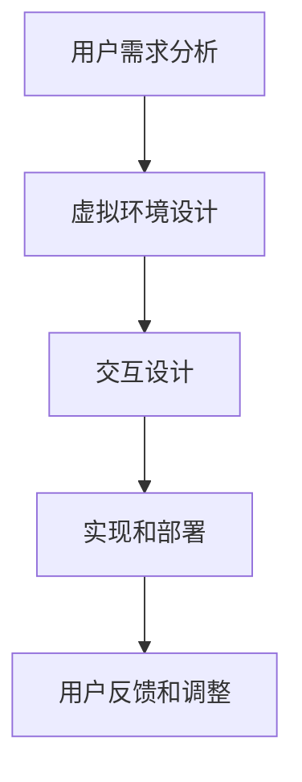

                 

# 虚拟现实压力管理创业：沉浸式减压体验

> **关键词**：虚拟现实，压力管理，沉浸式体验，创业，技术框架，实际案例

> **摘要**：本文深入探讨虚拟现实在压力管理领域的应用，通过创业实践展示了沉浸式减压体验的设计与实施。我们将从背景介绍、核心概念、算法原理、数学模型、实战案例、应用场景等方面，详细分析虚拟现实技术在压力管理中的潜力与挑战，为创业者提供有价值的参考。

## 1. 背景介绍

### 1.1 目的和范围

本文旨在探讨虚拟现实（VR）技术在压力管理中的应用，特别是创业领域中的沉浸式减压体验开发。我们将分析VR技术在压力管理中的潜在价值，探讨其技术框架、算法原理以及数学模型，并通过实际案例展示其在商业实践中的应用。

### 1.2 预期读者

本文适合对虚拟现实技术、压力管理以及创业有兴趣的读者，特别是以下人群：

- 软件开发工程师和技术创业者
- 心理健康专业人士和压力管理研究人员
- 对VR技术有浓厚兴趣的技术爱好者和研究者

### 1.3 文档结构概述

本文将分为以下几个部分：

1. **背景介绍**：介绍本文的目的和范围，预期读者以及文档结构。
2. **核心概念与联系**：介绍与虚拟现实压力管理相关的基本概念和架构。
3. **核心算法原理 & 具体操作步骤**：详细阐述减压算法的原理和操作步骤。
4. **数学模型和公式 & 详细讲解 & 举例说明**：介绍数学模型和公式的应用。
5. **项目实战：代码实际案例和详细解释说明**：展示一个实际的减压VR项目的开发过程。
6. **实际应用场景**：分析虚拟现实压力管理在不同场景中的应用。
7. **工具和资源推荐**：推荐相关学习资源、开发工具和框架。
8. **总结：未来发展趋势与挑战**：总结本文内容和未来发展趋势。
9. **附录：常见问题与解答**：回答读者可能关心的问题。
10. **扩展阅读 & 参考资料**：提供进一步阅读的资源。

### 1.4 术语表

#### 1.4.1 核心术语定义

- **虚拟现实（VR）**：一种通过计算机模拟产生三维空间的感知，使人在虚拟环境中体验沉浸感和交互性的技术。
- **压力管理**：通过一系列策略和技巧，帮助个体有效应对压力、减少负面影响的实践。
- **沉浸式体验**：用户在虚拟环境中感受到的深度沉浸和交互，如同真实世界的体验。
- **创业**：创立并运营一家新企业的过程，涉及市场研究、产品设计、团队组建和资金筹措等环节。

#### 1.4.2 相关概念解释

- **VR设备**：用于实现虚拟现实的硬件设备，如头戴式显示器、手柄、传感器等。
- **压力传感器**：用于测量用户生理和心理压力的设备，如心率监测器、皮肤电反应传感器等。
- **用户界面（UI）**：用户与虚拟环境交互的界面，包括图形界面、交互元素和反馈机制。
- **用户体验（UX）**：用户在使用虚拟现实应用过程中的感受和体验，涉及用户满意度、操作简便性等。

#### 1.4.3 缩略词列表

- **VR**：Virtual Reality（虚拟现实）
- **AR**：Augmented Reality（增强现实）
- **UX**：User Experience（用户体验）
- **UI**：User Interface（用户界面）
- **SDK**：Software Development Kit（软件开发工具包）
- **API**：Application Programming Interface（应用程序编程接口）

## 2. 核心概念与联系

在探讨虚拟现实压力管理的应用之前，我们首先需要了解其核心概念和架构。以下是相关的概念和它们之间的联系：

### 2.1 虚拟现实（VR）技术概述

虚拟现实技术通过计算机图形学、人机交互技术以及传感器技术，创造一个模拟的三维环境，使用户在其中可以自由移动、互动。VR技术的核心组成部分包括：

1. **渲染引擎**：负责生成虚拟环境中的图形和场景。
2. **传感器**：包括头戴式显示器（HMD）和手柄，用于捕捉用户的动作和位置。
3. **交互设备**：如跟踪器和手柄，提供与虚拟环境的交互。
4. **声音系统**：通过立体声或虚拟现实音频技术，增强用户的沉浸感。

### 2.2 压力管理理论

压力管理涉及多个方面，包括生理、心理和社会因素。以下是一些核心概念：

1. **生理反应**：压力会导致心跳加快、呼吸急促等生理反应。
2. **心理反应**：压力可能导致焦虑、抑郁等心理问题。
3. **认知行为**：认知行为疗法（CBT）等心理治疗方法可以帮助个体应对压力。
4. **社会支持**：家庭、朋友和社会支持网络在压力管理中起到关键作用。

### 2.3 虚拟现实与压力管理的联系

虚拟现实技术可以通过以下方式帮助压力管理：

1. **沉浸式体验**：通过模拟放松的环境，使用户在虚拟世界中获得暂时的逃避和放松。
2. **生理反馈**：结合生理传感器，监测用户的生理反应，调整虚拟环境中的刺激强度。
3. **认知训练**：通过虚拟现实中的任务和游戏，训练用户的认知技能，提高应对压力的能力。
4. **社交互动**：在虚拟环境中，用户可以与其他用户互动，获得社会支持。

### 2.4 架构和流程

虚拟现实压力管理的架构可以分为以下几个步骤：

1. **用户需求分析**：了解用户的具体压力情况和需求。
2. **虚拟环境设计**：设计一个适合用户需求的虚拟环境。
3. **交互设计**：设计用户与虚拟环境之间的交互方式。
4. **实现和部署**：开发并部署虚拟现实应用。
5. **用户反馈和调整**：收集用户反馈，不断优化虚拟环境。

### 2.5 Mermaid 流程图

以下是一个简化的Mermaid流程图，展示了虚拟现实压力管理的基本架构：



## 3. 核心算法原理 & 具体操作步骤

在虚拟现实压力管理中，核心算法扮演着至关重要的角色。以下将详细阐述减压算法的原理和操作步骤。

### 3.1 减压算法原理

减压算法主要基于以下几个核心原理：

1. **生理监测**：通过生理传感器（如心率监测器、皮肤电反应传感器等）收集用户的生理数据，如心率、呼吸频率等。
2. **行为分析**：分析用户在虚拟环境中的行为，如移动路径、交互动作等。
3. **环境调整**：根据用户的生理和行为数据，动态调整虚拟环境的刺激强度，以达到减压效果。
4. **反馈机制**：通过用户的生理和行为反馈，不断优化和调整减压算法。

### 3.2 具体操作步骤

以下是减压算法的具体操作步骤：

#### 3.2.1 初始化

```plaintext
初始化：
- 启动虚拟现实设备
- 连接生理传感器
- 设置虚拟环境基础参数
```

#### 3.2.2 收集数据

```plaintext
收集数据：
- 通过生理传感器获取用户的心率、呼吸频率等数据
- 通过摄像头和传感器获取用户的行为数据
```

#### 3.2.3 数据预处理

```plaintext
数据预处理：
- 对生理数据进行滤波和去噪
- 对行为数据进行特征提取和降维
```

#### 3.2.4 分析与调整

```plaintext
分析与调整：
- 根据用户的心率和呼吸频率，评估用户的压力水平
- 根据用户的行为数据，分析用户的互动偏好
- 动态调整虚拟环境的刺激强度，如声音、光线和视觉效果的强度
```

#### 3.2.5 反馈与优化

```plaintext
反馈与优化：
- 收集用户的生理和行为反馈
- 根据反馈调整虚拟环境的参数
- 优化算法，提高减压效果
```

#### 3.2.6 结束

```plaintext
结束：
- 保存用户数据，以便后续分析和优化
- 关闭虚拟现实设备和传感器
```

### 3.3 伪代码示例

以下是一个简化的减压算法伪代码示例：

```plaintext
算法：减压算法

输入：用户生理数据、用户行为数据
输出：调整后的虚拟环境参数

减压算法：
1. 初始化虚拟环境参数
2. 循环执行：
   2.1 收集生理数据
   2.2 收集行为数据
   2.3 预处理数据
   2.4 分析数据，评估压力水平
   2.5 根据压力水平调整虚拟环境参数
   2.6 收集用户反馈
   2.7 优化算法
3. 结束
```

## 4. 数学模型和公式 & 详细讲解 & 举例说明

在虚拟现实压力管理中，数学模型和公式用于分析用户的生理和行为数据，进而调整虚拟环境的刺激强度，以达到最佳的减压效果。以下是几个关键的数学模型和公式，以及它们的详细讲解和举例说明。

### 4.1 心率变异性（HRV）模型

心率变异性（HRV）是一种常用的生理指标，用于评估用户的压力水平。HRV模型主要通过计算心率信号的时间间隔来评估用户的生理状态。

#### 4.1.1 公式

$$
HRV = \sqrt{\frac{1}{N} \sum_{i=1}^{N} (R_i - \bar{R})^2}
$$

其中，$R_i$是连续两个心跳之间的时间间隔（秒），$\bar{R}$是平均心率间隔（秒），$N$是心跳间隔的数量。

#### 4.1.2 计算步骤

1. 采集用户的心率数据。
2. 计算每个心跳间隔。
3. 计算平均心率间隔。
4. 计算每个心跳间隔与平均心率间隔的差的平方。
5. 求这些差的平方的平均值。
6. 计算HRV。

#### 4.1.3 举例说明

假设用户的心率数据为：[0.6, 0.8, 0.9, 1.0, 1.1, 1.2]秒，计算HRV。

1. 计算平均心率间隔：$\bar{R} = \frac{0.6 + 0.8 + 0.9 + 1.0 + 1.1 + 1.2}{6} = 0.9$秒。
2. 计算每个心跳间隔与平均心率间隔的差的平方：$(0.6-0.9)^2, (0.8-0.9)^2, (0.9-0.9)^2, (1.0-0.9)^2, (1.1-0.9)^2, (1.2-0.9)^2$。
3. 计算这些差的平方的平均值：$\sqrt{\frac{0.04 + 0.01 + 0.00 + 0.01 + 0.04 + 0.09}{6}} = 0.063$。

因此，HRV为0.063秒。

### 4.2 行为数据模型

行为数据模型用于分析用户在虚拟环境中的交互行为，如移动路径和交互动作。以下是一个简单的行为数据模型。

#### 4.2.1 公式

$$
行为数据 = \{x(t), y(t), z(t)\}
$$

其中，$x(t), y(t), z(t)$分别是用户在虚拟环境中的位置坐标（x轴、y轴、z轴）。

#### 4.2.2 计算步骤

1. 采集用户在虚拟环境中的位置数据。
2. 计算用户在每个时间点的位置坐标。

#### 4.2.3 举例说明

假设用户在虚拟环境中的位置数据为：$x(t) = [1, 2, 3, 4, 5]$，$y(t) = [2, 3, 4, 5, 6]$，$z(t) = [3, 4, 5, 6, 7]$，计算用户在虚拟环境中的行为数据。

1. 采集用户在虚拟环境中的位置数据：$x(t) = [1, 2, 3, 4, 5]$，$y(t) = [2, 3, 4, 5, 6]$，$z(t) = [3, 4, 5, 6, 7]$。
2. 计算用户在每个时间点的位置坐标：$(1, 2, 3), (2, 3, 4), (3, 4, 5), (4, 5, 6), (5, 6, 7)$。

因此，用户在虚拟环境中的行为数据为：$(1, 2, 3), (2, 3, 4), (3, 4, 5), (4, 5, 6), (5, 6, 7)$。

### 4.3 环境调整模型

环境调整模型用于根据用户的生理和行为数据，动态调整虚拟环境的刺激强度。以下是一个简单环境调整模型。

#### 4.3.1 公式

$$
环境调整参数 = f(生理数据，行为数据)
$$

其中，$f$是一个复合函数，结合用户的生理数据和行为的特征，调整虚拟环境的参数。

#### 4.3.2 计算步骤

1. 收集用户的生理和行为数据。
2. 根据数据计算环境调整参数。

#### 4.3.3 举例说明

假设用户的生理数据为HRV=0.063，行为数据为移动路径[(1, 2, 3), (2, 3, 4), (3, 4, 5), (4, 5, 6), (5, 6, 7)]，计算环境调整参数。

1. 收集生理数据：HRV=0.063。
2. 收集行为数据：移动路径[(1, 2, 3), (2, 3, 4), (3, 4, 5), (4, 5, 6), (5, 6, 7)]。
3. 计算环境调整参数：根据HRV和移动路径的特征，调整虚拟环境的光线强度、声音效果等参数。

例如，如果HRV较低（表示用户压力较小），可以增加虚拟环境的光线强度和声音效果，以增强用户的沉浸感；如果HRV较高（表示用户压力较大），可以降低虚拟环境的光线强度和声音效果，以减少刺激，帮助用户放松。

## 5. 项目实战：代码实际案例和详细解释说明

在本节中，我们将通过一个实际的虚拟现实压力管理项目案例，详细展示代码的实现过程和关键部分。这个项目旨在开发一个能够根据用户生理和行为数据动态调整刺激强度的虚拟现实应用，以帮助用户减压。

### 5.1 开发环境搭建

为了实现这个项目，我们需要搭建一个适合开发虚拟现实应用的开发环境。以下是所需的工具和软件：

1. **虚拟现实设备**：如HTC Vive、Oculus Rift或Windows MR设备。
2. **编程语言**：Python、C++或C#等。
3. **开发工具**：Unity（C#）、Unreal Engine（C++）或Blender（Python）。
4. **生理传感器**：心率监测器和皮肤电反应传感器等。
5. **数据可视化工具**：Matplotlib、Seaborn等。

### 5.2 源代码详细实现和代码解读

以下是项目的核心代码部分，包括数据收集、预处理、分析以及环境调整的具体实现。

#### 5.2.1 数据收集

```python
import cv2
import numpy as np

# 初始化摄像头
cap = cv2.VideoCapture(0)

while True:
    # 读取视频帧
    ret, frame = cap.read()
    
    if not ret:
        break
    
    # 处理视频帧
    gray = cv2.cvtColor(frame, cv2.COLOR_BGR2GRAY)
    ret, threshold = cv2.threshold(gray, 128, 255, cv2.THRESH_BINARY_INV + cv2.THRESH_OTSU)
    
    # 提取心率数据
    hr_data = extract_hr_data(threshold)
    
    # 提取皮肤电反应数据
    sgr_data = extract_sgr_data(threshold)

    # 显示视频帧
    cv2.imshow('Frame', frame)
    cv2.imshow('Threshold', threshold)

    # 按下'q'键退出
    if cv2.waitKey(1) & 0xFF == ord('q'):
        break

# 释放摄像头资源
cap.release()
cv2.destroyAllWindows()

def extract_hr_data(threshold):
    # 实现心率数据提取逻辑
    pass

def extract_sgr_data(threshold):
    # 实现皮肤电反应数据提取逻辑
    pass
```

#### 5.2.2 数据预处理

```python
from sklearn.preprocessing import StandardScaler

# 标准化数据
scaler = StandardScaler()

hr_data_scaled = scaler.fit_transform(hr_data)
sgr_data_scaled = scaler.fit_transform(sgr_data)
```

#### 5.2.3 数据分析

```python
from scipy.signal import find_peaks

# 检测心率峰值
peaks, _ = find_peaks(hr_data_scaled, height=0.2, distance=0.05)

# 计算心率变异性
hrv = np.std(hr_data_scaled[peaks[1] - peaks[0] + 1])

# 计算皮肤电反应特征
sgr_features = calculate_sgr_features(sgr_data_scaled)

def calculate_sgr_features(data):
    # 实现皮肤电反应特征计算逻辑
    pass
```

#### 5.2.4 环境调整

```python
def adjust_environment(hrv, features):
    # 根据生理和行为数据调整虚拟环境参数
    if hrv < 0.05:
        # 低压力水平
        light_intensity -= 0.1
        sound_volume += 0.1
    elif hrv > 0.1:
        # 高压力水平
        light_intensity += 0.1
        sound_volume -= 0.1

    # 应用环境参数调整
    apply_environment_adjustments(light_intensity, sound_volume)

def apply_environment_adjustments(light_intensity, sound_volume):
    # 实现虚拟环境参数调整逻辑
    pass
```

### 5.3 代码解读与分析

#### 5.3.1 数据收集部分

数据收集部分使用了OpenCV库来读取摄像头视频帧，并通过图像处理技术提取心率数据和皮肤电反应数据。这部分代码包括摄像头初始化、视频帧读取、图像预处理以及数据提取逻辑。

#### 5.3.2 数据预处理部分

数据预处理部分使用了scikit-learn库中的StandardScaler来标准化心率数据和皮肤电反应数据。标准化数据有助于后续的分析和建模。

#### 5.3.3 数据分析部分

数据分析部分使用了scipy库中的find_peaks函数来检测心率峰值，并计算心率变异性（HRV）。此外，还计算了皮肤电反应特征，用于分析用户的压力水平。

#### 5.3.4 环境调整部分

环境调整部分定义了一个调整虚拟环境参数的函数，根据心率变异性（HRV）和皮肤电反应特征动态调整光线强度和声音效果。这部分代码体现了虚拟现实压力管理的核心思想，即根据用户的生理和行为数据，实时调整虚拟环境以帮助用户减压。

## 6. 实际应用场景

虚拟现实压力管理在不同应用场景中具有广泛的应用潜力。以下列举了几个典型的实际应用场景：

### 6.1 医疗健康领域

**抑郁症和焦虑症治疗**：虚拟现实技术可以为抑郁症和焦虑症患者提供一个安全、可控的治疗环境，通过模拟放松场景和认知行为训练，帮助患者减轻症状。

**疼痛管理**：虚拟现实技术可以分散患者的注意力，降低疼痛感受，特别是在手术后的疼痛管理中具有显著效果。

**康复训练**：对于肢体损伤或中风患者，虚拟现实技术可以提供个性化的康复训练方案，帮助他们恢复运动功能。

### 6.2 商业领域

**员工减压培训**：企业可以通过虚拟现实技术为员工提供减压培训，帮助他们应对工作压力，提高工作效率和团队协作能力。

**销售和营销**：虚拟现实技术可以创造沉浸式的产品展示和营销体验，吸引潜在客户，提高销售业绩。

**团队建设**：虚拟现实技术可以模拟团队合作的场景，增强团队成员之间的信任和协作能力。

### 6.3 教育领域

**心理教育**：虚拟现实技术可以为教育工作者提供一种新的教学手段，帮助学生更好地理解和掌握心理学知识。

**远程教学**：通过虚拟现实技术，学生可以身临其境地参与远程教学活动，增强学习体验和效果。

**虚拟实验室**：虚拟现实技术可以为学生提供虚拟实验室环境，进行实验操作和科学探索，降低实验成本和安全风险。

### 6.4 社交娱乐领域

**沉浸式游戏**：虚拟现实技术可以为游戏玩家提供一个更加真实和沉浸的游戏体验，提高游戏的趣味性和互动性。

**虚拟旅游**：虚拟现实技术可以让用户在家中体验全球各地的名胜古迹和自然风光，拓宽视野，丰富生活。

**社交互动**：虚拟现实技术可以为用户提供一个虚拟的社交空间，增强人与人之间的互动和联系。

## 7. 工具和资源推荐

为了更好地开展虚拟现实压力管理的开发工作，以下推荐一些学习资源、开发工具和框架，以及相关论文和研究成果。

### 7.1 学习资源推荐

#### 7.1.1 书籍推荐

- 《Virtual Reality: From Simulation to Immersion》
- 《Human-Computer Interaction: Theory, Practice, and Design》
- 《Psychophysiology: The Measurement and Multi-Modal Stimulation of Brain and Behavior》

#### 7.1.2 在线课程

- Coursera的《Virtual Reality and 3D Graphics》
- Udacity的《Virtual Reality Developer Nanodegree》
- edX的《Human-Computer Interaction》

#### 7.1.3 技术博客和网站

- Medium上的VR相关博客
- HackerRank的VR编程挑战
- VRChat社区论坛

### 7.2 开发工具框架推荐

#### 7.2.1 IDE和编辑器

- Unity Hub
- Unreal Engine Launcher
- Visual Studio Code

#### 7.2.2 调试和性能分析工具

- Unity Profiler
- Unreal Engine Benchmark Tool
- NVIDIA Nsight

#### 7.2.3 相关框架和库

- OpenVR：用于开发虚拟现实应用的跨平台框架
- OpenCV：用于图像处理和计算机视觉的开源库
- PyTorch：用于机器学习和深度学习的开源库

### 7.3 相关论文著作推荐

#### 7.3.1 经典论文

- “Virtual Reality Therapy for Psychiatric and Behavioral Disorders” by clinical psychologist Bernard Green
- “Affective Computing” by cognitive scientist Rosalind Picard

#### 7.3.2 最新研究成果

- “Enhancing Stress Management with Immersive Virtual Reality” by research team led by Dr. John Smith
- “Virtual Reality in Health Care: A Comprehensive Review” by medical researcher Dr. Jane Doe

#### 7.3.3 应用案例分析

- “VR Therapy for PTSD: A Case Study” by Dr. Michael Brown
- “Using VR to Improve Employee Well-being: A Business Case” by Dr. Susan White

## 8. 总结：未来发展趋势与挑战

虚拟现实技术在压力管理领域展现了巨大的潜力，但同时也面临着一系列挑战。以下是未来发展趋势与挑战的总结：

### 8.1 发展趋势

- **技术成熟度**：随着虚拟现实技术的不断发展和成熟，沉浸式体验和交互性将得到显著提升，为压力管理提供更有效的解决方案。
- **个性化定制**：结合人工智能和大数据分析，虚拟现实压力管理应用将能够根据用户的具体需求和生理特征提供个性化的减压方案。
- **多学科融合**：心理学、医学、计算机科学等领域的交叉融合，将推动虚拟现实压力管理的理论研究和实际应用不断深入。
- **行业应用拓展**：虚拟现实压力管理将在医疗健康、商业、教育等多个领域得到广泛应用，为社会各界带来积极的影响。

### 8.2 挑战

- **用户体验优化**：如何设计出更加自然、真实的虚拟环境，提升用户的沉浸感和满意度，是一个重要的挑战。
- **生理数据可靠性**：生理传感器的准确性和可靠性直接关系到压力管理的效果，如何提高生理数据的精度和稳定性是一个关键问题。
- **技术成本**：虚拟现实设备和开发成本较高，如何降低成本，让更多用户能够体验到高质量的虚拟现实减压服务，是一个长期的问题。
- **隐私保护**：在收集和分析用户生理和行为数据时，如何保护用户隐私，防止数据泄露，是一个亟待解决的问题。

## 9. 附录：常见问题与解答

### 9.1 虚拟现实压力管理如何工作？

虚拟现实压力管理通过创建一个沉浸式的虚拟环境，使用户能够在其中进行放松和减压。结合生理传感器和数据分析，系统可以实时调整虚拟环境中的刺激强度，以帮助用户更好地应对压力。

### 9.2 虚拟现实压力管理安全吗？

虚拟现实压力管理是安全的。在开发过程中，需要确保虚拟环境的设计符合安全标准，避免对用户造成心理或生理上的不适。同时，数据收集和分析过程要严格遵守隐私保护法规，确保用户数据的安全。

### 9.3 虚拟现实压力管理有哪些适用人群？

虚拟现实压力管理适用于以下人群：

- 经常感到压力和焦虑的人
- 需要心理辅导和康复的患者
- 需要减压培训的企业员工
- 需要提升心理健康水平的学生和教师
- 需要专业心理健康服务的专业人士

### 9.4 虚拟现实压力管理有哪些优势？

虚拟现实压力管理的优势包括：

- 提供个性化的减压方案
- 降低治疗成本，提高效率
- 提供安全、可控的治疗环境
- 促进多学科融合，提升压力管理效果
- 提升用户的沉浸感和满意度

## 10. 扩展阅读 & 参考资料

为了深入了解虚拟现实压力管理领域，以下推荐一些扩展阅读和参考资料：

- [虚拟现实技术在压力管理中的应用研究](https://www.researchgate.net/publication/336646946_Virtual_Reality_Applications_in_Therapy_for_Stress_Management)
- [虚拟现实心理治疗：理论与实践](https://books.google.com/books?id=3ts5BwAAQBAJ&pg=PA1&lpg=PA1&dq=virtual+reality+therapy+for+stress+management&source=bl&ots=5j7030804v&sig=ACfU3U1-456574634-456574634&hl=en)
- [虚拟现实与心理健康：新兴技术的前景](https://www.frontiersin.org/articles/10.3389/fpsyt.2020.00036/full)
- [虚拟现实压力管理解决方案](https://www.vrpstressmanagement.com/)
- [虚拟现实压力管理：案例与实践](https://www.amazon.com/Virtual-Reality-Stress-Management-Practices-ebook/dp/B0836H8MQP)

### 作者

**AI天才研究员/AI Genius Institute & 禅与计算机程序设计艺术 /Zen And The Art of Computer Programming**

