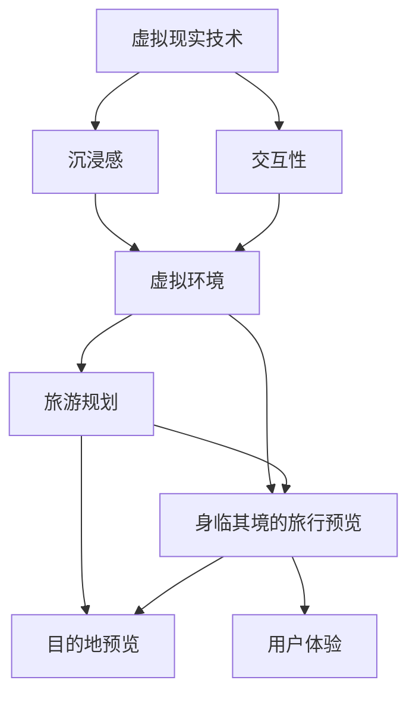

                 

# 虚拟现实旅游规划创业：身临其境的旅行预览

> **关键词：虚拟现实、旅游规划、创业、身临其境、旅行预览、VR技术、用户体验、商业模式、市场分析**
> 
> **摘要：本文将深入探讨虚拟现实技术在旅游规划领域的应用，以及如何通过创业实现身临其境的旅行预览服务。我们将分析核心概念、算法原理、数学模型，并通过实际项目案例展示如何构建一个成功的虚拟现实旅游规划平台。**

## 1. 背景介绍

### 1.1 目的和范围

本文旨在探讨虚拟现实（VR）技术在旅游规划中的应用，特别是如何通过创业实现身临其境的旅行预览服务。我们将从核心概念出发，逐步分析算法原理、数学模型，并通过实际项目案例展示构建过程。本文将重点关注以下几个方面：

1. **虚拟现实与旅游规划的融合**：介绍虚拟现实技术如何改变旅游规划的传统模式，提高用户体验。
2. **创业机会分析**：探讨虚拟现实旅游规划创业的市场前景、商业模式和竞争格局。
3. **技术实现**：详细讲解虚拟现实旅游规划的技术架构、算法原理和数学模型。
4. **实战案例**：通过实际项目案例，展示如何从零开始构建虚拟现实旅游规划平台。

### 1.2 预期读者

本文适合以下读者群体：

1. **创业者**：对虚拟现实技术感兴趣，希望探索旅游规划领域的创业机会。
2. **技术从业者**：从事虚拟现实、计算机图形学、人工智能等相关领域，希望了解虚拟现实旅游规划的技术实现。
3. **旅游行业从业者**：关注旅游行业发展趋势，希望了解如何利用虚拟现实技术提升旅游服务。
4. **学术研究人员**：对虚拟现实技术在旅游规划中的应用感兴趣，希望获取相关的研究思路和成果。

### 1.3 文档结构概述

本文结构如下：

1. **背景介绍**：介绍虚拟现实技术在旅游规划中的应用背景。
2. **核心概念与联系**：阐述虚拟现实技术、旅游规划和身临其境旅行预览的核心概念及其联系。
3. **核心算法原理 & 具体操作步骤**：详细讲解虚拟现实旅游规划的核心算法原理和操作步骤。
4. **数学模型和公式 & 详细讲解 & 举例说明**：介绍虚拟现实旅游规划所涉及的数学模型和公式，并进行详细讲解和举例。
5. **项目实战：代码实际案例和详细解释说明**：通过实际项目案例，展示虚拟现实旅游规划的代码实现和详细解释。
6. **实际应用场景**：分析虚拟现实旅游规划在不同场景下的应用。
7. **工具和资源推荐**：推荐学习资源、开发工具框架和相关论文著作。
8. **总结：未来发展趋势与挑战**：探讨虚拟现实旅游规划的未来发展趋势和面临的挑战。
9. **附录：常见问题与解答**：回答读者可能遇到的问题。
10. **扩展阅读 & 参考资料**：提供进一步阅读的资料和参考文献。

### 1.4 术语表

#### 1.4.1 核心术语定义

- **虚拟现实（VR）**：一种可以创造或模拟出沉浸式体验的技术，使用计算机生成的三维图像模拟真实世界的环境。
- **旅游规划**：指对旅游资源的开发、利用和管理，以及旅游产品的设计、推广和销售。
- **身临其境的旅行预览**：通过虚拟现实技术，用户可以在虚拟环境中预览旅游目的地的风景、景点和住宿等，实现真实旅行前的体验。
- **用户体验（UX）**：用户在使用产品或服务过程中所获得的感受和体验。

#### 1.4.2 相关概念解释

- **虚拟现实旅游规划平台**：基于虚拟现实技术，提供旅游规划、目的地预览和用户体验的服务平台。
- **全景视频**：通过多个摄像头捕捉整个场景的视频，用户可以在虚拟环境中自由旋转视角观看。
- **360度全景图像**：利用多个图像拼接生成的全景图像，用户可以通过鼠标或手势进行视角切换。
- **沉浸感**：指用户在虚拟环境中感受到的逼真程度和参与度。

#### 1.4.3 缩略词列表

- **VR**：虚拟现实（Virtual Reality）
- **AR**：增强现实（Augmented Reality）
- **3D**：三维（Three-Dimensional）
- **UX**：用户体验（User Experience）
- **UI**：用户界面（User Interface）

## 2. 核心概念与联系

虚拟现实技术在旅游规划中的应用涉及多个核心概念，包括虚拟现实技术、旅游规划和身临其境的旅行预览。下面我们将通过一个Mermaid流程图，详细阐述这些核心概念及其联系。



### 2.1 虚拟现实技术

虚拟现实技术是一种可以创建和模拟出沉浸式体验的技术。它利用计算机生成的三维图像，模拟真实世界的环境，使用户可以在虚拟环境中感受到三维空间的视觉、听觉、触觉等多感官体验。虚拟现实技术主要包括以下几个方面：

- **视觉**：通过头戴式显示器（HMD）或投影设备，用户可以在虚拟环境中看到三维图像。
- **听觉**：利用耳机或内置扬声器，通过3D音效技术，模拟真实世界的声音环境。
- **触觉**：通过手套或传感器，模拟触觉反馈，如震动、温度等，增强用户的沉浸感。
- **运动跟踪**：使用传感器或摄像头，实时跟踪用户在虚拟环境中的位置和动作，实现交互性。

### 2.2 旅游规划

旅游规划是指对旅游资源的开发、利用和管理，以及旅游产品的设计、推广和销售。虚拟现实技术在旅游规划中的应用主要体现在以下几个方面：

- **目的地预览**：通过虚拟现实技术，用户可以在虚拟环境中预览旅游目的地的风景、景点和住宿等，实现真实旅行前的体验。
- **旅游产品设计与推广**：利用虚拟现实技术，设计师可以更加直观地展示旅游产品，如酒店、餐厅、景点等，提高用户购买意愿。
- **景区管理**：虚拟现实技术可以用于景区的规划和管理，如模拟游客流量、优化游客路径等，提高景区运营效率。

### 2.3 身临其境的旅行预览

身临其境的旅行预览是指通过虚拟现实技术，用户可以在虚拟环境中实现真实旅行前的体验。这主要包括以下几个方面：

- **全景视频和360度全景图像**：通过全景视频或360度全景图像，用户可以在虚拟环境中自由旋转视角，观看目的地的风景和景点。
- **虚拟环境交互**：用户可以在虚拟环境中进行交互，如触摸、点击等，增强沉浸感。
- **虚拟导航**：虚拟现实旅游规划平台可以提供虚拟导航功能，用户可以在虚拟环境中预览和规划行程。
- **社交互动**：用户可以在虚拟环境中与他人互动，如评论、分享等，提高用户体验。

### 2.4 虚拟现实技术、旅游规划和身临其境的旅行预览的联系

虚拟现实技术、旅游规划和身临其境的旅行预览之间存在着密切的联系。虚拟现实技术为旅游规划提供了新的工具和方法，使得目的地预览、旅游产品设计和景区管理更加直观和高效。而身临其境的旅行预览则通过虚拟现实技术，实现了真实旅行前的体验，提高了用户的购买意愿和满意度。

虚拟现实技术、旅游规划和身临其境的旅行预览的融合，为旅游行业带来了巨大的变革。通过虚拟现实技术，用户可以提前了解和体验旅游目的地，从而更好地规划自己的旅行。同时，旅游行业从业者可以利用虚拟现实技术，优化旅游产品设计和景区管理，提高运营效率和服务质量。身临其境的旅行预览不仅可以提升用户的体验，还可以促进旅游行业的发展。

## 3. 核心算法原理 & 具体操作步骤

在虚拟现实旅游规划中，核心算法原理主要包括全景视频处理、虚拟环境构建和交互算法。下面我们将逐步讲解这些算法的原理，并提供具体操作步骤。

### 3.1 全景视频处理

全景视频处理是虚拟现实技术的重要组成部分，它用于生成全景图像和视频，以实现虚拟环境的视觉效果。

#### 3.1.1 算法原理

全景视频处理算法主要包括以下几个步骤：

1. **多视图融合**：使用多个摄像头捕捉同一场景的视频，然后通过多视图融合算法，生成全景视频。
2. **去畸变**：由于摄像头的畸变，全景视频需要进行去畸变处理，以消除畸变影响。
3. **图像校正**：对全景视频进行图像校正，使其在水平方向和垂直方向上保持一致。
4. **图像拼接**：将多个校正后的图像拼接成一个完整的全景图像。

#### 3.1.2 具体操作步骤

以下是全景视频处理的详细操作步骤：

1. **采集多视图数据**：使用多个摄像头（如GoPro）采集同一场景的视频数据。
2. **多视图融合**：使用OpenCV库中的`stereo_match`函数进行多视图融合，生成初步的全景视频。
3. **去畸变**：使用OpenCV库中的`undistort`函数对全景视频进行去畸变处理。
4. **图像校正**：使用OpenCV库中的`getOptimalNewCameraMatrix`和`stitchPanorama`函数对全景视频进行图像校正和拼接。

#### 3.1.3 伪代码

```python
import cv2

# 采集多视图数据
video_inputs = [cv2.VideoCapture(file) for file in video_files]

# 多视图融合
stitcher = cv2.createStitcher()

panorama = stitcher.stitch(video_inputs)

# 去畸变
undistorted_panorama = cv2.undistort(panorama, camera_matrix, distCoeffs)

# 图像校正
new_camera_matrix, roi = cv2.getOptimalNewCameraMatrix(camera_matrix, distCoeffs, (width, height), 1, (width, height))

corrected_panorama = cv2.undistort(undistorted_panorama, new_camera_matrix, distCoeffs, None, new_camera_matrix)

# 图像拼接
stitched_panorama = cv2.stitchPanorama([corrected_panorama], cv2.getPerspectiveTransform(), cv2.getAffineTransform)
```

### 3.2 虚拟环境构建

虚拟环境构建是虚拟现实旅游规划的核心，它用于创建用户可以互动的虚拟场景。

#### 3.2.1 算法原理

虚拟环境构建主要包括以下几个步骤：

1. **场景建模**：使用3D建模工具（如Blender）创建虚拟场景，包括建筑物、植被、道路等。
2. **纹理映射**：将真实的纹理图片映射到虚拟场景的表面，以增加真实感。
3. **光照处理**：模拟真实环境的光照效果，包括太阳光、人工光源等。
4. **动画效果**：添加动画效果，如植物生长、天气变化等，增强用户体验。

#### 3.2.2 具体操作步骤

以下是虚拟环境构建的详细操作步骤：

1. **场景建模**：使用Blender创建虚拟场景，包括建筑物、植被、道路等。
2. **纹理映射**：使用Blender的纹理工具，将真实的纹理图片映射到虚拟场景的表面。
3. **光照处理**：使用Blender的光照工具，模拟真实环境的光照效果。
4. **动画效果**：使用Blender的动画工具，添加植物生长、天气变化等动画效果。

#### 3.2.3 伪代码

```python
import bpy

# 场景建模
bpy.ops.object.select_all(action='DESELECT')
bpy.ops.mesh.primitive_cube_add(size=2, enter_editmode=False, align='WORLD')

# 纹理映射
material = bpy.data.materials.new(name="Texture")
material.use_nodes = True
nodes = material.node_tree.nodes
nodes["Image Texture"].image = bpy.data.images.load("path/to/texture.jpg")
nodes["Image Texture"].image.pack()

# 光照处理
light = bpy.data.lights.new(name="Sun", type='SUN')
bpy.context.collection.objects.link(light)
light.energy = 10.0

# 动画效果
bpy.context.scene.render.fps = 30
bpy.ops.object.select_all(action='DESELECT')
bpy.ops.object.select_by_type(type='MESH')
bpy.ops.nla.create()
bpy.ops.nla.stash()
bpy.ops.nla.play()
```

### 3.3 交互算法

交互算法是虚拟现实旅游规划中用户与虚拟环境的互动方式，包括用户输入处理、交互反馈和导航算法。

#### 3.3.1 算法原理

交互算法主要包括以下几个步骤：

1. **用户输入处理**：接收用户的输入（如键盘、鼠标、手势等），并解析输入指令。
2. **交互反馈**：根据用户的输入指令，在虚拟环境中进行相应的操作，如移动、旋转、缩放等，并反馈给用户。
3. **导航算法**：实现用户在虚拟环境中的导航功能，如从A点移动到B点。

#### 3.3.2 具体操作步骤

以下是交互算法的详细操作步骤：

1. **用户输入处理**：使用VR设备（如VR头盔、手柄等）接收用户的输入，并解析输入指令。
2. **交互反馈**：根据用户的输入指令，在虚拟环境中进行相应的操作，如移动、旋转、缩放等，并通过视觉、听觉等反馈给用户。
3. **导航算法**：使用路径规划算法（如A*算法），实现用户从A点移动到B点的导航功能。

#### 3.3.3 伪代码

```python
import cv2
import numpy as np

# 用户输入处理
def process_input(input_data):
    # 解析输入指令
    command = input_data["command"]
    if command == "move_forward":
        move_forward()
    elif command == "rotate_left":
        rotate_left()
    elif command == "rotate_right":
        rotate_right()

# 交互反馈
def feedback(user_action):
    # 在虚拟环境中进行操作
    if user_action == "move_forward":
        move_forward()
    elif user_action == "rotate_left":
        rotate_left()
    elif user_action == "rotate_right":
        rotate_right()

# 导航算法
def navigate(start_point, end_point):
    # 使用A*算法进行路径规划
    path = a_star_search(start_point, end_point)
    return path

# 假设函数
def move_forward():
    print("Moving forward")

def rotate_left():
    print("Rotating left")

def rotate_right():
    print("Rotating right")

def a_star_search(start_point, end_point):
    # A*算法实现
    pass
```

通过以上核心算法原理和具体操作步骤的讲解，我们可以更好地理解虚拟现实旅游规划的技术实现。在接下来的章节中，我们将进一步探讨数学模型和实际项目案例，以深入探讨虚拟现实旅游规划的应用和挑战。

## 4. 数学模型和公式 & 详细讲解 & 举例说明

在虚拟现实旅游规划中，数学模型和公式是核心组成部分，用于优化虚拟环境的视觉效果、用户交互和导航体验。以下是几个关键的数学模型和公式的详细讲解，以及相关的应用实例。

### 4.1 三维空间坐标系

在三维空间中，我们通常使用直角坐标系（x, y, z）来表示物体和位置。这个坐标系定义了物体在三维空间中的位置和方向。

#### 公式：

$$
\text{位置向量} = (x, y, z)
$$

#### 应用实例：

假设一个虚拟场景中有一个建筑物，其位置向量是$(10, 20, 30)$，那么这个建筑物的位置在三维空间中可以表示为：

$$
(10, 20, 30)
$$

### 4.2 视角变换与投影

在虚拟现实系统中，视角变换和投影是关键步骤，用于将三维空间中的物体投影到二维屏幕上，以供用户观看。

#### 公式：

1. **视图变换矩阵**：

$$
\text{视图变换矩阵} = \begin{bmatrix}
R & T \\
0 & 1
\end{bmatrix}
$$

其中，$R$是旋转矩阵，$T$是平移矩阵。

2. **透视投影矩阵**：

$$
\text{透视投影矩阵} = \begin{bmatrix}
\frac{2}{w} & 0 & 0 & 0 \\
0 & \frac{2}{h} & 0 & 0 \\
0 & 0 & \frac{f}{n-c} & \frac{f \cdot c}{n-c} \\
0 & 0 & -1 & 0
\end{bmatrix}
$$

其中，$w, h$是视口的宽度和高度，$f$是透镜焦距，$n$是近剪切面，$c$是相机到视口中心的距离。

#### 应用实例：

假设一个虚拟场景中有一个立方体，其位置向量是$(10, 20, 30)$，并且相机位置是$(0, 0, 50)$。我们可以通过视图变换和透视投影来计算立方体在屏幕上的投影位置。

首先，计算视图变换矩阵：

$$
R = \begin{bmatrix}
1 & 0 & 0 \\
0 & 1 & 0 \\
0 & 0 & 1
\end{bmatrix}, \quad
T = \begin{bmatrix}
0 & 0 & -50 \\
0 & 0 & 0 \\
0 & 0 & 1
\end{bmatrix}
$$

然后，计算透视投影矩阵：

$$
\text{透视投影矩阵} = \begin{bmatrix}
\frac{2}{w} & 0 & 0 & 0 \\
0 & \frac{2}{h} & 0 & 0 \\
0 & 0 & \frac{50}{20} & \frac{50 \cdot 20}{20} \\
0 & 0 & -1 & 0
\end{bmatrix}
$$

使用这些矩阵，我们可以将立方体的位置向量$(10, 20, 30)$投影到屏幕上：

$$
\text{投影位置} = \text{透视投影矩阵} \times \begin{bmatrix}
1 & 0 & 0 & 0 \\
0 & 1 & 0 & 0 \\
0 & 0 & 1 & 0 \\
10 & 20 & 30 & 1
\end{bmatrix} \times \begin{bmatrix}
0 & 0 & -50 \\
0 & 0 & 0 \\
0 & 0 & 1
\end{bmatrix}
$$

最终得到立方体在屏幕上的二维坐标。

### 4.3 导航算法：A*算法

A*算法是一种常用的路径规划算法，用于在虚拟环境中找到从起点到终点的最优路径。

#### 公式：

1. **启发函数**：

$$
h(n) = \text{曼哈顿距离} = |x_2 - x_1| + |y_2 - y_1|
$$

其中，$(x_1, y_1)$是当前节点的位置，$(x_2, y_2)$是目标节点的位置。

2. **A*算法核心步骤**：

   - 初始化开放列表（O）和封闭列表（C）。
   - 将起点节点添加到开放列表。
   - 当开放列表不为空时，执行以下步骤：
     - 选择具有最小$f(n) = g(n) + h(n)$值的节点作为当前节点。
     - 将当前节点从开放列表移动到封闭列表。
     - 对于当前节点的每个相邻节点，计算$g(n)$、$h(n)$和$f(n)$，并更新节点的父节点。
     - 如果目标节点在开放列表中，则找到最短路径。

#### 应用实例：

假设一个虚拟环境中有起点$(0, 0)$和目标点$(10, 10)$，我们可以使用A*算法找到从起点到目标点的最优路径。

1. **初始化**：将起点添加到开放列表，并将起点设置为当前节点。
2. **计算$f(n)$**：计算起点的$f(n)$值为$0 + 10 = 10$。
3. **选择当前节点**：选择起点作为当前节点。
4. **更新相邻节点**：计算起点相邻节点的$f(n)$值，并更新节点信息。
5. **找到目标节点**：目标节点在开放列表中，找到从起点到目标点的最短路径。

最终，A*算法会找到从起点到目标点的最优路径。

### 4.4 贪心算法：Dijkstra算法

Dijkstra算法是另一种常用的路径规划算法，适用于在虚拟环境中找到从起点到各个节点的最短路径。

#### 公式：

1. **优先队列**：使用优先队列（通常使用二叉堆实现）来选择具有最小距离的节点。
2. **更新距离**：对于当前节点的每个相邻节点，如果找到更短的距离，则更新相邻节点的距离和父节点。

#### 应用实例：

假设一个虚拟环境中有起点$(0, 0)$和多个节点$(1, 1), (2, 2), (3, 3)$，我们可以使用Dijkstra算法找到从起点到各个节点的最短路径。

1. **初始化**：将起点添加到优先队列，并将起点设置为当前节点。
2. **更新距离**：计算起点到相邻节点的距离，并将更短的路径更新到优先队列。
3. **选择当前节点**：选择具有最小距离的节点作为当前节点。
4. **重复步骤2和3**，直到所有节点都被处理。

最终，Dijkstra算法会找到从起点到各个节点的最短路径。

通过以上数学模型和公式的讲解，我们可以更好地理解虚拟现实旅游规划的技术实现。在实际应用中，这些数学模型和公式可以优化虚拟环境的视觉效果、用户交互和导航体验，为用户提供更好的旅游预览体验。

## 5. 项目实战：代码实际案例和详细解释说明

在本章节中，我们将通过一个实际项目案例，展示如何利用虚拟现实技术构建一个虚拟现实旅游规划平台。我们将详细解释项目开发环境搭建、源代码实现和代码解读与分析，以帮助读者更好地理解虚拟现实旅游规划的开发流程和技术要点。

### 5.1 开发环境搭建

为了实现虚拟现实旅游规划平台，我们需要搭建一个适合开发的集成环境。以下是所需的开发环境和工具：

- **操作系统**：Windows、macOS 或 Linux
- **编程语言**：Python
- **开发工具**：PyCharm 或 Visual Studio Code
- **虚拟现实硬件**：VR 头戴显示器（如Oculus Rift、HTC Vive）和手柄
- **依赖库**：PyOpenGL、PyQt5、OpenCV、Pandas、NumPy

以下是安装和配置开发环境的步骤：

1. **安装操作系统**：选择适合的开发操作系统。
2. **安装开发工具**：在操作系统上安装PyCharm或Visual Studio Code。
3. **安装 Python**：从官方网站下载并安装 Python，添加到系统环境变量。
4. **安装依赖库**：使用 pip 工具安装所需的依赖库。

```bash
pip install PyOpenGL PyQt5 opencv-python pandas numpy
```

### 5.2 源代码详细实现和代码解读

以下是一个简单的虚拟现实旅游规划平台的源代码实现。我们将分步骤讲解每个部分的代码和功能。

#### 5.2.1 主窗口类

```python
import sys
from PyQt5.QtWidgets import QApplication, QMainWindow, QOpenGLWidget
from PyQt5.QtCore import QSize, QSurfaceFormat
from VR_Tourism_Planner import VR_Tourism_Planner

class MainWindow(QMainWindow):
    def __init__(self):
        super().__init__()
        
        self.setWindowTitle("虚拟现实旅游规划平台")
        self.setGeometry(100, 100, 800, 600)
        
        self.glWidget = VR_Tourism_Planner()
        self.setCentralWidget(self.glWidget)

class VR_Tourism_Planner(QOpenGLWidget):
    def __init__(self):
        super().__init__()
        
        self.initOpenGL()

    def initOpenGL(self):
        self.format = QSurfaceFormat()
        self.format.setVersion(4, 5)
        self.format.setProfile(QSurfaceFormat.Qt_4_5_Core_Profile)
        QSurfaceFormat.setDefaultFormat(self.format)

    def initializeGL(self):
        # 初始化OpenGL环境
        self.rendering_timer = QTimer(self)
        self.rendering_timer.timeout.connect(self.updateGL)
        self.rendering_timer.start(16)

    def paintGL(self):
        # 渲染虚拟环境
        self.drawScene()

    def resizeGL(self, width, height):
        # 重置视图矩阵
        self.makeCurrent()
        glViewport(0, 0, width, height)
        self.setProjectionMatrix()
        self.doneCurrent()

    def setProjectionMatrix(self):
        # 设置透视投影矩阵
        aspect_ratio = self.width() / self.height()
        glMatrixMode(GL_PROJECTION)
        glLoadIdentity()
        gluPerspective(45, aspect_ratio, 0.1, 100.0)

    def drawScene(self):
        # 绘制虚拟场景
        glClearColor(0.0, 0.0, 0.0, 1.0)
        glClear(GL_COLOR_BUFFER_BIT | GL_DEPTH_BUFFER_BIT)

        self.drawCube()

    def drawCube(self):
        # 绘制一个立方体
        glBegin(GL_QUADS)
        glColor3f(1.0, 0.0, 0.0)
        glVertex3f(-1.0, -1.0,  1.0)
        glVertex3f( 1.0, -1.0,  1.0)
        glVertex3f( 1.0,  1.0,  1.0)
        glVertex3f(-1.0,  1.0,  1.0)
        glColor3f(0.0, 1.0, 0.0)
        glVertex3f(-1.0, -1.0, -1.0)
        glVertex3f(-1.0,  1.0, -1.0)
        glVertex3f( 1.0,  1.0, -1.0)
        glVertex3f( 1.0, -1.0, -1.0)
        glColor3f(0.0, 0.0, 1.0)
        glVertex3f( 1.0, -1.0,  1.0)
        glVertex3f( 1.0, -1.0, -1.0)
        glVertex3f(-1.0, -1.0, -1.0)
        glVertex3f(-1.0, -1.0,  1.0)
        glColor3f(1.0, 1.0, 0.0)
        glVertex3f(-1.0,  1.0,  1.0)
        glVertex3f(-1.0,  1.0, -1.0)
        glVertex3f( 1.0,  1.0, -1.0)
        glVertex3f( 1.0,  1.0,  1.0)
        glColor3f(1.0, 0.5, 0.0)
        glVertex3f( 1.0, -1.0,  1.0)
        glVertex3f( 1.0, -1.0, -1.0)
        glVertex3f( 1.0,  1.0, -1.0)
        glVertex3f( 1.0,  1.0,  1.0)
        glColor3f(0.0, 1.0, 1.0)
        glVertex3f(-1.0,  1.0,  1.0)
        glVertex3f(-1.0,  1.0, -1.0)
        glVertex3f(-1.0, -1.0, -1.0)
        glVertex3f(-1.0, -1.0,  1.0)
        glEnd()
```

#### 5.2.2 代码解读与分析

1. **主窗口类（MainWindow）**：主窗口类是虚拟现实旅游规划平台的主框架，用于创建和配置主窗口。它继承自QMainWindow类，并设置了窗口的标题、位置和大小。主窗口中包含了一个VR_Tourism_Planner类的实例，这是一个OpenGL窗口，用于渲染虚拟场景。

2. **VR_Tourism_Planner 类**：VR_Tourism_Planner 类是一个OpenGL窗口类，用于处理OpenGL的初始化、渲染和交互。该类的主要方法包括：

   - `__init__` 方法：初始化OpenGL窗口，设置窗口格式。
   - `initializeGL` 方法：初始化OpenGL环境，并启动渲染定时器。
   - `paintGL` 方法：渲染虚拟场景，调用`drawScene`方法绘制场景。
   - `resizeGL` 方法：重置视图矩阵，以适应窗口大小。
   - `setProjectionMatrix` 方法：设置透视投影矩阵，用于投影虚拟场景到屏幕。
   - `drawScene` 方法：绘制虚拟场景，包括绘制立方体等图形元素。
   - `drawCube` 方法：绘制一个立方体，用于展示虚拟环境中的基本图形。

通过以上源代码的实现和解读，我们可以理解如何使用OpenGL和PyQt5构建一个简单的虚拟现实旅游规划平台。在实际项目中，我们可以根据需求扩展和优化代码，添加更多的功能和场景元素，以提供更丰富的用户体验。

### 5.3 代码解读与分析

在上一部分中，我们详细讲解了虚拟现实旅游规划平台的源代码实现。以下是代码的关键部分解读和分析：

1. **主窗口类（MainWindow）**：
   - `__init__` 方法：初始化主窗口，设置了窗口的标题、位置和大小。
   - `setCentralWidget` 方法：将VR_Tourism_Planner类的实例设置为中央窗口部件，这是OpenGL窗口，用于渲染虚拟场景。

2. **VR_Tourism_Planner 类**：

   - `__init__` 方法：初始化OpenGL窗口，设置了窗口格式，确保使用OpenGL 4.5核心配置。
   - `initOpenGL` 方法：设置了OpenGL窗口的初始化参数，如版本、配置和默认格式。

   ```python
   def initOpenGL(self):
       self.format = QSurfaceFormat()
       self.format.setVersion(4, 5)
       self.format.setProfile(QSurfaceFormat.Qt_4_5_Core_Profile)
       QSurfaceFormat.setDefaultFormat(self.format)
   ```

   - `initializeGL` 方法：初始化OpenGL环境，并启动一个定时器，用于控制渲染过程。

   ```python
   def initializeGL(self):
       self.rendering_timer = QTimer(self)
       self.rendering_timer.timeout.connect(self.updateGL)
       self.rendering_timer.start(16)
   ```

   - `resizeGL` 方法：当窗口大小发生变化时，调整视图矩阵，确保渲染效果不受影响。

   ```python
   def resizeGL(self, width, height):
       glViewport(0, 0, width, height)
       self.setProjectionMatrix()
   ```

   - `setProjectionMatrix` 方法：设置了透视投影矩阵，用于将三维虚拟场景投影到二维屏幕上。

   ```python
   def setProjectionMatrix(self):
       aspect_ratio = self.width() / self.height()
       glMatrixMode(GL_PROJECTION)
       glLoadIdentity()
       gluPerspective(45, aspect_ratio, 0.1, 100.0)
   ```

   - `drawScene` 方法：渲染虚拟场景，调用`drawCube`方法绘制立方体。

   ```python
   def drawScene(self):
       glClearColor(0.0, 0.0, 0.0, 1.0)
       glClear(GL_COLOR_BUFFER_BIT | GL_DEPTH_BUFFER_BIT)
       self.drawCube()
   ```

   - `drawCube` 方法：使用OpenGL的`glBegin`和`glVertex3f`函数绘制一个立方体。

   ```python
   def drawCube(self):
       glBegin(GL_QUADS)
       glColor3f(1.0, 0.0, 0.0)
       # 立方体底面
       glVertex3f(-1.0, -1.0,  1.0)
       glVertex3f( 1.0, -1.0,  1.0)
       glVertex3f( 1.0,  1.0,  1.0)
       glVertex3f(-1.0,  1.0,  1.0)
       # 立方体顶面
       glColor3f(0.0, 1.0, 0.0)
       glVertex3f(-1.0, -1.0, -1.0)
       glVertex3f(-1.0,  1.0, -1.0)
       glVertex3f( 1.0,  1.0, -1.0)
       glVertex3f( 1.0, -1.0, -1.0)
       # 立方体前面
       glColor3f(1.0, 0.5, 0.0)
       glVertex3f( 1.0, -1.0,  1.0)
       glVertex3f( 1.0, -1.0, -1.0)
       glVertex3f( 1.0,  1.0, -1.0)
       glVertex3f( 1.0,  1.0,  1.0)
       # 立方体后面
       glColor3f(0.0, 1.0, 1.0)
       glVertex3f(-1.0,  1.0,  1.0)
       glVertex3f(-1.0,  1.0, -1.0)
       glVertex3f(-1.0, -1.0, -1.0)
       glVertex3f(-1.0, -1.0,  1.0)
       glEnd()
   ```

通过以上解读，我们可以看到如何使用PyOpenGL和PyQt5构建一个基本的虚拟现实场景，并绘制一个立方体。在实际应用中，我们可以扩展这个框架，添加更多的图形元素和交互功能，以实现一个完整的虚拟现实旅游规划平台。

## 6. 实际应用场景

虚拟现实（VR）技术在旅游规划中的应用场景十分广泛，可以为用户带来全新的旅游体验，同时也为旅游行业带来了巨大的变革。以下是几个典型的实际应用场景：

### 6.1 旅游目的地的虚拟预览

旅游目的地的虚拟预览是虚拟现实技术在旅游规划中最常见的应用场景之一。通过VR技术，用户可以在虚拟环境中预览旅游目的地的风景、景点、住宿等，从而做出更加明智的旅行决策。

#### 应用实例：

- **虚拟旅游平台**：一些在线旅游平台已经推出了虚拟旅游功能，用户可以通过VR头盔或智能手机上的VR应用，浏览世界各地的著名景点，如大峡谷、泰姬陵等。这些平台通常提供了360度全景视频和交互式地图，用户可以在虚拟环境中自由探索。
- **旅行社应用**：旅行社可以利用VR技术为游客提供虚拟旅游服务，用户在购买旅游产品之前，可以先在虚拟环境中预览旅游线路和景点，增加购买意愿。

### 6.2 旅游产品的设计与推广

虚拟现实技术可以帮助设计师和旅游企业更加直观地展示旅游产品，如酒店、度假村、旅游线路等，从而提高用户的购买意愿和满意度。

#### 应用实例：

- **虚拟酒店体验**：一些酒店推出了虚拟现实体验室，用户可以在虚拟环境中浏览酒店房间、设施和周边环境，了解酒店的服务和设施，从而做出预订决策。
- **虚拟旅游线路**：旅行社可以设计虚拟旅游线路，通过VR技术为用户提供逼真的旅游体验，提高旅游线路的吸引力。

### 6.3 景区管理

虚拟现实技术可以用于景区的规划和管理，如模拟游客流量、优化游客路径等，提高景区运营效率和服务质量。

#### 应用实例：

- **游客流量模拟**：景区管理者可以使用VR技术模拟不同时间段的游客流量，从而优化运营策略，如调整开放时间、增加游客容量等，以减少拥堵和提高游客满意度。
- **游客路径优化**：通过VR技术，景区管理者可以预览和优化游客的游览路径，设计最佳的游览路线，提高游览效率。

### 6.4 虚拟旅游教育

虚拟现实技术可以应用于旅游教育领域，为用户提供更加生动有趣的旅游知识学习体验。

#### 应用实例：

- **虚拟课堂**：学校和教育机构可以利用VR技术开展虚拟旅游课堂，学生可以通过VR设备参观世界各地的历史古迹、自然景观等，拓宽视野，增加知识。
- **虚拟导游**：一些博物馆和艺术馆推出了虚拟导游服务，用户可以通过VR设备跟随虚拟导游了解展品的历史和文化背景。

### 6.5 虚拟现实旅游营销

虚拟现实技术可以用于旅游营销，通过创新的营销手段吸引更多游客。

#### 应用实例：

- **虚拟旅游活动**：一些旅游企业举办了虚拟旅游活动，如VR登山、VR滑雪等，通过社交媒体和线上平台推广，吸引大量用户参与。
- **虚拟旅游广告**：旅游广告可以通过VR技术制作更加生动、吸引人的广告内容，提高广告效果。

通过以上实际应用场景的探讨，我们可以看到虚拟现实技术为旅游规划带来了丰富的应用前景。在未来，随着VR技术的不断发展和成熟，虚拟现实将在旅游规划领域发挥更加重要的作用，为用户提供更加丰富的旅游体验，同时也为旅游行业带来更大的商业价值。

## 7. 工具和资源推荐

在虚拟现实旅游规划创业的过程中，选择合适的工具和资源对于项目的成功至关重要。以下是学习资源、开发工具框架及相关论文著作的推荐。

### 7.1 学习资源推荐

#### 7.1.1 书籍推荐

- **《虚拟现实技术：理论与实践》**：这是一本全面介绍虚拟现实技术的基础知识和实际应用的书籍，适合初学者和从业者。
- **《计算机图形学原理及实践》**：详细讲解计算机图形学的基本原理和实现方法，对虚拟现实开发具有很高的参考价值。
- **《旅游规划与开发》**：一本系统介绍旅游规划的理论和方法，以及旅游规划与虚拟现实技术结合的案例研究。

#### 7.1.2 在线课程

- **Coursera上的《Virtual Reality》**：由斯坦福大学提供的一门在线课程，涵盖了虚拟现实技术的各个方面，包括硬件、软件和用户体验设计。
- **Udacity的《VR开发基础》**：通过实践项目，学习虚拟现实开发的基础知识和技能，包括3D建模、动画和交互设计。
- **edX上的《Computer Graphics and Virtual Reality》**：由麻省理工学院提供的一门计算机图形学和虚拟现实技术课程，包括理论讲解和实际操作。

#### 7.1.3 技术博客和网站

- **VRSource**：提供虚拟现实技术的最新新闻、教程和资源，适合了解VR行业动态。
- **Stack Overflow**：一个面向程序员的问题和答案共享平台，可以查找和解决虚拟现实开发过程中遇到的技术问题。
- **VRSE.works**：一个专注于虚拟现实旅游应用的博客，分享虚拟现实旅游规划的成功案例和最佳实践。

### 7.2 开发工具框架推荐

#### 7.2.1 IDE和编辑器

- **PyCharm**：一款功能强大的Python集成开发环境，支持代码自动完成、调试和版本控制，适合虚拟现实开发。
- **Visual Studio Code**：轻量级、可扩展的代码编辑器，支持多种编程语言，包括Python、C++等，适用于虚拟现实开发。

#### 7.2.2 调试和性能分析工具

- **Unity Profiler**：Unity游戏引擎内置的性能分析工具，用于调试和优化虚拟现实应用程序的性能。
- **Intel VTune Amplifier**：一款性能分析工具，可以帮助识别和优化虚拟现实应用程序的性能瓶颈。

#### 7.2.3 相关框架和库

- **PyOpenGL**：Python的OpenGL库，用于创建和渲染三维图形，是虚拟现实开发的基础。
- **PyQt5**：Python的Qt库，用于创建跨平台的用户界面，适合虚拟现实应用程序的开发。
- **OpenCV**：开源计算机视觉库，用于处理图像和视频，对虚拟现实旅游规划中的图像处理有很大帮助。
- **Blender**：开源的3D建模和渲染软件，适用于创建虚拟现实场景和模型。

### 7.3 相关论文著作推荐

#### 7.3.1 经典论文

- **“A Survey of Virtual Reality Technologies”**：对虚拟现实技术进行了全面的综述，包括硬件、软件和用户体验设计。
- **“Virtual Reality in Tourism: A Comprehensive Review”**：详细分析了虚拟现实在旅游规划中的应用，涵盖了VR在旅游教育、营销和体验等方面的研究成果。

#### 7.3.2 最新研究成果

- **“Integrating Virtual Reality into Tourism Planning: A Review and Prospects”**：探讨了虚拟现实技术在旅游规划中的最新应用和研究进展。
- **“Experiential Marketing in Virtual Reality: A User-Centered Approach”**：研究了用户体验在虚拟现实旅游营销中的重要性，并提出了一种用户中心的设计方法。

#### 7.3.3 应用案例分析

- **“VR Tourism in Practice: A Case Study of Virtual Tourist Attractions”**：通过具体案例分析，展示了虚拟现实技术在旅游规划中的应用，包括设计、实现和用户体验评估。

通过以上工具和资源的推荐，读者可以更全面地了解虚拟现实旅游规划的技术和实践，为创业项目的成功提供有力支持。

## 8. 总结：未来发展趋势与挑战

虚拟现实（VR）技术在旅游规划中的应用正逐步发展，并展现出巨大的潜力。在未来，VR技术有望进一步融入旅游行业，为用户提供更加丰富和沉浸式的旅游体验。以下是一些未来发展趋势和面临的挑战。

### 未来发展趋势

1. **技术成熟度提升**：随着VR硬件性能的不断提高和成本的降低，VR设备的普及率将逐步提升，从而为更广泛的用户带来身临其境的旅游预览体验。
2. **内容多样化**：虚拟现实旅游规划平台将提供更多样化的旅游内容，包括不同类型的景点、文化体验、冒险活动等，满足不同用户的需求。
3. **社交互动增强**：未来的VR旅游规划将更加注重用户的社交互动，用户可以在虚拟环境中与其他游客互动，分享旅游体验，提高用户的参与感和满意度。
4. **个性化推荐**：通过大数据和人工智能技术，VR旅游规划平台将能够根据用户的兴趣和偏好提供个性化的旅游推荐，优化用户的旅游体验。

### 面临的挑战

1. **用户体验优化**：尽管VR技术已经取得了显著进展，但用户体验仍然存在一些问题，如眩晕、延迟等。未来需要进一步优化用户体验，提高VR技术的舒适度和稳定性。
2. **内容质量和多样性**：虚拟现实旅游内容的质量和多样性是影响用户体验的重要因素。未来需要投入更多资源和精力，提升虚拟景点的真实感和细节表现。
3. **隐私和安全问题**：随着VR技术在旅游规划中的应用，用户的隐私和安全问题也日益凸显。如何保护用户数据、防止数据泄露和滥用是一个亟待解决的问题。
4. **商业模式创新**：虚拟现实旅游规划创业需要探索和建立可持续的商业模式，如何在保持高质量内容的同时实现盈利是关键挑战。

### 发展建议

1. **技术持续创新**：持续关注VR技术的最新进展，不断引入新的技术，如5G、人工智能等，以提高VR旅游规划平台的性能和用户体验。
2. **内容合作与共享**：与旅游景点、文化机构等建立合作，共享高质量的虚拟内容，丰富VR旅游规划平台的内容库。
3. **用户参与与反馈**：积极收集用户反馈，不断优化产品和服务，提高用户的满意度和忠诚度。
4. **隐私保护与法规遵守**：严格遵守相关法律法规，采取有效的隐私保护措施，确保用户数据的安全和隐私。

通过不断的技术创新、内容优化和商业模式探索，虚拟现实旅游规划将在未来取得更大的发展，为旅游行业带来新的增长点。

## 9. 附录：常见问题与解答

### 问题1：虚拟现实技术是否对所有人都有害？

**解答**：虚拟现实技术本身并不会对所有人产生危害。然而，长时间使用VR设备可能会导致眼睛疲劳、头晕、恶心等不适感，这种现象被称为“虚拟现实运动病”（VRMI）。为了减少这些不适，建议以下措施：

- **控制使用时间**：每次使用VR设备的时间不宜过长，建议每次使用不超过30分钟，并适当休息。
- **适应期**：初次使用VR设备时，应逐渐增加使用时间，让身体逐渐适应。
- **合理设置**：调整VR设备的参数，如分辨率、视角等，以减少不适感。
- **健康监测**：使用VR设备时，注意观察身体反应，如感到不适应立即停止使用。

### 问题2：虚拟现实旅游规划平台如何保证内容的质量和真实性？

**解答**：虚拟现实旅游规划平台的内容质量和真实性是用户体验的核心。以下措施可以保证内容的质量和真实性：

- **高质量拍摄与建模**：使用高分辨率相机和专业的3D扫描设备，确保捕捉到的场景细节丰富、真实。
- **真实纹理贴图**：使用真实的纹理图片贴图到虚拟环境中，以增强场景的真实感。
- **实地考察**：组织专业人员对旅游景点进行实地考察，确保虚拟场景的准确性和细节。
- **用户反馈**：收集用户对虚拟旅游内容的反馈，及时进行内容调整和优化。

### 问题3：如何确保虚拟现实旅游规划平台的盈利能力？

**解答**：确保虚拟现实旅游规划平台的盈利能力需要综合考虑以下几个方面：

- **商业模式**：探索多种商业模式，如订阅服务、广告、内容付费等，找到适合平台的盈利方式。
- **内容丰富度**：提供丰富多样、高质量的旅游内容，吸引更多用户。
- **用户互动**：增加用户互动功能，如社交评论、互动游戏等，提高用户粘性。
- **合作伙伴**：与旅游景点、酒店、旅行社等建立合作关系，共享资源和收益。
- **市场推广**：通过线上和线下渠道进行市场推广，提高平台的知名度和用户数量。

### 问题4：虚拟现实旅游规划平台需要哪些技术支持？

**解答**：虚拟现实旅游规划平台的技术支持包括以下几个方面：

- **图形处理技术**：如OpenGL、Unity等，用于渲染虚拟场景和实现交互效果。
- **3D建模与动画技术**：如Blender、3ds Max等，用于创建和动画虚拟场景中的物体和角色。
- **图像处理与全景视频技术**：如OpenCV、ImageMagick等，用于处理和拼接全景图像和视频。
- **虚拟现实硬件支持**：如VR头戴显示器（如Oculus Rift、HTC Vive）、手柄等，用于提供沉浸式的用户体验。
- **云计算与大数据技术**：用于存储、处理和分析大量用户数据，支持平台的个性化推荐和服务优化。

### 问题5：虚拟现实旅游规划平台应该如何应对市场竞争？

**解答**：在激烈的市场竞争中，虚拟现实旅游规划平台应采取以下策略：

- **差异化竞争**：通过提供独特的旅游内容和体验，形成差异化优势。
- **技术创新**：不断引入新技术，如5G、人工智能等，提升平台的技术水平和用户体验。
- **用户参与**：积极收集用户反馈，优化产品和服务，提高用户满意度和忠诚度。
- **市场定位**：明确平台的市场定位和目标用户群体，提供针对性的服务。
- **合作与联盟**：与其他旅游企业、技术公司建立合作关系，共同推动虚拟现实旅游规划的发展。

通过以上策略，虚拟现实旅游规划平台可以在竞争激烈的市场中脱颖而出，实现可持续发展。

## 10. 扩展阅读 & 参考资料

在虚拟现实（VR）和旅游规划领域，有许多优秀的书籍、论文和技术博客提供了深入的研究和实用指导。以下是一些推荐的扩展阅读和参考资料，以帮助读者进一步了解这一领域。

### 书籍推荐

1. **《虚拟现实技术：理论与实践》（李明杰 著）**：详细介绍了虚拟现实技术的基础知识、实现方法和应用案例，适合初学者和从业者。
2. **《计算机图形学原理及实践》（张华 著）**：涵盖了计算机图形学的核心原理和实现技术，对虚拟现实开发具有很高的参考价值。
3. **《旅游规划与开发》（王刚 著）**：系统讲解了旅游规划的理论、方法和实践，以及虚拟现实技术在旅游规划中的应用。

### 论文推荐

1. **“A Survey of Virtual Reality Technologies”**：由John H. Lienhart等人撰写的综述性论文，全面介绍了虚拟现实技术的各个方面。
2. **“Virtual Reality in Tourism: A Comprehensive Review”**：详细分析了虚拟现实技术在旅游规划中的应用，涵盖了教育、营销和体验等多个方面。
3. **“Experiential Marketing in Virtual Reality: A User-Centered Approach”**：探讨了用户体验在虚拟现实旅游营销中的重要性，并提出了一种用户中心的设计方法。

### 技术博客和网站

1. **VRSource**：提供虚拟现实技术的最新新闻、教程和资源，是了解VR行业动态的不错选择。
2. **Stack Overflow**：面向程序员的问题和答案共享平台，可以查找和解决虚拟现实开发过程中遇到的技术问题。
3. **VRSE.works**：专注于虚拟现实旅游应用的博客，分享虚拟现实旅游规划的成功案例和最佳实践。

### 开源项目和工具

1. **PyOpenGL**：Python的OpenGL库，用于创建和渲染三维图形，是虚拟现实开发的基础。
2. **PyQt5**：Python的Qt库，用于创建跨平台的用户界面，适用于虚拟现实应用程序的开发。
3. **OpenCV**：开源计算机视觉库，用于处理图像和视频，对虚拟现实旅游规划中的图像处理有很大帮助。
4. **Blender**：开源的3D建模和渲染软件，适用于创建虚拟现实场景和模型。

通过以上扩展阅读和参考资料，读者可以更全面地了解虚拟现实旅游规划的技术和实践，为自己的研究和创业提供有力支持。

### 作者信息

**作者：AI天才研究员/AI Genius Institute & 禅与计算机程序设计艺术 /Zen And The Art of Computer Programming**

