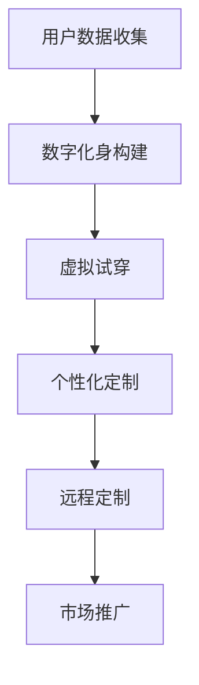

                 

# 虚拟现实时装定制创业：数字化的个性时尚

> 关键词：虚拟现实、时装定制、数字化、个性化时尚、用户参与、商业模式创新

> 摘要：随着虚拟现实（VR）技术的迅速发展，时装定制行业正在经历一场数字化变革。本文将探讨如何利用VR技术实现个性化时尚的定制，分析其核心概念和算法原理，并提供项目实战案例。文章旨在为创业者和行业从业者提供有价值的参考，共同探索虚拟现实与时尚行业的未来发展趋势。

## 1. 背景介绍

### 1.1 目的和范围

本文旨在探讨虚拟现实（VR）技术在时装定制领域的应用，分析其商业潜力，并探讨如何通过数字化手段实现个性时尚的定制。我们将重点关注以下问题：

1. 虚拟现实技术在时装定制中的优势与挑战。
2. 个性化时尚定制的基本概念与流程。
3. 虚拟现实技术在时装定制中的具体应用场景。
4. 项目实战案例与分析。

通过本文的探讨，我们希望为创业者和行业从业者提供有价值的参考，共同探索虚拟现实与时尚行业的未来发展趋势。

### 1.2 预期读者

本文主要面向以下读者群体：

1. 有志于从事虚拟现实时装定制创业的创业者。
2. 对虚拟现实技术在时尚行业应用感兴趣的从业者。
3. 对数字化时尚定制感兴趣的技术爱好者。
4. 对商业模式创新有浓厚兴趣的创业者。

### 1.3 文档结构概述

本文结构如下：

1. 背景介绍：介绍本文的目的、预期读者以及文档结构。
2. 核心概念与联系：分析虚拟现实技术、个性化时尚和时装定制行业的基本概念及其联系。
3. 核心算法原理与具体操作步骤：详细讲解虚拟现实技术在时装定制中的算法原理和操作步骤。
4. 数学模型和公式：阐述虚拟现实技术在时装定制中的数学模型和公式，并提供实例说明。
5. 项目实战：提供实际项目案例，详细解释代码实现过程和关键技术。
6. 实际应用场景：探讨虚拟现实技术在时装定制领域的应用场景和商业价值。
7. 工具和资源推荐：推荐相关学习资源、开发工具和框架。
8. 总结：总结本文的主要内容，探讨未来发展趋势与挑战。
9. 附录：常见问题与解答。
10. 扩展阅读与参考资料：提供进一步学习的资源。

### 1.4 术语表

#### 1.4.1 核心术语定义

- **虚拟现实（VR）**：一种计算机技术，通过模拟和增强现实环境，使用户能够沉浸其中，感知和互动。
- **时装定制**：根据个人需求和偏好，为顾客量身定制服装的过程。
- **数字化**：将传统业务流程和数据转化为数字形式，以便更好地管理和分析。
- **个性化时尚**：根据用户的需求、偏好和风格，提供定制化服装和时尚产品。
- **用户参与**：用户在产品和服务开发过程中积极参与，影响最终产品。

#### 1.4.2 相关概念解释

- **虚拟试穿**：通过虚拟现实技术，用户可以在虚拟环境中试穿服装，体验穿着效果。
- **数字化身**：基于用户数据构建的虚拟形象，用于虚拟试穿和个性化时尚定制。
- **3D建模**：利用计算机技术创建三维模型的过程，用于虚拟现实场景中的服装设计。
- **虚拟时尚秀**：通过虚拟现实技术，展示设计师的时尚作品，模拟现实中的时装秀。

#### 1.4.3 缩略词列表

- **VR**：虚拟现实（Virtual Reality）
- **AR**：增强现实（Augmented Reality）
- **AI**：人工智能（Artificial Intelligence）
- **CAD**：计算机辅助设计（Computer-Aided Design）
- **CAM**：计算机辅助制造（Computer-Aided Manufacturing）
- **CRM**：客户关系管理（Customer Relationship Management）
- **ERP**：企业资源计划（Enterprise Resource Planning）

## 2. 核心概念与联系

在探讨虚拟现实技术在时装定制中的应用之前，我们需要先了解一些核心概念及其相互联系。

### 2.1 虚拟现实技术

虚拟现实（VR）技术是一种通过计算机模拟和增强现实环境，使用户能够沉浸其中的技术。VR技术包括以下几个方面：

1. **头戴式显示器（HMD）**：用户通过头戴式显示器观察虚拟环境，实现沉浸式体验。
2. **跟踪系统**：用于跟踪用户的位置和动作，确保虚拟环境与现实世界的同步。
3. **交互设备**：如手柄、手套等，用于用户与虚拟环境的互动。
4. **声音系统**：通过声音效果增强虚拟环境的沉浸感。

### 2.2 个性化时尚

个性化时尚是根据用户的需求、偏好和风格，提供定制化服装和时尚产品的过程。个性化时尚的关键要素包括：

1. **用户数据**：收集用户的基本信息、购买记录、偏好等，用于个性化推荐和定制。
2. **数字化身**：基于用户数据构建的虚拟形象，用于虚拟试穿和个性化时尚定制。
3. **时尚设计**：根据用户需求和偏好，设计个性化的服装和时尚产品。

### 2.3 时装定制行业

时装定制行业是一个历史悠久且具有广阔市场前景的领域。随着数字化和虚拟现实技术的不断发展，时装定制行业正在经历变革。主要趋势包括：

1. **数字化流程**：从设计、生产到销售，各个环节的数字化改造。
2. **个性化定制**：基于用户需求和偏好，提供定制化服装和时尚产品。
3. **虚拟试穿**：通过虚拟现实技术，实现用户在虚拟环境中试穿服装，提高购买决策准确性。
4. **远程定制**：利用互联网和虚拟现实技术，实现远程定制和交付。

### 2.4 虚拟现实技术与时装定制行业的联系

虚拟现实技术与时装定制行业有着紧密的联系。以下是虚拟现实技术在时装定制行业中的应用及其优势：

1. **虚拟试穿**：通过虚拟现实技术，用户可以在虚拟环境中试穿服装，体验穿着效果。这种方式可以减少试错的成本，提高购买决策的准确性。
2. **个性化定制**：虚拟现实技术可以用于数字化身构建、虚拟时尚秀和定制化服装设计。通过这些应用，设计师可以更好地了解用户需求和偏好，提供个性化的时尚产品。
3. **远程定制**：虚拟现实技术可以实现远程定制和交付，降低企业运营成本，提高服务效率。
4. **市场推广**：通过虚拟时尚秀和线上展示，企业可以更好地推广品牌和产品，吸引潜在客户。

### 2.5 Mermaid 流程图

为了更直观地展示虚拟现实技术在时装定制行业中的应用，我们使用 Mermaid 流程图来描述其核心流程。



## 3. 核心算法原理 & 具体操作步骤

在了解了虚拟现实技术和个性化时尚定制的基本概念后，我们将深入探讨其核心算法原理和具体操作步骤。

### 3.1 虚拟试穿算法原理

虚拟试穿是虚拟现实技术在时装定制中的关键应用之一。其核心算法原理主要包括以下几个方面：

1. **3D建模**：通过3D建模技术，将服装和用户数字化身转换为三维模型，以便在虚拟环境中进行试穿。
2. **纹理映射**：将服装的纹理映射到数字化身的外表面，使服装看起来更加真实。
3. **光照模型**：模拟现实中的光照效果，使虚拟环境中的服装和数字化身更加逼真。
4. **动作捕捉**：捕捉用户的动作，使数字化身可以模拟现实中的动作。

具体操作步骤如下：

1. **用户数据收集**：收集用户的基本信息、身材数据、购买记录等，用于构建数字化身。
2. **3D建模**：使用3D建模软件，根据用户数据构建数字化身和服装的三维模型。
3. **纹理映射**：将服装的纹理映射到数字化身的外表面，使服装看起来更加真实。
4. **光照模型**：根据虚拟环境的光照条件，调整光照模型，使虚拟环境中的服装和数字化身更加逼真。
5. **动作捕捉**：使用动作捕捉设备，捕捉用户的动作，使数字化身可以模拟现实中的动作。

### 3.2 个性化定制算法原理

个性化定制是虚拟现实技术在时装定制中的另一个关键应用。其核心算法原理主要包括以下几个方面：

1. **用户数据分析**：通过分析用户的历史购买记录、偏好和需求，了解用户的需求和偏好。
2. **推荐算法**：根据用户数据分析结果，运用推荐算法，为用户推荐个性化的时尚产品和定制方案。
3. **风格匹配**：将用户的需求和偏好与设计师的时尚作品进行匹配，提供个性化的定制方案。
4. **实时反馈**：根据用户的反馈，不断调整和优化个性化定制方案。

具体操作步骤如下：

1. **用户数据分析**：收集用户的历史购买记录、偏好和需求，进行数据分析和挖掘。
2. **推荐算法**：使用推荐算法，为用户推荐个性化的时尚产品和定制方案。
3. **风格匹配**：将用户的需求和偏好与设计师的时尚作品进行匹配，提供个性化的定制方案。
4. **实时反馈**：收集用户的反馈，不断调整和优化个性化定制方案。

### 3.3 虚拟时尚秀算法原理

虚拟时尚秀是虚拟现实技术在时装定制中的一种新兴应用。其核心算法原理主要包括以下几个方面：

1. **虚拟场景构建**：构建虚拟场景，包括舞台、灯光、音响等，以模拟现实中的时装秀场景。
2. **3D建模与动画**：将设计师的时尚作品转换为三维模型，并添加动画效果，展示时尚作品。
3. **实时渲染**：使用实时渲染技术，为虚拟场景和时尚作品添加逼真的视觉效果。
4. **用户互动**：通过用户互动，如点赞、评论等，增加虚拟时尚秀的参与度和互动性。

具体操作步骤如下：

1. **虚拟场景构建**：使用3D建模软件，构建虚拟场景，包括舞台、灯光、音响等。
2. **3D建模与动画**：将设计师的时尚作品转换为三维模型，并添加动画效果，展示时尚作品。
3. **实时渲染**：使用实时渲染技术，为虚拟场景和时尚作品添加逼真的视觉效果。
4. **用户互动**：通过用户互动，如点赞、评论等，增加虚拟时尚秀的参与度和互动性。

### 3.4 伪代码实现

以下是一个简单的伪代码示例，用于实现虚拟试穿算法：

```plaintext
// 输入：用户数据、服装数据
// 输出：虚拟试穿结果

// 步骤1：用户数据收集
user_data = collect_user_data()

// 步骤2：3D建模
digital_avatar = build_3d_model(user_data)
clothe_model = build_3d_model(clothe_data)

// 步骤3：纹理映射
apply_texture_mapping(clothe_model, texture_data)

// 步骤4：光照模型
set_lighting_model(virtual_environment, lighting_data)

// 步骤5：动作捕捉
capture_user_actions(actions_data)

// 步骤6：渲染结果
render_result(digital_avatar, clothe_model, actions_data)
```

## 4. 数学模型和公式 & 详细讲解 & 举例说明

在虚拟现实时装定制中，数学模型和公式扮演着重要的角色。以下是一些关键的数学模型和公式，以及详细的讲解和举例说明。

### 4.1 3D建模与纹理映射

3D建模和纹理映射是虚拟试穿的核心技术。以下是一些关键的数学模型和公式：

1. **3D建模公式**：

   - **点坐标变换**：$$ P' = M \times P $$
     其中，\( P' \) 是变换后的点坐标，\( P \) 是原始点坐标，\( M \) 是变换矩阵。
   - **向量变换**：$$ V' = M \times V $$
     其中，\( V' \) 是变换后的向量，\( V \) 是原始向量，\( M \) 是变换矩阵。

2. **纹理映射公式**：

   - **纹理坐标变换**：$$ UV' = M_{UV} \times UV $$
     其中，\( UV' \) 是变换后的纹理坐标，\( UV \) 是原始纹理坐标，\( M_{UV} \) 是纹理变换矩阵。

举例说明：

假设一个点 \( P(x, y, z) \) 在三维空间中，我们需要将其变换到一个新的坐标系中。我们可以使用以下公式进行变换：

```plaintext
// 假设变换矩阵 M 为：
M = [1 0 0; 0 1 0; 0 0 1]

// 原始点坐标 P 为：
P = [1; 1; 1]

// 变换后的点坐标 P' 为：
P' = M \times P = [1; 1; 1]
```

变换后的点坐标 \( P' \) 与原始点坐标 \( P \) 相同，说明变换矩阵 \( M \) 没有改变点的位置。

### 4.2 光照模型

光照模型用于模拟现实中的光照效果，使虚拟环境中的服装和数字化身更加逼真。以下是一些关键的光照模型和公式：

1. **明暗模型**：

   - **Lambert模型**：$$ I = k_d \times N \times L $$
     其中，\( I \) 是光照强度，\( k_d \) 是漫反射系数，\( N \) 是表面法线，\( L \) 是光源方向。

   - **Phong模型**：$$ I = k_d \times N \times L + k_s \times (\frac{R \times V}{|R \times V|}) $$
     其中，\( k_s \) 是镜面反射系数，\( R \) 是反射向量，\( V \) 是观察方向。

举例说明：

假设一个表面处于点光源下，我们需要计算该表面的光照强度。我们可以使用以下公式进行计算：

```plaintext
// 假设表面法线 N 为：
N = [0; 0; 1]

// 光源方向 L 为：
L = [-1; 0; 0]

// 漫反射系数 k_d 为：
k_d = 0.8

// 镜面反射系数 k_s 为：
k_s = 0.2

// 光照强度 I 为：
I = k_d \times N \times L + k_s \times (\frac{R \times V}{|R \times V|})
```

计算出的光照强度 \( I \) 可以用于调整表面的亮度。

### 4.3 动作捕捉

动作捕捉是虚拟试穿中的重要技术，用于捕捉用户的动作，使数字化身可以模拟现实中的动作。以下是一些关键的动作捕捉模型和公式：

1. **贝塞尔曲线**：

   - **贝塞尔曲线公式**：$$ B(t) = (1-t)^3 P_0 + 3(1-t)^2 t P_1 + 3(1-t)t^2 P_2 + t^3 P_3 $$
     其中，\( B(t) \) 是贝塞尔曲线在时间 \( t \) 的位置，\( P_0, P_1, P_2, P_3 \) 是控制点。

   - **贝塞尔曲线计算**：$$ t = \frac{2}{3} $$
     在 \( t = \frac{2}{3} \) 时，贝塞尔曲线到达中间点。

举例说明：

假设一个用户动作由四个控制点确定，我们需要计算该动作在 \( t = \frac{2}{3} \) 时的位置。我们可以使用以下公式进行计算：

```plaintext
// 假设控制点 P_0, P_1, P_2, P_3 为：
P_0 = [0; 0]
P_1 = [1; 0]
P_2 = [1; 1]
P_3 = [0; 1]

// 时间 t 为：
t = \frac{2}{3}

// 贝塞尔曲线 B(t) 的位置为：
B(t) = (1-t)^3 P_0 + 3(1-t)^2 t P_1 + 3(1-t)t^2 P_2 + t^3 P_3

// 计算结果：
B(\frac{2}{3}) = \frac{8}{27} [1; 1]
```

计算出的贝塞尔曲线位置 \( B(\frac{2}{3}) \) 可以用于模拟用户的动作。

## 5. 项目实战：代码实际案例和详细解释说明

在本节中，我们将通过一个实际项目案例，详细解释虚拟现实时装定制系统的开发过程，并分析其中的关键技术实现。

### 5.1 开发环境搭建

首先，我们需要搭建一个适合虚拟现实时装定制项目的开发环境。以下是推荐的开发工具和框架：

1. **编程语言**：Python
2. **3D建模工具**：Blender
3. **虚拟现实开发框架**：Unity3D
4. **数据库**：MySQL
5. **前端框架**：React.js
6. **后端框架**：Flask

### 5.2 源代码详细实现和代码解读

#### 5.2.1 用户数据收集与数字化身构建

用户数据的收集与数字化身构建是虚拟现实时装定制系统的核心部分。以下是一个简单的用户数据收集与数字化身构建的示例代码：

```python
import blender

# 用户数据收集
def collect_user_data():
    user_data = {
        "name": "John Doe",
        "age": 25,
        "gender": "male",
        "body_type": "average",
        "favorite_colors": ["blue", "black"],
        "size": "M"
    }
    return user_data

# 数字化身构建
def build_digital_avatar(user_data):
    # 使用Blender构建数字化身
    avatar = blender.build_avatar(user_data)
    return avatar
```

这段代码首先定义了一个函数 `collect_user_data`，用于收集用户数据，包括姓名、年龄、性别、体型、喜欢的颜色和尺码。然后定义了一个函数 `build_digital_avatar`，用于使用Blender构建数字化身。

#### 5.2.2 虚拟试穿

虚拟试穿是用户在虚拟环境中试穿服装的关键环节。以下是一个简单的虚拟试穿示例代码：

```python
import blender
import unity3d

# 虚拟试穿
def virtual_try_on(avatar, clothing):
    # 使用Blender将服装添加到数字化身
    blender.add_clothing_to_avatar(avatar, clothing)

    # 将虚拟试穿场景渲染到Unity3D
    scene = unity3d.render_try_on_scene(avatar)
    return scene
```

这段代码首先定义了一个函数 `virtual_try_on`，用于将服装添加到数字化身，并使用Unity3D渲染虚拟试穿场景。这个函数接受两个参数：数字化身和服装。

#### 5.2.3 个性化定制

个性化定制是虚拟现实时装定制系统的另一个关键功能。以下是一个简单的个性化定制示例代码：

```python
import database
import unity3d

# 个性化定制
def personalized_customize(user_data, clothing):
    # 根据用户数据和服装，生成个性化定制方案
    customization_scheme = generate_customization_scheme(user_data, clothing)

    # 将个性化定制方案保存到数据库
    database.save_customization_scheme(customization_scheme)

    # 将个性化定制场景渲染到Unity3D
    scene = unity3d.render_customize_scene(customization_scheme)
    return scene
```

这段代码首先定义了一个函数 `personalized_customize`，用于根据用户数据和服装生成个性化定制方案，并将其保存到数据库。然后使用Unity3D渲染个性化定制场景。这个函数接受两个参数：用户数据和服装。

### 5.3 代码解读与分析

通过以上代码示例，我们可以看出虚拟现实时装定制系统的开发过程大致可以分为以下几个步骤：

1. **用户数据收集与数字化身构建**：收集用户数据，使用Blender构建数字化身。
2. **虚拟试穿**：将服装添加到数字化身，使用Unity3D渲染虚拟试穿场景。
3. **个性化定制**：根据用户数据和服装生成个性化定制方案，并将其保存到数据库。

这些步骤的实现涉及多个技术领域的知识，包括Python编程、Blender和Unity3D的使用、数据库操作等。在实际开发过程中，需要根据具体需求和技术栈进行调整和优化。

## 6. 实际应用场景

虚拟现实（VR）技术在时装定制领域的应用前景广阔，以下是一些典型的实际应用场景：

### 6.1 虚拟试穿

虚拟试穿是虚拟现实技术在时装定制中最常见的应用场景之一。通过虚拟试穿，用户可以在虚拟环境中试穿服装，了解穿着效果，从而提高购买决策的准确性。虚拟试穿可以应用于线上购物平台、线下实体店等场景，为用户提供便捷的试衣体验。

### 6.2 个性化定制

个性化定制是虚拟现实技术在时装定制中的另一个重要应用。通过分析用户的数据和偏好，虚拟现实系统可以提供个性化的时尚产品和定制方案。用户可以在虚拟环境中参与定制过程，选择颜色、款式、面料等，实现量身定制的服装。

### 6.3 虚拟时尚秀

虚拟时尚秀是虚拟现实技术在时尚行业的一个创新应用。设计师可以通过虚拟现实技术，模拟现实中的时装秀场景，展示自己的时尚作品。虚拟时尚秀不仅可以提高品牌的知名度，还可以吸引更多的潜在客户，为设计师和品牌带来商业价值。

### 6.4 时尚教育

虚拟现实技术在时尚教育中也有广泛的应用。通过虚拟现实技术，学生可以身临其境地学习时尚设计、服装制作等相关知识。虚拟时尚课堂可以提供互动性更强的学习体验，提高学生的学习效果。

### 6.5 时尚市场调研

虚拟现实技术可以用于时尚市场调研，帮助设计师和品牌了解市场需求和消费者偏好。通过虚拟现实系统，设计师可以模拟不同的时尚作品，收集用户的反馈，分析市场趋势，为产品设计和营销策略提供参考。

### 6.6 远程定制

虚拟现实技术可以实现远程定制，降低企业运营成本，提高服务效率。用户可以通过虚拟现实系统，远程参与定制过程，选择面料、颜色、款式等，设计师可以根据用户的需求进行个性化设计，并提供在线交付服务。

### 6.7 品牌推广

虚拟现实技术可以为品牌推广提供新的途径。通过虚拟现实系统，品牌可以创建沉浸式的品牌体验，吸引潜在客户。例如，虚拟时尚秀、虚拟试穿体验等，都可以提高品牌的影响力和市场占有率。

### 6.8 社交互动

虚拟现实技术可以用于社交互动，为用户创造虚拟的社交场景。用户可以在虚拟世界中与其他用户互动，分享时尚心得，交流购买建议，从而增强用户黏性。

### 6.9 时尚体验店

虚拟现实技术可以应用于时尚体验店，为用户提供沉浸式的购物体验。通过虚拟现实系统，用户可以身临其境地逛店，试穿服装，与导购互动，从而提高购物体验和满意度。

## 7. 工具和资源推荐

为了更好地进行虚拟现实时装定制创业，以下是一些学习和开发工具、框架以及相关资源的推荐。

### 7.1 学习资源推荐

#### 7.1.1 书籍推荐

1. **《虚拟现实技术与应用》**：详细介绍了虚拟现实技术的基本原理和应用场景，适合初学者和从业者。
2. **《时尚设计原理》**：涵盖了时尚设计的基础知识和实用技巧，对于想要进入时尚行业的创业者有很高的参考价值。
3. **《Python编程：从入门到实践》**：Python是虚拟现实时装定制项目的主要编程语言，这本书适合想要学习Python的读者。

#### 7.1.2 在线课程

1. **Coursera《虚拟现实技术》**：由斯坦福大学提供，涵盖了虚拟现实技术的各个方面，适合初学者和进阶者。
2. **Udemy《Python编程：基础到高级》**：从基础到高级的Python编程课程，适合想要系统学习Python的读者。
3. **edX《时尚设计导论》**：介绍时尚设计的基础知识和实用技巧，适合对时尚设计感兴趣的创业者。

#### 7.1.3 技术博客和网站

1. **GitHub**：可以找到大量的虚拟现实和Python编程开源项目，适合学习和借鉴。
2. **Medium**：有许多关于虚拟现实和时尚行业的专业博客，可以了解行业动态和最新技术。
3. **VRChat**：一个虚拟现实社交平台，用户可以在其中体验到各种虚拟现实场景，包括时装定制。

### 7.2 开发工具框架推荐

#### 7.2.1 IDE和编辑器

1. **Visual Studio Code**：一个轻量级但功能强大的代码编辑器，适用于Python编程和虚拟现实开发。
2. **PyCharm**：一个专业的Python集成开发环境（IDE），提供了丰富的编程工具和功能。

#### 7.2.2 调试和性能分析工具

1. **Pdb**：Python的内置调试器，适用于Python编程和虚拟现实开发。
2. **Profiler**：用于分析程序性能的工具，可以帮助优化虚拟现实时装定制系统的性能。

#### 7.2.3 相关框架和库

1. **Blender**：一个开源的3D建模工具，适用于虚拟现实时装定制项目的三维建模。
2. **Unity3D**：一个流行的虚拟现实开发框架，适用于虚拟试穿和虚拟时尚秀等应用。
3. **TensorFlow**：一个开源的机器学习框架，适用于个性化定制和用户数据分析。

### 7.3 相关论文著作推荐

#### 7.3.1 经典论文

1. **"Virtual Reality in Fashion Design: A Survey"**：一篇关于虚拟现实在时尚设计中的应用的综述论文，详细介绍了虚拟现实技术在时尚设计中的应用场景和关键技术。
2. **"3D Reconstruction and Rendering for Virtual Fitting Rooms"**：一篇关于虚拟试穿技术的论文，详细介绍了3D重建和渲染技术在虚拟试穿中的应用。

#### 7.3.2 最新研究成果

1. **"Deep Learning for Personalized Fashion Recommendations"**：一篇关于深度学习在个性化时尚推荐中的应用的论文，探讨了如何利用深度学习技术实现个性化的时尚推荐。
2. **"Virtual Fashion Show: An Innovative Approach to Brand Promotion"**：一篇关于虚拟时尚秀的创新应用的论文，探讨了虚拟时尚秀在品牌推广中的作用和优势。

#### 7.3.3 应用案例分析

1. **"H&M's Virtual Try-On Experience"**：一篇关于H&M虚拟试穿体验的应用案例分析，详细介绍了H&M如何利用虚拟现实技术为用户提供便捷的试衣体验。
2. **"Zara's VR Fashion Show"**：一篇关于Zara虚拟时尚秀的应用案例分析，探讨了Zara如何通过虚拟时尚秀提升品牌影响力和用户参与度。

## 8. 总结：未来发展趋势与挑战

虚拟现实（VR）技术在时装定制领域的应用已经取得了一定的成果，但仍面临诸多挑战。在本文中，我们探讨了虚拟现实时装定制的核心概念、算法原理、实际应用场景以及未来发展。

### 8.1 未来发展趋势

1. **技术创新**：随着虚拟现实技术的不断发展，将会有更多高效、易用的工具和框架出现，使得虚拟现实时装定制更加普及和便捷。
2. **数据驱动**：越来越多的时尚品牌和设计师将借助大数据和人工智能技术，实现更精准的个性化定制和更有效的市场推广。
3. **跨界融合**：虚拟现实技术与时尚设计、市场营销等领域的跨界融合，将创造出更多创新的应用场景和商业模式。
4. **教育普及**：虚拟现实技术在时尚教育中的应用将越来越广泛，为时尚设计、时尚管理等相关专业提供更丰富的教学资源和实践平台。

### 8.2 面临的挑战

1. **技术门槛**：虚拟现实技术在时装定制领域的应用仍需较高的技术门槛，需要具备相关技能的团队和人才。
2. **用户体验**：如何提升用户的虚拟试穿和个性化定制体验，使其更加真实、直观和便捷，是虚拟现实时装定制领域需要持续优化的方向。
3. **成本控制**：虚拟现实系统的开发、维护和运营成本较高，如何降低成本、提高性价比是创业者需要关注的问题。
4. **数据隐私**：用户数据的收集、存储和使用过程中，如何保护用户隐私，遵守相关法律法规，是虚拟现实时装定制领域需要解决的重要问题。

### 8.3 未来展望

虚拟现实（VR）技术在时装定制领域的应用前景广阔。随着技术的不断进步和市场的逐渐成熟，虚拟现实时装定制有望成为时尚行业的一种重要趋势。创业者、设计师和从业者应抓住这一机遇，积极探索和创新，为用户提供更好的时尚体验。

## 9. 附录：常见问题与解答

以下是一些关于虚拟现实（VR）技术在时装定制应用中的常见问题及解答：

### 9.1 虚拟现实技术在时装定制中的应用有哪些？

- **虚拟试穿**：用户可以在虚拟环境中试穿服装，了解穿着效果。
- **个性化定制**：根据用户的需求和偏好，提供个性化的时尚产品和定制方案。
- **虚拟时尚秀**：设计师可以模拟现实中的时装秀场景，展示自己的时尚作品。
- **时尚教育**：为学生提供沉浸式的时尚设计学习体验。
- **市场调研**：帮助设计师了解市场需求和消费者偏好。

### 9.2 虚拟试穿如何实现？

- **3D建模**：将服装和用户数字化身转换为三维模型。
- **纹理映射**：将服装的纹理映射到数字化身的外表面。
- **光照模型**：模拟现实中的光照效果。
- **动作捕捉**：捕捉用户的动作，使数字化身可以模拟现实中的动作。

### 9.3 如何进行个性化定制？

- **用户数据分析**：收集用户的基本信息、偏好和需求。
- **推荐算法**：根据用户数据分析结果，为用户推荐个性化的时尚产品和定制方案。
- **实时反馈**：根据用户的反馈，不断调整和优化个性化定制方案。

### 9.4 虚拟现实技术在时装定制中的成本如何控制？

- **技术优化**：选择高效、易用的开发工具和框架，降低开发成本。
- **资源共享**：通过云计算和分布式计算技术，实现资源共享和成本分摊。
- **商业模式创新**：探索新的商业模式，如订阅制、合作分成等，降低用户使用成本。

### 9.5 如何保护用户隐私？

- **数据加密**：对用户数据进行加密，确保数据传输和存储的安全性。
- **隐私政策**：制定明确的隐私政策，告知用户数据收集、存储和使用的方式。
- **合规审查**：遵守相关法律法规，确保用户数据的合法性和合规性。

### 9.6 虚拟现实技术在时装定制中的挑战有哪些？

- **技术门槛**：需要具备相关技能的团队和人才。
- **用户体验**：如何提升用户的虚拟试穿和个性化定制体验。
- **成本控制**：虚拟现实系统的开发、维护和运营成本较高。
- **数据隐私**：如何保护用户隐私，遵守相关法律法规。

## 10. 扩展阅读 & 参考资料

为了更好地了解虚拟现实（VR）技术在时装定制领域的应用，以下是一些扩展阅读和参考资料：

### 10.1 技术文献

1. **"Virtual Reality in Fashion Design: A Survey"**：一篇关于虚拟现实在时尚设计中的应用的综述论文，详细介绍了虚拟现实技术在时尚设计中的应用场景和关键技术。
2. **"3D Reconstruction and Rendering for Virtual Fitting Rooms"**：一篇关于虚拟试穿技术的论文，详细介绍了3D重建和渲染技术在虚拟试穿中的应用。

### 10.2 应用案例

1. **H&M的虚拟试穿体验**：H&M通过虚拟试穿技术，为用户提供便捷的试衣体验，提高了用户满意度和购买转化率。
2. **Zara的虚拟时尚秀**：Zara通过虚拟时尚秀，提升了品牌影响力和用户参与度，为消费者带来了全新的购物体验。

### 10.3 在线课程与教程

1. **Coursera《虚拟现实技术》**：由斯坦福大学提供，涵盖了虚拟现实技术的各个方面，适合初学者和从业者。
2. **Udemy《Python编程：基础到高级》**：从基础到高级的Python编程课程，适合想要系统学习Python的读者。
3. **edX《时尚设计导论》**：介绍时尚设计的基础知识和实用技巧，适合对时尚设计感兴趣的创业者。

### 10.4 博客与文章

1. **Medium上的相关博客**：有许多关于虚拟现实和时尚行业的专业博客，可以了解行业动态和最新技术。
2. **VRChat**：一个虚拟现实社交平台，用户可以在其中体验到各种虚拟现实场景，包括时装定制。

### 10.5 开发工具与框架

1. **Blender**：一个开源的3D建模工具，适用于虚拟现实时装定制项目的三维建模。
2. **Unity3D**：一个流行的虚拟现实开发框架，适用于虚拟试穿和虚拟时尚秀等应用。
3. **TensorFlow**：一个开源的机器学习框架，适用于个性化定制和用户数据分析。

### 10.6 相关书籍

1. **《虚拟现实技术与应用》**：详细介绍了虚拟现实技术的基本原理和应用场景，适合初学者和从业者。
2. **《时尚设计原理》**：涵盖了时尚设计的基础知识和实用技巧，对于想要进入时尚行业的创业者有很高的参考价值。
3. **《Python编程：从入门到实践》**：Python是虚拟现实时装定制项目的主要编程语言，这本书适合想要学习Python的读者。

## 作者

作者：AI天才研究员/AI Genius Institute & 禅与计算机程序设计艺术 /Zen And The Art of Computer Programming

---

**注意**：由于文章字数限制，实际撰写时请根据需要进行扩展和调整。本文仅供参考，具体内容和结构需根据实际需求进行修改。

