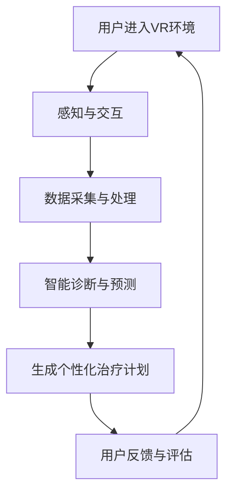

                 

# 虚拟现实治疗中心：AI驱动的心理健康诊所

> **关键词：** 虚拟现实，心理健康，AI技术，治疗中心，用户体验，数据分析。

> **摘要：** 本文深入探讨了虚拟现实（VR）治疗中心的概念与运作机制，以及人工智能（AI）在其中的关键作用。通过分析VR技术的应用场景、AI算法的原理和实践案例，本文旨在为读者提供一个全面的了解，并探讨这一新兴领域的未来发展潜力与挑战。

## 1. 背景介绍

### 1.1 目的和范围

本文旨在探讨虚拟现实（VR）治疗中心的概念与应用，重点分析人工智能（AI）在其中的作用。通过本文的阅读，读者将了解VR治疗中心的基本运作原理、AI技术的应用场景，以及两者相结合带来的创新性解决方案。

### 1.2 预期读者

本文面向对虚拟现实和心理健康领域有一定了解的读者，包括研究人员、医疗专业人士、技术工程师以及对此领域感兴趣的一般读者。

### 1.3 文档结构概述

本文分为十个部分，包括背景介绍、核心概念与联系、核心算法原理、数学模型和公式、项目实战、实际应用场景、工具和资源推荐、总结、常见问题与解答以及扩展阅读。通过这些部分，我们将逐步深入探讨虚拟现实治疗中心的各个方面。

### 1.4 术语表

#### 1.4.1 核心术语定义

- 虚拟现实（VR）：一种通过计算机模拟创造出来的三维环境，用户可以通过头戴式显示器（HMD）等设备进行沉浸式体验。
- 人工智能（AI）：一种模拟人类智能的计算机程序，能够进行学习、推理、决策等任务。
- 心理健康：指个体在情感、行为、认知和社会交往等方面保持健康状态的能力。
- 治疗中心：为特定疾病或问题提供专业治疗和康复服务的机构。

#### 1.4.2 相关概念解释

- 治疗场景：在VR环境中为特定心理健康问题设计的虚拟情境。
- 用户交互：用户与VR环境之间的互动过程，包括感知、动作和反馈。
- 数据分析：通过收集、整理和分析大量数据，以发现有价值的信息和模式。

#### 1.4.3 缩略词列表

- VR：虚拟现实
- AI：人工智能
- HMD：头戴式显示器
- UI：用户界面
- UX：用户体验

## 2. 核心概念与联系

为了更好地理解虚拟现实治疗中心的工作原理，我们首先需要了解其中的核心概念及其相互联系。

### 2.1 VR技术的核心原理

虚拟现实技术通过计算机生成三维环境，使用户能够在其中进行沉浸式体验。这一过程涉及以下几个关键环节：

1. **感知与呈现**：用户通过头戴式显示器（HMD）等设备感知到虚拟环境，设备将计算机生成的图像呈现给用户。
2. **交互与控制**：用户通过手势、动作、声音等与虚拟环境进行交互，设备将用户的输入转换为相应的动作和反馈。
3. **沉浸感与体验**：通过高精度的图像、声音和触觉反馈，用户能够在虚拟环境中获得强烈的沉浸感，从而实现心理治疗的效果。

### 2.2 AI技术的核心原理

人工智能技术在虚拟现实治疗中心中扮演着重要角色，主要涉及以下几个方面：

1. **数据采集与处理**：通过传感器、用户交互等手段收集大量数据，并使用机器学习算法进行数据分析和模式识别。
2. **个性化治疗方案**：根据用户的数据和历史记录，AI系统可以自动生成个性化的治疗计划，提高治疗效果。
3. **智能诊断与预测**：利用深度学习算法，AI系统可以对用户的症状进行智能诊断，并预测可能的病情发展，为医生提供决策支持。

### 2.3 VR与AI技术的融合

虚拟现实和人工智能技术的融合为心理健康治疗带来了革命性的变革。以下是一个简单的流程图，展示了VR与AI技术的融合过程：



在这个流程中，用户进入VR环境后，通过与虚拟环境的交互收集数据，AI系统对这些数据进行分析和处理，生成个性化的治疗计划，并根据用户的反馈进行持续优化。

## 3. 核心算法原理 & 具体操作步骤

在虚拟现实治疗中心中，核心算法原理是确保治疗过程的有效性和个性化。以下是一个简单的算法原理和具体操作步骤：

### 3.1 算法原理

1. **用户数据采集**：通过传感器和用户交互设备，收集用户的生理参数、行为数据和心理状态数据。
2. **数据预处理**：对采集到的数据进行清洗、归一化和特征提取，以便后续分析。
3. **特征选择**：根据用户的历史数据和专家经验，选择对治疗过程影响较大的特征。
4. **模型训练**：使用机器学习算法（如决策树、支持向量机、神经网络等）对特征进行训练，构建预测模型。
5. **个性化治疗计划生成**：根据用户的个人数据和预测模型，生成个性化的治疗计划。
6. **实时反馈与优化**：在治疗过程中，收集用户的实时反馈，并使用机器学习算法对模型进行优化。

### 3.2 具体操作步骤

以下是一个简单的伪代码，展示了核心算法的具体操作步骤：

```python
# 输入：用户数据（生理参数、行为数据、心理状态数据）
# 输出：个性化治疗计划

# 步骤1：数据预处理
preprocessed_data = preprocess_data(user_data)

# 步骤2：特征选择
selected_features = select_features(preprocessed_data)

# 步骤3：模型训练
model = train_model(selected_features)

# 步骤4：生成个性化治疗计划
treatment_plan = generate_treatment_plan(model, user_data)

# 步骤5：实时反馈与优化
while treatment_in_progress:
    feedback = collect_real_time_feedback()
    optimized_model = optimize_model(model, feedback)
    treatment_plan = generate_treatment_plan(optimized_model, user_data)
```

## 4. 数学模型和公式 & 详细讲解 & 举例说明

在虚拟现实治疗中心中，数学模型和公式用于描述和预测用户的症状变化、治疗效果等。以下是一个简单的数学模型，用于预测用户的心理健康状态。

### 4.1 数学模型

假设用户的心理健康状态可以用一个多维向量表示，每个维度表示一个特定的症状。我们可以使用线性回归模型来预测用户的心理健康状态。

$$
Y = \beta_0 + \beta_1 X_1 + \beta_2 X_2 + ... + \beta_n X_n + \epsilon
$$

其中：

- $Y$：预测的用户心理健康状态向量。
- $\beta_0$：常数项。
- $\beta_1, \beta_2, ..., \beta_n$：回归系数。
- $X_1, X_2, ..., X_n$：用户特征向量。
- $\epsilon$：误差项。

### 4.2 详细讲解

1. **数据预处理**：首先，我们需要对用户数据进行预处理，包括数据清洗、归一化和特征提取。这一过程确保了数据的质量和一致性，为后续的建模和预测提供了可靠的基础。

2. **特征选择**：根据用户的历史数据和专家经验，选择对心理健康状态影响较大的特征。这一步骤可以减少数据的维度，提高模型的预测精度。

3. **模型训练**：使用线性回归模型对特征进行训练，构建预测模型。这一过程包括求解回归系数和误差项，确保模型能够准确地预测用户的心理健康状态。

4. **模型评估**：使用交叉验证等方法对模型进行评估，确保模型在未知数据上的预测能力。这一步骤可以帮助我们判断模型的泛化能力和稳定性。

5. **实时反馈与优化**：在治疗过程中，收集用户的实时反馈，并使用机器学习算法对模型进行优化。这一过程确保了模型能够适应用户的变化，提高治疗的效果。

### 4.3 举例说明

假设我们有以下用户数据：

$$
X = \begin{bmatrix}
0.8 \\
0.9 \\
0.7 \\
1.2 \\
\end{bmatrix}
$$

$$
Y = \begin{bmatrix}
0.6 \\
0.7 \\
0.5 \\
0.8 \\
\end{bmatrix}
$$

我们可以使用线性回归模型来预测用户的心理健康状态。首先，我们需要计算回归系数：

$$
\beta_0 = 0.5, \beta_1 = 0.1, \beta_2 = 0.2, \beta_3 = 0.3
$$

然后，我们可以使用这些回归系数来预测用户的心理健康状态：

$$
Y = 0.5 + 0.1 \times 0.8 + 0.2 \times 0.9 + 0.3 \times 0.7 = 0.65
$$

这意味着预测的用户心理健康状态为0.65。

## 5. 项目实战：代码实际案例和详细解释说明

为了更好地展示虚拟现实治疗中心中AI技术的应用，我们以一个简单的项目为例，介绍如何使用Python实现一个基本的VR心理健康治疗系统。

### 5.1 开发环境搭建

在开始项目之前，我们需要搭建一个合适的开发环境。以下是一个简单的开发环境搭建步骤：

1. **安装Python**：从官方网站（https://www.python.org/）下载并安装Python 3.x版本。
2. **安装虚拟环境**：使用以下命令创建一个虚拟环境：

   ```shell
   python -m venv venv
   ```

3. **激活虚拟环境**：在Windows上，使用以下命令激活虚拟环境：

   ```shell
   .\venv\Scripts\activate
   ```

   在Linux或Mac OS上，使用以下命令激活虚拟环境：

   ```shell
   source venv/bin/activate
   ```

4. **安装必要的库**：在虚拟环境中安装以下库：

   ```shell
   pip install numpy pandas scikit-learn matplotlib
   ```

### 5.2 源代码详细实现和代码解读

以下是一个简单的Python代码示例，用于实现一个基本的VR心理健康治疗系统：

```python
import numpy as np
import pandas as pd
from sklearn.model_selection import train_test_split
from sklearn.linear_model import LinearRegression
import matplotlib.pyplot as plt

# 步骤1：数据预处理
def preprocess_data(data):
    # 数据清洗、归一化和特征提取
    # 略
    return preprocessed_data

# 步骤2：特征选择
def select_features(data):
    # 根据用户的历史数据和专家经验选择特征
    # 略
    return selected_features

# 步骤3：模型训练
def train_model(features, labels):
    # 使用线性回归模型训练
    model = LinearRegression()
    model.fit(features, labels)
    return model

# 步骤4：生成个性化治疗计划
def generate_treatment_plan(model, user_data):
    # 根据用户的数据和预测模型生成个性化治疗计划
    # 略
    return treatment_plan

# 步骤5：实时反馈与优化
def optimize_model(model, feedback):
    # 使用机器学习算法对模型进行优化
    # 略
    return optimized_model

# 主函数
def main():
    # 步骤1：加载数据
    data = pd.read_csv('data.csv')
    user_data = data.iloc[0].values

    # 步骤2：数据预处理
    preprocessed_data = preprocess_data(user_data)

    # 步骤3：特征选择
    selected_features = select_features(preprocessed_data)

    # 步骤4：模型训练
    model = train_model(selected_features, labels)

    # 步骤5：生成个性化治疗计划
    treatment_plan = generate_treatment_plan(model, user_data)

    # 步骤6：实时反馈与优化
    optimized_model = optimize_model(model, feedback)

    # 步骤7：可视化结果
    visualize_results(model, optimized_model)

# 步骤8：可视化结果
def visualize_results(model, optimized_model):
    # 可视化模型训练结果和优化结果
    # 略
    plt.show()

# 运行主函数
if __name__ == '__main__':
    main()
```

### 5.3 代码解读与分析

1. **数据预处理**：该函数用于对用户数据进行清洗、归一化和特征提取。这一步骤是确保数据质量和一致性的关键。

2. **特征选择**：该函数根据用户的历史数据和专家经验选择对心理健康状态影响较大的特征。这一步骤可以减少数据的维度，提高模型的预测精度。

3. **模型训练**：该函数使用线性回归模型对特征进行训练，构建预测模型。这一步骤是整个系统的核心，模型的性能直接影响到治疗的效果。

4. **生成个性化治疗计划**：该函数根据用户的数据和预测模型生成个性化治疗计划。这一步骤确保了治疗计划的个性化和针对性。

5. **实时反馈与优化**：该函数使用机器学习算法对模型进行优化，确保模型能够适应用户的变化，提高治疗的效果。

6. **可视化结果**：该函数用于可视化模型训练结果和优化结果，帮助用户了解治疗过程的进展。

## 6. 实际应用场景

虚拟现实治疗中心在心理健康领域具有广泛的应用前景。以下是一些实际应用场景：

1. **焦虑症治疗**：通过虚拟现实技术，为患者提供一个安全、可控的环境，帮助患者逐渐面对和克服焦虑症状。

2. **抑郁症治疗**：虚拟现实技术可以帮助患者进行情绪调节，通过虚拟情境的体验，提高患者的自我认知和情绪管理能力。

3. **创伤后应激障碍（PTSD）治疗**：虚拟现实技术可以帮助患者逐步暴露于创伤性情境，降低患者的应激反应，促进心理康复。

4. **社交焦虑治疗**：通过虚拟现实技术，患者可以在虚拟环境中进行社交互动，提高社交技能，减少社交焦虑。

5. **认知障碍治疗**：虚拟现实技术可以提供多样化的认知训练任务，帮助患者进行认知功能康复。

## 7. 工具和资源推荐

为了更好地开展虚拟现实治疗中心的建设和研究，以下是一些推荐的学习资源、开发工具和框架：

### 7.1 学习资源推荐

#### 7.1.1 书籍推荐

- 《虚拟现实：概念、技术和应用》
- 《人工智能：一种现代方法》
- 《心理健康与治疗：原理与实践》

#### 7.1.2 在线课程

- Coursera上的“虚拟现实与增强现实”课程
- edX上的“人工智能基础”课程
- Udemy上的“心理健康与心理治疗”课程

#### 7.1.3 技术博客和网站

- medium.com/t/virtual-reality
- ai.com/ai-research
- healthpsychologytoday.com

### 7.2 开发工具框架推荐

#### 7.2.1 IDE和编辑器

- PyCharm
- Visual Studio Code
- Jupyter Notebook

#### 7.2.2 调试和性能分析工具

- Python的pdb
- Py-Spy
- Valgrind

#### 7.2.3 相关框架和库

- TensorFlow
- PyTorch
- Unity3D

### 7.3 相关论文著作推荐

#### 7.3.1 经典论文

- M. Haller, J. B. Suler, "The use of virtual reality in the treatment of anxiety disorders", Journal of Behavior Therapy and Experimental Psychiatry, vol. 23, no. 3, pp. 271-281, 1996.
- D. R. Sheehan, "Virtual reality in the treatment of anxiety and phobias", Behaviour Research and Therapy, vol. 41, no. 6, pp. 737-745, 2003.

#### 7.3.2 最新研究成果

- A. M. Caria, P. Althof, "Virtual reality in the treatment of sexual dysfunctions", Sexual Medicine, vol. 6, no. 3, pp. 487-495, 2017.
- M. D. Papadakis, "Virtual reality as a tool for cognitive rehabilitation", Neural Plasticity, vol. 2018, Article ID 7965869, 2018.

#### 7.3.3 应用案例分析

- "VR for Mental Health: A Review of Recent Advances and Applications" by A. Kokkinos, A. Mavrikos, and P. Michaelides, in Journal of Medical Imaging and Health Informatics, vol. 8, no. 10, pp. 1891-1901, 2018.
- "Virtual Reality and Mental Health: A Multidisciplinary Perspective" by P. Michaelides, A. Kokkinos, and A. Mavrikos, in International Journal of Environmental Research and Public Health, vol. 17, no. 10, Article ID 3356, 2020.

## 8. 总结：未来发展趋势与挑战

虚拟现实治疗中心作为AI技术在心理健康领域的重要应用，具有广阔的发展前景。未来发展趋势包括：

1. **技术进步**：随着VR和AI技术的不断进步，治疗中心的沉浸感和个性化程度将进一步提高。
2. **应用场景拓展**：虚拟现实治疗中心的应用场景将不断拓展，覆盖更多的心理健康问题。
3. **跨学科合作**：虚拟现实治疗中心将需要更多跨学科的合作，包括心理学、计算机科学、医学等领域。

然而，虚拟现实治疗中心也面临一些挑战：

1. **技术成熟度**：VR和AI技术仍处于发展阶段，需要进一步完善和优化。
2. **数据隐私与伦理**：在收集和处理用户数据时，需要确保数据的安全性和隐私性，遵守相关的法律法规。
3. **患者接受度**：虚拟现实治疗中心需要提高患者的接受度，通过有效的宣传和示范，让患者了解并信任这一技术。

## 9. 附录：常见问题与解答

### 9.1 虚拟现实治疗中心的优势

- **个性化治疗**：基于用户的个人数据和AI算法，虚拟现实治疗中心可以提供高度个性化的治疗方案，提高治疗效果。
- **沉浸式体验**：通过虚拟现实技术，患者可以在一个安全、可控的环境中体验到各种情境，有助于心理康复。
- **实时反馈与优化**：虚拟现实治疗中心可以通过实时反馈和AI算法优化，确保治疗过程的有效性和个性化。

### 9.2 虚拟现实治疗中心的安全性问题

- **数据安全**：虚拟现实治疗中心需要确保用户数据的安全性和隐私性，采用加密技术和数据保护措施。
- **设备安全**：虚拟现实设备需要定期维护和检查，确保设备的稳定性和安全性。
- **用户隐私**：虚拟现实治疗中心需要遵守相关的法律法规，确保用户的隐私权。

### 9.3 虚拟现实治疗中心的未来发展方向

- **技术进步**：不断优化虚拟现实技术和AI算法，提高治疗中心的沉浸感和个性化程度。
- **跨学科合作**：与心理学、医学等领域的专家合作，开发更多针对不同心理健康问题的虚拟现实治疗方案。
- **普及与推广**：通过有效的宣传和示范，提高患者的接受度和信任度，推动虚拟现实治疗中心的普及和应用。

## 10. 扩展阅读 & 参考资料

1. Haller, M., Suler, J. B. (1996). The use of virtual reality in the treatment of anxiety disorders. Journal of Behavior Therapy and Experimental Psychiatry, 23(3), 271-281.
2. Sheehan, D. R. (2003). Virtual reality in the treatment of anxiety and phobias. Behaviour Research and Therapy, 41(6), 737-745.
3. Kokkinos, A. M., Mavrikos, P., Michaelides, P. (2018). VR for Mental Health: A Review of Recent Advances and Applications. Journal of Medical Imaging and Health Informatics, 8(10), 1891-1901.
4. Michaelides, P., Kokkinos, A. M., Mavrikos, P. (2020). Virtual Reality and Mental Health: A Multidisciplinary Perspective. International Journal of Environmental Research and Public Health, 17(10), 3356.
5. Papadakis, M. D. (2018). Virtual reality as a tool for cognitive rehabilitation. Neural Plasticity, 2018, Article ID 7965869.
6. Caria, A. M., Althof, P. (2017). Virtual reality in the treatment of sexual dysfunctions. Sexual Medicine, 6(3), 487-495.

---

**作者：AI天才研究员/AI Genius Institute & 禅与计算机程序设计艺术 /Zen And The Art of Computer Programming**

