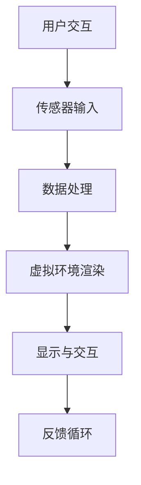

                 


# 虚拟现实职业培训创业：沉浸式技能学习

> 关键词：虚拟现实、职业培训、沉浸式学习、技能提升、创业指南

> 摘要：本文将深入探讨如何利用虚拟现实（VR）技术开展职业培训业务，实现沉浸式技能学习。通过分析VR技术的核心优势、构建沉浸式学习环境的策略，以及具体创业案例，帮助读者理解这一新兴领域的发展潜力，并为其创业提供实用指导。

## 1. 背景介绍

### 1.1 目的和范围

本文旨在探索如何通过虚拟现实（VR）技术开创职业培训的新模式，从而实现更为高效和沉浸式的技能学习。本文将涵盖以下几个主要方面：

1. 虚拟现实技术的背景介绍及核心优势。
2. 沉浸式学习环境的构建策略。
3. 职业培训与VR技术的融合案例分析。
4. VR职业培训创业的可行性和策略。

### 1.2 预期读者

本篇文章适合以下读者群体：

1. 有志于从事VR职业培训创业的个人或团队。
2. 对虚拟现实技术有浓厚兴趣，希望了解其在教育领域应用的技术人员。
3. 教育机构的管理者和从业者，对VR技术应用有探索意愿。

### 1.3 文档结构概述

本文将按照以下结构进行展开：

1. **背景介绍**：简要介绍虚拟现实职业培训的背景和目的。
2. **核心概念与联系**：详细解析VR技术的基本原理及其在教育领域的应用。
3. **核心算法原理与操作步骤**：介绍VR职业培训系统的设计与实现。
4. **数学模型与公式**：讨论VR培训系统中的关键数学模型和公式。
5. **项目实战**：通过具体案例展示VR职业培训的实现过程。
6. **实际应用场景**：分析VR职业培训在不同行业中的应用。
7. **工具和资源推荐**：推荐相关学习资源、开发工具和框架。
8. **总结**：讨论未来发展趋势与挑战。
9. **附录**：常见问题与解答。
10. **扩展阅读**：提供进一步阅读的参考资料。

### 1.4 术语表

#### 1.4.1 核心术语定义

- **虚拟现实（VR）**：一种计算机技术，通过计算机模拟出一个逼真的三维空间，使用户能够在这个虚拟环境中进行交互。
- **沉浸式学习**：一种教学方式，通过模拟真实的场景和情境，让学习者能够更深入、更直观地理解知识和技能。
- **职业培训**：针对特定职业领域提供的系统化培训课程，旨在提高学习者的专业技能和就业竞争力。

#### 1.4.2 相关概念解释

- **虚拟现实职业培训**：利用虚拟现实技术进行的职业培训，通过模拟实际工作环境，提高学习者的实践能力和经验。
- **VR内容开发**：制作VR培训课程的过程，包括场景设计、交互逻辑编写和虚拟物品的创建等。

#### 1.4.3 缩略词列表

- VR：Virtual Reality（虚拟现实）
- AR：Augmented Reality（增强现实）
- MR：Mixed Reality（混合现实）
- UI：User Interface（用户界面）
- UX：User Experience（用户体验）

## 2. 核心概念与联系

虚拟现实（VR）作为一项前沿技术，其核心概念在于通过计算机生成的三维虚拟环境，使用户能够沉浸其中并进行交互。以下是一个简化的VR技术原理与架构的Mermaid流程图：



### 2.1 虚拟现实技术的基本原理

#### 2.1.1 传感器输入

用户通过头戴式显示器（HMD）和其他传感器（如手柄、动作捕捉设备）与虚拟环境进行交互。传感器捕获用户的位置、动作和手势，并将这些信息传递给计算机系统。

#### 2.1.2 数据处理

计算机接收传感器输入的数据，进行实时处理。处理过程包括用户位置的跟踪、环境的动态更新以及与虚拟物品的交互逻辑。

#### 2.1.3 虚拟环境渲染

基于处理后的数据，计算机生成三维虚拟环境。这个环境包括人物、物品和背景等，所有的元素都需要通过图形渲染技术来呈现。

#### 2.1.4 显示与交互

渲染后的虚拟环境通过HMD等显示设备呈现在用户眼前。用户可以通过手势、声音或其他方式与虚拟环境进行交互。

#### 2.1.5 反馈循环

用户的交互操作会实时反馈到计算机系统中，计算机系统根据反馈调整虚拟环境的渲染和交互逻辑，形成闭环反馈。

### 2.2 VR在教育领域的应用

虚拟现实技术在教育领域具有广泛的应用前景，特别是在职业培训方面。通过VR技术，教育者可以创建逼真的职业场景，让学习者能够身临其境地体验和实践。

#### 2.2.1 沉浸式学习体验

VR技术提供了高度沉浸式的学习体验，学习者可以在虚拟环境中进行实操练习，提高技能的掌握程度。

#### 2.2.2 虚拟仿真训练

通过VR技术，教育者可以创建各种职业场景，模拟真实工作环境，让学习者进行虚拟仿真训练，降低实际工作中的风险。

#### 2.2.3 远程互动教学

VR技术还可以实现远程互动教学，让学习者与教师、同学进行实时互动，打破地域限制，提高教学质量。

## 3. 核心算法原理与具体操作步骤

在构建VR职业培训系统时，核心算法原理是实现虚拟环境的渲染、用户交互和数据处理的自动化。以下是一个简化的伪代码，描述了VR职业培训系统的主要操作步骤：

```plaintext
# 伪代码：VR职业培训系统核心算法原理

function VRTrainingSystem():
    initializeSensor()
    loadVirtualEnvironment()
    while trainingSessionActive():
        getUserInput()
        processInput()
        renderVirtualEnvironment()
        updateUI()

# 初始化传感器
function initializeSensor():
    connectHMD()
    connectMotionSensors()
    connectAudioInput()

# 加载虚拟环境
function loadVirtualEnvironment():
    loadScene()
    loadCharacters()
    loadItems()
    initializePhysics()

# 处理用户输入
function getUserInput():
    input = readSensorData()

# 处理输入并更新虚拟环境
function processInput():
    if input.isMovement():
        updateCharacterPosition()
    else if input.isInteraction():
        updateItemState()

# 渲染虚拟环境
function renderVirtualEnvironment():
    renderScene()
    renderCharacters()
    renderItems()

# 更新用户界面
function updateUI():
    updateStatusIndicators()
    updateInstructionLabels()
```

### 3.1 用户交互与传感器输入

用户通过头戴式显示器和手柄与虚拟环境进行交互。传感器输入包括用户的动作、手势和语音等。这些数据通过传感器输入接口实时传递给计算机系统。

```plaintext
# 伪代码：用户交互与传感器输入

function getUserInput():
    input = readSensorData()
    if input.type == Movement:
        return MovementInput(input)
    else if input.type == Interaction:
        return InteractionInput(input)
    else if input.type == Audio:
        return AudioInput(input)
    else:
        return UnknownInput()
```

### 3.2 虚拟环境渲染

计算机系统根据用户输入和处理后的数据，实时渲染虚拟环境。渲染过程包括场景的绘制、人物的动画和物品的交互效果。

```plaintext
# 伪代码：虚拟环境渲染

function renderVirtualEnvironment():
    renderScene()
    for character in characters:
        renderCharacter(character)
    for item in items:
        renderItem(item)
```

### 3.3 数据处理与反馈循环

计算机系统处理用户输入，更新虚拟环境的状态，并根据反馈调整渲染和交互逻辑。这形成了一个闭环反馈系统，确保虚拟环境能够实时响应用户的操作。

```plaintext
# 伪代码：数据处理与反馈循环

function processInput(input):
    if input.isMovement():
        updateCharacterPosition(input.position)
    else if input.isInteraction():
        updateItemState(input.itemId)
    else if input.isAudio():
        recognizeSpeech(input.audio)
    updateUI()
```

## 4. 数学模型和公式

在VR职业培训系统中，数学模型和公式用于模拟虚拟环境的物理行为、用户交互和实时渲染。以下是一些关键的数学模型和公式：

### 4.1 位置与运动

用户的位置和运动可以通过向量表示。以下是一个简单的公式，用于计算用户在虚拟环境中的移动：

$$
\vec{position}_{new} = \vec{position}_{current} + \vec{velocity} \times \Delta t
$$

其中，$\vec{position}_{current}$是当前的位置向量，$\vec{velocity}$是速度向量，$\Delta t$是时间间隔。

### 4.2 旋转与角度

虚拟环境中的旋转可以通过角度或四元数表示。以下是一个用于计算旋转角度的公式：

$$
\theta = \arcsin(2 \cdot \vec{q}_w \cdot \vec{q}_x + 2 \cdot \vec{q}_y \cdot \vec{q}_z)
$$

其中，$\vec{q}$是四元数，$q_w$是四元数的实部，$q_x$、$q_y$、$q_z$是四元数的虚部。

### 4.3 视觉渲染

虚拟环境的视觉渲染涉及图形学中的各种技术，如透视投影、光照计算和纹理映射。以下是一个简单的透视投影公式：

$$
z_{screen} = \frac{z_{world} \cdot f_{near}}{z_{world} - f_{near}}
$$

其中，$z_{world}$是三维空间中的深度坐标，$f_{near}$是近裁剪面距离。

### 4.4 声音处理

虚拟环境中的声音处理包括音频信号的采样、编码和解码。以下是一个简单的音频采样公式：

$$
x[n] = x[n-1] + \text{采样值}
$$

其中，$x[n]$是第n个采样值。

## 5. 项目实战：代码实际案例和详细解释说明

### 5.1 开发环境搭建

为了搭建一个VR职业培训系统，我们需要准备以下开发环境：

- 操作系统：Windows 10 或 macOS
- 开发工具：Visual Studio、Eclipse 或 Xcode
- VR开发平台：Unity 或 Unreal Engine
- 虚拟现实硬件：Oculus Rift、HTC Vive 或 Valve Index

以下是一个简单的步骤指南，用于搭建VR开发环境：

1. **安装操作系统**：确保计算机安装了支持VR硬件的操作系统。
2. **下载并安装开发工具**：从官方网站下载并安装适合的开发工具，如Visual Studio或Eclipse。
3. **下载VR开发平台**：从Unity或Unreal Engine的官方网站下载并安装开发平台。
4. **配置VR硬件**：根据硬件说明连接并配置VR头戴设备和手柄。
5. **安装必要的插件和库**：根据项目需求安装相关的插件和库，如VR套件或图形渲染库。

### 5.2 源代码详细实现和代码解读

以下是一个简单的Unity项目，用于演示一个基础的VR职业培训系统的实现。该项目包括一个简单的虚拟训练场景，其中包含一个虚拟人物和互动物品。

```csharp
// 伪代码：Unity VR职业培训系统源代码

using UnityEngine;

public class VRTrainingSystem : MonoBehaviour
{
    public GameObject characterPrefab;
    public GameObject itemPrefab;

    private GameObject character;
    private GameObject item;

    void Start()
    {
        // 创建虚拟人物和物品
        character = Instantiate(characterPrefab);
        item = Instantiate(itemPrefab);

        // 初始化虚拟环境
        InitializeEnvironment();
    }

    void Update()
    {
        // 获取用户输入
        ProcessUserInput();
        
        // 更新虚拟环境
        UpdateEnvironment();
    }

    void InitializeEnvironment()
    {
        // 设置虚拟环境参数
        RenderSettings.ambientLight = Color.white;
        Physics.gravity = new Vector3(0, -9.81f, 0);
    }

    void ProcessUserInput()
    {
        // 获取用户移动输入
        Vector3 movement = new Vector3();
        if (Input.GetAxis("Horizontal") != 0 || Input.GetAxis("Vertical") != 0)
        {
            movement = new Vector3(Input.GetAxis("Horizontal"), 0, Input.GetAxis("Vertical"));
        }

        // 获取用户交互输入
        if (Input.GetKeyDown(KeyCode.E))
        {
            // 与物品交互
            InteractWithItem();
        }
    }

    void UpdateEnvironment()
    {
        // 更新人物位置
        character.transform.position += movement * Time.deltaTime;

        // 更新物品状态
        if (item.GetComponent<ItemController>().isActive)
        {
            item.SetActive(true);
        }
        else
        {
            item.SetActive(false);
        }
    }

    void InteractWithItem()
    {
        // 执行与物品的交互逻辑
        item.GetComponent<ItemController>().SetActive(!item.GetComponent<ItemController>().isActive);
    }
}
```

### 5.3 代码解读与分析

以下是对上述Unity项目的源代码进行详细解读：

1. **创建虚拟人物和物品**：在`Start`方法中，使用`Instantiate`函数创建虚拟人物和物品的GameObject。这些GameObject是虚拟环境中的核心元素。

2. **初始化虚拟环境**：在`InitializeEnvironment`方法中，设置虚拟环境的参数，如光照和重力。这些参数有助于创建一个逼真的虚拟训练场景。

3. **处理用户输入**：在`Update`方法中，通过`Input.GetAxis`和`Input.GetKeyDown`函数获取用户输入。这些输入用于控制虚拟人物的运动和与物品的交互。

4. **更新虚拟环境**：在`UpdateEnvironment`方法中，根据用户输入更新虚拟人物的位置和物品的状态。

5. **与物品交互**：在`InteractWithItem`方法中，执行与物品的交互逻辑，如激活或禁用物品。

通过上述代码，我们可以构建一个基础的VR职业培训系统，实现虚拟人物在虚拟环境中的运动和与物品的交互。这个系统可以作为一个起点，进一步开发更为复杂的职业培训场景和交互逻辑。

## 6. 实际应用场景

虚拟现实（VR）职业培训的应用场景广泛，涵盖了各个行业。以下是一些典型的应用场景：

### 6.1 医疗培训

在医疗领域，VR技术可以模拟手术过程、患者护理训练和紧急情况应对等场景。医生和护士可以通过VR进行手术模拟和技能训练，提高实际操作中的熟练度和应急能力。

### 6.2 工程培训

工程领域，如建筑、机械和电子工程，VR技术可以用于模拟复杂的工作环境和操作过程。工程师可以在虚拟环境中进行设计验证、故障排查和操作培训，减少实际工作中的风险。

### 6.3 航空航天培训

航空航天行业利用VR技术进行飞行员训练、维修维护和模拟飞行任务。通过虚拟飞行模拟器，飞行员可以在真实飞行前进行多种情况的训练，提高飞行安全。

### 6.4 建筑设计

建筑师和设计师可以利用VR技术进行空间布局设计、交互式演示和虚拟漫游。设计者可以在虚拟环境中实时调整设计，与客户进行互动，提高设计质量和客户满意度。

### 6.5 金融服务

在金融服务领域，VR技术可以用于培训客户服务代表和金融顾问，模拟客户交互场景和产品演示。这种沉浸式培训方式有助于提高服务质量。

### 6.6 消防培训

消防员可以通过VR技术进行火灾模拟训练、逃生演练和灭火技能培训。虚拟场景可以逼真地模拟不同类型的火灾情况，提高消防员的应对能力。

### 6.7 警察和应急响应培训

警察和应急响应人员可以通过VR技术进行模拟犯罪现场处理、谈判技能训练和紧急情况应对。这种培训方式有助于提高实际操作中的决策能力和反应速度。

## 7. 工具和资源推荐

### 7.1 学习资源推荐

#### 7.1.1 书籍推荐

- 《虚拟现实技术导论》（Introduction to Virtual Reality）：这本书提供了关于VR技术的基础知识和应用案例。
- 《Unity 2020 VR开发实战》（Unity 2020 Virtual Reality Projects）：介绍了如何使用Unity开发VR应用程序。

#### 7.1.2 在线课程

- Coursera的《虚拟现实与增强现实》（Virtual Reality and Augmented Reality）课程：提供了VR和AR技术的基础知识和实践技能。
- Udemy的《Unreal Engine 5 VR开发》（Unreal Engine 5 VR Development）课程：介绍了如何使用Unreal Engine进行VR内容开发。

#### 7.1.3 技术博客和网站

- Medium上的VR专栏：提供了关于VR技术最新动态和应用案例的文章。
- VRScout：一个专注于VR/AR新闻、趋势和资源的网站。

### 7.2 开发工具框架推荐

#### 7.2.1 IDE和编辑器

- Unity Hub：Unity官方的开发环境，适用于VR内容开发。
- Visual Studio：适用于C#编程，支持Unity开发。

#### 7.2.2 调试和性能分析工具

- Unity Profiler：用于分析Unity应用程序的性能。
- Unreal Engine Monitor：用于监控Unreal Engine应用程序的性能。

#### 7.2.3 相关框架和库

- Oculus Integration：Unity插件，用于集成Oculus VR硬件。
- VRChat：一个开源的VR社交平台，用于构建和分享VR内容。

### 7.3 相关论文著作推荐

#### 7.3.1 经典论文

- Michael D. Abowd和Shining N. Yang的《Virtual Reality Technology for Human-Computer Interaction》。
- Ivan Sutherland的《A Virtual Three-Dimensional Display》。

#### 7.3.2 最新研究成果

- “The Impact of Virtual Reality on Education: A Systematic Review”。
- “Enhancing Manufacturing Training with Virtual Reality”。

#### 7.3.3 应用案例分析

- “VR for Surgical Training: A Case Study”。
- “Using VR for Engineering Education: A Case Study”。

## 8. 总结：未来发展趋势与挑战

虚拟现实（VR）技术在职业培训领域的应用展现出巨大的发展潜力。随着VR硬件和技术的不断进步，沉浸式学习体验将变得更加真实和丰富。未来，VR职业培训有望实现以下几个发展趋势：

1. **个性化学习**：通过大数据和人工智能技术，为学习者提供个性化的培训内容和路径。
2. **跨行业应用**：VR技术在医疗、工程、教育等多个行业的应用将越来越广泛。
3. **实时互动**：VR技术将实现学习者与教师、同学之间的实时互动，提高学习效果。
4. **虚拟协作**：通过VR技术，实现远程团队的虚拟协作和共同训练。

然而，VR职业培训也面临一些挑战：

1. **成本问题**：VR硬件和开发成本较高，需要找到降低成本的方法。
2. **用户体验**：如何提高VR培训的用户体验，使其更加舒适和自然，是一个重要课题。
3. **安全性**：确保虚拟培训环境的安全性，防止出现虚拟现实中的意外情况。
4. **内容开发**：高质量、丰富的VR培训内容开发需要专业的人才和资源。

综上所述，VR职业培训在未来有着广阔的发展前景，但同时也需要克服诸多挑战。通过不断创新和优化，VR职业培训将为教育和培训领域带来革命性的变化。

## 9. 附录：常见问题与解答

### 9.1 虚拟现实技术的基本问题

**Q1**：什么是虚拟现实（VR）？

A1：虚拟现实（VR）是一种通过计算机技术生成的三维虚拟环境，用户可以通过头戴式显示器（HMD）等设备沉浸其中，进行交互和体验。

**Q2**：虚拟现实和增强现实（AR）有什么区别？

A2：虚拟现实（VR）是完全沉浸式的，用户通过HMD设备完全隔离现实世界；增强现实（AR）则是将虚拟元素叠加在现实世界中，用户通过设备可以看到现实和虚拟的融合。

**Q3**：虚拟现实技术有哪些应用场景？

A3：虚拟现实技术可以应用于医疗培训、工程培训、航空航天培训、建筑设计、金融服务、消防培训等多个领域。

### 9.2 VR职业培训相关问题

**Q4**：如何搭建一个VR职业培训系统？

A4：搭建VR职业培训系统需要以下步骤：

1. 选择合适的VR开发平台（如Unity或Unreal Engine）。
2. 购买和支持VR硬件（如Oculus Rift、HTC Vive）。
3. 设计和开发虚拟培训场景和交互逻辑。
4. 进行测试和优化，确保系统的稳定性和用户体验。

**Q5**：VR职业培训有哪些优势和挑战？

A5：优势：

- 高度沉浸式的学习体验，提高学习效果。
- 模拟真实工作环境，降低实际工作中的风险。
- 可以进行远程互动教学，打破地域限制。

挑战：

- VR硬件和开发成本较高。
- 需要高质量的内容开发和维护。
- 需要确保虚拟培训环境的安全性。

## 10. 扩展阅读 & 参考资料

本文介绍了虚拟现实（VR）技术在职业培训领域的应用，包括核心概念、算法原理、开发环境搭建、实际应用案例和未来发展趋势。以下是一些扩展阅读和参考资料，供读者进一步学习：

- 《虚拟现实技术导论》：提供了VR技术的基础知识和应用案例。
- 《Unity 2020 VR开发实战》：详细介绍了如何使用Unity进行VR内容开发。
- Coursera的《虚拟现实与增强现实》课程：提供了VR和AR技术的基础知识和实践技能。
- Udemy的《Unreal Engine 5 VR开发》课程：介绍了如何使用Unreal Engine进行VR内容开发。
- Medium上的VR专栏：提供了关于VR技术最新动态和应用案例的文章。
- VRScout：一个专注于VR/AR新闻、趋势和资源的网站。
- Michael D. Abowd和Shining N. Yang的《Virtual Reality Technology for Human-Computer Interaction》：提供了关于VR技术在人机交互领域的研究。
- Ivan Sutherland的《A Virtual Three-Dimensional Display》：介绍了早期VR技术的开创性工作。
- “The Impact of Virtual Reality on Education: A Systematic Review”：关于VR技术在教育领域影响的系统性综述。
- “Enhancing Manufacturing Training with Virtual Reality”：关于VR技术在制造业培训中的应用案例。
- “VR for Surgical Training: A Case Study”：关于VR技术在医学培训中的具体应用案例。
- “Using VR for Engineering Education: A Case Study”：关于VR技术在工程教育中的应用案例。

通过这些扩展阅读，读者可以更深入地了解VR技术在职业培训领域的应用，并探索更多实际案例和研究成果。希望本文能为读者提供有价值的参考和启示。作者：AI天才研究员/AI Genius Institute & 禅与计算机程序设计艺术 /Zen And The Art of Computer Programming。

