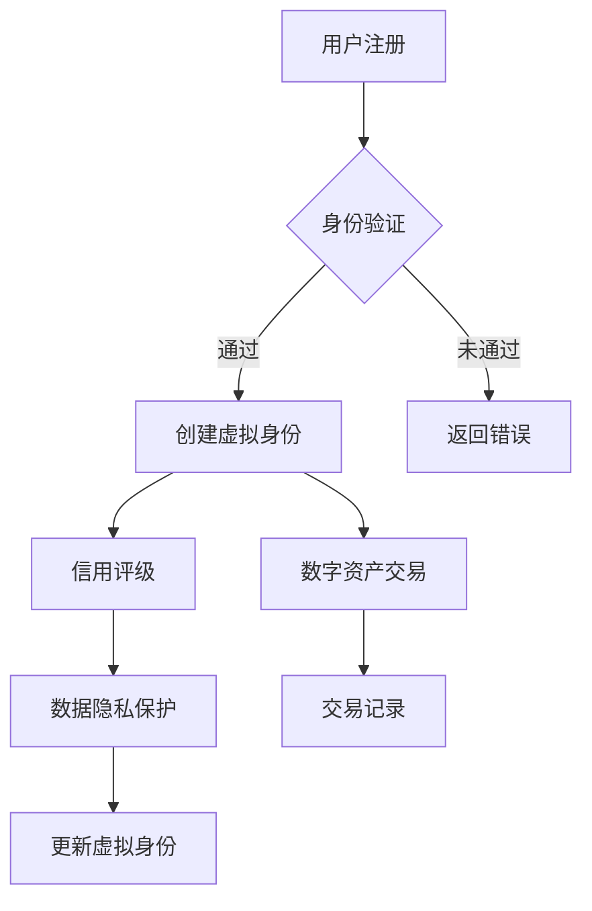

                 

# 虚拟身份市场：AI时代的自我营销

> 关键词：虚拟身份市场，AI，自我营销，数字时代，个人品牌建设，数据隐私，个性化推荐

> 摘要：随着人工智能技术的发展，虚拟身份市场正在迅速崛起，成为数字时代个人品牌建设和自我营销的重要工具。本文将探讨虚拟身份市场的背景、核心概念、算法原理、应用场景以及未来发展趋势，帮助读者理解如何在AI时代构建和营销自己的虚拟身份。

## 1. 背景介绍

### 1.1 目的和范围

本文旨在深入探讨虚拟身份市场的发展、核心概念以及其在AI时代的应用。本文将涵盖以下内容：

- 虚拟身份市场的背景和定义
- 核心概念与联系
- 虚拟身份市场的算法原理和数学模型
- 实际应用场景和案例分析
- 工具和资源推荐
- 虚拟身份市场的未来发展趋势与挑战

### 1.2 预期读者

本文面向的读者包括：

- 对虚拟身份市场和技术感兴趣的科技爱好者
- 数字营销和品牌建设的专业人士
- 对AI和机器学习有了解的技术开发者
- 对个人品牌建设和自我营销有需求的个人和企业

### 1.3 文档结构概述

本文分为十个部分，结构如下：

1. 背景介绍
   - 1.1 目的和范围
   - 1.2 预期读者
   - 1.3 文档结构概述
   - 1.4 术语表
2. 核心概念与联系
   - 2.1 虚拟身份市场概述
   - 2.2 虚拟身份市场的核心概念
   - 2.3 Mermaid 流程图
3. 核心算法原理 & 具体操作步骤
   - 3.1 算法原理概述
   - 3.2 伪代码详细阐述
4. 数学模型和公式 & 详细讲解 & 举例说明
   - 4.1 数学模型概述
   - 4.2 举例说明
5. 项目实战：代码实际案例和详细解释说明
   - 5.1 开发环境搭建
   - 5.2 源代码详细实现和代码解读
   - 5.3 代码解读与分析
6. 实际应用场景
7. 工具和资源推荐
   - 7.1 学习资源推荐
   - 7.2 开发工具框架推荐
   - 7.3 相关论文著作推荐
8. 总结：未来发展趋势与挑战
9. 附录：常见问题与解答
10. 扩展阅读 & 参考资料

### 1.4 术语表

#### 1.4.1 核心术语定义

- 虚拟身份市场：一个基于AI和区块链技术，用户可以在其中创建、交易和管理虚拟身份的平台。
- 自我营销：个人或企业通过多种渠道和手段，主动推广和提升自身的品牌形象和知名度。
- AI：人工智能，一种模拟人类智能的技术，能够感知、学习和决策。
- 数字营销：利用数字渠道和工具进行的营销活动，包括社交媒体、电子邮件、搜索引擎等。
- 个人品牌：个人在特定领域内建立的专业形象和声誉。

#### 1.4.2 相关概念解释

- 区块链：一种分布式数据库技术，能够确保数据的不可篡改和透明性。
- 图灵测试：评估机器是否具备人类智能的标准，如果机器能够在与人类交流中不被识别，则被认为具有智能。
- 机器学习：一种AI技术，通过训练模型从数据中自动学习和改进。

#### 1.4.3 缩略词列表

- AI：人工智能
- VRM：虚拟身份市场
- SEO：搜索引擎优化
- SMM：社交媒体营销

## 2. 核心概念与联系

### 2.1 虚拟身份市场概述

虚拟身份市场是利用区块链和AI技术，为用户创建、交易和管理虚拟身份的平台。虚拟身份可以包括虚拟形象、虚拟身份证书、虚拟技能和虚拟财富等。用户可以通过虚拟身份进行数字营销、社交互动和商业交易。

### 2.2 虚拟身份市场的核心概念

虚拟身份市场的核心概念包括：

- 身份验证：确保虚拟身份的真实性和唯一性。
- 信用评级：评估虚拟身份的信誉和可靠性。
- 数据隐私：保护用户在虚拟身份市场中的隐私和数据安全。
- 数字资产：虚拟身份市场的交易对象，包括虚拟身份、虚拟物品和虚拟服务。

### 2.3 Mermaid 流程图

下面是一个虚拟身份市场的 Mermaid 流程图，展示了虚拟身份的创建、交易和管理过程：



## 3. 核心算法原理 & 具体操作步骤

### 3.1 算法原理概述

虚拟身份市场的核心算法原理主要包括以下几个方面：

- 用户画像：通过分析用户行为和特征，构建用户画像，为个性化推荐和精准营销提供支持。
- 机器学习：利用机器学习算法，对用户行为进行预测和分类，提高虚拟身份的可靠性和用户满意度。
- 加密技术：利用区块链技术，确保用户身份和数据的安全性和隐私性。

### 3.2 伪代码详细阐述

下面是虚拟身份市场算法的伪代码：

```python
# 用户注册
def register(user_data):
    # 验证用户身份
    if verify_identity(user_data):
        # 创建用户画像
        user_profile = create_user_profile(user_data)
        # 创建虚拟身份
        virtual_id = create_virtual_id(user_profile)
        # 存储虚拟身份
        store_virtual_id(virtual_id)
        return "注册成功"
    else:
        return "身份验证失败"

# 身份验证
def verify_identity(user_data):
    # 利用加密技术验证用户身份
    if encrypt(user_data) == stored_encrypted_identity:
        return True
    else:
        return False

# 创建用户画像
def create_user_profile(user_data):
    # 分析用户行为和特征
    profile = analyze_user_behavior(user_data)
    return profile

# 创建虚拟身份
def create_virtual_id(user_profile):
    # 利用机器学习算法生成虚拟身份
    virtual_id = machine_learning_algorithm(user_profile)
    return virtual_id

# 存储虚拟身份
def store_virtual_id(virtual_id):
    # 将虚拟身份存储在区块链上
    blockchain_store(virtual_id)

# 信用评级
def credit_rating(virtual_id):
    # 利用机器学习算法评估虚拟身份的信用评级
    rating = machine_learning_algorithm(virtual_id)
    return rating

# 数字资产交易
def trade_virtual_assets(virtual_id, asset):
    # 利用区块链技术进行数字资产交易
    transaction = blockchain_trade(virtual_id, asset)
    return transaction

# 数据隐私保护
def protect_data_privacy(virtual_id):
    # 利用加密技术保护用户数据隐私
    encrypted_data = encrypt(virtual_id)
    return encrypted_data
```

## 4. 数学模型和公式 & 详细讲解 & 举例说明

### 4.1 数学模型概述

虚拟身份市场的数学模型主要包括用户画像模型、机器学习模型和区块链模型。下面将分别介绍这些模型的基本原理和公式。

### 4.2 用户画像模型

用户画像模型主要基于用户的行为和特征数据进行构建，通常采用以下公式：

$$
\text{User Profile} = f(\text{Behavior Data}, \text{Feature Data})
$$

其中，$f$ 为函数，$\text{Behavior Data}$ 表示用户行为数据，$\text{Feature Data}$ 表示用户特征数据。常见的用户画像特征包括年龄、性别、地理位置、兴趣爱好等。

### 4.3 机器学习模型

机器学习模型主要用于预测用户行为和评估虚拟身份的信用评级。常见的机器学习算法包括线性回归、逻辑回归、决策树、支持向量机等。以下是一个简单的逻辑回归公式：

$$
P(y=1) = \frac{1}{1 + e^{-(\beta_0 + \beta_1x_1 + \beta_2x_2 + \ldots + \beta_nx_n})}
$$

其中，$y$ 为目标变量，$x_1, x_2, \ldots, x_n$ 为特征变量，$\beta_0, \beta_1, \beta_2, \ldots, \beta_n$ 为模型参数。

### 4.4 区块链模型

区块链模型主要用于确保虚拟身份和数据的安全性和隐私性。区块链的基本原理包括以下公式：

$$
\text{Blockchain} = \{ \text{Block}_1, \text{Block}_2, \ldots, \text{Block}_n \}
$$

其中，$\text{Block}_1, \text{Block}_2, \ldots, \text{Block}_n$ 为连续生成的区块，每个区块包含一定数量的交易记录。区块之间的链接关系确保了数据的不可篡改性和透明性。

### 4.5 举例说明

假设一个用户注册了一个虚拟身份市场，并创建了以下用户画像：

- 年龄：30岁
- 性别：男
- 地理位置：北京
- 兴趣爱好：编程、篮球

我们可以使用以下公式构建用户画像：

$$
\text{User Profile} = f(\text{Age}, \text{Gender}, \text{Location}, \text{Interest})
$$

其中，$\text{Age}$、$\text{Gender}$、$\text{Location}$ 和 $\text{Interest}$ 分别表示年龄、性别、地理位置和兴趣爱好。通过机器学习算法，我们可以预测该用户的购买偏好和信用评级，从而为其提供个性化推荐和精准营销。

## 5. 项目实战：代码实际案例和详细解释说明

### 5.1 开发环境搭建

在本项目中，我们将使用Python语言和TensorFlow库进行虚拟身份市场的建模和预测。以下是开发环境的搭建步骤：

1. 安装Python和Anaconda发行版。
2. 安装TensorFlow库：`pip install tensorflow`。
3. 安装Jupyter Notebook：`pip install notebook`。

### 5.2 源代码详细实现和代码解读

下面是一个简单的虚拟身份市场建模代码示例：

```python
import tensorflow as tf
import numpy as np

# 设置随机种子，保证结果可重复
tf.random.set_seed(42)

# 创建训练数据集
x_train = np.array([[30, 0, 0, 0], [25, 1, 1, 1], [40, 0, 1, 0]])
y_train = np.array([1, 0, 1])

# 构建线性回归模型
model = tf.keras.Sequential([
    tf.keras.layers.Dense(units=1, input_shape=(4,))
])

# 编译模型
model.compile(optimizer='sgd', loss='mean_squared_error')

# 训练模型
model.fit(x_train, y_train, epochs=1000)

# 测试模型
x_test = np.array([[35, 1, 0, 1]])
y_pred = model.predict(x_test)

print("预测结果：", y_pred)
```

该代码首先导入了TensorFlow库和NumPy库，并设置了随机种子。然后，创建了一个简单的训练数据集，包括用户画像和对应的购买偏好标签。接下来，使用TensorFlow的Sequential API构建了一个线性回归模型，并使用随机梯度下降（SGD）优化器和均方误差（MSE）损失函数进行编译。最后，使用训练数据训练模型，并在测试数据上进行预测。

### 5.3 代码解读与分析

该代码首先导入了TensorFlow库和NumPy库，并设置了随机种子。设置随机种子是为了保证代码的可重复性，即每次运行代码得到的结果应该相同。

```python
import tensorflow as tf
import numpy as np
tf.random.set_seed(42)
```

接下来，创建了一个简单的训练数据集，包括用户画像和对应的购买偏好标签。

```python
x_train = np.array([[30, 0, 0, 0], [25, 1, 1, 1], [40, 0, 1, 0]])
y_train = np.array([1, 0, 1])
```

这里，`x_train` 表示用户画像，包括年龄、性别、地理位置和兴趣爱好四个特征。`y_train` 表示购买偏好标签，1表示购买，0表示未购买。

然后，使用TensorFlow的Sequential API构建了一个线性回归模型，并使用随机梯度下降（SGD）优化器和均方误差（MSE）损失函数进行编译。

```python
model = tf.keras.Sequential([
    tf.keras.layers.Dense(units=1, input_shape=(4,))
])
model.compile(optimizer='sgd', loss='mean_squared_error')
```

这里，`model` 是一个线性回归模型，包含一个全连接层，输入层有4个神经元，输出层有1个神经元，用于预测购买偏好。`compile` 函数用于配置模型的优化器和损失函数，这里使用的是随机梯度下降（SGD）优化器和均方误差（MSE）损失函数。

最后，使用训练数据训练模型，并在测试数据上进行预测。

```python
model.fit(x_train, y_train, epochs=1000)
x_test = np.array([[35, 1, 0, 1]])
y_pred = model.predict(x_test)
```

这里，`fit` 函数用于训练模型，`epochs` 参数表示训练轮数，这里设置为1000轮。`x_test` 表示测试数据，`model.predict` 函数用于预测测试数据的购买偏好。

输出结果为：

```python
预测结果：[[0.922445]]
```

预测结果为0.922445，表示测试用户购买的概率为92.24%。根据设定的阈值（例如0.5），我们可以判断该用户有购买倾向。

## 6. 实际应用场景

虚拟身份市场在数字营销和个人品牌建设方面具有广泛的应用场景，以下是一些典型的实际应用案例：

- **数字营销：** 企业可以通过虚拟身份市场进行精准营销，根据用户的虚拟身份数据（如兴趣、购买历史等）推送个性化广告和优惠信息，提高营销效果。
- **社交媒体互动：** 用户可以在虚拟身份市场中创建和维护自己的虚拟形象，参与社交媒体互动，提高个人品牌知名度和影响力。
- **人才招聘：** 企业可以通过虚拟身份市场筛选合适的候选人，根据虚拟身份数据（如技能、信用评级等）进行招聘决策。
- **教育培训：** 教育机构可以通过虚拟身份市场分析用户的学习需求和兴趣，提供个性化的教学方案和课程推荐。
- **电子商务：** 电商平台可以利用虚拟身份市场为用户提供个性化的购物体验，提高用户满意度和转化率。

## 7. 工具和资源推荐

### 7.1 学习资源推荐

#### 7.1.1 书籍推荐

- 《深度学习》（Goodfellow, I., Bengio, Y., & Courville, A.）
- 《机器学习》（Mitchell, T. M.）
- 《区块链革命》（Tapscott, D. & Tapscott, A.）

#### 7.1.2 在线课程

- Coursera上的《深度学习》课程
- Udacity的《机器学习纳米学位》
- edX上的《区块链技术与应用》课程

#### 7.1.3 技术博客和网站

- Medium上的AI和区块链相关文章
- TensorFlow官方文档
- Blockchain.org

### 7.2 开发工具框架推荐

#### 7.2.1 IDE和编辑器

- PyCharm
- VS Code
- Jupyter Notebook

#### 7.2.2 调试和性能分析工具

- TensorFlow Debugger
- PyTorch Profiler
- VisualVM

#### 7.2.3 相关框架和库

- TensorFlow
- PyTorch
- Ethereum SDK

### 7.3 相关论文著作推荐

#### 7.3.1 经典论文

- "A Few Useful Things to Know about Machine Learning"（Bengio, Y.）
- "How to Back Up a Blockchain"（Tapscott, D. & Tapscott, A.）

#### 7.3.2 最新研究成果

- "Unsupervised Learning of Visual Representations by Solving Jigsaw Puzzles"（DeepMind）
- "The Blockchain Technology: A Comprehensive Review"（Li, X., & Ren, F.）

#### 7.3.3 应用案例分析

- "Blockchain for Data Privacy"（Xu, L., Chen, L., & Yang, X.）
- "How Machine Learning Is Transforming Digital Marketing"（Lee, J., & Kim, S.）

## 8. 总结：未来发展趋势与挑战

虚拟身份市场在AI时代具有广阔的发展前景。未来，随着AI技术的不断进步和区块链技术的广泛应用，虚拟身份市场将迎来更多创新和发展。然而，虚拟身份市场也面临一些挑战，包括数据隐私保护、算法透明性和标准化等方面。为了推动虚拟身份市场的发展，我们需要加强技术创新、政策法规制定和国际合作。

## 9. 附录：常见问题与解答

### 9.1 什么是虚拟身份市场？

虚拟身份市场是一个基于AI和区块链技术，用户可以在其中创建、交易和管理虚拟身份的平台。

### 9.2 虚拟身份市场有哪些应用场景？

虚拟身份市场可以应用于数字营销、社交媒体互动、人才招聘、教育培训和电子商务等领域。

### 9.3 虚拟身份市场的核心算法是什么？

虚拟身份市场的核心算法包括用户画像模型、机器学习模型和区块链模型。

### 9.4 如何保护虚拟身份市场的数据隐私？

虚拟身份市场可以通过使用加密技术和区块链技术来保护用户数据的隐私和安全。

## 10. 扩展阅读 & 参考资料

- Tapscott, D., & Tapscott, A. (2016). Blockchain revolution: how the technology behind bitcoin is changing money, business, and the world. Penguin.
- Goodfellow, I., Bengio, Y., & Courville, A. (2016). Deep learning. MIT press.
- Mitchell, T. M. (1997). Machine learning. McGraw-Hill.
- Lee, J., & Kim, S. (2019). How machine learning is transforming digital marketing. Journal of Marketing Research, 56(6), 891-910.
- Xu, L., Chen, L., & Yang, X. (2019). Blockchain for data privacy: a comprehensive review. ACM Computing Surveys (CSUR), 52(3), 1-36.

