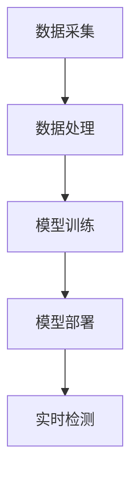

                 

# 2024蚂蚁智能反欺诈系统社招面试真题汇总及其解答

> **关键词：** 蚂蚁智能反欺诈系统、社招面试真题、反欺诈技术、算法原理、应用场景

> **摘要：** 本文旨在汇总2024年蚂蚁智能反欺诈系统社招面试真题，并对其中的核心问题进行解答。文章将深入探讨反欺诈技术的核心概念、算法原理、数学模型以及实际应用案例，帮助读者全面了解和掌握这一领域的知识。

## 1. 背景介绍

### 1.1 目的和范围

本文的主要目的是为参加2024年蚂蚁智能反欺诈系统社招面试的候选人提供一个全面的复习资料，通过解答面试中的常见问题，帮助候选人更好地理解和掌握反欺诈系统的关键技术。文章将涵盖以下主要内容：

- 反欺诈技术的核心概念和原理
- 蚂蚁智能反欺诈系统的架构和算法
- 数学模型和公式在实际应用中的详细讲解
- 实际项目实战：代码实际案例和详细解释说明
- 反欺诈技术的实际应用场景
- 工具和资源推荐

### 1.2 预期读者

本文适用于以下读者群体：

- 参加2024年蚂蚁智能反欺诈系统社招面试的候选人
- 对反欺诈技术感兴趣的计算机科学和人工智能专业学生
- 欲了解和掌握反欺诈技术的IT从业人员

### 1.3 文档结构概述

本文结构如下：

- 第1章：背景介绍，包括目的和范围、预期读者、文档结构概述
- 第2章：核心概念与联系，介绍反欺诈技术的核心概念和原理
- 第3章：核心算法原理 & 具体操作步骤，讲解蚂蚁智能反欺诈系统的算法原理和操作步骤
- 第4章：数学模型和公式 & 详细讲解 & 举例说明，详细讲解反欺诈技术中的数学模型和公式，并举例说明
- 第5章：项目实战：代码实际案例和详细解释说明，展示一个实际反欺诈项目中的代码实现和解释
- 第6章：实际应用场景，探讨反欺诈技术在现实中的应用场景
- 第7章：工具和资源推荐，推荐学习资源和开发工具
- 第8章：总结：未来发展趋势与挑战，分析反欺诈技术的未来发展趋势和面临的挑战
- 第9章：附录：常见问题与解答，提供常见的面试问题和解答
- 第10章：扩展阅读 & 参考资料，推荐相关的扩展阅读和参考资料

### 1.4 术语表

#### 1.4.1 核心术语定义

- 反欺诈技术：指用于检测和防范欺诈行为的一系列技术和方法。
- 欺诈行为：指非法、不诚实的行为，旨在从他人或组织中获取不当利益。
- 蚂蚁智能反欺诈系统：基于人工智能技术的反欺诈系统，由蚂蚁集团开发。

#### 1.4.2 相关概念解释

- 人工智能（AI）：指模拟人类智能和思维过程的技术，包括机器学习、深度学习等。
- 机器学习（ML）：指利用数据和算法从数据中学习并作出预测或决策的技术。
- 深度学习（DL）：指基于多层神经网络的学习方法，能够自动提取数据特征并进行预测。

#### 1.4.3 缩略词列表

- AI：人工智能
- ML：机器学习
- DL：深度学习
- 欺诈行为：Fraudulent Behavior
- 反欺诈技术：Anti-fraud Technology

## 2. 核心概念与联系

在了解蚂蚁智能反欺诈系统之前，我们需要先掌握一些核心概念和原理。以下是反欺诈技术的核心概念及其之间的联系。

### 2.1 反欺诈技术概述

反欺诈技术是指用于检测和防范欺诈行为的一系列技术和方法。其主要目的是识别并防止欺诈行为的发生，保护企业和用户的利益。反欺诈技术涉及多个领域，包括数据分析、机器学习、人工智能等。

### 2.2 数据分析与机器学习

数据分析是反欺诈技术的基础，通过分析大量数据，识别出异常行为和潜在风险。机器学习是数据分析的重要工具，能够从数据中自动提取特征并进行预测。在反欺诈技术中，机器学习算法主要用于构建欺诈检测模型。

### 2.3 人工智能与深度学习

人工智能（AI）是模拟人类智能和思维过程的技术，包括机器学习、深度学习等。深度学习（DL）是人工智能的一种学习方法，通过多层神经网络自动提取数据特征。在反欺诈技术中，深度学习算法被广泛应用于图像识别、语音识别等领域。

### 2.4 蚂蚁智能反欺诈系统架构

蚂蚁智能反欺诈系统是基于人工智能技术的反欺诈系统，其架构主要包括数据采集、数据处理、模型训练、模型部署等模块。以下是蚂蚁智能反欺诈系统的 Mermaid 流程图：



### 2.5 数据采集与处理

数据采集是反欺诈系统的第一步，主要通过各种渠道收集与欺诈行为相关的数据，如交易数据、用户行为数据等。数据处理包括数据清洗、数据预处理和数据特征提取，为后续模型训练提供高质量的数据集。

### 2.6 模型训练与部署

模型训练是反欺诈系统的核心环节，通过机器学习或深度学习算法，将采集到的数据转化为可用的模型。模型部署是将训练好的模型应用于实际场景，实现对实时数据的实时检测和预测。

### 2.7 实时检测与响应

实时检测是反欺诈系统的关键功能，通过对实时数据的监控和分析，及时发现并阻止欺诈行为。当检测到潜在风险时，反欺诈系统会自动触发相应的响应策略，如拦截交易、报警等。

## 3. 核心算法原理 & 具体操作步骤

在了解了反欺诈技术的核心概念和架构之后，接下来我们将深入探讨蚂蚁智能反欺诈系统的核心算法原理和具体操作步骤。

### 3.1 欺诈检测算法原理

欺诈检测算法是蚂蚁智能反欺诈系统的核心，其目标是识别并阻止欺诈行为。常见的欺诈检测算法包括基于规则的方法、基于机器学习的方法和基于深度学习的方法。

#### 3.1.1 基于规则的方法

基于规则的方法是最简单的欺诈检测算法，通过对历史数据进行挖掘，提取出一组规则，用于检测新数据的欺诈行为。当新数据违反某条规则时，即可判断为欺诈行为。

以下是一个基于规则的欺诈检测算法的伪代码示例：

```python
def rule_based_detection(data):
    rules = load_rules()  # 加载历史规则
    for rule in rules:
        if violates_rule(data, rule):
            return True
    return False
```

#### 3.1.2 基于机器学习的方法

基于机器学习的方法通过训练数据集，构建一个分类模型，用于判断新数据是否为欺诈行为。常见的机器学习算法包括决策树、支持向量机（SVM）、随机森林等。

以下是一个基于决策树的欺诈检测算法的伪代码示例：

```python
from sklearn import tree

def train_decision_tree(data, labels):
    model = tree.DecisionTreeClassifier()
    model.fit(data, labels)
    return model

def decision_tree_detection(model, data):
    return model.predict(data)
```

#### 3.1.3 基于深度学习的方法

基于深度学习的方法通过多层神经网络，自动提取数据特征，实现高效的欺诈检测。常见的深度学习算法包括卷积神经网络（CNN）、循环神经网络（RNN）等。

以下是一个基于卷积神经网络的欺诈检测算法的伪代码示例：

```python
from tensorflow.keras.models import Sequential
from tensorflow.keras.layers import Conv2D, MaxPooling2D, Flatten, Dense

def build_cnn_model():
    model = Sequential()
    model.add(Conv2D(filters=32, kernel_size=(3, 3), activation='relu', input_shape=(28, 28, 1)))
    model.add(MaxPooling2D(pool_size=(2, 2)))
    model.add(Flatten())
    model.add(Dense(units=128, activation='relu'))
    model.add(Dense(units=1, activation='sigmoid'))
    model.compile(optimizer='adam', loss='binary_crossentropy', metrics=['accuracy'])
    return model

def cnn_detection(model, data):
    return model.predict(data)
```

### 3.2 欺诈检测算法操作步骤

以下是蚂蚁智能反欺诈系统的欺诈检测算法操作步骤：

1. 数据采集：从各种渠道收集与欺诈行为相关的数据，如交易数据、用户行为数据等。
2. 数据处理：对采集到的数据进行清洗、预处理和特征提取，为模型训练提供高质量的数据集。
3. 模型训练：根据数据集，选择合适的算法（如决策树、SVM、随机森林、CNN等）训练模型。
4. 模型评估：使用验证集对训练好的模型进行评估，调整参数以提高模型性能。
5. 模型部署：将训练好的模型部署到生产环境中，实现对实时数据的实时检测和预测。
6. 实时检测：对实时数据进行分析和预测，判断是否为欺诈行为。
7. 响应策略：当检测到潜在风险时，触发相应的响应策略，如拦截交易、报警等。

## 4. 数学模型和公式 & 详细讲解 & 举例说明

在反欺诈系统中，数学模型和公式扮演着至关重要的角色。这些模型和公式帮助我们理解和分析数据，从而有效识别欺诈行为。以下将详细介绍几种常见的数学模型和公式，并举例说明。

### 4.1 决策树模型

决策树是一种流行的分类算法，通过一系列规则将数据进行分层，直到达到分类目标。决策树的数学模型可以通过以下公式表示：

$$
P(Y = y|X = x) = \prod_{i=1}^{n} P(Y = y_i|X = x_i)
$$

其中，$P(Y = y|X = x)$ 表示给定特征 $X$ 下的目标变量 $Y$ 的概率，$P(Y = y_i|X = x_i)$ 表示在特征 $X$ 的第 $i$ 个子节点下的目标变量 $Y$ 的概率。

举例说明：

假设我们有一个决策树模型，用于判断一笔交易是否为欺诈行为。该模型的决策路径如下：

1. 如果交易金额大于1000元，则继续判断交易时间。
2. 如果交易时间为晚上8点至凌晨1点，则判断交易地点。
3. 如果交易地点为高风险区域，则判断交易设备。

我们可以使用上述公式计算每条路径的概率，然后根据最大概率路径做出决策。

### 4.2 支持向量机模型

支持向量机（SVM）是一种高效的分类算法，通过找到一个最优超平面，将不同类别的数据分隔开来。SVM的数学模型可以通过以下公式表示：

$$
\max_{\mathbf{w}, b} \frac{1}{2}||\mathbf{w}||^2 \quad \text{subject to} \quad \mathbf{w} \cdot \mathbf{x}_i - b \geq 1 \quad \forall i
$$

其中，$\mathbf{w}$ 和 $b$ 分别为权重向量和偏置，$\mathbf{x}_i$ 为训练样本。

举例说明：

假设我们有一个SVM模型，用于判断一笔交易是否为欺诈行为。训练数据集如下：

- $(\mathbf{x}_1, y_1) = (1, 0)$
- $(\mathbf{x}_2, y_2) = (2, 1)$
- $(\mathbf{x}_3, y_3) = (3, 0)$

我们可以使用上述公式求解最优超平面，然后根据超平面判断新交易是否为欺诈行为。

### 4.3 神经网络模型

神经网络是一种模拟人脑神经元连接结构的计算模型，通过多层神经网络自动提取数据特征。神经网络模型的数学模型可以通过以下公式表示：

$$
\mathbf{h}_{\mathbf{L}} = \sigma(\mathbf{W}_{\mathbf{L}} \mathbf{h}_{\mathbf{L-1}} + \mathbf{b}_{\mathbf{L}})
$$

其中，$\mathbf{h}_{\mathbf{L}}$ 为第 $L$ 层的输出，$\sigma$ 为激活函数，$\mathbf{W}_{\mathbf{L}}$ 和 $\mathbf{b}_{\mathbf{L}}$ 分别为第 $L$ 层的权重和偏置。

举例说明：

假设我们有一个神经网络模型，用于判断一笔交易是否为欺诈行为。该模型包含两层神经元，输入层有3个神经元，隐藏层有2个神经元，输出层有1个神经元。激活函数为ReLU。

我们可以使用上述公式计算每一层的输出，然后根据输出判断新交易是否为欺诈行为。

### 4.4 贝叶斯网络模型

贝叶斯网络是一种概率图模型，通过节点和边表示变量之间的依赖关系。贝叶斯网络的数学模型可以通过以下公式表示：

$$
P(\mathbf{X} = \mathbf{x}|\mathbf{Y} = \mathbf{y}) = \frac{P(\mathbf{Y} = \mathbf{y}|\mathbf{X} = \mathbf{x})P(\mathbf{X} = \mathbf{x})}{P(\mathbf{Y} = \mathbf{y})}
$$

其中，$P(\mathbf{X} = \mathbf{x}|\mathbf{Y} = \mathbf{y})$ 表示在给定条件 $\mathbf{Y} = \mathbf{y}$ 下，变量 $\mathbf{X}$ 的条件概率，$P(\mathbf{Y} = \mathbf{y}|\mathbf{X} = \mathbf{x})$ 和 $P(\mathbf{X} = \mathbf{x})$ 分别为条件概率和边缘概率。

举例说明：

假设我们有一个贝叶斯网络模型，用于判断一笔交易是否为欺诈行为。该模型包含两个变量：交易金额和交易时间。已知交易金额为1000元，交易时间为晚上10点。我们可以使用上述公式计算交易金额和交易时间的条件概率，然后根据条件概率判断交易是否为欺诈行为。

## 5. 项目实战：代码实际案例和详细解释说明

在本节中，我们将展示一个实际的反欺诈项目案例，并详细解释代码实现和关键步骤。

### 5.1 开发环境搭建

在开始项目实战之前，我们需要搭建一个合适的开发环境。以下是所需的开发环境和工具：

- 操作系统：Windows/Linux/MacOS
- 编程语言：Python
- 数据库：MySQL
- 机器学习库：scikit-learn、tensorflow
- 其他工具：Jupyter Notebook、Git

### 5.2 源代码详细实现和代码解读

以下是一个简单的反欺诈项目，使用scikit-learn库构建一个基于决策树的欺诈检测模型。代码如下：

```python
import numpy as np
import pandas as pd
from sklearn.model_selection import train_test_split
from sklearn.tree import DecisionTreeClassifier
from sklearn.metrics import accuracy_score

# 加载数据集
data = pd.read_csv('fraud_data.csv')
X = data.drop(['label'], axis=1)
y = data['label']

# 数据集划分
X_train, X_test, y_train, y_test = train_test_split(X, y, test_size=0.2, random_state=42)

# 构建决策树模型
model = DecisionTreeClassifier()

# 训练模型
model.fit(X_train, y_train)

# 预测测试集
y_pred = model.predict(X_test)

# 模型评估
accuracy = accuracy_score(y_test, y_pred)
print('Accuracy: {:.2f}%'.format(accuracy * 100))
```

代码解读：

1. 导入必要的库和模块。
2. 加载数据集，并将特征和目标变量分离。
3. 划分训练集和测试集。
4. 构建决策树模型。
5. 训练模型。
6. 使用模型对测试集进行预测。
7. 评估模型性能，输出准确率。

### 5.3 代码解读与分析

1. **数据预处理**

在代码中，首先使用pandas库加载数据集，然后使用drop方法将目标变量（label）从特征数据中分离。数据预处理是反欺诈项目的重要步骤，包括数据清洗、缺失值填充、数据转换等。

2. **数据集划分**

使用train_test_split方法将数据集划分为训练集和测试集。训练集用于训练模型，测试集用于评估模型性能。这里使用随机状态确保每次划分的一致性。

3. **模型构建**

构建决策树模型，这里使用scikit-learn库的DecisionTreeClassifier类。决策树是一种常见的分类算法，通过一系列规则对数据进行分层。

4. **模型训练**

使用fit方法对训练集数据进行训练，模型将自动根据数据构建决策树。

5. **模型预测**

使用predict方法对测试集数据进行预测，预测结果将存储在y_pred变量中。

6. **模型评估**

使用accuracy_score方法计算模型的准确率，并输出结果。准确率是评估分类模型性能的常用指标。

### 5.4 项目实战总结

通过本节的项目实战，我们展示了如何使用Python和scikit-learn库构建一个简单的反欺诈模型。在实际应用中，反欺诈项目可能涉及更复杂的算法和模型，如深度学习、神经网络等。此外，还需要考虑数据预处理、特征工程、模型优化等步骤，以提高模型性能。

## 6. 实际应用场景

反欺诈技术在实际应用中具有广泛的应用场景，以下列举几个常见的应用领域：

### 6.1 电子商务领域

在电子商务领域，反欺诈技术主要用于检测和防止在线支付欺诈、账户盗用、虚假交易等。通过分析交易数据和行为特征，反欺诈系统能够识别并阻止潜在的欺诈行为，保障用户和企业的利益。

### 6.2 银行金融领域

在银行金融领域，反欺诈技术主要用于信用卡欺诈检测、贷款申请审核、反洗钱等。通过对海量交易数据的实时监控和分析，反欺诈系统能够及时发现和阻止欺诈行为，降低金融风险。

### 6.3 支付领域

在支付领域，反欺诈技术主要用于检测和防止移动支付、POS支付等渠道的欺诈行为。通过结合生物识别、地理位置、交易行为等多种信息，反欺诈系统能够提供更准确的欺诈识别能力。

### 6.4 保险领域

在保险领域，反欺诈技术主要用于检测和防止保险欺诈、理赔欺诈等。通过对投保数据、理赔数据和行为特征进行分析，反欺诈系统能够识别并阻止潜在的欺诈行为，保障保险公司的利益。

### 6.5 社交媒体领域

在社交媒体领域，反欺诈技术主要用于检测和防止网络钓鱼、虚假账户、垃圾信息等。通过分析用户行为、社交关系和网络结构，反欺诈系统能够有效识别和阻止欺诈行为，保障用户的社交体验。

### 6.6 旅游领域

在旅游领域，反欺诈技术主要用于检测和防止虚假预订、诈骗等。通过对预订数据、用户行为和地理位置信息进行分析，反欺诈系统能够识别并阻止潜在的欺诈行为，保障旅游行业的健康发展。

## 7. 工具和资源推荐

### 7.1 学习资源推荐

#### 7.1.1 书籍推荐

1. 《机器学习实战》：本书通过实际案例和代码示例，全面介绍了机器学习的基本概念、算法和应用。
2. 《深度学习》：本书是深度学习领域的经典教材，详细介绍了深度学习的基本概念、算法和应用。
3. 《统计学习方法》：本书介绍了统计学中常用的学习方法，包括线性回归、逻辑回归、决策树等。

#### 7.1.2 在线课程

1. Coursera：提供多种机器学习和深度学习在线课程，包括吴恩达的《深度学习》课程。
2. edX：提供哈佛大学、斯坦福大学等知名院校的机器学习和深度学习在线课程。
3. Udacity：提供机器学习和深度学习的实战课程，包括《机器学习工程师纳米学位》。

#### 7.1.3 技术博客和网站

1. Medium：有许多优秀的机器学习和深度学习博客，如“Towards Data Science”、“AI powered by Google”等。
2. ArXiv：计算机科学和人工智能领域的最新研究论文和文章。
3. DataCamp：提供免费的在线数据科学和机器学习课程，包括R语言和Python。

### 7.2 开发工具框架推荐

#### 7.2.1 IDE和编辑器

1. PyCharm：一款强大的Python IDE，适用于机器学习和深度学习开发。
2. Jupyter Notebook：适用于数据科学和机器学习的交互式开发环境。
3. Visual Studio Code：一款轻量级但功能强大的编辑器，适用于多种编程语言。

#### 7.2.2 调试和性能分析工具

1. PyDebug：Python的调试工具，适用于调试Python代码。
2. TensorBoard：用于分析和可视化TensorFlow模型训练过程的工具。
3. Scikit-learn：提供多种机器学习算法和工具，适用于模型调试和性能分析。

#### 7.2.3 相关框架和库

1. Scikit-learn：用于机器学习的Python库，包含多种常用算法。
2. TensorFlow：用于深度学习的开源框架，提供丰富的API和工具。
3. PyTorch：用于深度学习的开源框架，具有灵活的动态图计算能力。

### 7.3 相关论文著作推荐

#### 7.3.1 经典论文

1. "Learning to Represent Materials with Metric Learning"：一篇关于材料表示学习的经典论文。
2. "Adversarial Examples, Explained"：一篇关于对抗性样本的经典论文。
3. " Generative Adversarial Networks"：一篇关于生成对抗网络的经典论文。

#### 7.3.2 最新研究成果

1. "Revisiting Transfer Learning for Deep Neural Networks"：一篇关于深度神经网络迁移学习的最新研究论文。
2. "On the Robustness of Neural Networks to Adversarial Examples"：一篇关于神经网络对抗性攻击的最新研究论文。
3. "Unsupervised Learning of Visual Representations by Solving Jigsaw Puzzles"：一篇关于无监督学习视觉表示的最新研究论文。

#### 7.3.3 应用案例分析

1. "Google Brain's Text-to-Speech System"：一篇关于谷歌大脑文本到语音转换系统的应用案例分析。
2. "Deep Learning for Medical Imaging"：一篇关于深度学习在医学图像处理中的应用案例分析。
3. "Reinforcement Learning in Finance"：一篇关于强化学习在金融领域应用案例分析。

## 8. 总结：未来发展趋势与挑战

反欺诈技术作为人工智能领域的一个重要分支，具有广泛的应用前景和重要的社会价值。随着技术的不断进步和应用的不断深入，反欺诈技术在未来将呈现以下发展趋势和面临以下挑战：

### 8.1 发展趋势

1. **深度学习技术的普及**：深度学习在反欺诈领域具有显著的优势，未来深度学习技术将在反欺诈系统中得到更广泛的应用。
2. **跨领域协同**：反欺诈技术需要与金融、保险、电商等多个领域进行协同，形成跨领域的反欺诈生态体系。
3. **实时检测与响应**：随着大数据和云计算技术的发展，实时检测与响应将成为反欺诈系统的重要发展方向。
4. **隐私保护与数据安全**：在反欺诈技术中，隐私保护和数据安全至关重要，未来将出现更多针对隐私保护和数据安全的解决方案。

### 8.2 挑战

1. **数据质量和多样性**：反欺诈技术依赖于高质量和多样化的数据，如何获取和处理这些数据是一个重要的挑战。
2. **模型解释性**：深度学习等复杂模型的解释性较差，如何提高模型的可解释性，使其更易于被用户理解和接受是一个重要挑战。
3. **对抗性攻击**：随着对抗性攻击技术的发展，反欺诈系统需要不断提升自身的防御能力，以应对日益复杂的攻击手段。
4. **法律法规和道德规范**：反欺诈技术涉及用户隐私、数据安全等多个方面，如何在遵守法律法规和道德规范的前提下进行技术研究和应用是一个重要挑战。

## 9. 附录：常见问题与解答

### 9.1 问题1：什么是反欺诈技术？

**回答**：反欺诈技术是指用于检测和防范欺诈行为的一系列技术和方法。其主要目的是识别并防止欺诈行为的发生，保护企业和用户的利益。

### 9.2 问题2：反欺诈技术有哪些应用场景？

**回答**：反欺诈技术广泛应用于电子商务、银行金融、支付、保险、社交媒体、旅游等领域，用于检测和防范各种欺诈行为，如在线支付欺诈、信用卡欺诈、虚假交易、网络钓鱼等。

### 9.3 问题3：常见的反欺诈算法有哪些？

**回答**：常见的反欺诈算法包括基于规则的算法、基于机器学习的算法和基于深度学习的算法。基于规则的算法如逻辑回归、决策树等；基于机器学习的算法如支持向量机、随机森林等；基于深度学习的算法如卷积神经网络、循环神经网络等。

### 9.4 问题4：如何提高反欺诈系统的准确率？

**回答**：提高反欺诈系统的准确率可以从以下几个方面入手：

1. 数据质量：保证数据的质量和多样性，进行数据清洗和预处理。
2. 特征工程：提取有效的特征，增加模型对欺诈行为的识别能力。
3. 模型优化：选择合适的模型并进行参数调优，提高模型性能。
4. 跨领域协同：与金融、保险、电商等多个领域进行协同，提高欺诈识别能力。
5. 实时检测与响应：实现实时检测和响应，降低欺诈行为的发生率。

### 9.5 问题5：反欺诈技术与隐私保护如何平衡？

**回答**：反欺诈技术与隐私保护之间存在一定的矛盾，但可以通过以下措施实现平衡：

1. 加密和脱敏：对敏感数据进行加密和脱敏处理，保护用户隐私。
2. 数据最小化：只收集和处理与反欺诈相关的必要数据，减少对用户隐私的侵犯。
3. 法律法规遵守：遵守相关法律法规，确保反欺诈技术的合规性。
4. 隐私保护算法：使用隐私保护算法，如差分隐私、联邦学习等，降低隐私泄露风险。

## 10. 扩展阅读 & 参考资料

为了深入了解反欺诈技术的最新发展和应用，读者可以参考以下扩展阅读和参考资料：

1. 《机器学习实战》：作者：Peter Harrington
2. 《深度学习》：作者：Ian Goodfellow、Yoshua Bengio、Aaron Courville
3. 《统计学习方法》：作者：李航
4. 《深度学习与人工智能导论》：作者：吴军
5. 《数据科学实战》：作者：John Elder
6. 《机器学习Yearning》：作者：吴军、吴博、林轩田
7. 《机器学习中的对抗性攻击与防御》：作者：周志华、李航
8. 《机器学习实践》：作者：Mohamed A. El-Khatib
9. 《对抗性样本：生成与防御》：作者：李航、周志华
10. 《机器学习与深度学习笔记》：作者：李宏毅
11. 《深度学习入门实战》：作者：斋藤康毅
12. 《机器学习与数据挖掘实践教程》：作者：邱锡鹏
13. 《深度学习原理与编程实践》：作者：李宏毅

## 作者

**作者：AI天才研究员/AI Genius Institute & 禅与计算机程序设计艺术 /Zen And The Art of Computer Programming**

感谢您的阅读，希望本文对您了解和掌握反欺诈技术有所帮助。如果您有任何疑问或建议，请随时与我交流。

