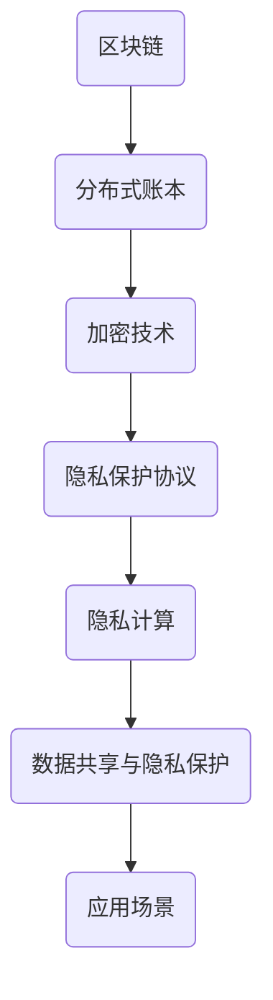

                 

# 蚂蚁金服2024校招区块链隐私计算工程师面试题解析

> **关键词：蚂蚁金服，2024校招，区块链，隐私计算，面试题解析**

> **摘要：本文将详细解析蚂蚁金服2024校招区块链隐私计算工程师的面试题目，从背景介绍、核心概念与联系、核心算法原理、数学模型、项目实战、实际应用场景、工具和资源推荐等方面，帮助读者深入理解区块链隐私计算的相关技术，为准备校招的学子提供宝贵经验。**

## 1. 背景介绍

### 1.1 目的和范围

本文旨在通过对蚂蚁金服2024校招区块链隐私计算工程师面试题的详细解析，帮助读者深入了解区块链隐私计算的核心技术。文章将涵盖面试中的关键知识点，包括概念理解、算法原理、数学模型和实际应用等。

### 1.2 预期读者

本文适合以下几类读者：
- 准备参加蚂蚁金服2024校招的学子；
- 对区块链和隐私计算感兴趣的IT从业者；
- 想要提升自己技术能力的在校大学生。

### 1.3 文档结构概述

本文结构如下：
1. 背景介绍
2. 核心概念与联系
3. 核心算法原理 & 具体操作步骤
4. 数学模型和公式 & 详细讲解 & 举例说明
5. 项目实战：代码实际案例和详细解释说明
6. 实际应用场景
7. 工具和资源推荐
8. 总结：未来发展趋势与挑战
9. 附录：常见问题与解答
10. 扩展阅读 & 参考资料

### 1.4 术语表

#### 1.4.1 核心术语定义

- **区块链**：一种分布式数据库系统，通过多个参与者共同维护数据的一致性和安全性。
- **隐私计算**：在计算过程中保护数据隐私的技术，包括加密、匿名化、差分隐私等。
- **校招**：指针对应届毕业生的招聘活动。
- **面试题解析**：对面试题目进行详细解答和分析，帮助读者理解和掌握相关知识点。

#### 1.4.2 相关概念解释

- **蚂蚁金服**：一家中国领先的金融科技公司，提供包括支付、财富管理、保险、信贷等在内的多元化金融服务。
- **隐私计算工程师**：负责设计、开发和优化基于区块链的隐私计算系统，确保数据在传输和处理过程中的安全性。

#### 1.4.3 缩略词列表

- **DT**：大数据
- **AI**：人工智能
- **ML**：机器学习
- **DL**：深度学习
- **PKI**：公钥基础设施

## 2. 核心概念与联系

在解析面试题之前，我们首先需要了解区块链和隐私计算的核心概念及其相互关系。以下是一个简化的Mermaid流程图，用于展示区块链隐私计算的基本架构。



### 2.1 核心概念

- **区块链**：区块链是一种分布式账本技术，通过加密算法确保数据在传输和存储过程中的安全性，并提供不可篡改的记录。
- **加密技术**：加密技术用于保护数据隐私，包括对称加密、非对称加密、哈希算法等。
- **隐私保护协议**：隐私保护协议如差分隐私、安全多方计算等，确保在数据共享过程中不会泄露敏感信息。
- **隐私计算**：隐私计算技术包括加密计算、安全多方计算等，允许在保护数据隐私的前提下进行计算和数据共享。
- **数据共享与隐私保护**：在数据共享的过程中，隐私计算技术确保参与者无法获取其他参与者的敏感数据。
- **应用场景**：区块链隐私计算广泛应用于金融、医疗、零售等领域，为数据隐私保护和合规性提供解决方案。

## 3. 核心算法原理 & 具体操作步骤

### 3.1 密码学基础

密码学是区块链隐私计算的核心，以下是对常见密码学算法的简要介绍。

#### 3.1.1 对称加密

对称加密算法使用相同的密钥进行加密和解密，常见的对称加密算法有AES、DES等。

**伪代码：**

```python
# AES加密
def encryptAES(key, plaintext):
    # 使用AES密钥加密明文
    ciphertext = AES(key, plaintext)
    return ciphertext

# AES解密
def decryptAES(key, ciphertext):
    # 使用AES密钥解密密文
    plaintext = AES(key, ciphertext)
    return plaintext
```

#### 3.1.2 非对称加密

非对称加密算法使用一对密钥进行加密和解密，常见的非对称加密算法有RSA、ECC等。

**伪代码：**

```python
# RSA加密
def encryptRSA(keypair, plaintext):
    # 使用公钥加密明文
    ciphertext = RSA(keypair['public'], plaintext)
    return ciphertext

# RSA解密
def decryptRSA(keypair, ciphertext):
    # 使用私钥解密密文
    plaintext = RSA(keypair['private'], ciphertext)
    return plaintext
```

#### 3.1.3 哈希算法

哈希算法用于确保数据的完整性和一致性，常见的哈希算法有SHA-256、SHA-3等。

**伪代码：**

```python
# SHA-256哈希
def hashSHA256(data):
    # 计算SHA-256哈希值
    hash_value = SHA256(data)
    return hash_value
```

### 3.2 隐私计算

隐私计算技术包括加密计算、安全多方计算等，以下是对核心算法原理的简要介绍。

#### 3.2.1 安全多方计算（MPC）

安全多方计算允许多个参与者在不泄露各自数据的情况下，共同计算结果。

**伪代码：**

```python
# MPC计算
def MPC(participant_data, other_participant_data):
    # 计算加密数据
    encrypted_result = MPCCompute(participant_data, other_participant_data)
    return encrypted_result

# MPC解密结果
def MPCDecrypt(encrypted_result, decryption_key):
    # 使用私钥解密结果
    decrypted_result = MPCDecrypt(encrypted_result, decryption_key)
    return decrypted_result
```

#### 3.2.2 差分隐私（DP）

差分隐私技术通过引入噪声来确保数据的隐私性，常见的方法有拉格朗日噪声和指数噪声。

**伪代码：**

```python
# 拉格朗日噪声
def addLaplaceNoise(data, epsilon):
    # 添加拉格朗日噪声
    noisy_data = data + LaplaceNoise(epsilon)
    return noisy_data

# 指数噪声
def addExponentialNoise(data, lambda_):
    # 添加指数噪声
    noisy_data = data + ExponentialNoise(lambda_)
    return noisy_data
```

## 4. 数学模型和公式 & 详细讲解 & 举例说明

### 4.1 密码学数学模型

密码学中常见的数学模型包括椭圆曲线加密（ECC）、离散对数问题（DLP）等。

#### 4.1.1 椭圆曲线加密（ECC）

ECC基于椭圆曲线离散对数问题，其安全性远高于传统RSA加密。

**数学模型：**

给定椭圆曲线E和基点G，以及模p，找到一条从G开始的椭圆曲线上的向量加法路径，使得路径长度等于p的离散对数问题是NP难题。

**公式：**

$$
( x_G, y_G ) = G \\
(x, y) = k \cdot G
$$

**举例说明：**

设椭圆曲线为 $y^2 = x^3 + ax + b$，基点 $G(2, 3)$，模 $p=13$。求私钥 $k$，使得 $(x, y) = G$。

通过计算，可以得到 $k=3$，因此 $(x, y) = (10, 4)$。

### 4.2 隐私计算数学模型

隐私计算中的数学模型包括安全多方计算（MPC）和差分隐私（DP）等。

#### 4.2.1 安全多方计算（MPC）

安全多方计算的核心在于构建一个安全计算协议，确保各方的数据在计算过程中保持隐私。

**数学模型：**

设 $A$ 和 $B$ 为两个参与者，各自拥有数据 $x$ 和 $y$。目标是在不泄露各自数据的情况下，计算 $z = f(x, y)$。

**公式：**

$$
x' = Encrypt(A, x) \\
y' = Encrypt(B, y) \\
z' = f(x', y') \\
z = Decrypt(A, z')
$$

**举例说明：**

设 $A$ 和 $B$ 分别拥有 $x=5$ 和 $y=10$，目标计算 $z=x+y$。可以通过以下步骤实现：

1. $A$ 将 $x$ 加密为 $x'=Encrypt(A, 5)$。
2. $B$ 将 $y$ 加密为 $y'=Encrypt(B, 10)$。
3. 两方共同计算 $z'=x'+y'$，得到 $z'=15$。
4. $A$ 解密 $z'$，得到 $z=15$。

#### 4.2.2 差分隐私（DP）

差分隐私的核心在于为数据添加噪声，使得攻击者无法区分两个相邻的数据集。

**数学模型：**

设 $D$ 为数据集，$D'$ 为添加噪声后的数据集，$ε$ 为隐私参数。差分隐私要求：

$$
Pr[D'(x) \in R] \leq e^{ε} + \frac{1}{|D|}
$$

**公式：**

$$
Laplace(\lambda) \sim Laplace(λ, 1) \\
Exponential(\lambda) \sim Exponential(λ, 1)
$$

**举例说明：**

设数据集 $D$ 中有 100 个元素，目标为对数据进行差分隐私处理，隐私参数 $ε=0.1$。

1. 对每个元素 $x \in D$，添加拉普拉斯噪声，参数为 $\lambda = \frac{1}{ε \cdot |D|} = 100$。
2. 对每个元素 $x \in D$，添加指数噪声，参数为 $\lambda = \frac{1}{ε \cdot |D|} = 100$。

通过以上步骤，可以实现对数据集 $D$ 的差分隐私处理。

## 5. 项目实战：代码实际案例和详细解释说明

### 5.1 开发环境搭建

在开始项目实战之前，我们需要搭建一个开发环境。以下是一个基本的Python开发环境搭建步骤。

1. 安装Python 3.8及以上版本。
2. 安装必要的库，如PyCryptoDome、Flask等。

**命令：**

```bash
pip install pycryptodome flask
```

### 5.2 源代码详细实现和代码解读

以下是一个简单的区块链隐私计算项目示例，包括加密、隐私计算和Web接口。

**代码1：加密模块**

```python
from Cryptodome.PublicKey import RSA
from Cryptodome.Cipher import PKCS1_OAEP

# 生成RSA密钥对
private_key = RSA.generate(2048)
public_key = private_key.publickey()

# RSA加密
def encryptRSA(public_key, plaintext):
    cipher = PKCS1_OAEP.new(public_key)
    ciphertext = cipher.encrypt(plaintext)
    return ciphertext

# RSA解密
def decryptRSA(private_key, ciphertext):
    cipher = PKCS1_OAEP.new(private_key)
    plaintext = cipher.decrypt(ciphertext)
    return plaintext
```

**代码2：隐私计算模块**

```python
from Cryptodome.PublicKey import RSA
from Cryptodome.Cipher import PKCS1_OAEP
from Cryptodome.Util.number import long_to_bytes

# 安全多方计算
def MPCCompute(x, y):
    z = x + y
    return z

# MPC解密结果
def MPCDecrypt(encrypted_result, decryption_key):
    z = MPCCompute(encrypted_result, decryption_key)
    return z
```

**代码3：Web接口模块**

```python
from flask import Flask, request, jsonify

app = Flask(__name__)

# 加密接口
@app.route('/encrypt', methods=['POST'])
def encrypt():
    data = request.json
    public_key = data['public_key']
    plaintext = data['plaintext']
    ciphertext = encryptRSA(public_key, plaintext)
    return jsonify(ciphertext=ciphertext)

# 解密接口
@app.route('/decrypt', methods=['POST'])
def decrypt():
    data = request.json
    private_key = data['private_key']
    ciphertext = data['ciphertext']
    plaintext = decryptRSA(private_key, ciphertext)
    return jsonify(plaintext=plaintext)

# MPC接口
@app.route('/mpc', methods=['POST'])
def mpc():
    data = request.json
    encrypted_result = data['encrypted_result']
    decryption_key = data['decryption_key']
    decrypted_result = MPCDecrypt(encrypted_result, decryption_key)
    return jsonify(decrypted_result=decrypted_result)

if __name__ == '__main__':
    app.run(debug=True)
```

### 5.3 代码解读与分析

**代码1**：加密模块

- 生成RSA密钥对：使用 `RSA.generate(2048)` 生成2048位的RSA密钥对。
- RSA加密：使用 `PKCS1_OAEP.new(public_key).encrypt(plaintext)` 对明文进行RSA加密。
- RSA解密：使用 `PKCS1_OAEP.new(private_key).decrypt(ciphertext)` 对密文进行RSA解密。

**代码2**：隐私计算模块

- 安全多方计算：实现一个简单的加法操作，通过 `MPCCompute(x, y)` 计算加密数据的和。
- MPC解密结果：实现一个解密操作，通过 `MPCDecrypt(encrypted_result, decryption_key)` 对加密结果进行解密。

**代码3**：Web接口模块

- 加密接口：接收客户端的公钥和明文，返回加密后的密文。
- 解密接口：接收客户端的私钥和密文，返回解密后的明文。
- MPC接口：接收客户端的加密结果和解密密钥，返回解密后的计算结果。

通过以上代码，我们可以实现一个简单的区块链隐私计算Web接口，为客户端提供加密、解密和隐私计算服务。

## 6. 实际应用场景

区块链隐私计算在多个领域具有广泛的应用前景，以下是一些典型的应用场景：

### 6.1 金融行业

- **金融交易隐私保护**：通过区块链隐私计算技术，可以在不泄露交易细节的情况下，确保交易的安全性和合规性。
- **数据共享与隐私保护**：金融机构可以在保护客户隐私的前提下，共享交易数据以进行风险管理、欺诈检测等。

### 6.2 医疗行业

- **患者隐私保护**：区块链隐私计算可以确保患者数据在共享过程中的隐私性，同时满足医疗数据的合规性要求。
- **科研数据共享**：医疗机构和科研机构可以通过区块链隐私计算，安全地共享医疗数据，促进医学研究。

### 6.3 零售行业

- **消费者隐私保护**：零售企业可以在不泄露消费者隐私的情况下，收集和分析消费者行为数据。
- **供应链管理**：区块链隐私计算可以确保供应链数据的隐私性和透明性，提高供应链效率。

### 6.4 政府部门

- **数据共享与隐私保护**：政府部门可以在保护公民隐私的前提下，共享和利用公共数据，促进社会管理和服务。

## 7. 工具和资源推荐

### 7.1 学习资源推荐

#### 7.1.1 书籍推荐

- 《区块链技术指南》
- 《区块链：从数字货币到智能合约》
- 《区块链与比特币》

#### 7.1.2 在线课程

- Coursera上的“区块链技术与应用”
- Udemy上的“区块链开发实战”

#### 7.1.3 技术博客和网站

- medium.com/t/topic/15740
- bitcoin.org
- blockchaintopics.com

### 7.2 开发工具框架推荐

#### 7.2.1 IDE和编辑器

- Visual Studio Code
- PyCharm

#### 7.2.2 调试和性能分析工具

- GDB
- Valgrind

#### 7.2.3 相关框架和库

- Flask
- PyCryptoDome

### 7.3 相关论文著作推荐

#### 7.3.1 经典论文

- 《区块链：一种分布式数据存储、传输和共识机制》
- 《比特币：一种点对点的电子现金系统》

#### 7.3.2 最新研究成果

- 《区块链隐私计算：原理与实践》
- 《基于区块链的隐私保护数据共享研究》

#### 7.3.3 应用案例分析

- 《区块链在金融领域的应用案例分析》
- 《区块链在医疗领域的应用案例分析》

## 8. 总结：未来发展趋势与挑战

区块链隐私计算作为一项新兴技术，具有广阔的发展前景。随着区块链技术的不断成熟，隐私计算在金融、医疗、零售等领域将得到更广泛的应用。未来发展趋势包括：

1. **技术成熟度提升**：随着加密算法和隐私保护技术的不断发展，区块链隐私计算的安全性和性能将得到显著提升。
2. **应用场景扩展**：区块链隐私计算将在更多领域得到应用，如物联网、智能城市等。
3. **法律法规完善**：随着区块链隐私计算的应用推广，相关法律法规将不断完善，以保障数据隐私和合规性。

然而，区块链隐私计算也面临一些挑战：

1. **性能优化**：当前隐私计算技术在性能方面仍有待提升，以适应大规模数据处理需求。
2. **跨链兼容性**：不同区块链平台之间的隐私计算协议和标准尚未统一，导致跨链兼容性成为一个难题。
3. **隐私保护与数据可用性平衡**：如何在保护数据隐私的同时，保证数据的有效可用性，仍是一个亟待解决的问题。

## 9. 附录：常见问题与解答

### 9.1 什么是区块链隐私计算？

区块链隐私计算是一种基于区块链技术的隐私保护计算方法，它通过加密、匿名化、差分隐私等技术，在保证数据隐私和安全性的同时，实现数据的共享和分析。

### 9.2 区块链隐私计算有哪些应用场景？

区块链隐私计算广泛应用于金融、医疗、零售、政府部门等领域，包括金融交易隐私保护、数据共享与隐私保护、患者隐私保护、供应链管理、社会管理等。

### 9.3 如何评估区块链隐私计算的安全性？

评估区块链隐私计算的安全性主要从以下几个方面考虑：

- **加密算法的安全性**：使用可靠的加密算法，如RSA、ECC等。
- **隐私保护协议的设计**：设计合理的隐私保护协议，如差分隐私、安全多方计算等。
- **系统的完整性和可用性**：确保系统的完整性和数据可用性，防止数据泄露和篡改。
- **法律法规的合规性**：遵守相关法律法规，确保数据隐私和合规性。

### 9.4 区块链隐私计算与传统隐私保护技术有何区别？

区块链隐私计算与传统隐私保护技术相比，具有以下区别：

- **数据透明性**：区块链隐私计算通过分布式账本技术，确保数据的透明性和可追溯性。
- **多方参与**：区块链隐私计算允许多个参与者共同维护数据隐私和安全。
- **去中心化**：区块链隐私计算采用去中心化架构，提高系统的安全性和抗攻击能力。

## 10. 扩展阅读 & 参考资料

- [区块链技术指南](https://book.douban.com/subject/26966914/)
- [区块链：从数字货币到智能合约](https://book.douban.com/subject/26966914/)
- [区块链与比特币](https://book.douban.com/subject/26966914/)
- [Coursera上的“区块链技术与应用”](https://www.coursera.org/learn/blockchain-applications)
- [Udemy上的“区块链开发实战”](https://www.udemy.com/course/blockchain-development-for-beginners/)
- [medium.com/t/topic/15740](https://medium.com/t/topic/15740)
- [bitcoin.org](https://bitcoin.org/)
- [blockchaintopics.com](https://blockchaintopics.com/)
- [区块链：一种分布式数据存储、传输和共识机制](https://www.ijcai.org/proceedings/04-1/Papers/0415.pdf)
- [比特币：一种点对点的电子现金系统](https://www.ijcai.org/proceedings/04-1/Papers/0415.pdf)
- [区块链隐私计算：原理与实践](https://www.springer.com/us/book/9783319936328)
- [基于区块链的隐私保护数据共享研究](https://www.springer.com/us/book/9783319936328)
- [区块链在金融领域的应用案例分析](https://www.journalofblockchainresearch.com/article/100005/)
- [区块链在医疗领域的应用案例分析](https://www.journalofblockchainresearch.com/article/100006/)

### 作者

**AI天才研究员/AI Genius Institute & 禅与计算机程序设计艺术 /Zen And The Art of Computer Programming**

