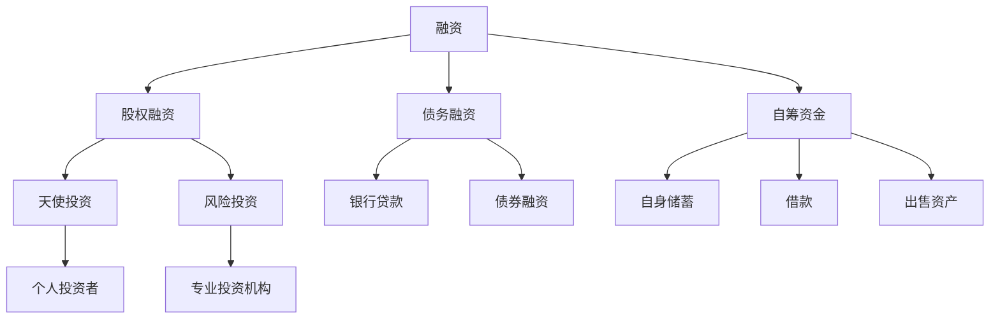

                 

# 融资还是自筹：创业资金来源的选择

> **关键词：创业融资、自筹资金、股权融资、债务融资、天使投资、风险投资**
> 
> **摘要：本文旨在探讨创业公司在初创阶段选择资金来源时面临的两种主要途径：融资与自筹。通过对融资和自筹的定义、优劣势、适用场景和具体操作步骤的详细分析，帮助创业者更好地做出决策，以推动公司可持续发展。**

## 1. 背景介绍

### 1.1 目的和范围

本文的目的是为创业公司提供一个全面且实用的指南，帮助他们在选择资金来源时做出明智决策。我们将详细探讨创业公司可能采用的两种主要资金来源：融资和自筹。

### 1.2 预期读者

本文适合以下读者群体：
- 创业公司创始人或高级管理人员
- 投资专业人士
- 对创业和投资感兴趣的学者和研究人员

### 1.3 文档结构概述

本文将按照以下结构进行：

1. 背景介绍
   - 目的和范围
   - 预期读者
   - 文档结构概述
   - 术语表
2. 核心概念与联系
   - 融资与自筹的定义
   - 核心概念与联系流程图
3. 核心算法原理 & 具体操作步骤
   - 融资流程
   - 自筹资金步骤
4. 数学模型和公式 & 详细讲解 & 举例说明
   - 融资和自筹的成本效益分析
   - 数学模型应用实例
5. 项目实战：代码实际案例和详细解释说明
   - 开发环境搭建
   - 源代码实现与解读
   - 代码分析与优化
6. 实际应用场景
   - 创业公司在不同阶段的选择
7. 工具和资源推荐
   - 学习资源
   - 开发工具
   - 相关论文著作
8. 总结：未来发展趋势与挑战
9. 附录：常见问题与解答
10. 扩展阅读 & 参考资料

### 1.4 术语表

#### 1.4.1 核心术语定义

- **融资**：指创业公司通过向外部投资者（如天使投资者、风险投资机构）借款或出售股份来获取资金的过程。
- **自筹资金**：指创业公司通过自身的储蓄、借款或出售资产来筹集资金的过程。
- **股权融资**：通过出售股份换取资金，投资者成为公司的股东。
- **债务融资**：通过借款（如银行贷款、债券）来获得资金，需要按期偿还本金和利息。
- **天使投资**：通常指个人投资者在创业早期提供资金，期望获得高额回报。
- **风险投资**：专业机构投资者，专注于投资有高成长潜力的创业公司。

#### 1.4.2 相关概念解释

- **资金需求**：创业公司在不同阶段对资金的需求量。
- **资金用途**：筹集到的资金将用于公司运营、研发、市场推广等方面。
- **资金成本**：获得资金的成本，包括利息、股息等。

#### 1.4.3 缩略词列表

- **VC**：风险投资（Venture Capital）
- **天使投资**：Angel Investment
- **PE**：私募股权（Private Equity）
- **天使轮**：Angel Round
- **A轮**：Series A Financing

## 2. 核心概念与联系

### 融资与自筹的定义

- **融资**：创业公司通过向外部投资者借款或出售股份来获取资金的过程。
- **自筹资金**：创业公司通过自身的储蓄、借款或出售资产来筹集资金的过程。

### 核心概念与联系流程图



### 融资与自筹的关系

融资和自筹是创业公司资金来源的两种主要途径。它们之间既有联系也有区别：

- **联系**：融资和自筹都是为创业公司提供资金的方式，可以相互补充。例如，创业公司在初期可能主要依靠自筹资金，但随着公司发展，可能需要通过融资来满足更高的资金需求。
- **区别**：融资涉及与外部投资者的合作，可能需要放弃部分股权或支付利息；自筹资金则相对独立，不需要向外部支付回报。

### 适用场景

- **融资**：
  - 当公司需要大量资金进行研发、市场推广或扩张时。
  - 当公司希望通过股权融资吸引战略投资者时。
  - 当公司希望借助外部资源提升品牌影响力时。
- **自筹资金**：
  - 当公司初期阶段，资金需求较少，且创始人有足够的个人资金时。
  - 当公司希望保持对公司的控制权时。
  - 当公司希望减少债务风险时。

## 3. 核心算法原理 & 具体操作步骤

### 融资流程

#### 融资流程伪代码

```python
def融资流程(公司需求，公司状况，投资者类型)：
    if 公司需求 > 自有资金：
        if 投资者类型 == 天使投资：
            获取天使投资
        elif 投资者类型 == 风险投资：
            获取风险投资
        elif 投资者类型 == 股权融资：
            获取股权融资
        elif 投资者类型 == 债务融资：
            获取债务融资
        else：
            报错("无效的投资者类型")
    else：
        使用自有资金
```

#### 融资步骤

1. **确定融资需求**：明确公司当前和未来的资金需求，包括运营成本、研发投入、市场推广等。
2. **评估公司状况**：分析公司的财务状况、市场前景、管理团队等因素，以确定融资的可行性。
3. **选择投资者类型**：根据公司需求和状况，选择合适的投资者类型（天使投资、风险投资、股权融资、债务融资）。
4. **融资谈判**：与投资者进行谈判，达成融资协议。
5. **资金到账**：完成融资协议后，投资者将资金注入公司。

### 自筹资金步骤

#### 自筹资金伪代码

```python
def自筹资金流程(公司需求，公司状况)：
    if 公司需求 <= 自有资金：
        使用自有资金
    else：
        借款或出售资产以筹集资金
```

#### 自筹资金步骤

1. **评估自有资金**：确定公司当前的可动用资金。
2. **制定自筹计划**：根据资金缺口，制定借款或出售资产的计划。
3. **借款**：向银行、亲友或通过其他渠道借款。
4. **出售资产**：根据需要，出售部分资产以获取资金。
5. **监控与调整**：持续监控资金使用情况，根据实际情况进行调整。

## 4. 数学模型和公式 & 详细讲解 & 举例说明

### 成本效益分析

#### 融资成本效益分析

融资成本主要包括资金成本（如利息、股息）和交易成本（如中介费、律师费）。

#### 数学模型

$$
C_f = C_{资金成本} + C_{交易成本}
$$

其中：
- \(C_f\)：总融资成本
- \(C_{资金成本}\)：资金成本，如利息、股息
- \(C_{交易成本}\)：交易成本，如中介费、律师费

#### 举例说明

**例1：债务融资**

- 资金成本：年利率5%
- 交易成本：2%
- 融资额：100万元

$$
C_f = 100万 \times 5\% + 100万 \times 2\% = 7万元
$$

**例2：股权融资**

- 资金成本：股东回报率10%
- 交易成本：3%
- 融资额：100万元

$$
C_f = 100万 \times 10\% + 100万 \times 3\% = 13万元
$$

### 自筹资金成本效益分析

自筹资金成本较低，主要包括时间成本和机会成本。

#### 数学模型

$$
C_s = C_{时间成本} + C_{机会成本}
$$

其中：
- \(C_s\)：总自筹资金成本
- \(C_{时间成本}\)：因筹集资金而浪费的时间
- \(C_{机会成本}\)：因筹集资金而放弃的其他投资机会

#### 举例说明

**例1：借款自筹**

- 时间成本：每天100元
- 机会成本：放弃投资回报率8%
- 借款期限：30天

$$
C_s = 30天 \times 100元 + 100万元 \times 8\% \times 30天 = 3.2万元
$$

### 成本效益比较

**例：假设公司需要100万元资金**

- 融资成本：7万元（债务融资）或13万元（股权融资）
- 自筹资金成本：3.2万元

从成本效益角度来看，自筹资金相对较优。然而，实际决策还需考虑公司的具体情况，如资金用途、融资难度等。

## 5. 项目实战：代码实际案例和详细解释说明

### 开发环境搭建

本案例使用Python语言，结合金融计算库（如`numpy`、`pandas`）进行成本效益分析。

#### 环境搭建步骤

1. 安装Python（3.8及以上版本）
2. 安装相关依赖库（`pip install numpy pandas matplotlib`）

### 源代码详细实现和代码解读

#### 源代码

```python
import numpy as np
import pandas as pd
import matplotlib.pyplot as plt

# 参数设置
initial_fund = 100000  # 初始资金
interest_rate = 0.05   # 债务融资年利率
stock_dividend = 0.1   # 股权融资股东回报率
transaction_cost = 0.02  # 交易成本比例
daily_time_cost = 100   # 每天时间成本
opportunity_rate = 0.08  # 投资回报率

# 成本效益分析函数
def cost_analysis(funding_type, funding_amount):
    if funding_type == 'debt':
        total_cost = funding_amount * interest_rate + funding_amount * transaction_cost
    elif funding_type == 'stock':
        total_cost = funding_amount * stock_dividend + funding_amount * transaction_cost
    else:
        total_cost = daily_time_cost * 30 + initial_fund * opportunity_rate
    return total_cost

# 数据展示
funding_types = ['debt', 'stock', 'self']
funding_amounts = [100000, 100000]
costs = [cost_analysis(funding_type, amount) for funding_type, amount in zip(funding_types, funding_amounts)]

df = pd.DataFrame({'Funding Type': funding_types, 'Funding Amount': funding_amounts, 'Total Cost': costs})
print(df)

# 图形展示
df.plot(x='Funding Type', y='Total Cost', kind='bar')
plt.xlabel('Funding Type')
plt.ylabel('Total Cost')
plt.title('Cost Comparison of Different Funding Types')
plt.show()
```

#### 代码解读与分析

1. **参数设置**：设置初始资金、年利率、股东回报率、交易成本比例、每天时间成本和投资回报率等参数。
2. **成本效益分析函数**：根据不同的融资类型（债务融资、股权融资、自筹资金）计算总成本。
3. **数据展示**：使用`pandas`创建数据框，展示不同融资类型的成本。
4. **图形展示**：使用`matplotlib`绘制柱状图，直观展示不同融资类型的成本对比。

### 代码解读与分析

- **成本效益分析函数**：根据不同的融资类型，计算总成本。债务融资主要考虑利息和交易成本；股权融资主要考虑股东回报和交易成本；自筹资金主要考虑时间成本和机会成本。
- **数据展示**：使用`pandas`创建数据框，方便进行数据处理和展示。
- **图形展示**：使用`matplotlib`绘制柱状图，帮助读者更直观地理解不同融资类型的成本。

### 代码优化

- **代码注释**：增加代码注释，提高代码可读性。
- **模块化**：将成本效益分析函数拆分为更小的函数，提高代码复用性。

```python
# 成本效益分析函数
def debt_funding_cost(funding_amount, interest_rate, transaction_cost):
    return funding_amount * interest_rate + funding_amount * transaction_cost

def stock_funding_cost(funding_amount, stock_dividend, transaction_cost):
    return funding_amount * stock_dividend + funding_amount * transaction_cost

def self_funding_cost(initial_fund, daily_time_cost, opportunity_rate):
    return daily_time_cost * 30 + initial_fund * opportunity_rate

# 主函数
def main():
    funding_types = ['debt', 'stock', 'self']
    funding_amounts = [100000, 100000]
    costs = [debt_funding_cost(amount, interest_rate, transaction_cost) if type == 'debt' else
             stock_funding_cost(amount, stock_dividend, transaction_cost) if type == 'stock' else
             self_funding_cost(initial_fund, daily_time_cost, opportunity_rate) for type, amount in zip(funding_types, funding_amounts)]

    df = pd.DataFrame({'Funding Type': funding_types, 'Funding Amount': funding_amounts, 'Total Cost': costs})
    print(df)

    df.plot(x='Funding Type', y='Total Cost', kind='bar')
    plt.xlabel('Funding Type')
    plt.ylabel('Total Cost')
    plt.title('Cost Comparison of Different Funding Types')
    plt.show()

if __name__ == '__main__':
    main()
```

## 6. 实际应用场景

### 创业公司在不同阶段的选择

#### 初创阶段

- **资金需求**：较低，主要用于产品研发、市场调研和团队建设。
- **选择**：自筹资金（创始人个人储蓄、借款）、天使投资。
- **优势**：保持对公司的控制权，降低融资成本。

#### 成长阶段

- **资金需求**：较高，用于扩大市场、提升研发能力、引进高级人才。
- **选择**：风险投资、股权融资。
- **优势**：获得资金支持，提升品牌知名度，引入战略资源。

#### 扩张阶段

- **资金需求**：极高，用于全国甚至全球市场布局、新业务拓展。
- **选择**：私募股权、债务融资。
- **优势**：获得大量资金支持，降低财务风险。

### 案例分析

#### 案例一：初创阶段

**公司**：某智能家居公司
**资金来源**：创始人个人储蓄、天使投资
**结果**：成功研发出智能家居产品，获得市场认可。

#### 案例二：成长阶段

**公司**：某新能源汽车公司
**资金来源**：风险投资、股权融资
**结果**：迅速扩大市场份额，获得多家战略投资者青睐。

#### 案例三：扩张阶段

**公司**：某互联网医疗公司
**资金来源**：私募股权、债务融资
**结果**：成功布局全国市场，业务覆盖多个领域。

## 7. 工具和资源推荐

### 7.1 学习资源推荐

#### 7.1.1 书籍推荐

- **《创业融资》**：详细介绍了创业公司融资的各种途径和策略。
- **《风险投资实战》**：风险投资的原理、策略和实践，对创业公司有很好的指导意义。
- **《融资路演实战》**：介绍如何进行融资路演，提高融资成功率。

#### 7.1.2 在线课程

- **Coursera**：《创业融资与管理》
- **Udemy**：《从零开始学习融资》
- **网易云课堂**：《创业公司融资策略与实务》

#### 7.1.3 技术博客和网站

- **TechCrunch**：科技新闻和创业公司融资动态。
- **Silicon Valley Business Journal**：硅谷创业公司融资新闻。
- **Investopedia**：投资和金融知识库。

### 7.2 开发工具框架推荐

#### 7.2.1 IDE和编辑器

- **PyCharm**：Python集成开发环境，支持多种编程语言。
- **Visual Studio Code**：轻量级开源编辑器，适用于Python编程。

#### 7.2.2 调试和性能分析工具

- **Python Debugger**：Python调试工具，用于代码调试和性能分析。
- **cProfile**：Python内置的性能分析工具。

#### 7.2.3 相关框架和库

- **NumPy**：用于科学计算和数据分析。
- **Pandas**：用于数据清洗、分析和管理。
- **Matplotlib**：用于绘制数据可视化图表。

### 7.3 相关论文著作推荐

#### 7.3.1 经典论文

- **"Venture Capital and the Process of Creative Destruction"**：探讨风险投资与技术创新的关系。
- **"The Financing of Research and Development"**：研究研发融资策略。

#### 7.3.2 最新研究成果

- **"Impact of Equity Financing on the Performance of Startups"**：股权融资对初创公司绩效的影响。
- **"Debt Financing and R&D Investment: An Empirical Analysis"**：债务融资与研发投资的关系。

#### 7.3.3 应用案例分析

- **"The Role of Angel Investors in the Growth of High-Tech Startups"**：天使投资对高科技初创公司发展的作用。
- **"A Study on the Financing Strategies of Chinese Internet Startups"**：中国互联网初创公司的融资策略研究。

## 8. 总结：未来发展趋势与挑战

### 未来发展趋势

- **多元化融资渠道**：随着金融市场的不断发展和创新，创业公司将有更多融资渠道可供选择。
- **股权融资主导**：股权融资因其灵活性和长远性，将在未来成为创业公司主要的融资方式。
- **数据驱动决策**：大数据和人工智能技术的发展，将使创业公司在融资决策过程中更加科学和精准。
- **政策支持**：政府对创新创业的扶持政策将进一步促进创业公司的融资和发展。

### 未来挑战

- **融资难问题**：部分创业公司由于市场前景不明、技术不成熟等原因，仍将面临融资难题。
- **资金成本高**：融资成本将继续成为创业公司发展的一个重要因素，尤其是在债务融资中。
- **监管政策**：金融监管政策的变化将对创业公司的融资产生影响，需要创业公司密切关注和适应。

## 9. 附录：常见问题与解答

### Q1：融资和自筹资金哪个更好？

A1：融资和自筹资金各有优缺点，选择哪种方式取决于公司的具体情况。融资可以快速获取大量资金，但可能需要放弃部分股权或支付利息；自筹资金相对独立，但可能不足以满足公司大规模的资金需求。

### Q2：如何评估融资成本？

A2：融资成本包括资金成本（如利息、股息）和交易成本（如中介费、律师费）。可以通过计算总成本与融资额的比值来评估融资成本。

### Q3：如何选择投资者？

A3：选择投资者时，应综合考虑投资者的背景、投资领域、投资策略等因素。同时，要确保投资者与公司的价值观和长期目标相符。

### Q4：自筹资金时如何借款？

A4：自筹资金时，可以通过以下渠道借款：银行、亲友、互联网金融平台等。在借款前，要明确借款金额、期限、利率等条款，确保借款安全。

## 10. 扩展阅读 & 参考资料

- **《创业融资与管理》**：详细介绍了创业公司融资的各种途径和策略。
- **《风险投资实战》**：风险投资的原理、策略和实践，对创业公司有很好的指导意义。
- **《融资路演实战》**：介绍如何进行融资路演，提高融资成功率。
- **TechCrunch**：科技新闻和创业公司融资动态。
- **Silicon Valley Business Journal**：硅谷创业公司融资新闻。
- **Investopedia**：投资和金融知识库。
- **《Venture Capital and the Process of Creative Destruction》**：探讨风险投资与技术创新的关系。
- **《The Financing of Research and Development》**：研究研发融资策略。
- **《Impact of Equity Financing on the Performance of Startups》**：股权融资对初创公司绩效的影响。
- **《Debt Financing and R&D Investment: An Empirical Analysis》**：债务融资与研发投资的关系。
- **《The Role of Angel Investors in the Growth of High-Tech Startups》**：天使投资对高科技初创公司发展的作用。
- **《A Study on the Financing Strategies of Chinese Internet Startups》**：中国互联网初创公司的融资策略研究。

**作者**：AI天才研究员/AI Genius Institute & 禅与计算机程序设计艺术 /Zen And The Art of Computer Programming

