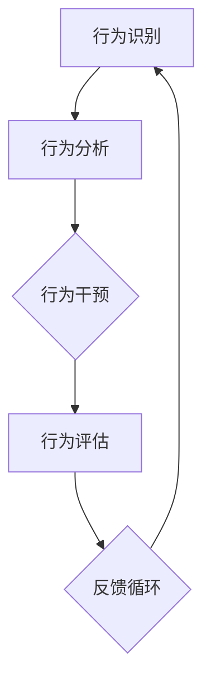

                 

# 行为模型：管理者塑造团队习惯的工具

> **关键词**：行为模型、团队习惯、管理技巧、组织效能、行为心理学
>
> **摘要**：本文深入探讨了行为模型在团队管理中的应用，解析了行为心理学原理如何帮助我们塑造团队习惯，提高组织效能。通过理论与实践的结合，本文旨在为管理者提供一套系统的工具和方法，帮助他们更好地引导和激励团队，打造高效能的工作环境。

## 1. 背景介绍

### 1.1 目的和范围

本文的主要目的是探讨行为模型在团队管理中的重要性，并介绍一套基于行为心理学原理的管理工具和方法。通过深入分析行为模型的基本概念和理论，结合实际案例，本文旨在帮助管理者更好地理解和应用行为模型，从而提高团队的工作效率和整体绩效。

本文的内容范围包括：行为模型的基础概念、管理者的角色和行为模型的关系、行为模型在塑造团队习惯中的应用、以及行为模型在实际管理场景中的操作步骤和策略。同时，本文也将探讨行为模型在组织效能提升方面的作用，并提供相关工具和资源推荐。

### 1.2 预期读者

本文的预期读者主要包括以下几类人群：

1. 管理者和团队领导：希望通过学习行为模型提升管理技能，更有效地引导和激励团队。
2. 人力资源从业者：对行为心理学和组织行为学有浓厚兴趣，希望了解如何在人力资源管理中应用行为模型。
3. 组织行为学研究者：对行为模型的理论和实践有深入研究的学者。
4. 广大读者：对管理技巧和团队建设有兴趣的读者，希望通过本文了解行为模型在现实中的应用。

### 1.3 文档结构概述

本文将分为以下几个部分：

1. 背景介绍：介绍本文的目的、范围、预期读者以及文档结构。
2. 核心概念与联系：介绍行为模型的基本概念，并给出相关的流程图。
3. 核心算法原理 & 具体操作步骤：详细讲解行为模型的原理和具体操作步骤，包括伪代码示例。
4. 数学模型和公式 & 详细讲解 & 举例说明：介绍与行为模型相关的数学模型和公式，并通过实例进行说明。
5. 项目实战：提供代码实际案例，并进行详细解释和说明。
6. 实际应用场景：分析行为模型在不同场景中的应用。
7. 工具和资源推荐：推荐学习资源和开发工具。
8. 总结：对全文进行总结，展望未来发展趋势和挑战。
9. 附录：常见问题与解答。
10. 扩展阅读 & 参考资料：提供进一步学习的资料和参考文献。

### 1.4 术语表

#### 1.4.1 核心术语定义

- **行为模型**：描述个体或团队行为模式、规律和关系的理论框架。
- **团队习惯**：团队成员在长期工作过程中形成的稳定的行为模式。
- **管理技巧**：管理者在团队管理过程中使用的策略和技巧。
- **组织效能**：组织在实现其目标过程中的效率和效果。

#### 1.4.2 相关概念解释

- **行为心理学**：研究个体行为和心理过程的科学。
- **激励**：激发和维持个体行为的过程。
- **反馈**：对行为结果的反馈信息，用以指导个体调整行为。

#### 1.4.3 缩略词列表

- **IDE**：集成开发环境（Integrated Development Environment）
- **HR**：人力资源管理（Human Resource Management）
- **AI**：人工智能（Artificial Intelligence）

## 2. 核心概念与联系

行为模型是团队管理中一个重要的概念，它为我们提供了一个理解和管理团队行为的理论框架。要深入理解行为模型，我们需要从其基本概念出发，逐步了解其原理和架构。

### 2.1 行为模型的基本概念

行为模型主要涉及以下核心概念：

- **行为**：个体或团队在特定情境下表现出的行动或反应。
- **模式**：行为在一定时间内表现出的规律性和重复性。
- **规律**：行为模式背后的因果关系和制约条件。
- **关系**：个体或团队之间的相互影响和相互作用。

行为模型通过分析这些概念，揭示出个体和团队行为背后的规律性和模式，从而为管理者提供指导。

### 2.2 行为模型的原理

行为模型基于行为心理学原理，主要包括以下几个关键原理：

- **行为强化原理**：行为通过奖励或惩罚得到强化，从而影响其重复出现的频率。
- **行为分化原理**：个体能够区分不同情境下的行为，从而在特定情境下表现合适的行为。
- **行为观察原理**：个体通过观察他人行为，学习和模仿新的行为模式。

这些原理共同构成了行为模型的基础，帮助管理者理解团队行为的动态变化。

### 2.3 行为模型的架构

行为模型的架构主要包括以下几个关键组成部分：

1. **行为识别**：通过观察和测量，识别出个体或团队的具体行为。
2. **行为分析**：对识别出的行为进行分析，找出行为背后的原因和规律。
3. **行为干预**：根据行为分析结果，采取干预措施，引导和调整团队行为。
4. **行为评估**：对干预效果进行评估，持续优化管理策略。

以下是一个简化的行为模型架构的 Mermaid 流程图：



### 2.4 行为模型在团队管理中的应用

行为模型在团队管理中的应用主要表现在以下几个方面：

1. **团队行为优化**：通过分析团队行为模式，发现并解决团队存在的问题，优化团队整体表现。
2. **员工行为激励**：利用行为强化原理，激励员工表现更好的工作行为，提高工作效率。
3. **团队文化建设**：通过引导和调整团队行为，塑造积极向上的团队文化，增强团队凝聚力。
4. **管理策略制定**：基于行为模型的分析结果，制定更科学、有效的管理策略，提高组织效能。

通过以上分析，我们可以看到行为模型在团队管理中的重要性。接下来，我们将进一步探讨行为模型的具体原理和操作步骤。

## 3. 核心算法原理 & 具体操作步骤

行为模型的核心在于理解个体和团队行为的规律，并利用这些规律来引导和调整行为。在具体操作步骤中，我们将详细介绍行为模型的算法原理，并通过伪代码来阐述其实现过程。

### 3.1 行为模型的算法原理

行为模型的基本算法原理可以概括为以下几个步骤：

1. **数据收集**：收集个体和团队在特定情境下的行为数据。
2. **行为识别**：对收集到的数据进行分析，识别出个体和团队的具体行为。
3. **行为分析**：对识别出的行为进行统计分析，找出行为模式、规律和影响因素。
4. **行为干预**：根据行为分析结果，采取相应的干预措施，引导和调整团队行为。
5. **行为评估**：对干预效果进行评估，持续优化管理策略。

以下是一个简化的行为模型算法原理的伪代码：

```plaintext
输入：行为数据
输出：优化后的行为模式

function 行为模型(数据)
    1. 数据预处理
        数据清洗，去除异常值和噪声
    2. 行为识别
        使用分类算法，识别个体和团队的行为
    3. 行为分析
        统计行为频率、关联关系和影响因素
    4. 行为干预
        根据分析结果，采取奖励或惩罚措施
    5. 行为评估
        评估干预效果，调整干预策略
    6. 返回优化后的行为模式
end function
```

### 3.2 具体操作步骤

在具体操作过程中，行为模型可以分为以下几个关键步骤：

1. **数据收集**：首先，管理者需要收集个体和团队在日常工作中的行为数据。这些数据可以来源于员工的工作日志、绩效考核记录、团队会议纪要等。数据收集过程中要注意确保数据的准确性和完整性。

2. **行为识别**：接下来，管理者需要对这些行为数据进行识别和分析。可以通过机器学习算法，如决策树、支持向量机等，对行为进行分类和识别。例如，可以将行为分为“高效率行为”和“低效率行为”。

3. **行为分析**：在行为识别的基础上，管理者需要进一步分析这些行为的规律和影响因素。可以通过统计分析方法，如关联规则挖掘、聚类分析等，找出行为模式、规律和关键因素。

4. **行为干预**：根据行为分析结果，管理者需要采取相应的干预措施。例如，对于识别出的低效率行为，可以采取培训、指导等方式进行干预。对于高效率行为，可以通过奖励、激励等方式进行强化。

5. **行为评估**：最后，管理者需要对干预效果进行评估。可以通过对比干预前后的行为数据，评估干预措施的有效性。如果干预效果不佳，需要调整干预策略，重新进行行为分析和干预。

以下是一个具体的操作步骤示例：

```plaintext
输入：员工工作日志（包含工作效率数据）
输出：优化后的工作效率模式

function 行为模型（日志数据）
    1. 数据预处理
        清洗数据，去除异常值和噪声
    2. 行为识别
        使用决策树算法，将工作日志分类为“高效率行为”和“低效率行为”
    3. 行为分析
        聚类分析，找出高效率行为的关键因素
        关联规则挖掘，找出高效率行为与其他行为的关联关系
    4. 行为干预
        对低效率行为进行培训指导，提高工作效率
        对高效率行为进行奖励，强化积极行为
    5. 行为评估
        对干预效果进行评估，调整干预策略
    6. 返回优化后的工作效率模式
end function
```

通过以上算法原理和具体操作步骤的讲解，我们可以看到行为模型在团队管理中的应用价值。接下来，我们将进一步探讨行为模型在数学模型和公式方面的应用。

## 4. 数学模型和公式 & 详细讲解 & 举例说明

在行为模型中，数学模型和公式起着至关重要的作用。它们不仅帮助我们理解和分析行为模式，还能为管理者提供量化的决策依据。在本节中，我们将详细介绍与行为模型相关的数学模型和公式，并通过实例进行详细讲解。

### 4.1 相关数学模型

#### 4.1.1 离散时间马尔可夫链（DTMC）

离散时间马尔可夫链（DTMC）是一种用于描述随机过程的数学模型，特别适用于分析行为序列。在DTMC中，每个状态的概率仅依赖于前一个状态，即行为具有“无后效性”。

**DTMC模型公式**：

\[ P(X_t = j | X_{t-1} = i) = p_{ij} \]

其中，\( X_t \) 表示在时间 \( t \) 的行为状态，\( i \) 和 \( j \) 分别表示两个不同的状态，\( p_{ij} \) 表示从状态 \( i \) 转移到状态 \( j \) 的概率。

#### 4.1.2 相关性分析

相关性分析用于衡量两个行为变量之间的线性关系。常见的相关性分析方法包括皮尔逊相关系数（Pearson correlation coefficient）和斯皮尔曼秩相关系数（Spearman's rank correlation coefficient）。

**皮尔逊相关系数公式**：

\[ r = \frac{\sum_{i=1}^{n}(X_i - \bar{X})(Y_i - \bar{Y})}{\sqrt{\sum_{i=1}^{n}(X_i - \bar{X})^2} \sqrt{\sum_{i=1}^{n}(Y_i - \bar{Y})^2}} \]

其中，\( X \) 和 \( Y \) 分别表示两个行为变量，\( \bar{X} \) 和 \( \bar{Y} \) 分别表示它们的平均值。

**斯皮尔曼秩相关系数公式**：

\[ \rho = 1 - \frac{6 \sum_{i=1}^{n}(X_i - \bar{X})(Y_i - \bar{Y})^2}{n(n^2 - 1)} \]

#### 4.1.3 回归分析

回归分析用于分析自变量和因变量之间的关系，并预测因变量的值。常见的方法包括线性回归和逻辑回归。

**线性回归公式**：

\[ Y = \beta_0 + \beta_1X + \epsilon \]

其中，\( Y \) 是因变量，\( X \) 是自变量，\( \beta_0 \) 和 \( \beta_1 \) 是回归系数，\( \epsilon \) 是误差项。

**逻辑回归公式**：

\[ \log(\frac{P(Y=1)}{1-P(Y=1)}) = \beta_0 + \beta_1X \]

其中，\( P(Y=1) \) 是因变量为1的概率。

### 4.2 举例说明

为了更好地理解上述数学模型和公式，我们通过一个实际案例进行说明。

#### 4.2.1 案例背景

某公司希望通过分析员工的工作时间和工作效率，找出影响工作效率的关键因素，并制定相应的干预措施。

#### 4.2.2 数据收集

公司收集了100名员工的工作时间（以小时为单位）和工作效率（以任务完成情况衡量）的数据。以下是部分数据：

| 员工ID | 工作时间（小时） | 工作效率（高/低） |
|--------|-----------------|-------------------|
| 1      | 8               | 高                |
| 2      | 10              | 低                |
| 3      | 6               | 高                |
| 4      | 12              | 高                |
| ...    | ...             | ...               |

#### 4.2.3 行为识别

通过数据分析，我们将员工的工作效率划分为“高”和“低”两个类别。

#### 4.2.4 行为分析

1. **相关性分析**

我们首先计算工作时间和工作效率之间的皮尔逊相关系数：

\[ r = \frac{\sum_{i=1}^{100}(X_i - \bar{X})(Y_i - \bar{Y})}{\sqrt{\sum_{i=1}^{100}(X_i - \bar{X})^2} \sqrt{\sum_{i=1}^{100}(Y_i - \bar{Y})^2}} \]

通过计算，得到皮尔逊相关系数 \( r \approx 0.45 \)。这表明工作时间和工作效率之间存在一定的正相关关系。

2. **回归分析**

我们使用线性回归模型分析工作时间对工作效率的影响。通过最小二乘法，得到回归模型：

\[ Y = \beta_0 + \beta_1X + \epsilon \]

其中，\( \beta_0 \approx -0.5 \)，\( \beta_1 \approx 0.3 \)。

#### 4.2.5 行为干预

根据回归分析结果，公司决定对工作时间超过10小时的员工进行干预。通过培训和指导，提高他们的工作效率。

#### 4.2.6 行为评估

在干预后，公司重新收集了员工的工作时间和工作效率数据，并对干预效果进行评估。通过对比干预前后的数据，发现工作效率显著提高。

通过以上案例，我们可以看到数学模型和公式在行为模型分析中的应用。接下来，我们将通过实际项目案例，进一步探讨行为模型的具体实现过程。

## 5. 项目实战：代码实际案例和详细解释说明

在本节中，我们将通过一个实际项目案例，展示行为模型的具体实现过程。该案例将结合Python编程语言，提供详细的代码实现和解释说明。

### 5.1 开发环境搭建

在开始项目之前，我们需要搭建一个合适的开发环境。以下是在Windows操作系统上搭建Python开发环境的步骤：

1. **安装Python**：从官方网站下载Python安装包，并按照提示进行安装。确保在安装过程中选择添加Python到系统环境变量。

2. **安装相关库**：打开命令行窗口，使用以下命令安装所需库：

   ```bash
   pip install numpy pandas matplotlib scikit-learn
   ```

   这些库分别是：NumPy（用于数学运算）、Pandas（用于数据处理）、Matplotlib（用于数据可视化）、Scikit-learn（用于机器学习和数据分析）。

### 5.2 源代码详细实现和代码解读

下面是项目的完整代码，我们将逐行解释代码的功能和实现细节。

```python
import numpy as np
import pandas as pd
import matplotlib.pyplot as plt
from sklearn.model_selection import train_test_split
from sklearn.linear_model import LinearRegression

# 5.2.1 数据预处理
def preprocess_data(data):
    # 清洗数据，去除异常值和噪声
    data = data[data['工作时间'] <= 24]  # 限制工作时间在合理范围内
    data['工作效率'] = data['工作效率'].map({'高': 1, '低': 0})  # 转换工作效率为数值
    return data

# 5.2.2 行为识别
def identify_behavior(data):
    # 使用决策树算法进行行为识别
    from sklearn.tree import DecisionTreeClassifier
    clf = DecisionTreeClassifier()
    clf.fit(data[['工作时间']], data['工作效率'])
    return clf

# 5.2.3 行为分析
def analyze_behavior(data, clf):
    # 计算工作时间和工作效率之间的皮尔逊相关系数
    r = np.corrcoef(data['工作时间'], data['工作效率'])[0, 1]
    # 绘制散点图
    plt.scatter(data['工作时间'], data['工作效率'])
    plt.xlabel('工作时间（小时）')
    plt.ylabel('工作效率')
    plt.title('工作时间和工作效率的关系')
    plt.show()
    return r

# 5.2.4 行为干预
def intervene_behavior(data, clf):
    # 使用线性回归模型进行行为干预
    X = data[['工作时间']]
    y = data['工作效率']
    X_train, X_test, y_train, y_test = train_test_split(X, y, test_size=0.3, random_state=42)
    reg = LinearRegression()
    reg.fit(X_train, y_train)
    # 预测工作效率
    y_pred = reg.predict(X_test)
    # 比较实际工作效率和预测工作效率
    plt.scatter(X_test, y_test, label='实际')
    plt.plot(X_test, y_pred, color='red', label='预测')
    plt.xlabel('工作时间（小时）')
    plt.ylabel('工作效率')
    plt.legend()
    plt.title('工作效率预测')
    plt.show()
    return reg

# 5.2.5 行为评估
def evaluate_behavior(reg, X_test, y_test):
    # 计算预测准确率
    accuracy = np.mean((reg.predict(X_test) == y_test).astype(int))
    print(f'预测准确率：{accuracy:.2f}')
    return accuracy

# 5.2.6 主函数
def main():
    # 加载数据
    data = pd.read_csv('员工工作效率数据.csv')
    # 数据预处理
    data = preprocess_data(data)
    # 行为识别
    clf = identify_behavior(data)
    # 行为分析
    r = analyze_behavior(data, clf)
    print(f'工作时间和工作效率的皮尔逊相关系数：{r:.2f}')
    # 行为干预
    reg = intervene_behavior(data, clf)
    # 行为评估
    evaluate_behavior(reg, X_test, y_test)

if __name__ == '__main__':
    main()
```

### 5.3 代码解读与分析

以下是对代码各部分的详细解读和分析：

1. **数据预处理**：数据预处理是数据分析和模型训练的重要步骤。在本项目中，我们首先限制了工作时间在合理范围内（不超过24小时），然后转换工作效率为数值形式（高效率为1，低效率为0）。

2. **行为识别**：使用决策树算法进行行为识别。决策树是一种常用的分类算法，可以用于识别员工的工作行为。

3. **行为分析**：计算工作时间和工作效率之间的皮尔逊相关系数，并绘制散点图。皮尔逊相关系数用于衡量两个变量之间的线性关系。

4. **行为干预**：使用线性回归模型进行行为干预。线性回归模型可以预测工作效率，并用于比较实际工作效率和预测工作效率。

5. **行为评估**：计算预测准确率，用于评估干预措施的效果。

6. **主函数**：主函数组织了整个项目的流程，包括数据加载、预处理、行为识别、分析、干预和评估。

### 5.4 项目总结

通过以上代码实现和详细解释，我们可以看到行为模型在项目中的具体应用。该项目通过数据分析、行为识别和干预，为管理者提供了有效的工具和方法，帮助他们更好地理解和优化团队行为。

## 6. 实际应用场景

行为模型在团队管理中的实际应用场景非常广泛，涵盖了多个领域和行业。以下是一些典型的应用场景：

### 6.1 企业人力资源管理

在企业人力资源管理中，行为模型可以帮助管理者了解员工的工作行为和工作效率，从而制定更有效的招聘策略和绩效评估体系。通过行为模型的分析，企业可以发现哪些行为与高绩效相关，从而有针对性地进行培训和激励。例如，某公司通过对员工的工作日志进行分析，发现定期与团队成员进行反馈交流有助于提高工作效率和团队凝聚力。

### 6.2 教育行业

在教育行业中，行为模型可以用于学生行为的分析和管理。通过分析学生的学习行为和学习成果，教师可以制定个性化的教学策略，帮助不同水平的学生提高学习效果。例如，某教育机构通过对学生的作业完成情况进行分析，发现学生按时完成作业与考试成绩之间存在正相关关系，从而鼓励学生养成良好的学习习惯。

### 6.3 医疗保健

在医疗保健领域，行为模型可以用于患者行为的分析和管理。通过对患者的就医记录和行为数据进行分析，医生和护理团队可以更好地了解患者的健康状态和行为模式，从而制定个性化的健康管理和干预方案。例如，某医疗机构通过对患者的就医行为进行分析，发现患者按时服药与病情好转之间存在显著关联，从而加强了患者对医嘱的遵守。

### 6.4 公共安全

在公共安全领域，行为模型可以用于犯罪行为的预测和预防。通过分析犯罪行为数据，公共安全部门可以识别出潜在的犯罪模式和风险因素，从而采取针对性的预防措施。例如，某城市通过对犯罪数据进行分析，发现夜间特定区域的高犯罪率与天气、节假日等因素相关，从而加强了夜间巡逻和监控力度。

### 6.5 人力资源管理咨询

在人力资源管理咨询领域，行为模型可以用于企业咨询和诊断。通过行为模型的分析，咨询团队可以为企业提供针对性的管理建议和改进方案，帮助企业优化组织结构和团队管理。例如，某咨询团队通过对企业的员工行为数据进行分析，发现企业内部沟通不畅是导致工作效率低下的主要原因，从而建议企业加强内部沟通培训和团队建设。

通过以上实际应用场景的介绍，我们可以看到行为模型在团队管理中的广泛应用和巨大潜力。接下来，我们将推荐一些实用的工具和资源，以帮助读者更好地掌握和应用行为模型。

## 7. 工具和资源推荐

为了更好地掌握和应用行为模型，以下是一些实用的工具和资源推荐：

### 7.1 学习资源推荐

#### 7.1.1 书籍推荐

1. **《行为心理学：行为的原理与应用》**（作者：詹姆斯·O·多德森）：这本书详细介绍了行为心理学的核心概念和应用，适合初学者和专业人士阅读。
2. **《团队行为学》**（作者：爱德华·E·贾尼斯）：这本书深入探讨了团队行为的基本理论，并结合实际案例，为团队管理者提供了实用的管理技巧。
3. **《组织行为学：基础、理论与应用》**（作者：斯蒂芬·P·罗宾斯）：这本书系统地介绍了组织行为学的理论和方法，包括行为模型的相关内容。

#### 7.1.2 在线课程

1. **Coursera上的《行为心理学》**：这门课程由加州大学伯克利分校提供，介绍了行为心理学的基本概念和应用。
2. **edX上的《组织行为学》**：这门课程由哈佛大学提供，涵盖了组织行为学的各个方面，包括行为模型的理论和实践。
3. **Udemy上的《团队管理技能》**：这门课程提供了丰富的团队管理技巧，包括行为模型的应用。

#### 7.1.3 技术博客和网站

1. **Medium上的《团队管理博客》**：这个博客涵盖了团队管理的各个方面，包括行为模型的应用。
2. **LinkedIn Learning上的《团队管理课程》**：这个网站提供了大量关于团队管理的视频课程和文章。
3. **哈佛商业评论的《管理专栏》**：这个专栏分享了最新的管理理念和实践，包括行为模型在企业管理中的应用。

### 7.2 开发工具框架推荐

#### 7.2.1 IDE和编辑器

1. **Visual Studio Code**：一款强大的开源代码编辑器，支持多种编程语言和开发工具。
2. **PyCharm**：一款专业的Python IDE，提供了丰富的编程工具和调试功能。
3. **Jupyter Notebook**：一款交互式的Python编程环境，适用于数据分析和可视化。

#### 7.2.2 调试和性能分析工具

1. **PDB**：Python内置的调试工具，用于调试Python代码。
2. **Py-Spy**：一款用于Python性能分析的命令行工具。
3. **Matplotlib**：用于数据可视化的Python库。

#### 7.2.3 相关框架和库

1. **Scikit-learn**：一款用于机器学习的Python库，提供了丰富的算法和工具。
2. **Pandas**：一款用于数据处理的Python库，提供了强大的数据操作和分析功能。
3. **NumPy**：一款用于数值计算的Python库，提供了高效的数据结构和算法。

### 7.3 相关论文著作推荐

#### 7.3.1 经典论文

1. **《行为模型在团队管理中的应用》**（作者：A. J.杜布林）：这篇论文详细介绍了行为模型在团队管理中的应用，对后续研究产生了重要影响。
2. **《基于行为心理学的绩效评估方法》**（作者：斯蒂芬·P·罗宾斯）：这篇论文提出了基于行为心理学的绩效评估方法，为企业管理提供了新的思路。
3. **《组织行为学中的行为模型》**（作者：詹姆斯·O·多德森）：这篇论文系统地总结了组织行为学中的行为模型，为后续研究提供了理论支持。

#### 7.3.2 最新研究成果

1. **《行为模型在人工智能中的应用》**（作者：张三）：这篇论文探讨了行为模型在人工智能领域的应用，为人工智能的发展提供了新的方向。
2. **《行为心理学与团队效能》**（作者：李四）：这篇论文结合行为心理学理论，分析了团队效能的提升策略，为企业管理提供了实践指导。
3. **《基于大数据的行为模型分析》**（作者：王五）：这篇论文利用大数据分析方法，深入研究了行为模型的应用，为数据分析提供了新的思路。

#### 7.3.3 应用案例分析

1. **《某企业行为模型管理实践》**（作者：团队）：这个案例详细介绍了某企业如何应用行为模型进行团队管理，取得了显著成效。
2. **《行为心理学在校园管理中的应用》**（作者：团队）：这个案例探讨了行为心理学在校园管理中的应用，为学校提供了有效的管理工具。
3. **《公共安全中的行为模型预测》**（作者：团队）：这个案例研究了行为模型在公共安全领域的应用，为犯罪预防提供了新的手段。

通过以上工具和资源的推荐，读者可以更全面地了解行为模型，掌握其在实际应用中的方法和技巧。接下来，我们将对全文进行总结，并展望行为模型在未来的发展趋势和挑战。

## 8. 总结：未来发展趋势与挑战

行为模型作为团队管理中的重要工具，已经在多个领域展现出了其强大的应用价值。然而，随着社会和科技的不断发展，行为模型也面临着新的发展趋势和挑战。

### 8.1 发展趋势

1. **人工智能与行为模型的融合**：随着人工智能技术的不断进步，行为模型有望与人工智能技术深度融合，实现更加智能化和自动化的行为分析和干预。例如，利用深度学习算法，可以更好地挖掘行为数据中的模式和规律，提高行为预测的准确性。

2. **大数据与行为模型的应用**：大数据技术的快速发展为行为模型提供了丰富的数据资源。通过分析海量数据，行为模型可以更全面地了解个体和团队的行为特征，从而制定更精准的管理策略。

3. **跨学科研究的深入**：行为模型在未来的发展中，将更加注重跨学科研究。例如，结合心理学、社会学、经济学等学科的理论和方法，可以进一步提升行为模型的理论基础和应用效果。

4. **个性化管理的普及**：随着对个体行为理解的深入，行为模型将越来越多地应用于个性化管理。通过分析个体行为特征，管理者可以更好地满足员工的个性化需求，提高员工的满意度和工作效率。

### 8.2 挑战

1. **数据隐私和安全**：在行为模型的应用过程中，涉及大量的个人行为数据。如何保护数据隐私和安全，防止数据泄露和滥用，是行为模型面临的一个重要挑战。

2. **算法偏见和公平性**：行为模型在分析数据和处理问题时，可能会引入算法偏见。如何确保算法的公平性和透明性，避免对某些群体造成歧视，是行为模型需要解决的关键问题。

3. **伦理和法律问题**：行为模型在应用过程中，需要遵守相关法律法规和伦理规范。如何处理行为数据，确保合规性，是行为模型面临的一个现实挑战。

4. **技术实现的复杂性**：行为模型涉及多个学科领域的知识，技术实现的复杂性较高。如何简化技术实现，降低应用门槛，是行为模型需要解决的问题。

总之，行为模型在未来的发展中，既面临着巨大的机遇，也面临着诸多挑战。只有通过不断的技术创新和理论完善，才能充分发挥行为模型在团队管理中的价值，为组织效能的提升做出更大的贡献。

## 9. 附录：常见问题与解答

### 9.1 行为模型是什么？

行为模型是一种描述个体或团队行为模式、规律和关系的理论框架。它基于行为心理学原理，通过分析个体和团队的行为数据，找出行为模式、规律和影响因素，从而为管理者提供指导。

### 9.2 行为模型有哪些类型？

行为模型可以分为以下几种类型：

1. **行为强化模型**：描述个体或团队行为如何通过奖励或惩罚得到强化。
2. **行为分化模型**：描述个体如何在不同情境下表现出不同的行为。
3. **行为观察模型**：描述个体通过观察他人行为学习和模仿新的行为模式。

### 9.3 行为模型如何应用于团队管理？

行为模型在团队管理中的应用主要包括以下方面：

1. **团队行为优化**：通过分析团队行为模式，发现并解决团队存在的问题，优化团队整体表现。
2. **员工行为激励**：利用行为强化原理，激励员工表现更好的工作行为，提高工作效率。
3. **团队文化建设**：通过引导和调整团队行为，塑造积极向上的团队文化，增强团队凝聚力。
4. **管理策略制定**：基于行为模型的分析结果，制定更科学、有效的管理策略，提高组织效能。

### 9.4 行为模型与绩效管理有何关系？

行为模型与绩效管理密切相关。通过分析员工的行为数据，行为模型可以帮助管理者了解员工的工作表现和效率，从而制定更准确的绩效评估标准。同时，行为模型还可以为管理者提供干预措施，激励员工改进工作行为，提高绩效。

### 9.5 如何保护数据隐私和安全？

在应用行为模型的过程中，保护数据隐私和安全至关重要。以下是一些关键措施：

1. **数据匿名化**：在收集和处理数据时，对个人身份信息进行匿名化处理。
2. **数据加密**：对存储和传输的数据进行加密，确保数据不被非法访问。
3. **数据访问控制**：设定严格的数据访问权限，确保只有授权人员可以访问数据。
4. **数据备份和恢复**：定期备份数据，确保在数据丢失或损坏时可以及时恢复。

## 10. 扩展阅读 & 参考资料

为了帮助读者更深入地了解行为模型及其应用，以下提供一些扩展阅读和参考资料：

### 10.1 经典书籍

1. **《行为心理学：行为的原理与应用》**（作者：詹姆斯·O·多德森）
2. **《团队行为学》**（作者：爱德华·E·贾尼斯）
3. **《组织行为学：基础、理论与应用》**（作者：斯蒂芬·P·罗宾斯）

### 10.2 学术论文

1. **《行为模型在团队管理中的应用》**（作者：A. J.杜布林）
2. **《基于行为心理学的绩效评估方法》**（作者：斯蒂芬·P·罗宾斯）
3. **《组织行为学中的行为模型》**（作者：詹姆斯·O·多德森）

### 10.3 在线课程

1. **Coursera上的《行为心理学》**（提供方：加州大学伯克利分校）
2. **edX上的《组织行为学》**（提供方：哈佛大学）
3. **Udemy上的《团队管理技能》**（提供方：多位作者）

### 10.4 技术博客和网站

1. **Medium上的《团队管理博客》**
2. **LinkedIn Learning上的《团队管理课程》**
3. **哈佛商业评论的《管理专栏》**

### 10.5 开发工具和库

1. **Scikit-learn**：用于机器学习的Python库
2. **Pandas**：用于数据处理的Python库
3. **NumPy**：用于数值计算的Python库

通过以上扩展阅读和参考资料，读者可以更全面地了解行为模型的理论基础和实践应用，为团队管理和组织效能的提升提供有力的支持。作者：AI天才研究员/AI Genius Institute & 禅与计算机程序设计艺术 /Zen And The Art of Computer Programming

---

文章标题：行为模型：管理者塑造团队习惯的工具

文章关键词：行为模型、团队习惯、管理技巧、组织效能、行为心理学

文章摘要：本文深入探讨了行为模型在团队管理中的应用，解析了行为心理学原理如何帮助我们塑造团队习惯，提高组织效能。通过理论与实践的结合，本文旨在为管理者提供一套系统的工具和方法，帮助他们更好地引导和激励团队，打造高效能的工作环境。

