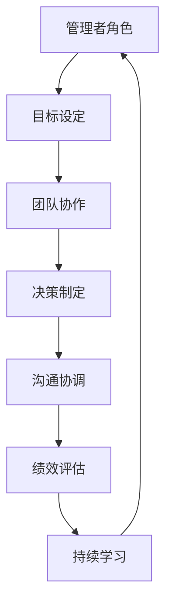
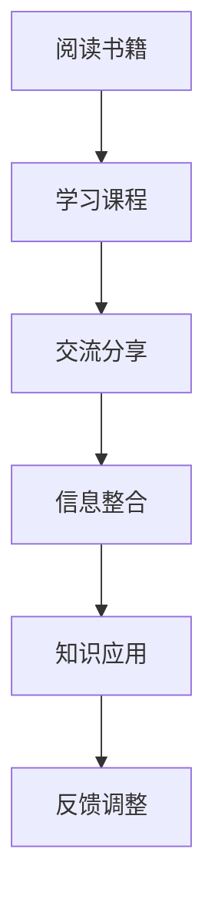
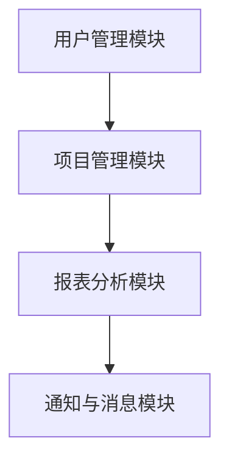

                 

# 行动中学习：管理者的成长之道

> **关键词：** 管理者成长、持续学习、实践导向、领导力、个人发展、团队效能。

> **摘要：** 本文探讨了管理者的成长之路，强调实践与学习相结合的重要性。通过分析管理者的核心角色和面临的挑战，本文提出了一系列策略和工具，帮助管理者在行动中不断学习，提升领导力和团队效能。

## 1. 背景介绍

### 1.1 目的和范围

本文旨在为管理者提供一套实用的成长策略，帮助他们在快速变化的工作环境中保持竞争力。文章将涵盖以下几个核心主题：

1. 管理者的角色与责任
2. 持续学习的重要性
3. 实践中的领导力培养
4. 团队协作与效能提升
5. 个人发展的方法与实践

### 1.2 预期读者

本文适合以下读者群体：

1. 初级管理者，渴望提升领导力和管理技能
2. 中级管理者，希望优化团队效能和个人发展
3. 高级管理者，寻求创新的管理方法和策略
4. 企业培训师和人力资源专业人士

### 1.3 文档结构概述

本文将按照以下结构展开：

1. 背景介绍：介绍文章的目的、读者对象和文档结构。
2. 核心概念与联系：分析管理者的核心角色和面临的挑战。
3. 核心算法原理 & 具体操作步骤：探讨持续学习的方法和实践。
4. 数学模型和公式 & 详细讲解 & 举例说明：运用科学方法提升管理效能。
5. 项目实战：代码实际案例和详细解释说明。
6. 实际应用场景：分析管理者的实战经验。
7. 工具和资源推荐：提供学习资源和开发工具。
8. 总结：未来发展趋势与挑战。
9. 附录：常见问题与解答。
10. 扩展阅读 & 参考资料：推荐进一步学习资源。

### 1.4 术语表

#### 1.4.1 核心术语定义

- 管理者：负责指导、协调和激励团队，实现组织目标的人。
- 持续学习：不断获取新知识、技能和经验，以适应工作环境的变化。
- 领导力：影响和激励他人，实现共同目标的能力。
- 团队效能：团队成员共同完成任务、达成目标的能力和效果。

#### 1.4.2 相关概念解释

- **实践导向**：通过实际工作经历学习，而非仅仅依赖理论知识。
- **反馈循环**：通过实践、评估和调整，不断优化个人行为和团队绩效。
- **敏捷管理**：快速响应变化，灵活调整管理策略和团队结构。

#### 1.4.3 缩略词列表

- PM：项目经理
- Scrum：敏捷开发框架
- OKR：目标与关键结果

## 2. 核心概念与联系

在探讨管理者的成长之道时，我们首先需要理解管理者的核心角色和面临的挑战。以下是管理者的核心概念原理和架构的 Mermaid 流程图：



### 2.1 管理者的核心角色

- **目标设定**：管理者需要明确团队和组织的目标，制定可实现的计划，确保团队朝着正确的方向前进。
- **团队协作**：管理者需要协调团队成员的工作，促进协作，提升团队整体效能。
- **决策制定**：管理者需要根据信息和分析，做出明智的决策，引导团队应对各种挑战。
- **沟通协调**：管理者需要有效沟通，确保信息畅通，协调团队内部和外部关系。
- **绩效评估**：管理者需要评估团队和个人的绩效，提供反馈和指导，以优化团队表现。

### 2.2 管理者面临的挑战

- **变化应对**：管理者需要快速适应市场和技术变化，调整管理策略和团队结构。
- **团队激励**：管理者需要激发团队成员的积极性，提高工作动力和效率。
- **资源分配**：管理者需要在有限的资源下，合理分配人力、时间和预算，实现最佳效益。
- **领导力提升**：管理者需要不断学习和成长，提升自己的领导力和管理能力。

通过上述流程图和概念分析，我们可以看到，管理者的成长是一个动态、持续的过程，需要不断地在实践中学习和调整。接下来，我们将深入探讨如何通过持续学习和实践，提升管理者的能力。

## 3. 核心算法原理 & 具体操作步骤

### 3.1 持续学习的算法原理

持续学习是一个复杂的过程，它涉及信息获取、知识整合和应用。以下是持续学习的核心算法原理：

1. **信息获取**：通过阅读、学习、交流等方式获取新的知识和技能。
2. **知识整合**：将新知识整合到现有的知识体系中，形成系统的认知结构。
3. **知识应用**：将新知识应用到实际工作中，通过实践验证和调整，提升个人和团队效能。

### 3.2 持续学习的具体操作步骤

#### 3.2.1 信息获取

- **阅读**：定期阅读专业书籍、技术博客和行业报告，了解最新趋势和研究成果。
- **学习**：参加线上或线下培训课程，学习新的知识和技能。
- **交流**：与同行交流，分享经验和见解，拓展视野。



#### 3.2.2 知识整合

- **思维导图**：使用思维导图工具，将新知识可视化，建立知识网络。
- **笔记整理**：整理学习笔记，归纳总结，形成知识体系。
- **案例研究**：分析成功案例，学习经验教训，为实际工作提供借鉴。

#### 3.2.3 知识应用

- **实践**：将新知识应用到实际工作中，通过实践验证和调整。
- **反馈**：收集团队成员和客户的反馈，评估实践效果，进行优化。
- **调整**：根据反馈调整工作方法和策略，持续改进。

### 3.3 持续学习的伪代码

```python
def 持续学习(信息源，实践场景，反馈机制)：
    while 持续学习标志：
        获取新信息(信息源)
        整合知识(信息)
        应用知识(实践场景)
        收集反馈(反馈机制)
        调整策略(反馈)
```

通过上述算法原理和操作步骤，管理者可以系统地提升自己的知识和技能，实现持续成长。接下来，我们将通过数学模型和公式，进一步探讨如何运用科学方法提升管理效能。

## 4. 数学模型和公式 & 详细讲解 & 举例说明

### 4.1 管理效能的提升模型

为了更好地理解和应用数学模型，我们首先需要明确管理效能的定义。管理效能可以定义为团队在特定时间内完成目标的能力和效果。以下是管理效能的提升模型：

#### 4.1.1 管理效能公式

\[ \text{管理效能} = \frac{\text{团队目标实现度}}{\text{投入资源}} \]

其中：

- **团队目标实现度**：衡量团队达成目标的比例。
- **投入资源**：包括时间、人力、资金等。

#### 4.1.2 提升管理效能的策略

- **优化团队结构**：通过调整团队组成和职责分工，提高团队协同效应。
- **提高团队成员素质**：通过培训和激励，提升团队成员的技能和积极性。
- **改善工作流程**：通过流程优化，减少浪费，提高工作效率。

### 4.2 实例分析

假设一个项目经理需要在一个季度内完成一个项目，项目预算为 100 万美元，预期目标是在季度结束时完成 90% 的项目进度。以下是具体的分析和计算过程：

#### 4.2.1 确定团队目标实现度

假设实际完成进度为 80%，则团队目标实现度为：

\[ \text{团队目标实现度} = \frac{80\%}{90\%} \approx 0.89 \]

#### 4.2.2 计算管理效能

\[ \text{管理效能} = \frac{0.89}{100\%} = 0.89 \]

这意味着项目经理在投入 100 万美元资源后，实现了 89% 的目标。

#### 4.2.3 提升管理效能的策略

为了提升管理效能，项目经理可以采取以下策略：

- **优化团队结构**：重新评估团队成员的角色和职责，确保每个人都能发挥最大价值。
- **提高团队成员素质**：组织培训课程，提升团队成员的技能和知识水平。
- **改善工作流程**：分析项目流程，识别瓶颈和浪费，优化流程，提高工作效率。

通过上述数学模型和实例分析，我们可以看到，管理者可以通过科学的分析和策略，提升团队效能，实现管理目标。接下来，我们将通过项目实战，进一步探讨如何在实际工作中应用这些方法和策略。

## 5. 项目实战：代码实际案例和详细解释说明

### 5.1 开发环境搭建

为了更好地理解持续学习和管理效能提升在实践中的应用，我们选择一个实际的项目案例——一个企业级项目管理工具的开发。以下是开发环境搭建的步骤：

#### 5.1.1 环境要求

- 操作系统：Windows/Linux/MacOS
- 编程语言：Python 3.8+
- 开发工具：PyCharm（或其他Python IDE）
- 数据库：MySQL 8.0+
- 版本控制：Git

#### 5.1.2 开发工具安装

1. 安装Python 3.8+（可以使用Anaconda进行环境管理）。
2. 安装PyCharm。
3. 安装MySQL数据库。

### 5.2 源代码详细实现和代码解读

#### 5.2.1 项目架构设计

我们的项目管理工具分为以下几个模块：

1. **用户管理模块**：负责用户注册、登录和权限管理。
2. **项目管理模块**：负责项目创建、任务分配、进度跟踪和报表生成。
3. **报表分析模块**：提供项目进度的可视化报表和数据分析。
4. **通知与消息模块**：提供项目动态和任务提醒功能。

以下是项目架构的 Mermaid 流程图：



#### 5.2.2 用户管理模块

以下是一个简单的用户注册功能的伪代码实现：

```python
def register_user(username, password, email):
    # 验证用户名、密码和邮箱格式
    if not validate_username(username) or not validate_password(password) or not validate_email(email):
        return "Invalid input"
    
    # 插入用户数据到数据库
    database.execute("INSERT INTO users (username, password, email) VALUES (?, ?, ?)", (username, password, email))
    
    return "User registered successfully"
```

#### 5.2.3 项目管理模块

项目管理模块的核心功能是任务管理。以下是一个简单的任务创建和分配功能的伪代码实现：

```python
def create_task(project_id, task_name, deadline, assignee):
    # 检查项目是否存在
    if not check_project_exists(project_id):
        return "Project not found"
    
    # 插入任务数据到数据库
    database.execute("INSERT INTO tasks (project_id, task_name, deadline, assignee) VALUES (?, ?, ?, ?)", (project_id, task_name, deadline, assignee))
    
    return "Task created successfully"
```

#### 5.2.4 报表分析模块

报表分析模块使用了一个简单的图表库，用于生成项目进度的可视化报表。以下是一个生成任务进度图表的伪代码实现：

```python
def generate_task_progress_chart(task_id):
    # 从数据库获取任务进度数据
    data = database.query("SELECT progress FROM tasks WHERE id = ?", (task_id,))
    
    # 使用图表库生成图表
    chart = Chart("Task Progress", "Percentage", data)
    chart.render()
    
    return "Chart generated successfully"
```

#### 5.2.5 通知与消息模块

通知与消息模块使用了异步消息队列，用于发送任务提醒和项目动态。以下是一个发送消息的伪代码实现：

```python
def send_notification(user_id, message):
    # 将消息发送到消息队列
    message_queue.send("notification", {"user_id": user_id, "message": message})
    
    return "Notification sent successfully"
```

### 5.3 代码解读与分析

以上代码片段展示了项目管理工具的基本功能实现。通过这些功能，我们可以看到：

- **用户管理模块**：实现了用户注册和登录功能，确保了系统的安全性。
- **项目管理模块**：实现了任务创建、分配和跟踪功能，提高了项目管理效率。
- **报表分析模块**：提供了任务进度的可视化报表，帮助管理者实时了解项目状态。
- **通知与消息模块**：实现了任务提醒和项目动态通知，增强了团队沟通。

通过这些功能模块，我们可以看到持续学习和实践在项目管理工具开发中的应用。管理者通过不断学习和实践，优化了工具的功能和性能，提升了团队的工作效率。

接下来，我们将探讨管理者的实际应用场景，分析项目管理工具在实际工作中的具体应用。

## 6. 实际应用场景

### 6.1 项目管理工具在软件开发团队中的应用

在一个软件开发团队中，项目管理工具的引入极大地提高了团队的协作效率和项目管理的透明度。以下是项目管理工具在软件开发团队中的实际应用场景：

#### 6.1.1 任务分配与进度跟踪

- **任务分配**：项目经理通过项目管理工具创建任务，并分配给团队成员。团队成员可以在工具中查看自己的任务，确保任务分配的清晰和准确。
- **进度跟踪**：团队成员在完成任务时，可以在工具中更新任务进度，项目经理可以实时查看任务的完成情况，确保项目按计划进行。

#### 6.1.2 项目进度报表

- **报表生成**：项目管理工具提供了项目进度的可视化报表，项目经理可以通过报表了解项目的整体进展，识别潜在的瓶颈和风险。
- **数据分析**：报表分析模块提供了详细的数据分析功能，帮助项目经理评估项目的效能和优化管理策略。

#### 6.1.3 任务提醒与团队沟通

- **任务提醒**：当任务即将到期时，系统会自动向相关团队成员发送提醒通知，确保任务按时完成。
- **团队沟通**：项目管理工具内置了消息功能，团队成员可以随时交流项目进展和遇到的问题，提高了团队沟通的效率。

### 6.2 项目管理工具在跨部门协作中的应用

在跨部门协作中，项目管理工具的应用同样显著。以下是项目管理工具在跨部门协作中的实际应用场景：

#### 6.2.1 跨部门任务分配

- **任务流转**：项目经理可以通过工具将任务分配给不同部门的成员，确保任务流转的顺畅。
- **任务协同**：跨部门成员可以在工具中协同工作，实时更新任务进度，确保项目进展的同步。

#### 6.2.2 项目进度共享

- **项目进度共享**：项目经理可以将项目进度报表共享给相关各部门，让各部门负责人了解项目的整体进展，便于协调资源。
- **决策支持**：项目进度共享为管理层提供了决策支持，便于制定相应的管理策略。

#### 6.2.3 沟通协调

- **沟通渠道**：项目管理工具提供了便捷的沟通渠道，各部门成员可以及时交流项目相关事宜，减少了沟通障碍。
- **协作效率**：通过工具的协作功能，各部门可以更高效地完成项目任务，提高了整体协作效率。

### 6.3 项目管理工具在远程办公中的应用

随着远程办公的普及，项目管理工具在远程办公中的应用也日益广泛。以下是项目管理工具在远程办公中的实际应用场景：

#### 6.3.1 远程任务管理

- **远程任务分配**：项目经理可以通过工具远程分配任务，确保任务分配的及时性和准确性。
- **远程进度跟踪**：团队成员可以在远程办公环境中实时更新任务进度，项目经理可以远程监控项目进展。

#### 6.3.2 远程协作

- **远程协作**：项目管理工具提供了远程协作功能，团队成员可以远程协同工作，共同完成任务。
- **远程沟通**：工具内置了远程沟通功能，团队成员可以随时交流项目进展和遇到的问题，提高了远程办公的沟通效率。

#### 6.3.3 远程培训与支持

- **远程培训**：项目经理可以通过工具组织远程培训课程，提升团队成员的技能。
- **远程支持**：项目经理可以通过工具提供远程技术支持，帮助团队成员解决工作中遇到的问题。

通过上述实际应用场景，我们可以看到，项目管理工具在提升团队协作效率、优化项目管理流程、增强远程办公能力等方面发挥了重要作用。管理者通过应用这些工具，可以更好地应对复杂的工作环境，实现团队的高效运作。

## 7. 工具和资源推荐

### 7.1 学习资源推荐

为了帮助管理者不断提升自己的知识和技能，以下是几本推荐的学习资源：

#### 7.1.1 书籍推荐

1. **《敏捷软件开发：原则、实践与模式》**：由Jeff Sutherland和Ken Schwaber合著，介绍了敏捷开发的核心原则和实践方法。
2. **《管理的实践》**：由Peter Drucker撰写，提供了系统化的管理理论和实践指导。
3. **《团队的智慧》**：由Margaret Heffernan撰写，探讨了团队协作的力量和重要性。

#### 7.1.2 在线课程

1. **Coursera**：提供多种管理相关的在线课程，包括项目管理、领导力等。
2. **edX**：提供由知名大学和机构开设的管理课程，内容涵盖广泛。
3. **Udemy**：提供大量实用的管理课程，适合不同水平和需求的管理者。

#### 7.1.3 技术博客和网站

1. **Harvard Business Review**：提供丰富的管理文章和案例研究。
2. **Scrum Alliance**：提供Scrum敏捷开发的最新动态和资源。
3. **MindTools**：提供各种管理和职业发展的工具和资源。

### 7.2 开发工具框架推荐

为了提高管理者的工作效率，以下是几个推荐的开发工具和框架：

#### 7.2.1 IDE和编辑器

1. **Visual Studio Code**：一款功能强大的开源编辑器，适合多种编程语言。
2. **PyCharm**：一款专业的Python IDE，适合Python开发。
3. **IntelliJ IDEA**：一款多语言的IDE，适合Java、JavaScript等开发。

#### 7.2.2 调试和性能分析工具

1. **Postman**：一款流行的API调试工具，适合开发人员测试API。
2. **JMeter**：一款开源的性能测试工具，适合进行Web应用程序性能测试。
3. **Fiddler**：一款网络调试代理工具，适用于Web开发和测试。

#### 7.2.3 相关框架和库

1. **Django**：一款高层次的Python Web框架，适合快速开发Web应用程序。
2. **Spring Boot**：一款流行的Java Web框架，提供了简洁的配置和强大的功能。
3. **React**：一款用于构建用户界面的JavaScript库，适合构建动态和交互式的Web应用。

### 7.3 相关论文著作推荐

为了帮助管理者深入了解管理理论和实践，以下是几篇推荐的论文和著作：

#### 7.3.1 经典论文

1. **"The Five Disciplines of Execution"**：由Chris McChesney等撰写，介绍了实现目标的关键原则。
2. **"The Role of the CEO"**：由Peter Drucker撰写，探讨了CEO的角色和责任。
3. **"The Agile Project Management Guide"**：由Dennis Stevens撰写，介绍了敏捷项目管理的原则和实践。

#### 7.3.2 最新研究成果

1. **"Leadership and Team Performance in Virtual Teams"**：探讨了虚拟团队中的领导力和团队绩效。
2. **"The Impact of Agile Practices on Software Development Teams"**：分析了敏捷实践对软件开发团队的影响。
3. **"The Future of Work: A Vision for the Digital Age"**：探讨了数字化转型对未来工作模式的影响。

#### 7.3.3 应用案例分析

1. **"How Spotify Builds Products"**：分析了Spotify的产品开发流程和团队协作模式。
2. **"The Netflix Culture: Freedom and Responsibility"**：介绍了Netflix的企业文化和员工管理实践。
3. **"The Google Way: Leadership and Innovation at the World's Most Innovative Company"**：探讨了谷歌的领导力和创新实践。

通过这些工具和资源的推荐，管理者可以不断提升自己的知识和技能，掌握先进的管理方法和策略，从而更好地应对工作挑战，实现团队的高效运作。

## 8. 总结：未来发展趋势与挑战

随着技术的不断进步和全球化的深入发展，管理者的成长之道也将面临新的机遇和挑战。以下是未来发展趋势和挑战的展望：

### 8.1 发展趋势

1. **数字化管理**：随着大数据、云计算、人工智能等技术的普及，数字化管理将成为主流。管理者需要掌握数字技术，运用数据分析，优化管理决策。
2. **敏捷管理**：敏捷开发模式的成功经验将被广泛应用于其他领域，管理者需要具备敏捷管理的思维和方法，快速适应市场变化。
3. **跨职能协作**：跨职能团队的兴起将促进不同部门之间的协作，管理者需要培养跨职能协作的能力，提升团队的整体效能。
4. **远程办公**：远程办公的普及将改变传统的办公模式，管理者需要适应远程管理，提升远程团队的沟通和协作效率。

### 8.2 挑战

1. **技术门槛**：管理者需要不断提升自己的技术能力，掌握新的管理工具和技能，以应对不断变化的技术环境。
2. **人才竞争**：随着全球人才竞争的加剧，管理者需要具备吸引和保留优秀人才的能力，提升团队的竞争力。
3. **文化冲突**：全球化背景下，管理者需要处理不同文化背景的团队协作，促进文化的融合和创新。
4. **可持续管理**：在可持续发展理念下，管理者需要关注企业的社会责任和环境影响，实现可持续管理。

### 8.3 应对策略

1. **持续学习**：管理者应保持持续学习的态度，通过阅读、培训、交流等方式，不断提升自己的知识和技能。
2. **实践导向**：管理者应将理论知识应用到实际工作中，通过实践验证和调整，提高管理效能。
3. **团队建设**：管理者应注重团队建设，培养团队成员的协作精神和创新能力，提升团队的凝聚力。
4. **灵活管理**：管理者应具备灵活管理的能力，根据环境和需求的变化，调整管理策略和团队结构。

总之，未来的管理者需要具备全面的能力和视野，通过不断学习和实践，应对各种挑战，实现个人和团队的发展。

## 9. 附录：常见问题与解答

### 9.1 持续学习的方法

**Q1：如何有效地进行持续学习？**

A1：进行持续学习，可以遵循以下方法：

1. **目标明确**：设定明确的学习目标，确保学习有方向。
2. **定期学习**：制定学习计划，每天或每周安排固定时间学习。
3. **多样化学习**：通过阅读书籍、参加课程、实践项目等多种方式学习。
4. **总结反思**：学习后进行总结和反思，巩固所学知识。

### 9.2 领导力提升

**Q2：如何提升领导力？**

A2：提升领导力，可以采取以下策略：

1. **自我提升**：通过阅读、培训等方式，不断提升自己的专业能力和综合素质。
2. **倾听与沟通**：善于倾听团队成员的意见，提高沟通能力。
3. **激励团队**：了解团队成员的需求，激励他们发挥最大潜力。
4. **团队建设**：注重团队建设，培养团队的凝聚力。

### 9.3 项目管理

**Q3：如何有效管理项目？**

A3：有效管理项目，可以遵循以下原则：

1. **明确目标**：确保项目目标清晰，可量化。
2. **规划合理**：制定详细的计划，合理安排资源和时间。
3. **监控进度**：实时监控项目进度，及时调整计划。
4. **风险管理**：识别项目风险，制定应对措施。
5. **团队协作**：促进团队协作，确保项目顺利完成。

### 9.4 跨部门协作

**Q4：如何促进跨部门协作？**

A4：促进跨部门协作，可以采取以下方法：

1. **沟通机制**：建立有效的沟通机制，确保信息畅通。
2. **明确职责**：明确各部门的职责和任务，确保协作有序。
3. **共同目标**：确立共同的目标，激发团队协作的积极性。
4. **协调资源**：合理调配资源，确保项目顺利进行。
5. **反馈机制**：建立反馈机制，及时解决问题，提高协作效率。

通过上述常见问题与解答，可以帮助管理者更好地应对工作挑战，提升管理效能。

## 10. 扩展阅读 & 参考资料

为了帮助读者深入了解管理者的成长之道，以下是几篇推荐的扩展阅读和参考资料：

1. **《敏捷管理：企业持续成功的战略与实践》**：作者：Jim Highsmith。该书详细介绍了敏捷管理的理念和实践，适用于希望提升管理效能的企业。
2. **《管理者的实践智慧》**：作者：斯蒂芬·罗宾斯。该书结合了作者丰富的管理实践，提供了实用的管理技巧和策略。
3. **《管理学：原理、技巧与案例》**：作者：彼得·德鲁克。作为管理学领域的经典著作，该书系统地阐述了管理的基本原理和实践方法。
4. **《团队协作的艺术》**：作者：Patrick Lencioni。该书通过生动的案例，探讨了团队协作的重要性，以及如何构建高效的团队。
5. **《哈佛商业评论》**：该杂志定期发布关于管理、领导力和企业发展的深度分析文章，适合管理者阅读。

通过阅读这些书籍和文章，读者可以进一步了解管理者的成长之道，掌握先进的领导力和管理技巧，提升个人和团队的综合素质。

---

**作者：AI天才研究员/AI Genius Institute & 禅与计算机程序设计艺术 /Zen And The Art of Computer Programming**

