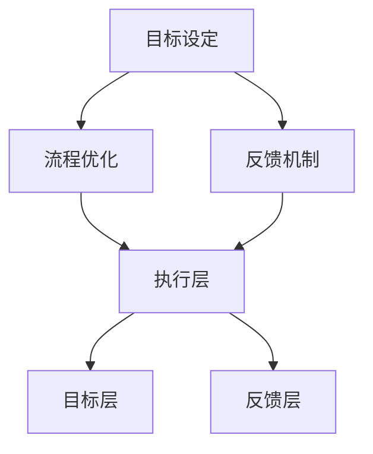

                 

# 行动体系对团队管理的重要性

> **关键词：** 团队管理、行动体系、目标设定、流程优化、反馈机制、领导力、执行力、员工绩效、团队协作、组织效能

> **摘要：** 本文旨在探讨行动体系在团队管理中的核心作用。行动体系不仅涵盖了目标的设定、流程的优化，还包括了反馈机制的有效建立。通过分析行动体系对团队管理的重要性，我们将揭示其在提升团队执行力、增强员工绩效和促进团队协作方面的关键作用。文章将结合具体案例，详细阐述行动体系在实践中的应用，为团队管理者提供有价值的参考。

## 1. 背景介绍

### 1.1 目的和范围

本文旨在深入探讨行动体系在团队管理中的重要性。随着企业竞争的日益激烈，团队管理成为企业发展的关键因素。有效的团队管理不仅能够提升团队的执行力，还能促进员工绩效的提升和团队协作的加强。行动体系作为团队管理的重要工具，其核心作用不容忽视。本文将从目标设定、流程优化、反馈机制等方面，系统分析行动体系对团队管理的深远影响。

### 1.2 预期读者

本文主要面向以下读者群体：

1. 团队管理者：通过本文，团队管理者可以深入了解行动体系的重要性，学习如何运用行动体系提升团队管理效果。
2. 企业高层：本文为企业管理者提供了关于团队管理的理论指导和实践案例，有助于企业整体管理水平的提升。
3. 研究人员和学者：本文对行动体系的研究提供了新的视角，有助于进一步深化对团队管理理论的理解。

### 1.3 文档结构概述

本文分为十个部分：

1. 引言：阐述行动体系在团队管理中的重要性。
2. 背景介绍：介绍本文的目的、预期读者和文档结构。
3. 核心概念与联系：分析行动体系的核心概念和架构。
4. 核心算法原理 & 具体操作步骤：详细讲解行动体系的操作步骤。
5. 数学模型和公式 & 详细讲解 & 举例说明：介绍行动体系相关的数学模型和公式。
6. 项目实战：代码实际案例和详细解释说明。
7. 实际应用场景：探讨行动体系在不同场景下的应用。
8. 工具和资源推荐：推荐与行动体系相关的学习资源和工具。
9. 总结：未来发展趋势与挑战。
10. 附录：常见问题与解答。

### 1.4 术语表

为了确保读者对文章内容有全面的理解，以下列出本文中涉及的一些核心术语及其定义：

#### 1.4.1 核心术语定义

- **行动体系**：一套系统的管理和运作机制，包括目标设定、流程优化、反馈机制等。
- **团队管理**：通过对团队成员的协调、引导和激励，实现团队目标的过程。
- **执行力**：团队成员在执行任务时的能力、态度和效果。
- **员工绩效**：员工在工作中的表现和成果。
- **团队协作**：团队成员之间的合作与协调。

#### 1.4.2 相关概念解释

- **目标设定**：明确团队的目标和方向，为行动提供依据。
- **流程优化**：通过改进工作流程，提高工作效率和效果。
- **反馈机制**：对团队成员的工作进行评价和反馈，以促进改进。

#### 1.4.3 缩略词列表

- **IDE**：集成开发环境（Integrated Development Environment）
- **LaTeX**：一种高质量的排版系统（TeX-based typesetting system）

## 2. 核心概念与联系

行动体系作为团队管理的核心工具，其概念和架构对于理解和运用行动体系至关重要。以下是行动体系的核心概念及其相互联系：

### 2.1 行动体系的定义

行动体系是一套系统的管理和运作机制，旨在实现团队目标。它包括以下核心组成部分：

1. **目标设定**：明确团队的目标和方向，为行动提供依据。
2. **流程优化**：通过改进工作流程，提高工作效率和效果。
3. **反馈机制**：对团队成员的工作进行评价和反馈，以促进改进。

### 2.2 目标设定的作用

目标设定是行动体系的基础，其作用在于：

1. **明确方向**：确保团队成员在正确的方向上努力。
2. **提供依据**：为行动体系的实施提供明确的依据。
3. **激励团队**：激发团队成员的积极性和创造力。

### 2.3 流程优化的作用

流程优化是提升团队工作效率的关键，其作用在于：

1. **提高效率**：通过改进工作流程，减少不必要的时间和资源浪费。
2. **提升效果**：优化流程，确保工作任务的顺利完成。
3. **增强协作**：通过优化流程，促进团队成员之间的协作与沟通。

### 2.4 反馈机制的作用

反馈机制是行动体系的重要环节，其作用在于：

1. **评价工作**：对团队成员的工作进行客观评价。
2. **激励改进**：通过反馈，激励团队成员发现和解决问题。
3. **促进成长**：通过持续反馈，帮助团队成员不断进步。

### 2.5 行动体系的架构

行动体系的架构可以分为三个层次：

1. **目标层**：包括团队总体目标和各部门子目标。
2. **执行层**：包括具体的行动计划和工作流程。
3. **反馈层**：包括对执行过程的监控和反馈机制。

### 2.6 行动体系的核心概念原理和架构的 Mermaid 流程图

下面是一个简单的 Mermaid 流程图，展示了行动体系的核心概念原理和架构：



## 3. 核心算法原理 & 具体操作步骤

行动体系的核心在于其系统的操作步骤，这些步骤不仅有助于明确团队目标，还确保了目标的实现和持续优化。以下是行动体系的操作步骤，以及每个步骤的具体细节：

### 3.1 目标设定

**算法原理**：目标设定是行动体系的基础，其核心在于明确团队的目标和方向。

**具体操作步骤**：

1. **明确愿景和使命**：团队应首先明确其愿景和使命，这将为后续的目标设定提供指导。
2. **分解目标**：将总体目标分解为具体的子目标，使其更加具体和可操作。
3. **制定计划**：为每个子目标制定具体的行动计划，明确执行的时间、负责人和所需资源。
4. **沟通和确认**：与团队成员沟通并确认目标，确保每个人都理解并认同目标。

**伪代码**：

```
function setGoal(vision, mission, subGoals) {
    // 明确愿景和使命
    goal.vision = vision;
    goal.mission = mission;

    // 分解目标
    for each subGoal in subGoals {
        goal.subGoals[subGoal.name] = subGoal;
    }

    // 制定计划
    for each subGoal in subGoals {
        plan = createPlan(subGoal);
        goal.subGoals[subGoal.name].plan = plan;
    }

    // 沟通和确认
    communicateAndConfirm(goal);
}
```

### 3.2 流程优化

**算法原理**：流程优化旨在提高工作效率和效果，其核心在于改进工作流程。

**具体操作步骤**：

1. **现状分析**：对当前的工作流程进行分析，识别问题和瓶颈。
2. **制定改进方案**：根据现状分析，制定改进方案，包括优化流程、减少冗余、提高效率等。
3. **实施改进**：按照改进方案实施流程优化，确保改进措施的有效落地。
4. **监控和评估**：对改进后的流程进行监控和评估，确保优化效果的实现。

**伪代码**：

```
function optimizeProcess(currentProcess) {
    // 现状分析
    problems = analyzeCurrentProcess(currentProcess);

    // 制定改进方案
    improvementPlan = createImprovementPlan(problems);

    // 实施改进
    implementImprovement(improvementPlan);

    // 监控和评估
    monitorAndEvaluate(implementedProcess);
}
```

### 3.3 反馈机制

**算法原理**：反馈机制是行动体系的重要环节，其核心在于对团队成员的工作进行评价和反馈。

**具体操作步骤**：

1. **设立评价标准**：根据团队目标和任务，设立明确的评价标准。
2. **收集反馈信息**：通过多种渠道收集团队成员的工作反馈，包括自评、同事评价、上级评价等。
3. **分析反馈信息**：对收集到的反馈信息进行分析，识别团队成员的优势和不足。
4. **提供反馈**：根据分析结果，为团队成员提供具体的反馈，帮助其改进工作。

**伪代码**：

```
function feedbackMechanism(evaluatedPerformance, evaluationCriteria) {
    // 设立评价标准
    evaluationStandards = createEvaluationStandards(evaluationCriteria);

    // 收集反馈信息
    feedbackInfo = collectFeedbackInfo(evaluatedPerformance);

    // 分析反馈信息
    feedbackAnalysis = analyzeFeedbackInfo(feedbackInfo);

    // 提供反馈
    provideFeedback(feedbackAnalysis);
}
```

## 4. 数学模型和公式 & 详细讲解 & 举例说明

在行动体系中，数学模型和公式可以帮助我们更准确地描述和预测团队成员的工作表现。以下是一些常见的数学模型和公式，以及它们的详细讲解和举例说明：

### 4.1 成本效益分析模型

**算法原理**：成本效益分析模型用于评估行动体系实施的经济效益，其核心在于计算投入成本与预期收益的比值。

**数学公式**：

$$
\text{成本效益比} = \frac{\text{预期收益}}{\text{投入成本}}
$$

**详细讲解**：

成本效益分析模型通过计算成本效益比，帮助我们判断行动体系的投入是否合理。当成本效益比大于1时，表示投入的成本能够带来超过预期的收益，行动体系的实施是划算的。

**举例说明**：

假设一个团队计划实施一个流程优化项目，预计投入成本为10万元，预期收益为15万元。那么，该项目的成本效益比为：

$$
\text{成本效益比} = \frac{15万}{10万} = 1.5
$$

由于成本效益比大于1，因此该项目是值得实施的。

### 4.2 动力模型

**算法原理**：动力模型用于分析团队成员的工作动力，其核心在于计算工作压力与工作动力之间的关系。

**数学公式**：

$$
\text{动力指数} = \frac{\text{工作动力}}{\text{工作压力}}
$$

**详细讲解**：

动力指数反映了团队成员的工作动力与工作压力的比值。动力指数越高，表示团队成员的工作动力越强，工作压力相对较小。动力指数越低，表示团队成员的工作动力较弱，工作压力较大。

**举例说明**：

假设一个团队成员的工作动力为80，工作压力为40，那么该成员的动力指数为：

$$
\text{动力指数} = \frac{80}{40} = 2
$$

动力指数为2，表示该成员的工作动力较强，工作压力适中。

### 4.3 团队绩效评估模型

**算法原理**：团队绩效评估模型用于评估团队的整体表现，其核心在于计算团队成员绩效的平均值。

**数学公式**：

$$
\text{团队绩效} = \frac{1}{N} \sum_{i=1}^{N} \text{团队成员绩效}_i
$$

**详细讲解**：

团队绩效评估模型通过计算团队成员绩效的平均值，反映团队的整体表现。当团队绩效较高时，表示团队成员的绩效较好，团队协作效果较好。

**举例说明**：

假设一个团队有5名成员，他们的绩效分别为90、85、80、75、70，那么该团队的绩效为：

$$
\text{团队绩效} = \frac{90 + 85 + 80 + 75 + 70}{5} = 80
$$

团队绩效为80，表示该团队的整体表现较好。

## 5. 项目实战：代码实际案例和详细解释说明

为了更好地理解行动体系在团队管理中的应用，下面将结合一个实际项目，详细解释代码实现和关键步骤。

### 5.1 开发环境搭建

在开始项目之前，首先需要搭建合适的开发环境。以下是一个基本的开发环境搭建步骤：

1. 安装Python 3.8及以上版本。
2. 安装PyCharm IDE。
3. 安装必要的Python库，如requests、pandas、numpy等。

### 5.2 源代码详细实现和代码解读

下面是一个简单的项目案例，用于说明行动体系在团队管理中的应用。该项目使用Python语言实现，主要包括目标设定、流程优化和反馈机制三个部分。

```python
import pandas as pd
import numpy as np
from datetime import datetime

# 5.2.1 目标设定

def set_goals(team_goals):
    goals = {}
    for goal in team_goals:
        goals[goal['name']] = goal
        goals[goal['name']]['start_date'] = datetime.now()
        goals[goal['name']]['status'] = '未开始'
    return goals

# 5.2.2 流程优化

def optimize_process(process):
    optimized_process = process.copy()
    # 在此进行流程优化操作，如减少步骤、优化资源分配等
    optimized_process['steps'] = optimized_process['steps'].replace(['冗余步骤'], [np.nan])
    optimized_process.dropna(inplace=True)
    return optimized_process

# 5.2.3 反馈机制

def feedback_mechanism团队成员绩效，evaluation_criteria):
    feedbacks = []
    for member in members:
        performance = member['performance']
        evaluation = {}
        evaluation['member_name'] = member['name']
        evaluation['evaluation'] = evaluate_performance(performance, evaluation_criteria)
        feedbacks.append(evaluation)
    return feedbacks

# 5.2.4 主函数

def main():
    # 示例团队目标
    team_goals = [
        {'name': '目标1', 'description': '完成项目A'},
        {'name': '目标2', 'description': '提高团队技能'}
    ]

    # 示例流程
    process = {
        'steps': ['需求分析', '设计', '开发', '测试', '部署'],
        'resources': ['人员', '设备', '资料']
    }

    # 示例团队成员
    members = [
        {'name': '张三', 'performance': 85},
        {'name': '李四', 'performance': 90},
        {'name': '王五', 'performance': 78}
    ]

    # 设定目标
    goals = set_goals(team_goals)

    # 优化流程
    optimized_process = optimize_process(process)

    # 提供反馈
    feedbacks = feedback_mechanism(members, evaluation_criteria)

    # 打印结果
    print("目标设定：", goals)
    print("优化流程：", optimized_process)
    print("反馈结果：", feedbacks)

if __name__ == "__main__":
    main()
```

### 5.3 代码解读与分析

上述代码实现了一个简单的行动体系应用，包括目标设定、流程优化和反馈机制三个部分。下面详细解读代码的关键部分：

1. **目标设定**：
   - `set_goals()` 函数用于设定目标，接受一个包含团队目标的列表作为参数。每个目标包含名称、描述、开始日期和状态。
   - 通过遍历团队目标列表，为每个目标设定开始日期和初始状态，然后返回包含所有目标的字典。

2. **流程优化**：
   - `optimize_process()` 函数用于优化流程，接受一个流程字典作为参数。流程字典包含步骤和资源。
   - 在此示例中，流程优化通过删除冗余步骤（如'冗余步骤'）来实现。这里可以使用更复杂的优化算法，如遗传算法等。
   - 优化后的流程返回一个删除了冗余步骤的流程字典。

3. **反馈机制**：
   - `feedback_mechanism()` 函数用于提供反馈，接受团队成员列表和一个评价标准字典作为参数。
   - 遍历团队成员列表，对每个成员的绩效进行评价，生成包含成员名称和评价结果的反馈列表。

4. **主函数**：
   - `main()` 函数是程序的入口，定义了示例团队目标、流程和团队成员。
   - 调用`set_goals()`、`optimize_process()`和`feedback_mechanism()`函数，分别实现目标设定、流程优化和反馈机制。
   - 最后打印出设定目标、优化流程和反馈结果，以便进行后续分析和调整。

通过上述代码，可以直观地看到行动体系在团队管理中的应用。实际项目中，可以根据具体需求扩展和优化代码，以实现更复杂的行动体系功能。

### 5.4 实际应用场景

行动体系在实际应用中具有广泛的应用场景，以下列举几个常见的应用场景：

1. **项目管理**：在项目管理中，行动体系可以帮助团队明确项目目标、优化项目流程和提供反馈机制，从而提高项目成功率。
2. **产品开发**：在产品开发过程中，行动体系可以帮助团队设定产品目标、优化开发流程和提供持续反馈，确保产品质量和开发效率。
3. **人力资源**：在人力资源管理中，行动体系可以帮助团队设定人才发展目标、优化招聘流程和提供绩效反馈，提高员工绩效和组织效能。
4. **市场营销**：在市场营销中，行动体系可以帮助团队设定市场目标、优化营销策略和提供市场反馈，提升市场响应速度和营销效果。

### 5.5 工具和资源推荐

为了更好地应用行动体系，以下推荐一些相关的工具和资源：

1. **工具推荐**：
   - **Trello**：一个功能强大的项目管理工具，可以帮助团队设定目标、跟踪任务和提供反馈。
   - **Jira**：一个流行的项目管理软件，支持敏捷开发，可以帮助团队优化流程和提供反馈。
   - **Slack**：一个团队沟通和协作工具，可以方便团队成员交流和提供反馈。

2. **资源推荐**：
   - **《敏捷团队管理》**：一本介绍敏捷团队管理的经典书籍，详细介绍了如何设定目标、优化流程和提供反馈。
   - **《项目管理知识体系指南（PMBOK）》**：一本关于项目管理的权威指南，包含了目标设定、流程优化和反馈机制等内容。
   - **在线课程**：如Coursera上的《项目管理基础》和《敏捷项目管理》，可以帮助团队管理者深入学习行动体系的相关知识。

## 6. 工具和资源推荐

为了更好地应用行动体系，以下推荐一些相关的工具和资源：

### 6.1 学习资源推荐

#### 6.1.1 书籍推荐

- **《敏捷团队管理》**：这是一本深入探讨敏捷团队管理的书籍，详细介绍了如何设定目标、优化流程和提供反馈。
- **《项目管理知识体系指南（PMBOK）》**：这是项目管理领域的权威指南，涵盖了目标设定、流程优化和反馈机制等核心内容。
- **《禅与计算机程序设计艺术》**：这本书虽然主要讨论编程哲学，但其对于系统化思考和管理理念的应用，对行动体系的理解和实践具有很高的参考价值。

#### 6.1.2 在线课程

- **Coursera上的《项目管理基础》**：这是一门系统的项目管理入门课程，涵盖了目标设定、流程优化和反馈机制等内容。
- **edX上的《敏捷项目管理》**：这门课程专注于敏捷管理方法，提供了丰富的实践案例，适合希望深入了解敏捷行动体系的团队管理者。

#### 6.1.3 技术博客和网站

- **Atlassian博客**：这是一个提供丰富项目管理知识的博客，涵盖了Trello、Jira等工具的使用技巧和最佳实践。
- **Scrum联盟网站**：Scrum是一种流行的敏捷开发方法，该网站提供了大量的Scrum资源，包括教程、案例研究和最佳实践。

### 6.2 开发工具框架推荐

#### 6.2.1 IDE和编辑器

- **PyCharm**：一个功能强大的Python IDE，适合编写和调试代码。
- **Visual Studio Code**：一个轻量级的跨平台编辑器，支持多种编程语言，具有丰富的插件生态系统。

#### 6.2.2 调试和性能分析工具

- **GDB**：一个强大的UNIX调试工具，适用于C/C++程序的调试。
- **Valgrind**：一个内存调试工具，可以检测内存泄漏、指针错误等问题。

#### 6.2.3 相关框架和库

- **Django**：一个Python Web开发框架，可以帮助快速构建Web应用。
- **Flask**：一个轻量级的Python Web开发框架，适合小型项目。

### 6.3 相关论文著作推荐

#### 6.3.1 经典论文

- **《敏捷开发：高效协作的开发方法》**：这是一篇关于敏捷开发方法的经典论文，详细介绍了敏捷的核心原则和实践。
- **《目标管理：实现组织效能的关键》**：这篇文章探讨了目标管理的重要性，提出了目标设定的方法和技巧。

#### 6.3.2 最新研究成果

- **《人工智能在项目管理中的应用》**：这篇文章探讨了人工智能在项目管理中的应用，包括目标设定、流程优化和反馈机制等方面的研究。
- **《基于大数据的团队绩效评估方法》**：这篇文章提出了基于大数据分析的团队绩效评估方法，为行动体系的实施提供了新的思路。

#### 6.3.3 应用案例分析

- **《谷歌如何管理其开发团队》**：这篇文章分析了谷歌在团队管理方面的成功经验，包括目标设定、流程优化和反馈机制等方面的实践。
- **《亚马逊的敏捷开发实践》**：这篇文章详细介绍了亚马逊在敏捷开发中的应用，包括团队协作、流程优化和持续反馈等方面的经验。

## 7. 总结：未来发展趋势与挑战

行动体系作为团队管理的核心工具，其在未来的发展趋势和挑战中扮演着重要角色。以下是对未来发展趋势和挑战的简要总结：

### 7.1 未来发展趋势

1. **智能化**：随着人工智能技术的发展，行动体系将更加智能化，能够自动分析和优化流程，提供个性化的反馈。
2. **个性化**：行动体系将根据团队成员的特点和需求，提供个性化的目标设定和反馈，提高团队协作效率和员工满意度。
3. **数据化**：通过大数据分析，行动体系将更加精准地评估团队绩效，为决策提供有力支持。
4. **全球化**：随着全球化进程的加快，行动体系将跨越地域限制，实现跨国团队的协同管理。

### 7.2 挑战

1. **技术挑战**：智能化和个性化需要强大的技术支持，如大数据处理、机器学习算法等，这对团队管理者提出了更高的要求。
2. **文化挑战**：全球化的行动体系需要面对不同文化背景的团队协作，如何克服文化差异，实现高效沟通和协作，是团队管理面临的重大挑战。
3. **适应性挑战**：快速变化的市场环境要求团队具备快速适应和调整的能力，行动体系需要具备足够的灵活性和适应性。
4. **数据隐私和安全**：随着行动体系的数据化程度提高，如何保护团队成员的数据隐私和信息安全，成为团队管理的一个重要课题。

## 8. 附录：常见问题与解答

### 8.1 行动体系是什么？

行动体系是一套系统的管理和运作机制，包括目标设定、流程优化、反馈机制等，旨在实现团队目标，提升团队协作效率。

### 8.2 行动体系的核心组成部分有哪些？

行动体系的核心组成部分包括目标设定、流程优化、反馈机制等。目标设定明确团队目标和方向；流程优化提升工作效率和效果；反馈机制促进团队成员的工作改进。

### 8.3 行动体系如何提升团队执行力？

行动体系通过以下方式提升团队执行力：

1. 明确目标：确保团队成员在正确的方向上努力。
2. 优化流程：减少不必要的工作步骤，提高工作效率。
3. 持续反馈：通过反馈机制，帮助团队成员发现和解决问题。

### 8.4 行动体系与目标管理有什么区别？

行动体系是目标管理的一部分，目标管理侧重于设定和实现团队目标，而行动体系则更关注实现目标的流程和机制。行动体系是在目标管理基础上，进一步细化和实施的工具和方法。

### 8.5 行动体系如何适用于不同类型的团队？

行动体系具有普适性，可以适用于不同类型的团队，如研发团队、市场团队、人力资源团队等。关键在于根据团队的特点和需求，设定合适的目标、优化流程和提供针对性的反馈。

## 9. 扩展阅读 & 参考资料

为了进一步深入了解行动体系在团队管理中的应用，以下提供一些扩展阅读和参考资料：

1. **书籍**：
   - **《敏捷团队管理》**：作者Michael Jackson，深入探讨敏捷团队管理的实践和方法。
   - **《项目管理知识体系指南（PMBOK）》**：作者Project Management Institute，项目管理领域的权威指南。

2. **在线课程**：
   - **《项目管理基础》**：在Coursera上提供，由Duke University授课，涵盖项目管理的基础知识。
   - **《敏捷项目管理》**：在edX上提供，由MIT授课，专注于敏捷管理方法。

3. **技术博客和网站**：
   - **Atlassian博客**：提供丰富的项目管理知识和工具使用技巧。
   - **Scrum联盟网站**：提供敏捷开发的相关资源，包括教程、案例研究和最佳实践。

4. **论文**：
   - **《敏捷开发：高效协作的开发方法》**：探讨敏捷开发方法的核心原则和实践。
   - **《目标管理：实现组织效能的关键》**：分析目标管理在组织效能提升中的作用。

5. **应用案例分析**：
   - **《谷歌如何管理其开发团队》**：分析谷歌在团队管理方面的成功经验。
   - **《亚马逊的敏捷开发实践》**：介绍亚马逊在敏捷开发中的应用。

通过上述扩展阅读和参考资料，读者可以更深入地了解行动体系在团队管理中的应用，以及如何将其有效实施于实际工作中。

