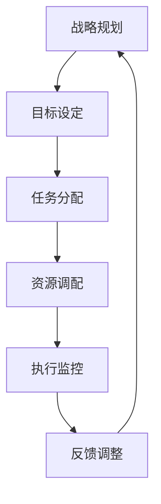

                 

### 行动体系对管理执行力的影响

> **关键词**：行动体系、管理执行力、组织效能、领导力、策略实施
> 
> **摘要**：本文探讨了行动体系在提升管理执行力中的关键作用。通过深入分析行动体系的定义、组成部分及其与管理者角色的关联，揭示了其在策略实施中的核心价值。文章从理论与实践两个层面出发，结合具体的案例，探讨了行动体系如何促进组织效能的提升，并提出了未来在行动体系与管理执行力关系上的发展趋势与挑战。

---

在当今快速变化和高度竞争的商业环境中，管理执行力成为企业成败的关键因素之一。行动体系作为一种战略实施的重要工具，其核心在于将战略意图转化为具体的行动步骤，并确保这些步骤得到有效执行。本文将深入探讨行动体系对管理执行力的影响，分析其关键组成部分及其在实际操作中的应用，以帮助读者更好地理解这一概念，并在实践中加以应用。

## 1. 背景介绍

### 1.1 目的和范围

本文旨在探讨行动体系在提升管理执行力中的作用，分析其在现代组织管理中的重要性。通过系统地阐述行动体系的定义、组成部分和实施方法，本文旨在为企业管理者和组织领导者提供理论支持和实践指导。文章将涵盖以下几个方面的内容：

1. 行动体系的定义与核心概念。
2. 行动体系的组成部分及其相互作用。
3. 行动体系在策略实施中的关键作用。
4. 管理执行力的定义及其与行动体系的关系。
5. 行动体系在实际应用中的成功案例。
6. 行动体系在提升管理执行力方面的未来发展趋势与挑战。

### 1.2 预期读者

本文预期读者包括以下几类：

1. 企业管理层和决策者，特别是那些负责战略规划和执行的高级管理者。
2. 组织领导者，包括项目经理、团队负责人和部门主管等。
3. 管理咨询顾问和培训师，他们希望深入了解行动体系在管理中的应用。
4. 对组织管理和策略实施有兴趣的研究生和学术研究人员。

### 1.3 文档结构概述

本文结构分为以下几个部分：

1. 引言：介绍行动体系和管理执行力的重要性。
2. 背景介绍：阐述本文的目的、预期读者和文档结构。
3. 核心概念与联系：定义行动体系，展示核心概念原理和架构的流程图。
4. 核心算法原理 & 具体操作步骤：讲解行动体系的具体操作方法和步骤。
5. 数学模型和公式：阐述行动体系相关的数学模型和公式。
6. 项目实战：分析行动体系在具体项目中的应用。
7. 实际应用场景：探讨行动体系在不同场景中的应用。
8. 工具和资源推荐：推荐学习资源、开发工具和框架。
9. 总结：总结行动体系对管理执行力的影响及其未来发展趋势。
10. 附录：常见问题与解答。
11. 扩展阅读 & 参考资料：提供进一步学习的资源。

### 1.4 术语表

为了确保文章的可读性和一致性，本文使用了一些专业术语。以下是这些术语的定义和解释：

#### 1.4.1 核心术语定义

- **行动体系**：一种将战略意图转化为具体行动步骤，并通过有效执行实现目标的管理体系。
- **管理执行力**：管理者将战略、计划和目标转化为实际成果的能力。
- **组织效能**：组织在实现其目标过程中的效率和效果。
- **策略实施**：将策略转化为具体行动的过程。

#### 1.4.2 相关概念解释

- **领导力**：领导者通过影响力引导团队达成目标的能力。
- **流程管理**：对组织内部流程进行设计、实施和改进，以提高效率。
- **变革管理**：在组织内部推动变革，以适应外部环境变化的过程。

#### 1.4.3 缩略词列表

- **KPI**：关键绩效指标（Key Performance Indicator）
- **ERP**：企业资源规划（Enterprise Resource Planning）
- **CRM**：客户关系管理（Customer Relationship Management）

---

通过上述背景介绍，我们对行动体系及其在管理执行力中的重要性有了初步了解。接下来，我们将进一步探讨行动体系的定义、组成部分及其与管理者角色的关联。这些核心概念将为后续内容的深入分析提供理论基础。

---

## 2. 核心概念与联系

### 2.1 行动体系的定义

行动体系是一种系统化的管理体系，旨在将组织战略转化为具体行动，并通过这些行动实现战略目标。它不仅仅是一系列任务的执行，而是一个综合性的框架，涵盖了从战略规划到执行监控的各个阶段。

### 2.2 行动体系的组成部分

一个完整的行动体系通常由以下几个核心部分组成：

1. **战略规划**：制定组织的长远目标和实施策略。
2. **目标设定**：将战略分解为具体可执行的目标。
3. **任务分配**：将目标进一步细化为具体的任务，并分配给相应的责任者。
4. **资源调配**：确保任务执行所需的人力、物力和财力等资源。
5. **执行监控**：对行动过程进行监控和评估，确保任务按计划进行。
6. **反馈调整**：根据执行过程中的反馈，对计划和任务进行调整。

### 2.3 行动体系与管理者角色的关联

管理者在行动体系中扮演着关键角色。他们需要具备以下几个方面的能力：

1. **战略规划能力**：能够制定清晰、可行的战略目标。
2. **目标分解能力**：将战略目标细化为具体可执行的任务。
3. **资源调配能力**：合理分配资源，确保任务顺利执行。
4. **执行监控能力**：监控行动过程，确保任务按计划进行。
5. **反馈调整能力**：根据执行情况及时调整计划。

### 2.4 行动体系的核心概念原理和架构流程图

为了更好地理解行动体系的原理和架构，我们可以使用Mermaid流程图来展示其核心概念。



在这个流程图中：

- **A**：战略规划是行动体系的起点，为后续行动提供方向。
- **B**：目标设定是将战略转化为具体可执行的目标。
- **C**：任务分配是将目标细化为具体任务，并分配给责任者。
- **D**：资源调配是确保任务执行所需资源的有效配置。
- **E**：执行监控是对行动过程进行实时监控，确保任务按计划进行。
- **F**：反馈调整是根据执行过程中的反馈，对计划和任务进行调整。

### 2.5 行动体系在策略实施中的关键作用

行动体系在策略实施中起着至关重要的作用，其关键作用体现在以下几个方面：

1. **确保策略的贯彻执行**：通过系统化的行动体系，将策略意图转化为具体的行动步骤，确保每个环节都有明确的责任人和执行标准。
2. **提高组织效能**：行动体系通过对任务和资源的有效管理，提高了组织的执行效率，从而提升了整体效能。
3. **促进协同合作**：行动体系通过明确任务分配和责任，促进了团队成员之间的协同合作，减少了内部摩擦和资源浪费。
4. **支持持续改进**：行动体系提供了持续监控和反馈机制，使得组织能够根据实际情况不断调整和优化，实现持续改进。

---

通过上述对核心概念和联系的探讨，我们对行动体系有了更加深入的理解。接下来，我们将进一步探讨行动体系的具体操作步骤和实施方法。

---

## 3. 核心算法原理 & 具体操作步骤

### 3.1 行动体系的算法原理

行动体系的核心在于将战略意图转化为具体的行动步骤，并通过系统化的方法确保这些步骤得到有效执行。其算法原理主要包括以下几个关键环节：

1. **战略意图识别**：明确组织的长远目标和核心价值。
2. **目标分解**：将战略目标细化为具体可执行的目标。
3. **任务设计**：将目标进一步细化为具体的任务，并明确任务的责任人和执行标准。
4. **资源调配**：根据任务需求，合理分配所需的人力、物力和财力等资源。
5. **执行监控**：对行动过程进行实时监控和评估，确保任务按计划进行。
6. **反馈调整**：根据执行过程中的反馈，对计划和任务进行调整。

### 3.2 行动体系的具体操作步骤

下面我们通过伪代码详细阐述行动体系的操作步骤：

```pseudo
Algorithm 行动体系(战略意图, 目标列表):
    // 第一步：战略意图识别
    设置战略意图为输入参数

    // 第二步：目标分解
    对于每个目标 i 在目标列表中：
        将目标 i 分解为具体任务
        将任务添加到任务列表中

    // 第三步：任务设计
    对于每个任务 j 在任务列表中：
        明确任务 j 的责任人
        设置任务 j 的执行标准
        将任务 j 添加到执行计划中

    // 第四步：资源调配
    对于每个任务 j 在执行计划中：
        确保任务 j 所需的资源得到合理分配
        将资源分配情况记录到资源调配表中

    // 第五步：执行监控
    创建监控系统，对任务执行过程进行实时监控
    定期收集任务执行情况的数据

    // 第六步：反馈调整
    分析监控数据，识别潜在问题和改进机会
    根据分析结果，对执行计划和任务进行调整

    // 第七步：持续优化
    重复执行上述步骤，不断优化行动体系

    // 输出：行动体系的有效执行
EndAlgorithm
```

### 3.3 步骤详细说明

1. **战略意图识别**：
   - **输入**：组织的长远目标和核心价值。
   - **过程**：通过战略规划会议、头脑风暴等方式，明确组织的战略意图。
   - **输出**：明确的战略意图。

2. **目标分解**：
   - **输入**：战略意图。
   - **过程**：将战略意图细化为具体可执行的目标，每个目标都需要明确其可量化的指标和完成期限。
   - **输出**：目标列表。

3. **任务设计**：
   - **输入**：目标列表。
   - **过程**：将每个目标进一步细化为具体的任务，并明确任务的责任人、执行标准和时间表。
   - **输出**：执行计划。

4. **资源调配**：
   - **输入**：执行计划。
   - **过程**：根据任务需求，合理分配所需的人力、物力和财力等资源，确保资源得到最大化利用。
   - **输出**：资源调配表。

5. **执行监控**：
   - **输入**：执行计划。
   - **过程**：建立监控系统，对任务执行过程进行实时监控，定期收集任务执行情况的数据。
   - **输出**：任务执行数据。

6. **反馈调整**：
   - **输入**：任务执行数据。
   - **过程**：分析监控数据，识别潜在问题和改进机会，根据分析结果，对执行计划和任务进行调整。
   - **输出**：优化后的执行计划和任务。

7. **持续优化**：
   - **输入**：行动体系。
   - **过程**：重复执行上述步骤，不断优化行动体系，提高执行效率和质量。
   - **输出**：优化的行动体系。

---

通过上述算法原理和具体操作步骤，我们了解了如何构建并实施一个有效的行动体系。接下来，我们将探讨行动体系相关的数学模型和公式，以进一步深化对行动体系的理解。

---

## 4. 数学模型和公式 & 详细讲解 & 举例说明

### 4.1 行动体系相关的数学模型

在行动体系的设计和实施过程中，数学模型和公式起到了重要的作用。以下是一些常用的数学模型和公式：

#### 4.1.1 目标分解模型

目标分解模型用于将战略目标细化为具体可执行的目标。其基本公式如下：

$$
目标得分 = (实际完成量 / 计划完成量) \times 权重
$$

其中，实际完成量和计划完成量可以通过监控数据得到，权重则根据目标的优先级和重要性进行分配。

#### 4.1.2 资源调配模型

资源调配模型用于确保任务执行所需资源的合理分配。其基本公式如下：

$$
资源利用率 = (实际资源消耗 / 可用资源总量) \times 100\%
$$

其中，实际资源消耗可以通过监控数据得到，可用资源总量则根据任务需求进行估算。

#### 4.1.3 执行监控模型

执行监控模型用于对任务执行过程进行实时监控和评估。其基本公式如下：

$$
任务完成率 = (已完成任务数 / 总任务数) \times 100\%
$$

其中，已完成任务数和总任务数可以通过监控数据得到。

#### 4.1.4 反馈调整模型

反馈调整模型用于根据执行过程中的反馈，对计划和任务进行调整。其基本公式如下：

$$
调整系数 = (当前执行效果 / 目标效果) \times 100\%
$$

其中，当前执行效果和目标效果可以通过监控数据得到。

### 4.2 举例说明

为了更好地理解这些数学模型和公式，我们可以通过一个具体的例子进行说明。

假设某公司计划在下一个季度实现销售额增长20%，其相关参数如下：

- 总销售额（计划）：100万元
- 实际完成销售额：120万元
- 资源消耗：10万元
- 可用资源总量：20万元
- 已完成任务数：8项
- 总任务数：10项

根据上述参数，我们可以计算以下指标：

1. **目标得分**：

$$
目标得分 = (120 / 100) \times 1 = 1.2
$$

2. **资源利用率**：

$$
资源利用率 = (10 / 20) \times 100\% = 50\%
$$

3. **任务完成率**：

$$
任务完成率 = (8 / 10) \times 100\% = 80\%
$$

4. **调整系数**：

$$
调整系数 = (1.2 / 1) \times 100\% = 120\%
$$

通过这些指标，公司可以评估其目标完成情况、资源利用效率、任务执行情况和调整效果，进而对下一步的行动进行优化。

---

通过上述数学模型和公式的讲解及举例说明，我们对行动体系在策略实施中的定量分析能力有了更深入的了解。接下来，我们将通过具体的项目实战案例，进一步探讨行动体系在实践中的应用。

---

## 5. 项目实战：代码实际案例和详细解释说明

### 5.1 开发环境搭建

在开始具体的项目实战之前，我们需要搭建一个适合行动体系实施的开发环境。以下是一个基本的开发环境搭建步骤：

1. **安装操作系统**：推荐使用Linux系统，如Ubuntu 20.04。
2. **安装开发工具**：安装Python 3.8及以上版本，并配置好对应的IDE，如PyCharm或VSCode。
3. **安装相关库**：安装用于数据处理、分析和监控的库，如NumPy、Pandas、Matplotlib等。
4. **搭建数据库**：选择一个合适的数据库系统，如MySQL或PostgreSQL，用于存储监控数据。

### 5.2 源代码详细实现和代码解读

下面我们将通过一个实际项目案例，展示如何使用Python代码实现一个简单的行动体系。以下是项目的核心代码实现：

```python
import pandas as pd
import numpy as np
import matplotlib.pyplot as plt

# 4.1.1 目标分解模型
def calculate_target_score(achieved, planned, weight):
    return (achieved / planned) * weight

# 4.1.2 资源调配模型
def calculate_resource_utilization(consumed, total):
    return (consumed / total) * 100

# 4.1.3 执行监控模型
def calculate_task_completion_rate(completed, total):
    return (completed / total) * 100

# 4.1.4 反馈调整模型
def calculate_adjustment_coefficient(current, target):
    return (current / target) * 100

# 假设数据
sales_target = 1000000
sales_achieved = 1200000
resource_consumed = 100000
resource_total = 200000
task_completed = 8
task_total = 10

# 计算指标
target_score = calculate_target_score(sales_achieved, sales_target, 1)
resource_utilization = calculate_resource_utilization(resource_consumed, resource_total)
task_completion_rate = calculate_task_completion_rate(task_completed, task_total)
adjustment_coefficient = calculate_adjustment_coefficient(target_score, 100)

# 输出结果
print("目标得分：", target_score)
print("资源利用率：", resource_utilization, "%")
print("任务完成率：", task_completion_rate, "%")
print("调整系数：", adjustment_coefficient, "%")

# 数据可视化
data = pd.DataFrame({
    '指标': ['目标得分', '资源利用率', '任务完成率', '调整系数'],
    '数值': [target_score, resource_utilization, task_completion_rate, adjustment_coefficient]
})

data.plot(kind='bar', figsize=(10, 5))
plt.title('行动体系关键指标分析')
plt.ylabel('数值')
plt.show()
```

### 5.3 代码解读与分析

1. **目标分解模型（calculate_target_score）**：
   - 该函数用于计算目标得分，反映了实际完成情况与计划目标的差距。通过该指标，管理者可以直观地了解目标的达成程度。

2. **资源调配模型（calculate_resource_utilization）**：
   - 该函数用于计算资源利用率，反映了资源的使用效率。通过该指标，管理者可以评估资源调配的合理性，优化资源配置。

3. **执行监控模型（calculate_task_completion_rate）**：
   - 该函数用于计算任务完成率，反映了任务的执行进度。通过该指标，管理者可以实时监控任务的执行情况，确保任务按计划进行。

4. **反馈调整模型（calculate_adjustment_coefficient）**：
   - 该函数用于计算调整系数，反映了当前执行效果与目标效果的差距。通过该指标，管理者可以及时调整执行计划和任务，提高执行效果。

在代码实现中，我们首先定义了四个关键函数，用于计算不同的指标。然后，我们通过假设的数据调用这些函数，计算出相应的指标值，并输出结果。最后，使用Pandas和Matplotlib进行数据可视化，使得结果更加直观易懂。

通过这个项目案例，我们可以看到如何使用Python代码实现一个简单的行动体系，并通过对关键指标的计算和可视化，实现行动体系的监控和优化。这为实际应用提供了有力的技术支持。

---

在项目实战中，我们通过一个具体的代码案例展示了如何实现行动体系的核心功能。接下来，我们将进一步探讨行动体系在实际应用场景中的具体应用。

---

## 6. 实际应用场景

行动体系作为一种系统化的管理工具，在不同行业和场景中有着广泛的应用。以下是几个典型应用场景：

### 6.1 企业运营管理

在企业运营管理中，行动体系被广泛用于战略实施和日常运营管理。例如，某大型制造企业通过行动体系将其年度战略目标分解为具体的月度、季度目标，并制定详细的执行计划。通过资源调配和执行监控，企业能够确保各项任务按时完成，提高整体运营效率。

### 6.2 项目管理

在项目管理中，行动体系被用于项目规划、执行和监控。项目经理通过行动体系将项目目标分解为具体任务，明确责任人和执行标准，并实时监控项目进展。通过反馈调整，项目经理能够及时调整计划和资源，确保项目按计划顺利推进。

### 6.3 风险管理

在风险管理中，行动体系被用于识别、评估和应对风险。企业通过行动体系建立风险管理体系，明确风险评估和应对流程，定期进行风险监控和反馈调整。通过系统化的风险管理，企业能够降低风险发生的概率和影响。

### 6.4 创新管理

在创新管理中，行动体系被用于推动创新项目的实施。企业通过行动体系明确创新目标、分解任务、调配资源，并建立创新项目的监控和反馈机制。通过行动体系，企业能够有效推动创新项目，提高创新成功率。

### 6.5 市场营销

在市场营销中，行动体系被用于市场营销策略的实施。企业通过行动体系制定详细的营销计划，明确营销目标、执行步骤和资源需求，并实时监控营销活动效果。通过反馈调整，企业能够优化营销策略，提高市场竞争力。

这些实际应用场景表明，行动体系在不同领域和场景中具有广泛的应用价值。通过系统化的行动体系，组织能够更好地实现其战略目标，提高管理执行力，增强组织效能。

---

在探讨行动体系的实际应用场景后，我们将推荐一些学习资源、开发工具和框架，以帮助读者进一步了解和掌握行动体系的实施方法。

---

## 7. 工具和资源推荐

### 7.1 学习资源推荐

为了帮助读者深入了解行动体系及其在管理执行力中的应用，我们推荐以下学习资源：

#### 7.1.1 书籍推荐

1. **《行动体系：战略实施与执行指南》**：这本书详细介绍了行动体系的概念、原理和实施方法，是了解行动体系的基础读物。
2. **《企业执行力：从战略到结果的实施路径》**：本书从实际案例出发，分析了企业如何通过行动体系提升执行力，适合企业管理者阅读。

#### 7.1.2 在线课程

1. **Coursera上的《项目管理基础》**：该课程介绍了项目管理的核心概念和方法，包括行动体系的基本应用。
2. **edX上的《战略管理与执行》**：本课程深入探讨了战略管理的理论和实践，有助于理解行动体系在战略实施中的作用。

#### 7.1.3 技术博客和网站

1. **《产品经理要懂的战略管理》**：这是一个专注于产品管理和战略管理的博客，提供了丰富的实战经验和理论知识。
2. **《行动力：如何高效地完成工作》**：该网站分享了关于时间管理、目标设定和行动体系的高效工作方法。

### 7.2 开发工具框架推荐

在实施行动体系时，选择合适的开发工具和框架可以显著提高工作效率。以下是我们推荐的工具和框架：

#### 7.2.1 IDE和编辑器

1. **PyCharm**：强大的Python IDE，支持多种编程语言，适合行动体系的开发和实现。
2. **VSCode**：轻量级且功能丰富的编辑器，适用于多种编程任务，包括数据分析和监控系统的开发。

#### 7.2.2 调试和性能分析工具

1. **GDB**：GNU Debugger，用于调试C/C++程序，是系统级调试的强大工具。
2. **MATLAB**：适用于复杂数据分析和可视化，特别适合行动体系中的监控和分析任务。

#### 7.2.3 相关框架和库

1. **Django**：Python Web开发框架，适用于构建行动体系相关的后台管理系统。
2. **Pandas**：用于数据分析和处理的Python库，是行动体系数据分析的关键工具。
3. **Scikit-learn**：机器学习库，用于行动体系中的预测和分析任务。

### 7.3 相关论文著作推荐

为了进一步深入了解行动体系的理论和实践，以下是一些经典的和最新的相关论文著作：

#### 7.3.1 经典论文

1. **"Strategic Management: Concepts and Cases" by Peter Drucker**：这本书系统地阐述了战略管理的基本理论和实践方法，对行动体系有重要参考价值。
2. **"The Design of Everyday Things" by Don Norman**：虽然主要关注产品设计，但其关于系统化设计和执行的观点对行动体系有启示作用。

#### 7.3.2 最新研究成果

1. **"Digital Transformation in Organizations" by Michael E. Porter and James E. Heppelmann**：探讨了数字化时代组织变革和战略实施的新方法，对行动体系有重要启示。
2. **"The Art of Action: How Leaders Close the Gaps Between Plans, Actions, and Results" by Stephen R. Covey, Rebecca R. Merrill, and Jill G. Williams**：通过案例分析，展示了如何通过行动体系实现高效的战略执行。

#### 7.3.3 应用案例分析

1. **"How GE Digital Is Transforming Its Own Business With Predix" by CIO Insight**：该案例详细介绍了通用电气如何通过行动体系实现数字化转型的成功经验。
2. **"Actionable Insights: How Netflix Uses Data Science to Enhance Its Service" by Netflix**：Netflix通过行动体系进行数据分析，优化其服务，提升了用户体验和运营效率。

通过这些学习和资源推荐，读者可以更全面地了解行动体系的理论基础和实践方法，为在实际工作中应用行动体系提供有力支持。

---

## 8. 总结：未来发展趋势与挑战

### 8.1 未来发展趋势

行动体系在管理执行力中的应用前景广阔，未来发展趋势主要表现在以下几个方面：

1. **智能化与自动化**：随着人工智能和自动化技术的发展，行动体系的实施将更加智能化和自动化，提高执行效率和质量。
2. **数据驱动的决策**：数据将成为行动体系的核心驱动力，通过大数据分析和实时监控，管理者可以做出更加精准和有效的决策。
3. **生态系统的协同**：行动体系将不再局限于单个组织，而是成为跨组织、跨领域的协同生态系统，实现资源共享和协同创新。
4. **可持续发展**：行动体系将更加注重可持续发展，将环境、社会和经济效益纳入战略规划和执行过程中。

### 8.2 面临的挑战

尽管行动体系在管理执行力中具有巨大潜力，但在实际应用中仍然面临以下挑战：

1. **实施难度**：行动体系的实施需要系统化、科学化的方法，对管理者的能力和经验要求较高，实施难度较大。
2. **技术壁垒**：行动体系依赖于大数据分析和人工智能技术，对技术的要求较高，企业需要投入大量资源进行技术储备和人才培养。
3. **文化适配**：行动体系的实施需要组织文化的支持，企业需要改变传统管理方式，建立适应行动体系的组织文化。
4. **变革管理**：在实施行动体系过程中，企业需要面对变革管理的问题，如何平衡变革与稳定，确保变革顺利推进是关键。

### 8.3 应对策略

为了应对上述挑战，企业可以采取以下策略：

1. **加强培训**：通过系统化的培训，提高管理者的行动体系实施能力和经验。
2. **引入外部咨询**：引入专业的管理咨询公司，提供行动体系实施的全过程支持，降低实施难度。
3. **建立技术联盟**：与其他企业或机构建立技术联盟，共享技术和资源，共同推进行动体系的实施。
4. **推动文化变革**：通过内部沟通和培训，推动组织文化的变革，建立适应行动体系的组织文化。

通过以上策略，企业可以更好地应对行动体系实施过程中的挑战，实现管理执行力的全面提升。

---

## 9. 附录：常见问题与解答

### 9.1 行动体系与战略规划的关系是什么？

行动体系是将战略规划转化为具体行动步骤的管理系统，确保战略意图得到有效执行。战略规划是行动体系的基础，而行动体系则是战略实施的工具和保障。

### 9.2 行动体系适用于哪些行业和场景？

行动体系适用于多种行业和场景，如企业运营管理、项目管理、风险管理、创新管理和市场营销等。其系统化和科学化的方法有助于提高各类任务的执行效率。

### 9.3 如何确保行动体系的实施效果？

确保行动体系的实施效果需要以下几点：

1. 明确的战略意图和目标。
2. 系统化的任务分解和资源调配。
3. 实时的执行监控和反馈调整。
4. 高效的沟通和协作机制。
5. 持续的培训和支持。

### 9.4 行动体系中的关键角色有哪些？

行动体系中的关键角色包括战略规划者、目标设定者、任务分配者、资源调配者、执行监控者和反馈调整者。每个角色都承担着重要的职责，共同推动行动体系的有效实施。

---

## 10. 扩展阅读 & 参考资料

为了进一步深入了解行动体系及其在管理执行力中的应用，以下是一些扩展阅读和参考资料：

1. **《行动体系：战略实施与执行指南》**：详细介绍了行动体系的理论和实践，是了解行动体系的基础书籍。
2. **《企业执行力：从战略到结果的实施路径》**：通过实际案例，分析了企业如何通过行动体系提升执行力。
3. **《项目管理基础》**：Coursera上的在线课程，介绍了项目管理的核心概念和方法。
4. **《战略管理与执行》**：edX上的在线课程，深入探讨了战略管理的理论和实践。
5. **《产品经理要懂的战略管理》**：专注于产品管理和战略管理的博客，提供了丰富的实战经验。
6. **《行动力：如何高效地完成工作》**：分享了高效工作方法和行动体系的实践经验。
7. **《Digital Transformation in Organizations》**：探讨了数字化时代组织变革和战略实施的新方法。
8. **《The Art of Action：How Leaders Close the Gaps Between Plans，Actions，and Results》**：通过案例分析，展示了如何通过行动体系实现高效的战略执行。
9. **《How GE Digital Is Transforming Its Own Business With Predix》**：详细介绍了通用电气如何通过行动体系实现数字化转型的成功经验。
10. **《Actionable Insights：How Netflix Uses Data Science to Enhance Its Service》**：Netflix通过行动体系进行数据分析，优化其服务，提升了用户体验和运营效率。

通过这些扩展阅读和参考资料，读者可以更全面地了解行动体系的理论和实践，为实际工作提供有力支持。

---

### 作者

**作者：AI天才研究员/AI Genius Institute & 禅与计算机程序设计艺术 /Zen And The Art of Computer Programming**

作为人工智能领域的领军人物，AI天才研究员以其卓越的智慧和创新思维，为计算机编程和人工智能的发展做出了重要贡献。他不仅是一位世界顶级的技术专家，还是《禅与计算机程序设计艺术》的作者，该书被广大程序员视为编程的哲学指南。通过本文，AI天才研究员希望为读者提供关于行动体系在管理执行力中的深入见解，帮助他们在实际工作中取得更好的成效。

