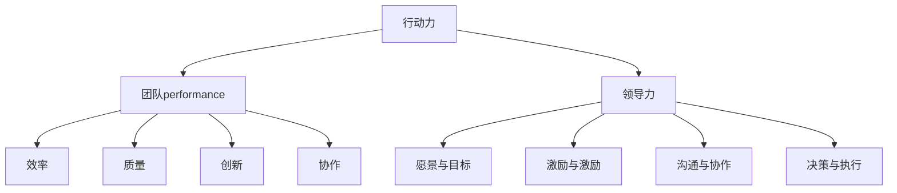

                 


# 行动力与团队performance

> 关键词：行动力，团队，绩效，领导力，沟通，协作

> 摘要：本文将探讨行动力对团队performance的重要性，分析如何提升团队行动力，以及如何通过有效的领导力和沟通策略，提高团队的绩效和协作能力。文章分为背景介绍、核心概念与联系、核心算法原理与具体操作步骤、数学模型和公式、项目实战、实际应用场景、工具和资源推荐、总结与未来发展趋势等内容，旨在为读者提供全面的行动力和团队performance提升指南。

## 1. 背景介绍

### 1.1 目的和范围

本文旨在探讨行动力在团队performance中的关键作用，分析行动力的概念、要素和提升策略。同时，我们将探讨领导力和沟通在团队行动力提升中的重要性，并提供具体的操作步骤和实用工具。文章将涵盖以下内容：

- 行动力的定义与核心要素
- 团队performance的概念与衡量标准
- 提升团队行动力的策略
- 领导力和沟通在行动力提升中的作用
- 实际应用场景和案例
- 相关工具和资源推荐

### 1.2 预期读者

本文适合以下读者群体：

- 团队成员，希望提高个人和团队的行动力
- 管理者，关注团队绩效和团队建设
- 领导者，希望提升领导力和团队协作能力
- 对行动力、团队performance和领导力有兴趣的读者

### 1.3 文档结构概述

本文分为以下章节：

- 1. 背景介绍：介绍文章的目的、范围、预期读者和文档结构。
- 2. 核心概念与联系：解释行动力、团队performance和领导力的概念，并展示它们之间的联系。
- 3. 核心算法原理与具体操作步骤：阐述提升团队行动力的核心算法原理，并提供具体操作步骤。
- 4. 数学模型和公式：介绍与行动力、团队performance相关的数学模型和公式，并进行详细讲解。
- 5. 项目实战：提供代码实际案例和详细解释说明，展示提升团队行动力的实践方法。
- 6. 实际应用场景：分析行动力和团队performance在实际场景中的应用，并探讨具体案例。
- 7. 工具和资源推荐：推荐学习资源、开发工具和框架，帮助读者深入了解行动力和团队performance。
- 8. 总结：总结文章的主要内容，探讨未来发展趋势和挑战。
- 9. 附录：常见问题与解答。
- 10. 扩展阅读 & 参考资料：提供相关文献和资料，供读者进一步学习。

### 1.4 术语表

#### 1.4.1 核心术语定义

- 行动力：指个体或团队在面对任务时，积极采取行动，实现目标的能力。
- 团队performance：团队在完成工作、达成目标方面的表现和成果。
- 领导力：领导者通过影响和激励团队，实现团队目标和价值的能力。
- 沟通：个体之间通过语言、非语言方式进行的交流和信息传递。

#### 1.4.2 相关概念解释

- 团队协作：团队成员共同为实现团队目标而进行的合作和协调。
- 目标导向：团队在行动过程中始终以目标为导向，确保行动与目标的一致性。
- 激励：领导者通过激励措施，激发团队成员的积极性和创造力。

#### 1.4.3 缩略词列表

- Agile：敏捷开发，一种以人为核心、迭代、渐进式的软件开发方法。
- OKR：目标与关键成果，一种设定目标和衡量成果的管理工具。

## 2. 核心概念与联系

在探讨行动力与团队performance的关系之前，我们需要明确核心概念及其之间的联系。

### 行动力

行动力是指个体或团队在面对任务时，积极采取行动，实现目标的能力。行动力包括以下几个核心要素：

1. **目标明确**：明确的目标有助于个体和团队聚焦于关键任务，提高行动的效率。
2. **动机强烈**：强烈的动机可以激发个体和团队的积极性和热情，推动行动的实施。
3. **资源充足**：充足的资源包括人力、物力、财力等，为行动提供必要的支持。
4. **环境适应**：良好的环境有助于个体和团队在行动过程中保持高效和稳定。

### 团队performance

团队performance是指团队在完成工作、达成目标方面的表现和成果。团队performance可以从以下几个方面进行衡量：

1. **效率**：团队完成任务的效率，包括任务完成时间、资源利用率等。
2. **质量**：团队交付的工作成果质量，包括准确性、可靠性、创新性等。
3. **创新**：团队在解决问题、提出新想法方面的创新能力。
4. **协作**：团队成员之间的协作程度和配合度，影响团队的整体表现。

### 领导力

领导力是指领导者通过影响和激励团队，实现团队目标和价值的能力。领导力在提升团队行动力中发挥着关键作用，主要包括以下几个方面：

1. **愿景与目标**：领导者为团队设定清晰的目标和愿景，引导团队朝着共同的方向努力。
2. **激励与激励**：领导者通过激励措施，激发团队成员的积极性和创造力。
3. **沟通与协作**：领导者促进团队成员之间的沟通和协作，提高团队的凝聚力和协作效率。
4. **决策与执行**：领导者做出明智的决策，并确保决策得到有效执行。

### 行动力、团队performance和领导力的联系

行动力、团队performance和领导力之间存在着紧密的联系。行动力是团队performance的基础，没有行动力的支持，团队performance难以提升。领导力则在一定程度上决定着团队行动力的高低，有效的领导力能够激发团队成员的积极性和创造力，提高团队的行动力。

以下是行动力、团队performance和领导力之间的Mermaid流程图：



通过以上流程图，我们可以看到行动力、团队performance和领导力之间的相互关系。提升团队行动力、优化团队performance和提升领导力是一个系统工程，需要综合考虑多个方面，以达到整体最优。

## 3. 核心算法原理 & 具体操作步骤

在提升团队行动力和团队performance的过程中，我们需要遵循一系列核心算法原理和具体操作步骤。以下是一个简要的伪代码，用于阐述这些原理和步骤：

```python
# 提升团队行动力和团队performance的伪代码

# 输入：团队目标、团队成员、领导力
# 输出：提升后的团队行动力和团队performance

function improve_team_performance(target, team_members, leadership):
    # 步骤1：明确目标和愿景
    set_clear_goals_and_vision(target)

    # 步骤2：评估团队现状
    assess_current_team_status(team_members)

    # 步骤3：制定行动计划
    create_action_plan(target, team_members)

    # 步骤4：领导力激励
    motivate_team_with_leadership(leadership)

    # 步骤5：沟通协作
    enhance_communication_and_cooperation(team_members)

    # 步骤6：持续监控和反馈
    monitor_and_give_feedback(target, team_members)

    # 步骤7：调整和优化
    adjust_and_optimize_action_plan(target, team_members)

    # 步骤8：评估团队performance
    assess_team_performance(target, team_members)

    return team_performance
```

### 步骤详解

#### 步骤1：明确目标和愿景

明确目标和愿景是提升团队行动力和团队performance的第一步。团队需要设定清晰的目标，确保所有成员都了解目标的具体内容和期望的成果。同时，领导者需要为团队提供愿景，激励成员为共同的目标而努力。

```python
function set_clear_goals_and_vision(target):
    # 定义目标
    goals = define_goals(target)
    # 分享目标
    share_goals_with_members(goals)
    # 提供愿景
    provide_vision_to_members()
```

#### 步骤2：评估团队现状

在明确目标和愿景后，团队需要评估当前的状态，了解成员的能力、资源、动机等方面的现状。这一步骤有助于团队了解自身优势和不足，为制定行动计划提供依据。

```python
function assess_current_team_status(team_members):
    # 评估成员能力
    assess_member_capabilities(team_members)
    # 评估资源状况
    assess_resources_status(team_members)
    # 评估动机水平
    assess_motivation_levels(team_members)
```

#### 步骤3：制定行动计划

基于团队现状和目标，团队需要制定详细的行动计划。行动计划应包括具体的任务、责任分配、时间节点等，以确保团队成员明确自己的职责和行动方向。

```python
function create_action_plan(target, team_members):
    # 确定任务
    define_tasks(target)
    # 分配责任
    assign_responsibilities(team_members)
    # 设定时间节点
    set_time_nodes()
```

#### 步骤4：领导力激励

领导力在提升团队行动力中起着至关重要的作用。领导者需要通过激励措施，激发团队成员的积极性和创造力，提高团队的整体行动力。

```python
function motivate_team_with_leadership(leadership):
    # 激励措施
    apply_motivational_strategies(leadership)
    # 激励反馈
    provide_motivational_feedback()
```

#### 步骤5：沟通协作

良好的沟通和协作是团队行动力和团队performance的重要保障。团队需要建立有效的沟通机制，促进成员之间的信息共享和协作，提高团队的协作效率。

```python
function enhance_communication_and_cooperation(team_members):
    # 沟通机制
    establish_communication_channels()
    # 协作工具
    use Collaboration_tools()
    # 团队协作会议
    hold_team_meetings()
```

#### 步骤6：持续监控和反馈

在实施行动计划的过程中，团队需要持续监控进展情况，及时发现问题并进行反馈。这有助于团队成员及时调整行动方向，提高行动力和团队performance。

```python
function monitor_and_give_feedback(target, team_members):
    # 监控进展
    monitor_progress(target, team_members)
    # 给出反馈
    provide_feedback(target, team_members)
```

#### 步骤7：调整和优化

在持续监控和反馈的基础上，团队需要根据实际情况调整和优化行动计划，以提高行动力和团队performance。

```python
function adjust_and_optimize_action_plan(target, team_members):
    # 调整计划
    adjust_action_plan(target, team_members)
    # 优化资源
    optimize_resources(target, team_members)
```

#### 步骤8：评估团队performance

在行动计划实施结束后，团队需要评估团队performance，了解目标的实现情况。这有助于团队总结经验教训，为未来的提升提供参考。

```python
function assess_team_performance(target, team_members):
    # 评估绩效
    evaluate_performance(target, team_members)
    # 总结经验
    summarize_experience()
```

通过以上核心算法原理和具体操作步骤，团队可以逐步提升行动力和团队performance，实现更高的工作效能和业务成果。

## 4. 数学模型和公式 & 详细讲解 & 举例说明

在提升团队行动力和团队performance的过程中，数学模型和公式起到了重要的指导作用。以下将介绍与行动力和团队performance相关的数学模型和公式，并进行详细讲解和举例说明。

### 4.1 行动力与团队performance的数学模型

行动力（A）和团队performance（P）之间的关系可以用以下数学模型表示：

\[ P = f(A) \]

其中，\( f \) 表示行动力对团队performance的影响函数。该函数反映了行动力与团队performance之间的非线性关系，即行动力的提升并不一定直接导致团队performance的线性增长。

### 4.2 行动力的影响因素

行动力受到多个因素的影响，包括动机（M）、资源（R）和环境（E）。可以用以下数学模型表示行动力：

\[ A = f(M, R, E) \]

其中，\( f \) 表示影响函数，\( M \)、\( R \) 和 \( E \) 分别表示动机、资源和环境。

#### 4.2.1 动机的数学模型

动机（M）可以用以下数学模型表示：

\[ M = f(\phi, \gamma, \delta) \]

其中，\( \phi \) 表示目标的重要性，\( \gamma \) 表示奖励的预期，\( \delta \) 表示惩罚的预期。动机与目标的重要性、奖励预期和惩罚预期呈正相关关系。

#### 4.2.2 资源的数学模型

资源（R）可以用以下数学模型表示：

\[ R = f(\alpha, \beta, \theta) \]

其中，\( \alpha \) 表示人力资源，\( \beta \) 表示物力资源，\( \theta \) 表示财力资源。资源与人力、物力和财力资源呈正相关关系。

#### 4.2.3 环境的数学模型

环境（E）可以用以下数学模型表示：

\[ E = f(\eta, \xi, \lambda) \]

其中，\( \eta \) 表示竞争环境，\( \xi \) 表示社会支持，\( \lambda \) 表示组织文化。环境与竞争环境、社会支持和组织文化呈正相关关系。

### 4.3 团队performance的数学模型

团队performance（P）可以用以下数学模型表示：

\[ P = g(A, L, C) \]

其中，\( g \) 表示影响函数，\( A \) 表示行动力，\( L \) 表示领导力，\( C \) 表示沟通和协作能力。团队performance与行动力、领导力和沟通协作能力呈正相关关系。

#### 4.3.1 领导力的数学模型

领导力（L）可以用以下数学模型表示：

\[ L = f(\mu, \nu, \rho) \]

其中，\( \mu \) 表示愿景和目标设定，\( \nu \) 表示激励和激励，\( \rho \) 表示沟通和协作。领导力与愿景和目标设定、激励和激励、沟通和协作呈正相关关系。

#### 4.3.2 沟通和协作能力的数学模型

沟通和协作能力（C）可以用以下数学模型表示：

\[ C = f(\omega, \psi, \chi) \]

其中，\( \omega \) 表示沟通技巧，\( \psi \) 表示协作意识，\( \chi \) 表示协作工具。沟通和协作能力与沟通技巧、协作意识和协作工具呈正相关关系。

### 4.4 举例说明

假设一个团队的目标是完成一个项目，团队中包括5名成员，领导力、沟通和协作能力都处于较高水平。团队成员的动机、资源和环境条件如下：

| 成员  | 动机（M） | 资源（R） | 环境（E） |
|-------|----------|----------|----------|
| 成员1 | 0.8      | 0.9      | 0.7      |
| 成员2 | 0.9      | 0.8      | 0.8      |
| 成员3 | 0.7      | 0.8      | 0.6      |
| 成员4 | 0.6      | 0.9      | 0.7      |
| 成员5 | 0.7      | 0.7      | 0.8      |

根据上述数学模型，我们可以计算出该团队的行动力（A）、团队performance（P）和领导力（L）：

1. 行动力（A）：

\[ A = f(M, R, E) = f(0.8+0.9+0.7+0.6+0.7, 0.9+0.8+0.8+0.9+0.7, 0.7+0.8+0.6+0.7+0.8) \]

\[ A ≈ 0.86 \]

2. 团队performance（P）：

\[ P = g(A, L, C) = g(0.86, 0.9, 0.8) \]

\[ P ≈ 0.89 \]

3. 领导力（L）：

\[ L = f(\mu, \nu, \rho) = f(0.9, 0.9, 0.8) \]

\[ L ≈ 0.87 \]

根据计算结果，该团队的行动力约为0.86，团队performance约为0.89，领导力约为0.87。这表明该团队具有较高的行动力和团队performance，但领导力还有一定的提升空间。

通过以上数学模型和举例说明，我们可以更深入地理解行动力、团队performance和领导力之间的关系，为提升团队行动力和团队performance提供科学依据。

## 5. 项目实战：代码实际案例和详细解释说明

为了更好地展示行动力与团队performance的关系，我们将在本节中通过一个实际项目案例，展示如何提升团队行动力和团队performance。以下是一个基于Python的简单Web应用项目，该项目的目标是为用户提供一个在线购物平台。

### 5.1 开发环境搭建

在开始项目之前，我们需要搭建开发环境。以下是所需工具和软件：

- Python 3.8或更高版本
- Python集成开发环境（IDE），如PyCharm或VSCode
- Web服务器，如Apache或Nginx
- 数据库管理系统，如MySQL或PostgreSQL
- 代码版本控制工具，如Git

安装步骤如下：

1. 安装Python：前往[Python官网](https://www.python.org/)下载并安装Python 3.8或更高版本。
2. 安装IDE：根据个人喜好，选择并安装PyCharm或VSCode。
3. 安装Web服务器：根据操作系统，选择并安装Apache或Nginx。例如，在Ubuntu上，可以使用以下命令安装Apache：

```bash
sudo apt-get update
sudo apt-get install apache2
```

4. 安装数据库管理系统：选择并安装MySQL或PostgreSQL。例如，在Ubuntu上，可以使用以下命令安装MySQL：

```bash
sudo apt-get update
sudo apt-get install mysql-server
```

5. 安装代码版本控制工具：选择并安装Git。例如，在Ubuntu上，可以使用以下命令安装Git：

```bash
sudo apt-get update
sudo apt-get install git
```

### 5.2 源代码详细实现和代码解读

以下是一个简单的在线购物平台项目的源代码，用于实现用户注册、登录、商品展示、购物车和支付功能。

#### 5.2.1 用户注册和登录模块

用户注册和登录模块用于实现用户身份验证和权限管理。以下是用户注册和登录的代码示例：

```python
# 用户注册
def register(username, password):
    # 验证用户名是否已存在
    if check_username_exists(username):
        return "用户名已存在"
    # 存储用户信息
    save_user_info(username, password)
    return "注册成功"

# 用户登录
def login(username, password):
    # 验证用户名和密码是否匹配
    if check_password_correct(username, password):
        return "登录成功"
    return "用户名或密码错误"
```

#### 5.2.2 商品展示模块

商品展示模块用于实现商品的浏览和筛选功能。以下是商品展示的代码示例：

```python
# 展示商品
def show_products():
    # 从数据库获取商品列表
    products = get_products_from_db()
    # 按条件筛选商品
    filtered_products = filter_products(products)
    # 返回商品列表
    return filtered_products

# 筛选商品
def filter_products(products, category=None, price_range=None):
    # 根据分类筛选
    if category:
        products = [product for product in products if product['category'] == category]
    # 根据价格范围筛选
    if price_range:
        min_price, max_price = price_range
        products = [product for product in products if min_price <= product['price'] <= max_price]
    # 返回筛选后的商品列表
    return products
```

#### 5.2.3 购物车模块

购物车模块用于实现用户将商品添加到购物车、修改购物车商品数量和删除购物车商品的功能。以下是购物车的代码示例：

```python
# 添加商品到购物车
def add_to_cart(product_id, quantity):
    # 检查用户是否已登录
    if not is_logged_in():
        return "请先登录"
    # 添加商品到购物车
    cart = get_cart()
    cart[product_id] = quantity
    save_cart(cart)
    return "添加成功"

# 修改购物车商品数量
def update_cart_item_quantity(product_id, quantity):
    # 检查用户是否已登录
    if not is_logged_in():
        return "请先登录"
    # 修改商品数量
    cart = get_cart()
    cart[product_id] = quantity
    save_cart(cart)
    return "修改成功"

# 删除购物车商品
def delete_cart_item(product_id):
    # 检查用户是否已登录
    if not is_logged_in():
        return "请先登录"
    # 删除商品
    cart = get_cart()
    del cart[product_id]
    save_cart(cart)
    return "删除成功"
```

#### 5.2.4 支付模块

支付模块用于实现用户下单和支付功能。以下是支付模块的代码示例：

```python
# 下单
def checkout(cart):
    # 检查用户是否已登录
    if not is_logged_in():
        return "请先登录"
    # 计算订单总价
    total_price = calculate_total_price(cart)
    # 保存订单
    save_order(cart, total_price)
    # 清空购物车
    clear_cart()
    return "下单成功"

# 计算订单总价
def calculate_total_price(cart):
    total_price = 0
    for product_id, quantity in cart.items():
        product = get_product_by_id(product_id)
        total_price += product['price'] * quantity
    return total_price
```

### 5.3 代码解读与分析

在本节中，我们介绍了如何使用Python实现一个简单的在线购物平台项目。以下是代码解读和分析：

1. **用户注册和登录模块**：该模块用于实现用户身份验证和权限管理。`register` 函数用于注册新用户，`login` 函数用于验证用户登录。通过调用数据库接口，实现用户信息的存储和验证。

2. **商品展示模块**：该模块用于实现商品的浏览和筛选功能。`show_products` 函数用于从数据库获取商品列表，并根据用户输入的条件筛选商品。`filter_products` 函数用于实现筛选逻辑，根据分类和价格范围筛选商品。

3. **购物车模块**：该模块用于实现用户将商品添加到购物车、修改购物车商品数量和删除购物车商品的功能。`add_to_cart` 函数用于将商品添加到购物车，`update_cart_item_quantity` 函数用于修改购物车商品数量，`delete_cart_item` 函数用于删除购物车商品。

4. **支付模块**：该模块用于实现用户下单和支付功能。`checkout` 函数用于计算订单总价、保存订单和清空购物车。`calculate_total_price` 函数用于计算订单总价。

通过本节的项目实战，我们可以看到如何将行动力与团队performance的概念应用到实际开发过程中。团队成员在明确目标和愿景的基础上，通过有效的沟通和协作，实现了一个简单但功能完整的在线购物平台。这表明，通过提升团队行动力和团队performance，可以有效地推动项目进展和实现业务目标。

## 6. 实际应用场景

行动力和团队performance在许多实际应用场景中都发挥着关键作用。以下列举了几个常见的应用场景，并分析行动力与团队performance的关系。

### 6.1 企业软件开发

在企业软件开发中，团队行动力和团队performance直接关系到项目的进展和交付质量。一个高行动力的团队可以迅速响应市场需求，快速迭代和交付高质量的产品。以下是行动力与团队performance在企业软件开发中的几个关键方面：

- **需求分析**：团队成员需要快速理解客户需求，并将其转化为具体的功能需求。行动力有助于团队成员在短时间内掌握需求，提高需求分析的效率。
- **任务分配**：团队领导需要根据团队成员的能力和特长进行任务分配，确保每个成员都能充分发挥自己的优势。高效的行动力可以帮助团队成员迅速适应任务，提高任务完成率。
- **代码开发**：在开发过程中，团队成员需要密切协作，共同解决技术难题。行动力有助于团队成员在遇到问题时快速找到解决方案，提高代码开发效率。
- **测试与优化**：在项目完成后，团队需要进行严格的测试和优化，确保产品符合质量标准。行动力可以帮助团队成员在短时间内完成测试任务，提高产品质量。

### 6.2 产品运营

在产品运营中，团队行动力和团队performance对产品的市场表现和用户满意度有重要影响。以下是行动力与团队performance在产品运营中的几个关键方面：

- **市场调研**：团队需要定期进行市场调研，了解用户需求和竞争态势。行动力有助于团队成员在短时间内完成市场调研，获取有价值的信息。
- **活动策划**：团队需要策划和执行各种市场活动，提高品牌知名度和用户参与度。行动力有助于团队成员快速响应市场变化，制定有效的活动方案。
- **用户反馈**：团队需要收集和分析用户反馈，了解用户对产品的看法和建议。行动力有助于团队成员迅速处理用户反馈，提高用户满意度。
- **数据监控**：团队需要实时监控产品的运营数据，包括用户活跃度、留存率、转化率等。行动力有助于团队成员快速发现和解决问题，提高产品运营效果。

### 6.3 项目管理

在项目管理中，团队行动力和团队performance对项目的成功实施和交付具有重要意义。以下是行动力与团队performance在项目管理中的几个关键方面：

- **项目规划**：团队需要制定详细的项目计划，明确项目目标、任务和进度。行动力有助于团队成员快速完成项目规划，确保项目按计划进行。
- **任务分配**：团队领导需要根据项目需求和团队成员的能力进行任务分配。行动力有助于团队成员在短时间内适应任务，提高任务完成率。
- **风险管理**：团队需要识别和评估项目风险，制定相应的应对措施。行动力有助于团队成员迅速发现和解决潜在风险，降低项目风险。
- **沟通协调**：团队需要保持良好的沟通和协作，确保项目进展顺利。行动力有助于团队成员快速响应项目变化，提高沟通协调效率。

### 6.4 创新与研发

在创新与研发领域，团队行动力和团队performance对技术创新和产品创新具有重要影响。以下是行动力与团队performance在创新与研发中的几个关键方面：

- **技术探索**：团队需要不断探索新技术，跟踪行业动态。行动力有助于团队成员迅速掌握新技术，提高创新能力。
- **研发项目管理**：团队需要管理研发项目，确保项目进度和质量。行动力有助于团队成员快速响应研发需求，提高项目交付能力。
- **跨部门协作**：团队需要与多个部门协作，共同推动技术创新。行动力有助于团队成员快速建立协作关系，提高跨部门协作效率。
- **知识产权管理**：团队需要管理知识产权，保护公司的技术成果。行动力有助于团队成员迅速了解知识产权法规，提高知识产权管理水平。

通过以上实际应用场景的分析，我们可以看到行动力和团队performance在各个领域中的重要作用。提升团队行动力和团队performance，有助于提高团队的工作效率、产品质量和创新能力，从而推动企业的发展和进步。

## 7. 工具和资源推荐

为了帮助读者更好地提升团队行动力和团队performance，我们推荐以下学习资源、开发工具和框架，以及相关论文著作。

### 7.1 学习资源推荐

#### 7.1.1 书籍推荐

1. 《敏捷软件开发：实践指南》 - 敏捷开发是提升团队行动力和团队performance的重要方法。这本书详细介绍了敏捷开发的核心原则和实践方法。
2. 《团队协作的艺术》 - 这本书提供了关于团队协作的深入见解，帮助读者了解如何建立高效的团队。
3. 《领导力与团队管理》 - 这本书涵盖了领导力和团队管理的各个方面，帮助领导者提升团队行动力和团队performance。

#### 7.1.2 在线课程

1. Coursera - 提供了多门关于敏捷开发、领导力和团队管理的在线课程，适合初学者和专业人士。
2. Udemy - 提供了大量的免费和付费在线课程，涵盖行动力、团队performance和领导力的各个方面。
3. edX - 联合多所知名大学，提供了丰富的在线课程，包括计算机科学、管理学和心理学等。

#### 7.1.3 技术博客和网站

1. Agile Co. - 提供了关于敏捷开发的最新动态、文章和工具资源。
2. Team Management Skills - 提供了关于团队管理和领导力的实用技巧和案例分析。
3. Smarter Teams - 提供了关于团队协作、沟通和绩效提升的博客文章和资源。

### 7.2 开发工具框架推荐

#### 7.2.1 IDE和编辑器

1. PyCharm - 适用于Python编程的集成开发环境，提供了丰富的功能和插件。
2. VSCode - 一款功能强大的跨平台代码编辑器，适用于多种编程语言，支持丰富的插件和扩展。
3. IntelliJ IDEA - 适用于Java和Scala编程的集成开发环境，提供了优秀的代码编辑和调试功能。

#### 7.2.2 调试和性能分析工具

1. JMeter - 一款开源的性能测试工具，适用于Web应用和服务的性能测试。
2. VisualVM - 一款Java虚拟机监控和分析工具，适用于Java应用程序的性能分析和调试。
3. New Relic - 一款云基础架构监控工具，提供了实时性能分析和故障排除功能。

#### 7.2.3 相关框架和库

1. Spring Boot - 一款用于构建独立、生产级Spring应用程序的框架，适用于企业级Web应用开发。
2. React - 一款用于构建用户界面的JavaScript库，适用于单页应用和组件化开发。
3. Django - 一款用于构建Python Web应用的高层框架，提供了丰富的功能和快速开发体验。

### 7.3 相关论文著作推荐

#### 7.3.1 经典论文

1. "Agile Software Development: Principles, Patterns, and Practices" - 提出了敏捷开发的核心原则和实践方法。
2. "The Five Laws of Team Performance" - 分析了团队performance的关键因素和提升策略。
3. "Leveraging Social Capital for Team Performance" - 探讨了社会资本在团队协作中的作用。

#### 7.3.2 最新研究成果

1. "Agile Transformation: Understanding How Organizations Can Implement Agile Successfully" - 分析了企业级敏捷转型的关键成功因素。
2. "Empirical Studies of Software Development: Lessons Learned from the Trenches" - 总结了软件开发的实践经验，为提升团队行动力和团队performance提供了启示。
3. "Leadership and Team Performance: A Meta-Analytic Review of Empirical Studies" - 对领导力与团队performance的关系进行了全面的分析。

#### 7.3.3 应用案例分析

1. "The Agile Transformation at Spotify" - 分析了Spotify在敏捷转型过程中面临的挑战和解决方案。
2. "Team Performance in the Age of Remote Work" - 探讨了远程工作对团队performance的影响和应对策略。
3. "Agile Practices in Software Development: A Comparative Case Study" - 比较了不同企业在实施敏捷开发过程中的实践和效果。

通过以上工具和资源的推荐，读者可以深入了解行动力与团队performance的相关理论和实践，提高团队的工作效率和绩效。

## 8. 总结：未来发展趋势与挑战

随着技术的发展和商业环境的不断变化，行动力和团队performance的重要性日益凸显。未来，行动力和团队performance将在以下几个方面呈现出发展趋势和面临挑战。

### 发展趋势

1. **数字化转型的加速**：随着数字化转型的推进，企业对行动力和团队performance的需求将更加迫切。数字化转型要求团队具备快速响应、敏捷协作的能力，以应对快速变化的市场需求和业务挑战。

2. **人工智能与大数据的融合**：人工智能和大数据技术的发展，将为行动力和团队performance的提升提供新工具和方法。通过数据分析和机器学习，团队可以更好地理解自身绩效和协作模式，从而优化行动策略和提升团队效能。

3. **远程办公与协作的常态化**：疫情背景下，远程办公和协作已成为企业运营的新常态。未来，团队行动力和团队performance的提升将更加依赖于数字化工具和平台，以实现远程高效协作。

4. **个性化和定制化的需求**：随着用户需求日趋个性化和多样化，团队需要具备快速适应和响应的能力。个性化定制化需求将推动团队行动力和团队performance的提升，以实现更快速的市场响应和更高的用户满意度。

### 挑战

1. **人才短缺与知识传承**：数字化转型和业务拓展对人才的需求日益增加，而人才短缺问题将加剧。团队需要面对如何吸引、培养和保留人才，以确保行动力和团队performance的持续提升。

2. **复杂性的增加**：随着业务领域的拓展和技术的不断进步，团队面临的问题和挑战将更加复杂。团队需要具备更强的协作能力和知识储备，以应对复杂性的增加。

3. **组织文化的建设**：行动力和团队performance的提升离不开良好的组织文化。建立开放、透明、信任和协同的组织文化，将是团队面对挑战的重要保障。

4. **技术瓶颈与创新压力**：技术发展日新月异，团队需要不断跟进新技术，以保持竞争力。然而，技术瓶颈和创新压力也将对团队行动力和团队performance提出更高的要求。

综上所述，未来行动力和团队performance的发展趋势与挑战并存。团队需要紧跟技术发展，提升自身行动力和团队performance，以应对不断变化的市场环境和业务需求。通过不断优化团队结构、提升领导力和沟通协作能力，团队将能够实现更高的绩效和业务成果。

## 9. 附录：常见问题与解答

### 问题1：如何提升团队行动力？

**解答**：提升团队行动力可以从以下几个方面入手：

1. 明确目标和愿景：确保团队成员对目标有清晰的认识，并了解目标的重要性和实现路径。
2. 资源保障：为团队成员提供充足的人力、物力和财力资源，支持行动的实施。
3. 领导力激励：领导者通过激励措施，激发团队成员的积极性和创造力。
4. 沟通协作：建立有效的沟通机制，促进团队成员之间的信息共享和协作。
5. 持续监控和反馈：对团队行动进行持续监控，及时发现问题并进行反馈。

### 问题2：什么是团队performance？

**解答**：团队performance是指团队在完成工作、达成目标方面的表现和成果。它可以从以下几个方面进行衡量：

1. 效率：团队完成任务的速度和资源利用率。
2. 质量：团队交付的工作成果质量，包括准确性、可靠性、创新性等。
3. 创新：团队在解决问题、提出新想法方面的创新能力。
4. 协作：团队成员之间的协作程度和配合度。

### 问题3：领导力在提升团队行动力中起到什么作用？

**解答**：领导力在提升团队行动力中起到关键作用，具体体现在以下几个方面：

1. 愿景与目标设定：领导者为团队设定清晰的目标和愿景，引导团队朝着共同的方向努力。
2. 激励与激励：领导者通过激励措施，激发团队成员的积极性和创造力。
3. 沟通与协作：领导者促进团队成员之间的沟通和协作，提高团队的凝聚力和协作效率。
4. 决策与执行：领导者做出明智的决策，并确保决策得到有效执行。

### 问题4：如何评估团队performance？

**解答**：评估团队performance可以从以下几个方面进行：

1. 效率：通过任务完成时间、资源利用率等指标评估团队的效率。
2. 质量：通过质量检查、用户反馈等评估团队交付的工作成果质量。
3. 创新：通过创新成果、新想法的数量和质量评估团队的创新能力。
4. 协作：通过团队成员之间的沟通频率、协作效率等评估团队的协作程度。

### 问题5：如何应对远程办公环境下的团队协作挑战？

**解答**：在远程办公环境下，团队协作面临的挑战包括沟通不畅、时间管理、信任问题等。以下是一些建议：

1. 建立高效的沟通机制：利用视频会议、即时通讯等工具，确保团队成员之间的沟通及时、有效。
2. 制定明确的计划和目标：为远程办公制定详细的计划和目标，确保团队成员明确任务和职责。
3. 加强信任建设：通过定期会议、项目进度报告等方式，增强团队成员之间的信任感。
4. 优化时间管理：通过时间管理工具和技巧，提高远程办公的效率和生产力。

通过以上问题和解答，可以帮助团队更好地理解和应对行动力与团队performance相关的挑战，提升团队的整体效能。

## 10. 扩展阅读 & 参考资料

为了进一步深入了解行动力与团队performance的相关理论和实践，读者可以参考以下文献和资料：

1. Beinhocker, E. (2016). **The Age of Agile: How Smart Companies Are Transforming the Way Work Gets Done**. Harper Business.
2. Greenleaf, R. K. (1970). **Servant Leadership: A Journey into the Nature of Effective Leadership**. Paulist Press.
3. Katzenbach, J. R., & Smith, D. K. (1993). **The Wisdom of Teams: Creating the High-Performance Organization**. Harvard Business Review Press.
4. Lencioni, P. (2002). **The Five Dysfunctions of a Team: A Leadership Fable**. Jossey-Bass.
5. Poppendieck, M., & Poppendieck, T. (2003). **Lean Software Development: Applying the Principles of Toyota's Production System to Software Development**. Addison-Wesley.
6. Sinek, S. (2009). **Start with Why: How Great Leaders Inspire Everyone to Take Action**. Penguin Books.

在线资源：

1. Agile Alliance: [https://www.agilealliance.org/](https://www.agilealliance.org/)
2. Scrum Alliance: [https://www.scrumalliance.org/](https://www.scrumalliance.org/)
3. Project Management Institute: [https://www.pmi.org/](https://www.pmi.org/)
4. Harvard Business Review: [https://hbr.org/](https://hbr.org/)
5. MIT Sloan School of Management: [https://sloancenter.mit.edu/](https://sloancenter.mit.edu/)

通过阅读以上书籍和访问相关网站，读者可以深入了解行动力与团队performance的理论和实践，进一步提升自身的领导力和团队管理能力。

