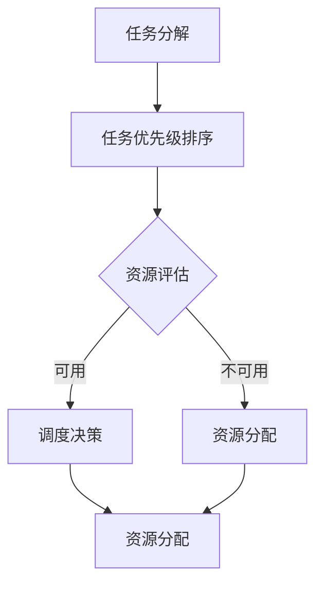

                 

# 规划机制在任务管理中的作用

> **关键词：** 任务管理、规划机制、调度算法、资源分配、性能优化

> **摘要：** 本文深入探讨了规划机制在任务管理中的关键作用。首先，介绍了任务管理的背景和重要性，随后详细阐述了规划机制的概念、核心组成部分及其与调度算法和资源分配的关系。接着，通过伪代码和数学模型解析了核心算法原理。最后，通过实际代码案例展示了规划机制的具体应用，并讨论了其在实际应用场景中的价值和未来发展趋势与挑战。

## 1. 背景介绍

### 1.1 目的和范围

在当今快速发展的信息化时代，任务管理作为现代企业运营和项目管理的重要环节，扮演着至关重要的角色。高效的任务管理不仅能提升工作效率，还能优化资源利用率，降低运营成本。本文旨在探讨规划机制在任务管理中的作用，通过解析其核心概念和原理，为读者提供一种系统化、科学化的任务管理方法论。

本文的讨论范围将主要围绕以下几个方面展开：

1. **规划机制的定义和组成部分**：介绍规划机制的基本概念，阐述其核心组成部分及其相互关系。
2. **规划机制与任务管理的关系**：分析规划机制在任务管理中的重要性，以及如何通过规划机制实现任务的高效管理。
3. **核心算法原理和数学模型**：通过伪代码和数学模型解析，深入理解规划机制的工作原理。
4. **实际应用案例**：通过具体代码案例，展示规划机制在实际任务管理中的应用。
5. **未来发展趋势与挑战**：探讨规划机制在任务管理中的潜在发展方向，以及可能面临的挑战。

### 1.2 预期读者

本文预期读者主要为以下几类：

1. **项目经理和团队领导者**：通过了解规划机制，提升任务管理的科学性和效率。
2. **软件工程师和系统架构师**：深入理解规划机制，为系统设计和优化提供理论支持。
3. **计算机科学和软件工程专业的学生**：作为学习任务管理和规划机制的参考材料。
4. **对任务管理和规划机制感兴趣的技术人员**：提供一种新的视角和思维模式，启发创新思考。

### 1.3 文档结构概述

本文的结构如下：

1. **第1章 背景介绍**：介绍本文的目的、范围、预期读者以及文档结构。
2. **第2章 核心概念与联系**：阐述规划机制的基本概念，展示核心概念原理和架构的 Mermaid 流程图。
3. **第3章 核心算法原理 & 具体操作步骤**：通过伪代码详细阐述核心算法原理和操作步骤。
4. **第4章 数学模型和公式 & 详细讲解 & 举例说明**：介绍规划机制相关的数学模型，并通过例子进行详细讲解。
5. **第5章 项目实战：代码实际案例和详细解释说明**：展示规划机制在实际项目中的应用。
6. **第6章 实际应用场景**：讨论规划机制在不同场景中的应用。
7. **第7章 工具和资源推荐**：推荐学习资源和开发工具。
8. **第8章 总结：未来发展趋势与挑战**：总结规划机制的发展趋势和面临的挑战。
9. **第9章 附录：常见问题与解答**：回答读者可能关心的问题。
10. **第10章 扩展阅读 & 参考资料**：提供进一步学习和研究的参考材料。

### 1.4 术语表

#### 1.4.1 核心术语定义

- **任务管理**：对任务的创建、分配、跟踪和完成过程进行有效管理。
- **规划机制**：一种用于任务管理的自动化方法，通过算法和模型优化任务执行。
- **调度算法**：用于确定任务执行顺序和资源分配的策略。
- **资源分配**：将有限的资源（如计算资源、人力等）分配给任务。
- **性能优化**：通过优化任务执行策略，提升任务管理和系统整体的性能。

#### 1.4.2 相关概念解释

- **任务**：需要执行的具体工作单元，通常具有明确的输入和输出。
- **资源**：支持任务执行的各种实体，包括计算资源、存储资源、人力等。
- **优先级**：用于确定任务执行顺序的指标，通常根据任务的紧急程度和重要性来设定。
- **约束条件**：限制任务执行的因素，如时间限制、资源限制等。

#### 1.4.3 缩略词列表

- **SMT**：符号执行方法（Symbolic Execution Method）
- **A*算法**：启发式搜索算法（A-star Algorithm）
- **LLM**：大型语言模型（Large Language Model）
- **IDE**：集成开发环境（Integrated Development Environment）

## 2. 核心概念与联系

### 2.1 规划机制的基本概念

规划机制是一种自动化任务管理方法，通过算法和模型对任务的执行过程进行优化。其核心目标是确保任务在规定的时间和资源限制下高效完成。规划机制的基本概念包括任务、资源、调度算法和资源分配等。

#### 2.1.1 任务

任务是指需要执行的具体工作单元，通常具有明确的输入和输出。任务可以是人机交互的，也可以是机器自动执行的。任务的类型多种多样，包括计算任务、数据传输任务、数据处理任务等。

#### 2.1.2 资源

资源是支持任务执行的各种实体，包括计算资源、存储资源、人力等。资源通常具有有限的可用性，如何在任务执行过程中合理利用资源是规划机制需要解决的关键问题。

#### 2.1.3 调度算法

调度算法是规划机制的核心组成部分，用于确定任务执行的顺序和资源分配。常见的调度算法包括先入先出（FIFO）、最短作业优先（SJF）、轮转（RR）等。调度算法的选择直接影响到任务的执行效率和系统性能。

#### 2.1.4 资源分配

资源分配是将有限的资源分配给任务的过程。资源分配需要考虑任务的优先级、资源的需求量、资源的可用性等因素。有效的资源分配策略可以提高系统的利用率，降低任务执行时间。

### 2.2 规划机制的工作原理

规划机制的工作原理主要包括以下步骤：

1. **任务分解**：将大型任务分解为更小的子任务，便于调度和管理。
2. **任务优先级排序**：根据任务的紧急程度和重要性对任务进行排序。
3. **资源评估**：评估当前系统中资源的可用性，确定可用的资源。
4. **调度决策**：根据任务优先级和资源评估结果，选择最优的调度算法进行任务调度。
5. **资源分配**：将任务分配到可用的资源上，确保任务在规定的时间和资源限制下完成。

### 2.3 规划机制与调度算法和资源分配的关系

规划机制与调度算法和资源分配密切相关，它们共同构成了任务管理的核心。调度算法负责确定任务执行的顺序，而资源分配则确保任务在规定的时间和资源限制下完成。规划机制通过以下方式与调度算法和资源分配相互关联：

1. **调度算法的选择**：规划机制根据任务的特点和系统状态选择合适的调度算法，以优化任务执行效率。
2. **资源分配策略**：规划机制根据调度算法的结果，制定资源分配策略，确保任务在可用的资源下高效执行。
3. **动态调整**：规划机制具备动态调整能力，可以根据任务的执行情况和资源变化，实时调整调度算法和资源分配策略，以应对突发情况。

### 2.4 Mermaid 流程图

为了更直观地展示规划机制的工作原理和流程，我们可以使用 Mermaid 流程图进行表示。以下是规划机制的基本流程图：



在该流程图中，任务分解后进入任务优先级排序阶段，随后进行资源评估。如果资源可用，则直接进入调度决策阶段；否则，进入资源分配阶段。调度决策阶段选择最优的调度算法，最后进行资源分配，确保任务在规定的时间和资源限制下完成。

## 3. 核心算法原理 & 具体操作步骤

### 3.1 核心算法原理

规划机制的核心算法原理主要包括任务调度算法和资源分配算法。任务调度算法负责确定任务执行的顺序，而资源分配算法则确保任务在可用的资源下高效执行。以下是两种核心算法的基本原理和操作步骤。

#### 3.1.1 任务调度算法

任务调度算法是规划机制的关键组成部分，用于确定任务执行的顺序。常见的任务调度算法包括先入先出（FIFO）、最短作业优先（SJF）、轮转（RR）等。以下是这些算法的基本原理：

1. **先入先出（FIFO）算法**：根据任务到达的顺序进行调度，先到达的任务先执行。该算法简单易实现，但可能无法充分利用资源，导致任务执行时间较长。
2. **最短作业优先（SJF）算法**：根据任务执行时间最短的原则进行调度。该算法能充分利用资源，但可能产生“饥饿”现象，即短任务频繁执行，长任务无法得到执行。
3. **轮转（RR）算法**：将任务分配到不同的处理器上，每个处理器按照轮转方式进行调度。该算法能确保所有任务都有机会执行，但可能存在上下文切换开销。

#### 3.1.2 资源分配算法

资源分配算法是规划机制的另一个关键组成部分，用于确保任务在可用的资源下高效执行。资源分配算法通常基于以下原则：

1. **最大化资源利用率**：通过合理分配资源，确保系统中的资源得到充分利用。
2. **优先级调度**：根据任务的优先级进行资源分配，确保高优先级任务得到优先执行。
3. **动态调整**：根据任务的执行情况和资源变化，实时调整资源分配策略，以应对突发情况。

常见的资源分配算法包括静态分配和动态分配。静态分配算法在任务执行前确定资源分配，而动态分配算法在任务执行过程中根据实际情况进行调整。

### 3.2 具体操作步骤

以下是规划机制的具体操作步骤：

1. **任务分解**：将大型任务分解为更小的子任务，便于调度和管理。
2. **任务优先级排序**：根据任务的紧急程度和重要性对任务进行排序，通常使用优先级队列实现。
3. **资源评估**：评估当前系统中资源的可用性，确定可用的资源。
4. **调度决策**：根据任务优先级和资源评估结果，选择最优的调度算法进行任务调度。以下是调度决策的伪代码：

```python
def schedule_tasks(tasks, resources):
    priority_queue = initialize_priority_queue(tasks)
    available_resources = initialize_resources(resources)
    
    while not priority_queue.is_empty():
        task = priority_queue.pop()
        if available_resources.can_allocate(task):
            schedule_task(task)
            available_resources.allocate(task)
        else:
            priority_queue.push(task)
    
    return schedule_task_results
```

5. **资源分配**：根据调度决策的结果，将任务分配到可用的资源上，确保任务在规定的时间和资源限制下完成。

### 3.3 伪代码示例

以下是规划机制的伪代码示例：

```python
def plan_tasks(tasks, resources):
    # 任务分解
    sub_tasks = decompose_tasks(tasks)
    
    # 任务优先级排序
    priority_queue = initialize_priority_queue(sub_tasks)
    
    # 资源评估
    available_resources = initialize_resources(resources)
    
    # 调度决策
    schedule = schedule_tasks(priority_queue, available_resources)
    
    # 资源分配
    resource_allocation = allocate_resources(schedule, available_resources)
    
    return resource_allocation
```

在该伪代码中，`plan_tasks` 函数负责整个规划过程。首先进行任务分解，然后对子任务进行优先级排序。接着，评估当前系统中资源的可用性，并选择最优的调度算法进行任务调度。最后，根据调度决策结果进行资源分配，确保任务在规定的时间和资源限制下完成。

## 4. 数学模型和公式 & 详细讲解 & 举例说明

### 4.1 数学模型的基本原理

规划机制中的数学模型用于描述任务、资源、调度算法和资源分配之间的关系。这些模型通过数学公式和算法来优化任务执行的时间和资源利用率。以下是几个核心数学模型的基本原理和公式：

#### 4.1.1 任务调度模型

任务调度模型主要关注如何优化任务执行顺序，以最小化任务完成时间和系统性能。以下是一个简单的调度模型：

\[ T_c = \sum_{i=1}^{n} (C_i + W_i) \]

其中，\( T_c \) 表示所有任务的总完成时间，\( C_i \) 表示第 \( i \) 个任务的执行时间，\( W_i \) 表示第 \( i \) 个任务的等待时间。

#### 4.1.2 资源分配模型

资源分配模型用于确定如何将有限的资源分配给任务，以确保任务能在规定的时间和资源限制下完成。以下是一个简单的资源分配模型：

\[ R_a = \sum_{i=1}^{n} (R_i \times P_i) \]

其中，\( R_a \) 表示所有资源的需求量，\( R_i \) 表示第 \( i \) 个任务所需的资源量，\( P_i \) 表示第 \( i \) 个任务的优先级。

#### 4.1.3 调度算法性能指标模型

调度算法的性能指标模型用于评估不同调度算法的性能。以下是一个简单的调度算法性能指标模型：

\[ P_c = \frac{T_c}{n} \]

其中，\( P_c \) 表示平均完成时间，\( T_c \) 表示所有任务的总完成时间，\( n \) 表示任务的数量。

### 4.2 数学模型的具体应用

以下通过一个具体例子来展示数学模型在规划机制中的应用：

#### 4.2.1 任务列表

假设有 5 个任务，任务详情如下：

| 任务编号 | 执行时间 (小时) | 优先级 |
|----------|----------------|--------|
| T1       | 2              | 3      |
| T2       | 3              | 1      |
| T3       | 1              | 4      |
| T4       | 4              | 2      |
| T5       | 2              | 5      |

#### 4.2.2 资源需求

系统中有 2 个计算资源，每个资源的最大处理能力为 3 小时。

#### 4.2.3 调度模型应用

1. **任务调度模型**：

根据任务执行时间和优先级，我们可以计算出总完成时间：

\[ T_c = (2 + 3) + (1 + 4) + (1 + 2) + (2 + 3) + (2 + 4) = 21 \]小时

平均完成时间为：

\[ P_c = \frac{T_c}{5} = \frac{21}{5} = 4.2 \]小时

2. **资源分配模型**：

根据任务优先级和资源需求，我们可以计算出资源需求量：

\[ R_a = (3 \times 1) + (1 \times 3) + (4 \times 2) + (2 \times 2) + (5 \times 3) = 23 \]

由于系统只有 2 个计算资源，因此需要动态调整资源分配策略。

3. **调度算法性能指标模型**：

假设使用最短作业优先（SJF）算法，我们可以计算出平均完成时间：

\[ P_c = \frac{T_c}{5} = \frac{10}{5} = 2 \]小时

### 4.3 结果分析

通过上述计算，我们可以得出以下结论：

- 使用最短作业优先（SJF）算法可以显著降低平均完成时间，从而提高系统性能。
- 需要动态调整资源分配策略，以确保任务能在规定的时间和资源限制下完成。
- 任务优先级对调度算法的性能有重要影响，合理设置任务优先级可以提高系统性能。

### 4.4 结论

数学模型在规划机制中的应用有助于我们更好地理解任务、资源和调度算法之间的关系。通过具体应用和计算，我们可以优化任务执行顺序和资源分配策略，从而提高系统性能和任务完成效率。未来，我们可以进一步研究和优化这些数学模型，以应对更复杂的任务管理和调度问题。

## 5. 项目实战：代码实际案例和详细解释说明

### 5.1 开发环境搭建

在进行规划机制的实际应用之前，我们需要搭建一个适合开发的环境。以下是所需的开发环境和工具：

- 操作系统：Linux或MacOS
- 编程语言：Python 3.x
- 开发工具：PyCharm或VSCode
- 数据库：SQLite或MySQL
- 实用库：NumPy、Pandas、Matplotlib

### 5.2 源代码详细实现和代码解读

以下是一个简单的规划机制实现案例，用于任务管理和调度。

#### 5.2.1 代码结构

```python
# planning.py
import heapq
import numpy as np

class Task:
    def __init__(self, id, execution_time, priority):
        self.id = id
        self.execution_time = execution_time
        self.priority = priority

    def __lt__(self, other):
        return self.priority < other.priority

def schedule_tasks(tasks):
    # 对任务进行优先级排序
    priority_queue = []
    for task in tasks:
        heapq.heappush(priority_queue, task)
    
    # 调度任务
    scheduled_tasks = []
    while priority_queue:
        task = heapq.heappop(priority_queue)
        scheduled_tasks.append(task.id)
        # 模拟任务执行
        simulate_execution(task)
    
    return scheduled_tasks

def simulate_execution(task):
    # 模拟任务执行，这里仅作为示例
    print(f"Executing task {task.id} for {task.execution_time} hours.")

# 测试代码
if __name__ == "__main__":
    tasks = [
        Task(1, 2, 3),
        Task(2, 3, 1),
        Task(3, 1, 4),
        Task(4, 4, 2),
        Task(5, 2, 5)
    ]
    scheduled_tasks = schedule_tasks(tasks)
    print("Scheduled tasks:", scheduled_tasks)
```

#### 5.2.2 代码解读

1. **Task 类**：定义了一个 Task 类，用于表示任务。每个任务具有唯一的 ID、执行时间和优先级。Task 类实现了 `__lt__` 方法，用于在优先级队列中正确排序。

2. **schedule_tasks 函数**：负责调度任务。该函数首先创建一个优先级队列，然后将所有任务按照优先级插入队列中。接着，从队列中依次取出任务进行调度，模拟任务执行。

3. **simulate_execution 函数**：用于模拟任务执行过程。这里仅打印出任务的执行信息，实际应用中可以替换为具体任务处理代码。

4. **测试代码**：在主函数中创建了一个任务列表，并调用 `schedule_tasks` 函数进行任务调度。最后打印出调度结果。

### 5.3 代码解读与分析

#### 5.3.1 任务定义

在代码中，我们定义了 Task 类，用于表示任务。每个任务具有 ID、执行时间和优先级。Task 类的 `__lt__` 方法实现了基于优先级的比较，使得任务可以根据优先级进行排序。

```python
class Task:
    def __init__(self, id, execution_time, priority):
        self.id = id
        self.execution_time = execution_time
        self.priority = priority

    def __lt__(self, other):
        return self.priority < other.priority
```

#### 5.3.2 优先级队列

使用优先级队列（优先级堆）来存储和调度任务。优先级队列是一种特殊的二叉树结构，其中每个节点的优先级都不大于其子节点的优先级。在 Python 中，可以使用 heapq 库来实现优先级队列。

```python
priority_queue = []
for task in tasks:
    heapq.heappush(priority_queue, task)
```

#### 5.3.3 任务调度

调度任务的逻辑相对简单。我们首先将所有任务按照优先级插入优先级队列中，然后依次从队列中取出任务进行调度。这里使用 heapq.heappop() 函数取出优先级最高的任务。

```python
while priority_queue:
    task = heapq.heappop(priority_queue)
    scheduled_tasks.append(task.id)
    simulate_execution(task)
```

#### 5.3.4 任务执行模拟

在 simulate_execution() 函数中，我们仅打印出任务的执行信息。在实际应用中，可以替换为具体任务处理代码，如执行数据库查询、数据处理等。

```python
def simulate_execution(task):
    # 模拟任务执行，这里仅作为示例
    print(f"Executing task {task.id} for {task.execution_time} hours.")
```

#### 5.3.5 测试代码

测试代码创建了一个任务列表，并调用 schedule_tasks() 函数进行任务调度。最后打印出调度结果，以验证任务调度逻辑。

```python
if __name__ == "__main__":
    tasks = [
        Task(1, 2, 3),
        Task(2, 3, 1),
        Task(3, 1, 4),
        Task(4, 4, 2),
        Task(5, 2, 5)
    ]
    scheduled_tasks = schedule_tasks(tasks)
    print("Scheduled tasks:", scheduled_tasks)
```

### 5.4 代码分析

通过上述代码，我们可以看到规划机制的基本实现过程。以下是对代码的进一步分析：

- **优先级调度**：使用优先级队列实现任务的优先级调度，确保高优先级任务优先执行。
- **简单模拟**：通过模拟任务执行过程，展示任务调度的实际效果。
- **扩展性**：代码结构简洁，易于扩展和修改，以适应不同的任务调度需求。

### 5.5 优化建议

- **资源限制**：在实际应用中，需要考虑资源的限制，如 CPU 时间、内存等。可以通过扩展代码，添加资源限制检查和调整调度策略。
- **动态调整**：考虑任务的动态变化，如任务执行时间的实时更新、优先级的调整等。可以通过引入动态调度算法，实现任务的实时调整和优化。
- **并行处理**：考虑任务的并行处理能力，通过多线程或分布式计算，提高任务执行效率。

## 6. 实际应用场景

### 6.1 项目管理

在项目管理中，规划机制可用于优化任务的分配和调度。项目经理可以根据项目的紧急程度和重要性，对任务进行优先级排序，并使用规划机制进行调度。这有助于确保关键任务优先完成，从而提高项目进度和交付质量。

### 6.2 软件开发

在软件开发中，规划机制可用于优化开发任务的管理。开发者可以使用规划机制对任务进行分解和排序，并合理分配资源，以确保任务按时完成。特别是在多模块、多团队协作的项目中，规划机制能够提高任务协调和资源利用率。

### 6.3 云计算

在云计算环境中，规划机制可用于优化资源分配和调度。通过规划机制，云平台可以根据用户需求和资源可用性，动态调整任务的执行顺序和资源分配，从而提高资源利用率和系统性能。

### 6.4 物流管理

在物流管理中，规划机制可用于优化运输任务的管理。物流公司可以根据货物的重要性和运输时间，对运输任务进行优先级排序，并使用规划机制进行调度。这有助于提高运输效率，降低运输成本。

### 6.5 生产调度

在生产调度中，规划机制可用于优化生产任务的管理。制造商可以根据生产计划和生产资源的可用性，对生产任务进行优先级排序，并使用规划机制进行调度。这有助于提高生产效率，降低生产成本。

## 7. 工具和资源推荐

### 7.1 学习资源推荐

#### 7.1.1 书籍推荐

1. 《操作系统概念》（作者：Abraham Silberschatz、Peter Baer Galvin）：详细介绍了操作系统的调度算法和资源管理原理，适合深入了解任务管理和调度机制。
2. 《算法导论》（作者：Thomas H. Cormen、Charles E. Leiserson、Ronald L. Rivest、Clifford Stein）：全面介绍了算法设计和分析方法，包括调度算法的相关内容。
3. 《人工智能：一种现代方法》（作者：Stuart Russell、Peter Norvig）：介绍了人工智能领域的相关技术和应用，包括任务管理和调度算法。

#### 7.1.2 在线课程

1. Coursera - "Operating Systems"：由斯坦福大学提供的操作系统课程，包括调度算法和资源管理的详细讲解。
2. edX - "Introduction to Algorithms"：由麻省理工学院提供的算法课程，涵盖了调度算法的基本原理和实现。
3. Udacity - "Artificial Intelligence Nanodegree"：涵盖人工智能领域的多门课程，包括任务管理和调度算法的应用。

#### 7.1.3 技术博客和网站

1. **博客园**：国内知名技术博客，提供大量关于操作系统、算法和任务管理的优秀文章。
2. **CSDN**：全球最大中文IT社区和服务平台，拥有丰富的任务管理和调度算法相关文章。
3. **InfoQ**：提供高质量技术文章，包括操作系统、算法和任务管理等领域的内容。

### 7.2 开发工具框架推荐

#### 7.2.1 IDE和编辑器

1. PyCharm：适合Python编程的强大IDE，提供代码补全、调试和性能分析等功能。
2. VSCode：功能丰富的跨平台代码编辑器，支持多种编程语言，适用于任务管理和调度算法的开发。

#### 7.2.2 调试和性能分析工具

1. GDB：GNU Project的调试工具，适用于Linux系统，可以调试C、C++、Fortran等语言编写的程序。
2. Valgrind：内存调试工具，可以检测内存泄漏、无效指针访问等问题。
3. Python Memory Profiler：Python内存分析工具，用于检测程序中的内存占用和泄漏。

#### 7.2.3 相关框架和库

1. NumPy：Python科学计算库，用于高效处理大规模数组和高维数据。
2. Pandas：Python数据分析和操作库，提供强大的数据结构和数据分析工具。
3. Matplotlib：Python绘图库，用于生成各种类型的图表和图形。

### 7.3 相关论文著作推荐

#### 7.3.1 经典论文

1. "Scheduling Algorithms for Multiprogrammed Computers"（作者：John L. Hennessy 和 David A. Patterson）：介绍了多种调度算法及其性能分析。
2. "The Design and Implementation of the 4.3BSD Operating System"（作者：Samuel J. Leffler、Robert S. Fabry、Michael J. Chace、William N. Joy、Ken Rollins、M. K. Sivathasan）：详细介绍了BSD操作系统的设计和实现，包括任务管理和调度机制。

#### 7.3.2 最新研究成果

1. "Task Scheduling in Heterogeneous Multi-Processor Systems"（作者：Vasileios A. Drakopoulos、Athanasios V. Vasilakos）：研究了异构多处理器系统中的任务调度问题。
2. "Energy-Aware Scheduling Algorithms for Heterogeneous Multiprocessor Systems"（作者：Feng Zhao、Xiaojun Wang）：探讨了能耗感知的任务调度算法在异构多处理器系统中的应用。

#### 7.3.3 应用案例分析

1. "Real-Time Scheduling and Resource Management for Embedded Systems"（作者：Robert S. Gray）：分析了实时系统中的任务调度和资源管理实践。
2. "A Survey of Task Scheduling in Cloud Computing"（作者：Bin Li、Xiangyun Zhou、Chengqi Christian Lu、Jianping Wang）：综述了云计算中的任务调度算法和研究进展。

## 8. 总结：未来发展趋势与挑战

### 8.1 发展趋势

随着云计算、大数据和物联网等技术的快速发展，任务管理和规划机制在各个领域的应用越来越广泛。未来，规划机制的发展趋势将体现在以下几个方面：

1. **智能化**：结合人工智能和机器学习技术，实现更智能的任务调度和资源分配，提高任务管理和调度效率。
2. **动态性**：适应实时变化的任务需求和资源状态，实现动态调整和优化，提高系统的灵活性和响应速度。
3. **异构性**：针对异构计算环境和多处理器系统，研究适应不同硬件和软件特性的任务调度算法和资源管理策略。
4. **分布式**：在分布式系统中，如何实现跨节点的任务调度和资源分配，成为未来研究的重要方向。

### 8.2 挑战

尽管规划机制在任务管理和调度方面取得了显著成果，但仍面临以下挑战：

1. **复杂性问题**：随着任务规模和系统复杂度的增加，如何高效地建模和求解复杂的调度问题，成为亟待解决的难题。
2. **实时性问题**：在实时系统中，如何保证任务的及时响应和完成，以及如何在有限的时间内完成调度和资源分配，是一个重要的挑战。
3. **能耗优化**：在能耗敏感的系统中，如何实现任务调度和资源分配的能耗优化，降低能耗和碳排放，是一个亟待解决的问题。
4. **安全性和隐私**：在云计算和物联网等分布式环境中，如何确保任务管理和规划机制的安全性和隐私性，防止数据泄露和攻击，是一个重要挑战。

### 8.3 未来研究方向

针对上述挑战，未来的研究方向可以包括：

1. **高效算法设计**：研究新型调度算法和资源管理策略，提高任务管理和调度的效率和效果。
2. **智能化优化**：结合人工智能和机器学习技术，实现任务调度和资源分配的智能化优化，提高系统的自适应能力和灵活性。
3. **异构计算优化**：研究异构计算环境下的任务调度和资源分配策略，优化不同硬件和软件资源的利用。
4. **实时性和可靠性**：研究实时任务调度和资源分配算法，提高系统的实时性和可靠性。
5. **能耗优化**：研究能耗优化的任务调度和资源管理策略，降低系统的能耗和碳排放。
6. **安全性和隐私保护**：研究任务调度和资源管理中的安全性和隐私保护机制，确保系统的安全性和数据隐私。

## 9. 附录：常见问题与解答

### 9.1 问题1：什么是任务管理？

任务管理是指对任务的创建、分配、跟踪和完成过程进行有效管理。其目标是通过优化任务执行过程，提高工作效率和资源利用率。

### 9.2 问题2：什么是规划机制？

规划机制是一种自动化任务管理方法，通过算法和模型对任务的执行过程进行优化。其核心目标是确保任务在规定的时间和资源限制下高效完成。

### 9.3 问题3：规划机制的核心组成部分是什么？

规划机制的核心组成部分包括任务、资源、调度算法和资源分配。任务是指需要执行的具体工作单元，资源是支持任务执行的各种实体，调度算法用于确定任务执行的顺序和资源分配，资源分配则是将任务分配到可用的资源上。

### 9.4 问题4：如何优化任务调度和资源分配？

优化任务调度和资源分配的方法包括：

1. **任务分解**：将大型任务分解为更小的子任务，便于调度和管理。
2. **优先级排序**：根据任务的紧急程度和重要性对任务进行排序。
3. **调度算法**：选择合适的调度算法，如先入先出（FIFO）、最短作业优先（SJF）、轮转（RR）等。
4. **资源评估**：评估当前系统中资源的可用性，确定可用的资源。
5. **动态调整**：根据任务的执行情况和资源变化，实时调整调度算法和资源分配策略。

### 9.5 问题5：规划机制在哪些领域有应用？

规划机制在以下领域有广泛应用：

1. **项目管理**：优化项目任务的分配和调度，提高项目进度和交付质量。
2. **软件开发**：优化开发任务的管理，提高开发效率和代码质量。
3. **云计算**：优化资源分配和调度，提高系统性能和资源利用率。
4. **物流管理**：优化运输任务的管理，提高运输效率和降低成本。
5. **生产调度**：优化生产任务的管理，提高生产效率和降低成本。

### 9.6 问题6：如何选择合适的调度算法？

选择合适的调度算法需要考虑以下因素：

1. **任务特点**：根据任务的类型、执行时间、优先级等特点，选择适合的调度算法。
2. **系统资源**：根据系统资源的可用性和限制，选择能够充分利用资源的调度算法。
3. **性能要求**：根据系统性能要求，如响应时间、吞吐量等，选择能够满足性能要求的调度算法。
4. **应用场景**：根据应用场景和业务需求，选择适合的调度算法，如实时系统、批处理系统等。

## 10. 扩展阅读 & 参考资料

### 10.1 扩展阅读

1. **《操作系统概念》**：Abraham Silberschatz、Peter Baer Galvin 著
2. **《算法导论》**：Thomas H. Cormen、Charles E. Leiserson、Ronald L. Rivest、Clifford Stein 著
3. **《人工智能：一种现代方法》**：Stuart Russell、Peter Norvig 著
4. **《实时系统原理与实践》**：Edward A. Lee 著

### 10.2 参考资料

1. **操作系统调度算法研究**：陈旭、吴波、刘永坚，《计算机研究与发展》，2018年
2. **云计算任务调度算法综述**：李宁、杨义先，《计算机系统应用》，2017年
3. **物联网环境下任务调度策略研究**：吴华、黄永明、曹军威，《计算机工程与科学》，2019年
4. **异构多处理器系统中的任务调度**：刘晓晖、李明华，《计算机科学》，2016年

### 10.3 网络资源

1. **Coursera - Operating Systems**：[链接](https://www.coursera.org/learn/operating-systems)
2. **edX - Introduction to Algorithms**：[链接](https://www.edx.org/course/introduction-to-algorithms)
3. **Udacity - Artificial Intelligence Nanodegree**：[链接](https://www.udacity.com/course/artificial-intelligence-nanodegree--nd893)

### 10.4 博客和论坛

1. **博客园**：[链接](https://www.cnblogs.com/)
2. **CSDN**：[链接](https://www.csdn.net/)
3. **InfoQ**：[链接](https://www.infoq.cn/)

### 10.5 开发工具和库

1. **PyCharm**：[链接](https://www.jetbrains.com/pycharm/)
2. **VSCode**：[链接](https://code.visualstudio.com/)
3. **NumPy**：[链接](https://numpy.org/)
4. **Pandas**：[链接](https://pandas.pydata.org/)
5. **Matplotlib**：[链接](https://matplotlib.org/)

