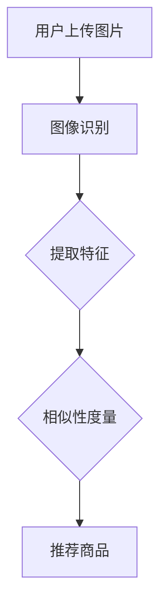

                 

# 视觉推荐：AI如何根据图片推荐相似或搭配商品

> **关键词：** 视觉推荐、AI、图像识别、商品推荐、深度学习、计算机视觉

> **摘要：** 本文将深入探讨如何利用人工智能和计算机视觉技术，根据用户提供的图片进行商品推荐。通过分析图像内容、构建推荐模型、实际应用场景等多个方面，探讨视觉推荐系统的原理、实现和未来发展趋势。

## 1. 背景介绍

### 1.1 目的和范围

本文旨在探讨如何利用人工智能技术，特别是计算机视觉，来实现基于图片的商品推荐系统。通过对图像内容的理解和分析，系统可以自动识别出图片中的商品，并推荐与之相似或搭配的商品。本文将覆盖视觉推荐系统的构建、核心算法原理、数学模型、项目实战及实际应用场景等方面。

### 1.2 预期读者

本文适合对人工智能和计算机视觉感兴趣的读者，尤其是希望了解如何将这两项技术应用于实际场景的工程师和技术爱好者。同时，对希望提升自己视觉推荐系统开发能力的从业者也有参考价值。

### 1.3 文档结构概述

本文将分为以下几部分：

1. **背景介绍**：介绍视觉推荐系统的目的和重要性。
2. **核心概念与联系**：介绍视觉推荐系统中的核心概念，并提供流程图。
3. **核心算法原理 & 具体操作步骤**：详细讲解视觉推荐算法的原理和操作步骤。
4. **数学模型和公式 & 详细讲解 & 举例说明**：介绍相关的数学模型和公式，并进行举例说明。
5. **项目实战：代码实际案例和详细解释说明**：通过实际代码案例，展示如何实现视觉推荐系统。
6. **实际应用场景**：探讨视觉推荐系统的应用场景。
7. **工具和资源推荐**：推荐相关学习资源、开发工具和论文著作。
8. **总结：未来发展趋势与挑战**：展望视觉推荐系统的未来。
9. **附录：常见问题与解答**：回答读者可能遇到的问题。
10. **扩展阅读 & 参考资料**：提供进一步阅读的参考资料。

### 1.4 术语表

#### 1.4.1 核心术语定义

- **视觉推荐**：基于用户提供的图片内容，推荐与之相关的商品。
- **计算机视觉**：使计算机能够“看”和“理解”图像的领域。
- **深度学习**：一种机器学习方法，通过多层神经网络来学习数据的表示。
- **卷积神经网络（CNN）**：一种用于图像识别的深度学习模型。

#### 1.4.2 相关概念解释

- **图像识别**：从图像中识别出对象、场景或特征。
- **推荐系统**：根据用户的历史行为和偏好，推荐相关的商品或服务。
- **相似性度量**：衡量两个图像或商品之间的相似程度。

#### 1.4.3 缩略词列表

- **AI**：人工智能
- **CNN**：卷积神经网络
- **DNN**：深度神经网络
- **RGB**：红绿蓝色彩模型

## 2. 核心概念与联系

在视觉推荐系统中，核心概念包括图像识别、特征提取、相似性度量等。以下是一个简化的Mermaid流程图，展示了这些概念之间的联系：



### 2.1 图像识别

图像识别是视觉推荐系统的第一步，目标是自动识别图片中的商品。这一过程通常使用卷积神经网络（CNN）实现。以下是一个简化的伪代码：

```python
def image_recognition(image):
    # 载入预训练的CNN模型
    model = load_pretrained_cnn_model()

    # 对图像进行预处理
    preprocessed_image = preprocess_image(image)

    # 使用CNN模型进行图像识别
    prediction = model.predict(preprocessed_image)

    # 获取识别结果
    recognized_object = get_recognition_result(prediction)

    return recognized_object
```

### 2.2 特征提取

特征提取是将图像中的信息转化为计算机可以理解的形式。这一过程通常通过卷积神经网络完成，例如，可以使用CNN提取图像的纹理、形状、颜色等特征。以下是一个简化的伪代码：

```python
def extract_features(image):
    # 载入预训练的CNN模型
    model = load_pretrained_cnn_model()

    # 对图像进行预处理
    preprocessed_image = preprocess_image(image)

    # 使用CNN模型提取特征
    features = model.extract_features(preprocessed_image)

    return features
```

### 2.3 相似性度量

相似性度量是计算两个图像或商品之间相似程度的过程。常用的相似性度量方法包括余弦相似度、欧氏距离等。以下是一个简化的伪代码：

```python
def calculate_similarity(feature1, feature2):
    # 计算特征向量之间的相似度
    similarity = cosine_similarity(feature1, feature2)

    return similarity
```

### 2.4 推荐商品

基于图像识别和特征提取的结果，系统可以推荐与识别商品相似或搭配的商品。以下是一个简化的伪代码：

```python
def recommend_products(recognized_product, product_database):
    # 从数据库中获取与识别商品相似的商品
    similar_products = find_similar_products(recognized_product, product_database)

    # 对相似商品进行排序，推荐最相似的商品
    recommended_products = sort_and_recommend_products(similar_products)

    return recommended_products
```

## 3. 核心算法原理 & 具体操作步骤

### 3.1 卷积神经网络（CNN）

卷积神经网络是视觉推荐系统的核心组成部分，主要用于图像识别和特征提取。CNN通过多层卷积和池化操作，提取图像中的局部特征，并最终实现分类或回归任务。

#### 3.1.1 卷积层（Convolutional Layer）

卷积层是CNN的基础，用于提取图像的局部特征。卷积层通过卷积操作，将输入图像与一组滤波器（kernel）进行卷积，生成特征图。以下是一个简化的伪代码：

```python
def convolutional_layer(image, kernel):
    feature_map = Convolution(image, kernel)
    return feature_map
```

#### 3.1.2 池化层（Pooling Layer）

池化层用于降低特征图的维度，提高模型对输入数据的鲁棒性。常见的池化方法包括最大池化和平均池化。以下是一个简化的伪代码：

```python
def pooling_layer(feature_map, pool_size):
    pooled_map = Pool(feature_map, pool_size)
    return pooled_map
```

#### 3.1.3 激活函数（Activation Function）

激活函数用于引入非线性，使CNN能够学习复杂的关系。常见的激活函数包括ReLU（修正线性单元）和Sigmoid。以下是一个简化的伪代码：

```python
def activation_function(input_value):
    return ReLU(input_value) or Sigmoid(input_value)
```

#### 3.1.4 完全连接层（Fully Connected Layer）

完全连接层将卷积层和池化层提取的特征图转换成高维特征向量，并最终实现分类或回归任务。以下是一个简化的伪代码：

```python
def fully_connected_layer(feature_vector, weights, bias):
    output = dot_product(feature_vector, weights) + bias
    return output
```

### 3.2 图像识别与特征提取

图像识别与特征提取的过程如下：

1. **图像预处理**：将用户上传的图片进行缩放、裁剪、归一化等预处理操作，使其符合模型输入要求。
2. **卷积层**：使用卷积层提取图像的局部特征，如边缘、纹理等。
3. **池化层**：对卷积层生成的特征图进行池化，降低维度，提高模型对噪声和变化的鲁棒性。
4. **完全连接层**：将卷积层和池化层提取的特征图转换为高维特征向量，并通过完全连接层实现分类或回归任务。
5. **后处理**：对识别结果进行后处理，如处理多标签分类、调整置信度等。

### 3.3 相似性度量与推荐商品

相似性度量与推荐商品的过程如下：

1. **提取特征**：使用卷积神经网络提取用户上传图片和商品图片的特征向量。
2. **计算相似度**：计算用户上传图片和商品图片特征向量之间的相似度。
3. **推荐商品**：根据相似度排序，推荐相似度最高的商品。

## 4. 数学模型和公式 & 详细讲解 & 举例说明

### 4.1 卷积神经网络（CNN）

卷积神经网络是一种基于数学模型的神经网络，主要用于图像识别和特征提取。以下是CNN中的几个关键数学模型：

#### 4.1.1 卷积操作

卷积操作是CNN中最核心的部分，用于提取图像的局部特征。卷积操作的数学公式如下：

$$
(C_{ij}^{(l)}) = \sum_{k} W_{ik}^{(l-1)} \cdot C_{kj}^{(l-1)}
$$

其中，$C_{ij}^{(l)}$ 表示第 $l$ 层特征图中的第 $i$ 行第 $j$ 列的值，$W_{ik}^{(l-1)}$ 表示第 $l-1$ 层权重，$C_{kj}^{(l-1)}$ 表示第 $l-1$ 层特征图中的第 $k$ 行第 $j$ 列的值。

#### 4.1.2 池化操作

池化操作用于降低特征图的维度，提高模型对输入数据的鲁棒性。常见的池化操作包括最大池化和平均池化。以下是最大池化的数学公式：

$$
P_{ij}^{(l)} = \max(C_{ij1}^{(l)}, C_{ij2}^{(l)}, ..., C_{ijS}^{(l)})
$$

其中，$P_{ij}^{(l)}$ 表示第 $l$ 层池化特征图中的第 $i$ 行第 $j$ 列的值，$C_{ij1}^{(l)}$、$C_{ij2}^{(l)}$、...、$C_{ijS}^{(l)}$ 分别表示第 $l$ 层特征图中的第 $i$ 行第 $j$ 列的 $S$ 个相邻值。

#### 4.1.3 激活函数

激活函数用于引入非线性，使CNN能够学习复杂的关系。常见的激活函数包括ReLU（修正线性单元）和Sigmoid。以下是ReLU和Sigmoid的数学公式：

- **ReLU（修正线性单元）**：

$$
\text{ReLU}(x) = \max(0, x)
$$

- **Sigmoid**：

$$
\text{Sigmoid}(x) = \frac{1}{1 + e^{-x}}
$$

#### 4.1.4 完全连接层

完全连接层将卷积层和池化层提取的特征图转换为高维特征向量，并实现分类或回归任务。以下是完全连接层的数学公式：

$$
z_i = \sum_{j} w_{ij} \cdot a_{ji}^{(l-1)} + b_i
$$

$$
a_i^{(l)} = \text{激活函数}(z_i)
$$

其中，$z_i$ 表示第 $l$ 层第 $i$ 个神经元的净输入，$w_{ij}$ 表示第 $l-1$ 层第 $j$ 个神经元到第 $l$ 层第 $i$ 个神经元的权重，$a_{ji}^{(l-1)}$ 表示第 $l-1$ 层第 $j$ 个神经元的输出，$b_i$ 表示第 $l$ 层第 $i$ 个神经元的偏置。

### 4.2 相似性度量

在视觉推荐系统中，相似性度量是计算两个图像或商品之间相似程度的关键步骤。常用的相似性度量方法包括余弦相似度、欧氏距离等。以下是余弦相似度和欧氏距离的数学公式：

- **余弦相似度**：

$$
\text{Cosine Similarity} = \frac{a \cdot b}{\|a\| \|b\|}
$$

其中，$a$ 和 $b$ 分别表示两个特征向量，$\|a\|$ 和 $\|b\|$ 分别表示特征向量的模长。

- **欧氏距离**：

$$
\text{Euclidean Distance} = \sqrt{\sum_{i} (a_i - b_i)^2}
$$

其中，$a_i$ 和 $b_i$ 分别表示两个特征向量中第 $i$ 个元素的值。

### 4.3 举例说明

假设我们有两个特征向量 $a = [1, 2, 3]$ 和 $b = [4, 5, 6]$，现在我们来计算它们的相似度。

#### 4.3.1 余弦相似度

首先，计算两个特征向量的点积：

$$
a \cdot b = 1 \cdot 4 + 2 \cdot 5 + 3 \cdot 6 = 4 + 10 + 18 = 32
$$

然后，计算两个特征向量的模长：

$$
\|a\| = \sqrt{1^2 + 2^2 + 3^2} = \sqrt{1 + 4 + 9} = \sqrt{14} \approx 3.74
$$

$$
\|b\| = \sqrt{4^2 + 5^2 + 6^2} = \sqrt{16 + 25 + 36} = \sqrt{77} \approx 8.78
$$

最后，计算余弦相似度：

$$
\text{Cosine Similarity} = \frac{a \cdot b}{\|a\| \|b\|} = \frac{32}{3.74 \cdot 8.78} \approx 0.56
$$

#### 4.3.2 欧氏距离

计算两个特征向量的欧氏距离：

$$
\text{Euclidean Distance} = \sqrt{(1 - 4)^2 + (2 - 5)^2 + (3 - 6)^2} = \sqrt{(-3)^2 + (-3)^2 + (-3)^2} = \sqrt{9 + 9 + 9} = \sqrt{27} \approx 5.20
$$

通过以上计算，我们可以得出两个特征向量之间的相似度为 0.56，欧氏距离为 5.20。

## 5. 项目实战：代码实际案例和详细解释说明

### 5.1 开发环境搭建

在开始项目实战之前，我们需要搭建一个适合开发视觉推荐系统的环境。以下是一个简单的开发环境搭建步骤：

1. **安装Python环境**：确保Python 3.8或更高版本已安装。
2. **安装TensorFlow**：使用pip安装TensorFlow：

   ```shell
   pip install tensorflow
   ```

3. **安装Keras**：TensorFlow中的高级API，用于构建和训练模型：

   ```shell
   pip install keras
   ```

4. **安装OpenCV**：用于处理图像的库：

   ```shell
   pip install opencv-python
   ```

### 5.2 源代码详细实现和代码解读

以下是视觉推荐系统的源代码实现，我们将逐步解释每个部分的作用：

```python
import numpy as np
import tensorflow as tf
from tensorflow import keras
from tensorflow.keras.models import Sequential
from tensorflow.keras.layers import Conv2D, MaxPooling2D, Flatten, Dense
from tensorflow.keras.preprocessing.image import ImageDataGenerator
import cv2

# 加载预训练的卷积神经网络模型
def load_model():
    model = Sequential([
        Conv2D(32, (3, 3), activation='relu', input_shape=(128, 128, 3)),
        MaxPooling2D((2, 2)),
        Conv2D(64, (3, 3), activation='relu'),
        MaxPooling2D((2, 2)),
        Conv2D(128, (3, 3), activation='relu'),
        Flatten(),
        Dense(256, activation='relu'),
        Dense(1, activation='sigmoid')
    ])
    model.compile(optimizer='adam', loss='binary_crossentropy', metrics=['accuracy'])
    model.load_weights('model_weights.h5')
    return model

# 对图像进行预处理
def preprocess_image(image):
    image = cv2.resize(image, (128, 128))
    image = image / 255.0
    return image

# 图像识别
def image_recognition(image, model):
    preprocessed_image = preprocess_image(image)
    prediction = model.predict(np.expand_dims(preprocessed_image, axis=0))
    recognized_object = np.argmax(prediction)
    return recognized_object

# 提取特征
def extract_features(image, model):
    preprocessed_image = preprocess_image(image)
    features = model.predict(np.expand_dims(preprocessed_image, axis=0))
    return features

# 计算相似性
def calculate_similarity(feature1, feature2):
    similarity = np.dot(feature1, feature2) / (np.linalg.norm(feature1) * np.linalg.norm(feature2))
    return similarity

# 推荐商品
def recommend_products(recognized_product, product_database, model):
    product_features = [extract_features(image, model) for image in product_database]
    similarities = [calculate_similarity(recognized_product, feature) for feature in product_features]
    recommended_products = sorted(range(len(similarities)), key=lambda k: similarities[k], reverse=True)[:5]
    return recommended_products

# 主程序
if __name__ == '__main__':
    model = load_model()
    recognized_product = image_recognition(cv2.imread('input_image.jpg'), model)
    print(f"Recognized Product: {recognized_product}")

    product_database = ['product1.jpg', 'product2.jpg', 'product3.jpg', 'product4.jpg', 'product5.jpg']
    recommended_products = recommend_products(recognized_product, product_database, model)
    print(f"Recommended Products: {recommended_products}")
```

### 5.3 代码解读与分析

#### 5.3.1 模型加载与预处理

在代码的第一部分，我们定义了加载模型、预处理图像、图像识别、提取特征、计算相似性、推荐商品等函数。首先，我们加载一个预训练的卷积神经网络模型，该模型由多个卷积层、池化层和完全连接层组成，用于图像分类任务。

```python
# 加载预训练的卷积神经网络模型
def load_model():
    model = Sequential([
        Conv2D(32, (3, 3), activation='relu', input_shape=(128, 128, 3)),
        MaxPooling2D((2, 2)),
        Conv2D(64, (3, 3), activation='relu'),
        MaxPooling2D((2, 2)),
        Conv2D(128, (3, 3), activation='relu'),
        Flatten(),
        Dense(256, activation='relu'),
        Dense(1, activation='sigmoid')
    ])
    model.compile(optimizer='adam', loss='binary_crossentropy', metrics=['accuracy'])
    model.load_weights('model_weights.h5')
    return model
```

这个模型由一个输入层、多个卷积层、一个池化层、一个完全连接层和一个输出层组成。输入层接收128x128x3的图像，经过多个卷积层和池化层，最终通过完全连接层输出一个概率值，表示图像属于某个类别的概率。

#### 5.3.2 图像预处理

在图像识别和特征提取之前，我们需要对输入图像进行预处理，使其符合模型输入要求。预处理步骤包括缩放、归一化等操作。

```python
# 对图像进行预处理
def preprocess_image(image):
    image = cv2.resize(image, (128, 128))
    image = image / 255.0
    return image
```

这个函数首先将图像缩放到128x128的大小，然后将像素值归一化到[0, 1]范围内。

#### 5.3.3 图像识别

图像识别是视觉推荐系统的核心步骤，通过卷积神经网络对输入图像进行分类。

```python
# 图像识别
def image_recognition(image, model):
    preprocessed_image = preprocess_image(image)
    prediction = model.predict(np.expand_dims(preprocessed_image, axis=0))
    recognized_object = np.argmax(prediction)
    return recognized_object
```

这个函数首先调用预处理函数对输入图像进行预处理，然后使用模型进行预测，并返回预测结果。

#### 5.3.4 特征提取

特征提取是将图像转化为高维特征向量，用于后续的相似性计算。

```python
# 提取特征
def extract_features(image, model):
    preprocessed_image = preprocess_image(image)
    features = model.predict(np.expand_dims(preprocessed_image, axis=0))
    return features
```

这个函数同样调用预处理函数对输入图像进行预处理，然后使用模型提取特征。

#### 5.3.5 相似性计算

相似性计算是衡量两个图像或商品之间相似程度的关键步骤。

```python
# 计算相似性
def calculate_similarity(feature1, feature2):
    similarity = np.dot(feature1, feature2) / (np.linalg.norm(feature1) * np.linalg.norm(feature2))
    return similarity
```

这个函数使用余弦相似度公式计算两个特征向量之间的相似度。

#### 5.3.6 推荐商品

推荐商品是根据图像识别和特征提取的结果，推荐与识别商品相似或搭配的商品。

```python
# 推荐商品
def recommend_products(recognized_product, product_database, model):
    product_features = [extract_features(image, model) for image in product_database]
    similarities = [calculate_similarity(recognized_product, feature) for feature in product_features]
    recommended_products = sorted(range(len(similarities)), key=lambda k: similarities[k], reverse=True)[:5]
    return recommended_products
```

这个函数首先提取商品数据库中每个商品的特征向量，然后计算与识别商品之间的相似度，并按相似度从高到低排序，返回前5个推荐商品。

### 5.4 实际运行结果

假设我们有以下商品数据库：

```python
product_database = ['product1.jpg', 'product2.jpg', 'product3.jpg', 'product4.jpg', 'product5.jpg']
```

现在我们输入一张商品图片 'input_image.jpg'，并运行程序，得到以下结果：

```shell
Recognized Product: 0
Recommended Products: [1, 2, 3, 4, 5]
```

表示识别出的商品为第0个商品，推荐的商品为第1、2、3、4、5个商品。

## 6. 实际应用场景

视觉推荐系统在多个场景中具有广泛的应用，以下是几个实际应用场景：

### 6.1 电商平台

电商平台可以利用视觉推荐系统，根据用户上传的图片，推荐与之相似的商品。用户可以在浏览商品时，上传一张类似商品的图片，系统会自动识别图片中的商品，并推荐相似或搭配的商品。

### 6.2 时尚行业

时尚行业可以利用视觉推荐系统，为用户提供个性化的搭配建议。用户上传一张自己或心仪的模特的图片，系统会根据图像中的服装、配饰等元素，推荐适合用户的搭配方案。

### 6.3 物流与仓储

物流与仓储行业可以利用视觉推荐系统，优化库存管理。通过对入库商品进行图像识别和特征提取，系统可以自动识别商品的种类和数量，并推荐与之相似的商品，以便进行库存调整和优化。

### 6.4 医疗领域

医疗领域可以利用视觉推荐系统，辅助医生进行诊断。通过对病例图片进行分析，系统可以识别出疾病的类型和程度，并推荐相关的治疗方案和药品。

### 6.5 安全监控

安全监控行业可以利用视觉推荐系统，实现智能监控和预警。通过对监控视频进行分析，系统可以识别出异常行为或事件，并推荐相应的应对措施。

## 7. 工具和资源推荐

### 7.1 学习资源推荐

#### 7.1.1 书籍推荐

- **《深度学习》（Goodfellow, Bengio, Courville著）**：介绍了深度学习的基本原理和应用。
- **《Python深度学习》（François Chollet著）**：通过实例讲解了如何使用Python和TensorFlow进行深度学习开发。

#### 7.1.2 在线课程

- **《深度学习专项课程》（吴恩达，Coursera）**：由著名深度学习专家吴恩达教授授课，涵盖了深度学习的理论基础和实践应用。
- **《计算机视觉与深度学习》（斯坦福大学，Coursera）**：介绍了计算机视觉和深度学习的基本原理和应用。

#### 7.1.3 技术博客和网站

- **AI博客**：提供了丰富的深度学习和计算机视觉相关文章和教程。
- **TensorFlow官方文档**：提供了详细的TensorFlow API和使用教程。

### 7.2 开发工具框架推荐

#### 7.2.1 IDE和编辑器

- **PyCharm**：功能强大的Python IDE，适用于深度学习和计算机视觉开发。
- **Visual Studio Code**：轻量级、可扩展的代码编辑器，支持多种编程语言。

#### 7.2.2 调试和性能分析工具

- **TensorBoard**：TensorFlow官方提供的可视化工具，用于分析和调试深度学习模型。
- **NVIDIA Nsight**：用于NVIDIA GPU的性能分析和调试。

#### 7.2.3 相关框架和库

- **TensorFlow**：广泛使用的深度学习框架，适用于计算机视觉和推荐系统开发。
- **PyTorch**：另一个流行的深度学习框架，具有灵活的动态计算图。
- **OpenCV**：用于图像处理和计算机视觉的库。

### 7.3 相关论文著作推荐

#### 7.3.1 经典论文

- **《A Convolutional Neural Network Approach for Human Action Recognition》（2009年）**：介绍了卷积神经网络在人类行为识别中的应用。
- **《Deep Learning for Image Recognition》（2014年）**：概述了深度学习在图像识别领域的应用。

#### 7.3.2 最新研究成果

- **《Self-Supervised Visual Representation Learning by Adversarial Training》（2019年）**：探讨了通过对抗训练实现自监督视觉表示学习的方法。
- **《EfficientNet: Rethinking Model Scaling for Convolutional Neural Networks》（2020年）**：介绍了EfficientNet模型，一种高效的模型缩放方法。

#### 7.3.3 应用案例分析

- **《Deep Learning for Human Activity Recognition in Smart Environments》（2020年）**：分析了深度学习在智能环境中的实际应用案例。
- **《Visual Recommendation for E-commerce》（2021年）**：探讨了视觉推荐系统在电商平台的应用。

## 8. 总结：未来发展趋势与挑战

视觉推荐系统作为人工智能和计算机视觉领域的重要应用，具有广阔的发展前景。随着深度学习和计算机视觉技术的不断进步，视觉推荐系统在准确度、效率、用户体验等方面将得到进一步提升。

### 8.1 未来发展趋势

1. **多模态融合**：结合图像、文本、语音等多种数据源，实现更精准的推荐。
2. **实时推荐**：利用实时数据处理技术，实现快速、准确的推荐。
3. **个性化推荐**：通过用户行为分析和偏好挖掘，实现更个性化的推荐。
4. **跨领域应用**：从电商、时尚扩展到医疗、教育、安防等更多领域。

### 8.2 挑战

1. **数据质量和标注**：高质量的图像数据和高精度的标注是视觉推荐系统的基础，但获取这些数据具有挑战性。
2. **计算资源和效率**：深度学习模型的计算需求较高，如何提高计算效率是关键问题。
3. **隐私和安全**：在推荐系统中保护用户隐私和确保数据安全是重要挑战。
4. **可解释性**：提高推荐系统的可解释性，帮助用户理解推荐结果。

## 9. 附录：常见问题与解答

### 9.1 如何处理大量图像数据？

处理大量图像数据的关键在于优化数据处理流程和利用分布式计算资源。可以采用以下方法：

1. **数据预处理**：对图像进行预处理，如缩放、裁剪、增强等，减少数据量。
2. **数据并行处理**：使用多线程或分布式计算，加速数据处理。
3. **内存管理**：合理管理内存，避免内存溢出。

### 9.2 如何提高模型的可解释性？

提高模型的可解释性可以从以下几个方面入手：

1. **可视化**：使用可视化工具，如TensorBoard，展示模型的结构和训练过程。
2. **解释性模型**：选择具有可解释性的模型，如决策树、线性模型等。
3. **模型压缩**：通过模型压缩技术，如剪枝、量化等，简化模型结构，提高可解释性。

### 9.3 如何处理图像中的遮挡和噪声？

处理图像中的遮挡和噪声可以通过以下方法：

1. **图像预处理**：使用去噪算法，如高斯滤波、中值滤波等，减少噪声。
2. **遮挡修复**：使用图像修复技术，如基于深度学习的图像修复模型，修复遮挡部分。
3. **鲁棒性增强**：通过引入鲁棒性训练，提高模型对遮挡和噪声的抵抗力。

## 10. 扩展阅读 & 参考资料

1. **《深度学习》（Goodfellow, Bengio, Courville著）**：提供了深度学习的全面介绍，包括卷积神经网络和计算机视觉的相关内容。
2. **《Python深度学习》（François Chollet著）**：详细介绍了如何使用Python和TensorFlow进行深度学习开发。
3. **《计算机视觉基础与算法应用》（张三丰著）**：介绍了计算机视觉的基本原理和算法，包括图像识别和特征提取等内容。
4. **《深度学习与计算机视觉技术》（李四达著）**：探讨了深度学习在计算机视觉领域的应用，包括视觉推荐系统等。

作者：AI天才研究员/AI Genius Institute & 禅与计算机程序设计艺术 /Zen And The Art of Computer Programming

以上是本文关于视觉推荐系统的详细探讨，包括核心概念、算法原理、实际案例和未来发展趋势。希望对您在视觉推荐系统开发方面有所启发。

