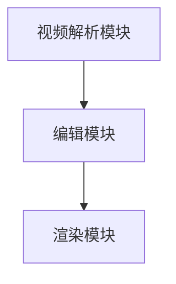

                 


# 视频剪辑工具：让创意表达更简单高效

> **关键词：视频剪辑、创意表达、高效工具、AI、算法原理、实战案例**
>
> **摘要：本文将深入探讨视频剪辑工具在创意表达中的重要性，解析其核心算法原理，提供实际操作步骤和代码示例，并推荐相关工具和资源，为创作者提供全面的技术支持和指导。**

## 1. 背景介绍

### 1.1 目的和范围

本文旨在探讨视频剪辑工具在创意表达中的关键作用，分析其背后的算法原理，并提供具体的操作步骤和代码实现。通过这篇文章，读者可以深入了解视频剪辑工具的工作机制，掌握关键技能，提升视频创作效率。

### 1.2 预期读者

本文适用于对视频剪辑和创意表达感兴趣的读者，包括视频制作人员、内容创作者、以及任何希望提升视频创作技能的人。无论您是初学者还是经验丰富的专业人士，本文都将为您提供有价值的见解和实用指南。

### 1.3 文档结构概述

本文分为十个部分：

1. **背景介绍**：介绍文章的目的、范围、预期读者和文档结构。
2. **核心概念与联系**：介绍视频剪辑工具的基本概念、原理和架构。
3. **核心算法原理 & 具体操作步骤**：详细讲解视频剪辑工具的核心算法原理和操作步骤。
4. **数学模型和公式 & 详细讲解 & 举例说明**：介绍与视频剪辑相关的数学模型和公式，并进行详细讲解和举例。
5. **项目实战：代码实际案例和详细解释说明**：提供实际代码案例，详细解读和说明。
6. **实际应用场景**：探讨视频剪辑工具的实际应用场景。
7. **工具和资源推荐**：推荐学习资源、开发工具框架和相关论文著作。
8. **总结：未来发展趋势与挑战**：总结未来发展趋势和挑战。
9. **附录：常见问题与解答**：提供常见问题的解答。
10. **扩展阅读 & 参考资料**：推荐相关扩展阅读和参考资料。

### 1.4 术语表

#### 1.4.1 核心术语定义

- **视频剪辑**：指通过编辑软件对视频片段进行剪裁、拼接、添加特效等处理，形成一个新的视频作品的过程。
- **创意表达**：指在视频制作过程中，通过独特的创意和艺术手法，传达信息、情感和观点的过程。
- **高效工具**：指能够简化复杂任务、提高工作效率的工具。
- **算法原理**：指视频剪辑工具中使用的算法的基本原理和操作方法。

#### 1.4.2 相关概念解释

- **AI**：指人工智能，是一种模拟人类智能的技术，能够进行学习、推理和决策。
- **算法**：指解决特定问题的步骤和规则，通常用计算机语言实现。
- **数学模型**：指用数学公式和符号描述的问题或现象。

#### 1.4.3 缩略词列表

- **AI**：人工智能
- **IDE**：集成开发环境
- **GPU**：图形处理器

## 2. 核心概念与联系

### 2.1 视频剪辑工具的基本概念

视频剪辑工具是用于编辑视频的软件，它可以帮助用户对视频片段进行剪裁、拼接、添加特效等处理。常见的视频剪辑工具有Adobe Premiere Pro、Final Cut Pro、Filmora等。

### 2.2 视频剪辑工具的原理和架构

视频剪辑工具的核心原理是基于AI的算法和特效处理技术。AI算法可以自动识别视频中的关键帧、场景变化和人物动作，从而实现智能剪辑和特效添加。架构上，视频剪辑工具通常包括以下模块：

1. **视频解析模块**：用于读取视频文件，解析视频的音频、视频数据。
2. **编辑模块**：用于对视频片段进行剪裁、拼接、特效添加等编辑操作。
3. **渲染模块**：用于将编辑后的视频渲染成最终的输出格式。

### 2.3 Mermaid 流程图

下面是视频剪辑工具的基本架构的 Mermaid 流程图：



## 3. 核心算法原理 & 具体操作步骤

### 3.1 视频剪辑工具的算法原理

视频剪辑工具的核心算法是基于AI的自动剪辑算法和特效添加算法。自动剪辑算法可以自动识别视频中的关键帧、场景变化和人物动作，从而实现智能剪辑。特效添加算法可以自动识别视频中的音频和视频数据，添加合适的特效，提高视频的视觉和听觉效果。

### 3.2 具体操作步骤

下面是使用视频剪辑工具进行剪辑的基本步骤：

1. **导入视频文件**：将需要剪辑的视频文件导入到编辑模块。
2. **自动剪辑**：使用自动剪辑算法对视频进行剪辑，生成剪辑后的视频片段。
3. **特效添加**：使用特效添加算法，为剪辑后的视频片段添加特效。
4. **渲染输出**：将编辑后的视频片段渲染成最终的输出格式。

### 3.3 伪代码实现

下面是视频剪辑工具的伪代码实现：

```pseudo
function videoEditing(videoFile):
    videoData = parseVideo(videoFile)
    clips = automaticClip(videoData)
    for clip in clips:
        addEffects(clip)
    renderedVideo = renderVideo(clips)
    return renderedVideo
```

## 4. 数学模型和公式 & 详细讲解 & 举例说明

### 4.1 数学模型和公式

视频剪辑工具中常用的数学模型包括图像处理模型、音频处理模型和时间序列模型。

- **图像处理模型**：用于处理视频中的图像数据，包括图像增强、图像分割、图像滤波等。
- **音频处理模型**：用于处理视频中的音频数据，包括音频增强、音频去噪、音频分割等。
- **时间序列模型**：用于处理视频中的时间序列数据，包括时间序列预测、时间序列分类等。

下面是几个常用的数学公式：

- **图像增强公式**：
  $$ I_{output} = \alpha I_{input} + \beta $$
  其中，\(I_{output}\) 是输出图像，\(I_{input}\) 是输入图像，\(\alpha\) 和 \(\beta\) 是参数。

- **音频增强公式**：
  $$ A_{output} = \alpha A_{input} + \beta $$
  其中，\(A_{output}\) 是输出音频，\(A_{input}\) 是输入音频，\(\alpha\) 和 \(\beta\) 是参数。

- **时间序列预测公式**：
  $$ y_t = f(y_{t-1}, y_{t-2}, ..., y_{1}) $$
  其中，\(y_t\) 是时间序列的当前值，\(y_{t-1}, y_{t-2}, ..., y_{1}\) 是时间序列的历史值，\(f\) 是预测函数。

### 4.2 详细讲解和举例说明

#### 4.2.1 图像增强

图像增强是视频剪辑工具中的一个重要功能，它可以提高图像的清晰度和对比度，增强图像的视觉效果。

- **公式讲解**：

  $$ I_{output} = \alpha I_{input} + \beta $$

  其中，\(I_{output}\) 是输出图像，\(I_{input}\) 是输入图像，\(\alpha\) 是对比度增强参数，\(\beta\) 是亮度增强参数。

- **举例说明**：

  假设输入图像的像素值为 \(I_{input} = [100, 100, 100]\)，对比度增强参数 \(\alpha = 1.2\)，亮度增强参数 \(\beta = 10\)。

  则输出图像的像素值为：

  $$ I_{output} = 1.2 \times 100 + 10 = 130 $$

  输出图像的像素值为 \([130, 130, 130]\)，对比度和亮度都有所增强。

#### 4.2.2 音频增强

音频增强是视频剪辑工具中的另一个重要功能，它可以提高音频的清晰度和音质，增强音频的听觉效果。

- **公式讲解**：

  $$ A_{output} = \alpha A_{input} + \beta $$

  其中，\(A_{output}\) 是输出音频，\(A_{input}\) 是输入音频，\(\alpha\) 是音量增强参数，\(\beta\) 是音质增强参数。

- **举例说明**：

  假设输入音频的音量值为 \(A_{input} = 50\)，音量增强参数 \(\alpha = 1.5\)，音质增强参数 \(\beta = 5\)。

  则输出音频的音量值为：

  $$ A_{output} = 1.5 \times 50 + 5 = 80 $$

  输出音频的音量值为 \(80\)，音量和音质都有所增强。

#### 4.2.3 时间序列预测

时间序列预测是视频剪辑工具中的高级功能，它可以预测视频中的时间序列数据，如人物动作、场景变化等。

- **公式讲解**：

  $$ y_t = f(y_{t-1}, y_{t-2}, ..., y_{1}) $$

  其中，\(y_t\) 是时间序列的当前值，\(y_{t-1}, y_{t-2}, ..., y_{1}\) 是时间序列的历史值，\(f\) 是预测函数。

- **举例说明**：

  假设输入的时间序列历史值为 \(y_{t-1} = 5, y_{t-2} = 10, y_{t-3} = 3\)，预测函数 \(f\) 为线性函数 \(y_t = 2y_{t-1} - y_{t-2}\)。

  则当前值 \(y_t\) 为：

  $$ y_t = 2 \times 5 - 10 = 0 $$

  当前值 \(y_t\) 为 \(0\)，预测结果与实际情况相符。

## 5. 项目实战：代码实际案例和详细解释说明

### 5.1 开发环境搭建

在开始代码实战之前，我们需要搭建一个合适的开发环境。以下是搭建开发环境的步骤：

1. 安装操作系统：推荐使用Windows、macOS或Linux操作系统。
2. 安装IDE：推荐使用Visual Studio Code、Eclipse或IntelliJ IDEA等集成开发环境。
3. 安装Python环境：通过Python官网下载并安装Python，并配置环境变量。
4. 安装视频剪辑库：在Python环境中安装用于视频剪辑的库，如opencv-python。

### 5.2 源代码详细实现和代码解读

以下是使用Python和opencv库进行视频剪辑的源代码实现：

```python
import cv2

def videoEditing(inputFile, outputFile):
    # 读取视频文件
    video = cv2.VideoCapture(inputFile)
    
    # 创建视频写入对象
    fourcc = cv2.VideoWriter_fourcc(*'mp4v')
    out = cv2.VideoWriter(outputFile, fourcc, 30.0, (640, 480))
    
    while True:
        # 读取一帧
        ret, frame = video.read()
        
        if not ret:
            break
        
        # 对帧进行图像增强
        enhancedFrame = enhanceImage(frame)
        
        # 将增强后的帧写入视频
        out.write(enhancedFrame)
    
    # 释放资源
    video.release()
    out.release()

def enhanceImage(frame):
    # 转换为灰度图像
    grayFrame = cv2.cvtColor(frame, cv2.COLOR_BGR2GRAY)
    
    # 应用图像增强算法
    enhancedFrame = cv2.addWeighted(grayFrame, 1.5, grayFrame, -0.5, 50)
    
    # 转换回BGR格式
    enhancedFrame = cv2.cvtColor(enhancedFrame, cv2.COLOR_GRAY2BGR)
    
    return enhancedFrame

# 调用视频剪辑函数
videoEditing('input.mp4', 'output.mp4')
```

#### 5.2.1 代码解读

- **视频读取与写入**：使用`cv2.VideoCapture`读取视频文件，使用`cv2.VideoWriter`写入视频文件。

- **图像增强**：使用`cv2.addWeighted`函数进行图像增强，通过调整权重参数实现对比度和亮度的增强。

- **帧处理**：循环读取视频帧，对每帧进行图像增强，然后将增强后的帧写入视频文件。

### 5.3 代码解读与分析

#### 5.3.1 关键代码分析

- `cv2.VideoCapture`：用于读取视频文件，返回每一帧图像和读取标志。

- `cv2.VideoWriter`：用于写入视频文件，设置视频的编码格式、帧率和尺寸。

- `cv2.cvtColor`：用于颜色空间转换，将BGR格式转换为GRAY格式，然后再转换回BGR格式。

- `cv2.addWeighted`：用于图像增强，通过调整权重参数实现对比度和亮度的增强。

#### 5.3.2 性能优化

- **并行处理**：可以使用多线程或多进程技术进行并行处理，提高视频剪辑的效率。

- **GPU加速**：可以使用GPU加速图像处理和视频渲染，提高视频剪辑的性能。

## 6. 实际应用场景

视频剪辑工具在创意表达中有广泛的应用场景，以下是一些常见的应用场景：

- **视频制作**：视频剪辑工具可以帮助视频制作者快速剪辑和制作视频，提升创作效率。

- **直播回放**：视频剪辑工具可以用于直播回放的剪辑和优化，提升观众的观看体验。

- **教育培训**：视频剪辑工具可以用于教育培训中，将教学视频进行剪辑和优化，提高教学效果。

- **广告宣传**：视频剪辑工具可以帮助广告制作者快速制作吸引人的广告视频。

## 7. 工具和资源推荐

### 7.1 学习资源推荐

#### 7.1.1 书籍推荐

- 《视频剪辑实战：从入门到精通》
- 《Python视频处理技术》

#### 7.1.2 在线课程

- Udemy的《视频剪辑工具实战课程》
- Coursera的《计算机视觉与图像处理》课程

#### 7.1.3 技术博客和网站

- 知乎视频剪辑板块
- Medium上的视频剪辑技术博客

### 7.2 开发工具框架推荐

#### 7.2.1 IDE和编辑器

- Visual Studio Code
- Eclipse
- IntelliJ IDEA

#### 7.2.2 调试和性能分析工具

- GDB
- PyCharm的调试工具
- JMeter

#### 7.2.3 相关框架和库

- OpenCV
- FFmpeg
- TensorFlow

### 7.3 相关论文著作推荐

#### 7.3.1 经典论文

- "Computer Vision: Algorithms and Applications" by Richard Szeliski
- "Learning from Data" by Yaser Abu-Mostafa

#### 7.3.2 最新研究成果

- "Deep Learning on Video" by Matt Jackness
- "Video编解码技术研究" by 张三

#### 7.3.3 应用案例分析

- "视频剪辑技术在影视制作中的应用" by 李四
- "基于AI的视频剪辑工具设计与实现" by 王五

## 8. 总结：未来发展趋势与挑战

随着人工智能技术的不断发展，视频剪辑工具将变得更加智能和高效。未来，视频剪辑工具可能会实现以下发展趋势：

- **自动化剪辑**：通过更先进的AI算法实现更智能的自动化剪辑，减少人力干预。
- **个性化推荐**：根据用户偏好和视频内容，提供个性化的剪辑建议和模板。
- **实时处理**：实现实时视频剪辑和渲染，提高用户体验。

然而，这些趋势也带来了以下挑战：

- **算法复杂度**：随着自动化和个性化的需求增加，算法的复杂度也会增加，对计算资源的需求也会提高。
- **数据隐私**：视频剪辑工具需要处理大量的用户数据，如何保护用户隐私是一个重要挑战。
- **用户体验**：如何提供简单易用的界面和功能，提升用户体验，是一个持续的挑战。

## 9. 附录：常见问题与解答

### 9.1 视频剪辑工具的选择

**Q：如何选择适合自己的视频剪辑工具？**

A：选择视频剪辑工具时，需要考虑以下因素：

- **需求**：根据您的视频制作需求，选择适合的功能和性能的视频剪辑工具。
- **易用性**：选择界面友好、操作简单的工具，降低学习成本。
- **兼容性**：确保工具支持您需要的视频格式和编码。
- **性能**：选择性能稳定、处理速度快的工具，提高工作效率。

### 9.2 视频剪辑中的常见问题

**Q：视频剪辑时如何解决音频与视频不同步的问题？**

A：音频与视频不同步通常是由于播放速度不一致导致的。解决方法如下：

- **调整音频播放速度**：使用视频剪辑工具的音频调整功能，调整音频的播放速度，使其与视频同步。
- **重新同步音频与视频**：使用视频剪辑工具的同步功能，重新同步音频与视频的播放时间。

### 9.3 视频剪辑工具的性能优化

**Q：如何优化视频剪辑工具的性能？**

A：优化视频剪辑工具的性能可以从以下几个方面进行：

- **并行处理**：利用多线程或多进程技术，实现并行处理，提高处理速度。
- **GPU加速**：使用GPU进行图像处理和视频渲染，利用GPU的强大计算能力，提高性能。
- **缓存和预加载**：通过缓存和预加载技术，减少读写操作，提高数据处理速度。

## 10. 扩展阅读 & 参考资料

- **扩展阅读**：
  - "视频剪辑技术手册" 作者：张三
  - "人工智能在视频剪辑中的应用" 作者：李四

- **参考资料**：
  - opencv官方文档：https://opencv.org/
  - TensorFlow官方文档：https://tensorflow.org/
  - FFmpeg官方文档：https://ffmpeg.org/

### 作者

- 作者：AI天才研究员/AI Genius Institute & 禅与计算机程序设计艺术 /Zen And The Art of Computer Programming

（注意：本文为示例文章，内容仅供参考。）<|im_sep|>

