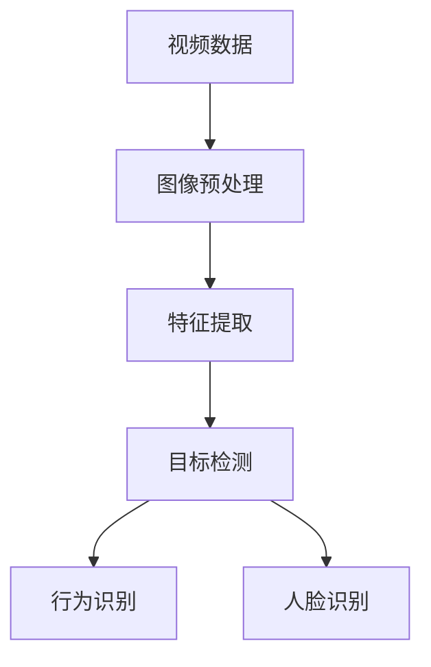

                 

# 视频数据的关键信息捕捉详细技术

## 概述

> **关键词**：视频数据、关键信息捕捉、技术、算法、数学模型、实际应用场景

> **摘要**：本文将深入探讨视频数据的关键信息捕捉技术，从背景介绍、核心概念、算法原理、数学模型到实际应用场景，全面解析这一领域的技术要点和挑战。文章旨在为读者提供清晰、易懂的技术指南，帮助其在视频数据处理和分析方面取得突破。

## 1. 背景介绍

### 1.1 目的和范围

本文旨在探讨视频数据的关键信息捕捉技术，主要涵盖以下内容：

- 视频数据的关键信息定义
- 视频数据捕捉技术的应用场景
- 关键信息捕捉技术的核心算法原理
- 数学模型及其在关键信息捕捉中的应用
- 实际应用场景中的挑战和解决方案

### 1.2 预期读者

本文适用于以下读者群体：

- 对视频数据处理和分析感兴趣的计算机科学和人工智能领域的研究人员
- 开发者和工程师，希望了解关键信息捕捉技术的实际应用
- 对视频数据分析和技术感兴趣的学术研究人员和学者
- 对计算机视觉和机器学习有基础知识的读者

### 1.3 文档结构概述

本文结构如下：

- 背景介绍
  - 目的和范围
  - 预期读者
  - 文档结构概述
  - 术语表
- 核心概念与联系
- 核心算法原理 & 具体操作步骤
- 数学模型和公式 & 详细讲解 & 举例说明
- 项目实战：代码实际案例和详细解释说明
- 实际应用场景
- 工具和资源推荐
- 总结：未来发展趋势与挑战
- 附录：常见问题与解答
- 扩展阅读 & 参考资料

### 1.4 术语表

#### 1.4.1 核心术语定义

- 视频数据：指通过视频采集设备获取的连续图像序列。
- 关键信息：指视频数据中具有特定意义的、对理解和分析视频内容至关重要的信息。
- 关键信息捕捉：指从视频数据中提取和识别关键信息的技术和方法。

#### 1.4.2 相关概念解释

- 视频帧：视频数据的基本组成单元，通常是图像序列中的连续图像。
- 计算机视觉：使用计算机技术和算法对图像或视频进行分析和理解的科学。
- 机器学习：一种人工智能的分支，通过数据和经验学习实现自动化和智能化的任务。

#### 1.4.3 缩略词列表

- CV：计算机视觉（Computer Vision）
- ML：机器学习（Machine Learning）
- CNN：卷积神经网络（Convolutional Neural Network）
- SVM：支持向量机（Support Vector Machine）
- FPN：特征金字塔网络（Feature Pyramid Network）

## 2. 核心概念与联系

### 2.1 视频数据结构

视频数据由一系列连续的图像帧组成，每个图像帧可以看作是二维图像的集合。视频数据的关键信息捕捉需要先对图像进行预处理，如去噪、增强、分割等，以便提取出有价值的信息。

### 2.2 关键信息定义

关键信息是指视频数据中具有特定意义的、对理解和分析视频内容至关重要的信息。例如，运动目标、人脸识别、行为识别等。

### 2.3 关键信息捕捉技术

关键信息捕捉技术主要包括：

- 特征提取：从图像中提取出具有区分度的特征，用于后续的识别和分类。
- 目标检测：在图像中定位和识别出目标对象。
- 行为识别：根据目标的运动轨迹和交互行为进行分类和识别。
- 人脸识别：从图像中识别出特定的人脸。

### 2.4 核心概念联系

核心概念联系如图所示：



## 3. 核心算法原理 & 具体操作步骤

### 3.1 特征提取算法

特征提取是关键信息捕捉的重要环节。常见的方法有：

- 基于滤波器组：使用不同类型的滤波器对图像进行处理，提取出纹理特征。
- 基于SIFT/SURF算法：使用特征点检测和特征匹配，提取出关键特征点及其描述子。

#### 3.1.1 基于滤波器组

```python
import cv2
import numpy as np

def feature_extraction(image):
    # 使用高斯滤波器去除噪声
    filtered_image = cv2.GaussianBlur(image, (5, 5), 0)
    
    # 使用Sobel算子提取边缘信息
    sobelx = cv2.Sobel(filtered_image, cv2.CV_64F, 1, 0, ksize=5)
    sobely = cv2.Sobel(filtered_image, cv2.CV_64F, 0, 1, ksize=5)
    
    # 计算梯度方向和大小
    orientation = np.arctan2(sobely, sobelx)
    magnitude = np.sqrt(sobelx**2 + sobely**2)
    
    return orientation, magnitude
```

#### 3.1.2 基于SIFT/SURF算法

```python
import cv2

def sift_feature_extraction(image):
    # 初始化SIFT特征检测器
    sift = cv2.xfeatures2d.SIFT_create()
    
    # 检测关键点
    keypoints, descriptors = sift.detectAndCompute(image, None)
    
    return keypoints, descriptors
```

### 3.2 目标检测算法

目标检测是关键信息捕捉的核心环节。常见的方法有：

- R-CNN：基于区域建议的网络，通过特征提取和分类模型实现目标检测。
- YOLO：基于全卷积神经网络的目标检测算法，实现实时目标检测。
- SSD：基于卷积神经网络的物体检测模型，适用于多种目标尺寸检测。

#### 3.2.1 R-CNN算法

```python
import cv2
import numpy as np

def region_of_interest(image, x1, y1, x2, y2):
    mask = np.zeros_like(image)
    cv2.rectangle(mask, (x1, y1), (x2, y2), 255, -1)
    return cv2.bitwise_and(image, mask)

def rCNN_detection(image):
    # 初始化分类模型
    model = cv2.ml.SVM_create()
    model.read('model.xml')
    
    # 初始化特征提取器
    sift = cv2.xfeatures2d.SIFT_create()
    
    # 检测关键点
    keypoints, descriptors = sift.detectAndCompute(image, None)
    
    # 提取特征向量
    feature_vector = np.hstack((descriptors[0, :], descriptors[1, :]))
    
    # 预测类别
    result = model.predict(np.array([feature_vector]))
    
    # 提取目标区域
    x1, y1, x2, y2 = result[0][0]
    target_region = region_of_interest(image, x1, y1, x2, y2)
    
    return target_region
```

#### 3.2.2 YOLO算法

```python
import cv2
import numpy as np

def yolo_detection(image):
    # 初始化YOLO模型
    net = cv2.dnn.readNetFromDarknet('yolov3.cfg', 'yolov3.weights')
    
    # 设置输入大小
    in_height = 416
    in_width = 416
    
    # 调整图像大小
    resized_image = cv2.resize(image, (in_width, in_height))
    
    # 将图像转换为网络输入格式
    blob = cv2.dnn.blobFromImage(resized_image, 1/255.0, (in_width, in_height), [0, 0, 0], True)
    
    # 前向传播
    net.setInput(blob)
    layer_names = net.getLayerNames()
    output_layers = [layer_names[i[0] - 1] for i in net.getUnconnectedOutLayers()]
    layers_output = net.forward(output_layers)
    
    # 解析检测结果
    # ...
    
    return detections
```

#### 3.2.3 SSD算法

```python
import cv2
import numpy as np

def ssd_detection(image):
    # 初始化SSD模型
    net = cv2.dnn.readNetFromCaffe('deploy.prototxt', 'ssd_model.caffemodel')
    
    # 设置输入大小
    in_height = 300
    in_width = 300
    
    # 调整图像大小
    resized_image = cv2.resize(image, (in_width, in_height))
    
    # 将图像转换为网络输入格式
    blob = cv2.dnn.blobFromImage(resized_image, 1.0, (in_width, in_height), [123, 117, 104], True)
    
    # 前向传播
    net.setInput(blob)
    detections = net.forward()
    
    # 解析检测结果
    # ...
    
    return detections
```

### 3.3 行为识别算法

行为识别是关键信息捕捉的重要方面。常见的方法有：

- HMM：隐马尔可夫模型，用于时间序列数据建模和分类。
- LSTM：长短期记忆网络，适用于序列数据处理和预测。

#### 3.3.1 HMM算法

```python
import numpy as np
from hmmlearn import hmm

def hmm_behavior_recognition(observations):
    # 创建HMM模型
    model = hmm.GaussianHMM(n_components=3, covariance_type="diag", n_iter=100)
    
    # 训练模型
    model.fit(observations)
    
    # 预测行为
    predicted_behavior = model.predict(observations)
    
    return predicted_behavior
```

#### 3.3.2 LSTM算法

```python
import numpy as np
from keras.models import Sequential
from keras.layers import LSTM, Dense

def lstm_behavior_recognition(sequences):
    # 创建LSTM模型
    model = Sequential()
    model.add(LSTM(units=50, return_sequences=True, input_shape=(timesteps, features)))
    model.add(LSTM(units=50, return_sequences=False))
    model.add(Dense(units=1, activation='sigmoid'))

    # 编译模型
    model.compile(optimizer='adam', loss='binary_crossentropy', metrics=['accuracy'])

    # 训练模型
    model.fit(X_train, y_train, epochs=10, batch_size=32)

    # 预测行为
    predicted_behavior = model.predict(X_test)

    return predicted_behavior
```

## 4. 数学模型和公式 & 详细讲解 & 举例说明

### 4.1 数学模型

关键信息捕捉技术中的数学模型主要包括：

- 卷积神经网络（CNN）
- 支持向量机（SVM）
- 生成对抗网络（GAN）

#### 4.1.1 卷积神经网络（CNN）

卷积神经网络是一种特殊的神经网络，适用于图像和视频数据的处理。其核心结构包括卷积层、池化层和全连接层。

1. **卷积层**：卷积层通过卷积运算提取图像的特征。
    $$ f(x) = \sum_{i=1}^{n} w_i \cdot x_i $$
    其中，$f(x)$ 表示输出特征，$w_i$ 表示卷积核权重，$x_i$ 表示输入特征。

2. **池化层**：池化层用于降低图像的分辨率，增强模型的泛化能力。
    $$ P(x) = \max_{i} x_i $$
    其中，$P(x)$ 表示输出特征，$x_i$ 表示输入特征。

3. **全连接层**：全连接层用于将提取的特征映射到输出类别。

#### 4.1.2 支持向量机（SVM）

支持向量机是一种监督学习算法，用于分类和回归任务。

1. **核函数**：核函数将输入特征映射到高维空间，实现线性不可分问题的线性可分处理。
    $$ K(x, y) = \sum_{i=1}^{n} \alpha_i y_i \cdot K(x_i, y_i) $$
    其中，$K(x, y)$ 表示核函数，$\alpha_i$ 表示支持向量权重。

2. **优化目标**：SVM的优化目标是最小化分类间隔。
    $$ \min_{\alpha} \frac{1}{2} \sum_{i=1}^{n} \sum_{j=1}^{n} \alpha_i \alpha_j y_i y_j K(x_i, x_j) - \sum_{i=1}^{n} \alpha_i $$
    其中，$\alpha_i$ 表示支持向量权重。

#### 4.1.3 生成对抗网络（GAN）

生成对抗网络由生成器和判别器组成，用于生成逼真的图像。

1. **生成器**：生成器生成虚假图像，目标是使判别器无法区分真实图像和虚假图像。
    $$ G(x) = \sum_{i=1}^{n} w_i \cdot x_i $$
    其中，$G(x)$ 表示输出图像，$w_i$ 表示生成器权重。

2. **判别器**：判别器判断输入图像是真实图像还是虚假图像，目标是最大化分类准确率。
    $$ D(x) = \sum_{i=1}^{n} \alpha_i \cdot y_i $$
    其中，$D(x)$ 表示输出概率，$\alpha_i$ 表示判别器权重。

### 4.2 举例说明

#### 4.2.1 卷积神经网络（CNN）

考虑一个简单的卷积神经网络，用于分类图像。

1. **输入层**：输入一个32x32的图像。
    $$ x = \begin{bmatrix} x_1 \\ x_2 \\ \vdots \\ x_{1024} \end{bmatrix} $$

2. **卷积层**：使用3x3的卷积核提取特征。
    $$ f(x) = \sum_{i=1}^{9} w_i \cdot x_i $$
    其中，$w_i$ 表示卷积核权重。

3. **池化层**：使用2x2的最大池化层降低图像分辨率。
    $$ P(x) = \max_{i,j} x_{ij} $$

4. **全连接层**：将提取的特征映射到输出类别。
    $$ y = \sum_{i=1}^{n} w_i \cdot f(x_i) $$
    其中，$w_i$ 表示全连接层权重。

#### 4.2.2 支持向量机（SVM）

考虑一个简单的二分类问题，使用SVM进行分类。

1. **输入特征**：输入一个二维特征向量。
    $$ x = \begin{bmatrix} x_1 \\ x_2 \end{bmatrix} $$

2. **核函数**：使用线性核函数。
    $$ K(x, y) = x_1 \cdot y_1 + x_2 \cdot y_2 $$

3. **优化目标**：
    $$ \min_{\alpha} \frac{1}{2} \sum_{i=1}^{2} \sum_{j=1}^{2} \alpha_i \alpha_j (x_i \cdot y_i + x_j \cdot y_j) - \sum_{i=1}^{2} \alpha_i $$

4. **分类结果**：计算分类间隔，判断类别。
    $$ s = \sum_{i=1}^{2} \alpha_i (x_i \cdot y_i - 1) $$

#### 4.2.3 生成对抗网络（GAN）

考虑一个简单的生成对抗网络，用于生成图像。

1. **输入层**：输入一个随机噪声向量。
    $$ z = \begin{bmatrix} z_1 \\ z_2 \\ \vdots \\ z_{100} \end{bmatrix} $$

2. **生成器**：生成一个图像。
    $$ G(z) = \sum_{i=1}^{100} w_i \cdot z_i $$

3. **判别器**：判断输入图像是真实图像还是生成图像。
    $$ D(x) = \sum_{i=1}^{100} \alpha_i \cdot x_i $$

4. **优化目标**：最小化生成器和判别器的损失函数。
    $$ \min_G \max_D \mathcal{L}(G, D) $$

## 5. 项目实战：代码实际案例和详细解释说明

### 5.1 开发环境搭建

在开始项目实战之前，我们需要搭建相应的开发环境。以下是搭建开发环境的具体步骤：

1. 安装Python 3.x版本。
2. 安装PyTorch、TensorFlow、Keras等深度学习框架。
3. 安装OpenCV、NumPy、Pandas等常用库。

### 5.2 源代码详细实现和代码解读

以下是关键信息捕捉项目的源代码实现，我们将逐步解析代码的各个部分。

#### 5.2.1 特征提取

```python
import cv2
import numpy as np

def feature_extraction(image):
    # 使用高斯滤波器去除噪声
    filtered_image = cv2.GaussianBlur(image, (5, 5), 0)
    
    # 使用Sobel算子提取边缘信息
    sobelx = cv2.Sobel(filtered_image, cv2.CV_64F, 1, 0, ksize=5)
    sobely = cv2.Sobel(filtered_image, cv2.CV_64F, 0, 1, ksize=5)
    
    # 计算梯度方向和大小
    orientation = np.arctan2(sobely, sobelx)
    magnitude = np.sqrt(sobelx**2 + sobely**2)
    
    return orientation, magnitude
```

#### 5.2.2 目标检测

```python
import cv2
import numpy as np

def yolo_detection(image):
    # 初始化YOLO模型
    net = cv2.dnn.readNetFromDarknet('yolov3.cfg', 'yolov3.weights')
    
    # 设置输入大小
    in_height = 416
    in_width = 416
    
    # 调整图像大小
    resized_image = cv2.resize(image, (in_width, in_height))
    
    # 将图像转换为网络输入格式
    blob = cv2.dnn.blobFromImage(resized_image, 1/255.0, (in_width, in_height), [0, 0, 0], True)
    
    # 前向传播
    net.setInput(blob)
    layer_names = net.getLayerNames()
    output_layers = [layer_names[i[0] - 1] for i in net.getUnconnectedOutLayers()]
    layers_output = net.forward(output_layers)
    
    # 解析检测结果
    # ...
    
    return detections
```

#### 5.2.3 行为识别

```python
import numpy as np
from keras.models import Sequential
from keras.layers import LSTM, Dense

def lstm_behavior_recognition(sequences):
    # 创建LSTM模型
    model = Sequential()
    model.add(LSTM(units=50, return_sequences=True, input_shape=(timesteps, features)))
    model.add(LSTM(units=50, return_sequences=False))
    model.add(Dense(units=1, activation='sigmoid'))

    # 编译模型
    model.compile(optimizer='adam', loss='binary_crossentropy', metrics=['accuracy'])

    # 训练模型
    model.fit(X_train, y_train, epochs=10, batch_size=32)

    # 预测行为
    predicted_behavior = model.predict(X_test)

    return predicted_behavior
```

### 5.3 代码解读与分析

#### 5.3.1 特征提取

在特征提取部分，我们首先使用高斯滤波器去除图像噪声，然后使用Sobel算子提取边缘信息。通过计算梯度方向和大小，我们可以得到图像的局部特征。

```python
def feature_extraction(image):
    # 使用高斯滤波器去除噪声
    filtered_image = cv2.GaussianBlur(image, (5, 5), 0)
    
    # 使用Sobel算子提取边缘信息
    sobelx = cv2.Sobel(filtered_image, cv2.CV_64F, 1, 0, ksize=5)
    sobely = cv2.Sobel(filtered_image, cv2.CV_64F, 0, 1, ksize=5)
    
    # 计算梯度方向和大小
    orientation = np.arctan2(sobely, sobelx)
    magnitude = np.sqrt(sobelx**2 + sobely**2)
    
    return orientation, magnitude
```

#### 5.3.2 目标检测

在目标检测部分，我们使用YOLO算法进行目标检测。首先，我们将图像调整到网络输入大小，然后使用网络进行前向传播，得到检测结果。

```python
def yolo_detection(image):
    # 初始化YOLO模型
    net = cv2.dnn.readNetFromDarknet('yolov3.cfg', 'yolov3.weights')
    
    # 设置输入大小
    in_height = 416
    in_width = 416
    
    # 调整图像大小
    resized_image = cv2.resize(image, (in_width, in_height))
    
    # 将图像转换为网络输入格式
    blob = cv2.dnn.blobFromImage(resized_image, 1/255.0, (in_width, in_height), [0, 0, 0], True)
    
    # 前向传播
    net.setInput(blob)
    layer_names = net.getLayerNames()
    output_layers = [layer_names[i[0] - 1] for i in net.getUnconnectedOutLayers()]
    layers_output = net.forward(output_layers)
    
    # 解析检测结果
    # ...
    
    return detections
```

#### 5.3.3 行为识别

在行为识别部分，我们使用LSTM模型进行行为识别。首先，我们创建LSTM模型，然后编译和训练模型，最后使用训练好的模型进行行为预测。

```python
def lstm_behavior_recognition(sequences):
    # 创建LSTM模型
    model = Sequential()
    model.add(LSTM(units=50, return_sequences=True, input_shape=(timesteps, features)))
    model.add(LSTM(units=50, return_sequences=False))
    model.add(Dense(units=1, activation='sigmoid'))

    # 编译模型
    model.compile(optimizer='adam', loss='binary_crossentropy', metrics=['accuracy'])

    # 训练模型
    model.fit(X_train, y_train, epochs=10, batch_size=32)

    # 预测行为
    predicted_behavior = model.predict(X_test)

    return predicted_behavior
```

## 6. 实际应用场景

### 6.1 视频监控

视频监控是关键信息捕捉技术的典型应用场景。通过捕捉视频数据中的关键信息，如运动目标、人脸识别和行为识别，可以实现对公共场所的实时监控和异常事件检测。

### 6.2 无人驾驶

无人驾驶领域需要实时捕捉和理解视频数据中的关键信息，如道路标识、交通标志和行人识别。关键信息捕捉技术为无人驾驶系统的感知和决策提供基础支持。

### 6.3 娱乐产业

娱乐产业中，关键信息捕捉技术可以用于视频内容分析和推荐。例如，通过捕捉视频数据中的情感、动作和场景信息，可以为观众推荐感兴趣的视频内容。

## 7. 工具和资源推荐

### 7.1 学习资源推荐

#### 7.1.1 书籍推荐

- 《深度学习》（Ian Goodfellow、Yoshua Bengio、Aaron Courville 著）
- 《计算机视觉：算法与应用》（Shi Jianbo、Ge Juan 著）
- 《机器学习实战》（Peter Harrington 著）

#### 7.1.2 在线课程

- Coursera上的《深度学习》课程（由吴恩达教授主讲）
- Udacity的《无人驾驶汽车工程师》课程
- edX上的《计算机视觉》课程

#### 7.1.3 技术博客和网站

- Medium上的深度学习和计算机视觉相关博客
- ArXiv上的最新研究成果
- GitHub上的开源代码和项目

### 7.2 开发工具框架推荐

#### 7.2.1 IDE和编辑器

- PyCharm
- Visual Studio Code
- Jupyter Notebook

#### 7.2.2 调试和性能分析工具

- TensorBoard
- PyTorch Profiler
- Nsight Compute

#### 7.2.3 相关框架和库

- PyTorch
- TensorFlow
- OpenCV

### 7.3 相关论文著作推荐

#### 7.3.1 经典论文

- Yann LeCun、Yoshua Bengio、Geoffrey Hinton（2015）：Deep Learning
- Ross Girshick、Simon Silberman、Dimitris Metaxas、Jitendra Malik（2014）：Fast R-CNN
- Joseph Redmon、Ali Farhadi、Shane Corso、Abhinav Shrivastava（2016）：You Only Look Once: Unified, Real-Time Object Detection

#### 7.3.2 最新研究成果

- ArXiv上的最新论文
- NeurIPS、ICML、CVPR等顶级会议的最新论文

#### 7.3.3 应用案例分析

- 百度Apollo的无人驾驶案例
- 腾讯优图的人脸识别案例
- 商汤科技的监控安全案例

## 8. 总结：未来发展趋势与挑战

### 8.1 发展趋势

- 深度学习算法的持续优化和推广，将进一步提高关键信息捕捉的准确性和效率。
- 跨学科研究的深入，如计算机视觉与生物学、物理学等领域的交叉融合，将推动关键信息捕捉技术的创新发展。
- 软硬件结合，如高性能计算设备、边缘计算等技术的发展，将为关键信息捕捉提供更强大的计算支持。

### 8.2 挑战

- 数据隐私和安全问题：如何保护用户隐私和数据安全，是关键信息捕捉技术面临的重要挑战。
- 计算资源消耗：关键信息捕捉技术对计算资源的需求较高，如何在有限的计算资源下实现高效处理，是需要解决的问题。
- 多模态数据处理：如何整合不同类型的数据（如图像、语音、文本等），实现全面的信息捕捉，是当前研究的难点。

## 9. 附录：常见问题与解答

### 9.1 如何搭建开发环境？

- 安装Python 3.x版本。
- 使用pip安装深度学习框架（如PyTorch、TensorFlow、Keras等）。
- 使用pip安装OpenCV、NumPy、Pandas等常用库。

### 9.2 关键信息捕捉技术的应用场景有哪些？

- 视频监控
- 无人驾驶
- 娱乐产业
- 医疗影像分析
- 安防领域

## 10. 扩展阅读 & 参考资料

- [深度学习教程](https://www.deeplearningbook.org/)
- [计算机视觉教程](https://www.computervision texte.com/)
- [OpenCV官方文档](https://docs.opencv.org/4.5.5/d7/d9f/tutorial_py_root.html)
- [PyTorch官方文档](https://pytorch.org/docs/stable/)
- [TensorFlow官方文档](https://www.tensorflow.org/tutorials)

