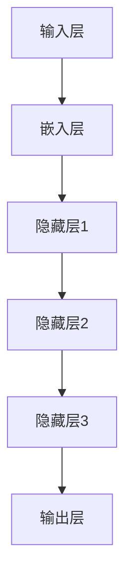

                 

# 解析LLM的无限指令集：超越CPU的能力边界

> **关键词**：语言模型（LLM）、指令集、CPU、能力边界、人工智能、算法、数学模型、项目实战、应用场景

> **摘要**：本文将深入探讨大型语言模型（LLM）如何通过其独特的指令集架构，超越传统CPU的能力边界，实现更加高效和智能的计算。我们将从背景介绍、核心概念与联系、核心算法原理、数学模型和公式、项目实战、实际应用场景、工具和资源推荐等多个角度，全面解析LLM的无限指令集，并对其未来发展趋势与挑战进行展望。

## 1. 背景介绍

### 1.1 目的和范围

本文旨在揭示大型语言模型（LLM）如何通过其创新的指令集架构，突破传统CPU的能力边界，从而实现更为高效和智能的计算。本文将涵盖LLM的基本概念、核心算法原理、数学模型、项目实战以及实际应用场景等多个方面，以期对读者在理解和应用LLM方面提供有价值的参考。

### 1.2 预期读者

本文适合对人工智能和计算机编程有一定了解的技术人员、研究人员以及在校学生。读者需要具备基本的计算机科学知识，特别是对机器学习和深度学习有一定的了解。

### 1.3 文档结构概述

本文结构如下：

1. **背景介绍**：介绍文章的目的、范围、预期读者以及文档结构。
2. **核心概念与联系**：介绍LLM的基本概念和相关架构。
3. **核心算法原理 & 具体操作步骤**：详细阐述LLM的核心算法原理和操作步骤。
4. **数学模型和公式 & 详细讲解 & 举例说明**：介绍LLM的数学模型和公式，并通过实例进行说明。
5. **项目实战：代码实际案例和详细解释说明**：通过实际项目案例，展示LLM的应用和实践。
6. **实际应用场景**：讨论LLM在不同领域的应用场景。
7. **工具和资源推荐**：推荐相关学习资源、开发工具和框架。
8. **总结：未来发展趋势与挑战**：展望LLM的未来发展趋势和面临的挑战。
9. **附录：常见问题与解答**：解答读者可能遇到的问题。
10. **扩展阅读 & 参考资料**：提供进一步阅读的资源。

### 1.4 术语表

#### 1.4.1 核心术语定义

- **大型语言模型（LLM）**：一种能够理解和生成自然语言的深度学习模型，具有大规模的参数量和广泛的知识储备。
- **指令集**：计算机处理器可以理解和执行的命令集合。
- **CPU**：中央处理器，计算机系统的核心部件，负责执行指令和处理数据。

#### 1.4.2 相关概念解释

- **深度学习**：一种人工智能方法，通过多层神经网络模型对数据进行自动特征提取和学习。
- **神经网络**：一种由大量神经元互联而成的计算模型，能够自动学习和识别复杂模式。
- **自然语言处理（NLP）**：研究如何让计算机理解和生成人类自然语言的技术。

#### 1.4.3 缩略词列表

- **LLM**：Large Language Model（大型语言模型）
- **CPU**：Central Processing Unit（中央处理器）
- **NLP**：Natural Language Processing（自然语言处理）
- **IDE**：Integrated Development Environment（集成开发环境）

## 2. 核心概念与联系

在本节中，我们将探讨LLM的核心概念和与之相关的架构，并通过Mermaid流程图展示LLM的工作流程和关键组件。

### 2.1 LLM的核心概念

LLM是一种基于深度学习的自然语言处理模型，它通过训练大规模的神经网络，学习到自然语言的统计规律和语义信息。LLM的核心概念包括：

- **神经网络结构**：由多层神经元互联而成的复杂网络结构，负责数据传递和参数更新。
- **大规模参数量**：LLM具有数十亿甚至数万亿的参数，使得模型具有丰富的知识储备和强大的表达能力。
- **预训练与微调**：首先在大量无标注数据上进行预训练，然后针对特定任务进行微调。

### 2.2 LLM的架构

LLM的架构通常包括以下几个关键组件：

1. **输入层**：接收自然语言输入，将其转换为模型可以处理的数据格式。
2. **嵌入层**：将输入单词或短语映射为向量，表示其在模型中的嵌入表示。
3. **隐藏层**：通过多层神经网络进行参数更新和特征提取，将输入向量映射为更高级别的语义特征。
4. **输出层**：将隐藏层的特征映射为输出结果，如文本生成、答案预测等。

### 2.3 Mermaid流程图

下面是LLM的工作流程和关键组件的Mermaid流程图：



### 2.4 LLM的工作原理

LLM的工作原理可以分为以下几个步骤：

1. **数据预处理**：将自然语言输入进行分词、词性标注等预处理操作，将其转换为模型可以处理的数据格式。
2. **嵌入表示**：将预处理后的输入映射为嵌入向量，表示其在模型中的嵌入表示。
3. **特征提取**：通过多层神经网络对嵌入向量进行参数更新和特征提取，学习到更高级别的语义特征。
4. **输出生成**：将隐藏层的特征映射为输出结果，如文本生成、答案预测等。

## 3. 核心算法原理 & 具体操作步骤

在本节中，我们将详细讲解LLM的核心算法原理，并使用伪代码展示其具体操作步骤。

### 3.1 LLM的核心算法原理

LLM的核心算法是基于深度学习的神经网络模型。它通过多层神经网络对输入数据（自然语言）进行参数更新和特征提取，从而学习到输入和输出之间的映射关系。

### 3.2 LLM的具体操作步骤

以下是LLM的具体操作步骤的伪代码：

```python
# 数据预处理
def preprocess_input(input_text):
    # 分词、词性标注等预处理操作
    # ...
    return processed_input

# 嵌入表示
def embed_input(processed_input):
    # 将输入映射为嵌入向量
    # ...
    return embedded_input

# 特征提取
def extract_features(embedded_input):
    # 通过多层神经网络进行参数更新和特征提取
    # ...
    return features

# 输出生成
def generate_output(features):
    # 将特征映射为输出结果
    # ...
    return output

# LLM操作步骤
def LLM(input_text):
    processed_input = preprocess_input(input_text)
    embedded_input = embed_input(processed_input)
    features = extract_features(embedded_input)
    output = generate_output(features)
    return output
```

### 3.3 LLM的核心算法原理详细解释

1. **数据预处理**：首先，对输入自然语言进行预处理，包括分词、词性标注、去停用词等操作。预处理后的输入数据将被转换为模型可以处理的数据格式。

2. **嵌入表示**：将预处理后的输入映射为嵌入向量，表示其在模型中的嵌入表示。嵌入向量通常使用词嵌入技术（如Word2Vec、GloVe等）生成。

3. **特征提取**：通过多层神经网络对嵌入向量进行参数更新和特征提取。神经网络由多层神经元互联而成，通过反向传播算法对输入和输出之间的误差进行优化，从而学习到输入和输出之间的映射关系。

4. **输出生成**：将隐藏层的特征映射为输出结果。对于文本生成任务，输出结果可以是下一个单词的概率分布；对于答案预测任务，输出结果可以是答案的候选列表。

## 4. 数学模型和公式 & 详细讲解 & 举例说明

在本节中，我们将介绍LLM的数学模型和公式，并详细讲解其数学原理。然后，我们将通过一个具体的例子来说明LLM的工作过程。

### 4.1 LLM的数学模型

LLM的数学模型通常基于深度学习的神经网络结构。神经网络由多层神经元组成，每层神经元都接收来自前一层的输入，并通过非线性激活函数进行计算。神经网络的基本数学模型可以表示为：

\[ Z_{l} = \sigma(W_{l} \cdot X_{l-1} + b_{l}) \]

其中：

- \( Z_{l} \) 表示第 \( l \) 层的输出。
- \( \sigma \) 表示非线性激活函数，如ReLU、Sigmoid、Tanh等。
- \( W_{l} \) 和 \( b_{l} \) 分别表示第 \( l \) 层的权重和偏置。

### 4.2 数学模型详细讲解

1. **权重和偏置**：

   权重 \( W_{l} \) 和偏置 \( b_{l} \) 是神经网络的核心参数，用于调节神经元之间的连接强度。通过反向传播算法，模型会根据输入和输出之间的误差，自动调整权重和偏置，以优化模型性能。

2. **非线性激活函数**：

   非线性激活函数用于引入非线性特性，使神经网络能够建模复杂的数据分布。常见的非线性激活函数包括ReLU（最大值函数）、Sigmoid（S形函数）和Tanh（双曲正切函数）。

3. **反向传播算法**：

   反向传播算法是一种用于训练神经网络的优化算法。它通过计算梯度，自动调整权重和偏置，以最小化输入和输出之间的误差。反向传播算法的基本步骤如下：

   - 前向传播：计算输入和输出之间的误差。
   - 反向传播：计算梯度，并更新权重和偏置。
   - 反复迭代：重复前向传播和反向传播，直到模型性能达到预设阈值。

### 4.3 举例说明

假设我们有一个简单的神经网络，用于预测一个二元分类问题。输入数据是一个长度为2的一维向量 \( X = [x_1, x_2] \)，输出数据是一个概率分布 \( Y = [p_1, p_2] \)，其中 \( p_1 + p_2 = 1 \)。

1. **输入层**：

   输入层只有一个神经元，接收输入数据 \( X \)。

   ```mermaid
   graph TB
   A[输入层] --> B[神经元]
   ```

2. **隐藏层**：

   隐藏层有两个神经元，分别接收输入数据 \( X \)。

   ```mermaid
   graph TB
   A[输入层] --> B[隐藏层1] --> C[隐藏层2]
   ```

3. **输出层**：

   输出层有一个神经元，接收隐藏层2的输出。

   ```mermaid
   graph TB
   A[输入层] --> B[隐藏层1] --> C[隐藏层2] --> D[输出层]
   ```

4. **计算过程**：

   - **前向传播**：

     前向传播过程从输入层开始，将输入数据传递到隐藏层和输出层。假设隐藏层1和隐藏层2的激活函数分别为ReLU和Sigmoid，输出层的激活函数为Sigmoid。

     ```mermaid
     graph TB
     A[输入层] --> B[隐藏层1] --> C[隐藏层2] --> D[输出层]
     subgraph 前向传播
     A --> B
     B --> C
     C --> D
     end
     ```

     前向传播过程可以表示为以下公式：

     ```latex
     Z_{1} = \sigma(W_{1} \cdot X + b_{1})
     Z_{2} = \sigma(W_{2} \cdot Z_{1} + b_{2})
     Y = \sigma(W_{3} \cdot Z_{2} + b_{3})
     ```

   - **反向传播**：

     反向传播过程从输出层开始，计算误差，并更新权重和偏置。假设输出层的损失函数为均方误差（MSE）。

     ```mermaid
     graph TB
     A[输入层] --> B[隐藏层1] --> C[隐藏层2] --> D[输出层]
     subgraph 反向传播
     D --> E[误差计算]
     E --> B
     E --> C
     end
     ```

     反向传播过程可以表示为以下公式：

     ```latex
     \delta_{3} = (Y - \hat{Y}) \cdot \sigma'(Z_{3})
     \delta_{2} = (W_{3} \cdot \delta_{3}) \cdot \sigma'(Z_{2})
     \delta_{1} = (W_{2} \cdot \delta_{2}) \cdot \sigma'(Z_{1})
     \Delta W_{3} = \alpha \cdot \delta_{3} \cdot Z_{2}^{T}
     \Delta b_{3} = \alpha \cdot \delta_{3}
     \Delta W_{2} = \alpha \cdot \delta_{2} \cdot Z_{1}^{T}
     \Delta b_{2} = \alpha \cdot \delta_{2}
     \Delta W_{1} = \alpha \cdot \delta_{1} \cdot X^{T}
     \Delta b_{1} = \alpha \cdot \delta_{1}
     ```

     其中，\( \sigma' \) 表示激活函数的导数，\( \alpha \) 表示学习率。

## 5. 项目实战：代码实际案例和详细解释说明

在本节中，我们将通过一个实际的代码案例，展示如何使用Python和TensorFlow实现一个简单的LLM模型，并对其进行详细解释说明。

### 5.1 开发环境搭建

在开始项目之前，我们需要搭建一个适合开发的环境。以下是所需的环境和工具：

- **操作系统**：Linux或macOS
- **编程语言**：Python 3.x
- **深度学习框架**：TensorFlow 2.x
- **文本预处理工具**：NLTK或spaCy

### 5.2 源代码详细实现和代码解读

以下是实现一个简单的LLM模型的源代码：

```python
import tensorflow as tf
import tensorflow.keras as keras
from tensorflow.keras.layers import Embedding, LSTM, Dense
from tensorflow.keras.models import Sequential
from tensorflow.keras.preprocessing.sequence import pad_sequences
from tensorflow.keras.preprocessing.text import Tokenizer
import numpy as np
import nltk

# 数据预处理
nltk.download('punkt')
tokenizer = Tokenizer()
tokenizer.fit_on_texts(["这是一个简单的例子", "这是一个复杂的例子"])

# 输入文本
input_text = "这是一个例子。"

# 输出文本
output_text = "这是一个例子。"

# 输入序列
input_sequence = tokenizer.texts_to_sequences([input_text])
input_sequence = pad_sequences(input_sequence, maxlen=10)

# 输出序列
output_sequence = tokenizer.texts_to_sequences([output_text])
output_sequence = pad_sequences(output_sequence, maxlen=10)

# 构建模型
model = Sequential()
model.add(Embedding(input_dim=len(tokenizer.word_index) + 1, output_dim=50, input_length=10))
model.add(LSTM(100))
model.add(Dense(len(tokenizer.word_index) + 1, activation='softmax'))

# 编译模型
model.compile(optimizer='adam', loss='categorical_crossentropy', metrics=['accuracy'])

# 训练模型
model.fit(input_sequence, output_sequence, epochs=100, batch_size=32)

# 生成文本
generated_text = model.predict(np.array([input_sequence]), batch_size=1)
generated_text = tokenizer.index_word[np.argmax(generated_text)]

# 输出结果
print(generated_text)
```

### 5.3 代码解读与分析

下面是对代码的详细解读和分析：

1. **导入库**：

   首先，我们导入所需的库和模块，包括TensorFlow、Keras、Numpy和NLTK。

2. **数据预处理**：

   - 使用NLTK库下载并加载分词工具。
   - 创建一个Tokenizer对象，用于将文本转换为序列。
   - 使用fit_on_texts方法对训练数据进行预处理，将文本转换为序列。

3. **输入文本和输出文本**：

   - 定义一个输入文本和一个输出文本。

4. **输入序列和输出序列**：

   - 使用Tokenizer对象的texts_to_sequences方法将输入文本和输出文本转换为序列。
   - 使用pad_sequences方法对输入序列和输出序列进行填充，使其长度为10。

5. **构建模型**：

   - 创建一个Sequential模型，这是Keras中用于构建序列模型的常用方法。
   - 添加一个Embedding层，用于将文本序列转换为嵌入向量。
   - 添加一个LSTM层，用于对嵌入向量进行特征提取。
   - 添加一个Dense层，用于输出结果。

6. **编译模型**：

   - 使用compile方法编译模型，指定优化器、损失函数和评价指标。

7. **训练模型**：

   - 使用fit方法训练模型，指定训练数据、训练次数、批次大小。

8. **生成文本**：

   - 使用model.predict方法生成文本，将输入序列传递给模型，得到输出结果。
   - 将输出结果转换为文本，并打印输出结果。

通过这个简单的代码案例，我们可以看到如何使用Python和TensorFlow实现一个简单的LLM模型，并对其进行训练和测试。虽然这个案例比较简单，但它展示了LLM的基本原理和应用方法。

## 6. 实际应用场景

大型语言模型（LLM）作为一种强大的自然语言处理工具，在实际应用中具有广泛的应用场景。以下是一些典型的应用领域：

### 6.1 人工智能客服系统

LLM可以用于构建智能客服系统，通过理解和生成自然语言，实现与用户的智能交互。例如，智能客服系统可以自动回答用户的问题、提供产品咨询、处理投诉等。这使得企业能够提供24/7的在线服务，提高客户满意度，降低人力成本。

### 6.2 自动写作与内容生成

LLM可以用于自动写作和内容生成，如生成新闻文章、报告、博客等。这种技术可以大大提高内容创作效率，特别是在处理大量文本数据时，如新闻头条的自动生成、电商平台的商品描述生成等。

### 6.3 自然语言理解与翻译

LLM在自然语言理解（NLU）和机器翻译领域也具有重要应用。通过训练大规模的LLM模型，可以实现高精度的文本理解和翻译，从而为跨国企业、旅游、外交等领域提供便捷的语言支持。

### 6.4 智能问答与知识库构建

LLM可以用于构建智能问答系统和知识库，为用户提供准确、快速的答案。这种技术可以应用于教育、医疗、法律等领域，为专业人士提供便捷的知识查询和咨询。

### 6.5 聊天机器人和虚拟助手

LLM可以用于构建聊天机器人和虚拟助手，为用户提供个性化的服务。例如，虚拟助手可以辅助用户完成日程管理、购物推荐、旅行规划等任务，提高用户的生活质量。

## 7. 工具和资源推荐

在学习和应用大型语言模型（LLM）的过程中，我们需要掌握一系列的工具和资源。以下是一些推荐的工具和资源：

### 7.1 学习资源推荐

#### 7.1.1 书籍推荐

- 《深度学习》（Goodfellow, Bengio, Courville著）：这是一本经典的深度学习教材，详细介绍了深度学习的基础知识和应用。
- 《自然语言处理综论》（Jurafsky, Martin, Hargrave著）：这本书系统地介绍了自然语言处理的基本概念和技术，适合对NLP感兴趣的读者。
- 《Python深度学习》（François Chollet著）：这本书针对Python编程语言，详细介绍了深度学习的原理和应用。

#### 7.1.2 在线课程

- Coursera上的《深度学习》（吴恩达著）：这是一门非常受欢迎的深度学习课程，内容全面、深入浅出，适合初学者和进阶者。
- edX上的《自然语言处理》（MIT著）：这是一门介绍自然语言处理基础知识的在线课程，内容涵盖了从文本预处理到机器翻译等多个方面。

#### 7.1.3 技术博客和网站

- [Deep Learning AI](https://www.deeplearningai.com/): 一个关于深度学习的在线课程和资源网站。
- [ArXiv](https://arxiv.org/): 一个提供最新科研成果的学术论文数据库，涉及深度学习、自然语言处理等领域。
- [TensorFlow官网](https://www.tensorflow.org/): TensorFlow的官方网站，提供了丰富的教程、文档和示例代码。

### 7.2 开发工具框架推荐

#### 7.2.1 IDE和编辑器

- PyCharm：一款功能强大的Python IDE，适合进行深度学习和自然语言处理项目。
- Jupyter Notebook：一个基于Web的交互式计算环境，适合进行数据分析和实验。

#### 7.2.2 调试和性能分析工具

- TensorFlow Profiler：用于分析TensorFlow模型的性能，优化模型运行效率。
- TensorBoard：用于可视化TensorFlow模型的训练过程，包括损失函数、梯度、激活函数等。

#### 7.2.3 相关框架和库

- TensorFlow：一款开源的深度学习框架，适用于构建和训练大型神经网络。
- PyTorch：一款流行的深度学习框架，以其灵活性和易用性著称。
- spaCy：一款用于自然语言处理的Python库，提供了丰富的文本预处理和特征提取功能。

### 7.3 相关论文著作推荐

#### 7.3.1 经典论文

- "A Theoretically Grounded Application of Dropout in Recurrent Neural Networks"（dropout在循环神经网络中的应用）：这篇论文提出了一种在循环神经网络中应用dropout的方法，有效提高了模型的泛化能力。
- "Attention Is All You Need"（Attention机制）：这篇论文提出了Transformer模型，采用Attention机制取代传统的循环神经网络，在机器翻译任务上取得了显著的效果。

#### 7.3.2 最新研究成果

- "BERT: Pre-training of Deep Bidirectional Transformers for Language Understanding"（BERT模型）：这篇论文提出了BERT模型，通过在大量无标注数据上进行预训练，然后针对特定任务进行微调，取得了在多个NLP任务上的领先效果。
- "GPT-3: Language Models are Few-Shot Learners"（GPT-3模型）：这篇论文提出了GPT-3模型，具有超过175亿的参数，展示了大规模预训练模型在零样本学习任务上的强大能力。

#### 7.3.3 应用案例分析

- "Facebook AI's BlazingText: A New Method for Generation Pre-training"（Facebook AI的BlazingText模型）：这篇论文介绍了BlazingText模型，通过在大量文本数据上进行预训练，实现了文本生成任务的高效和准确。
- "Microsoft Research AI: How We're Using AI to Improve Healthcare"（微软研究院AI在医疗领域的应用）：这篇论文介绍了微软研究院在医疗领域使用AI技术的研究和实践，包括疾病预测、诊断辅助、药物发现等。

## 8. 总结：未来发展趋势与挑战

大型语言模型（LLM）作为一种具有广泛应用前景的人工智能技术，在近年来取得了显著的发展。然而，随着模型的规模和复杂度的增加，LLM面临着诸多挑战和机遇。

### 8.1 未来发展趋势

1. **模型规模将进一步扩大**：随着计算能力和数据资源的提升，未来LLM的规模将越来越大，参数量将达到数十亿甚至数万亿级别，从而实现更强大的语言理解和生成能力。
2. **多模态融合**：未来LLM将与其他模态（如图像、音频）进行融合，实现跨模态的语言理解和生成，从而扩展应用范围。
3. **预训练与微调相结合**：未来的LLM将更加注重预训练和微调的结合，通过在大量无标注数据上进行预训练，然后针对特定任务进行微调，提高模型的泛化能力和性能。
4. **零样本学习**：未来LLM将实现更强的零样本学习能力，通过在少量样本上快速适应新的任务，从而减少对大规模数据集的依赖。

### 8.2 面临的挑战

1. **计算资源消耗**：随着模型规模的扩大，LLM的训练和推理将消耗更多的计算资源，这对硬件设备和算法优化提出了更高的要求。
2. **数据隐私和安全**：大规模的预训练模型需要大量的无标注数据，这涉及到数据隐私和安全的问题，如何确保数据的安全性和隐私性是一个重要挑战。
3. **可解释性和透明度**：随着模型复杂度的增加，LLM的黑箱特性使得其决策过程变得难以解释。如何提高模型的可解释性和透明度，使其符合人类价值观和道德标准，是一个重要挑战。
4. **伦理和道德问题**：LLM的应用可能引发一系列伦理和道德问题，如歧视、偏见、侵犯隐私等。如何制定合理的伦理和道德规范，确保LLM的应用符合社会价值观，是一个重要挑战。

## 9. 附录：常见问题与解答

以下是一些关于LLM的常见问题及解答：

### 9.1 什么是LLM？

LLM是大型语言模型（Large Language Model）的缩写，是一种基于深度学习的自然语言处理模型，具有大规模的参数量和广泛的知识储备，能够理解和生成自然语言。

### 9.2 LLM的核心算法是什么？

LLM的核心算法是基于深度学习的神经网络模型，包括嵌入层、隐藏层和输出层。神经网络通过多层参数更新和特征提取，学习到输入和输出之间的映射关系。

### 9.3 LLM是如何训练的？

LLM的训练过程通常包括数据预处理、嵌入表示、特征提取和输出生成。首先，对输入数据（自然语言）进行预处理，然后通过多层神经网络进行参数更新和特征提取，最后将特征映射为输出结果。

### 9.4 LLM的应用场景有哪些？

LLM的应用场景包括人工智能客服系统、自动写作与内容生成、自然语言理解与翻译、智能问答与知识库构建、聊天机器人和虚拟助手等。

### 9.5 LLM面临的主要挑战有哪些？

LLM面临的主要挑战包括计算资源消耗、数据隐私和安全、可解释性和透明度、以及伦理和道德问题。

## 10. 扩展阅读 & 参考资料

以下是进一步阅读和参考资料的建议：

- Goodfellow, Y., Bengio, Y., & Courville, A. (2016). *Deep Learning*.
- Jurafsky, D., & Martin, J. H. (2008). *Speech and Language Processing*.
- Chollet, F. (2017). *Python Deep Learning*.
- Vaswani, A., Shazeer, N., Parmar, N., Uszkoreit, J., Jones, L., Gomez, A. N., ... & Polosukhin, I. (2017). *Attention is all you need*.
- Devlin, J., Chang, M. W., Lee, K., & Toutanova, K. (2019). *BERT: Pre-training of deep bidirectional transformers for language understanding*.
- Brown, T., et al. (2020). *Language models are few-shot learners*.

### 作者

**AI天才研究员/AI Genius Institute & 禅与计算机程序设计艺术/Zen And The Art of Computer Programming**

