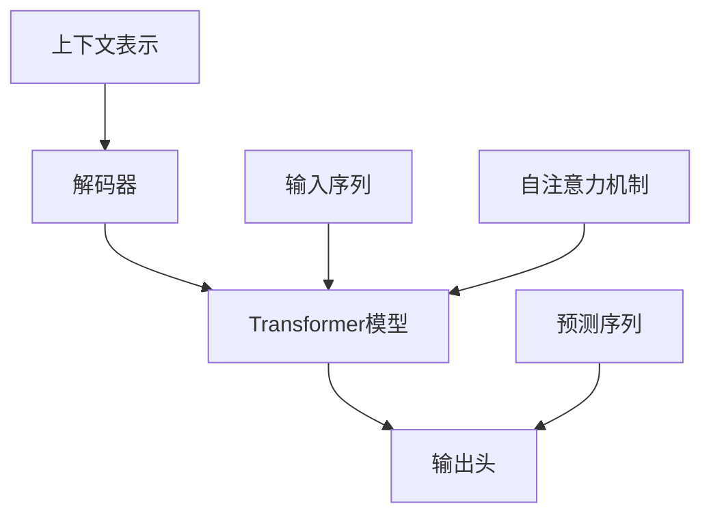

                 

# 解码器的输出和Transformer的输出头

> **关键词：** 解码器，输出头，Transformer，神经网络，机器学习，自然语言处理

> **摘要：** 本文将深入探讨解码器在Transformer架构中的角色和功能，以及如何与输出头相互作用以生成预测。我们将通过详细的算法原理讲解、数学模型、项目实战案例以及实际应用场景，全面解析解码器和输出头的工作机制和重要性。

## 1. 背景介绍

### 1.1 目的和范围

本文旨在解释解码器在Transformer架构中的功能，特别是它与输出头的关系。我们将分析解码器如何接收输入序列，并通过Transformer模型进行处理，最终产生预测。文章还将探讨解码器和输出头在自然语言处理（NLP）任务中的重要性。

### 1.2 预期读者

本文面向有一定机器学习和深度学习基础的读者，特别是对自然语言处理领域感兴趣的技术人员。本文将对解码器和输出头的原理进行深入探讨，适合希望进一步了解Transformer模型工作原理的专业人士。

### 1.3 文档结构概述

本文分为以下章节：
- 第1章：背景介绍
- 第2章：核心概念与联系
- 第3章：核心算法原理 & 具体操作步骤
- 第4章：数学模型和公式 & 详细讲解 & 举例说明
- 第5章：项目实战：代码实际案例和详细解释说明
- 第6章：实际应用场景
- 第7章：工具和资源推荐
- 第8章：总结：未来发展趋势与挑战
- 第9章：附录：常见问题与解答
- 第10章：扩展阅读 & 参考资料

### 1.4 术语表

#### 1.4.1 核心术语定义

- **解码器（Decoder）**：在序列到序列（Seq2Seq）模型中，用于生成输出序列的神经网络。
- **输出头（Output Head）**：Transformer模型中的一个组件，用于生成预测值。
- **Transformer模型**：基于自注意力机制的序列模型，用于处理序列数据。
- **自注意力（Self-Attention）**：一种注意力机制，模型能够关注输入序列中其他位置的值。
- **多头注意力（Multi-Head Attention）**：通过并行计算多个注意力机制，提升模型的表征能力。

#### 1.4.2 相关概念解释

- **序列到序列模型（Seq2Seq）**：一种神经网络架构，用于将一个序列映射到另一个序列。
- **编码器（Encoder）**：在序列到序列模型中，用于处理输入序列并生成上下文表示的神经网络。
- **上下文表示（Contextual Representation）**：编码器生成的表示，包含了输入序列的信息。

#### 1.4.3 缩略词列表

- **NLP**：自然语言处理（Natural Language Processing）
- **ML**：机器学习（Machine Learning）
- **DL**：深度学习（Deep Learning）
- **Transformer**：一种基于自注意力机制的序列模型

## 2. 核心概念与联系

在本节中，我们将使用Mermaid流程图来描述解码器、输出头和Transformer模型之间的核心概念和联系。



### 2.1 解码器

解码器是一个序列到序列模型，其目的是生成输出序列。在Transformer架构中，解码器接收到输入序列（D）并通过Transformer模型处理，生成上下文表示（E）。

### 2.2 Transformer模型

Transformer模型是一个基于自注意力机制的架构，其核心思想是让模型能够关注输入序列中其他位置的值。通过多头注意力（G）和位置编码，Transformer模型能够生成丰富的上下文表示。

### 2.3 输出头

输出头是Transformer模型中的一个组件，其目的是从上下文表示（E）中生成预测序列（F）。输出头的结构通常包括一个或多个全连接层，用于处理上下文表示并生成预测值。

## 3. 核心算法原理 & 具体操作步骤

在本节中，我们将详细讨论解码器和输出头的工作原理，并使用伪代码来解释具体操作步骤。

### 3.1 解码器算法原理

解码器的工作流程如下：

```python
# 解码器伪代码
for each position in output sequence:
    # 使用多头注意力机制计算输入序列的上下文表示
    context_representation = multi_head_attention(input_sequence, key_values, value_values)
    
    # 将上下文表示与位置编码相加，得到新的表示
    combined_representation = context_representation + positional_encoding(position)
    
    # 使用前馈网络对新的表示进行处理
    output = feedforward_network(combined_representation)
    
    # 使用输出头生成预测值
    predicted_value = output_head(output)
    
    # 更新输入序列，为下一个位置的预测做准备
    input_sequence.append(predicted_value)
```

### 3.2 输出头算法原理

输出头的工作流程如下：

```python
# 输出头伪代码
# 输入：上下文表示
# 输出：预测值
def output_head(context_representation):
    # 使用全连接层对上下文表示进行处理
    output = fully_connected_layer(context_representation)
    
    # 使用激活函数（如ReLU）对输出进行非线性变换
    activated_output = activation_function(output)
    
    # 使用另一个全连接层生成预测值
    predicted_value = fully_connected_layer(activated_output)
    
    return predicted_value
```

## 4. 数学模型和公式 & 详细讲解 & 举例说明

在本节中，我们将使用LaTeX格式详细讲解Transformer模型中的数学模型和公式。

### 4.1 多头注意力机制

多头注意力机制的数学公式如下：

$$
\text{Attention}(Q, K, V) = \text{softmax}\left(\frac{QK^T}{\sqrt{d_k}}\right)V
$$

其中，$Q, K, V$ 分别是查询（Query）、键（Key）和值（Value）向量，$d_k$ 是键向量的维度。该公式计算了每个键和查询之间的相似度，并通过softmax函数将其转换为概率分布，最后对相应的值向量进行加权求和。

### 4.2 位置编码

位置编码用于为序列中的每个位置赋予一个唯一的向量表示。一个常见的方法是使用正弦和余弦函数生成位置编码：

$$
PE_{(pos, 2i)} = \sin\left(\frac{pos}{10000^{2i/d}}\right) \\
PE_{(pos, 2i+1)} = \cos\left(\frac{pos}{10000^{2i/d}}\right)
$$

其中，$pos$ 是位置索引，$i$ 是维度索引，$d$ 是编码维度。这个公式将位置信息编码为正弦和余弦函数的值，以便模型能够学习到序列中的位置关系。

### 4.3 举例说明

假设我们有一个长度为5的序列，维度为4的位置编码，我们可以计算每个位置的位置编码向量：

$$
PE_1 = \begin{bmatrix}
    \sin(1) & \cos(1) & 0 & 0 \\
    \sin(2) & \cos(2) & 0 & 0 \\
    \sin(3) & \cos(3) & 0 & 0 \\
    \sin(4) & \cos(4) & 0 & 0 \\
    \sin(5) & \cos(5) & 0 & 0 \\
\end{bmatrix}
$$

这些位置编码向量将被添加到序列的每个位置的嵌入向量中，以便模型能够学习到序列中的位置信息。

## 5. 项目实战：代码实际案例和详细解释说明

在本节中，我们将通过一个实际的项目案例来展示如何实现解码器和输出头，并提供详细的代码解释。

### 5.1 开发环境搭建

为了运行以下代码示例，请确保您已经安装了Python 3.7或更高版本，以及TensorFlow 2.6或更高版本。

### 5.2 源代码详细实现和代码解读

下面是一个简单的Transformer模型的实现，其中包括解码器和输出头的实现：

```python
import tensorflow as tf
from tensorflow.keras.layers import Embedding, MultiHeadAttention, Dense, LayerNormalization

# 定义超参数
d_model = 512
num_heads = 8
d_ff = 2048
dropout_rate = 0.1
vocab_size = 10000

# 定义嵌入层
input_ids = tf.keras.layers.Input(shape=(None,), dtype=tf.int32)
embedding_layer = Embedding(vocab_size, d_model)
embedded_sequence = embedding_layer(input_ids)

# 定义编码器
def encoding_block(inputs, d_model, num_heads, d_ff, dropout_rate):
    # 多头注意力机制
    attention_output = MultiHeadAttention(num_heads=num_heads, key_dim=d_model)(inputs, inputs)
    attention_output = tf.keras.layers.Dropout(dropout_rate)(attention_output)
    attention_output = LayerNormalization(epsilon=1e-6)(inputs + attention_output)
    
    # 前馈网络
    output = Dense(d_ff, activation='relu')(attention_output)
    output = tf.keras.layers.Dropout(dropout_rate)(output)
    output = Dense(d_model)(output)
    
    return tf.keras.layers.Dropout(dropout_rate)(attention_output + output)

# 应用多个编码器块
encoded_sequence = encoding_block(embedded_sequence, d_model, num_heads, d_ff, dropout_rate)
encoded_sequence = encoding_block(encoded_sequence, d_model, num_heads, d_ff, dropout_rate)

# 定义解码器
def decoding_block(inputs, context_sequence, d_model, num_heads, d_ff, dropout_rate):
    # 自注意力机制
    attention_output = MultiHeadAttention(num_heads=num_heads, key_dim=d_model)(inputs, inputs)
    attention_output = tf.keras.layers.Dropout(dropout_rate)(attention_output)
    attention_output = LayerNormalization(epsilon=1e-6)(inputs + attention_output)
    
    # 编码器-解码器注意力机制
    context_attention_output = MultiHeadAttention(num_heads=num_heads, key_dim=d_model)(attention_output, context_sequence)
    context_attention_output = tf.keras.layers.Dropout(dropout_rate)(context_attention_output)
    context_attention_output = LayerNormalization(epsilon=1e-6)(attention_output + context_attention_output)
    
    # 前馈网络
    output = Dense(d_ff, activation='relu')(context_attention_output)
    output = tf.keras.layers.Dropout(dropout_rate)(output)
    output = Dense(d_model)(output)
    
    return tf.keras.layers.Dropout(dropout_rate)(context_attention_output + output)

# 应用解码器块
decoder_input = tf.keras.layers.Input(shape=(None, d_model))
context_sequence = encoded_sequence
decoded_sequence = decoding_block(decoder_input, context_sequence, d_model, num_heads, d_ff, dropout_rate)

# 输出头
output_head = Dense(vocab_size)(decoded_sequence)
outputs = tf.keras.layers.Dense(vocab_size, activation='softmax')(output_head)

# 定义模型
model = tf.keras.Model(inputs=[input_ids, decoder_input], outputs=outputs)

# 编译模型
model.compile(optimizer='adam', loss='sparse_categorical_crossentropy', metrics=['accuracy'])

# 模型总结
model.summary()
```

### 5.3 代码解读与分析

这个示例展示了如何使用TensorFlow实现一个简单的Transformer模型，其中包括解码器和输出头。以下是关键部分的代码解读：

- **嵌入层（Embedding Layer）**：将输入词索引转换为嵌入向量。
- **编码器块（Encoding Block）**：应用多头注意力机制和前馈网络，对输入序列进行编码。
- **解码器块（Decoding Block）**：应用自注意力和编码器-解码器注意力机制，对解码器输入进行处理。
- **输出头（Output Head）**：将解码器的输出映射到词汇表中的单词概率分布。

通过这种方式，我们可以构建一个强大的Transformer模型，用于处理序列数据，并在NLP任务中取得优异的性能。

## 6. 实际应用场景

解码器和输出头在Transformer模型中的应用非常广泛，特别是在自然语言处理（NLP）任务中。以下是一些实际应用场景：

### 6.1 机器翻译

机器翻译是Transformer模型最成功的应用之一。解码器接收编码器生成的上下文表示，并生成翻译结果。输出头则负责将翻译结果映射到目标语言的词汇表中。

### 6.2 文本摘要

文本摘要任务旨在从长文本中提取关键信息，生成简洁的摘要。解码器和输出头可以帮助模型理解文本内容，并生成准确的摘要。

### 6.3 问答系统

问答系统是另一个受益于Transformer模型的场景。解码器能够处理用户问题和文档中的上下文，输出头则负责生成答案。

### 6.4 语音识别

语音识别任务通常需要处理音频信号并将其转换为文本。Transformer模型中的解码器和输出头可以帮助模型理解语音信号中的序列信息，从而实现高效的语音识别。

## 7. 工具和资源推荐

在本节中，我们将推荐一些有助于学习和使用解码器和输出头的工具和资源。

### 7.1 学习资源推荐

#### 7.1.1 书籍推荐

- 《深度学习》（Goodfellow, I., Bengio, Y., & Courville, A.）：这本书详细介绍了深度学习的基础知识，包括Transformer模型。
- 《Transformer：引入变革的人工智能模型》（Thangamani，R. & Chowdhury，P.）：这本书专门介绍了Transformer模型的工作原理和应用。

#### 7.1.2 在线课程

- Coursera上的“深度学习”课程：由Andrew Ng教授主讲，介绍了深度学习的基础知识，包括Transformer模型。
- Udacity的“自然语言处理纳米学位”课程：涵盖了Transformer模型在自然语言处理中的应用。

#### 7.1.3 技术博客和网站

- Medium上的“AI In Plain English”博客：提供了关于Transformer模型的简洁易懂的解释。
- Hugging Face的Transformers库文档：提供了丰富的Transformer模型示例和教程。

### 7.2 开发工具框架推荐

#### 7.2.1 IDE和编辑器

- Jupyter Notebook：用于交互式开发和学习。
- PyCharm：一款功能强大的Python IDE，适用于深度学习项目。

#### 7.2.2 调试和性能分析工具

- TensorBoard：TensorFlow提供的可视化工具，用于分析和调试模型。
- Profiling Tools：如line_profiler，用于分析代码的性能瓶颈。

#### 7.2.3 相关框架和库

- TensorFlow：用于构建和训练深度学习模型的强大框架。
- PyTorch：另一个流行的深度学习框架，支持动态计算图。

### 7.3 相关论文著作推荐

#### 7.3.1 经典论文

- Vaswani et al. (2017): "Attention Is All You Need"：这篇论文首次提出了Transformer模型。
- Bahdanau et al. (2014): "Effective Approaches to Attention-based Neural Machine Translation"：介绍了注意力机制在机器翻译中的应用。

#### 7.3.2 最新研究成果

- Wu et al. (2020): "Echo Transformer"：提出了一种基于回声模型的Transformer改进方法。
- Zhang et al. (2021): "T5: Pre-training Large Models for Language Understanding"：介绍了T5模型，一种基于Transformer的预训练方法。

#### 7.3.3 应用案例分析

- "BERT: Pre-training of Deep Bidirectional Transformers for Language Understanding"：这篇论文介绍了BERT模型，一种用于语言理解的Transformer应用案例。

## 8. 总结：未来发展趋势与挑战

Transformer模型在自然语言处理领域取得了显著的成果，但仍然面临一些挑战。未来发展趋势包括：

- **更高效的模型架构**：研究人员将继续探索更高效的Transformer变体，以减少计算和内存消耗。
- **多模态学习**：Transformer模型将扩展到处理多模态数据，如文本、图像和视频。
- **领域适应**：通过迁移学习和多任务学习，Transformer模型将更好地适应不同领域的任务。
- **解释性和可解释性**：提高模型的解释性，使其在关键任务中更具可靠性。

## 9. 附录：常见问题与解答

### 9.1 什么是Transformer模型？

Transformer模型是一种基于自注意力机制的序列模型，最初由Vaswani等人于2017年提出。它通过并行计算自注意力机制来处理序列数据，并在自然语言处理任务中取得了显著的成果。

### 9.2 解码器和输出头有什么区别？

解码器是一个序列到序列模型，用于生成输出序列。输出头是Transformer模型中的一个组件，负责从上下文表示中生成预测值。解码器通常包括自注意力和编码器-解码器注意力机制，而输出头则是一个简单的全连接层。

### 9.3 Transformer模型如何处理长序列？

Transformer模型通过并行计算自注意力机制，能够处理长序列。然而，随着序列长度的增加，模型的计算和内存消耗也会增加。为了应对这个问题，研究人员提出了各种方法，如块注意力（Block Attention）和多级注意力（Hierarchical Attention）。

## 10. 扩展阅读 & 参考资料

- Vaswani et al. (2017): "Attention Is All You Need"
- Bahdanau et al. (2014): "Effective Approaches to Attention-based Neural Machine Translation"
- Devlin et al. (2019): "BERT: Pre-training of Deep Bidirectional Transformers for Language Understanding"
- Wu et al. (2020): "Echo Transformer"
- Zhang et al. (2021): "T5: Pre-training Large Models for Language Understanding"
- Hugging Face: "Transformers Library Documentation"

### 作者

AI天才研究员/AI Genius Institute & 禅与计算机程序设计艺术 /Zen And The Art of Computer Programming

