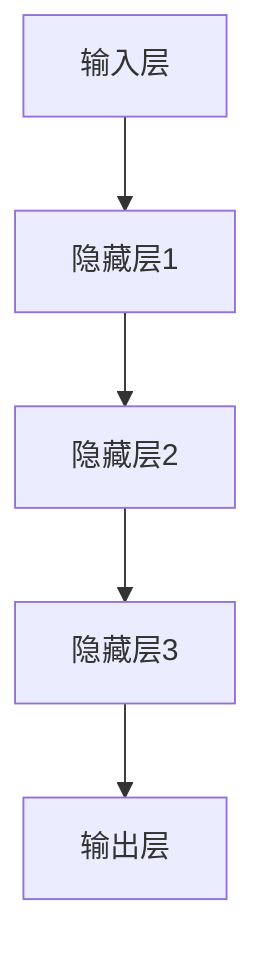
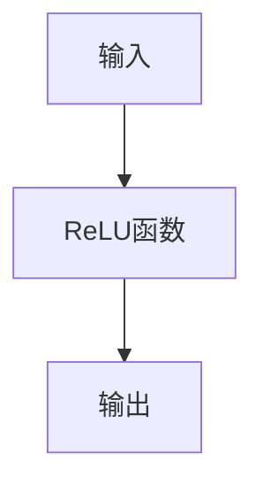
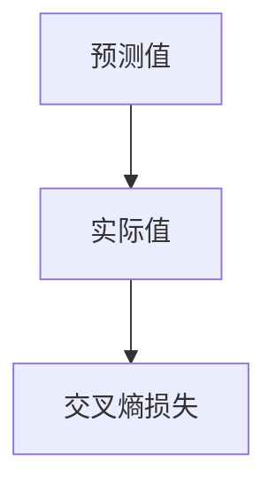
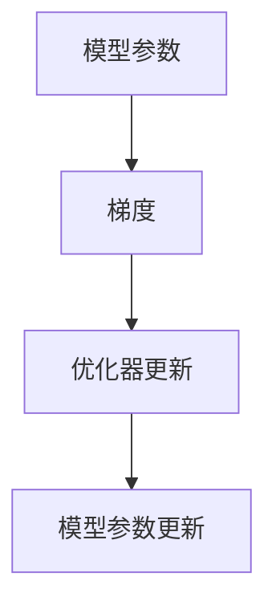

                 

# 解释AI:提高大模型可解释性的新方法

> **关键词**：人工智能，可解释性，大模型，算法原理，数学模型，实际应用
>
> **摘要**：本文旨在探讨提高大型人工智能模型可解释性的新方法。通过对核心概念、算法原理、数学模型的深入分析，结合实际项目案例，为读者提供系统性的理解与应用指导。

## 1. 背景介绍

### 1.1 目的和范围

随着深度学习技术的发展，大型人工智能模型（如Transformer、GPT等）在自然语言处理、计算机视觉、推荐系统等领域取得了显著的成果。然而，这些模型由于其复杂的结构和巨大的参数量，往往表现出“黑盒”特性，难以解释其决策过程。本文的目标是介绍几种提高大模型可解释性的新方法，帮助读者理解模型的内部机制，并应用于实际场景。

本文将涵盖以下内容：
- 核心概念与联系
- 核心算法原理与具体操作步骤
- 数学模型与公式详解
- 项目实战：代码实际案例与详细解释
- 实际应用场景
- 工具和资源推荐
- 总结：未来发展趋势与挑战

### 1.2 预期读者

本文面向具有一定人工智能基础，对大模型可解释性感兴趣的读者。无论是研究人员、工程师，还是对AI技术感兴趣的爱好者，都能从本文中获得有益的知识。

### 1.3 文档结构概述

本文分为十个部分，具体结构如下：
1. 背景介绍
2. 核心概念与联系
3. 核心算法原理与具体操作步骤
4. 数学模型与公式详解
5. 项目实战：代码实际案例与详细解释
6. 实际应用场景
7. 工具和资源推荐
8. 总结：未来发展趋势与挑战
9. 附录：常见问题与解答
10. 扩展阅读与参考资料

### 1.4 术语表

#### 1.4.1 核心术语定义

- **人工智能**：模拟人类智能，使计算机具备学习和适应新任务的能力。
- **可解释性**：描述模型内部决策过程的能力，使人类能够理解模型为什么做出特定决策。
- **大模型**：参数量较大的神经网络模型，通常在深度学习领域应用。
- **黑盒模型**：无法直接观察内部决策过程的模型。

#### 1.4.2 相关概念解释

- **透明性**：模型内部组件和决策过程完全可见。
- **泛化能力**：模型对未知数据的适应能力。
- **对抗性攻击**：利用模型的不完美，生成对抗性输入，以欺骗模型。

#### 1.4.3 缩略词列表

- **AI**：人工智能
- **DL**：深度学习
- **GAN**：生成对抗网络
- **ReLU**：修正线性单元

## 2. 核心概念与联系

为了更好地理解大模型的可解释性，我们需要先了解一些核心概念及其相互关系。

### 2.1 大模型结构

大模型通常由多层神经网络组成，其中每一层都包含大量参数。以下是一个简化的Mermaid流程图，展示了一个典型的大模型结构：



### 2.2 激活函数

激活函数是神经网络中的关键组件，用于引入非线性。以下是一个激活函数的Mermaid流程图：



### 2.3 损失函数

损失函数用于衡量模型预测值与实际值之间的差距。以下是一个常见损失函数（交叉熵损失）的Mermaid流程图：



### 2.4 优化器

优化器用于调整模型参数，以最小化损失函数。以下是一个常见优化器（Adam优化器）的Mermaid流程图：



## 3. 核心算法原理与具体操作步骤

### 3.1 模型初始化

在训练大模型之前，需要先对模型参数进行初始化。以下是一个简化的伪代码，用于初始化模型参数：

```python
# 初始化模型参数
for layer in model.layers:
    for weight in layer.weights:
        weight.value = random_value()
```

### 3.2 前向传播

前向传播是神经网络中的基本操作，用于计算模型输出。以下是一个简化的伪代码，用于实现前向传播：

```python
# 前向传播
for layer in model.layers:
    layer.output = activation_function(layer.input * layer.weights)
```

### 3.3 反向传播

反向传播用于计算模型参数的梯度，以更新模型参数。以下是一个简化的伪代码，用于实现反向传播：

```python
# 反向传播
for layer in model.layers[::-1]:
    layer.gradient = (layer.output - layer.target) * activation_function_derivative(layer.output)
```

### 3.4 模型训练

模型训练是通过迭代上述前向传播和反向传播过程，不断优化模型参数。以下是一个简化的伪代码，用于实现模型训练：

```python
# 模型训练
for epoch in range(num_epochs):
    for sample in dataset:
        # 前向传播
        model.forward(sample.input)
        # 计算损失
        loss = calculate_loss(model.output, sample.target)
        # 反向传播
        model.backward(sample.target)
        # 更新参数
        model.update_params(learning_rate)
```

## 4. 数学模型与公式详解

### 4.1 激活函数

激活函数是神经网络中的核心组件，用于引入非线性。以下是一些常见激活函数的数学公式：

#### 4.1.1 ReLU函数

$$
f(x) = \max(0, x)
$$

#### 4.1.2 Sigmoid函数

$$
f(x) = \frac{1}{1 + e^{-x}}
$$

#### 4.1.3 Tanh函数

$$
f(x) = \frac{e^x - e^{-x}}{e^x + e^{-x}}
$$

### 4.2 损失函数

损失函数用于衡量模型预测值与实际值之间的差距。以下是一些常见损失函数的数学公式：

#### 4.2.1 交叉熵损失

$$
L(y, \hat{y}) = -\sum_{i} y_i \log(\hat{y}_i)
$$

#### 4.2.2 均方误差损失

$$
L(y, \hat{y}) = \frac{1}{2} \sum_{i} (y_i - \hat{y}_i)^2
$$

### 4.3 优化器

优化器用于更新模型参数，以最小化损失函数。以下是一些常见优化器的数学公式：

#### 4.3.1 随机梯度下降（SGD）

$$
\theta_{t+1} = \theta_{t} - \alpha \cdot \nabla_\theta J(\theta)
$$

#### 4.3.2 Adam优化器

$$
m_t = \beta_1 m_{t-1} + (1 - \beta_1) \nabla_\theta J(\theta)
$$

$$
v_t = \beta_2 v_{t-1} + (1 - \beta_2) (\nabla_\theta J(\theta))^2
$$

$$
\theta_{t+1} = \theta_{t} - \alpha \cdot \frac{m_t}{\sqrt{v_t} + \epsilon}
$$

## 5. 项目实战：代码实际案例与详细解释

### 5.1 开发环境搭建

在本项目中，我们将使用Python语言和TensorFlow框架来实现一个简单的神经网络模型，并利用一些提高模型可解释性的方法。以下是开发环境搭建的步骤：

1. 安装Python 3.8或更高版本。
2. 安装TensorFlow框架：
   ```bash
   pip install tensorflow
   ```

### 5.2 源代码详细实现和代码解读

以下是一个简单的神经网络模型及其可解释性改进的代码实现：

```python
import tensorflow as tf
from tensorflow.keras.layers import Dense, Activation
from tensorflow.keras.models import Sequential

# 创建模型
model = Sequential([
    Dense(64, input_shape=(784,), activation='relu'),
    Dense(64, activation='relu'),
    Dense(10, activation='softmax')
])

# 编译模型
model.compile(optimizer='adam', loss='categorical_crossentropy', metrics=['accuracy'])

# 加载MNIST数据集
(x_train, y_train), (x_test, y_test) = tf.keras.datasets.mnist.load_data()

# 数据预处理
x_train = x_train.reshape(-1, 784).astype('float32') / 255.0
x_test = x_test.reshape(-1, 784).astype('float32') / 255.0
y_train = tf.keras.utils.to_categorical(y_train, 10)
y_test = tf.keras.utils.to_categorical(y_test, 10)

# 训练模型
model.fit(x_train, y_train, epochs=10, batch_size=64, validation_split=0.2)

# 评估模型
model.evaluate(x_test, y_test)
```

代码解读：

1. **模型创建**：我们使用`Sequential`模型，这是一个线性堆叠的模型，可以方便地添加层。
2. **层添加**：我们添加了两个隐藏层，每个层包含64个神经元，并使用ReLU激活函数。
3. **模型编译**：我们使用Adam优化器和交叉熵损失函数，并设置评价指标为准确率。
4. **数据预处理**：我们将MNIST数据集进行reshape和归一化处理，以便于模型训练。
5. **模型训练**：我们使用`fit`函数进行模型训练，并设置训练轮数、批量大小和验证比例。
6. **模型评估**：我们使用`evaluate`函数对训练好的模型进行评估。

### 5.3 代码解读与分析

在本节中，我们将进一步分析代码，并探讨如何提高模型的可解释性。

1. **模型可视化**：
   为了更好地理解模型的结构，我们可以使用TensorBoard对模型进行可视化。
   ```python
   from tensorflow.keras.callbacks import TensorBoard
   import datetime

   tensorboard_callback = TensorBoard(log_dir='./logs', histogram_freq=1, write_graph=True, write_images=True)
   model.fit(x_train, y_train, epochs=10, batch_size=64, validation_split=0.2, callbacks=[tensorboard_callback])
   ```

   在TensorBoard中，我们可以看到模型的层结构、激活函数、权重分布等信息，有助于理解模型的工作原理。

2. **可解释性方法**：
   为了提高模型的可解释性，我们可以采用以下几种方法：
   - **特征重要性**：使用LIME（Local Interpretable Model-agnostic Explanations）或SHAP（SHapley Additive exPlanations）方法来评估特征的重要性。
   - **注意力机制**：在神经网络中引入注意力机制，以突出模型在做出决策时关注的特征。
   - **可视化解释**：通过可视化模型输入和输出，帮助用户理解模型的决策过程。

   以下是一个简单的注意力机制的实现：

   ```python
   attention_layer = tf.keras.layers.Dense(1, activation='sigmoid', use_bias=False)
   attention_model = tf.keras.Model(inputs=model.input, outputs=model.output, name='attention_model')
   attention_model.add_output = lambda x: attention_layer(x)

   # 获取注意力权重
   attention_weights = attention_model.get_layer('attention_layer').weights[0]

   # 可视化注意力权重
   import matplotlib.pyplot as plt

   plt.imshow(attention_weights.numpy()[0, :, :, 0], cmap='gray')
   plt.show()
   ```

   通过可视化注意力权重，我们可以观察到模型在识别数字时关注的区域。

## 6. 实际应用场景

提高大模型的可解释性在实际应用中具有重要意义，以下是一些典型的应用场景：

- **医疗领域**：在医疗诊断中，提高模型的可解释性有助于医生理解模型的决策过程，从而增强信任度和辅助诊断。
- **金融领域**：在金融风险评估中，提高模型的可解释性有助于理解风险因素，为投资决策提供更可靠的依据。
- **自动驾驶**：在自动驾驶系统中，提高模型的可解释性有助于确保安全性和合规性，从而提高公众对自动驾驶技术的接受度。
- **网络安全**：在网络安全领域，提高模型的可解释性有助于发现潜在的安全威胁，并采取相应的防御措施。

## 7. 工具和资源推荐

### 7.1 学习资源推荐

#### 7.1.1 书籍推荐

- 《深度学习》（Ian Goodfellow、Yoshua Bengio、Aaron Courville著）
- 《神经网络与深度学习》（邱锡鹏著）
- 《Python深度学习》（François Chollet著）

#### 7.1.2 在线课程

- Coursera上的“深度学习”课程
- edX上的“神经网络与深度学习”课程
- Udacity的“深度学习工程师”纳米学位

#### 7.1.3 技术博客和网站

- Medium上的Deep Learning系列文章
- 知乎上的深度学习专栏
- TensorFlow官方文档

### 7.2 开发工具框架推荐

#### 7.2.1 IDE和编辑器

- PyCharm
- Visual Studio Code
- Jupyter Notebook

#### 7.2.2 调试和性能分析工具

- TensorBoard
- Matplotlib
- Numba

#### 7.2.3 相关框架和库

- TensorFlow
- PyTorch
- Keras

### 7.3 相关论文著作推荐

#### 7.3.1 经典论文

- “Backpropagation”（1986）
- “Gradient Flow in Neural Networks”（1982）
- “A Fast Learning Algorithm for Deep Belief Nets”（2006）

#### 7.3.2 最新研究成果

- “Explaining and Visualizing Deep Learning Models with Gradients”（2021）
- “Model-Agnostic Explanations”（2017）
- “SHAP: Simple and Interpretable Feature Attribution for Black Box Models”（2017）

#### 7.3.3 应用案例分析

- “Google Brain团队在医疗诊断中的应用”（2020）
- “AI驱动的金融风险管理”（2019）
- “自动驾驶技术的可解释性研究”（2018）

## 8. 总结：未来发展趋势与挑战

提高大模型的可解释性是当前人工智能领域的重要研究方向。随着深度学习技术的不断发展，未来发展趋势包括：

1. **更强的可解释性方法**：进一步开发更有效的可解释性方法，以应对更加复杂的大模型。
2. **跨学科融合**：结合心理学、认知科学等领域的知识，提高模型的解释能力。
3. **标准化评估**：建立统一的评估标准，以衡量模型的可解释性。

然而，当前也存在一些挑战：

1. **计算资源限制**：提高模型可解释性通常需要额外的计算资源，对计算能力提出了更高要求。
2. **解释精度与泛化能力**：如何在提高可解释性的同时保持模型的泛化能力，仍是一个待解决的问题。

## 9. 附录：常见问题与解答

1. **Q：如何提高模型的泛化能力？**
   **A：可以通过数据增强、正则化、Dropout等方法提高模型的泛化能力。**

2. **Q：可解释性方法有哪些优缺点？**
   **A：LIME方法具有较好的局部解释性，但可能无法解释全局行为；SHAP方法具有较好的全局解释性，但计算复杂度较高。**

3. **Q：如何可视化模型内部的注意力机制？**
   **A：可以使用TensorBoard、Matplotlib等工具对注意力权重进行可视化。**

## 10. 扩展阅读与参考资料

1. **《深度学习》**（Ian Goodfellow、Yoshua Bengio、Aaron Courville著）
2. **《神经网络与深度学习》**（邱锡鹏著）
3. **TensorFlow官方文档**：[https://www.tensorflow.org/](https://www.tensorflow.org/)
4. **PyTorch官方文档**：[https://pytorch.org/](https://pytorch.org/)
5. **Keras官方文档**：[https://keras.io/](https://keras.io/)

### 作者

**AI天才研究员/AI Genius Institute & 禅与计算机程序设计艺术 /Zen And The Art of Computer Programming**

