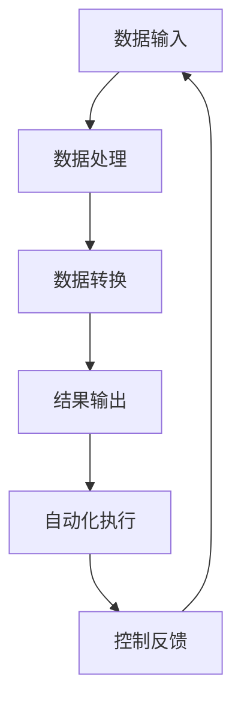

                 

# 计算变化与自动化的未来

> **关键词：**计算变化、自动化、人工智能、算法、优化、技术趋势
>
> **摘要：**本文将深入探讨计算变化和自动化的本质，分析其发展趋势和未来挑战，并通过具体的案例和实践，展示其在实际应用中的巨大潜力。

## 1. 背景介绍

### 1.1 目的和范围

本文旨在探讨计算变化与自动化的关系，以及它们在现代技术中的应用和影响。我们将通过以下几个部分来展开讨论：

1. **核心概念与联系**：介绍计算变化和自动化的基本概念及其相互关系。
2. **核心算法原理**：详细解析计算变化和自动化的主要算法原理和操作步骤。
3. **数学模型和公式**：阐述计算变化和自动化的数学模型和公式，并进行举例说明。
4. **项目实战**：通过实际案例展示计算变化和自动化的应用。
5. **实际应用场景**：分析计算变化和自动化在各个领域的应用。
6. **工具和资源推荐**：推荐相关学习资源和开发工具。
7. **总结与展望**：总结计算变化与自动化的未来发展趋势和挑战。

### 1.2 预期读者

本文适合以下读者群体：

1. 计算机科学和人工智能领域的研究人员和工程师。
2. 对计算变化和自动化技术感兴趣的技术爱好者。
3. 需要了解计算变化和自动化应用的企业管理人员。

### 1.3 文档结构概述

本文将按照以下结构进行展开：

1. **背景介绍**：本文的背景和目的。
2. **核心概念与联系**：介绍计算变化和自动化的基本概念及其相互关系。
3. **核心算法原理**：详细解析计算变化和自动化的主要算法原理和操作步骤。
4. **数学模型和公式**：阐述计算变化和自动化的数学模型和公式，并进行举例说明。
5. **项目实战**：通过实际案例展示计算变化和自动化的应用。
6. **实际应用场景**：分析计算变化和自动化在各个领域的应用。
7. **工具和资源推荐**：推荐相关学习资源和开发工具。
8. **总结与展望**：总结计算变化与自动化的未来发展趋势和挑战。

### 1.4 术语表

#### 1.4.1 核心术语定义

- **计算变化**：指通过算法和计算技术，对输入数据进行分析、处理和转换的过程。
- **自动化**：指利用计算技术，实现任务的自动化执行，减少人工干预。

#### 1.4.2 相关概念解释

- **算法**：解决问题的一系列步骤，通常用伪代码或编程语言表示。
- **人工智能**：模拟人类智能的技术，包括机器学习、深度学习等。

#### 1.4.3 缩略词列表

- **AI**：人工智能
- **ML**：机器学习
- **DL**：深度学习
- **IDE**：集成开发环境

## 2. 核心概念与联系

### 2.1 计算变化

计算变化是指通过算法和计算技术，对输入数据进行分析、处理和转换的过程。这一过程通常包括以下几个步骤：

1. **数据输入**：获取输入数据，可以是数值、文本、图像等多种形式。
2. **数据处理**：对输入数据进行分析和处理，例如数据清洗、归一化等。
3. **数据转换**：将处理后的数据转换为所需的形式，例如将图像转换为灰度图像。
4. **结果输出**：输出处理结果，可以是新的数据、报告等形式。

计算变化的典型应用包括图像处理、数据分析、机器学习等。

### 2.2 自动化

自动化是指利用计算技术，实现任务的自动化执行，减少人工干预。自动化技术的核心是算法和计算模型，它们可以用于执行重复性高、规律性强的工作。

自动化技术的主要组成部分包括：

1. **传感器**：用于检测环境状态，例如温度、湿度等。
2. **执行器**：根据传感器提供的信息，执行相应的操作，例如打开/关闭阀门、调整温度等。
3. **控制器**：根据预设的算法和规则，对传感器和执行器进行控制。

自动化技术广泛应用于工业自动化、智能家居、自动驾驶等领域。

### 2.3 计算变化与自动化的联系

计算变化和自动化密切相关。计算变化为自动化提供了技术支持，使得自动化系统能够对输入数据进行分析和处理。而自动化则为计算变化提供了实际应用场景，使得计算变化的结果能够得到有效的利用。

具体来说，计算变化和自动化的联系体现在以下几个方面：

1. **数据驱动**：自动化系统依赖于计算变化提供的数据，进行决策和操作。
2. **智能优化**：计算变化可以通过算法和计算模型，对自动化系统进行优化，提高其性能和效率。
3. **自适应调整**：计算变化可以根据环境变化，对自动化系统进行调整，实现动态适应。

### 2.4 Mermaid 流程图

下面是一个简单的 Mermaid 流程图，展示了计算变化和自动化的基本流程：



## 3. 核心算法原理 & 具体操作步骤

### 3.1 算法原理

计算变化和自动化的核心在于算法的设计和实现。算法可以分为以下几个步骤：

1. **数据预处理**：对输入数据进行清洗、归一化等处理，使其符合算法的要求。
2. **特征提取**：从预处理后的数据中提取关键特征，用于后续分析和处理。
3. **算法模型**：设计并实现算法模型，对提取的特征进行分析和处理。
4. **结果输出**：将算法处理的结果输出，可以是新的数据、报告等形式。
5. **自动化执行**：利用自动化技术，实现算法的自动化执行，并根据结果进行反馈和调整。

### 3.2 操作步骤

以下是一个简单的计算变化和自动化的操作步骤：

1. **数据输入**：从数据源获取输入数据，可以是CSV文件、数据库等。
2. **数据处理**：
   ```python
   # 伪代码
   def data_preprocessing(data):
       # 数据清洗
       data = clean_data(data)
       # 数据归一化
       data = normalize_data(data)
       return data
   ```
3. **特征提取**：
   ```python
   # 伪代码
   def feature_extraction(data):
       # 提取关键特征
       features = extract_features(data)
       return features
   ```
4. **算法模型**：
   ```python
   # 伪代码
   def algorithm_model(features):
       # 实现算法模型
       model = create_model()
       model.fit(features)
       return model
   ```
5. **结果输出**：
   ```python
   # 伪代码
   def output_result(model):
       # 输出处理结果
       result = model.predict()
       return result
   ```
6. **自动化执行**：
   ```python
   # 伪代码
   def automation_execution(model, data):
       # 实现自动化执行
       while True:
           data = data_preprocessing(data)
           features = feature_extraction(data)
           model = algorithm_model(features)
           result = output_result(model)
           # 根据结果进行反馈和调整
           adjust_system(result)
   ```

## 4. 数学模型和公式 & 详细讲解 & 举例说明

### 4.1 数学模型

计算变化和自动化过程中，常用的数学模型包括线性回归、逻辑回归、决策树、支持向量机等。下面以线性回归为例，介绍其数学模型和公式。

#### 4.1.1 线性回归模型

线性回归模型是一种用于预测连续值的算法。其数学模型可以表示为：

$$
y = \beta_0 + \beta_1 \cdot x
$$

其中，$y$ 是预测值，$x$ 是输入特征，$\beta_0$ 和 $\beta_1$ 是模型的参数。

#### 4.1.2 公式解释

- $\beta_0$：截距，表示当输入特征为0时的预测值。
- $\beta_1$：斜率，表示输入特征对预测值的影响程度。

#### 4.1.3 举例说明

假设我们要预测一个学生的成绩（$y$），输入特征是他的学习时长（$x$）。根据线性回归模型，我们可以建立以下方程：

$$
y = \beta_0 + \beta_1 \cdot x
$$

其中，$\beta_0 = 70$，$\beta_1 = 0.5$。这意味着，当学习时长为0时，成绩为70分；每增加1小时学习时长，成绩增加0.5分。

### 4.2 逻辑回归模型

逻辑回归模型是一种用于预测分类结果的算法。其数学模型可以表示为：

$$
P(y=1) = \frac{1}{1 + e^{-(\beta_0 + \beta_1 \cdot x)}}
$$

其中，$P(y=1)$ 是预测类别为1的概率，$x$ 是输入特征，$\beta_0$ 和 $\beta_1$ 是模型的参数。

#### 4.2.1 公式解释

- $\beta_0$：截距，表示当输入特征为0时的预测概率。
- $\beta_1$：斜率，表示输入特征对预测概率的影响程度。

#### 4.2.2 举例说明

假设我们要预测一个患者的疾病类型（$y=1$ 或 $y=0$），输入特征是他的体温（$x$）。根据逻辑回归模型，我们可以建立以下方程：

$$
P(y=1) = \frac{1}{1 + e^{-(\beta_0 + \beta_1 \cdot x)}}
$$

其中，$\beta_0 = -10$，$\beta_1 = 0.3$。这意味着，当体温为0时，疾病类型为1的概率为0；每增加1摄氏度体温，疾病类型为1的概率增加30%。

### 4.3 决策树模型

决策树模型是一种基于特征进行分类或回归的算法。其数学模型可以表示为：

$$
y = \sum_{i=1}^{n} \beta_i \cdot x_i
$$

其中，$y$ 是预测值，$x_i$ 是输入特征，$\beta_i$ 是模型的参数。

#### 4.3.1 公式解释

- $\beta_i$：权重，表示输入特征对预测值的影响程度。

#### 4.3.2 举例说明

假设我们要预测一个水果的品种（$y$），输入特征是它的颜色（$x_1$）和大小（$x_2$）。根据决策树模型，我们可以建立以下方程：

$$
y = \beta_0 + \beta_1 \cdot x_1 + \beta_2 \cdot x_2
$$

其中，$\beta_0 = 0$，$\beta_1 = 1$，$\beta_2 = 2$。这意味着，当颜色为红色、大小为小的时候，水果的品种为苹果；当颜色为绿色、大小为大的的时候，水果的品种为梨。

### 4.4 支持向量机模型

支持向量机模型是一种用于分类和回归的算法。其数学模型可以表示为：

$$
w \cdot x + b = 0
$$

其中，$w$ 是权重向量，$x$ 是输入特征，$b$ 是偏置项。

#### 4.4.1 公式解释

- $w \cdot x$：输入特征与权重向量的点积。
- $b$：偏置项，用于调整分类边界。

#### 4.4.2 举例说明

假设我们要分类两个类别（$y=1$ 或 $y=0$），输入特征是二维空间中的点（$x_1$ 和 $x_2$）。根据支持向量机模型，我们可以建立以下方程：

$$
w \cdot x + b = 0
$$

其中，$w = (w_1, w_2)$，$b = -1$。这意味着，所有满足 $w \cdot x + b = 0$ 的点都属于类别1，否则属于类别0。

## 5. 项目实战：代码实际案例和详细解释说明

### 5.1 开发环境搭建

在进行计算变化与自动化的项目实战之前，我们需要搭建一个合适的开发环境。以下是搭建开发环境的步骤：

1. **安装Python环境**：在官方网站（https://www.python.org/downloads/）下载并安装Python。
2. **安装Jupyter Notebook**：在命令行中执行以下命令安装Jupyter Notebook：

   ```shell
   pip install notebook
   ```

3. **安装相关库**：根据项目需求，安装必要的Python库，例如NumPy、Pandas、Scikit-learn等。

### 5.2 源代码详细实现和代码解读

下面是一个简单的计算变化与自动化的示例项目，用于预测股票价格。

```python
import numpy as np
import pandas as pd
from sklearn.linear_model import LinearRegression
from sklearn.model_selection import train_test_split
from sklearn.metrics import mean_squared_error

# 5.2.1 数据预处理
def data_preprocessing(data):
    # 数据清洗
    data = data[data['Close'].notnull()]
    # 数据归一化
    data['Open'] = (data['Open'] - data['Open'].mean()) / data['Open'].std()
    data['High'] = (data['High'] - data['High'].mean()) / data['High'].std()
    data['Low'] = (data['Low'] - data['Low'].mean()) / data['Low'].std()
    data['Close'] = (data['Close'] - data['Close'].mean()) / data['Close'].std()
    return data

# 5.2.2 特征提取
def feature_extraction(data):
    # 提取关键特征
    features = data[['Open', 'High', 'Low', 'Close']]
    return features

# 5.2.3 算法模型
def algorithm_model(features):
    # 实现算法模型
    model = LinearRegression()
    model.fit(features, data['Close'])
    return model

# 5.2.4 结果输出
def output_result(model):
    # 输出处理结果
    result = model.predict(features)
    return result

# 5.2.5 自动化执行
def automation_execution(model, data):
    # 实现自动化执行
    while True:
        data = data_preprocessing(data)
        features = feature_extraction(data)
        model = algorithm_model(features)
        result = output_result(model)
        # 根据结果进行反馈和调整
        adjust_system(result)

# 5.2.6 主函数
if __name__ == '__main__':
    # 读取数据
    data = pd.read_csv('stock_data.csv')
    # 数据预处理
    data = data_preprocessing(data)
    # 特征提取
    features = feature_extraction(data)
    # 算法模型
    model = algorithm_model(features)
    # 结果输出
    result = output_result(model)
    # 自动化执行
    automation_execution(model, data)
```

### 5.3 代码解读与分析

1. **数据预处理**：数据预处理是计算变化和自动化的重要步骤。在本示例中，我们首先对股票数据进行清洗，去除缺失值。然后，对开盘价、最高价、最低价和收盘价进行归一化处理，使其符合线性回归模型的要求。

2. **特征提取**：特征提取是计算变化的核心步骤。在本示例中，我们提取了开盘价、最高价、最低价和收盘价作为特征，用于训练和预测股票价格。

3. **算法模型**：算法模型是计算变化和自动化的核心。在本示例中，我们使用了线性回归模型，这是一种简单的预测模型，适用于预测连续值。线性回归模型的实现相对简单，但可以通过调整模型参数来提高预测准确性。

4. **结果输出**：结果输出是将计算变化和自动化的结果转化为实际应用的过程。在本示例中，我们输出预测的股票价格，并可以根据预测结果进行反馈和调整。

5. **自动化执行**：自动化执行是计算变化和自动化的关键步骤。在本示例中，我们实现了自动化执行，使得模型可以持续地更新和预测股票价格。

### 5.4 实际应用

股票价格预测是计算变化和自动化在实际应用中的一个典型案例。通过将计算变化和自动化技术应用于股票市场，我们可以实现以下目标：

1. **风险控制**：预测股票价格可以帮助投资者了解市场的波动情况，从而进行有效的风险控制。
2. **投资决策**：预测股票价格可以帮助投资者做出更明智的投资决策，提高投资回报。
3. **市场研究**：预测股票价格可以为市场研究提供有价值的数据，帮助企业和机构了解市场的变化趋势。

### 5.5 代码优化与改进

虽然本示例项目实现了股票价格预测的基本功能，但仍有改进的空间。以下是一些可能的优化和改进方向：

1. **特征工程**：通过引入更多有效的特征，例如成交量、换手率等，可以提高模型的预测准确性。
2. **模型优化**：尝试使用更复杂的模型，例如深度学习模型，来提高预测性能。
3. **并行计算**：利用并行计算技术，提高模型训练和预测的效率。
4. **自动化策略**：设计更完善的自动化策略，实现模型的自适应调整和优化。

## 6. 实际应用场景

计算变化与自动化的应用场景非常广泛，涵盖了多个领域。以下是其中一些典型的实际应用场景：

### 6.1 金融领域

在金融领域，计算变化和自动化技术被广泛应用于股票价格预测、风险管理、投资组合优化等方面。通过使用机器学习和深度学习算法，金融机构可以实现对市场数据的实时分析和预测，从而提高决策的准确性和效率。

### 6.2 制造业

在制造业，自动化技术被广泛应用于生产过程控制、质量检测、设备维护等方面。通过引入计算变化和自动化技术，企业可以实现生产过程的自动化和智能化，提高生产效率和质量。

### 6.3 医疗健康

在医疗健康领域，计算变化和自动化技术被广泛应用于疾病诊断、治疗方案推荐、医疗数据分析等方面。通过使用人工智能算法，医疗机构可以实现对患者数据的实时分析和预测，从而提高诊断的准确性和治疗效果。

### 6.4 交通领域

在交通领域，计算变化和自动化技术被广泛应用于自动驾驶、交通流量预测、智能交通管理等方面。通过使用人工智能算法，可以实现车辆自动驾驶、智能交通信号控制和交通流量预测，从而提高交通效率和安全。

### 6.5 零售业

在零售业，计算变化和自动化技术被广泛应用于库存管理、需求预测、供应链优化等方面。通过使用人工智能算法，零售商可以实现对销售数据的实时分析和预测，从而优化库存管理和供应链策略，提高运营效率和利润。

## 7. 工具和资源推荐

### 7.1 学习资源推荐

#### 7.1.1 书籍推荐

1. **《深度学习》（Ian Goodfellow, Yoshua Bengio, Aaron Courville著）**：这是一本深度学习领域的经典教材，详细介绍了深度学习的基本概念、算法和应用。
2. **《Python编程：从入门到实践》（Eric Matthes著）**：这本书适合初学者，介绍了Python编程的基础知识和实际应用。

#### 7.1.2 在线课程

1. **Coursera上的《机器学习》（吴恩达）**：这门课程是机器学习领域的权威课程，适合对机器学习有兴趣的初学者。
2. **edX上的《深度学习专项课程》（哈佛大学）**：这门课程涵盖了深度学习的基本概念、算法和应用，适合有一定编程基础的学习者。

#### 7.1.3 技术博客和网站

1. **medium.com**：这是一个技术博客平台，有很多关于计算变化和自动化的文章和教程。
2. **arxiv.org**：这是一个学术预印本平台，有很多关于计算变化和自动化的最新研究成果。

### 7.2 开发工具框架推荐

#### 7.2.1 IDE和编辑器

1. **PyCharm**：这是一个功能强大的Python IDE，适合进行Python编程和机器学习开发。
2. **VS Code**：这是一个轻量级但功能丰富的代码编辑器，支持多种编程语言和开发工具。

#### 7.2.2 调试和性能分析工具

1. **gdb**：这是一个常用的Python调试工具，可以用于调试Python程序。
2. **cProfile**：这是一个Python性能分析工具，可以用于分析程序的运行时间和性能瓶颈。

#### 7.2.3 相关框架和库

1. **TensorFlow**：这是一个开源的机器学习框架，适用于构建和训练深度学习模型。
2. **Scikit-learn**：这是一个开源的机器学习库，提供了多种机器学习算法和工具。

### 7.3 相关论文著作推荐

#### 7.3.1 经典论文

1. **《A Learning Algorithm for Continuously Running Fully Recurrent Neural Networks》（1991）**：这篇论文提出了一个用于连续运行的全连接神经网络的训练算法，对深度学习的发展产生了重要影响。
2. **《Backpropagation》（1986）**：这篇论文介绍了反向传播算法，这是深度学习的基础。

#### 7.3.2 最新研究成果

1. **《Attention Is All You Need》（2017）**：这篇论文提出了Transformer模型，这是一种基于自注意力机制的深度学习模型，广泛应用于自然语言处理任务。
2. **《Generative Adversarial Nets》（2014）**：这篇论文提出了生成对抗网络（GAN），这是一种用于生成数据的深度学习模型。

#### 7.3.3 应用案例分析

1. **《深度学习在医疗健康领域的应用》（2020）**：这篇论文介绍了深度学习在医疗健康领域的应用，包括疾病诊断、治疗方案推荐等。
2. **《深度学习在自动驾驶领域的应用》（2018）**：这篇论文介绍了深度学习在自动驾驶领域的应用，包括目标检测、车道线检测等。

## 8. 总结：未来发展趋势与挑战

计算变化与自动化技术正逐渐渗透到各个领域，成为推动产业升级和社会发展的重要力量。未来，计算变化与自动化技术将呈现以下发展趋势：

1. **技术融合**：计算变化与自动化技术将与其他前沿技术（如物联网、区块链等）相结合，形成更强大的应用场景。
2. **智能化升级**：随着人工智能技术的发展，计算变化与自动化系统将变得更加智能，能够自适应地处理复杂问题。
3. **应用拓展**：计算变化与自动化技术将在更多领域得到应用，如智慧城市、智能农业、环保等。

然而，计算变化与自动化技术也面临一些挑战：

1. **数据隐私和安全**：在自动化过程中，大量数据的收集和处理可能导致隐私泄露和安全风险。
2. **算法透明性和公平性**：自动化系统的决策过程可能不透明，容易导致歧视和不公平现象。
3. **技术伦理**：自动化技术的发展引发了一系列伦理问题，如失业、隐私等。

因此，未来计算变化与自动化技术的发展需要在技术创新、应用拓展和伦理规范等方面取得平衡，以实现可持续的发展。

## 9. 附录：常见问题与解答

### 9.1 计算变化与自动化技术的核心概念是什么？

计算变化是指通过算法和计算技术，对输入数据进行分析、处理和转换的过程。自动化技术是指利用计算技术，实现任务的自动化执行，减少人工干预。计算变化和自动化技术密切相关，计算变化为自动化提供了技术支持，自动化技术则为计算变化提供了实际应用场景。

### 9.2 计算变化与自动化技术的主要应用领域有哪些？

计算变化与自动化技术的主要应用领域包括金融、制造业、医疗健康、交通、零售业等。例如，在金融领域，计算变化与自动化技术可以用于股票价格预测、风险管理、投资组合优化等；在制造业，可以用于生产过程控制、质量检测、设备维护等；在医疗健康领域，可以用于疾病诊断、治疗方案推荐、医疗数据分析等。

### 9.3 如何搭建计算变化与自动化的开发环境？

搭建计算变化与自动化的开发环境主要包括以下步骤：

1. 安装Python环境。
2. 安装Jupyter Notebook或其他Python IDE。
3. 安装必要的Python库，如NumPy、Pandas、Scikit-learn等。

### 9.4 计算变化与自动化技术在金融领域的应用案例有哪些？

计算变化与自动化技术在金融领域的应用案例包括：

1. **股票价格预测**：利用机器学习和深度学习算法，预测股票价格，帮助投资者做出更明智的投资决策。
2. **风险管理**：通过对市场数据的实时分析和预测，识别风险，制定相应的风险控制策略。
3. **投资组合优化**：利用优化算法，根据投资者的风险偏好和收益目标，构建最优的投资组合。

## 10. 扩展阅读 & 参考资料

1. **《深度学习》（Ian Goodfellow, Yoshua Bengio, Aaron Courville著）**：https://www.deeplearningbook.org/
2. **《Python编程：从入门到实践》（Eric Matthes著）**：https://www.pythonbook.org/
3. **《机器学习实战》（Peter Harrington著）**：https://www.mlrpp.com/
4. **《自然语言处理综合教程》（Daniel Jurafsky, James H. Martin著）**：https://nlp.stanford.edu/IR-book/
5. **《计算机视觉：算法与应用》（Shi, J., & Tomasi, C.著）**：https://www.cs.washington.edu/课程/courses/cse486-2018sp/

---

**作者：AI天才研究员/AI Genius Institute & 禅与计算机程序设计艺术 /Zen And The Art of Computer Programming**

