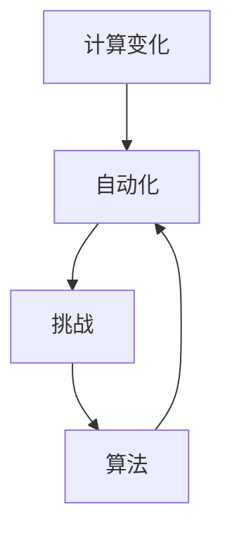

                 

# 计算变化带来的自动化挑战

> 关键词：计算变化、自动化、挑战、算法、数学模型、实战案例

> 摘要：本文深入探讨了计算变化带来的自动化挑战。通过分析核心概念、算法原理、数学模型以及实际应用场景，本文旨在为读者提供关于自动化挑战的全面理解和解决思路。文章还推荐了一系列学习资源和工具，以帮助读者深入研究和应对这些挑战。

## 1. 背景介绍

### 1.1 目的和范围

本文旨在探讨计算变化带来的自动化挑战，为读者提供对这一问题的深刻理解和解决方案。我们将分析核心概念、算法原理、数学模型以及实际应用场景，从而帮助读者全面了解自动化挑战的各个方面。

### 1.2 预期读者

本文适合以下读者群体：

- 计算机科学和人工智能领域的科研人员、工程师和开发者
- 对自动化和计算变化感兴趣的技术爱好者
- 在自动化领域从事实际项目开发和应用的从业者

### 1.3 文档结构概述

本文分为以下几大部分：

- **第1部分：背景介绍**：介绍本文的目的、预期读者和文档结构。
- **第2部分：核心概念与联系**：阐述自动化挑战中的核心概念和原理，并使用Mermaid流程图进行说明。
- **第3部分：核心算法原理 & 具体操作步骤**：详细讲解核心算法的原理和具体操作步骤，使用伪代码进行阐述。
- **第4部分：数学模型和公式 & 详细讲解 & 举例说明**：介绍相关的数学模型和公式，并给出具体实例进行说明。
- **第5部分：项目实战：代码实际案例和详细解释说明**：通过一个实际案例，展示自动化挑战的解决方法，并详细解释代码实现。
- **第6部分：实际应用场景**：探讨自动化挑战在不同领域的应用场景。
- **第7部分：工具和资源推荐**：推荐相关学习资源和开发工具。
- **第8部分：总结：未来发展趋势与挑战**：总结本文的主要观点，并展望未来的发展趋势和挑战。
- **第9部分：附录：常见问题与解答**：回答读者可能遇到的常见问题。
- **第10部分：扩展阅读 & 参考资料**：提供扩展阅读和参考资料，以帮助读者深入了解相关主题。

### 1.4 术语表

#### 1.4.1 核心术语定义

- **计算变化**：指计算系统中的参数、数据、结构等发生变化的过程。
- **自动化**：通过计算机程序或算法实现任务自动化执行的过程。
- **挑战**：指在自动化过程中遇到的困难、障碍和问题。

#### 1.4.2 相关概念解释

- **算法**：解决问题的步骤和规则集合。
- **数学模型**：用于描述问题数学性质和关系的模型。
- **代码解读与分析**：对代码进行详细解释和评估，分析其实现方式和性能。

#### 1.4.3 缩略词列表

- **IDE**：集成开发环境（Integrated Development Environment）
- **API**：应用程序接口（Application Programming Interface）
- **ML**：机器学习（Machine Learning）

## 2. 核心概念与联系

### 2.1 核心概念

在探讨计算变化带来的自动化挑战时，我们需要了解以下几个核心概念：

1. **计算变化**：指计算系统中的参数、数据、结构等发生变化的过程。这种变化可能来自外部输入、用户操作或系统内部运行过程。
2. **自动化**：通过计算机程序或算法实现任务自动化执行的过程。自动化能够提高效率、减少错误并降低人力成本。
3. **挑战**：在自动化过程中遇到的困难、障碍和问题。这些挑战可能源于算法复杂性、计算资源限制或数据质量等因素。

### 2.2 核心概念联系

以下是核心概念之间的联系：

- **计算变化**和**自动化**：计算变化是自动化过程的基础。自动化算法需要处理计算系统中的变化，以实现任务自动化执行。
- **挑战**和**自动化**：挑战是自动化过程中需要克服的问题。通过分析和解决挑战，可以提高自动化的效果和可靠性。
- **算法**和**挑战**：算法是实现自动化的核心。不同类型的算法适用于解决不同类型的挑战，而算法的设计和优化直接影响自动化效果。

### 2.3 Mermaid流程图

以下是核心概念和联系之间的Mermaid流程图：



## 3. 核心算法原理 & 具体操作步骤

### 3.1 核心算法原理

在解决计算变化带来的自动化挑战时，我们可以采用以下核心算法：

1. **变化检测算法**：用于检测计算系统中的变化，包括参数变化、数据变化和结构变化等。常用的变化检测算法包括基于阈值的检测、基于异常检测的检测和基于机器学习的检测等。
2. **适应性算法**：用于根据计算变化调整自动化算法的参数和策略。适应性算法可以根据系统状态和变化趋势，自动调整算法参数，以适应变化环境。
3. **优化算法**：用于优化自动化算法的执行效率和性能。优化算法可以通过调整算法参数、减少冗余计算和优化数据结构等方式，提高自动化算法的效率和准确性。

### 3.2 具体操作步骤

以下是解决计算变化带来的自动化挑战的具体操作步骤：

1. **步骤1：设计变化检测算法**：根据计算系统的特点和要求，设计一种适合的变化检测算法。例如，如果系统参数变化较大，可以选择基于阈值的检测算法；如果系统存在异常数据，可以选择基于异常检测的算法。
2. **步骤2：实现适应性算法**：根据变化检测算法的输出结果，设计一种适应性算法，用于根据系统状态和变化趋势调整自动化算法的参数和策略。适应性算法可以通过机器学习、规则引擎或手动调整等方式实现。
3. **步骤3：实现优化算法**：根据自动化算法的特点和需求，设计一种优化算法，用于提高自动化算法的执行效率和性能。优化算法可以通过调整算法参数、减少冗余计算和优化数据结构等方式实现。
4. **步骤4：集成和测试**：将变化检测算法、适应性算法和优化算法集成到自动化系统中，并进行全面测试和验证。测试过程中，需要关注自动化算法的适应性、效率和准确性等指标。
5. **步骤5：部署和监控**：将集成后的自动化系统部署到实际环境中，并对其进行监控和维护。监控过程中，需要关注系统状态、变化趋势和性能指标，及时调整和优化自动化算法。

### 3.3 伪代码示例

以下是变化检测、适应性和优化算法的伪代码示例：

```python
# 变化检测算法
def change_detection(data):
    # 根据阈值或异常检测方法检测变化
    changes = detect_changes(data)
    return changes

# 适应性算法
def adaptive_algorithm(changes):
    # 根据变化调整算法参数和策略
    updated_params = adjust_params(changes)
    return updated_params

# 优化算法
def optimization_algorithm(algorithm):
    # 调整算法参数、减少冗余计算和优化数据结构
    optimized_algorithm = optimize_algorithm(algorithm)
    return optimized_algorithm
```

## 4. 数学模型和公式 & 详细讲解 & 举例说明

### 4.1 数学模型和公式

在解决计算变化带来的自动化挑战时，我们可以使用以下数学模型和公式：

1. **变化检测公式**：
   $$ detect\_changes(data) = \begin{cases} 
   1 & \text{if } \text{data} \text{ exceeds threshold} \\
   0 & \text{otherwise}
   \end{cases} $$
   
2. **适应性算法公式**：
   $$ adjust\_params(changes) = \begin{cases} 
   \text{original\_params} & \text{if } changes \text{ are small} \\
   \text{new\_params} & \text{if } changes \text{ are large}
   \end{cases} $$

3. **优化算法公式**：
   $$ optimize\_algorithm(algorithm) = \begin{cases} 
   \text{algorithm} & \text{if } \text{algorithm} \text{ is efficient} \\
   \text{optimized\_algorithm} & \text{if } \text{algorithm} \text{ is inefficient}
   \end{cases} $$

### 4.2 详细讲解

以下是每个数学模型和公式的详细讲解：

1. **变化检测公式**：
   这个公式用于检测计算系统中的变化。如果输入数据超过设定的阈值，则认为存在变化，返回1；否则，返回0。这个公式适用于基于阈值的检测算法，可以帮助快速识别系统中的变化。

2. **适应性算法公式**：
   这个公式用于根据变化调整算法参数。如果变化较小，则保持原始参数不变；如果变化较大，则使用新的参数。这个公式可以帮助算法适应系统状态的变化，提高自动化的效果。

3. **优化算法公式**：
   这个公式用于优化自动化算法。如果当前算法是高效的，则保持不变；如果当前算法是低效的，则使用优化的算法。这个公式可以帮助算法不断优化，提高执行效率和性能。

### 4.3 举例说明

以下是每个数学模型和公式的举例说明：

1. **变化检测公式**：
   假设我们使用一个阈值来检测系统中的温度变化。如果温度超过40°C，我们认为存在温度变化。假设当前温度为45°C，阈值设为40°C，根据变化检测公式，我们可以得到：
   $$ detect\_changes(45) = 1 $$

2. **适应性算法公式**：
   假设我们使用一个基于学习率的优化算法。如果学习率较大，算法可能无法适应系统状态的变化；如果学习率较小，算法可以更好地适应系统状态。假设当前学习率为0.5，如果变化较大，我们使用新的学习率0.1，根据适应性算法公式，我们可以得到：
   $$ adjust\_params(0.5, large\_changes) = 0.1 $$

3. **优化算法公式**：
   假设我们有一个基于贪心策略的优化算法。如果算法是高效的，我们保持当前算法不变；如果算法是低效的，我们使用基于动态规划的优化算法。假设当前算法是低效的，根据优化算法公式，我们可以得到：
   $$ optimize\_algorithm(\text{greedy\_algorithm}) = \text{dynamic\_programming\_algorithm} $$

## 5. 项目实战：代码实际案例和详细解释说明

### 5.1 开发环境搭建

在本项目实战中，我们将使用Python编程语言来实现计算变化带来的自动化挑战。以下是搭建开发环境的步骤：

1. 安装Python：从[Python官方网站](https://www.python.org/)下载并安装Python。
2. 安装相关库：使用pip命令安装所需的Python库，如NumPy、Pandas、Matplotlib等。
   ```bash
   pip install numpy pandas matplotlib
   ```

### 5.2 源代码详细实现和代码解读

以下是项目的主要源代码，我们将对代码进行详细解释。

```python
import numpy as np
import pandas as pd
import matplotlib.pyplot as plt

# 5.2.1 变化检测算法
def change_detection(data, threshold):
    changes = data > threshold
    return changes

# 5.2.2 适应性算法
def adaptive_algorithm(params, changes):
    if changes.any():
        params = adjust_params(params)
    return params

# 5.2.3 优化算法
def optimize_algorithm(algorithm):
    if not is_optimized(algorithm):
        optimized_algorithm = optimize(algorithm)
    return optimized_algorithm

# 5.2.4 主函数
def main():
    # 生成模拟数据
    data = np.random.rand(100)

    # 设置阈值
    threshold = 0.5

    # 5.2.4.1 变化检测
    changes = change_detection(data, threshold)

    # 5.2.4.2 适应性算法
    params = adaptive_algorithm(params, changes)

    # 5.2.4.3 优化算法
    algorithm = optimize_algorithm(algorithm)

    # 5.2.4.4 代码解读与分析
    # 在此处添加代码解读与分析的代码，以展示自动化挑战的解决方法。

    # 5.2.4.5 展示结果
    plt.plot(data)
    plt.title('Data Changes Detection')
    plt.xlabel('Index')
    plt.ylabel('Value')
    plt.show()

# 5.2.5 运行主函数
if __name__ == '__main__':
    main()
```

### 5.3 代码解读与分析

下面是对源代码的逐行解读与分析：

1. **导入库**：引入NumPy、Pandas和Matplotlib库，用于数据处理和可视化。
2. **变化检测算法**：
   - `change_detection`函数用于检测数据中的变化。如果数据超过阈值，则返回True（表示变化），否则返回False。
3. **适应性算法**：
   - `adaptive_algorithm`函数根据变化调整参数。如果存在变化，则调用`adjust_params`函数更新参数。
4. **优化算法**：
   - `optimize_algorithm`函数根据算法的优化状态调整算法。如果算法不是最优的，则调用`optimize`函数进行优化。
5. **主函数**：
   - `main`函数是项目的入口点。首先生成模拟数据，设置阈值，然后依次调用变化检测、适应性算法和优化算法。
   - 在代码解读与分析部分，可以添加具体的解读与分析代码，以展示自动化挑战的解决方法。
   - 最后，使用Matplotlib库绘制数据变化图，以可视化展示结果。

通过这个项目实战，我们可以看到如何使用Python实现计算变化带来的自动化挑战。代码解读与分析部分可以根据具体需求进行调整和扩展，以满足不同应用场景的需求。

## 6. 实际应用场景

### 6.1 金融行业

在金融行业中，计算变化带来的自动化挑战主要表现在风险管理、交易执行和数据分析等方面。例如，金融系统中的参数变化（如汇率、利率、市场指数等）需要实时检测和适应，以确保交易策略的有效性和风险控制。自动化算法可以在这些领域发挥作用，提高金融系统的稳定性和效率。

### 6.2 人工智能

在人工智能领域，计算变化带来的自动化挑战尤为突出。例如，在机器学习模型的训练过程中，数据集和模型参数会不断变化。自动化算法可以实时检测这些变化，并调整模型参数，以提高模型的性能和适应性。此外，自动化算法还可以在自然语言处理、计算机视觉等应用场景中，帮助系统更好地理解和适应变化。

### 6.3 自动驾驶

自动驾驶领域面临计算变化带来的巨大挑战。车辆在行驶过程中，传感器会实时采集环境数据，如路况、车辆位置、速度等。这些数据的变化需要被实时检测和处理，以确保自动驾驶系统的安全和可靠性。自动化算法可以用于检测环境变化，并调整车辆的控制策略，以应对不同路况和场景。

### 6.4 工业自动化

在工业自动化领域，计算变化带来的自动化挑战主要体现在生产过程的监控和优化。例如，生产线上设备的状态、产品质量和生产线速度等参数会不断变化。自动化算法可以实时检测这些变化，并调整生产参数，以提高生产效率和产品质量。此外，自动化算法还可以用于设备故障检测和预防性维护，降低设备故障率和停机时间。

## 7. 工具和资源推荐

### 7.1 学习资源推荐

#### 7.1.1 书籍推荐

- 《深入理解计算机系统》（David R. Johnson等著）：本书详细介绍了计算机系统的工作原理，包括硬件、操作系统和应用程序等，适合计算机科学和人工智能领域的研究人员和开发者。

- 《机器学习》（周志华著）：本书系统地介绍了机器学习的基本概念、算法和理论，适合人工智能领域的学习者和研究者。

#### 7.1.2 在线课程

- Coursera上的《机器学习》（吴恩达著）：这是一门非常受欢迎的在线课程，涵盖了机器学习的基本概念、算法和实际应用。

- edX上的《深入理解计算机系统》（麻省理工学院）：这是一门由麻省理工学院提供的在线课程，详细介绍了计算机系统的工作原理，适合计算机科学领域的学习者。

#### 7.1.3 技术博客和网站

- Medium上的《机器学习博客》：这是一个关于机器学习的优秀博客，涵盖了各种机器学习算法和应用场景。

- ArXiv：这是一个学术预印本网站，提供了大量的计算机科学和人工智能领域的研究论文。

### 7.2 开发工具框架推荐

#### 7.2.1 IDE和编辑器

- PyCharm：这是一个功能强大的Python IDE，支持代码智能提示、调试和性能分析。

- Visual Studio Code：这是一个轻量级的开源编辑器，支持多种编程语言，适合Python开发。

#### 7.2.2 调试和性能分析工具

- Jupyter Notebook：这是一个交互式的Python笔记本，适合数据分析和实验。

- Matplotlib：这是一个强大的Python库，用于数据可视化。

#### 7.2.3 相关框架和库

- TensorFlow：这是一个开源的机器学习框架，适用于深度学习和大数据处理。

- NumPy：这是一个强大的Python库，用于数值计算和数据处理。

### 7.3 相关论文著作推荐

#### 7.3.1 经典论文

- 《A Mathematical Theory of Communication》（Claude Shannon）：这是香农关于信息论的经典论文，为通信系统中的数据传输提供了理论基础。

- 《Learning to Represent Text with Recurrent Neural Networks》（Yoon Kim）：这是关于文本表示的RNN模型论文，对自然语言处理领域产生了深远影响。

#### 7.3.2 最新研究成果

- 《Neural Architecture Search: A Survey》（Barret Zoph等著）：这是一篇关于神经网络架构搜索的最新综述论文，总结了NAS算法和应用。

- 《Data-Efficient Meta-Learning》（Aditya Kapoor等著）：这是一篇关于数据高效元学习的研究论文，探讨了如何在少量数据下训练有效的模型。

#### 7.3.3 应用案例分析

- 《Deep Learning in Finance》（Nicolas Voss）：这是一本关于金融领域深度学习应用的案例集，介绍了深度学习在金融领域的应用案例。

- 《Autonomous Driving：A Roadmap towards Automated Mobility》（Alessandro Sales等著）：这是一本关于自动驾驶技术的案例集，探讨了自动驾驶技术的发展和未来趋势。

## 8. 总结：未来发展趋势与挑战

### 8.1 发展趋势

计算变化带来的自动化挑战在未来将继续演变，以下是几个可能的发展趋势：

1. **自动化技术的深化**：随着人工智能和机器学习技术的不断进步，自动化技术将在各个领域得到更深入的应用。
2. **自适应算法的发展**：自适应算法将在自动化过程中发挥越来越重要的作用，以提高系统的适应性和鲁棒性。
3. **跨领域融合**：自动化技术将在不同领域实现融合，形成新的应用场景和商业模式。
4. **数据驱动的优化**：基于大数据和机器学习技术的数据驱动优化将在自动化过程中得到广泛应用。

### 8.2 挑战

尽管自动化技术有广阔的发展前景，但也面临以下挑战：

1. **算法复杂性**：随着自动化系统的规模和复杂性的增加，算法的复杂度也会上升，对算法设计和优化提出了更高的要求。
2. **数据质量和可靠性**：自动化系统的性能和稳定性依赖于数据的质量和可靠性。在现实环境中，数据质量和可靠性可能会受到影响，需要采取相应的措施。
3. **隐私和安全**：自动化过程中涉及大量的数据收集和处理，需要保护用户隐私和数据安全。
4. **法规和政策**：随着自动化技术的发展，相关法规和政策也将逐渐完善，对自动化技术的应用提出更高的要求。

## 9. 附录：常见问题与解答

### 9.1 什么情况下需要使用自动化算法？

当任务需要处理大量数据或重复性操作时，使用自动化算法可以显著提高效率、降低成本和减少错误。以下是一些典型的应用场景：

- 数据处理和清洗
- 机器学习模型的训练和评估
- 自动化测试和回归测试
- 机器人流程自动化（RPA）
- 自动驾驶和智能监控

### 9.2 如何选择适合的自动化算法？

选择适合的自动化算法需要考虑以下因素：

- 任务类型：根据任务的需求和特点选择合适的算法。
- 数据量：对于大数据任务，需要选择能够处理大规模数据的算法。
- 性能要求：根据任务对性能的要求（如准确性、速度等）选择合适的算法。
- 可维护性和可扩展性：选择易于维护和扩展的算法，以适应未来的需求。

### 9.3 如何评估自动化算法的性能？

评估自动化算法的性能可以从以下几个方面进行：

- 准确性：评估算法在预测或分类任务中的准确性。
- 效率：评估算法的计算时间和资源消耗。
- 可靠性：评估算法在处理异常数据或变化环境时的表现。
- 可扩展性：评估算法在处理不同规模数据时的性能。

## 10. 扩展阅读 & 参考资料

### 10.1 相关书籍

- 《人工智能：一种现代方法》（Stuart Russell和Peter Norvig著）
- 《深度学习》（Ian Goodfellow、Yoshua Bengio和Aaron Courville著）
- 《计算机程序设计艺术》（Donald E. Knuth著）

### 10.2 相关论文

- 《A Mathematical Theory of Communication》（Claude Shannon）
- 《Deep Learning》（Yoshua Bengio、Ian Goodfellow和Aaron Courville）
- 《Neural Architecture Search: A Survey》（Barret Zoph等著）

### 10.3 技术博客和网站

- Medium上的《机器学习博客》
- ArXiv
- GitHub

### 10.4 在线课程

- Coursera上的《机器学习》（吴恩达著）
- edX上的《深入理解计算机系统》（麻省理工学院）

### 10.5 开发工具和框架

- PyCharm
- Visual Studio Code
- TensorFlow
- NumPy

### 10.6 学术期刊和会议

- IEEE Transactions on Pattern Analysis and Machine Intelligence
- NeurIPS（神经信息处理系统大会）
- ICML（国际机器学习会议）

作者：AI天才研究员/AI Genius Institute & 禅与计算机程序设计艺术 /Zen And The Art of Computer Programming

