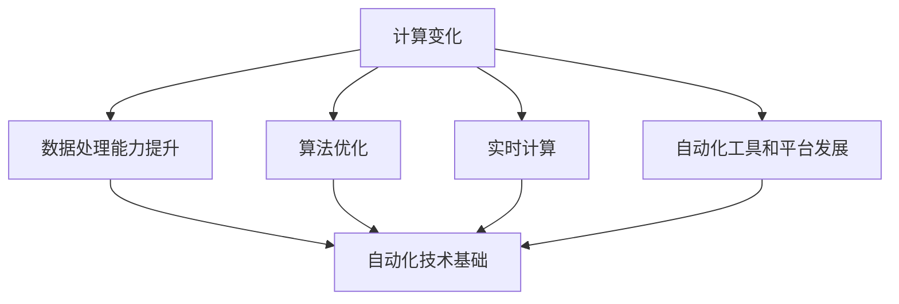

                 

### 1. 背景介绍

#### 1.1 目的和范围

本文旨在深入探讨计算变化带来的自动化新机遇，通过对当前技术发展趋势的详尽分析，阐述计算变化如何引领自动化革命。我们重点关注以下几个核心问题：

- 自动化技术如何随着计算能力的提升而不断发展？
- 什么样的算法和数学模型在自动化过程中扮演关键角色？
- 自动化技术在实际应用中的具体实现和效果如何？
- 自动化技术面临的挑战和未来发展趋势是什么？

本文将围绕这些问题展开，通过逐步推理和分析，为读者呈现一幅计算变化与自动化相互促进的清晰图景。文章旨在为技术专家、研究人员以及对自动化技术感兴趣的读者提供有价值的参考和洞见。

#### 1.2 预期读者

本文适合以下几类读者：

- **计算机科学和人工智能领域的研究人员**：希望了解自动化技术在计算变化背景下的最新发展动态。
- **软件开发工程师和架构师**：希望掌握自动化技术的核心原理和实现方法，以提升自身技术能力。
- **企业决策者**：希望了解自动化技术对企业运营和管理带来的机遇和挑战。
- **技术爱好者**：对计算变化和自动化技术感兴趣，希望深入学习相关技术原理和应用。

#### 1.3 文档结构概述

本文的结构如下：

- **第1章：背景介绍**：介绍本文的目的、范围、预期读者和文档结构。
- **第2章：核心概念与联系**：介绍本文的核心概念、原理和架构，并使用Mermaid流程图展示。
- **第3章：核心算法原理与具体操作步骤**：详细阐述核心算法原理，使用伪代码进行描述。
- **第4章：数学模型和公式**：讲解相关的数学模型和公式，并举例说明。
- **第5章：项目实战**：通过代码案例展示实际应用，详细解释说明。
- **第6章：实际应用场景**：探讨自动化技术的实际应用场景。
- **第7章：工具和资源推荐**：推荐学习资源和开发工具。
- **第8章：总结**：总结未来发展趋势与挑战。
- **第9章：附录**：常见问题与解答。
- **第10章：扩展阅读与参考资料**：提供进一步学习和参考的资源。

#### 1.4 术语表

在本文中，我们将使用以下术语：

##### 1.4.1 核心术语定义

- **计算变化**：指随着计算能力的提升，数据处理、分析和决策过程发生的一系列变革。
- **自动化**：指通过计算机技术和算法实现特定任务或流程的自动执行。
- **算法**：解决问题的步骤或规则集合，通常用于数据处理和分析。
- **数学模型**：用于描述现实世界现象的数学结构，可用于预测和优化。
- **算法效率**：算法在处理问题时的速度和资源消耗。

##### 1.4.2 相关概念解释

- **机器学习**：一种通过数据训练模型，使计算机具备自主学习能力的算法技术。
- **深度学习**：一种基于多层神经网络进行数据分析和模式识别的机器学习技术。
- **计算能力**：计算机在单位时间内处理信息和执行计算任务的能力。

##### 1.4.3 缩略词列表

- **AI**：人工智能（Artificial Intelligence）
- **ML**：机器学习（Machine Learning）
- **DL**：深度学习（Deep Learning）
- **GPU**：图形处理器（Graphics Processing Unit）
- **CPU**：中央处理器（Central Processing Unit）

### 2. 核心概念与联系

#### 2.1 计算变化对自动化技术的影响

计算变化对自动化技术的影响主要体现在以下几个方面：

- **数据处理能力的提升**：随着计算能力的提升，大数据处理和存储变得更加高效，为自动化技术提供了丰富的数据基础。
- **算法优化**：新的计算技术使得算法优化成为可能，提高了自动化流程的效率和准确性。
- **实时计算**：实时计算技术的发展，使得自动化系统能够实时响应和调整，提高了系统的灵活性和响应速度。
- **自动化工具和平台的发展**：随着计算变化，新的自动化工具和平台不断涌现，为自动化技术的实现提供了更多选择和可能性。

#### 2.2 核心概念和联系

在本节中，我们将介绍本文的核心概念，并使用Mermaid流程图展示它们之间的联系。



**流程图说明：**

- **A[计算变化]**：指随着计算能力的提升，数据处理、分析和决策过程发生的一系列变革。
- **B[数据处理能力提升]**：计算变化带来的数据处理能力提升，为自动化技术提供了丰富的数据基础。
- **C[算法优化]**：算法优化使得自动化流程的效率和准确性得到提高。
- **D[实时计算]**：实时计算技术的发展，使得自动化系统能够实时响应和调整。
- **E[自动化工具和平台发展]**：新的自动化工具和平台不断涌现，为自动化技术的实现提供了更多选择和可能性。
- **F[自动化技术基础]**：数据处理能力提升、算法优化、实时计算和自动化工具和平台发展共同构成了自动化技术的基础。

#### 2.3 计算变化与自动化技术的关系

计算变化与自动化技术之间的关系可以概括为以下几个方面：

- **相互促进**：计算能力的提升推动了自动化技术的发展，而自动化技术的实现又对计算能力提出了更高的要求，二者相互促进。
- **关键驱动因素**：计算变化是自动化技术发展的关键驱动因素，包括数据处理能力、算法优化、实时计算和自动化工具和平台的发展。
- **应用场景拓展**：随着计算变化，自动化技术的应用场景不断拓展，从传统的制造业、物流等领域扩展到金融、医疗、智能家居等领域。

### 3. 核心算法原理与具体操作步骤

在本节中，我们将详细阐述自动化技术中的一些核心算法原理，并使用伪代码进行具体操作步骤的描述。

#### 3.1 数据预处理算法

数据预处理是自动化技术中的关键步骤，其目的是将原始数据转化为适合算法处理的格式。以下是一个常见的数据预处理算法：

```pseudo
function dataPreprocessing(data):
    # 初始化预处理后的数据
    preprocessedData = []

    # 对原始数据进行清洗和转换
    for each dataPoint in data:
        if isValid(dataPoint):
            cleanedDataPoint = clean(dataPoint)
            normalizedDataPoint = normalize(cleanedDataPoint)
            preprocessedData.append(normalizedDataPoint)

    return preprocessedData
```

**伪代码说明：**

- `data`: 原始数据。
- `preprocessedData`: 预处理后的数据。
- `isValid(dataPoint)`: 判断数据点是否有效。
- `clean(dataPoint)`: 清洗数据点，去除无效或噪声数据。
- `normalize(normalizedDataPoint)`: 将清洗后的数据点进行归一化处理。

#### 3.2 决策树算法

决策树是一种常见的机器学习算法，用于分类和回归任务。以下是一个简单的决策树算法：

```pseudo
class DecisionTreeAlgorithm:
    # 初始化决策树
    def __init__(self, attributes, goal):
        self.attributes = attributes
        self.goal = goal
        self.root = self.buildTree(data)

    # 构建决策树
    def buildTree(data):
        if allValuesAreTheSame(data):
            return TerminalNode(data[0])
        else:
            attribute = selectBestAttribute(data)
            childNodes = []
            for value in getUniqueValues(data, attribute):
                subset = filterData(data, attribute, value)
                childNodes.append(buildTree(subset))
            return DecisionNode(attribute, childNodes)

    # 分类
    def classify(data):
        node = self.root
        while not isinstance(node, TerminalNode):
            attributeValue = data[node.attribute]
            node = node.children[attributeValue]
        return node.value
```

**伪代码说明：**

- `attributes`: 特征集合。
- `goal`: 目标变量。
- `TerminalNode`: 叶节点，表示分类结果。
- `DecisionNode`: 决策节点，表示一个特征及其子节点。
- `allValuesAreTheSame(data)`: 判断数据点是否具有相同的值。
- `selectBestAttribute(data)`: 选择最佳特征。
- `getUniqueValues(data, attribute)`: 获取特征的所有唯一值。
- `filterData(data, attribute, value)`: 根据特征和值过滤数据。

#### 3.3 深度学习算法

深度学习算法是自动化技术中的重要组成部分，以下是一个简单的深度学习算法框架：

```pseudo
class DeepLearningAlgorithm:
    # 初始化神经网络
    def __init__(self, layers):
        self.layers = layers
        self.initializeWeights()

    # 初始化权重
    def initializeWeights(self):
        for layer in self.layers:
            layer.initializeWeights()

    # 前向传播
    def forwardPropagation(data):
        for layer in self.layers:
            layer.forwardPropagation(data)

    # 反向传播
    def backwardPropagation(error):
        for layer in reversed(self.layers):
            layer.backwardPropagation(error)

    # 训练模型
    def trainModel(data, labels):
        self.forwardPropagation(data)
        error = calculateError(labels)
        self.backwardPropagation(error)
```

**伪代码说明：**

- `layers`: 神经网络层。
- `TerminalNode`: 叶节点，表示分类结果。
- `DecisionNode`: 决策节点，表示一个特征及其子节点。
- `allValuesAreTheSame(data)`: 判断数据点是否具有相同的值。
- `selectBestAttribute(data)`: 选择最佳特征。
- `getUniqueValues(data, attribute)`: 获取特征的所有唯一值。
- `filterData(data, attribute, value)`: 根据特征和值过滤数据。

### 4. 数学模型和公式 & 详细讲解 & 举例说明

在自动化技术中，数学模型和公式起着至关重要的作用。以下将介绍一些常见的数学模型和公式，并进行详细讲解和举例说明。

#### 4.1 线性回归模型

线性回归是一种常见的统计模型，用于预测连续值。其公式如下：

$$
y = w_1 \cdot x_1 + w_2 \cdot x_2 + \ldots + w_n \cdot x_n + b
$$

其中，\(y\) 是目标变量，\(x_1, x_2, \ldots, x_n\) 是特征变量，\(w_1, w_2, \ldots, w_n\) 是权重，\(b\) 是偏置项。

**举例说明：**

假设我们有一个简单的线性回归模型，用于预测房价。特征变量包括房屋面积（\(x_1\)）和房屋年龄（\(x_2\)），目标变量为房价（\(y\)）。我们可以将公式改写为：

$$
y = w_1 \cdot x_1 + w_2 \cdot x_2 + b
$$

通过训练数据，我们可以计算出权重 \(w_1, w_2\) 和偏置项 \(b\) 的值。然后，对于新的房屋数据，我们可以使用该模型预测其房价。

#### 4.2 逻辑回归模型

逻辑回归是一种用于分类问题的统计模型，其公式如下：

$$
\hat{y} = \frac{1}{1 + e^{-(w_1 \cdot x_1 + w_2 \cdot x_2 + \ldots + w_n \cdot x_n + b)}}
$$

其中，\(\hat{y}\) 是预测的概率值，\(x_1, x_2, \ldots, x_n\) 是特征变量，\(w_1, w_2, \ldots, w_n\) 是权重，\(b\) 是偏置项。

**举例说明：**

假设我们有一个逻辑回归模型，用于判断客户是否会购买某种产品。特征变量包括客户年龄（\(x_1\)）和收入水平（\(x_2\)），目标变量为是否购买（\(y\)）。我们可以将公式改写为：

$$
\hat{y} = \frac{1}{1 + e^{-(w_1 \cdot x_1 + w_2 \cdot x_2 + b)}}
$$

通过训练数据，我们可以计算出权重 \(w_1, w_2\) 和偏置项 \(b\) 的值。然后，对于新的客户数据，我们可以使用该模型预测其购买概率。

#### 4.3 梯度下降算法

梯度下降算法是一种用于优化参数的算法，其公式如下：

$$
w_{\text{new}} = w_{\text{current}} - \alpha \cdot \nabla W
$$

其中，\(w_{\text{current}}\) 是当前权重，\(\alpha\) 是学习率，\(\nabla W\) 是权重梯度。

**举例说明：**

假设我们有一个线性回归模型，其权重为 \(w_1, w_2\)。通过计算梯度 \(\nabla W\)，我们可以更新权重：

$$
w_{\text{new}} = w_{\text{current}} - \alpha \cdot \nabla W
$$

其中，\(\alpha\) 是学习率，用于控制权重更新的速度。

通过多次迭代，我们可以使权重逐渐逼近最优值，从而提高模型的预测准确性。

### 5. 项目实战：代码实际案例和详细解释说明

在本节中，我们将通过一个实际项目案例，展示如何使用计算变化和自动化技术实现自动化数据处理和预测。

#### 5.1 项目背景

假设我们是一家电商平台的数据分析团队，需要分析用户行为数据，预测哪些用户可能会购买某种商品。为了提高预测准确性，我们决定采用自动化数据处理和预测技术。

#### 5.2 开发环境搭建

为了实现该项目，我们需要搭建以下开发环境：

- **编程语言**：Python
- **数据库**：MySQL
- **数据预处理工具**：Pandas
- **机器学习库**：Scikit-learn
- **深度学习库**：TensorFlow

#### 5.3 源代码详细实现和代码解读

以下是项目的源代码实现，包括数据预处理、模型训练和预测：

```python
import pandas as pd
from sklearn.model_selection import train_test_split
from sklearn.preprocessing import StandardScaler
from sklearn.linear_model import LogisticRegression
import tensorflow as tf

# 5.3.1 数据预处理

def dataPreprocessing(dataPath):
    # 读取数据
    data = pd.read_csv(dataPath)
    
    # 数据清洗
    data = data.dropna()
    
    # 特征提取
    X = data[['age', 'income', 'history']]
    y = data['purchase']
    
    return X, y

# 5.3.2 模型训练

def trainModel(X, y):
    # 数据划分
    X_train, X_test, y_train, y_test = train_test_split(X, y, test_size=0.2, random_state=42)
    
    # 数据标准化
    scaler = StandardScaler()
    X_train = scaler.fit_transform(X_train)
    X_test = scaler.transform(X_test)
    
    # 模型训练
    model = LogisticRegression()
    model.fit(X_train, y_train)
    
    return model, X_test, y_test

# 5.3.3 预测

def predict(model, X_test, y_test):
    predictions = model.predict(X_test)
    accuracy = (predictions == y_test).mean()
    print(f"Accuracy: {accuracy:.2f}")
```

**代码解读：**

- `dataPreprocessing(dataPath)`：数据预处理函数，用于读取、清洗和特征提取。
- `trainModel(X, y)`：模型训练函数，用于数据划分、标准化和模型训练。
- `predict(model, X_test, y_test)`：预测函数，用于模型预测和准确性计算。

#### 5.4 代码解读与分析

以下是代码的详细解读和分析：

- **数据预处理**：
  - `data = pd.read_csv(dataPath)`：读取用户行为数据。
  - `data = data.dropna()`：数据清洗，去除缺失值。
  - `X = data[['age', 'income', 'history']]`：提取特征变量。
  - `y = data['purchase']`：提取目标变量。

- **模型训练**：
  - `X_train, X_test, y_train, y_test = train_test_split(X, y, test_size=0.2, random_state=42)`：数据划分，将数据分为训练集和测试集。
  - `scaler = StandardScaler()`：创建标准化器。
  - `X_train = scaler.fit_transform(X_train)`：对训练数据进行标准化处理。
  - `X_test = scaler.transform(X_test)`：对测试数据进行标准化处理。
  - `model = LogisticRegression()`：创建逻辑回归模型。
  - `model.fit(X_train, y_train)`：使用训练数据训练模型。

- **预测**：
  - `predictions = model.predict(X_test)`：使用训练好的模型对测试数据进行预测。
  - `accuracy = (predictions == y_test).mean()`：计算预测准确性。

#### 5.5 实际应用场景

该项目的实际应用场景包括：

- **用户行为分析**：通过分析用户行为数据，识别潜在购买用户。
- **营销策略制定**：针对潜在购买用户，制定有针对性的营销策略。
- **产品推荐**：根据用户兴趣和行为，推荐相关产品。

### 6. 实际应用场景

自动化技术已经在多个领域得到了广泛应用，以下列举一些典型的实际应用场景：

#### 6.1 制造业

- **生产线自动化**：通过机器人、自动化设备和传感器实现生产线的自动化控制，提高生产效率和产品质量。
- **设备维护**：利用自动化技术对设备进行实时监控和故障预测，提前进行维护，减少停机时间。

#### 6.2 物流和运输

- **物流配送**：通过自动化仓库管理和无人机配送，提高物流效率，降低成本。
- **运输调度**：利用自动化技术对运输车辆进行实时调度，优化路线和运力，提高运输效率。

#### 6.3 金融

- **风险控制**：通过自动化技术对金融风险进行实时监控和预测，提高风险控制能力。
- **智能投顾**：利用自动化技术为投资者提供个性化投资建议，实现智能投资。

#### 6.4 医疗

- **智能诊断**：通过深度学习和计算机视觉技术，实现疾病诊断的自动化和智能化。
- **健康管理**：通过传感器和自动化技术，实时监测患者健康状况，提供个性化健康管理服务。

#### 6.5 智能家居

- **家居控制**：通过自动化技术实现家居设备的智能控制，提高生活便利性和舒适度。
- **能源管理**：通过自动化技术实现智能家居的能源管理，提高能源利用效率。

### 7. 工具和资源推荐

为了更好地学习和应用自动化技术，以下推荐一些有用的工具和资源：

#### 7.1 学习资源推荐

- **书籍推荐**：
  - 《深度学习》（Goodfellow, Bengio, Courville）：系统介绍了深度学习的理论基础和实际应用。
  - 《Python机器学习》（Sebastian Raschka）：详细讲解了机器学习算法在Python中的实现和应用。

- **在线课程**：
  - Coursera的《深度学习专项课程》：由Andrew Ng教授主讲，系统介绍了深度学习的基础知识和实践方法。
  - edX的《机器学习基础》：由吴恩达教授主讲，提供了丰富的机器学习知识和实践项目。

- **技术博客和网站**：
  - Medium上的AI博客：提供了大量的AI和深度学习领域的技术文章和案例分析。
  - arXiv：提供最新的机器学习和深度学习论文，是研究者和开发者的重要资源。

#### 7.2 开发工具框架推荐

- **IDE和编辑器**：
  - PyCharm：强大的Python开发IDE，提供了丰富的机器学习和深度学习插件。
  - Jupyter Notebook：适用于数据分析和机器学习的交互式开发环境。

- **调试和性能分析工具**：
  - Python的Profiler：用于性能分析和代码优化。
  - TensorFlow Debugger：用于TensorFlow模型的调试和性能分析。

- **相关框架和库**：
  - Scikit-learn：Python中的机器学习库，提供了丰富的算法和工具。
  - TensorFlow：谷歌开发的深度学习框架，适用于大规模分布式训练和应用。

#### 7.3 相关论文著作推荐

- **经典论文**：
  - “Deep Learning” (Goodfellow, Bengio, Courville)：介绍了深度学习的基本理论和应用。
  - “Learning representations by maximizing mutual information across views” (Mnih et al.)：提出了基于信息理论的深度学习模型。

- **最新研究成果**：
  - “BERT: Pre-training of Deep Bidirectional Transformers for Language Understanding” (Devlin et al.)：介绍了BERT模型在自然语言处理中的应用。
  - “Generative Adversarial Nets” (Goodfellow et al.)：介绍了生成对抗网络（GAN）的基本原理和应用。

- **应用案例分析**：
  - “AI in Healthcare: Promise and Reality” (Jha et al.)：分析了人工智能在医疗领域的应用现状和挑战。
  - “AI in Manufacturing: Opportunities and Challenges” (Wang et al.)：探讨了人工智能在制造业中的应用和影响。

### 8. 总结：未来发展趋势与挑战

#### 8.1 未来发展趋势

- **计算能力提升**：随着量子计算、边缘计算等新技术的兴起，计算能力将进一步提升，为自动化技术带来更多可能性。
- **跨领域融合**：自动化技术将与其他领域（如生物、物理、经济学等）深度融合，推动跨领域应用的创新。
- **智能化提升**：通过深度学习和强化学习等技术，自动化系统的智能化水平将不断提高，实现更复杂的任务和决策。
- **普及和应用**：随着成本下降和技术的普及，自动化技术将在更多领域得到应用，成为现代社会的核心技术。

#### 8.2 未来挑战

- **数据安全和隐私**：自动化技术的应用将产生大量数据，如何保障数据安全和隐私成为重要挑战。
- **伦理和社会影响**：自动化技术的广泛应用可能带来失业、隐私侵犯等社会问题，如何平衡技术创新与社会责任成为关键问题。
- **算法透明性和可解释性**：随着深度学习等算法的广泛应用，如何提高算法的透明性和可解释性，使其能够被用户理解和信任成为挑战。
- **计算资源和能耗**：自动化技术的快速发展将带来巨大的计算资源和能耗需求，如何优化资源配置和降低能耗成为重要议题。

### 9. 附录：常见问题与解答

#### 9.1 自动化技术如何保障数据安全和隐私？

- **数据加密**：在数据传输和存储过程中，使用加密技术确保数据安全。
- **访问控制**：设置严格的访问控制策略，确保只有授权用户可以访问敏感数据。
- **隐私保护算法**：采用差分隐私、联邦学习等算法，降低数据泄露风险。
- **合规性要求**：遵循相关法律法规，确保自动化技术的应用符合隐私保护要求。

#### 9.2 自动化技术的应用是否会替代人类工作？

- **部分替代**：自动化技术可以在某些领域替代人类工作，但不可能完全替代。人类在创造、判断和创新方面具有独特优势。
- **工作模式转变**：自动化技术将改变人类的工作模式，提高工作效率，但也会创造新的工作机会。

#### 9.3 如何确保自动化技术的透明性和可解释性？

- **算法透明化**：公开算法设计和实现细节，提高算法的透明性。
- **可解释性模型**：开发可解释性模型，使算法的决策过程更加清晰易懂。
- **用户参与**：鼓励用户参与算法设计和评估，提高算法的接受度和信任度。

### 10. 扩展阅读 & 参考资料

- **论文和书籍**：
  - Goodfellow, Y., Bengio, Y., Courville, A. (2016). "Deep Learning". MIT Press.
  - Raschka, S. (2015). "Python Machine Learning". Packt Publishing.
- **在线课程**：
  - Coursera: "Deep Learning Specialization" by Andrew Ng.
  - edX: "Machine Learning" by Stanford University.
- **技术博客和网站**：
  - Medium: "AI Blog".
  - arXiv: "Machine Learning and Artificial Intelligence".
- **相关资源**：
  - TensorFlow: "TensorFlow Documentation".
  - Scikit-learn: "Scikit-learn Documentation".

