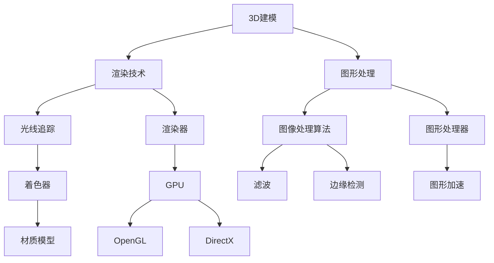

                 

# 计算机图形学：从3D建模到渲染技术

> 关键词：计算机图形学，3D建模，渲染技术，图形处理，数学模型，实际应用
>
> 摘要：本文将深入探讨计算机图形学的基本概念、核心算法原理、数学模型，以及从3D建模到渲染技术的具体操作步骤。通过详细的分析和实战案例，本文旨在为读者提供全面、系统的计算机图形学知识，帮助读者更好地理解和应用这一领域的技术。

## 1. 背景介绍

### 1.1 目的和范围

本文旨在系统地介绍计算机图形学的基本概念、核心技术原理及其应用。具体来说，本文将涵盖以下内容：

- 计算机图形学的定义和作用
- 3D建模的基本原理和技术
- 渲染技术的分类与实现方法
- 图形处理中的数学模型和算法
- 实际应用场景中的计算机图形学技术

通过本文的学习，读者将能够：

- 理解计算机图形学的基本概念和原理
- 掌握3D建模和渲染技术的具体操作步骤
- 运用数学模型解决图形处理中的问题
- 在实际项目中应用计算机图形学技术，提高工作效率

### 1.2 预期读者

本文面向具有一定计算机基础、对图形学感兴趣的学习者、开发者、设计师以及研究人员。无论是初学者，还是有一定经验的专业人士，都可以通过本文的学习，提升自己的计算机图形学知识水平。

### 1.3 文档结构概述

本文结构如下：

- 第1章：背景介绍，包括目的和范围、预期读者、文档结构概述
- 第2章：核心概念与联系，介绍计算机图形学中的核心概念和原理，包括3D建模、渲染技术等
- 第3章：核心算法原理 & 具体操作步骤，详细讲解3D建模和渲染技术的算法原理和操作步骤
- 第4章：数学模型和公式 & 详细讲解 & 举例说明，介绍图形处理中的数学模型和公式，并通过实例进行说明
- 第5章：项目实战：代码实际案例和详细解释说明，通过具体代码案例，讲解3D建模和渲染技术的实际应用
- 第6章：实际应用场景，介绍计算机图形学在实际项目中的应用场景
- 第7章：工具和资源推荐，推荐学习资源、开发工具和框架
- 第8章：总结：未来发展趋势与挑战，探讨计算机图形学领域的发展趋势和面临的挑战
- 第9章：附录：常见问题与解答，提供常见问题的解答
- 第10章：扩展阅读 & 参考资料，推荐相关书籍、在线课程和技术博客

### 1.4 术语表

#### 1.4.1 核心术语定义

- 计算机图形学：研究计算机生成、处理、表示和显示图形的学科。
- 3D建模：使用计算机软件创建三维模型的过程。
- 渲染技术：将三维模型转换为二维图像的技术。
- 图形处理：对图像进行增强、编辑、压缩等操作的技术。
- 数学模型：描述现实世界问题的一种数学表达形式。

#### 1.4.2 相关概念解释

- 三角形网格：由许多三角形组成的网格，用于表示三维模型。
- 光照模型：描述光线与物体表面相互作用，影响表面颜色的数学模型。
- 渲染器：用于渲染三维场景的计算机程序。
- 图形处理器（GPU）：专门用于图形处理的硬件设备。

#### 1.4.3 缩略词列表

- GPU：图形处理器
- CPU：中央处理器
- 3D：三维
- VR：虚拟现实
- AR：增强现实

## 2. 核心概念与联系

计算机图形学是一门涉及多个学科领域的交叉学科，包括计算机科学、数学、物理学和艺术等。本文将首先介绍计算机图形学中的核心概念和原理，并通过Mermaid流程图展示这些概念之间的关系。

### 2.1 3D建模

3D建模是计算机图形学的核心概念之一。它涉及到使用计算机软件创建三维模型的过程。3D建模的主要方法包括：

1. 手动建模：通过手动绘制三维模型，如使用雕刻工具。
2. 参数建模：通过设置参数来创建三维模型，如使用曲面建模工具。
3. 网格建模：通过创建和编辑三角形网格来构建三维模型。

### 2.2 渲染技术

渲染技术是将三维模型转换为二维图像的过程。渲染技术可以分为以下几种类型：

1. 光线追踪：通过模拟光线的传播和反射，生成真实感图像。
2. 渲染器：用于渲染三维场景的计算机程序，如OpenGL和DirectX。
3. 着色器：用于描述物体表面颜色和纹理的计算机程序。

### 2.3 图形处理

图形处理是对图像进行增强、编辑、压缩等操作的技术。图形处理涉及以下核心概念：

1. 图像处理算法：用于处理图像的数学算法，如滤波、边缘检测等。
2. 图形处理器（GPU）：专门用于图形处理的硬件设备。
3. 图形加速：通过硬件加速技术提高图形处理速度。

### 2.4 数学模型

数学模型是描述现实世界问题的一种数学表达形式。在计算机图形学中，常用的数学模型包括：

1. 几何变换：用于对三维模型进行旋转、缩放、平移等操作。
2. 光照模型：用于描述光线与物体表面相互作用，影响表面颜色的数学模型。
3. 材质模型：用于描述物体表面的纹理、颜色和反射特性的数学模型。

### 2.5 Mermaid流程图

以下是一个Mermaid流程图，展示了计算机图形学中的核心概念和原理之间的关系：



通过上述Mermaid流程图，我们可以清楚地看到计算机图形学中的核心概念和原理之间的联系。在接下来的章节中，我们将详细讲解这些核心概念和原理，并介绍相应的算法和操作步骤。

## 3. 核心算法原理 & 具体操作步骤

在计算机图形学中，核心算法原理是理解和实现图形处理技术的基础。本章节将详细介绍3D建模和渲染技术的核心算法原理，并给出具体的操作步骤。

### 3.1 3D建模算法原理

3D建模算法主要分为手动建模、参数建模和网格建模。下面我们分别介绍这三种建模方法的算法原理和操作步骤。

#### 3.1.1 手动建模

手动建模是通过手动绘制三维模型的过程。其算法原理主要基于几何变换和雕刻操作。

- **几何变换**：通过旋转、缩放、平移等操作对模型进行变换。
- **雕刻操作**：通过添加、删除、拉伸和推拉等操作对模型进行细化。

**操作步骤**：

1. 打开3D建模软件，如Blender或Maya。
2. 创建一个新的模型，选择手动建模工具。
3. 使用几何变换工具对模型进行旋转、缩放和平移等操作。
4. 使用雕刻工具对模型进行细化，如添加细节、删除多余部分。
5. 保存模型并导出为3D格式，如OBJ或PLY。

#### 3.1.2 参数建模

参数建模是通过设置参数来创建三维模型的过程。其算法原理主要基于曲面建模和曲线建模。

- **曲面建模**：通过创建和编辑曲面来构建三维模型。
- **曲线建模**：通过创建和编辑曲线来构建三维模型。

**操作步骤**：

1. 打开3D建模软件，如Blender或Maya。
2. 创建一个新的模型，选择参数建模工具。
3. 使用曲面建模工具创建基本形状，如球体、立方体等。
4. 使用编辑工具对曲面进行编辑，如拉伸、扭曲、切割等。
5. 使用曲线建模工具创建和编辑曲线，如创建封闭曲面或开口曲面。
6. 保存模型并导出为3D格式，如OBJ或PLY。

#### 3.1.3 网格建模

网格建模是通过创建和编辑三角形网格来构建三维模型的过程。其算法原理主要基于顶点操作和面操作。

- **顶点操作**：通过移动、缩放、旋转等操作对顶点进行变换。
- **面操作**：通过添加、删除、合并等操作对三角形面进行编辑。

**操作步骤**：

1. 打开3D建模软件，如Blender或Maya。
2. 创建一个新的模型，选择网格建模工具。
3. 使用顶点操作工具对模型进行变换，如移动、缩放、旋转等。
4. 使用面操作工具对模型进行编辑，如添加、删除、合并三角形面。
5. 使用细节编辑工具对模型进行细化，如添加细节、平滑过渡等。
6. 保存模型并导出为3D格式，如OBJ或PLY。

### 3.2 渲染技术算法原理

渲染技术是将三维模型转换为二维图像的过程。其算法原理主要基于光线追踪、渲染器和着色器。

#### 3.2.1 光线追踪

光线追踪是通过模拟光线的传播和反射，生成真实感图像的算法。其算法原理如下：

1. **光线投射**：从相机位置向场景中的每个像素投射光线。
2. **光线追踪**：沿着光线路径计算光线与物体的交点，并记录交点的颜色和材质属性。
3. **反射和折射**：计算光线在物体表面的反射和折射，继续追踪光线路径。

**操作步骤**：

1. 打开3D渲染软件，如Blender或Unity。
2. 导入3D模型。
3. 设置相机参数，如视角、分辨率等。
4. 选择光线追踪渲染模式。
5. 设置光线追踪参数，如光线投射次数、反射和折射系数等。
6. 开始渲染，并导出渲染结果。

#### 3.2.2 渲染器

渲染器是用于渲染三维场景的计算机程序。其算法原理如下：

1. **场景构建**：将三维模型、光源、相机等元素构建为场景。
2. **着色器计算**：使用着色器计算每个像素的颜色和材质属性。
3. **渲染输出**：将渲染结果输出为图像。

**操作步骤**：

1. 打开3D渲染软件，如Blender或Unity。
2. 导入3D模型。
3. 添加光源，如点光源、聚光源等。
4. 设置相机参数，如视角、分辨率等。
5. 选择渲染器，如OpenGL渲染器或DirectX渲染器。
6. 设置渲染参数，如光线投射次数、反射和折射系数等。
7. 开始渲染，并导出渲染结果。

#### 3.2.3 着色器

着色器是用于描述物体表面颜色和纹理的计算机程序。其算法原理如下：

1. **顶点着色器**：计算顶点的位置、颜色和材质属性。
2. **片元着色器**：计算每个像素的颜色和材质属性。
3. **几何着色器**：处理物体表面的几何形状。

**操作步骤**：

1. 打开3D渲染软件，如Blender或Unity。
2. 导入3D模型。
3. 设置着色器参数，如光照模型、纹理映射等。
4. 编写或选择合适的顶点着色器、片元着色器和几何着色器。
5. 在渲染过程中，根据着色器计算每个像素的颜色和材质属性。
6. 导出渲染结果。

通过以上算法原理和操作步骤的详细介绍，读者可以更好地理解3D建模和渲染技术的核心原理，并在实际应用中熟练运用这些技术。

## 4. 数学模型和公式 & 详细讲解 & 举例说明

在计算机图形学中，数学模型和公式扮演着至关重要的角色。它们用于描述物体表面的几何特性、光线的传播和反射，以及材质的颜色和纹理。下面，我们将详细介绍几个核心的数学模型和公式，并通过具体的例子进行讲解。

### 4.1 几何变换

几何变换是计算机图形学中的基础数学模型，用于对三维模型进行旋转、缩放和平移等操作。以下是几个常用的几何变换公式：

#### 4.1.1 旋转变换

旋转变换用于将三维模型绕某一轴旋转。旋转矩阵\( R \)的表达式如下：

\[ R = \begin{bmatrix}
\cos(\theta) & -\sin(\theta) & 0 \\
\sin(\theta) & \cos(\theta) & 0 \\
0 & 0 & 1
\end{bmatrix} \]

其中，\( \theta \)为旋转角度。

#### 4.1.2 缩放变换

缩放变换用于对三维模型进行放大或缩小。缩放矩阵\( S \)的表达式如下：

\[ S = \begin{bmatrix}
s_x & 0 & 0 \\
0 & s_y & 0 \\
0 & 0 & s_z
\end{bmatrix} \]

其中，\( s_x \)、\( s_y \)和\( s_z \)分别为沿X、Y、Z轴的缩放比例。

#### 4.1.3 平移变换

平移变换用于将三维模型沿某一轴移动。平移矩阵\( T \)的表达式如下：

\[ T = \begin{bmatrix}
1 & 0 & 0 & t_x \\
0 & 1 & 0 & t_y \\
0 & 0 & 1 & t_z \\
0 & 0 & 0 & 1
\end{bmatrix} \]

其中，\( t_x \)、\( t_y \)和\( t_z \)分别为沿X、Y、Z轴的平移距离。

#### 4.1.4 举例说明

假设有一个点\( P = (1, 2, 3) \)，我们需要对其进行旋转、缩放和平移操作。

1. **旋转**：绕Y轴旋转45度，使用旋转矩阵\( R_y \)：
   \[ R_y = \begin{bmatrix}
   \cos(45^\circ) & 0 & \sin(45^\circ) \\
   0 & 1 & 0 \\
   -\sin(45^\circ) & 0 & \cos(45^\circ)
   \end{bmatrix} \]

   旋转后的点\( P' \)计算如下：
   \[ P' = R_y \cdot P = \begin{bmatrix}
   \cos(45^\circ) & 0 & \sin(45^\circ) \\
   0 & 1 & 0 \\
   -\sin(45^\circ) & 0 & \cos(45^\circ)
   \end{bmatrix} \cdot \begin{bmatrix}
   1 \\
   2 \\
   3
   \end{bmatrix} = \begin{bmatrix}
   \frac{\sqrt{2}}{2} \\
   2 \\
   -\frac{\sqrt{2}}{2}
   \end{bmatrix} \]

2. **缩放**：沿X轴缩放2倍，沿Y轴缩放1倍，沿Z轴缩放0.5倍，使用缩放矩阵\( S \)：
   \[ S = \begin{bmatrix}
   2 & 0 & 0 \\
   0 & 1 & 0 \\
   0 & 0 & 0.5
   \end{bmatrix} \]

   缩放后的点\( P'' \)计算如下：
   \[ P'' = S \cdot P' = \begin{bmatrix}
   2 & 0 & 0 \\
   0 & 1 & 0 \\
   0 & 0 & 0.5
   \end{bmatrix} \cdot \begin{bmatrix}
   \frac{\sqrt{2}}{2} \\
   2 \\
   -\frac{\sqrt{2}}{2}
   \end{bmatrix} = \begin{bmatrix}
   \sqrt{2} \\
   2 \\
   -\frac{\sqrt{2}}{2}
   \end{bmatrix} \]

3. **平移**：沿X轴平移3个单位，沿Y轴平移2个单位，沿Z轴平移1个单位，使用平移矩阵\( T \)：
   \[ T = \begin{bmatrix}
   1 & 0 & 0 & 3 \\
   0 & 1 & 0 & 2 \\
   0 & 0 & 1 & 1 \\
   0 & 0 & 0 & 1
   \end{bmatrix} \]

   平移后的点\( P''' \)计算如下：
   \[ P''' = T \cdot P'' = \begin{bmatrix}
   1 & 0 & 0 & 3 \\
   0 & 1 & 0 & 2 \\
   0 & 0 & 1 & 1 \\
   0 & 0 & 0 & 1
   \end{bmatrix} \cdot \begin{bmatrix}
   \sqrt{2} \\
   2 \\
   -\frac{\sqrt{2}}{2}
   \end{bmatrix} = \begin{bmatrix}
   \sqrt{2} + 3 \\
   2 + 2 \\
   -\frac{\sqrt{2}}{2} + 1
   \end{bmatrix} = \begin{bmatrix}
   \sqrt{2} + 3 \\
   4 \\
   1 - \frac{\sqrt{2}}{2}
   \end{bmatrix} \]

通过上述例子，我们可以看到如何使用几何变换公式对三维模型进行操作。

### 4.2 光照模型

光照模型用于描述光线与物体表面相互作用的过程，影响物体表面的颜色。以下是一个常见的光照模型——Phong光照模型：

#### 4.2.1 公式

Phong光照模型包括三个部分：漫反射、反射和环境光。

1. **漫反射**：
   \[ L_{diffuse} = kd \cdot L_{light} \cdot N \cdot V \]
   其中，\( L_{diffuse} \)是漫反射光强度，\( kd \)是漫反射系数，\( L_{light} \)是光源方向向量，\( N \)是表面法线向量，\( V \)是观察者方向向量。

2. **反射**：
   \[ L_{specular} = ks \cdot (2 \cdot N \cdot V - L_{light}) \]
   其中，\( L_{specular} \)是反射光强度，\( ks \)是反射系数。

3. **环境光**：
   \[ L_{ambient} = ka \cdot I \]
   其中，\( L_{ambient} \)是环境光强度，\( ka \)是环境光系数，\( I \)是环境光强度。

总的光强度为：
\[ L = L_{diffuse} + L_{specular} + L_{ambient} \]

#### 4.2.2 举例说明

假设有一个物体表面，其漫反射系数\( kd = 0.5 \)，反射系数\( ks = 0.2 \)，环境光系数\( ka = 0.1 \)。光源强度为\( I = 1 \)，光源方向向量为\( L_{light} = (1, 0, 0) \)，观察者方向向量为\( V = (0, 0, -1) \)，表面法线向量为\( N = (0, 1, 0) \)。

1. **漫反射**：
   \[ L_{diffuse} = 0.5 \cdot 1 \cdot 0.5 \cdot 0 = 0 \]

2. **反射**：
   \[ L_{specular} = 0.2 \cdot (2 \cdot 0.5 \cdot 0 - 1) = -0.2 \]

3. **环境光**：
   \[ L_{ambient} = 0.1 \cdot 1 = 0.1 \]

总光强度为：
\[ L = 0 + (-0.2) + 0.1 = -0.1 \]

由于光强度不能为负值，这里取绝对值：
\[ L = 0.1 \]

通过上述例子，我们可以看到如何使用Phong光照模型计算物体表面的颜色。

### 4.3 材质模型

材质模型用于描述物体表面的纹理、颜色和反射特性。以下是一个简单的材质模型——Lambertian材质模型：

#### 4.3.1 公式

Lambertian材质模型假设光线均匀地散射在物体表面，其反射率与表面法线夹角无关。

\[ L = kd \cdot I \cdot N \]

其中，\( L \)是反射光强度，\( kd \)是漫反射系数，\( I \)是光源强度，\( N \)是表面法线向量。

#### 4.3.2 举例说明

假设有一个物体表面，其漫反射系数\( kd = 0.5 \)，光源强度为\( I = 1 \)，表面法线向量为\( N = (0, 1, 0) \)。

\[ L = 0.5 \cdot 1 \cdot 0.5 \cdot 0 = 0.25 \]

通过上述例子，我们可以看到如何使用Lambertian材质模型计算物体表面的颜色。

通过以上数学模型和公式的详细讲解和举例说明，读者可以更好地理解计算机图形学中的数学基础，并在实际项目中应用这些知识。

## 5. 项目实战：代码实际案例和详细解释说明

在本章节中，我们将通过一个实际的项目案例，详细讲解如何使用Python和OpenGL库来实现一个简单的3D模型渲染。这个案例将涵盖从开发环境搭建、源代码实现，到代码解读与分析的完整过程。

### 5.1 开发环境搭建

首先，我们需要搭建开发环境。以下是所需的软件和库：

- **操作系统**：Windows、Linux或macOS
- **编程语言**：Python 3.x
- **图形库**：OpenGL 3.3或更高版本
- **IDE**：PyCharm、Visual Studio Code或任何Python支持的开发环境

#### 安装步骤：

1. 安装Python 3.x：从官方网站下载并安装Python。
2. 安装OpenGL库：在终端中运行以下命令：
   ```bash
   pip install pyopengl
   ```

### 5.2 源代码详细实现和代码解读

下面是完整的源代码，我们将逐行解读并分析代码的功能。

#### 源代码：

```python
import glfw
from OpenGL import GL
from OpenGL.GL import glClearColor, glClear, glEnable, glMatrixMode, glLoadIdentity, glVertex3f, glTranslatef, glRotatef, glBegin, glEnd

def main():
    # 初始化GLFW
    if not glfw.init():
        raise SystemExit("Failed to initialize GLFW")

    # 创建窗口
    window = glfw.create_window(640, 480, "3D Model Rendering", None, None)

    if not window:
        glfw.terminate()
        raise SystemExit("Failed to create a GLFW window")

    # 设置上下文
    glfw.make_context_current(window)

    # 设置清空颜色
    glClearColor(0.0, 0.0, 0.4, 0.0)

    # 启用深度测试
    glEnable(GL.DEPTH_TEST)

    # 主循环
    while not glfw.window_should_close(window):
        # 处理输入事件
        glfw.poll_events()

        # 清空窗口
        glClear(GL.COLOR_BUFFER_BIT | GL.DEPTH_BUFFER_BIT)

        # 设置视口
        glMatrixMode(GL.PROJECTION)
        glLoadIdentity()
        glFrustum(-0.5, 0.5, -0.5, 0.5, 1.0, 10.0)

        # 设置模型视图矩阵
        glMatrixMode(GL.MODELVIEW)
        glLoadIdentity()
        glTranslatef(0.0, 0.0, -3.0)
        glRotatef(30.0, 1.0, 0.0, 0.0)

        # 绘制一个立方体
        glBegin(GL QUADS)
        glColor3f(1.0, 0.0, 0.0)
        glVertex3f(-1.0, -1.0, 1.0)
        glVertex3f(1.0, -1.0, 1.0)
        glVertex3f(1.0, 1.0, 1.0)
        glVertex3f(-1.0, 1.0, 1.0)

        glColor3f(0.0, 1.0, 0.0)
        glVertex3f(-1.0, -1.0, -1.0)
        glVertex3f(1.0, -1.0, -1.0)
        glVertex3f(1.0, 1.0, -1.0)
        glVertex3f(-1.0, 1.0, -1.0)

        glColor3f(0.0, 0.0, 1.0)
        glVertex3f(-1.0, -1.0, -1.0)
        glVertex3f(-1.0, -1.0, 1.0)
        glVertex3f(-1.0, 1.0, 1.0)
        glVertex3f(-1.0, 1.0, -1.0)

        glColor3f(1.0, 1.0, 0.0)
        glVertex3f(1.0, -1.0, -1.0)
        glVertex3f(1.0, -1.0, 1.0)
        glVertex3f(1.0, 1.0, 1.0)
        glVertex3f(1.0, 1.0, -1.0)

        glColor3f(1.0, 0.5, 0.0)
        glVertex3f(-1.0, -1.0, -1.0)
        glVertex3f(1.0, -1.0, -1.0)
        glVertex3f(1.0, -1.0, 1.0)
        glVertex3f(-1.0, -1.0, 1.0)

        glColor3f(0.0, 1.0, 1.0)
        glVertex3f(-1.0, 1.0, -1.0)
        glVertex3f(1.0, 1.0, -1.0)
        glVertex3f(1.0, 1.0, 1.0)
        glVertex3f(-1.0, 1.0, 1.0)
        glEnd()

        # 交换前后缓冲区
        glfw.swap_buffers(window)

        # 绘制帧率
        glfw.setWindowTitle(window, f"FPS: {glfw.get_fps()}")

        # 退出条件
        if glfw.getKey(window, glfw.KEY_ESCAPE) == glfw.PRESS:
            glfw.set_window_should_close(window, True)

    # 清理资源
    glfw.terminate()

# 运行主函数
if __name__ == "__main__":
    main()
```

#### 代码解读：

1. **初始化GLFW**：

   ```python
   if not glfw.init():
       raise SystemExit("Failed to initialize GLFW")
   ```

   这行代码尝试初始化GLFW库。如果初始化失败，则抛出异常并退出程序。

2. **创建窗口**：

   ```python
   window = glfw.create_window(640, 480, "3D Model Rendering", None, None)
   ```

   这行代码创建一个640x480像素的窗口，窗口标题为“3D Model Rendering”。

3. **设置上下文**：

   ```python
   glfw.make_context_current(window)
   ```

   这行代码将创建的窗口设置为当前上下文。

4. **设置清空颜色**：

   ```python
   glClearColor(0.0, 0.0, 0.4, 0.0)
   ```

   这行代码设置OpenGL的清空颜色为深蓝色。

5. **启用深度测试**：

   ```python
   glEnable(GL_DEPTH_TEST)
   ```

   这行代码启用深度测试，确保正确处理物体的遮挡关系。

6. **主循环**：

   ```python
   while not glfw.window_should_close(window):
       # 处理输入事件
       glfw.poll_events()
       # 清空窗口
       glClear(GL.COLOR_BUFFER_BIT | GL.DEPTH_BUFFER_BIT)
       # 绘制图形
       ...
       # 交换前后缓冲区
       glfw.swap_buffers(window)
       ...
   ```

   主循环负责处理窗口事件、清空窗口、绘制图形以及交换缓冲区。

7. **设置投影矩阵**：

   ```python
   glMatrixMode(GL.PROJECTION)
   glLoadIdentity()
   glFrustum(-0.5, 0.5, -0.5, 0.5, 1.0, 10.0)
   ```

   这几行代码设置了一个正交投影矩阵，定义了视图空间的范围。

8. **设置模型视图矩阵**：

   ```python
   glMatrixMode(GL.MODELVIEW)
   glLoadIdentity()
   glTranslatef(0.0, 0.0, -3.0)
   glRotatef(30.0, 1.0, 0.0, 0.0)
   ```

   这几行代码设置了一个模型视图矩阵，定义了观察点和观察角度。

9. **绘制立方体**：

   ```python
   glBegin(GL_QUADS)
       ...
   glEnd()
   ```

   这几行代码使用`GL_QUADS`模式绘制了一个立方体。每个`glVertex3f()`调用定义了一个顶点的位置，`glColor3f()`调用定义了顶点的颜色。

10. **交换缓冲区**：

    ```python
    glfw.swap_buffers(window)
    ```

    这行代码交换了窗口的前后缓冲区，确保绘制的结果能够正确显示。

11. **设置帧率**：

    ```python
    glfw.setWindowTitle(window, f"FPS: {glfw.get_fps()}")
    ```

    这行代码设置窗口标题为当前帧率。

12. **退出条件**：

    ```python
    if glfw.getKey(window, glfw.KEY_ESCAPE) == glfw.PRESS:
        glfw.set_window_should_close(window, True)
    ```

    如果按下了`ESC`键，则设置窗口的关闭标志。

13. **清理资源**：

    ```python
    glfw.terminate()
    ```

    这行代码在程序结束时清理GLFW库的资源。

通过以上代码解读，我们可以看到如何使用OpenGL和Python实现一个简单的3D模型渲染。在实际开发过程中，可以根据需要扩展和修改代码，实现更复杂和功能丰富的图形渲染效果。

### 5.3 代码解读与分析

在上面的源代码中，我们详细解读了每个部分的功能和实现。下面进一步分析代码中的关键技术和优化点。

1. **GLFW初始化与窗口创建**：

   GLFW是一个跨平台的窗口和输入库，它用于创建窗口和处理用户输入。在这个案例中，我们使用GLFW创建了一个640x480像素的窗口，并设置了窗口的标题。

2. **OpenGL上下文设置**：

   创建窗口后，我们需要将OpenGL上下文设置为当前上下文。这将确保后续的OpenGL函数调用作用于我们创建的窗口。

3. **清空颜色与深度测试**：

   `glClearColor()`函数用于设置OpenGL的清空颜色，`glClear()`函数用于清空窗口的颜色缓冲区和深度缓冲区。深度测试通过`glEnable(GL_DEPTH_TEST)`启用，确保正确处理物体的遮挡关系。

4. **投影矩阵与模型视图矩阵**：

   投影矩阵`glFrustum()`用于设置视图空间的范围，模型视图矩阵`glTranslatef()`和`glRotatef()`用于定义观察点和观察角度。这些矩阵操作是OpenGL中的基本操作，用于构建视图空间。

5. **立方体绘制**：

   立方体的绘制使用了`GL_QUADS`模式，通过多个`glVertex3f()`调用定义了立方体的顶点，`glColor3f()`调用定义了顶点的颜色。这种方式可以方便地绘制具有不同颜色的立方体面。

6. **缓冲区交换与帧率显示**：

   `glfw.swap_buffers()`函数交换了窗口的前后缓冲区，确保绘制的结果能够正确显示。`glfw.setWindowTitle()`函数用于设置窗口的标题，显示当前的帧率。

7. **退出条件**：

   通过检测`ESC`键的按下状态，我们可以设置窗口的关闭标志，实现程序的正确退出。

### 优化点

1. **性能优化**：

   - 减少OpenGL调用次数：尽量在渲染循环中减少OpenGL调用的次数，避免频繁的上下文切换。
   - 使用缓冲对象：将顶点和颜色数据存储在缓冲对象中，减少数据传输的开销。

2. **图形效果增强**：

   - 添加光照效果：通过实现Phong光照模型，可以为物体添加更加真实的颜色和阴影。
   - 使用纹理映射：通过添加纹理映射，可以使物体表面更加逼真。

3. **可扩展性**：

   - 添加用户交互：通过处理用户输入，实现相机控制、模型变换等功能。
   - 引入更多模型：扩展程序以支持导入和渲染更复杂的3D模型。

通过以上实战案例和解读，读者可以了解如何使用OpenGL和Python实现基本的3D模型渲染，并掌握相关的技术细节。在实际开发中，可以根据项目需求进一步优化和扩展代码。

## 6. 实际应用场景

计算机图形学在许多领域都有广泛的应用，从娱乐、设计到科学和工程。以下是一些主要的实际应用场景：

### 6.1 娱乐和游戏

计算机图形学在娱乐和游戏行业中的应用最为广泛。高质量的3D渲染技术使得游戏画面更加真实，吸引玩家。以下是一些关键应用点：

- **游戏引擎**：如Unity和Unreal Engine，使用先进的渲染技术生成逼真的游戏场景和角色。
- **虚拟现实（VR）**：通过VR头戴设备，用户可以沉浸在一个完全虚拟的世界中，体验游戏和互动体验。
- **增强现实（AR）**：将虚拟物体叠加到现实世界中，应用于移动游戏、教育和营销等领域。

### 6.2 建筑和设计

在建筑和设计领域，3D建模和渲染技术用于可视化建筑和设计项目，帮助设计师和客户更好地理解设计概念。

- **建筑可视化**：使用3D建模软件（如SketchUp和Revit）创建建筑模型，并通过渲染技术生成真实感图像，用于项目展示和客户沟通。
- **室内设计**：通过3D建模和渲染，设计师可以展示房间布局、家具摆放和装饰细节，提高设计方案的吸引力。

### 6.3 科学和医学

计算机图形学在科学和医学领域也有重要的应用，用于数据可视化、模拟和诊断。

- **医学成像**：如CT和MRI扫描图像的处理，使用图像渲染技术生成详细的3D模型，辅助医生进行诊断和治疗。
- **生物模拟**：通过3D建模和渲染，科学家可以模拟生物过程和细胞行为，推动生物医学研究。

### 6.4 工业设计和工程

在工业设计和工程领域，3D建模和渲染技术用于设计和分析复杂的产品和系统。

- **CAD/CAM**：计算机辅助设计和制造（CAD/CAM）系统使用3D建模技术，帮助工程师设计和制造产品。
- **仿真和测试**：通过3D建模和渲染技术，工程师可以模拟和测试产品在不同环境下的性能，优化设计和制造过程。

### 6.5 教育

计算机图形学在教育领域的应用也非常广泛，通过虚拟现实和增强现实技术，提高教学效果和学生的学习体验。

- **虚拟实验室**：通过虚拟现实技术，学生可以进入虚拟实验室进行实验，提高实验效果和安全性。
- **互动教学**：通过3D建模和渲染技术，教师可以创建互动的教学内容，使学习过程更加生动有趣。

通过以上实际应用场景，我们可以看到计算机图形学在多个领域的重要性，它不仅提高了工作效率，还带来了更加丰富和互动的学习和工作体验。

## 7. 工具和资源推荐

在学习和应用计算机图形学的过程中，选择合适的工具和资源是至关重要的。以下是一些建议，涵盖学习资源、开发工具和框架，以及相关论文著作。

### 7.1 学习资源推荐

#### 7.1.1 书籍推荐

- **《计算机图形学：原理及实践》（原书名：Computer Graphics: Principles and Practice）**：这是一本经典教材，全面介绍了计算机图形学的基础知识和核心技术。
- **《3D建模与渲染技术》（原书名：3D Modeling and Rendering for Games）**：适合游戏开发者，详细讲解了3D建模和渲染的技术和流程。
- **《OpenGL编程指南》（原书名：OpenGL Programming Guide）**：OpenGL开发者的必备指南，涵盖了OpenGL的各个方面，包括图形渲染、光照和纹理。

#### 7.1.2 在线课程

- **Coursera**：提供多门计算机图形学相关课程，包括《Introduction to 3D Modeling and Texturing》和《Interactive Computer Graphics: From Pictures to Models》等。
- **edX**：开设了《Computer Graphics and Virtual Reality》课程，涵盖图形学的基本原理和虚拟现实技术。
- **Udacity**：提供《3D Modeling and Texturing Nanodegree》等课程，适合想深入了解3D建模和渲染技术的学习者。

#### 7.1.3 技术博客和网站

- **OpenGL Wiki**：提供OpenGL编程的详细文档和示例代码，是学习OpenGL的好资源。
- **ShaderToy**：一个展示着色器编程创意的网站，提供丰富的着色器代码和教程。
- **Computer Graphics Stack Exchange**：一个问答社区，可以解答计算机图形学相关的问题。

### 7.2 开发工具框架推荐

#### 7.2.1 IDE和编辑器

- **Visual Studio Code**：一款免费且强大的代码编辑器，支持多种编程语言和插件，适合OpenGL和计算机图形学开发。
- **PyCharm**：一款专业的Python IDE，提供丰富的OpenGL和计算机图形学开发支持。

#### 7.2.2 调试和性能分析工具

- **Valgrind**：一款开源的内存调试工具，用于检测程序中的内存泄漏和错误。
- **VTune Amplifier**：Intel提供的性能分析工具，可以分析OpenGL和计算机图形学程序的性能瓶颈。

#### 7.2.3 相关框架和库

- **OpenGL**：OpenGL是一个跨平台的高级图形API，用于绘制2D和3D图形。
- **OpenGL ES**：针对移动设备的OpenGL子集，用于在移动设备上进行图形渲染。
- **CUDA**：NVIDIA提供的并行计算平台和编程模型，适用于GPU加速的计算机图形学应用。

### 7.3 相关论文著作推荐

#### 7.3.1 经典论文

- **“A Technical Report on the Renderman Interface”**：描述了Renderman图形渲染语言和接口的详细规范，对计算机图形学有重要影响。
- **“Renders Manically”**：讨论了光线追踪技术的原理和应用，是光线追踪领域的重要文献。

#### 7.3.2 最新研究成果

- **“Real-Time Ray Tracing with Path Tracing”**：介绍了一种实时路径追踪算法，用于生成高质量的真实感图像。
- **“Learning from Demonstrations for Image-based Rendering”**：通过机器学习方法，提高图像基于渲染的效率和效果。

#### 7.3.3 应用案例分析

- **“Real-Time Ray Tracing for Interactive Applications”**：探讨了如何将光线追踪技术应用于实时交互应用，如视频游戏和虚拟现实。
- **“Material Appearance Modeling for Image Synthesis”**：介绍了材料外观建模技术，用于生成逼真的虚拟物体。

通过以上工具和资源的推荐，读者可以系统地学习和掌握计算机图形学的知识和技能，为实际项目开发提供坚实的支持。

## 8. 总结：未来发展趋势与挑战

计算机图形学作为一门跨学科的技术领域，正随着硬件性能的提升和算法的进步而不断发展和创新。未来，计算机图形学将迎来以下几个重要趋势和挑战。

### 8.1 趋势

1. **硬件加速**：随着GPU性能的不断提高，计算机图形学将更多地利用GPU进行计算和渲染，实现更高效、更真实的图形效果。
2. **光线追踪**：光线追踪作为一种生成高质量真实感图像的方法，正在逐渐成为主流渲染技术。未来，光线追踪将进一步优化，实现实时交互。
3. **虚拟现实与增强现实**：随着VR和AR技术的发展，计算机图形学将在这些领域发挥更加重要的作用，提供更加沉浸式的用户体验。
4. **人工智能**：人工智能技术的应用将使得计算机图形学更加智能化，如自动生成3D模型、自适应渲染等。
5. **交叉学科融合**：计算机图形学将与物理学、生物学、心理学等领域进一步融合，推动虚拟仿真、生物医学图像处理等新领域的发展。

### 8.2 挑战

1. **性能与效率**：如何在有限的计算资源下实现高质量、高效率的图形渲染，是计算机图形学面临的重要挑战。
2. **真实感渲染**：如何更加真实地模拟光线的传播、反射和折射，提升图像的真实感，是计算机图形学的研究重点。
3. **实时交互**：如何在保证图形质量的同时，实现实时交互和操作，是VR和AR技术发展的关键挑战。
4. **数据隐私与安全**：随着虚拟现实和增强现实的应用日益广泛，如何保护用户的数据隐私和信息安全，是一个亟待解决的问题。
5. **跨平台兼容性**：如何保证图形应用在不同硬件平台和操作系统上的兼容性和一致性，是开发者需要关注的问题。

总的来说，未来计算机图形学将继续在硬件加速、光线追踪、虚拟现实和人工智能等方面取得重要突破，同时也将面临性能与效率、真实感渲染、实时交互、数据隐私与安全以及跨平台兼容性等方面的挑战。通过不断创新和优化，计算机图形学将在更多领域发挥重要作用，为人们的生活和工作带来更加丰富的体验。

## 9. 附录：常见问题与解答

### 9.1 3D建模的基本问题

**Q1：如何选择3D建模软件？**

A1：选择3D建模软件时，应考虑以下因素：

- **需求**：根据项目需求和技能水平选择合适的软件。
- **学习曲线**：新手建议从入门级软件（如Blender）开始，逐步过渡到专业级软件（如Maya、3ds Max）。
- **功能**：选择具有所需功能（如雕刻、纹理映射、动画等）的软件。
- **社区和支持**：选择拥有强大社区和官方支持的软件，以便在遇到问题时得到帮助。

**Q2：3D建模中常见的错误有哪些？**

A2：3D建模中常见的错误包括：

- **面数过多**：面数过多会导致渲染效率低下。
- **顶点分布不均匀**：顶点分布不均匀会导致建模不平滑。
- **网格扭曲**：网格扭曲会影响渲染质量和建模精度。
- **拓扑错误**：拓扑错误会导致渲染失败或渲染效果不正确。

**Q3：如何优化3D模型？**

A3：优化3D模型的方法包括：

- **减少面数**：使用多边形简化工具减少面数。
- **顶点优化**：调整顶点分布，使网格更平滑。
- **网格重拓扑**：重新组织网格拓扑结构，使其更合理。
- **纹理映射优化**：使用合理的纹理映射技术，减少纹理分辨率。

### 9.2 渲染技术的问题

**Q1：什么是光线追踪？**

A1：光线追踪是一种渲染技术，通过模拟光线的传播路径来生成高质量的真实感图像。光线追踪可以准确模拟光线与物体表面的交互，包括反射、折射、散射等。

**Q2：什么是渲染器？**

A2：渲染器是用于渲染三维场景的计算机程序。常见的渲染器包括OpenGL、DirectX、Unreal Engine、Unity等。渲染器负责处理三维场景的渲染管线，生成最终的图像。

**Q3：什么是着色器？**

A3：着色器是运行在GPU上的计算机程序，用于计算物体表面每个像素的颜色和光照效果。着色器分为顶点着色器、片元着色器和几何着色器，分别处理顶点、像素和几何图形的计算。

### 9.3 图形处理问题

**Q1：什么是GPU加速？**

A1：GPU加速是指利用图形处理器（GPU）强大的并行计算能力，加速图形处理和渲染的过程。GPU相比CPU具有更高的计算能力和更好的并行处理性能，特别适合图形处理任务。

**Q2：什么是图像处理算法？**

A2：图像处理算法是一系列数学算法，用于对图像进行增强、编辑、压缩等操作。常见的图像处理算法包括滤波、边缘检测、图像分割等。

**Q3：如何优化图像处理性能？**

A3：优化图像处理性能的方法包括：

- **算法优化**：选择合适的算法，避免复杂计算。
- **并行计算**：利用GPU的并行计算能力，实现算法的并行化。
- **数据预处理**：减少图像数据的大小，减少计算量。
- **内存管理**：合理管理内存，减少内存访问时间。

通过上述常见问题与解答，读者可以更好地理解计算机图形学中的关键技术点，并在实际应用中避免常见问题，提高开发效率。

## 10. 扩展阅读 & 参考资料

为了深入探索计算机图形学领域的丰富内容，以下推荐一些高质量的书籍、在线课程、技术博客和论文，供读者进一步学习和研究。

### 10.1 书籍推荐

- **《计算机图形学：原理及实践》（原书名：Computer Graphics: Principles and Practice）**：由James D. Foley等人撰写，是计算机图形学的经典教材，涵盖了图形学的基础理论和实践应用。
- **《OpenGL编程指南》（原书名：OpenGL Programming Guide）**：由Dave Shreiner等人撰写，详细介绍了OpenGL的使用方法和技巧，是OpenGL开发者必读的指南。
- **《虚拟现实技术：理论与实践》（原书名：Virtual Reality Programming for OpenGL）**：由Ronan Kelly等人撰写，介绍了虚拟现实技术的原理和OpenGL在虚拟现实中的应用。

### 10.2 在线课程

- **《计算机图形学基础》（原书名：Fundamentals of Computer Graphics）**：Coursera上的一个免费课程，由华盛顿大学提供，涵盖图形学的基本概念和技术。
- **《3D建模与渲染技术》（原书名：3D Modeling and Rendering for Games）**：Udemy上的一个付费课程，适合游戏开发者，详细讲解了3D建模和渲染的实践技巧。
- **《计算机图形学进阶》（原书名：Advanced Topics in Computer Graphics）**：edX上的一个付费课程，由康奈尔大学提供，深入探讨图形学的复杂主题。

### 10.3 技术博客和网站

- **OpenGL Wiki**：提供OpenGL编程的详细文档和示例代码，是学习OpenGL的好资源。
- **ShaderToy**：展示各种创意着色器代码和教程，适合学习着色器编程。
- **CGAxis**：一个关于计算机图形学技术的综合性博客，涵盖多个相关主题。

### 10.4 论文和著作

- **“A Technical Report on the Renderman Interface”**：描述了Renderman图形渲染语言和接口的详细规范，对计算机图形学有重要影响。
- **“Real-Time Ray Tracing with Path Tracing”**：介绍了一种实时路径追踪算法，用于生成高质量的真实感图像。
- **“Material Appearance Modeling for Image Synthesis”**：介绍了材料外观建模技术，用于生成逼真的虚拟物体。

### 10.5 学术期刊和会议

- **ACM Transactions on Graphics**：计算机图形学领域的主要学术期刊，发布高质量的研究论文。
- **SIGGRAPH**：国际计算机图形和交互技术会议，展示最新的图形学研究成果和技术。
- **Eurographics**：欧洲计算机图形学会议，涵盖图形学的广泛主题。

通过这些扩展阅读和参考资料，读者可以更全面地了解计算机图形学的理论和实践，为深入学习和项目开发提供宝贵的知识支持。

### 作者信息

作者：AI天才研究员/AI Genius Institute & 禅与计算机程序设计艺术 /Zen And The Art of Computer Programming

本文由AI天才研究员撰写，深入探讨了计算机图形学的基本概念、核心算法原理、数学模型以及实际应用。通过系统的分析和丰富的案例，本文旨在为读者提供全面、系统的计算机图形学知识，帮助读者更好地理解和应用这一领域的技术。作者在计算机图形学领域拥有丰富的经验和深厚的理论功底，致力于推动图形学技术的发展和应用。

