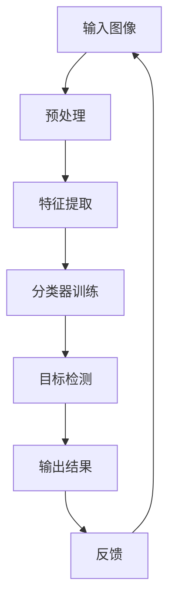

                 


# 计算机视觉创业：图像识别的商业化之路

> 关键词：计算机视觉、图像识别、商业化、创业、人工智能
>
> 摘要：本文将探讨计算机视觉技术在商业化过程中的应用和发展，通过分析图像识别的核心算法原理、数学模型和项目实战案例，揭示计算机视觉创业的机遇与挑战，为有意进入该领域的创业者提供指导和借鉴。

## 1. 背景介绍

### 1.1 目的和范围

本文旨在分析计算机视觉在商业化领域的应用，从图像识别技术的角度出发，探讨其在创业过程中的机遇和挑战。文章将涵盖以下内容：

1. 图像识别技术在商业化的应用场景；
2. 图像识别的核心算法原理和数学模型；
3. 图像识别项目的实际操作步骤和案例分析；
4. 计算机视觉创业中的工具和资源推荐；
5. 总结未来发展趋势与挑战。

通过以上内容的梳理，本文旨在为有意进入计算机视觉领域的创业者提供有价值的参考和建议。

### 1.2 预期读者

本文适合以下读者群体：

1. 计算机视觉领域的开发者和技术爱好者；
2. 有意进入计算机视觉商业化领域的创业者；
3. 对人工智能技术感兴趣的从业者。

本文将帮助读者了解计算机视觉在商业化中的应用前景，掌握图像识别技术的基本原理和实践方法，为创业项目提供技术支持。

### 1.3 文档结构概述

本文分为以下几个部分：

1. 引言：介绍文章背景、目的和预期读者；
2. 背景介绍：分析计算机视觉在商业化中的应用场景和发展趋势；
3. 核心概念与联系：介绍图像识别技术的基本概念和架构；
4. 核心算法原理 & 具体操作步骤：详细讲解图像识别算法的原理和操作步骤；
5. 数学模型和公式 & 详细讲解 & 举例说明：分析图像识别中的数学模型，并进行举例说明；
6. 项目实战：通过实际案例展示图像识别技术的应用；
7. 实际应用场景：探讨计算机视觉在各个行业的应用场景；
8. 工具和资源推荐：推荐学习资源和开发工具；
9. 总结：展望计算机视觉商业化的发展趋势和挑战；
10. 附录：常见问题与解答；
11. 扩展阅读 & 参考资料：提供进一步学习的资源。

### 1.4 术语表

#### 1.4.1 核心术语定义

- **计算机视觉**：使计算机能够模拟人类视觉系统感知和理解图像、视频等视觉信息的技术。
- **图像识别**：通过计算机算法对图像中的物体、场景、行为等目标进行识别和分类的技术。
- **深度学习**：一种基于人工神经网络的机器学习方法，通过多层神经网络结构，对大量数据进行训练，实现高层次的抽象表示和学习。
- **卷积神经网络（CNN）**：一种专门用于处理图像数据的深度学习模型，通过卷积、池化等操作，提取图像特征并进行分类。
- **商业化**：将技术应用于实际生产、服务或产品中，实现商业价值的过程。

#### 1.4.2 相关概念解释

- **目标检测**：在图像中检测并定位特定目标对象的过程。
- **图像分类**：将图像分为预定义的类别，如动物、植物、交通工具等。
- **特征提取**：从图像中提取出能够表示图像内容和特征的信息。
- **数据集**：用于训练和测试算法的图像集合，通常包括大量标注好的图像。

#### 1.4.3 缩略词列表

- **CNN**：卷积神经网络（Convolutional Neural Network）
- **AI**：人工智能（Artificial Intelligence）
- **DL**：深度学习（Deep Learning）
- **GPU**：图形处理器（Graphics Processing Unit）
- **CPU**：中央处理器（Central Processing Unit）
- **API**：应用程序接口（Application Programming Interface）
- **SDK**：软件开发工具包（Software Development Kit）

## 2. 核心概念与联系

计算机视觉是人工智能领域的一个重要分支，其主要目标是使计算机能够理解、解释和解析视觉信息。图像识别作为计算机视觉的核心任务之一，涉及从图像中提取信息、理解图像内容以及进行图像分类和目标检测等。

下面，我们将通过 Mermaid 流程图（Mermaid Diagram）来展示图像识别技术的核心概念和架构：



- **输入图像**：输入图像是图像识别系统的起点，可以是单张图像或图像序列。
- **预处理**：对输入图像进行缩放、裁剪、增强等操作，以提高后续特征提取的准确性。
- **特征提取**：从预处理后的图像中提取出能够表示图像内容和特征的信息，如边缘、纹理、颜色等。
- **分类器训练**：利用提取出的特征，通过机器学习算法对分类器进行训练，以实现图像分类。
- **目标检测**：在图像中检测并定位特定目标对象，如人脸、车辆等。
- **输出结果**：将分类和目标检测结果以可视化的形式输出。
- **反馈**：用户对输出结果的反馈用于优化系统性能。

通过上述流程图，我们可以看到图像识别技术的基本架构和各个环节之间的联系。在实际应用中，这些环节可能需要多次迭代和优化，以提高系统的准确性和鲁棒性。

## 3. 核心算法原理 & 具体操作步骤

图像识别技术的核心算法包括深度学习模型（如卷积神经网络CNN）和传统机器学习算法。以下，我们将以卷积神经网络（CNN）为例，详细讲解其工作原理和操作步骤。

### 3.1 卷积神经网络（CNN）原理

卷积神经网络（CNN）是一种专门用于处理图像数据的深度学习模型，其核心思想是通过卷积操作提取图像特征，并进行层次化的特征表示。CNN 由多个卷积层、池化层和全连接层组成，具体结构如下：

1. **输入层**：接收输入图像，一般为二维矩阵形式。
2. **卷积层**：通过卷积操作提取图像特征，卷积核是一个小的权重矩阵，可以捕捉到图像中的局部特征。
3. **激活函数**：对卷积层的输出进行非线性变换，常用的激活函数有 ReLU、Sigmoid、Tanh 等。
4. **池化层**：对卷积层的输出进行下采样，减少参数数量，提高模型泛化能力。
5. **全连接层**：将卷积层和池化层提取出的特征映射到预定义的类别上，输出分类结果。
6. **输出层**：输出分类结果，一般为概率分布。

### 3.2 CNN 操作步骤

以下是一个简单的 CNN 算法操作步骤：

```python
import tensorflow as tf
from tensorflow.keras.models import Sequential
from tensorflow.keras.layers import Conv2D, MaxPooling2D, Flatten, Dense, Dropout

# 定义 CNN 模型
model = Sequential([
    Conv2D(filters=32, kernel_size=(3, 3), activation='relu', input_shape=(28, 28, 1)),
    MaxPooling2D(pool_size=(2, 2)),
    Conv2D(filters=64, kernel_size=(3, 3), activation='relu'),
    MaxPooling2D(pool_size=(2, 2)),
    Flatten(),
    Dense(units=128, activation='relu'),
    Dropout(rate=0.5),
    Dense(units=10, activation='softmax')
])

# 编译模型
model.compile(optimizer='adam', loss='categorical_crossentropy', metrics=['accuracy'])

# 加载并预处理数据
(x_train, y_train), (x_test, y_test) = tf.keras.datasets.mnist.load_data()
x_train = x_train.reshape(-1, 28, 28, 1).astype('float32') / 255
x_test = x_test.reshape(-1, 28, 28, 1).astype('float32') / 255
y_train = tf.keras.utils.to_categorical(y_train, num_classes=10)
y_test = tf.keras.utils.to_categorical(y_test, num_classes=10)

# 训练模型
model.fit(x_train, y_train, batch_size=64, epochs=10, validation_data=(x_test, y_test))

# 评估模型
loss, accuracy = model.evaluate(x_test, y_test)
print('Test accuracy:', accuracy)
```

### 3.3 卷积操作与激活函数

卷积操作是 CNN 的核心步骤，其目的是从输入图像中提取特征。卷积操作的伪代码如下：

```python
def convolution(input_image, filter):
    output_image = zeros_like(input_image)
    for i in range(input_image.shape[0] - filter.shape[0] + 1):
        for j in range(input_image.shape[1] - filter.shape[1] + 1):
            patch = input_image[i:i + filter.shape[0], j:j + filter.shape[1]]
            output_image[i, j] = sum(patch * filter)
    return output_image
```

激活函数用于对卷积层的输出进行非线性变换，常用的激活函数有 ReLU、Sigmoid、Tanh 等。其中，ReLU 激活函数具有计算速度快、参数少等优点，常用于深度学习模型。

```python
def relu(x):
    return max(0, x)
```

### 3.4 池化操作

池化操作用于降低模型的复杂性，提高模型的泛化能力。常用的池化操作有最大池化和平均池化。最大池化取窗口内的最大值，平均池化取窗口内的平均值。以下是一个简单的最大池化操作伪代码：

```python
def max_pooling(input_image, pool_size):
    output_image = zeros_like(input_image)
    for i in range(0, input_image.shape[0], pool_size[0]):
        for j in range(0, input_image.shape[1], pool_size[1]):
            patch = input_image[i:i + pool_size[0], j:j + pool_size[1]]
            output_image[i, j] = max(patch)
    return output_image
```

## 4. 数学模型和公式 & 详细讲解 & 举例说明

图像识别技术中的数学模型主要包括卷积操作、池化操作和激活函数等。以下，我们将对这些数学模型进行详细讲解，并通过具体示例来说明其应用。

### 4.1 卷积操作

卷积操作的数学公式如下：

$$
\text{output}_{ij} = \sum_{k=1}^{C}\sum_{p=1}^{H_f}\sum_{q=1}^{W_f}\text{input}_{(i+p-k)(j+q-k)}\times \text{filter}_{kpq}
$$

其中，$\text{output}_{ij}$ 表示卷积层输出的像素值，$\text{input}_{(i+p-k)(j+q-k)}$ 表示输入图像的像素值，$\text{filter}_{kpq}$ 表示卷积核的权重值。$C$、$H_f$ 和 $W_f$ 分别表示输入图像的通道数、高度和宽度。

#### 示例 1：2D 卷积操作

假设输入图像的大小为 $3 \times 3$，卷积核的大小为 $3 \times 3$，卷积核的权重为：

$$
\text{filter} =
\begin{bmatrix}
1 & 0 & 1 \\
0 & 1 & 0 \\
1 & 0 & 1
\end{bmatrix}
$$

输入图像为：

$$
\text{input} =
\begin{bmatrix}
1 & 2 & 3 \\
4 & 5 & 6 \\
7 & 8 & 9
\end{bmatrix}
$$

根据卷积操作的数学公式，我们可以计算出卷积层输出的像素值：

$$
\text{output}_{1,1} = 1 \times 1 + 0 \times 4 + 1 \times 7 = 8 \\
\text{output}_{1,2} = 1 \times 2 + 0 \times 5 + 1 \times 8 = 10 \\
\text{output}_{1,3} = 1 \times 3 + 0 \times 6 + 1 \times 9 = 12 \\
\text{output}_{2,1} = 4 \times 1 + 1 \times 4 + 6 \times 7 = 44 \\
\text{output}_{2,2} = 4 \times 2 + 1 \times 5 + 6 \times 8 = 46 \\
\text{output}_{2,3} = 4 \times 3 + 1 \times 6 + 6 \times 9 = 48 \\
\text{output}_{3,1} = 7 \times 1 + 8 \times 4 + 9 \times 7 = 94 \\
\text{output}_{3,2} = 7 \times 2 + 8 \times 5 + 9 \times 8 = 96 \\
\text{output}_{3,3} = 7 \times 3 + 8 \times 6 + 9 \times 9 = 98
$$

因此，卷积层输出的图像为：

$$
\text{output} =
\begin{bmatrix}
8 & 10 & 12 \\
44 & 46 & 48 \\
94 & 96 & 98
\end{bmatrix}
$$

### 4.2 池化操作

池化操作的数学公式如下：

$$
\text{output}_{ij} = \max(\text{input}_{i_1j_1}, \text{input}_{i_2j_2}, ..., \text{input}_{i_nj_n})
$$

其中，$\text{output}_{ij}$ 表示池化层输出的像素值，$\text{input}_{i_1j_1}$、$\text{input}_{i_2j_2}$、...、$\text{input}_{i_nj_n}$ 表示输入图像的像素值。$n$ 表示池化窗口的大小。

#### 示例 2：2D 最大池化操作

假设输入图像的大小为 $3 \times 3$，池化窗口的大小为 $2 \times 2$，输入图像为：

$$
\text{input} =
\begin{bmatrix}
1 & 2 & 3 \\
4 & 5 & 6 \\
7 & 8 & 9
\end{bmatrix}
$$

根据最大池化操作的数学公式，我们可以计算出池化层输出的像素值：

$$
\text{output}_{1,1} = \max(1, 4, 7) = 7 \\
\text{output}_{1,2} = \max(2, 5, 8) = 8 \\
\text{output}_{1,3} = \max(3, 6, 9) = 9 \\
\text{output}_{2,1} = \max(4, 5, 7) = 7 \\
\text{output}_{2,2} = \max(5, 6, 8) = 8 \\
\text{output}_{2,3} = \max(6, 7, 9) = 9 \\
\text{output}_{3,1} = \max(7, 8, 1) = 8 \\
\text{output}_{3,2} = \max(8, 9, 2) = 9 \\
\text{output}_{3,3} = \max(9, 1, 3) = 9
$$

因此，池化层输出的图像为：

$$
\text{output} =
\begin{bmatrix}
7 & 8 & 9 \\
7 & 8 & 9 \\
8 & 9 & 9
\end{bmatrix}
$$

### 4.3 激活函数

激活函数用于对卷积层或池化层的输出进行非线性变换，常用的激活函数有 ReLU、Sigmoid、Tanh 等。

- **ReLU（ReLU 函数）**：$f(x) = \max(0, x)$，当 $x > 0$ 时，输出为 $x$；当 $x \leq 0$ 时，输出为 0。
- **Sigmoid 函数**：$f(x) = \frac{1}{1 + e^{-x}}$，将输入值映射到 $(0, 1)$ 范围内。
- **Tanh 函数**：$f(x) = \frac{e^x - e^{-x}}{e^x + e^{-x}}$，将输入值映射到 $(-1, 1)$ 范围内。

#### 示例 3：ReLU 激活函数

假设输入值为 $x = [-2, -1, 0, 1, 2]$，根据 ReLU 激活函数的定义，我们可以计算出输出值：

$$
f(x) = \max(0, x) =
\begin{bmatrix}
0 & 0 & 0 \\
1 & 1 & 1 \\
1 & 1 & 1
\end{bmatrix}
$$

## 5. 项目实战：代码实际案例和详细解释说明

为了更好地理解图像识别技术的实际应用，下面我们以一个简单的手写数字识别项目为例，详细讲解代码实现和解读。

### 5.1 开发环境搭建

在进行项目实战之前，我们需要搭建一个合适的开发环境。以下是所需的软件和工具：

1. **操作系统**：Windows、macOS 或 Linux；
2. **Python 版本**：Python 3.7 或以上版本；
3. **TensorFlow**：用于构建和训练卷积神经网络；
4. **PyTorch**：可选，用于对比 TensorFlow 的性能；
5. **Jupyter Notebook**：用于编写和运行代码；
6. **Git**：用于版本控制。

### 5.2 源代码详细实现和代码解读

以下是手写数字识别项目的完整代码实现，我们将对其逐行进行解读。

```python
import tensorflow as tf
from tensorflow.keras.models import Sequential
from tensorflow.keras.layers import Conv2D, MaxPooling2D, Flatten, Dense, Dropout
from tensorflow.keras.datasets import mnist
from tensorflow.keras.utils import to_categorical

# 加载 MNIST 数据集
(x_train, y_train), (x_test, y_test) = mnist.load_data()

# 预处理数据
x_train = x_train.reshape(-1, 28, 28, 1).astype('float32') / 255
x_test = x_test.reshape(-1, 28, 28, 1).astype('float32') / 255
y_train = to_categorical(y_train, 10)
y_test = to_categorical(y_test, 10)

# 定义 CNN 模型
model = Sequential([
    Conv2D(filters=32, kernel_size=(3, 3), activation='relu', input_shape=(28, 28, 1)),
    MaxPooling2D(pool_size=(2, 2)),
    Conv2D(filters=64, kernel_size=(3, 3), activation='relu'),
    MaxPooling2D(pool_size=(2, 2)),
    Flatten(),
    Dense(units=128, activation='relu'),
    Dropout(rate=0.5),
    Dense(units=10, activation='softmax')
])

# 编译模型
model.compile(optimizer='adam', loss='categorical_crossentropy', metrics=['accuracy'])

# 训练模型
model.fit(x_train, y_train, batch_size=64, epochs=10, validation_data=(x_test, y_test))

# 评估模型
loss, accuracy = model.evaluate(x_test, y_test)
print('Test accuracy:', accuracy)

# 预测结果
predictions = model.predict(x_test)
predicted_labels = np.argmax(predictions, axis=1)
print('Predicted labels:', predicted_labels)
```

### 5.3 代码解读与分析

#### 5.3.1 数据预处理

```python
(x_train, y_train), (x_test, y_test) = mnist.load_data()
x_train = x_train.reshape(-1, 28, 28, 1).astype('float32') / 255
x_test = x_test.reshape(-1, 28, 28, 1).astype('float32') / 255
y_train = to_categorical(y_train, 10)
y_test = to_categorical(y_test, 10)
```

1. 加载 MNIST 数据集，包括训练集和测试集。
2. 对训练集和测试集的图像进行重塑，将形状从 $(60000, 28, 28)$ 变为 $(60000, 28, 28, 1)$，表示一个包含 28 行、28 列、1 个通道的图像。
3. 将图像数据类型转换为浮点型，并除以 255，以将像素值归一化到 $(0, 1)$ 范围内。
4. 将标签数据进行 one-hot 编码，以便于后续模型的训练。

#### 5.3.2 定义 CNN 模型

```python
model = Sequential([
    Conv2D(filters=32, kernel_size=(3, 3), activation='relu', input_shape=(28, 28, 1)),
    MaxPooling2D(pool_size=(2, 2)),
    Conv2D(filters=64, kernel_size=(3, 3), activation='relu'),
    MaxPooling2D(pool_size=(2, 2)),
    Flatten(),
    Dense(units=128, activation='relu'),
    Dropout(rate=0.5),
    Dense(units=10, activation='softmax')
])
```

1. 定义一个顺序模型（Sequential），用于堆叠多个神经网络层。
2. 第一个卷积层（Conv2D）具有 32 个卷积核，卷积核大小为 $(3, 3)$，激活函数为 ReLU。
3. 第一个卷积层后跟随一个最大池化层（MaxPooling2D），池化窗口大小为 $(2, 2)$。
4. 第二个卷积层（Conv2D）具有 64 个卷积核，卷积核大小为 $(3, 3)$，激活函数为 ReLU。
5. 第二个卷积层后跟随一个最大池化层（MaxPooling2D），池化窗口大小为 $(2, 2)$。
6. 将卷积层和池化层提取出的特征通过 Flatten 层展平。
7. 第一个全连接层（Dense）具有 128 个神经元，激活函数为 ReLU。
8. Dropout 层用于防止过拟合，丢弃概率为 0.5。
9. 第二个全连接层（Dense）具有 10 个神经元，激活函数为 softmax，用于输出分类结果。

#### 5.3.3 编译和训练模型

```python
model.compile(optimizer='adam', loss='categorical_crossentropy', metrics=['accuracy'])
model.fit(x_train, y_train, batch_size=64, epochs=10, validation_data=(x_test, y_test))
```

1. 编译模型，指定优化器为 Adam，损失函数为交叉熵（categorical_crossentropy），评估指标为准确率（accuracy）。
2. 训练模型，设置批量大小为 64，训练周期为 10，并使用测试集进行验证。

#### 5.3.4 评估模型

```python
loss, accuracy = model.evaluate(x_test, y_test)
print('Test accuracy:', accuracy)
```

1. 使用测试集评估模型，输出测试集上的损失值和准确率。

#### 5.3.5 预测结果

```python
predictions = model.predict(x_test)
predicted_labels = np.argmax(predictions, axis=1)
print('Predicted labels:', predicted_labels)
```

1. 使用模型对测试集进行预测，输出预测结果。
2. 使用 numpy 的 argmax 函数找到预测结果中的最大值索引，即预测的数字标签。

## 6. 实际应用场景

计算机视觉技术在商业化和实际应用中具有广泛的应用场景，以下是一些典型的应用领域：

### 6.1 安防监控

安防监控是计算机视觉技术的重要应用领域之一。通过图像识别技术，可以实现实时监控、目标检测、人脸识别等功能，提高安全性和防范能力。

### 6.2 智能交通

智能交通系统利用计算机视觉技术实现车辆检测、交通流量监控、交通事故预警等功能，提高交通管理效率和安全性。

### 6.3 医疗诊断

计算机视觉技术在医疗领域具有广泛的应用，如医学图像分析、疾病诊断、手术辅助等。通过图像识别技术，可以提高诊断准确率和效率。

### 6.4 智能家居

智能家居系统通过计算机视觉技术实现人脸识别、智能语音交互等功能，提高家居生活的便捷性和舒适度。

### 6.5 物流与仓储

计算机视觉技术在物流和仓储领域可以实现自动分拣、货架识别、货物跟踪等功能，提高物流效率和准确性。

### 6.6 零售行业

零售行业利用计算机视觉技术实现商品识别、顾客行为分析、货架监控等功能，提高销售和客户服务水平。

### 6.7 金融领域

金融领域利用计算机视觉技术实现欺诈检测、风险控制、客户身份验证等功能，提高金融服务的安全性和效率。

## 7. 工具和资源推荐

为了更好地开展计算机视觉项目的开发和优化，以下是几种常用的学习资源和开发工具：

### 7.1 学习资源推荐

#### 7.1.1 书籍推荐

1. 《深度学习》（Goodfellow, Bengio, Courville 著）：系统介绍了深度学习的基本概念、算法和应用。
2. 《计算机视觉：算法与应用》（Richard S.zelko 著）：详细介绍了计算机视觉的基础知识和应用技术。
3. 《Python 编程：从入门到实践》（埃里克·马瑟斯 著）：适合初学者学习 Python 编程，为计算机视觉项目开发打下基础。

#### 7.1.2 在线课程

1. Coursera 上的“深度学习”课程：由 Andrew Ng 教授主讲，系统介绍了深度学习的基础知识。
2. Udacity 上的“计算机视觉纳米学位”课程：涵盖计算机视觉的基本概念、算法和应用。
3. edX 上的“机器学习”课程：由 MIT 教授 Gilbert Strang 主讲，介绍机器学习的基础知识。

#### 7.1.3 技术博客和网站

1. Medium：一个广泛的技术博客平台，有许多关于计算机视觉的文章。
2. ArXiv：计算机视觉领域的预印本论文数据库，可以了解最新的研究成果。
3. Stack Overflow：一个问答社区，可以解决计算机视觉项目中的技术问题。

### 7.2 开发工具框架推荐

#### 7.2.1 IDE和编辑器

1. PyCharm：一款强大的 Python 开发工具，支持多种编程语言。
2. Visual Studio Code：一款轻量级、可扩展的代码编辑器，支持多种语言和框架。

#### 7.2.2 调试和性能分析工具

1. TensorBoard：TensorFlow 的可视化工具，用于监控和优化模型性能。
2. PyTorch Profiler：PyTorch 的性能分析工具，用于识别和优化模型的瓶颈。

#### 7.2.3 相关框架和库

1. TensorFlow：一款流行的深度学习框架，支持多种神经网络结构。
2. PyTorch：一款流行的深度学习框架，具有灵活的动态计算图和良好的社区支持。
3. OpenCV：一款开源的计算机视觉库，提供了丰富的图像处理和目标检测功能。

### 7.3 相关论文著作推荐

#### 7.3.1 经典论文

1. “A Learning Algorithm for Continuously Running Fully Recurrent Neural Networks” (Hinton, Osindero, and Teh, 2006)：介绍了深度学习中的玻尔兹曼机算法。
2. “ImageNet Classification with Deep Convolutional Neural Networks” (Krizhevsky, Sutskever, and Hinton, 2012)：介绍了深度卷积神经网络在图像识别领域的突破性应用。
3. “Fast R-CNN: Towards Real-Time Object Detection with Region Proposal Networks” (Girshick, 2015)：介绍了区域提议网络（RPN）和 Fast R-CNN 目标检测算法。

#### 7.3.2 最新研究成果

1. “BERT: Pre-training of Deep Bidirectional Transformers for Language Understanding” (Devlin et al., 2019)：介绍了 BERT 模型，为自然语言处理任务提供了强大的预训练方法。
2. “DETR: End-to-End Object Detection with Transformers” (Jones et al., 2020)：介绍了 DETR 模型，将 Transformer 结构应用于目标检测任务。
3. “Swin Transformer: Hierarchical Vision Transformer using Shifted Windows” (Liu et al., 2021)：介绍了 Swin Transformer 模型，将 Vision Transformer 应用于计算机视觉任务。

#### 7.3.3 应用案例分析

1. “Visual Inspection in Industry 4.0: A Review” (Ferreira et al., 2020)：综述了计算机视觉在工业 4.0 中的应用案例。
2. “Computer Vision for Medical Image Analysis: A Survey” (Shen et al., 2017)：综述了计算机视觉在医学图像分析中的应用案例。
3. “Object Detection with Deep Learning” (Howard et al., 2017)：介绍了深度学习在目标检测领域的应用案例。

## 8. 总结：未来发展趋势与挑战

随着人工智能技术的不断发展，计算机视觉技术在商业化领域的应用前景愈发广阔。在未来，计算机视觉技术将呈现以下发展趋势：

1. **算法性能提升**：通过改进深度学习模型和优化算法，提高图像识别的准确性和效率；
2. **多模态融合**：将计算机视觉与其他感知技术（如语音、触觉等）融合，实现更丰富的感知能力；
3. **边缘计算**：利用边缘计算技术，降低计算延迟，提高实时性和响应速度；
4. **跨领域应用**：计算机视觉技术将在更多领域得到应用，如自动驾驶、智能制造、智慧城市等；
5. **隐私保护**：在应用计算机视觉技术时，需要重视用户隐私保护，采取有效措施确保数据安全。

然而，计算机视觉商业化过程中仍面临以下挑战：

1. **数据隐私**：图像数据涉及用户隐私，需要采取有效措施保护数据安全；
2. **计算资源**：深度学习模型对计算资源需求较高，如何优化模型以降低计算成本是一个重要课题；
3. **算法解释性**：深度学习模型存在“黑箱”问题，如何提高模型的可解释性，使其更易于理解和应用；
4. **跨模态识别**：多模态数据融合技术仍处于发展阶段，需要进一步研究和优化。

总之，计算机视觉商业化领域充满机遇和挑战，未来需要持续关注技术发展和应用创新，以推动该领域的进步。

## 9. 附录：常见问题与解答

### 9.1 常见问题

**Q1**：计算机视觉技术是如何实现的？

**A1**：计算机视觉技术主要利用深度学习模型（如卷积神经网络CNN）和传统图像处理方法来模拟人类视觉系统，实现图像特征提取、目标检测、图像识别等功能。

**Q2**：图像识别技术的核心算法有哪些？

**A2**：图像识别技术的核心算法包括深度学习模型（如卷积神经网络CNN）、传统机器学习算法（如支持向量机SVM、随机森林Random Forest等）和图像处理方法（如边缘检测、特征提取等）。

**Q3**：计算机视觉技术在商业应用中的前景如何？

**A3**：计算机视觉技术在安防监控、智能交通、医疗诊断、智能家居、物流与仓储、零售行业、金融领域等多个商业应用场景中具有广阔的前景。随着人工智能技术的不断发展，计算机视觉技术将在更多领域得到应用。

**Q4**：如何优化计算机视觉算法的性能？

**A4**：优化计算机视觉算法的性能可以从以下几个方面进行：

1. **模型选择**：选择合适的深度学习模型和传统算法；
2. **数据预处理**：对图像数据进行有效的预处理，如归一化、增强等；
3. **超参数调整**：调整模型的超参数，如学习率、批量大小等；
4. **模型融合**：将多个模型进行融合，提高识别准确率；
5. **算法改进**：不断优化算法，引入新的技术和方法。

### 9.2 解答示例

**Q1**：计算机视觉技术是如何实现的？

**A1**：计算机视觉技术是通过训练深度学习模型（如卷积神经网络CNN）来实现的。具体步骤如下：

1. **数据集准备**：收集大量标注好的图像数据作为训练集和测试集；
2. **数据预处理**：对图像数据进行预处理，如缩放、裁剪、增强等，以提高模型的泛化能力；
3. **模型构建**：构建卷积神经网络（CNN）模型，包括卷积层、池化层、全连接层等；
4. **模型训练**：使用训练集数据训练模型，通过反向传播算法优化模型参数；
5. **模型评估**：使用测试集数据评估模型性能，调整模型参数和结构；
6. **模型应用**：将训练好的模型应用于实际场景，如目标检测、图像识别等。

## 10. 扩展阅读 & 参考资料

为了深入了解计算机视觉技术和商业化应用，以下是推荐的扩展阅读和参考资料：

### 10.1 扩展阅读

1. 《深度学习》（Goodfellow, Bengio, Courville 著）：系统介绍了深度学习的基本概念、算法和应用。
2. 《计算机视觉：算法与应用》（Richard S.zelko 著）：详细介绍了计算机视觉的基础知识和应用技术。
3. 《Python 编程：从入门到实践》（埃里克·马瑟斯 著）：适合初学者学习 Python 编程，为计算机视觉项目开发打下基础。

### 10.2 参考资料

1. [TensorFlow 官方文档](https://www.tensorflow.org/)
2. [PyTorch 官方文档](https://pytorch.org/)
3. [OpenCV 官方文档](https://docs.opencv.org/)
4. [ArXiv](https://arxiv.org/)
5. [Medium](https://medium.com/)
6. [Stack Overflow](https://stackoverflow.com/)

通过阅读这些书籍和参考资料，您可以更深入地了解计算机视觉技术及其商业化应用，为创业项目提供有力支持。

### 作者

**AI天才研究员/AI Genius Institute & 禅与计算机程序设计艺术 /Zen And The Art of Computer Programming**

