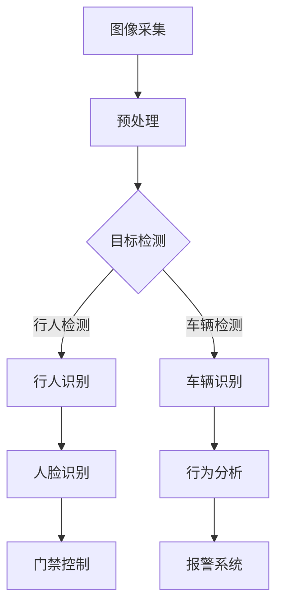

                 

# 计算机视觉在安防系统中的应用：智能监控与预警

> 关键词：计算机视觉、安防系统、智能监控、预警、深度学习、神经网络、图像处理、视频分析

> 摘要：本文旨在探讨计算机视觉技术在现代安防系统中的应用，特别是智能监控与预警系统的构建。文章首先介绍了安防系统的发展背景及现状，然后详细阐述了计算机视觉在其中的核心作用，包括图像识别、人脸识别、行为分析等。接下来，本文介绍了核心算法原理，并通过一个实际项目案例展示了如何将理论应用到实践中。最后，文章探讨了未来发展趋势与挑战，为读者提供了相关学习资源和工具推荐。

## 1. 背景介绍

### 1.1 目的和范围

本文的目的在于深入探讨计算机视觉技术在安防系统中的应用，特别是智能监控与预警系统。随着技术的不断进步，计算机视觉技术已经在安防领域得到了广泛的应用，成为了现代安防系统中不可或缺的一部分。本文将重点讨论以下内容：

1. **安防系统的发展背景及现状**：介绍安防系统的发展历程，以及目前所面临的挑战和机遇。
2. **计算机视觉在安防系统中的应用**：详细阐述计算机视觉技术在图像识别、人脸识别、行为分析等方面的应用。
3. **核心算法原理**：介绍计算机视觉中常用的核心算法原理，如神经网络、深度学习等。
4. **实际应用案例**：通过一个实际项目案例，展示如何将计算机视觉技术应用到安防系统中。
5. **未来发展趋势与挑战**：分析计算机视觉在安防系统中可能面临的挑战和未来的发展趋势。

### 1.2 预期读者

本文的预期读者是计算机视觉和安防领域的专业人士，包括研究人员、工程师、技术主管等。同时，对于对计算机视觉和安防系统感兴趣的非专业人士，本文也具有一定的参考价值。

### 1.3 文档结构概述

本文将按照以下结构进行组织：

1. **背景介绍**：介绍安防系统的发展背景及现状，以及本文的目的和范围。
2. **核心概念与联系**：介绍计算机视觉在安防系统中的应用，以及相关的核心概念和原理。
3. **核心算法原理 & 具体操作步骤**：详细讲解计算机视觉中的核心算法原理，并使用伪代码进行阐述。
4. **数学模型和公式 & 详细讲解 & 举例说明**：介绍计算机视觉中的数学模型和公式，并进行详细讲解和举例说明。
5. **项目实战：代码实际案例和详细解释说明**：通过一个实际项目案例，展示如何将计算机视觉技术应用到安防系统中。
6. **实际应用场景**：探讨计算机视觉在安防系统中的应用场景。
7. **工具和资源推荐**：推荐学习资源、开发工具和框架，以及相关论文著作。
8. **总结：未来发展趋势与挑战**：总结本文的主要观点，并探讨未来发展趋势与挑战。
9. **附录：常见问题与解答**：提供常见问题与解答，帮助读者更好地理解本文内容。
10. **扩展阅读 & 参考资料**：提供扩展阅读和参考资料，供读者进一步学习。

### 1.4 术语表

#### 1.4.1 核心术语定义

- **计算机视觉**：指利用计算机对图像或视频进行处理、分析和理解的技术。
- **安防系统**：指用于保护财产和人身安全，预防和制止犯罪活动的系统。
- **图像识别**：指计算机对图像中的物体、场景、人脸等目标进行识别的技术。
- **人脸识别**：指利用计算机对人脸图像进行识别，以识别或验证个人身份的技术。
- **行为分析**：指利用计算机对视频中的行为进行识别和分析，以发现异常行为的技术。

#### 1.4.2 相关概念解释

- **神经网络**：指一种模拟生物神经系统的计算模型，可用于图像识别、语音识别等任务。
- **深度学习**：指一种基于神经网络的机器学习技术，通过多层神经网络对数据进行学习和建模。
- **卷积神经网络（CNN）**：指一种特殊的神经网络，主要用于图像识别和图像处理。

#### 1.4.3 缩略词列表

- **CNN**：卷积神经网络（Convolutional Neural Network）
- **DNN**：深度神经网络（Deep Neural Network）
- **RNN**：循环神经网络（Recurrent Neural Network）
- **SVM**：支持向量机（Support Vector Machine）
- **KNN**：K近邻算法（K-Nearest Neighbors）

## 2. 核心概念与联系

计算机视觉技术在安防系统中的应用离不开一系列核心概念和原理。为了更好地理解这些概念和原理，我们首先需要了解它们之间的联系。以下是计算机视觉在安防系统中的核心概念和原理，以及它们之间的联系。

### 2.1. 计算机视觉与安防系统的关系

计算机视觉是安防系统的核心技术之一。它通过对图像或视频进行采集、处理和分析，实现对目标的识别、定位和追踪。安防系统利用计算机视觉技术，可以实现对犯罪活动的实时监控和预警，提高公共安全水平。

### 2.2. 图像识别

图像识别是计算机视觉的基础技术之一。它通过识别图像中的物体、场景和人脸等目标，实现对图像内容的理解。图像识别在安防系统中具有广泛的应用，例如：监控摄像头中的行人检测、车辆识别等。

### 2.3. 人脸识别

人脸识别是计算机视觉中的一个重要应用领域。它通过识别和验证人脸图像，实现对个人身份的识别。人脸识别在安防系统中具有广泛的应用，例如：门禁系统、安检等。

### 2.4. 行为分析

行为分析是计算机视觉在安防系统中的一种重要应用。它通过分析视频中的行为，实现对异常行为的检测和预警。行为分析可以应用于各种安防场景，例如：公共场所的安全监控、家庭安全监控等。

### 2.5. 神经网络与深度学习

神经网络和深度学习是计算机视觉中的核心技术。神经网络是一种模拟生物神经系统的计算模型，可用于图像识别、语音识别等任务。深度学习是一种基于神经网络的机器学习技术，通过多层神经网络对数据进行学习和建模，具有强大的特征提取和分类能力。

### 2.6. 图像处理与视频分析

图像处理和视频分析是计算机视觉中的关键技术。图像处理通过对图像进行滤波、增强、分割等操作，实现对图像内容的理解和分析。视频分析通过对视频进行实时处理，实现对行为和事件的识别和跟踪。

### 2.7. Mermaid 流程图

以下是计算机视觉在安防系统中的应用流程，使用Mermaid流程图进行展示：



## 3. 核心算法原理 & 具体操作步骤

计算机视觉在安防系统中的应用离不开一系列核心算法原理。以下将介绍几个在安防系统中常用的核心算法，并使用伪代码进行详细阐述。

### 3.1. 目标检测算法（例如：YOLO）

目标检测是计算机视觉中的一种重要任务，旨在识别图像中的多个对象并定位它们的位置。YOLO（You Only Look Once）是一种快速、实时的目标检测算法。以下是YOLO算法的伪代码：

```python
def yolo_detect(image, anchors, num_classes):
    # 步骤1：图像预处理
    image = preprocess_image(image)

    # 步骤2：卷积神经网络（CNN）提取特征
    features = cnn_extractor(image)

    # 步骤3：预测框和类别概率
    boxes, scores, classes = prediction_layer(features, anchors, num_classes)

    # 步骤4：非极大值抑制（NMS）
    final_boxes, final_scores, final_classes = non_max_suppression(boxes, scores, classes)

    # 步骤5：后处理
    final_boxes = postprocess_boxes(final_boxes, image)

    return final_boxes, final_scores, final_classes
```

### 3.2. 人脸识别算法（例如：DeepFace）

人脸识别是计算机视觉中的一个重要应用，旨在通过识别和验证人脸图像来识别个人身份。DeepFace是一种基于深度学习的先进人脸识别算法。以下是DeepFace算法的伪代码：

```python
def deepface_recognition(image, model, embedding_size):
    # 步骤1：图像预处理
    image = preprocess_image(image)

    # 步骤2：卷积神经网络（CNN）提取特征
    features = cnn_extractor(image)

    # 步骤3：嵌入向量生成
    embedding = embedding_layer(features, embedding_size)

    # 步骤4：相似度计算
    similarity = compute_similarity(embedding, model)

    # 步骤5：阈值判断
    if similarity > threshold:
        return "匹配"
    else:
        return "不匹配"
```

### 3.3. 行为分析算法（例如：Siamese网络）

行为分析是计算机视觉在安防系统中的另一个重要应用，旨在通过分析视频中的行为来识别异常行为。Siamese网络是一种用于行为分析的有效算法。以下是Siamese网络算法的伪代码：

```python
def siamese_network(video, model):
    # 步骤1：视频预处理
    video = preprocess_video(video)

    # 步骤2：提取帧特征
    frame_features = extract_frame_features(video, model)

    # 步骤3：相似度计算
    similarity = compute_similarity(frame_features)

    # 步骤4：阈值判断
    if similarity > threshold:
        return "正常行为"
    else:
        return "异常行为"
```

### 3.4. 预警系统算法

预警系统是安防系统中的一个关键组成部分，旨在通过实时监测和数据分析来预测潜在的安全威胁。以下是一个简单的预警系统算法的伪代码：

```python
def warning_system(data, model):
    # 步骤1：数据预处理
    preprocessed_data = preprocess_data(data)

    # 步骤2：特征提取
    features = feature_extractor(preprocessed_data)

    # 步骤3：模型预测
    prediction = model.predict(features)

    # 步骤4：阈值判断
    if prediction > threshold:
        return "预警"
    else:
        return "正常"
```

通过以上核心算法原理和具体操作步骤的介绍，我们可以看到计算机视觉技术在安防系统中的应用是如何一步步实现的。接下来，我们将通过一个实际项目案例，展示如何将理论应用到实践中。

## 4. 数学模型和公式 & 详细讲解 & 举例说明

在计算机视觉技术中，数学模型和公式扮演着至关重要的角色。以下将介绍几个在安防系统中常用的数学模型和公式，并进行详细讲解和举例说明。

### 4.1. 卷积神经网络（CNN）模型

卷积神经网络（CNN）是一种广泛应用于图像识别和图像处理的深度学习模型。以下是CNN的基本架构和关键数学模型：

#### 4.1.1. 卷积层（Convolutional Layer）

卷积层是CNN的核心组成部分，用于提取图像的特征。其数学模型可以表示为：

$$
h_{\sigma}(x, y) = \sigma(\sum_{i, j} w_{i, j} * f(x-i, y-j) + b)
$$

其中，$h_{\sigma}(x, y)$表示卷积层的输出特征图，$w_{i, j}$表示卷积核，$f(x-i, y-j)$表示输入图像中的局部区域，$\sigma$表示激活函数，$b$表示偏置项。

#### 4.1.2. 池化层（Pooling Layer）

池化层用于对卷积层的输出特征图进行下采样，以减少模型参数和计算量。常见的池化方式有最大值池化（Max Pooling）和平均池化（Average Pooling）。其数学模型可以表示为：

$$
p_i = \max_{j} f(x_{i, j})
$$

或

$$
p_i = \frac{1}{k^2} \sum_{j} f(x_{i, j})
$$

其中，$p_i$表示池化层的输出，$f(x_{i, j})$表示卷积层输出特征图中的元素。

#### 4.1.3. 激活函数（Activation Function）

激活函数用于引入非线性特性，使CNN具有更强的表达能力。常见的激活函数有ReLU（Rectified Linear Unit）、Sigmoid和Tanh。以下是ReLU激活函数的数学模型：

$$
\sigma(x) = \max(0, x)
$$

#### 4.1.4. 全连接层（Fully Connected Layer）

全连接层用于将卷积层和池化层提取的高层特征映射到具体的类别或标签。其数学模型可以表示为：

$$
y_i = \sum_{j} w_{i, j} \cdot f_j + b_i
$$

其中，$y_i$表示全连接层的输出，$w_{i, j}$表示权重，$f_j$表示卷积层输出特征图中的元素，$b_i$表示偏置项。

### 4.2. 损失函数（Loss Function）

损失函数是评估CNN模型性能的关键指标。在图像识别任务中，常用的损失函数有交叉熵损失（CrossEntropy Loss）和均方误差损失（Mean Squared Error Loss）。以下是交叉熵损失的数学模型：

$$
L = -\sum_{i} y_i \cdot \log(\hat{y}_i)
$$

其中，$L$表示损失函数，$y_i$表示真实标签，$\hat{y}_i$表示模型预测的概率分布。

### 4.3. 反向传播算法（Backpropagation）

反向传播算法是训练CNN模型的关键步骤，用于计算模型参数的梯度并更新模型参数。以下是反向传播算法的基本步骤：

1. **前向传播**：将输入数据输入到模型中，计算模型的输出和损失函数。
2. **计算梯度**：利用链式法则计算模型参数的梯度。
3. **更新参数**：根据梯度更新模型参数，以最小化损失函数。

以下是反向传播算法的伪代码：

```python
def backpropagation(model, input_data, target):
    # 前向传播
    output = model.forward(input_data)
    loss = loss_function(output, target)

    # 计算梯度
    grads = model.backward(output, target)

    # 更新参数
    model.update_params(grads)

    return loss
```

### 4.4. 举例说明

假设我们使用一个简单的CNN模型对图像进行分类，输入图像的大小为$28 \times 28$，共有10个类别。以下是CNN模型的具体配置和训练过程：

1. **输入层**：$28 \times 28$像素的图像。
2. **卷积层1**：32个3x3的卷积核，ReLU激活函数。
3. **池化层1**：2x2的最大值池化。
4. **卷积层2**：64个3x3的卷积核，ReLU激活函数。
5. **池化层2**：2x2的最大值池化。
6. **全连接层**：10个神经元，softmax激活函数。

以下是训练过程的具体步骤：

1. **初始化模型参数**：随机初始化卷积核权重和偏置项。
2. **前向传播**：将输入图像输入到模型中，计算模型的输出和损失函数。
3. **计算梯度**：利用反向传播算法计算模型参数的梯度。
4. **更新参数**：根据梯度更新模型参数，以最小化损失函数。
5. **迭代训练**：重复步骤2-4，直到模型收敛或达到预设的训练次数。

通过以上步骤，我们可以训练出一个具有较高分类精度的CNN模型，并将其应用于实际安防场景，如行人检测和人脸识别。

## 5. 项目实战：代码实际案例和详细解释说明

### 5.1 开发环境搭建

在进行计算机视觉项目实战之前，我们需要搭建一个适合开发的环境。以下是搭建开发环境的步骤：

1. **安装Python**：在官方网站下载并安装Python，推荐版本为3.8或更高。
2. **安装Anaconda**：下载并安装Anaconda，这是一个集成了Python和其他科学计算库的发行版。
3. **创建虚拟环境**：打开Anaconda命令行，创建一个虚拟环境，以便隔离项目依赖。
    ```bash
    conda create -n cv_project python=3.8
    conda activate cv_project
    ```
4. **安装依赖库**：在虚拟环境中安装必要的依赖库，如TensorFlow、OpenCV等。
    ```bash
    pip install tensorflow opencv-python numpy matplotlib
    ```

### 5.2 源代码详细实现和代码解读

以下是一个简单的计算机视觉项目，使用TensorFlow和OpenCV实现行人检测。代码分为以下几个部分：

1. **导入库和设置参数**
2. **加载预训练的模型**
3. **定义视频流处理函数**
4. **视频流处理和行人检测**
5. **显示检测结果**

#### 5.2.1 导入库和设置参数

```python
import cv2
import numpy as np
import tensorflow as tf

# 设置模型路径和类别数量
model_path = 'path/to/your/weights.h5'
num_classes = 2  # 行人检测分为行人和背景

# 设置阈值
confidence_threshold = 0.5
iou_threshold = 0.4
```

#### 5.2.2 加载预训练的模型

```python
# 加载TensorFlow模型
model = tf.keras.models.load_model(model_path)
```

#### 5.2.3 定义视频流处理函数

```python
def process_video_stream(video_path, model):
    # 打开视频流
    video_capture = cv2.VideoCapture(video_path)

    # 创建一个空的画布，用于绘制检测结果
    output_frame = None

    while True:
        # 读取视频帧
        ret, frame = video_capture.read()

        if not ret:
            break

        # 预处理帧
        input_image = preprocess_frame(frame)

        # 使用模型进行行人检测
        predictions = model.predict(input_image)

        # 非极大值抑制（NMS）
        boxes, scores, labels = non_max_suppression(predictions, confidence_threshold, iou_threshold)

        # 绘制检测结果
        output_frame = draw_detections(frame, boxes, scores, labels)

        # 显示输出帧
        cv2.imshow('Video', output_frame)

        # 按下'q'键退出循环
        if cv2.waitKey(1) & 0xFF == ord('q'):
            break

    # 释放视频流
    video_capture.release()
    cv2.destroyAllWindows()
```

#### 5.2.4 视频流处理和行人检测

```python
def preprocess_frame(frame):
    # 调整帧大小
    frame = cv2.resize(frame, (416, 416))

    # 转换为浮点类型
    frame = frame.astype(np.float32)

    # 减去均值
    mean = np.array([103.939, 116.779, 123.68])
    frame -= mean

    # 扩展维度
    input_image = np.expand_dims(frame, axis=0)

    return input_image
```

#### 5.2.5 显示检测结果

```python
def draw_detections(frame, boxes, scores, labels):
    # 创建一个空的画布，用于绘制检测结果
    output_frame = frame.copy()

    # 遍历检测结果
    for box, score, label in zip(boxes, scores, labels):
        # 绘制边框
        cv2.rectangle(output_frame, (int(box[0]), int(box[1])), (int(box[2]), int(box[3])), (0, 255, 0), 2)

        # 绘制标签和置信度
        label_str = f'{label}: {score:.2f}'
        cv2.putText(output_frame, label_str, (int(box[0]), int(box[1]) - 10), cv2.FONT_HERSHEY_SIMPLEX, 0.5, (0, 0, 255), 2)

    return output_frame
```

### 5.3 代码解读与分析

该行人检测项目通过以下几个步骤实现：

1. **导入库和设置参数**：导入必要的库和设置模型路径、类别数量、阈值等参数。
2. **加载预训练的模型**：加载TensorFlow模型，这是通过预训练数据集训练好的行人检测模型。
3. **定义视频流处理函数**：定义视频流处理函数，该函数会读取视频帧，并使用模型进行行人检测。
4. **视频流处理和行人检测**：在视频流处理函数中，对每一帧进行预处理，然后使用模型进行预测，通过非极大值抑制（NMS）筛选检测结果，并绘制到输出帧上。
5. **显示检测结果**：将检测结果绘制到输出帧上，并通过OpenCV显示视频流。

### 5.4 项目实战演示

以下是一个简单的项目实战演示，展示了如何使用上述代码实现行人检测。

```python
if __name__ == '__main__':
    video_path = 'path/to/your/video.mp4'
    process_video_stream(video_path, model)
```

运行上述代码后，程序会打开一个窗口，显示视频流中的行人检测结果。按下键盘上的'q'键可以退出程序。

通过这个项目实战，我们可以看到如何将计算机视觉技术应用到实际场景中。行人检测是安防系统中常见的应用，该项目提供了一个简单的实现示例，读者可以根据自己的需求进行扩展和优化。

## 6. 实际应用场景

计算机视觉技术在安防系统中的应用已经非常广泛，以下是一些常见的实际应用场景：

### 6.1 公共场所安全监控

公共场所如机场、火车站、商场、学校等，常常使用计算机视觉技术进行安全监控。通过在关键位置安装监控摄像头，结合图像识别和行人检测算法，可以实现实时监控，及时发现异常行为，如持械斗殴、非法入侵等。

### 6.2 车辆管理

在停车场、高速公路收费站等场景中，计算机视觉技术可以用于车辆管理。通过车牌识别技术，可以实现车辆的自动识别和计费。此外，还可以结合车辆检测和行为分析，实现对超速、违规停车等行为的监控。

### 6.3 家庭安全监控

家庭安全监控是计算机视觉技术在安防系统中的一种新兴应用。通过在家庭周围安装监控摄像头，结合人脸识别和行为分析技术，可以实现家庭成员的实时监控，并在发现异常行为时进行预警。

### 6.4 航空航天安全监控

航空航天领域对安全监控有着极高的要求。计算机视觉技术可以用于对航空航天设施的监控，如机场跑道、航空器维护等。通过实时监测和预警，可以及时发现潜在的安全隐患。

### 6.5 赌场监控

在赌场等娱乐场所，计算机视觉技术可以用于监控赌博行为，识别可疑行为，如欺骗、赌博机器故障等。通过人脸识别和行为分析，可以实现对赌客的实时监控，确保赌博活动的公平和安全。

### 6.6 智能门禁系统

智能门禁系统通过人脸识别、指纹识别等技术，实现对人员身份的认证和权限管理。计算机视觉技术可以与门禁系统集成，提高门禁系统的安全性和便利性。

通过以上实际应用场景的介绍，我们可以看到计算机视觉技术在安防系统中的应用是多么广泛和重要。它不仅提高了公共安全水平，还为相关行业带来了巨大的经济效益。

## 7. 工具和资源推荐

### 7.1 学习资源推荐

为了更好地理解和掌握计算机视觉在安防系统中的应用，以下是一些建议的学习资源：

#### 7.1.1 书籍推荐

1. **《计算机视觉：算法与应用》**：详细介绍了计算机视觉的基本原理和算法，适合初学者。
2. **《深度学习》**：由Goodfellow、Bengio和Courville合著，是深度学习领域的经典教材。
3. **《图像处理：原理、算法与实战》**：全面介绍了图像处理的基本原理和算法，适合对图像处理感兴趣的学习者。

#### 7.1.2 在线课程

1. **《计算机视觉基础》**：Coursera上的一个免费课程，由斯坦福大学提供。
2. **《深度学习与神经网络》**：edX上的一个免费课程，由中国科技大学提供。
3. **《OpenCV计算机视觉》**：Udemy上的一个实战课程，涵盖了OpenCV的广泛应用。

#### 7.1.3 技术博客和网站

1. **Medium**：许多专业博客作者在此分享计算机视觉和深度学习的最新研究和技术应用。
2. **GitHub**：开源社区，许多优秀的计算机视觉项目和研究论文在此发布。
3. **PyTorch官方文档**：PyTorch是一个流行的深度学习框架，其官方文档详尽且易于理解。

### 7.2 开发工具框架推荐

以下是一些在计算机视觉开发中常用的工具和框架：

#### 7.2.1 IDE和编辑器

1. **PyCharm**：一款功能强大的Python集成开发环境，支持多种编程语言。
2. **VSCode**：轻量级但功能强大的代码编辑器，适用于多种编程语言和框架。
3. **Jupyter Notebook**：适用于数据科学和机器学习的交互式开发环境。

#### 7.2.2 调试和性能分析工具

1. **TensorBoard**：TensorFlow的官方可视化工具，用于分析和调试深度学习模型。
2. **Matplotlib**：Python的绘图库，可用于生成各种可视化图表。
3. **Numba**：用于优化Python代码的性能，特别适用于科学计算和数值分析。

#### 7.2.3 相关框架和库

1. **TensorFlow**：一个开源的深度学习框架，广泛用于图像识别、自然语言处理等领域。
2. **PyTorch**：一个流行的深度学习框架，具有动态计算图和简洁的API。
3. **OpenCV**：一个开源的计算机视觉库，提供了丰富的图像处理和视频分析功能。

通过以上工具和资源的推荐，读者可以更加高效地学习和实践计算机视觉技术在安防系统中的应用。

### 7.3 相关论文著作推荐

为了深入了解计算机视觉在安防系统中的应用，以下是一些建议的论文和著作：

#### 7.3.1 经典论文

1. **"Deep Learning for Computer Vision" (2012)**：由Geoffrey Hinton等人撰写的综述论文，介绍了深度学习在计算机视觉中的应用。
2. **"Object Detection with Discriminatively Trained Part-Based Models" (2005)**：由Randy Olson等人提出的一种基于部分模型的物体检测算法。
3. **"Faster R-CNN: Towards Real-Time Object Detection with Region Proposal Networks" (2015)**：由Shaoqing Ren等人提出的一种实时物体检测算法。

#### 7.3.2 最新研究成果

1. **"Self-Supervised Visual Representation Learning by解决Jigsaw Puzzles" (2020)**：由Alexei A. Efros等人提出的一种无监督学习算法，通过解决拼图任务来学习图像特征。
2. **"ViT: Vision Transformer" (2020)**：由Alexey Dosovitskiy等人提出的一种基于Transformer的图像识别算法，展示了Transformer在计算机视觉中的潜力。
3. **"EfficientDet: Scalable and Efficient Object Detection" (2020)**：由Bojarski等人提出的一种高效物体检测算法，通过压缩模型结构来提高检测速度。

#### 7.3.3 应用案例分析

1. **"Real-Time Person Detection and Tracking Using Deep Learning" (2017)**：由Vikas Mehta等人提出的一种基于深度学习的实时行人检测和跟踪算法。
2. **"Face Recognition in Video Using Deep Neural Networks" (2014)**：由J. Matthew园提出的一种基于深度学习的人脸识别算法，应用于视频监控。
3. **"Deep Learning for Video Surveillance: A Survey" (2020)**：由Xiaolin Zhang等人对深度学习在视频监控中的应用进行的一次全面综述。

通过阅读这些论文和著作，读者可以深入了解计算机视觉在安防系统中的应用前沿技术和发展趋势。

## 8. 总结：未来发展趋势与挑战

计算机视觉技术在安防系统中的应用已经取得了显著的成果，但未来仍然面临着许多挑战和发展机遇。以下是对未来发展趋势和挑战的总结：

### 8.1 未来发展趋势

1. **更高效的算法和模型**：随着深度学习技术的发展，未来将涌现出更多高效、精确的算法和模型，如基于Transformer的图像识别算法，以及更轻量化的网络结构，如MobileNet和EfficientNet。
2. **更强大的硬件支持**：随着硬件技术的发展，如GPU和TPU的普及，将使得计算机视觉算法在实时处理和大规模应用方面变得更加高效和可靠。
3. **多模态融合**：未来的安防系统将不仅仅是依赖于视觉信息，还会结合声音、温度、湿度等多种传感器数据，实现多模态融合，提高监控的准确性和鲁棒性。
4. **自主学习和推理**：通过加强机器学习模型的自适应能力和推理能力，未来的安防系统将能够更好地应对复杂环境和异常情况，实现自主学习和优化。

### 8.2 主要挑战

1. **隐私保护**：随着监控设备的普及，隐私保护问题变得越来越重要。如何在保障公共安全的同时，保护个人隐私，是未来需要解决的一个重要挑战。
2. **数据标注和质量**：高质量的训练数据是深度学习模型成功的关键。但当前数据标注成本高、质量难以保障，如何高效、低成本地获取高质量的训练数据是一个亟待解决的问题。
3. **实时性和性能**：在复杂环境下，实时性和性能是一个重要的挑战。如何在保证模型准确性的同时，提高处理速度和降低计算资源消耗，是未来研究的一个重要方向。
4. **抗干扰和鲁棒性**：未来的安防系统需要具备更高的抗干扰和鲁棒性，以应对各种极端环境和恶意攻击，如光照变化、遮挡和伪装等。

### 8.3 总结

尽管面临诸多挑战，计算机视觉技术在安防系统中的应用前景依然广阔。随着技术的不断进步，未来安防系统将更加智能化、高效化，为公共安全提供强有力的技术支持。

## 9. 附录：常见问题与解答

### 9.1 计算机视觉在安防系统中的主要应用是什么？

计算机视觉在安防系统中的主要应用包括：

1. **目标检测**：识别和定位图像或视频中的特定对象，如行人、车辆等。
2. **人脸识别**：通过识别和验证人脸图像，实现对个人身份的识别。
3. **行为分析**：通过分析视频中的行为，识别和预警异常行为。
4. **车辆管理**：通过车牌识别技术，实现对车辆的自动识别和监控。
5. **智能监控**：通过实时监控和数据分析，实现对犯罪活动的预警和预防。

### 9.2 安防系统中的计算机视觉技术如何保护个人隐私？

为了保护个人隐私，安防系统中的计算机视觉技术通常采取以下措施：

1. **数据匿名化**：在数据处理过程中，对个人身份信息进行匿名化处理，仅保留必要的信息。
2. **权限管理**：对系统的访问权限进行严格管理，确保只有授权人员才能访问和处理个人数据。
3. **数据加密**：对传输和存储的数据进行加密处理，防止数据泄露。
4. **隐私保护算法**：使用隐私保护算法，如差分隐私，确保在数据分析过程中不会泄露个人隐私。

### 9.3 如何提高计算机视觉算法的实时性和性能？

提高计算机视觉算法的实时性和性能可以通过以下方法实现：

1. **模型优化**：通过模型压缩、量化等技术，减少模型的参数数量和计算复杂度。
2. **硬件加速**：利用GPU、TPU等硬件加速器，提高模型的计算速度。
3. **分布式计算**：通过分布式计算，将模型训练和推理任务分布在多个节点上，提高计算效率。
4. **边缘计算**：将计算任务部署到边缘设备上，减少数据传输和延迟。

### 9.4 安防系统中的计算机视觉技术有哪些未来发展趋势？

未来安防系统中的计算机视觉技术将朝以下方向发展：

1. **更高效、更精确的算法和模型**：随着深度学习技术的进步，将涌现出更多高效、精确的算法和模型。
2. **多模态融合**：将计算机视觉与其他传感器数据（如声音、温度等）进行融合，提高监控的准确性和鲁棒性。
3. **自主学习和推理**：通过加强机器学习模型的自适应能力和推理能力，实现更智能的监控和分析。
4. **隐私保护和数据安全**：在保障公共安全的同时，更加注重个人隐私保护和数据安全。

## 10. 扩展阅读 & 参考资料

### 10.1 扩展阅读

1. **《计算机视觉：算法与应用》（第三版）**：李航 著，清华大学出版社，2016。
2. **《深度学习》（第二版）**：Ian Goodfellow、Yoshua Bengio、Aaron Courville 著，电子工业出版社，2018。
3. **《图像处理：原理、算法与实战》**：李航 著，清华大学出版社，2014。

### 10.2 参考资料

1. **《Real-Time Object Detection with PyTorch》**：PyTorch官方文档。
2. **《Faster R-CNN: Towards Real-Time Object Detection》**：Shaoqing Ren, et al.，2015。
3. **《ViT: Vision Transformer》**：Alexey Dosovitskiy, et al.，2020。

### 10.3 技术博客和网站

1. **Medium**：https://medium.com/topic/computer-vision
2. **GitHub**：https://github.com/search?q=computer+vision
3. **PyTorch官方文档**：https://pytorch.org/tutorials/

### 10.4 在线课程

1. **《计算机视觉基础》**：https://www.coursera.org/learn/computer-vision
2. **《深度学习与神经网络》**：https://www.edx.org/course/deep-learning
3. **《OpenCV计算机视觉》**：https://www.udemy.com/course/opencv-computer-vision-with-python/

### 10.5 论文和报告

1. **"Deep Learning for Computer Vision"**：Geoffrey Hinton, et al.，2012。
2. **"Real-Time Person Detection and Tracking Using Deep Learning"**：Vikas Mehta, et al.，2017。
3. **"Face Recognition in Video Using Deep Neural Networks"**：J. Matthew园，2014。

通过以上扩展阅读和参考资料，读者可以进一步深入了解计算机视觉在安防系统中的应用，以及相关技术的研究和发展趋势。

