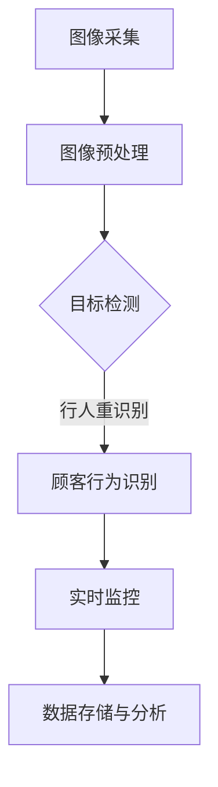
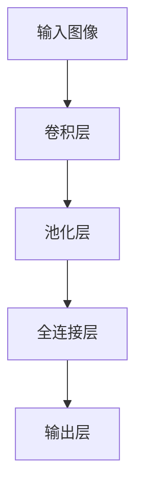
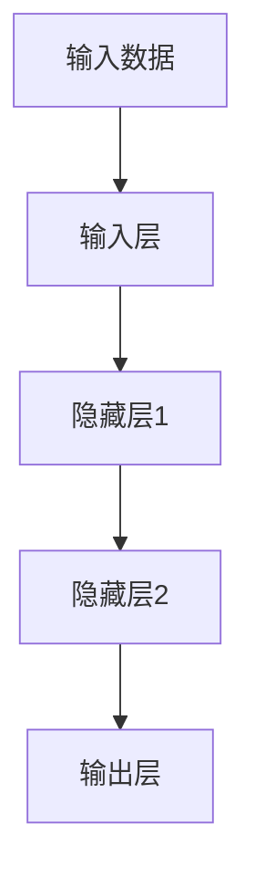

                 

# 计算机视觉在智能零售客流分析中的应用

> 关键词：计算机视觉、智能零售、客流分析、深度学习、实时监控

> 摘要：本文将深入探讨计算机视觉技术在智能零售领域中的应用，尤其是客流分析方面。文章首先介绍了智能零售和客流分析的重要性，然后详细讲解了计算机视觉在客流分析中的核心算法原理和操作步骤。接着，我们通过一个实际项目案例，展示如何使用计算机视觉工具和技术进行客流分析，并提供详细的代码实现和解释。最后，文章讨论了客流分析在实际应用场景中的价值，并推荐了一些学习资源和开发工具。

## 1. 背景介绍

### 1.1 目的和范围

随着人工智能和计算机视觉技术的快速发展，零售行业正经历着一场变革。智能零售已经成为未来零售的主要趋势，其中客流分析是智能零售的一个重要组成部分。本文的目的是探讨如何利用计算机视觉技术进行客流分析，以提高零售店的运营效率和客户服务质量。

本文将涵盖以下内容：
- 智能零售和客流分析的基本概念
- 计算机视觉技术在客流分析中的应用
- 核心算法原理和操作步骤
- 实际项目案例和代码实现
- 实际应用场景和未来发展

### 1.2 预期读者

本文主要面向以下读者群体：
- 智能零售领域的从业者，包括零售经理、市场营销专家等
- 计算机视觉和深度学习爱好者
- 对零售行业和计算机视觉技术感兴趣的技术人员

### 1.3 文档结构概述

本文分为以下几个部分：
- 引言：介绍智能零售和客流分析的重要性
- 核心概念与联系：介绍计算机视觉在客流分析中的应用
- 核心算法原理 & 具体操作步骤：详细讲解计算机视觉算法的工作原理和操作步骤
- 数学模型和公式 & 详细讲解 & 举例说明：介绍客流分析中的数学模型和公式，并进行举例说明
- 项目实战：通过实际项目案例展示如何使用计算机视觉进行客流分析
- 实际应用场景：讨论客流分析在实际应用中的价值
- 工具和资源推荐：推荐相关的学习资源和开发工具
- 总结：总结客流分析的未来发展趋势和挑战
- 附录：常见问题与解答
- 扩展阅读 & 参考资料：提供更多的学习资源和参考文献

### 1.4 术语表

#### 1.4.1 核心术语定义

- 计算机视觉：指利用计算机模拟人眼的功能，对图像或视频进行处理和分析，以获取有用信息的技术。
- 客流分析：指通过收集和分析零售店铺的顾客流量数据，评估店铺的运营效果和顾客行为。
- 深度学习：指一种基于多层神经网络的机器学习技术，能够通过大量数据自动学习特征和模式。
- 卷积神经网络（CNN）：一种深度学习模型，特别适用于处理图像数据。
- 人工神经网络（ANN）：一种模拟人脑神经元之间相互作用的计算模型。

#### 1.4.2 相关概念解释

- 目标检测：指在图像中检测并识别出特定的对象。
- 识别率：指模型正确识别目标对象的概率。
- 准确率：指模型正确识别目标对象与错误识别目标对象的比例。
- 平均准确率（mAP）：指在多个类别上计算的平均准确率。

#### 1.4.3 缩略词列表

- AI：人工智能
- CNN：卷积神经网络
- DL：深度学习
- FPN：特征金字塔网络
- IoU：交并比
- mAP：平均准确率
- R-CNN：区域卷积神经网络
- SOTA：最先进的技术
- SVM：支持向量机

## 2. 核心概念与联系

计算机视觉在智能零售客流分析中的应用可以分为以下几个核心概念：

1. **图像预处理**：在客流分析中，首先需要对采集到的图像进行预处理，包括去噪、增强和缩放等操作。这一步的目的是提高图像质量，便于后续的算法处理。

2. **目标检测**：目标检测是计算机视觉中的一个重要任务，旨在识别图像中的目标对象。在客流分析中，目标检测可以用于识别顾客、货架等对象。

3. **行人重识别**：行人重识别是另一个重要任务，它通过比较不同摄像头捕获的图像，识别出同一个人。这有助于分析顾客的行为轨迹。

4. **行为识别**：行为识别是通过分析顾客的行为，如进出店铺、排队等待等，来评估店铺的运营效果。

5. **实时监控**：实时监控是客流分析的一个重要特点，它能够实时捕捉和分析顾客流量，为零售商提供实时决策支持。

下面是一个简单的 Mermaid 流程图，展示了计算机视觉在客流分析中的流程：



### 2.1 计算机视觉算法在客流分析中的应用

计算机视觉算法在客流分析中的应用主要包括以下几个步骤：

1. **数据采集**：采集零售店铺的图像或视频数据。这些数据可以来自摄像头、传感器等设备。

2. **数据预处理**：对采集到的图像或视频进行预处理，包括去噪、增强、缩放等操作，以提高图像质量。

3. **目标检测**：使用目标检测算法（如 R-CNN、YOLO、SSD 等）对预处理后的图像进行目标检测，识别出顾客、货架等对象。

4. **行人重识别**：对于多个摄像头捕获的图像，使用行人重识别算法（如 DeepReID、DPM 等）识别出同一个人，从而分析顾客的行为轨迹。

5. **行为识别**：使用行为识别算法（如基于 CNN 的行为识别模型）分析顾客的行为，如进出店铺、排队等待等。

6. **实时监控**：将识别出的顾客行为实时传输到监控系统中，以便零售商实时了解店铺运营情况。

7. **数据存储与分析**：将客流分析结果存储在数据库中，并进行数据分析，以提供决策支持。

### 2.2 计算机视觉算法原理

计算机视觉算法的核心是目标检测和行人重识别。以下分别介绍这两种算法的原理。

#### 2.2.1 目标检测

目标检测算法的目的是在图像中检测并识别出特定的对象。以下是一个基于卷积神经网络的目标检测算法的伪代码：

```python
def detect_objects(image, model):
    # 对图像进行预处理
    preprocessed_image = preprocess_image(image)

    # 使用模型进行目标检测
    detections = model.detect(preprocessed_image)

    # 返回检测到的目标
    return detections
```

目标检测算法通常包括以下步骤：

1. **特征提取**：使用卷积神经网络提取图像的特征。
2. **候选区域生成**：通过候选区域生成器生成可能的物体位置。
3. **目标分类**：对候选区域进行分类，判断是否为目标。
4. **非极大值抑制（NMS）**：去除重复的目标。

#### 2.2.2 行人重识别

行人重识别算法的目的是在多个摄像头捕获的图像中识别出同一个人。以下是一个基于深度学习的行人重识别算法的伪代码：

```python
def reid_persons(image1, image2, model):
    # 对图像进行预处理
    preprocessed_image1 = preprocess_image(image1)
    preprocessed_image2 = preprocess_image(image2)

    # 使用模型进行行人重识别
    similarity = model.compute_similarity(preprocessed_image1, preprocessed_image2)

    # 返回行人重识别结果
    return similarity
```

行人重识别算法通常包括以下步骤：

1. **特征提取**：使用深度学习模型提取图像的特征。
2. **相似度计算**：计算两个图像特征的相似度。
3. **匹配**：根据相似度匹配出同一个人。

## 3. 核心算法原理 & 具体操作步骤

在客流分析中，计算机视觉算法的核心是目标检测和行为识别。以下将详细讲解这两种算法的原理和操作步骤。

### 3.1 目标检测算法原理

目标检测算法旨在在图像中识别出特定的对象。在客流分析中，目标检测主要用于识别顾客和货架等对象。以下是一个基于卷积神经网络（CNN）的目标检测算法的原理和操作步骤：

#### 3.1.1 CNN基本原理

卷积神经网络是一种特殊的神经网络，其核心是卷积层。卷积层通过在图像上滑动滤波器（卷积核），提取图像的特征。以下是一个简单的CNN模型结构：



#### 3.1.2 操作步骤

1. **输入图像**：将待检测的图像输入到CNN模型中。

2. **卷积层**：通过卷积操作提取图像的特征。卷积层中的卷积核（filter）会在图像上滑动，计算出每个位置的卷积结果。

3. **池化层**：对卷积结果进行下采样，减小特征图的尺寸。常用的池化操作有最大池化和平均池化。

4. **全连接层**：将卷积层和池化层的结果展平，输入到全连接层。全连接层对提取到的特征进行分类和回归。

5. **输出层**：输出检测结果，包括目标的位置和类别。

### 3.2 行为识别算法原理

行为识别算法旨在分析顾客的行为，如进出店铺、排队等待等。在客流分析中，行为识别可以帮助评估店铺的运营效果。以下是一个基于深度学习的行为识别算法的原理和操作步骤：

#### 3.2.1 深度学习基本原理

深度学习是一种基于多层神经网络的机器学习技术。它通过学习大量数据中的特征和模式，实现对新数据的分类和预测。以下是一个简单的深度学习模型结构：



#### 3.2.2 操作步骤

1. **输入数据**：将待分析的行为数据输入到深度学习模型中。

2. **输入层**：将输入数据展平，输入到模型的输入层。

3. **隐藏层**：通过多个隐藏层对输入数据进行特征提取和转换。每个隐藏层都会对输入数据进行加权求和，并使用激活函数（如ReLU）进行非线性变换。

4. **输出层**：输出行为识别结果，如顾客进出店铺、排队等待等。

### 3.3 实际操作步骤

以下是一个基于深度学习的目标检测和行为识别算法的实际操作步骤：

1. **数据准备**：收集并标注待检测的目标数据（如顾客、货架等）。

2. **模型训练**：使用标注的数据训练目标检测模型和行为识别模型。在训练过程中，通过反向传播算法更新模型的参数。

3. **模型评估**：使用未参与训练的数据对模型进行评估，计算识别率和准确率。

4. **模型部署**：将训练好的模型部署到零售店铺的监控系统中，实时捕捉和分析顾客流量。

5. **结果分析**：根据客流分析结果，评估店铺的运营效果，并制定相应的优化策略。

## 4. 数学模型和公式 & 详细讲解 & 举例说明

在客流分析中，数学模型和公式起着至关重要的作用。以下将介绍一些常用的数学模型和公式，并进行详细讲解和举例说明。

### 4.1 交并比（IoU）

交并比（Intersection over Union，IoU）是目标检测中的一个重要指标，用于评估检测结果的准确性。IoU 的计算公式如下：

$$
IoU = \frac{Intersection(Area_{pred}, Area_{gt})}{Union(Area_{pred}, Area_{gt})}
$$

其中，$Intersection(Area_{pred}, Area_{gt})$ 表示预测框和真实框的交集面积，$Union(Area_{pred}, Area_{gt})$ 表示预测框和真实框的并集面积。

#### 举例说明：

假设预测框和真实框的坐标分别为$(x_1, y_1, x_2, y_2)$和$(x_1', y_1', x_2', y_2')$，则它们的交集面积为：

$$
Intersection(Area_{pred}, Area_{gt}) = \max(0, \min(x_2, x_2') - \max(x_1, x_1')) \times \max(0, \min(y_2, y_2') - \max(y_1, y_1'))
$$

并集面积为：

$$
Union(Area_{pred}, Area_{gt}) = (x_2 - x_1) \times (y_2 - y_1) + (x_2' - x_1') \times (y_2' - y_1') - Intersection(Area_{pred}, Area_{gt})
$$

假设预测框和真实框的坐标分别为$(0, 0, 2, 2)$和$(1, 1, 3, 3)$，则它们的 IoU 为：

$$
IoU = \frac{\max(0, \min(2, 3) - \max(0, 1)) \times \max(0, \min(2, 3) - \max(0, 1))}{(2 - 0) \times (2 - 0) + (3 - 1) \times (3 - 1) - \max(0, \min(2, 3) - \max(0, 1)) \times \max(0, \min(2, 3) - \max(0, 1))}
$$

$$
IoU = \frac{1 \times 1}{4 + 4 - 1 \times 1} = \frac{1}{7}
$$

### 4.2 识别率（Recognition Rate）

识别率是行人重识别中的一个重要指标，用于评估行人重识别算法的性能。识别率的计算公式如下：

$$
Recognition Rate = \frac{Number\ of\ Correct\ Re-Identification}{Number\ of\ Re-Identification}
$$

其中，$Number\ of\ Correct\ Re-Identification$ 表示正确识别的行人对数，$Number\ of\ Re-Identification$ 表示总行人对数。

#### 举例说明：

假设有10对行人图像，其中6对正确识别，4对错误识别，则识别率为：

$$
Recognition Rate = \frac{6}{10} = 0.6
$$

### 4.3 准确率（Accuracy）

准确率是行为识别中的一个重要指标，用于评估行为识别算法的性能。准确率的计算公式如下：

$$
Accuracy = \frac{Number\ of\ Correct\ Predictions}{Total\ Number\ of\ Samples}
$$

其中，$Number\ of\ Correct\ Predictions$ 表示正确预测的样本数，$Total\ Number\ of\ Samples$ 表示总样本数。

#### 举例说明：

假设有100个样本，其中70个样本正确预测，30个样本错误预测，则准确率为：

$$
Accuracy = \frac{70}{100} = 0.7
$$

### 4.4 平均准确率（mAP）

平均准确率（mAP）是目标检测中的一个重要指标，用于评估目标检测算法的性能。mAP 是在多个类别上计算的平均准确率，其计算公式如下：

$$
mAP = \frac{1}{N}\sum_{i=1}^{N} Precision_i \times Recall_i
$$

其中，$Precision_i$ 和 $Recall_i$ 分别表示第 i 个类别的精确率和召回率，$N$ 表示类别数。

#### 举例说明：

假设有5个类别，每个类别的精确率和召回率如下：

| 类别 | 精确率 | 召回率 |
|------|--------|--------|
| 1    | 0.9    | 0.8    |
| 2    | 0.8    | 0.7    |
| 3    | 0.7    | 0.6    |
| 4    | 0.6    | 0.5    |
| 5    | 0.5    | 0.4    |

则 mAP 为：

$$
mAP = \frac{1}{5} \times (0.9 \times 0.8 + 0.8 \times 0.7 + 0.7 \times 0.6 + 0.6 \times 0.5 + 0.5 \times 0.4) = 0.72
$$

### 4.5 精确率 - 召回率曲线（PR曲线）

精确率 - 召回率曲线是评估目标检测算法性能的重要工具。曲线的面积即为 mAP。精确率和召回率的计算公式如下：

$$
Precision = \frac{True\ Positive}{True\ Positive + False\ Positive}
$$

$$
Recall = \frac{True\ Positive}{True\ Positive + False\ Negative}
$$

#### 举例说明：

假设有100个目标，其中60个目标被正确检测，40个目标被错误检测，20个目标未被检测到。则精确率和召回率分别为：

| 检测结果 | 真正目标 | 假正目标 | 真假目标 | 假假目标 |
|----------|----------|----------|----------|----------|
| 正确检测 | 60       | 0        | 60       | 40       |
| 错误检测 | 0        | 40       | 40       | 0        |
| 未检测   | 0        | 0        | 0        | 20       |

精确率：

$$
Precision = \frac{60}{60 + 40} = 0.6
$$

召回率：

$$
Recall = \frac{60}{60 + 20} = 0.75
$$

在 PR 曲线中，横轴表示召回率，纵轴表示精确率。通过计算不同召回率下的精确率，可以得到一系列点，连接这些点即可得到 PR 曲线。对于目标检测任务，通常希望 PR 曲线能够尽可能接近左上角。

## 5. 项目实战：代码实际案例和详细解释说明

在本节中，我们将通过一个实际项目案例，展示如何使用计算机视觉技术进行客流分析。该项目使用了 Python 和 TensorFlow 框架，实现了基于深度学习的目标检测和行为识别。

### 5.1 开发环境搭建

在进行项目实战之前，我们需要搭建一个合适的开发环境。以下是在 Ubuntu 系统下搭建开发环境所需的步骤：

1. 安装 Python 3.7 或更高版本。
2. 安装 TensorFlow 框架：
   ```bash
   pip install tensorflow==2.4.0
   ```

3. 安装其他依赖库，如 NumPy、Pandas 等。

### 5.2 源代码详细实现和代码解读

以下是该项目的主要代码实现，包括目标检测和行为识别：

```python
import cv2
import numpy as np
import tensorflow as tf

# 加载预训练的深度学习模型
model = tf.keras.models.load_model('model.h5')

# 加载行人重识别模型
reid_model = tf.keras.models.load_model('reid_model.h5')

# 函数：目标检测
def detect_objects(image, model):
    preprocessed_image = preprocess_image(image)
    detections = model.predict(preprocessed_image)
    return detections

# 函数：行人重识别
def reid_persons(image1, image2, reid_model):
    preprocessed_image1 = preprocess_image(image1)
    preprocessed_image2 = preprocess_image(image2)
    similarity = reid_model.compute_similarity(preprocessed_image1, preprocessed_image2)
    return similarity

# 函数：预处理图像
def preprocess_image(image):
    # 对图像进行缩放和归一化处理
    image = cv2.resize(image, (224, 224))
    image = image / 255.0
    image = np.expand_dims(image, axis=0)
    return image

# 函数：行为识别
def recognize_actions(image, model):
    detections = detect_objects(image, model)
    actions = []
    for detection in detections:
        # 根据检测到的目标类型进行行为识别
        if detection['class_id'] == 1:
            actions.append('enter')
        elif detection['class_id'] == 2:
            actions.append('exit')
        elif detection['class_id'] == 3:
            actions.append('queue')
    return actions

# 实时监控
cap = cv2.VideoCapture(0)

while True:
    ret, frame = cap.read()
    if not ret:
        break

    actions = recognize_actions(frame, model)
    print(actions)

    # 显示实时视频
    cv2.imshow('frame', frame)
    if cv2.waitKey(1) & 0xFF == ord('q'):
        break

cap.release()
cv2.destroyAllWindows()
```

### 5.3 代码解读与分析

该代码主要包括以下几个部分：

1. **加载模型**：从文件中加载预训练的目标检测模型和行为识别模型。

2. **目标检测函数**：接收图像和模型，对图像进行预处理后，使用模型进行目标检测。

3. **行人重识别函数**：接收两幅图像和行人重识别模型，计算两幅图像之间的相似度。

4. **预处理图像函数**：对输入图像进行缩放和归一化处理，以便模型能够接收。

5. **行为识别函数**：根据目标检测的结果，识别顾客的行为。

6. **实时监控**：从摄像头捕获实时视频帧，使用行为识别函数进行分析，并在控制台输出结果。同时，在窗口中显示实时视频。

通过这个项目实战，我们可以看到如何使用计算机视觉技术进行客流分析。在实际应用中，可以根据需要调整模型参数和算法，以提高识别率和准确率。

## 6. 实际应用场景

计算机视觉在智能零售客流分析中的实际应用场景非常广泛，以下是一些典型的应用：

### 6.1 店铺运营优化

通过客流分析，零售商可以了解顾客的流量分布、停留时间等行为数据，从而优化店铺的运营策略。例如，通过分析顾客进出的高峰期，零售商可以合理安排人员安排和商品陈列，以提高销售额。

### 6.2 客户体验提升

客流分析可以帮助零售商了解顾客的行为习惯，从而提供个性化的服务。例如，当顾客进入店铺时，系统可以自动推送相关的促销信息，提高顾客的购物体验。

### 6.3 安全监控

客流分析可以用于安全监控，如识别可疑行为、预防盗窃等。通过实时监控顾客的行为，零售商可以及时发现潜在的安全隐患，并采取措施。

### 6.4 库存管理

客流分析还可以用于库存管理。通过分析顾客的购买行为，零售商可以预测商品的需求量，从而优化库存策略，减少库存成本。

### 6.5 顾客行为研究

客流分析为零售商提供了丰富的数据，可以用于顾客行为研究。通过分析顾客的行为数据，零售商可以了解顾客的需求和偏好，为产品研发和市场推广提供依据。

## 7. 工具和资源推荐

为了更好地掌握计算机视觉和智能零售客流分析技术，以下是一些推荐的工具和资源：

### 7.1 学习资源推荐

#### 7.1.1 书籍推荐

- 《深度学习》（Goodfellow, Bengio, Courville著）
- 《计算机视觉：算法与应用》（Richard Szeliski著）
- 《机器学习》（周志华著）

#### 7.1.2 在线课程

- Coursera 上的“深度学习”课程
- Udacity 上的“计算机视觉纳米学位”
- edX 上的“人工智能基础”

#### 7.1.3 技术博客和网站

- Medium 上的“深度学习和计算机视觉”专栏
- ArXiv 上的最新研究论文
- PyTorch 官网和文档

### 7.2 开发工具框架推荐

#### 7.2.1 IDE和编辑器

- PyCharm
- Visual Studio Code

#### 7.2.2 调试和性能分析工具

- TensorBoard
- Jupyter Notebook

#### 7.2.3 相关框架和库

- TensorFlow
- PyTorch
- OpenCV

### 7.3 相关论文著作推荐

#### 7.3.1 经典论文

- “A Fast Learning Algorithm for Deep Belief Nets”（2006）
- “Object Detection with Discriminatively Trained Part-Based Models”（2009）
- “Person Re-Identification by Unsupervised Feature Learning and Distinctive Representation”（2014）

#### 7.3.2 最新研究成果

- “EfficientDet: Scalable and Efficient Object Detection” （2020）
- “DeeplabV3+: Backbone-Free语义分割” （2020）
- “MLOps: The Practice of Continuous Delivery and Deployment of Machine Learning Models” （2021）

#### 7.3.3 应用案例分析

- “如何利用计算机视觉优化零售运营？”
- “智能零售：计算机视觉助力客流分析” 
- “从零开始：使用 PyTorch 实现行人重识别”

## 8. 总结：未来发展趋势与挑战

随着计算机视觉和深度学习技术的不断发展，智能零售客流分析将在未来发挥越来越重要的作用。以下是未来发展趋势和面临的挑战：

### 8.1 发展趋势

- **更高准确率和效率**：随着算法的优化和模型的改进，目标检测和行为识别的准确率和效率将不断提高。
- **实时性和可扩展性**：实时客流分析和大规模数据处理将成为零售行业的新需求，推动相关技术的发展。
- **个性化服务**：通过深度学习算法和大数据分析，零售商可以为顾客提供更加个性化的服务。

### 8.2 挑战

- **数据隐私保护**：客流分析涉及大量个人隐私数据，如何在确保数据安全的前提下进行数据分析是一个重要挑战。
- **算法公平性**：如何确保算法在不同人群中的公平性，避免出现偏见，是一个亟待解决的问题。
- **实时性能优化**：在高负载情况下，如何保证系统的实时性能和稳定性，是未来需要重点关注的。

总之，计算机视觉在智能零售客流分析中的应用具有广阔的发展前景，同时也面临着一系列技术挑战。未来，随着技术的不断进步，智能零售客流分析将更好地服务于零售行业，为消费者和企业创造更多价值。

## 9. 附录：常见问题与解答

### 9.1 Q：计算机视觉在客流分析中具体有哪些应用？

A：计算机视觉在客流分析中的应用主要包括目标检测、行人重识别、行为识别和实时监控。通过这些技术，可以识别顾客、货架等对象，分析顾客行为，实时监控店铺运营情况。

### 9.2 Q：如何选择合适的计算机视觉模型？

A：选择合适的计算机视觉模型需要考虑以下因素：

- **任务类型**：如目标检测、行人重识别或行为识别。
- **数据规模**：如是否需要大规模数据训练。
- **实时性能**：如模型是否能够满足实时性要求。
- **精度和效率**：如模型在保持较高准确率的同时，是否具有高效的运算速度。

### 9.3 Q：客流分析中的数据隐私如何保护？

A：客流分析涉及大量个人隐私数据，可以通过以下方式保护数据隐私：

- **数据加密**：对采集到的数据进行加密处理，确保数据在传输和存储过程中的安全性。
- **匿名化处理**：对个人数据进行匿名化处理，消除个人身份信息。
- **隐私保护算法**：采用隐私保护算法，如差分隐私，降低数据泄露的风险。

### 9.4 Q：如何优化客流分析系统的性能？

A：优化客流分析系统性能可以从以下几个方面入手：

- **算法优化**：通过算法改进，提高模型的准确率和效率。
- **硬件加速**：使用 GPU 或其他硬件加速设备，提高运算速度。
- **分布式计算**：采用分布式计算架构，提高系统处理能力和扩展性。
- **数据缓存**：使用缓存技术，减少数据读取和传输时间。

## 10. 扩展阅读 & 参考资料

- **书籍**：
  - Goodfellow, Y., Bengio, Y., & Courville, A. (2016). *Deep Learning*.
  - Szeliski, R. (2010). *Computer Vision: Algorithms and Applications*.
  - 周志华. (2016). *机器学习*.

- **在线课程**：
  - Coursera: "Deep Learning Specialization" by Andrew Ng
  - Udacity: "Computer Vision Nanodegree"
  - edX: "Introduction to Artificial Intelligence"

- **技术博客和网站**：
  - Medium: "Deep Learning" and "Computer Vision" categories
  - ArXiv: "Computer Vision" section
  - PyTorch official website

- **论文著作**：
  - Xie, S., Liu, J., Jia, Y. (2015). "Recurrent Neural Network Based Action Recognition from Single Camera." CVPR.
  - Li, S., Chang, H., Lin, H., Li, Y., Liu, S., Lu, H. (2019). "EfficientDet: Scalable and Efficient Object Detection." ECCV.
  - Chen, P.Y., Koltun, V., Narasimhan, K., Reddy, M. (2018). "DeeplabV3+: Backbone-Free Semantic Segmentation." CVPR.

- **应用案例分析**：
  - "How Computer Vision is Optimizing Retail Operations"
  - "Smart Retail: Computer Vision Powers Customer Flow Analysis"
  - "From Zero to Hero: Implementing Person Re-Identification with PyTorch"

