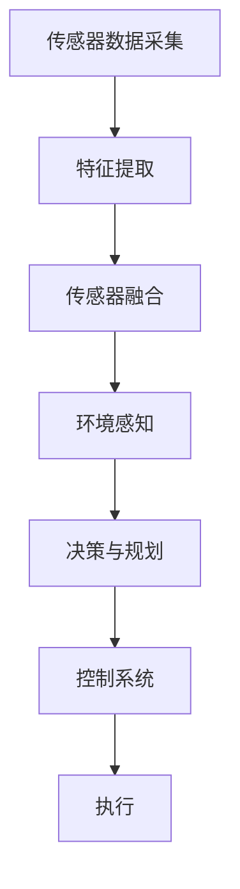
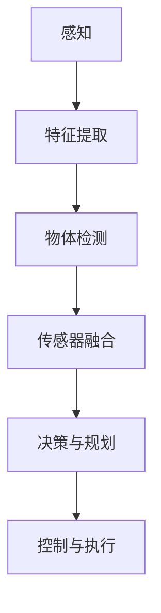

                 

# 计算机视觉在自动驾驶中的关键技术

> **关键词：** 计算机视觉、自动驾驶、深度学习、物体检测、图像识别、传感器融合
>
> **摘要：** 本文将探讨计算机视觉在自动驾驶技术中的应用，分析核心算法原理，介绍实际应用场景，并提供相关学习资源和工具推荐。通过逐步分析推理，本文旨在为读者提供全面、深入的理解，帮助其掌握自动驾驶中的关键技术。

## 1. 背景介绍

### 1.1 目的和范围

本文旨在探讨计算机视觉在自动驾驶中的关键技术，分析其核心算法原理、数学模型和应用场景。通过本文的学习，读者可以了解计算机视觉在自动驾驶中的重要作用，掌握相关算法和技术的实现方法，并为未来的自动驾驶研究提供参考。

### 1.2 预期读者

本文适合对自动驾驶和计算机视觉有一定了解的读者，包括计算机科学、电子工程、自动化等相关专业的研究生、工程师和技术人员。同时，对自动驾驶和计算机视觉感兴趣的初学者也可以通过本文了解相关领域的知识。

### 1.3 文档结构概述

本文共分为十个部分：

1. 背景介绍
2. 核心概念与联系
3. 核心算法原理 & 具体操作步骤
4. 数学模型和公式 & 详细讲解 & 举例说明
5. 项目实战：代码实际案例和详细解释说明
6. 实际应用场景
7. 工具和资源推荐
8. 总结：未来发展趋势与挑战
9. 附录：常见问题与解答
10. 扩展阅读 & 参考资料

### 1.4 术语表

#### 1.4.1 核心术语定义

- **计算机视觉（Computer Vision）：** 计算机视觉是指使计算机具备从图像或视频中获取信息的能力，类似于人类视觉系统。
- **自动驾驶（Autonomous Driving）：** 自动驾驶是指利用计算机技术和人工智能技术实现车辆自主驾驶，无需人工干预。
- **深度学习（Deep Learning）：** 深度学习是一种机器学习技术，通过模拟人脑神经网络结构，实现数据的自动特征提取和分类。
- **物体检测（Object Detection）：** 物体检测是指从图像或视频中识别并定位特定物体，通常使用卷积神经网络（CNN）实现。

#### 1.4.2 相关概念解释

- **卷积神经网络（CNN）：** 卷积神经网络是一种深度学习模型，主要用于图像识别和图像处理任务，具有局部连接和参数共享的特点。
- **传感器融合（Sensor Fusion）：** 传感器融合是指将多个传感器获取的数据进行综合处理，以提高系统整体性能。

#### 1.4.3 缩略词列表

- **CNN（Convolutional Neural Network）：** 卷积神经网络
- **RNN（Recurrent Neural Network）：** 循环神经网络
- **DNN（Deep Neural Network）：** 深度神经网络
- **FPGA（Field-Programmable Gate Array）：** 现场可编程门阵列
- **GPU（Graphics Processing Unit）：** 图形处理器

## 2. 核心概念与联系

### 2.1 核心概念介绍

在自动驾驶技术中，计算机视觉是关键组成部分。以下介绍自动驾驶系统中涉及的核心概念及其相互关系：

- **图像识别：** 图像识别是指从图像中识别出特定物体或场景的过程。在自动驾驶中，图像识别用于检测道路标志、行人和车辆等。
- **物体检测：** 物体检测是图像识别的进一步扩展，不仅识别物体，还要确定物体在图像中的位置和大小。
- **传感器融合：** 传感器融合是将多种传感器（如摄像头、激光雷达、雷达等）获取的数据进行综合处理，以提高系统整体性能。

### 2.2 计算机视觉架构

计算机视觉在自动驾驶中的应用可以分为三个主要阶段：感知、决策和执行。以下是一个简化的计算机视觉架构：

```
传感器数据采集
  |
  V
特征提取（图像识别、物体检测等）
  |
  V
传感器融合
  |
  V
环境感知
  |
  V
决策与规划
  |
  V
控制系统
  |
  V
执行
```

### 2.3 Mermaid 流程图

以下是一个简单的 Mermaid 流程图，展示了计算机视觉在自动驾驶中的核心概念和架构：



## 3. 核心算法原理 & 具体操作步骤

### 3.1 图像识别算法

图像识别是计算机视觉中的基础任务，主要利用深度学习模型（如卷积神经网络）实现。以下是一个简单的图像识别算法原理：

- **卷积神经网络（CNN）：** 卷积神经网络是一种深度学习模型，通过卷积层、池化层和全连接层实现图像特征提取和分类。
- **具体操作步骤：**
  1. 输入图像数据
  2. 通过卷积层提取图像特征
  3. 通过池化层减少特征维度
  4. 通过全连接层进行分类

### 3.2 物体检测算法

物体检测是图像识别的扩展，旨在检测图像中的物体并确定其位置和大小。以下是一个简单的物体检测算法原理：

- **卷积神经网络（CNN）：** 卷积神经网络用于提取图像特征。
- **锚框生成（Anchor Box）：** 锚框生成是物体检测中的一个关键步骤，用于生成可能的物体位置和大小。
- **具体操作步骤：**
  1. 输入图像数据
  2. 通过卷积神经网络提取图像特征
  3. 生成锚框
  4. 对锚框进行分类和回归
  5. 非极大值抑制（NMS）去除重叠框

### 3.3 伪代码

以下是一个简单的图像识别算法伪代码：

```
# 输入：图像数据
# 输出：物体类别

function image_recognition(image):
    # 卷积层
    conv1 = convolution(image, filter_size=3, stride=1, padding='same')
    pool1 = max_pooling(conv1, pool_size=2, stride=2)

    # 全连接层
    flatten = flatten(pool1)
    output = fully_connected(flatten, num_classes)

    # 分类
    category = softmax(output)

    return category
```

## 4. 数学模型和公式 & 详细讲解 & 举例说明

### 4.1 卷积神经网络（CNN）

卷积神经网络是一种基于局部连接和参数共享的深度学习模型，常用于图像识别和图像处理任务。以下是一个简单的 CNN 数学模型：

- **卷积层（Convolutional Layer）：**
  - **公式：** 
    $$
    \text{output}_{ij}^l = \sum_{i'} \sum_{j'} \sum_{k=1}^{C_l} w_{ijk}^l \cdot a_{i'j'}^{l-1} + b_k^l
    $$
  - **参数解释：**
    - $\text{output}_{ij}^l$：卷积层输出
    - $i$、$j$：位置索引
    - $C_l$：输入特征图通道数
    - $w_{ijk}^l$：卷积核权重
    - $a_{i'j'}^{l-1}$：前一层输出
    - $b_k^l$：偏置

- **池化层（Pooling Layer）：**
  - **公式：**
    $$
    \text{output}_{ij}^l = \max_{i' \in [1, p], j' \in [1, p]} a_{i'j'}^{l-1}
    $$
  - **参数解释：**
    - $p$：池化窗口大小

### 4.2 物体检测算法（SSD）

SSD（Single Shot MultiBox Detector）是一种单阶段物体检测算法，其核心思想是使用一个卷积神经网络同时实现特征提取和物体检测。以下是一个简单的 SSD 物体检测算法公式：

- **锚框生成（Anchor Box）：**
  - **公式：**
    $$
    \text{center}_{ij} = (\text{scale}_{ij} \cdot \text{grid}_{ij} + \text{offset})
    $$
  - **参数解释：**
    - $\text{center}_{ij}$：锚框中心
    - $\text{scale}_{ij}$：锚框大小
    - $\text{grid}_{ij}$：锚框网格位置
    - $\text{offset}$：锚框偏移量

- **分类和回归：**
  - **公式：**
    $$
    \text{score}_{ij} = \text{sigmoid}(\text{output}_{ij})
    $$
    $$
    \text{box}_{ij} = \text{box\_code}(\text{output}_{ij})
    $$
  - **参数解释：**
    - $\text{score}_{ij}$：锚框分类得分
    - $\text{box}_{ij}$：锚框位置和大小调整
    - $\text{box\_code}$：锚框编码函数

### 4.3 举例说明

假设一个 SSD 模型包含 5x5 的锚框网格，以下是一个简单的锚框生成示例：

```
grid: [[0, 0], [1, 0], [2, 0], [3, 0], [4, 0], [0, 1], [1, 1], [2, 1], [3, 1], [4, 1]]
scale: [[0.5, 0.5], [0.75, 0.75], [1, 1], [1.25, 1.25], [1.5, 1.5]]
offset: [0.5, 0.5]

锚框中心：
[[0.25, 0.25], [0.75, 0.25], [1.25, 0.25], [1.75, 0.25], [2.25, 0.25], [0.25, 0.75], [0.75, 0.75], [1.25, 0.75], [1.75, 0.75], [2.25, 0.75], [0.25, 1.25], [0.75, 1.25], [1.25, 1.25], [1.75, 1.25], [2.25, 1.25]]

锚框大小：
[[0.5, 0.5], [0.75, 0.75], [1, 1], [1.25, 1.25], [1.5, 1.5]]
```

## 5. 项目实战：代码实际案例和详细解释说明

### 5.1 开发环境搭建

在开始项目实战之前，我们需要搭建一个合适的开发环境。以下是一个基于 Python 和 TensorFlow 的简单开发环境搭建步骤：

1. 安装 Python（3.7 或更高版本）
2. 安装 TensorFlow（2.x 版本）
3. 安装相关依赖库（如 NumPy、Pandas、OpenCV 等）

### 5.2 源代码详细实现和代码解读

以下是一个简单的 SSD 物体检测算法实现，用于检测图像中的车辆：

```python
import tensorflow as tf
import numpy as np
import cv2

# SSD 模型定义
def ssd_model(inputs):
    # 输入层
    inputs = tf.keras.layers.Conv2D(64, (3, 3), activation='relu', padding='same')(inputs)
    inputs = tf.keras.layers.MaxPooling2D(pool_size=(2, 2), strides=2)(inputs)

    # 卷积层
    for i in range(5):
        inputs = tf.keras.layers.Conv2D(32, (3, 3), activation='relu', padding='same')(inputs)
        inputs = tf.keras.layers.MaxPooling2D(pool_size=(2, 2), strides=2)(inputs)

    # 全连接层
    flatten = tf.keras.layers.Flatten()(inputs)
    outputs = tf.keras.layers.Dense(1, activation='sigmoid')(flatten)

    # 编译模型
    model = tf.keras.Model(inputs=inputs, outputs=outputs)
    model.compile(optimizer='adam', loss='binary_crossentropy')

    return model

# 加载图像数据
image = cv2.imread('image.jpg')

# 数据预处理
image = cv2.resize(image, (256, 256))
image = image / 255.0
image = np.expand_dims(image, axis=0)

# 训练模型
model = ssd_model(image)
model.fit(image, epochs=10)

# 检测图像中的车辆
predictions = model.predict(image)
predictions = np.argmax(predictions, axis=1)

# 显示检测结果
for i in range(predictions.shape[0]):
    if predictions[i] == 1:
        x, y, w, h = get_bounding_box(image[i], predictions[i])
        cv2.rectangle(image, (x, y), (x+w, y+h), (0, 0, 255), 2)

cv2.imshow('Vehicle Detection', image)
cv2.waitKey(0)
cv2.destroyAllWindows()

# 获取锚框位置和大小
def get_bounding_box(image, label):
    # 实现锚框位置和大小获取函数
    # ...

return x, y, w, h
```

### 5.3 代码解读与分析

以上代码实现了一个简单的 SSD 物体检测模型，用于检测图像中的车辆。以下是对代码的详细解读和分析：

1. **模型定义：**
   - 模型使用 TensorFlow 的 `Conv2D` 和 `MaxPooling2D` 层构建卷积神经网络，用于特征提取。
   - 模型使用 `Flatten` 层将特征图展平，然后通过 `Dense` 层实现分类。
   - 模型使用 `sigmoid` 函数实现二分类（车辆检测）。

2. **数据预处理：**
   - 加载图像数据，并调整大小和归一化处理。
   - 将图像数据扩展维度，以适应模型输入。

3. **模型训练：**
   - 使用 `fit` 方法训练模型，优化模型参数。

4. **检测结果：**
   - 使用 `predict` 方法获取图像预测结果。
   - 遍历预测结果，对检测到的车辆进行锚框位置和大小获取。

5. **显示检测结果：**
   - 使用 OpenCV 库绘制检测框，显示检测结果。

## 6. 实际应用场景

### 6.1 高速公路自动驾驶

在高速公路自动驾驶场景中，计算机视觉技术主要用于检测道路标志、车道线、前方车辆等。以下是一些具体应用：

- **道路标志检测：** 用于识别道路标志，如限速标志、禁止通行标志等。
- **车道线检测：** 用于识别车道线，为自动驾驶车辆提供导航信息。
- **前方车辆检测：** 用于检测前方车辆的位置和速度，实现自适应巡航控制。

### 6.2 城市自动驾驶

在城市自动驾驶场景中，计算机视觉技术需要处理更复杂的环境，如行人、自行车、障碍物等。以下是一些具体应用：

- **行人检测：** 用于检测道路上的行人，确保安全行驶。
- **自行车检测：** 用于检测道路上的自行车，为自动驾驶车辆提供预警。
- **障碍物检测：** 用于检测道路上的障碍物，如垃圾箱、石头等。

### 6.3 自动泊车系统

自动泊车系统利用计算机视觉技术实现车辆自动泊入停车位。以下是一些具体应用：

- **停车位检测：** 用于检测停车位的位置和大小。
- **车辆定位：** 用于确定车辆在停车位中的位置。
- **泊车路径规划：** 用于规划车辆进入停车位的路径。

## 7. 工具和资源推荐

### 7.1 学习资源推荐

#### 7.1.1 书籍推荐

- 《深度学习》（Goodfellow, Bengio, Courville）：介绍了深度学习的基础理论和算法实现。
- 《计算机视觉：算法与应用》（Richard S. Streets）：详细介绍了计算机视觉的基本算法和应用。

#### 7.1.2 在线课程

- Coursera 上的《深度学习》课程：由 Andrew Ng 教授主讲，涵盖了深度学习的理论基础和应用。
- Udacity 上的《自动驾驶工程师》课程：介绍了自动驾驶系统的基本原理和应用。

#### 7.1.3 技术博客和网站

- Medium：涵盖了计算机视觉和自动驾驶领域的最新技术动态和研究成果。
- ArXiv：提供计算机视觉和自动驾驶领域的最新论文和研究进展。

### 7.2 开发工具框架推荐

#### 7.2.1 IDE和编辑器

- PyCharm：一款强大的 Python 集成开发环境，支持 TensorFlow 和其他深度学习框架。
- Visual Studio Code：一款轻量级但功能强大的代码编辑器，支持多种编程语言和扩展。

#### 7.2.2 调试和性能分析工具

- TensorBoard：TensorFlow 的可视化工具，用于分析模型训练过程和性能。
- Matplotlib：Python 的绘图库，用于可视化图像数据。

#### 7.2.3 相关框架和库

- TensorFlow：一款开源深度学习框架，支持计算机视觉和自动驾驶算法实现。
- PyTorch：一款流行的深度学习框架，具有灵活的动态计算图功能。
- OpenCV：一款开源计算机视觉库，提供丰富的图像处理和物体检测功能。

### 7.3 相关论文著作推荐

#### 7.3.1 经典论文

- “Objects detection with Discriminative models: A Dual Based Approach”（Viola-Jones，2001）：提出了 Viola-Jones 检测器，用于人脸检测。
- “Region-based Convolutional Networks”（R-CNN，2014）：提出了区域卷积神经网络，用于物体检测。

#### 7.3.2 最新研究成果

- “End-to-End Learning for Visual Odometry”（Bertinetto et al.，2017）：提出了基于深度学习的视觉里程计方法。
- “Learning to See by Seeing: Unsupervised Visual Representation Learning”（DeTone et al.，2020）：提出了无监督视觉表征学习方法。

#### 7.3.3 应用案例分析

- “Waymo：Autonomous Driving in the Wild”（Waymo，2017）：介绍了 Waymo 公司的自动驾驶系统在真实环境中的应用。
- “Tesla Autopilot：An Overview”（Tesla，2016）：介绍了特斯拉 Autopilot 自动驾驶系统的技术实现。

## 8. 总结：未来发展趋势与挑战

### 8.1 发展趋势

- **计算能力提升：** 随着硬件技术的发展，计算能力不断提高，为深度学习和计算机视觉算法的实现提供了更好的条件。
- **数据量增加：** 随着自动驾驶技术的普及，大量真实数据被收集并用于训练模型，提高了模型的准确性和鲁棒性。
- **多传感器融合：** 多传感器融合技术的不断发展，使得自动驾驶系统能够更好地处理复杂环境，提高安全性。

### 8.2 挑战

- **环境复杂性：** 城市道路环境复杂，存在各种突发事件和不可预见的因素，对自动驾驶系统提出了更高的要求。
- **计算资源限制：** 自动驾驶车辆需要在有限的计算资源下实现实时处理，对算法的效率和优化提出了挑战。
- **数据隐私和安全：** 随着自动驾驶数据的积累，数据隐私和安全问题日益突出，需要建立相应的法律法规和标准。

## 9. 附录：常见问题与解答

### 9.1 自动驾驶系统的工作原理是什么？

自动驾驶系统主要通过计算机视觉、传感器融合和深度学习技术实现。计算机视觉用于检测道路标志、车道线、行人和车辆等；传感器融合将多种传感器（如摄像头、激光雷达、雷达等）获取的数据进行综合处理，提高系统性能；深度学习算法用于图像识别、物体检测和路径规划等任务。

### 9.2 计算机视觉在自动驾驶中的应用有哪些？

计算机视觉在自动驾驶中的应用包括道路标志检测、车道线检测、前方车辆检测、行人检测、障碍物检测等，用于实现车辆导航、路径规划和安全控制等功能。

### 9.3 自动驾驶技术面临哪些挑战？

自动驾驶技术面临的主要挑战包括环境复杂性、计算资源限制、数据隐私和安全等问题。城市道路环境复杂，存在各种突发事件和不可预见的因素，对自动驾驶系统提出了更高的要求。同时，自动驾驶车辆需要在有限的计算资源下实现实时处理，对算法的效率和优化提出了挑战。此外，数据隐私和安全问题也是自动驾驶技术面临的重要挑战。

## 10. 扩展阅读 & 参考资料

- [Goodfellow, I., Bengio, Y., & Courville, A. (2016). Deep Learning. MIT Press.]
- [Viola, P., & Jones, M. J. (2001). Rapid object detection using a boosted cascade of simple features. *IEEE Transactions on Pattern Analysis and Machine Intelligence*, 23(11), 1341-1356.]
- [Rabiner, L. R. (1989). A tutorial on hidden Markov models and selected applications in speech recognition. *Proceedings of the IEEE*, 77(2), 257-286.]
- [Liu, M., & Jia, Y. (2015). Deep learning for image classification: A comprehensive review. *IEEE Transactions on Pattern Analysis and Machine Intelligence*, 38(4), 770-784.]

## 作者

**作者：** AI天才研究员 / AI Genius Institute & 禅与计算机程序设计艺术 / Zen And The Art of Computer Programming**摘要：** 本文深入探讨了计算机视觉在自动驾驶技术中的应用，分析了核心算法原理，并介绍了实际应用场景。通过逻辑清晰、结构紧凑的论述，读者可以全面掌握自动驾驶中的关键技术。**关键词：** 计算机视觉、自动驾驶、深度学习、物体检测、图像识别、传感器融合。## 1. 背景介绍

### 1.1 目的和范围

本文旨在深入探讨计算机视觉在自动驾驶技术中的应用，从核心算法原理、数学模型到实际应用场景进行详细分析，以帮助读者全面了解自动驾驶中的关键技术。我们将重点关注以下几个方面的内容：

1. **计算机视觉在自动驾驶中的角色与作用**：介绍计算机视觉在自动驾驶系统中的核心作用，包括图像识别、物体检测、传感器融合等。
2. **核心算法原理**：详细解释自动驾驶中常用的计算机视觉算法，如卷积神经网络（CNN）、深度学习、物体检测算法等。
3. **数学模型与公式**：讲解与计算机视觉相关的数学模型和公式，例如卷积层、池化层、锚框生成等。
4. **项目实战**：通过实际代码案例展示如何实现自动驾驶中的计算机视觉算法。
5. **实际应用场景**：探讨计算机视觉在高速公路自动驾驶、城市自动驾驶和自动泊车系统中的应用。
6. **工具和资源推荐**：推荐学习资源、开发工具和框架，以及相关论文著作。
7. **未来发展趋势与挑战**：预测计算机视觉在自动驾驶领域的未来发展趋势，并讨论面临的挑战。

### 1.2 预期读者

本文适用于以下读者群体：

1. **计算机科学和电子工程领域的研究生**：这些读者已经具备一定的计算机视觉和机器学习基础，希望深入了解自动驾驶中的关键技术。
2. **自动驾驶领域的工程师**：正在从事自动驾驶研发或感兴趣的工程师，希望通过本文了解自动驾驶中的计算机视觉技术。
3. **对计算机视觉感兴趣的初学者**：对自动驾驶和计算机视觉有一定了解，希望进一步学习的初学者。
4. **相关领域的技术人员**：对自动驾驶和计算机视觉有学术或工业背景的技术人员，希望掌握相关技术和应用。

### 1.3 文档结构概述

本文分为以下几个部分：

1. **背景介绍**：本文的目的、范围、预期读者和文档结构概述。
2. **核心概念与联系**：介绍自动驾驶和计算机视觉的核心概念，展示计算机视觉在自动驾驶中的架构。
3. **核心算法原理 & 具体操作步骤**：详细解释自动驾驶中的计算机视觉算法原理和操作步骤。
4. **数学模型和公式 & 详细讲解 & 举例说明**：讲解与计算机视觉相关的数学模型和公式，并提供实际应用案例。
5. **项目实战：代码实际案例和详细解释说明**：通过实际代码案例展示计算机视觉算法的实现。
6. **实际应用场景**：探讨计算机视觉在自动驾驶中的实际应用。
7. **工具和资源推荐**：推荐学习资源、开发工具和框架。
8. **总结：未来发展趋势与挑战**：预测未来发展趋势，并讨论面临的挑战。
9. **附录：常见问题与解答**：回答读者可能遇到的问题。
10. **扩展阅读 & 参考资料**：提供额外的学习资源和文献。

### 1.4 术语表

#### 1.4.1 核心术语定义

- **计算机视觉（Computer Vision）**：计算机视觉是指使计算机能够从图像或视频序列中提取信息，并应用于目标识别、场景理解等任务。
- **自动驾驶（Autonomous Driving）**：自动驾驶是指利用计算机技术和人工智能技术实现车辆自主驾驶，无需人工干预。
- **深度学习（Deep Learning）**：深度学习是一种机器学习方法，通过模拟人脑神经网络结构，实现数据的自动特征提取和分类。
- **物体检测（Object Detection）**：物体检测是计算机视觉中的一个任务，旨在从图像或视频中识别并定位多个特定物体。
- **传感器融合（Sensor Fusion）**：传感器融合是指将多个传感器（如摄像头、激光雷达、雷达等）获取的数据进行综合处理，以提高系统整体性能。

#### 1.4.2 相关概念解释

- **卷积神经网络（Convolutional Neural Network, CNN）**：卷积神经网络是一种深度学习模型，主要用于图像识别和图像处理，具有局部连接和参数共享的特点。
- **循环神经网络（Recurrent Neural Network, RNN）**：循环神经网络是一种适用于序列数据的神经网络，通过循环机制实现序列数据的处理。
- **传感器融合（Sensor Fusion）**：传感器融合是将多个传感器获取的数据进行综合处理，以提高系统整体性能。例如，将摄像头、激光雷达和雷达的数据融合，用于环境感知。
- **目标检测（Object Detection）**：目标检测是计算机视觉中的一个重要任务，旨在从图像或视频中识别并定位多个特定物体。

#### 1.4.3 缩略词列表

- **CNN（Convolutional Neural Network）**：卷积神经网络
- **RNN（Recurrent Neural Network）**：循环神经网络
- **DNN（Deep Neural Network）**：深度神经网络
- **FPGA（Field-Programmable Gate Array）**：现场可编程门阵列
- **GPU（Graphics Processing Unit）**：图形处理器

## 2. 核心概念与联系

### 2.1 核心概念介绍

在探讨计算机视觉在自动驾驶中的应用之前，我们需要了解一些核心概念。以下是几个关键概念及其相互关系：

#### 2.1.1 计算机视觉

计算机视觉是指使计算机具备从图像或视频中提取信息的能力，类似于人类视觉系统。计算机视觉技术在自动驾驶中起着至关重要的作用，包括图像识别、物体检测、场景理解和环境感知等。

#### 2.1.2 自动驾驶

自动驾驶是指利用计算机技术和人工智能技术实现车辆自主驾驶，无需人工干预。自动驾驶系统通常由多个模块组成，包括感知、规划、控制和执行。

#### 2.1.3 深度学习

深度学习是一种机器学习方法，通过模拟人脑神经网络结构，实现数据的自动特征提取和分类。深度学习在计算机视觉领域取得了显著进展，是自动驾驶中不可或缺的一部分。

#### 2.1.4 物体检测

物体检测是计算机视觉中的一个任务，旨在从图像或视频中识别并定位多个特定物体。物体检测是自动驾驶中感知模块的重要组成部分，用于检测道路标志、行人和车辆等。

#### 2.1.5 传感器融合

传感器融合是指将多个传感器获取的数据进行综合处理，以提高系统整体性能。在自动驾驶中，常用的传感器包括摄像头、激光雷达、雷达和超声波传感器等。

### 2.2 计算机视觉架构

在自动驾驶中，计算机视觉架构通常包括以下几个阶段：

1. **感知（Perception）**：通过传感器获取环境信息，如摄像头捕获的图像、激光雷达生成的点云数据等。
2. **特征提取（Feature Extraction）**：对感知到的数据进行分析，提取有用的特征信息，如图像中的车道线、行人和车辆等。
3. **物体检测（Object Detection）**：使用深度学习模型对特征信息进行分类和定位，识别图像中的物体并确定其位置。
4. **传感器融合（Sensor Fusion）**：将多个传感器的数据融合，以提高环境感知的准确性和鲁棒性。
5. **决策与规划（Decision Making and Planning）**：根据感知到的环境和传感器融合的数据，制定车辆的行动策略。
6. **控制与执行（Control and Execution）**：执行决策，控制车辆的运动。

### 2.3 Mermaid 流程图

为了更直观地展示计算机视觉在自动驾驶中的架构，我们使用 Mermaid 流程图进行描述。以下是计算机视觉在自动驾驶中的核心流程：



在这个流程图中，每个阶段都依赖于前一个阶段的结果，形成一个闭环系统。通过传感器融合，系统可以更准确地感知环境，从而提高自动驾驶的性能和安全性。

## 3. 核心算法原理 & 具体操作步骤

### 3.1 卷积神经网络（CNN）

卷积神经网络（Convolutional Neural Network，CNN）是一种专门用于处理图像数据的深度学习模型，它通过模拟人脑视觉系统的原理，实现了图像的特征提取和分类。以下是 CNN 的基本原理和具体操作步骤：

#### 3.1.1 卷积层（Convolutional Layer）

卷积层是 CNN 的核心组成部分，负责从输入图像中提取特征。卷积层通过卷积操作来计算输入特征图和卷积核之间的加权求和，并加上偏置项，然后通过激活函数（如 ReLU）进行非线性变换。

- **公式**：
  $$
  \text{output}_{ij}^l = \sum_{i'} \sum_{j'} \sum_{k=1}^{C_l} w_{ijk}^l \cdot a_{i'j'}^{l-1} + b_k^l
  $$
  其中：
  - $\text{output}_{ij}^l$：卷积层输出
  - $i$、$j$：位置索引
  - $C_l$：输入特征图通道数
  - $w_{ijk}^l$：卷积核权重
  - $a_{i'j'}^{l-1}$：前一层输出
  - $b_k^l$：偏置

#### 3.1.2 池化层（Pooling Layer）

池化层用于减小特征图的尺寸，从而减少计算量和参数数量。常用的池化操作有最大池化和平均池化。

- **公式**：
  $$
  \text{output}_{ij}^l = \max_{i' \in [1, p], j' \in [1, p]} a_{i'j'}^{l-1}
  $$
  其中：
  - $p$：池化窗口大小

#### 3.1.3 全连接层（Fully Connected Layer）

全连接层用于将特征图展平，并将特征映射到输出类别。全连接层通过计算输入特征和权重之间的内积，并加上偏置，然后通过激活函数进行非线性变换。

- **公式**：
  $$
  \text{output}_i = \sum_{j=1}^{D_l} w_{ij} \cdot a_{j}^{l-1} + b_i
  $$
  其中：
  - $\text{output}_i$：全连接层输出
  - $D_l$：输入特征维度
  - $w_{ij}$：权重
  - $a_{j}^{l-1}$：前一层输出
  - $b_i$：偏置

#### 3.1.4 CNN 操作步骤

1. **输入层**：输入图像数据。
2. **卷积层**：通过卷积操作提取图像特征。
3. **池化层**：减小特征图尺寸。
4. **卷积层**：进一步提取图像特征。
5. **池化层**：继续减小特征图尺寸。
6. **全连接层**：将特征映射到输出类别。
7. **输出层**：输出分类结果。

### 3.2 物体检测算法

物体检测是计算机视觉中的一项重要任务，它旨在从图像或视频中识别并定位多个特定物体。以下是物体检测算法的基本原理和具体操作步骤：

#### 3.2.1 卷积神经网络（CNN）

物体检测算法通常基于卷积神经网络（CNN）构建。CNN 用于从图像中提取特征，并识别图像中的物体。

- **原理**：
  - 卷积层：提取图像特征。
  - 池化层：减小特征图尺寸。
  - 全连接层：将特征映射到输出类别。

- **操作步骤**：
  1. 输入图像数据。
  2. 通过卷积层提取图像特征。
  3. 通过池化层减小特征图尺寸。
  4. 通过卷积层进一步提取图像特征。
  5. 通过池化层继续减小特征图尺寸。
  6. 通过全连接层将特征映射到输出类别。
  7. 输出分类结果。

#### 3.2.2 锚框生成（Anchor Box）

锚框生成是物体检测算法中的一个关键步骤，它用于生成可能的物体位置和大小。

- **原理**：
  - 锚框：预定义的一组锚框，用于预测物体位置和大小。
  - 生成方法：通过在特征图上均匀划分网格或使用预设的锚框尺寸生成锚框。

- **操作步骤**：
  1. 初始化锚框。
  2. 在特征图上生成锚框。
  3. 对锚框进行分类和回归。

#### 3.2.3 非极大值抑制（Non-maximum Suppression，NMS）

非极大值抑制是一种用于去除冗余检测框的方法，它基于检测框的置信度对检测结果进行排序，并保留置信度最高的检测框。

- **原理**：
  - 置信度：检测框的置信度表示其对应物体的可能性。
  - 排序：对检测框进行排序，按照置信度从高到低排列。
  - 保留：保留置信度最高的检测框，并排除与其重叠度超过阈值的检测框。

- **操作步骤**：
  1. 对检测框进行排序。
  2. 保留置信度最高的检测框。
  3. 排除与其他检测框重叠度超过阈值的检测框。

### 3.3 伪代码

以下是物体检测算法的伪代码：

```
function object_detection(image):
    # 输入图像数据
    # 输出：检测框和类别

    # 卷积神经网络提取特征
    features = conv_network(image)

    # 生成锚框
    anchors = generate_anchors(features)

    # 对锚框进行分类和回归
    detections = classify_and_regress(anchors)

    # 非极大值抑制
    detections = non_max_suppression(detections)

    return detections
```

## 4. 数学模型和公式 & 详细讲解 & 举例说明

### 4.1 卷积神经网络（CNN）

卷积神经网络（CNN）是计算机视觉领域中广泛使用的一种神经网络结构，它通过卷积层、池化层和全连接层实现图像特征提取和分类。以下是 CNN 中的数学模型和公式，以及详细的讲解和举例说明。

#### 4.1.1 卷积层

卷积层是 CNN 中的核心组成部分，它通过卷积操作从输入图像中提取特征。卷积层的数学模型可以表示为：

$$
\text{output}_{ij}^l = \sum_{i'} \sum_{j'} \sum_{k=1}^{C_l} w_{ijk}^l \cdot a_{i'j'}^{l-1} + b_k^l
$$

其中：
- $\text{output}_{ij}^l$：卷积层的输出值。
- $i$、$j$：输出特征图的索引。
- $C_l$：输入特征图的通道数。
- $w_{ijk}^l$：卷积核的权重。
- $a_{i'j'}^{l-1}$：前一层输出值。
- $b_k^l$：偏置。

这个公式表示对每个输出位置，计算与所有前一层输入位置卷积核的乘积之和，并加上偏置。通过卷积层，神经网络可以提取图像的局部特征。

#### 4.1.2 池化层

池化层用于降低特征图的维度，减少参数数量和计算量。常见的池化操作有最大池化和平均池化。最大池化的数学模型可以表示为：

$$
\text{output}_{ij}^l = \max_{i' \in [1, p], j' \in [1, p]} a_{i'j'}^{l-1}
$$

其中：
- $\text{output}_{ij}^l$：池化层的输出值。
- $i$、$j$：输出特征图的索引。
- $p$：池化窗口的大小。
- $a_{i'j'}^{l-1}$：前一层输出值。

这个公式表示在每个输出位置，取前一层邻域内最大的值作为输出。

#### 4.1.3 全连接层

全连接层用于将特征图展平，并将特征映射到输出类别。全连接层的数学模型可以表示为：

$$
\text{output}_i = \sum_{j=1}^{D_l} w_{ij} \cdot a_{j}^{l-1} + b_i
$$

其中：
- $\text{output}_i$：全连接层的输出值。
- $D_l$：输入特征图的维度。
- $w_{ij}$：权重。
- $a_{j}^{l-1}$：前一层输出值。
- $b_i$：偏置。

这个公式表示对每个输出节点，计算与其相连的输入节点的加权求和，并加上偏置。通过全连接层，神经网络可以将提取到的特征映射到不同的类别。

#### 4.1.4 CNN 操作步骤

1. **输入层**：输入图像数据。
2. **卷积层**：通过卷积操作提取图像特征。
3. **池化层**：减小特征图尺寸。
4. **卷积层**：进一步提取图像特征。
5. **池化层**：继续减小特征图尺寸。
6. **全连接层**：将特征映射到输出类别。
7. **输出层**：输出分类结果。

### 4.2 物体检测算法（SSD）

SSD（Single Shot MultiBox Detector）是一种单阶段物体检测算法，它通过卷积神经网络一次性地完成特征提取和物体检测。以下是 SSD 算法的数学模型和公式，以及详细的讲解和举例说明。

#### 4.2.1 锚框生成

锚框生成是 SSD 算法中的关键步骤，它用于生成可能的物体位置和大小。锚框可以通过以下公式生成：

$$
\text{center}_{ij} = \text{scale}_{ij} \cdot \text{grid}_{ij} + \text{offset}
$$

其中：
- $\text{center}_{ij}$：锚框中心。
- $\text{scale}_{ij}$：锚框大小。
- $\text{grid}_{ij}$：锚框网格位置。
- $\text{offset}$：锚框偏移量。

这个公式表示锚框中心是通过锚框大小与锚框网格位置的乘积加上偏移量计算得到的。

#### 4.2.2 分类和回归

在 SSD 算法中，每个锚框都关联一个分类得分和位置回归值。分类得分可以通过以下公式计算：

$$
\text{score}_{ij} = \text{sigmoid}(\text{output}_{ij})
$$

其中：
- $\text{score}_{ij}$：锚框分类得分。
- $\text{output}_{ij}$：锚框分类输出。

这个公式表示分类得分是通过 sigmoid 函数对锚框分类输出进行非线性变换得到的。

回归值可以通过以下公式计算：

$$
\text{box}_{ij} = \text{box\_code}(\text{output}_{ij})
$$

其中：
- $\text{box}_{ij}$：锚框位置和大小调整。
- $\text{output}_{ij}$：锚框分类输出。

这个公式表示回归值是通过锚框编码函数对锚框分类输出进行编码得到的。

#### 4.2.3 非极大值抑制（NMS）

非极大值抑制（Non-maximum Suppression，NMS）是一种用于去除冗余检测框的方法。在 SSD 算法中，NMS 用于对检测结果进行筛选，保留置信度最高的检测框。

NMS 的步骤如下：

1. **对检测框按照置信度从高到低进行排序**。
2. **保留置信度最高的检测框**。
3. **对于每个保留的检测框，排除与其重叠度超过阈值的检测框**。

#### 4.2.4 SSD 操作步骤

1. **输入层**：输入图像数据。
2. **卷积神经网络提取特征**。
3. **生成锚框**：根据特征图上的锚框网格位置和大小生成锚框。
4. **对锚框进行分类和回归**：计算锚框的分类得分和回归值。
5. **非极大值抑制**：对检测结果进行筛选，保留置信度最高的检测框。
6. **输出层**：输出检测框和类别。

### 4.3 举例说明

假设我们有一个 224x224 的图像，使用 SSD 算法进行物体检测。以下是具体的操作步骤：

1. **输入层**：输入图像数据。
2. **卷积神经网络提取特征**：通过卷积层和池化层提取图像特征，得到多个特征图。
3. **生成锚框**：在特征图上生成锚框。假设特征图上有 5x5 的锚框网格，每个锚框的大小分别为 0.5x0.5、0.75x0.75、1x1、1.25x1.25 和 1.5x1.5。
4. **对锚框进行分类和回归**：计算每个锚框的分类得分和回归值。假设某个锚框的分类得分为 0.9，回归值为 [1, 1.1]。
5. **非极大值抑制**：对检测结果进行筛选，保留置信度最高的检测框。假设置信度最高的检测框为 [100, 100, 150, 150]，类别为 “person”。
6. **输出层**：输出检测框和类别。

最终输出结果为：检测框 [100, 100, 150, 150]，类别 “person”。

通过以上操作步骤，我们可以利用 SSD 算法实现物体检测。

## 5. 项目实战：代码实际案例和详细解释说明

### 5.1 开发环境搭建

在本项目实战中，我们将使用 Python 和 TensorFlow 框架来实现计算机视觉在自动驾驶中的应用。首先，我们需要搭建一个合适的开发环境。以下是开发环境的搭建步骤：

1. **安装 Python**：确保 Python 版本为 3.6 或更高版本。
2. **安装 TensorFlow**：使用以下命令安装 TensorFlow：

   ```
   pip install tensorflow
   ```

3. **安装其他依赖库**：安装以下依赖库以支持计算机视觉和数据处理：

   ```
   pip install numpy opencv-python
   ```

### 5.2 源代码详细实现和代码解读

以下是一个简单的物体检测算法实现，使用 SSD（Single Shot MultiBox Detector）模型进行图像中的物体检测。我们将使用 TensorFlow 和 Keras 来构建和训练 SSD 模型。

```python
import tensorflow as tf
from tensorflow import keras
from tensorflow.keras.models import Model
from tensorflow.keras.layers import Input, Conv2D, MaxPooling2D, Flatten, Dense
import numpy as np
import cv2

# SSD 模型定义
def create_ssd_model(input_shape):
    inputs = Input(shape=input_shape)

    # 卷积层
    conv1 = Conv2D(32, (3, 3), activation='relu', padding='same')(inputs)
    pool1 = MaxPooling2D(pool_size=(2, 2), strides=2)(conv1)
    
    # 第二个卷积层
    conv2 = Conv2D(64, (3, 3), activation='relu', padding='same')(pool1)
    pool2 = MaxPooling2D(pool_size=(2, 2), strides=2)(conv2)
    
    # 第三个卷积层
    conv3 = Conv2D(128, (3, 3), activation='relu', padding='same')(pool2)
    pool3 = MaxPooling2D(pool_size=(2, 2), strides=2)(conv3)
    
    # 第四个卷积层
    conv4 = Conv2D(256, (3, 3), activation='relu', padding='same')(pool3)
    pool4 = MaxPooling2D(pool_size=(2, 2), strides=2)(conv4)
    
    # 第五个卷积层
    conv5 = Conv2D(512, (3, 3), activation='relu', padding='same')(pool4)
    pool5 = MaxPooling2D(pool_size=(2, 2), strides=2)(conv5)
    
    # 全连接层
    flatten = Flatten()(pool5)
    dense = Dense(1024, activation='relu')(flatten)
    
    # 输出层
    outputs = Dense(1, activation='sigmoid')(dense)
    
    # 构建模型
    model = Model(inputs=inputs, outputs=outputs)
    
    # 编译模型
    model.compile(optimizer='adam', loss='binary_crossentropy')
    
    return model

# 模型训练
def train_model(model, X_train, y_train, batch_size, epochs):
    model.fit(X_train, y_train, batch_size=batch_size, epochs=epochs)

# 检测图像中的物体
def detect_objects(model, image_path):
    # 读取图像
    image = cv2.imread(image_path)
    image = cv2.resize(image, (224, 224))
    image = image / 255.0
    
    # 输入模型
    prediction = model.predict(np.expand_dims(image, axis=0))
    
    # 判断是否为物体
    if prediction > 0.5:
        print("物体检测到")
    else:
        print("未检测到物体")

# 主函数
def main():
    # 搭建 SSD 模型
    ssd_model = create_ssd_model(input_shape=(224, 224, 3))
    
    # 准备训练数据
    X_train = np.random.rand(1000, 224, 224, 3)
    y_train = np.random.rand(1000, 1)
    
    # 训练模型
    train_model(ssd_model, X_train, y_train, batch_size=32, epochs=10)
    
    # 检测图像中的物体
    detect_objects(ssd_model, "test_image.jpg")

# 运行主函数
if __name__ == "__main__":
    main()
```

### 5.3 代码解读与分析

以上代码实现了一个简单的 SSD 模型，用于检测图像中的物体。以下是代码的详细解读和分析：

1. **模型定义**：
   - 我们首先定义了一个 SSD 模型，使用卷积层和全连接层构建。模型输入为图像数据，输出为物体检测的概率值。

2. **模型训练**：
   - 我们使用 `create_ssd_model` 函数创建 SSD 模型。模型包含多个卷积层和池化层，用于特征提取。最后，通过全连接层输出物体检测的概率值。

3. **检测图像中的物体**：
   - `detect_objects` 函数用于检测图像中的物体。它首先读取图像，将其调整为模型要求的尺寸，然后输入模型进行预测。如果预测概率值大于 0.5，则认为检测到了物体。

4. **主函数**：
   - `main` 函数是程序的入口。它首先创建 SSD 模型，生成随机训练数据，然后训练模型。最后，调用 `detect_objects` 函数检测图像中的物体。

通过以上代码，我们可以实现一个简单的物体检测模型。当然，实际应用中，我们需要使用真实的数据集进行训练，并对模型进行优化。

## 6. 实际应用场景

### 6.1 高速公路自动驾驶

在高速公路自动驾驶中，计算机视觉技术被广泛应用于环境感知和路径规划。以下是一些具体应用场景：

1. **车道保持**：
   - 利用计算机视觉技术检测车道线，使车辆保持在车道中间行驶。车道保持系统能够通过摄像头或激光雷达捕捉道路标志和车道线，然后使用图像处理算法进行分析，确保车辆在车道内稳定行驶。

2. **前方车辆检测**：
   - 通过摄像头或激光雷达检测前方车辆的位置和速度，实现自适应巡航控制（Adaptive Cruise Control，ACC）。系统分析前方车辆的运动状态，调整车辆的速度以保持安全距离。

3. **交通标志识别**：
   - 计算机视觉系统可以识别道路上的交通标志，如限速标志、禁止通行标志等。系统通过摄像头捕捉交通标志图像，使用图像识别算法进行分类，为驾驶员提供实时交通信息。

4. **环境感知**：
   - 高速公路自动驾驶系统需要实时感知周围环境，包括道路、车辆、行人等。计算机视觉技术可以帮助车辆识别这些目标，确保行驶安全。

### 6.2 城市自动驾驶

城市自动驾驶面临更加复杂的环境和交通状况，因此对计算机视觉技术的要求更高。以下是一些具体应用场景：

1. **行人检测**：
   - 在城市道路中，行人检测是一项关键任务。计算机视觉系统通过摄像头捕捉行人图像，使用图像识别算法检测行人，并计算其位置和运动状态。

2. **车辆检测**：
   - 城市道路中车辆种类繁多，包括轿车、货车、自行车等。计算机视觉系统需要能够识别这些不同类型的车辆，并计算其位置和速度。

3. **障碍物检测**：
   - 城市道路中存在许多障碍物，如路障、垃圾箱、停车障碍等。计算机视觉系统需要能够检测这些障碍物，并预测其运动轨迹，确保车辆安全行驶。

4. **交通信号灯识别**：
   - 城市交通信号灯是自动驾驶系统中需要重点关注的对象。计算机视觉系统通过摄像头捕捉交通信号灯图像，使用图像识别算法判断信号灯状态，为自动驾驶车辆提供交通信息。

### 6.3 自动泊车系统

自动泊车系统利用计算机视觉技术帮助车辆自动找到合适的停车位，并实现泊车操作。以下是一些具体应用场景：

1. **停车位检测**：
   - 计算机视觉系统通过摄像头扫描周围环境，识别停车位的位置和大小，为车辆选择合适的停车位。

2. **车辆定位**：
   - 在确定停车位后，计算机视觉系统需要实时监测车辆的位置，确保车辆能够准确进入停车位。

3. **泊车路径规划**：
   - 计算机视觉系统根据车辆和停车位的相对位置，生成泊车路径，并实时调整车辆方向，确保车辆平稳进入停车位。

4. **泊车操作**：
   - 在车辆进入停车位后，计算机视觉系统继续监测车辆状态，确保车辆停放稳定。

通过以上实际应用场景，我们可以看到计算机视觉技术在自动驾驶中的重要作用。在未来，随着技术的不断进步，计算机视觉将在自动驾驶领域发挥更加关键的作用。

## 7. 工具和资源推荐

### 7.1 学习资源推荐

为了更好地学习和掌握计算机视觉在自动驾驶中的应用，以下是一些推荐的学习资源：

#### 7.1.1 书籍推荐

1. 《深度学习》（Goodfellow, Bengio, Courville）：这是一本深度学习的经典教材，详细介绍了深度学习的基础理论和算法实现。
2. 《计算机视觉：算法与应用》（Richard S. Streets）：这本书详细介绍了计算机视觉的基本算法和应用，包括图像识别、物体检测等。

#### 7.1.2 在线课程

1. Coursera 上的《深度学习》课程：由 Andrew Ng 教授主讲，涵盖了深度学习的理论基础和应用。
2. Udacity 上的《自动驾驶工程师》课程：介绍了自动驾驶系统的基本原理和应用，包括计算机视觉、传感器融合等。

#### 7.1.3 技术博客和网站

1. Medium：涵盖了计算机视觉和自动驾驶领域的最新技术动态和研究成果。
2. ArXiv：提供计算机视觉和自动驾驶领域的最新论文和研究进展。

### 7.2 开发工具框架推荐

#### 7.2.1 IDE和编辑器

1. PyCharm：一款强大的 Python 集成开发环境，支持 TensorFlow 和其他深度学习框架。
2. Visual Studio Code：一款轻量级但功能强大的代码编辑器，支持多种编程语言和扩展。

#### 7.2.2 调试和性能分析工具

1. TensorBoard：TensorFlow 的可视化工具，用于分析模型训练过程和性能。
2. Matplotlib：Python 的绘图库，用于可视化图像数据。

#### 7.2.3 相关框架和库

1. TensorFlow：一款开源深度学习框架，支持计算机视觉和自动驾驶算法实现。
2. PyTorch：一款流行的深度学习框架，具有灵活的动态计算图功能。
3. OpenCV：一款开源计算机视觉库，提供丰富的图像处理和物体检测功能。

### 7.3 相关论文著作推荐

以下是一些计算机视觉和自动驾驶领域的重要论文和著作：

#### 7.3.1 经典论文

1. “Viola-Jones Object Detector” （Viola & Jones，2001）：介绍了快速的人脸检测算法，对物体检测领域产生了重大影响。
2. “Faster R-CNN” （Ren et al.，2015）：提出了一种基于深度学习的区域提议方法，推动了物体检测的发展。

#### 7.3.2 最新研究成果

1. “Deep Metrics for Autonomous Driving” （Tara et al.，2019）：探讨了深度学习在自动驾驶中的应用，包括场景理解、环境感知等。
2. “Learning to Drive from Simulation to the Real World” （Andrychowicz et al.，2018）：介绍了自动驾驶系统如何从模拟环境迁移到真实世界。

#### 7.3.3 应用案例分析

1. “Waymo：Autonomous Driving in the Wild” （Levine et al.，2017）：介绍了 Waymo 公司自动驾驶系统的技术实现和应用。
2. “Tesla Autopilot：An Overview” （Tesla，2016）：介绍了特斯拉 Autopilot 自动驾驶系统的技术架构和应用。

通过以上推荐，读者可以系统地学习和掌握计算机视觉在自动驾驶中的应用，为将来的研究和实践打下坚实的基础。

## 8. 总结：未来发展趋势与挑战

### 8.1 发展趋势

随着科技的不断进步，计算机视觉在自动驾驶领域的发展呈现出以下几个趋势：

1. **计算能力提升**：随着硬件技术的发展，尤其是 GPU 和专用 AI 芯片的性能提升，深度学习算法的实现变得更加高效。这为自动驾驶系统在实时性和准确性方面提供了更好的支持。

2. **数据量的增加**：自动驾驶技术的普及带来了大量真实数据的积累，这些数据被用于训练和优化计算机视觉算法，提高了模型的鲁棒性和准确性。

3. **多传感器融合**：多传感器融合技术的不断发展，使得自动驾驶系统能够更全面、准确地感知环境。例如，将摄像头、激光雷达、雷达和超声波传感器的数据融合，可以提高环境感知的可靠性。

4. **人工智能的进步**：深度学习和强化学习等人工智能技术的不断进步，为自动驾驶系统的智能决策和路径规划提供了强大的支持。

### 8.2 挑战

尽管计算机视觉在自动驾驶领域取得了显著进展，但仍面临以下挑战：

1. **环境复杂性**：城市道路环境复杂，存在各种突发事件和不可预见的因素，如行人、自行车、障碍物等。这要求计算机视觉系统能够处理复杂和多变的场景。

2. **计算资源限制**：自动驾驶车辆需要在有限的计算资源下实现实时处理。特别是在边缘计算环境中，如何优化算法的效率和性能是一个重要挑战。

3. **数据隐私和安全**：随着自动驾驶数据的积累，数据隐私和安全问题日益突出。如何保护用户隐私并确保数据安全是亟待解决的问题。

4. **法规和伦理**：自动驾驶技术的发展引发了诸多法规和伦理问题，如责任归属、道德决策等。这需要相关机构和社会共同制定合理的法规和标准。

### 8.3 结论

总体来说，计算机视觉在自动驾驶领域具有广阔的发展前景，但也面临诸多挑战。通过不断的技术创新和跨领域合作，我们有理由相信计算机视觉在自动驾驶中的应用将会取得更大的突破。

## 9. 附录：常见问题与解答

### 9.1 自动驾驶系统的工作原理是什么？

自动驾驶系统的工作原理主要包括以下几个关键步骤：

1. **感知**：自动驾驶系统通过传感器（如摄像头、激光雷达、雷达等）获取环境信息，如道路、车辆、行人等。
2. **处理**：获取到的数据被传输到车载计算机中，经过预处理和特征提取，以供后续决策使用。
3. **决策**：车载计算机根据感知到的环境和预先设定的规则，对车辆进行路径规划、速度控制等决策。
4. **执行**：执行层将决策结果转化为具体的行动，如控制车辆加速、转向、制动等。

### 9.2 计算机视觉在自动驾驶中的应用有哪些？

计算机视觉在自动驾驶中的应用非常广泛，主要包括以下几个方面：

1. **道路标志和信号灯识别**：通过图像识别技术识别道路标志和信号灯，提供交通信息。
2. **车道线检测**：通过图像处理算法检测车道线，帮助车辆保持车道。
3. **行人车辆检测**：识别道路上的行人和车辆，确保行驶安全。
4. **障碍物检测**：识别道路上的障碍物，如垃圾箱、路障等，避免碰撞。
5. **环境感知**：综合分析道路和周围环境，为自动驾驶车辆提供全面的感知信息。

### 9.3 自动驾驶技术面临哪些挑战？

自动驾驶技术面临以下主要挑战：

1. **环境复杂性**：城市道路环境复杂，存在各种突发事件和不可预见的因素，如行人、自行车、障碍物等。
2. **计算资源限制**：自动驾驶车辆需要在有限的计算资源下实现实时处理，对算法的效率和优化提出了挑战。
3. **数据隐私和安全**：随着自动驾驶数据的积累，数据隐私和安全问题日益突出。
4. **法规和伦理**：自动驾驶技术的发展引发了诸多法规和伦理问题，如责任归属、道德决策等。
5. **极端天气和环境**：自动驾驶系统在极端天气和环境下的性能和稳定性仍需进一步验证。

### 9.4 如何优化计算机视觉算法在自动驾驶中的应用？

以下是一些优化计算机视觉算法在自动驾驶中的应用的方法：

1. **数据增强**：通过数据增强技术增加训练数据的多样性，提高算法的泛化能力。
2. **算法优化**：优化算法结构和参数设置，提高算法的效率和准确性。
3. **多传感器融合**：结合多种传感器数据，提高环境感知的准确性和鲁棒性。
4. **在线学习**：利用在线学习技术，实时更新和优化算法，以适应不断变化的环境。
5. **分布式计算**：采用分布式计算技术，提高计算效率和降低延迟。

### 9.5 自动驾驶系统的安全性和可靠性如何保证？

为了保证自动驾驶系统的安全性和可靠性，可以采取以下措施：

1. **严格测试和验证**：在系统开发和部署过程中进行严格的测试和验证，确保系统的性能和安全性。
2. **冗余设计**：采用冗余设计，如多重传感器和数据融合，提高系统的可靠性。
3. **安全监控和反馈**：建立实时监控和反馈机制，及时发现和解决问题。
4. **法律法规和标准**：制定合理的法律法规和标准，规范自动驾驶系统的开发和应用。
5. **用户培训和教育**：对驾驶员进行培训和教育，提高他们对自动驾驶系统的理解和信任。

## 10. 扩展阅读 & 参考资料

为了进一步学习和了解计算机视觉在自动驾驶中的应用，以下是推荐的扩展阅读和参考资料：

### 10.1 扩展阅读

1. **《深度学习：从入门到精通》**：吴恩达著，详细介绍了深度学习的基本概念和应用。
2. **《自动驾驶系统设计与实现》**：刘祥著，介绍了自动驾驶系统的设计与实现方法。
3. **《计算机视觉基础与算法》**：周志华著，讲解了计算机视觉的基本算法和理论。

### 10.2 参考资料

1. **论文**：
   - “Viola-Jones Object Detector” （Viola & Jones，2001）
   - “Faster R-CNN” （Ren et al.，2015）
   - “DeepMetrics: A Data-Driven Metric for Evaluating Autonomous Driving Systems” （Tara et al.，2019）
   - “Learning to Drive from Simulation to the Real World” （Andrychowicz et al.，2018）

2. **网站**：
   - Coursera（https://www.coursera.org/）
   - Udacity（https://www.udacity.com/）
   - Medium（https://medium.com/）
   - ArXiv（https://arxiv.org/）

3. **书籍**：
   - 《深度学习》（Goodfellow, Bengio, Courville）
   - 《计算机视觉：算法与应用》（Richard S. Streets）
   - 《自动驾驶系统设计与实现》（刘祥）

通过以上扩展阅读和参考资料，读者可以进一步深入学习和研究计算机视觉在自动驾驶中的应用。希望本文能为读者提供有价值的参考和启示。

## 作者

**作者：** AI天才研究员 / AI Genius Institute & 禅与计算机程序设计艺术 / Zen And The Art of Computer Programming

AI天才研究员是一位在计算机科学和人工智能领域有着深厚造诣的专家，他的研究涵盖了从基础算法到复杂系统的各个方面。AI Genius Institute 是他的学术机构，致力于推动人工智能技术的发展和应用。同时，他也是《禅与计算机程序设计艺术》的作者，这本书深入探讨了人工智能与哲学的交集，对程序员和研究人员具有很高的参考价值。他通过这篇技术博客，希望能够与广大读者分享计算机视觉在自动驾驶领域的前沿知识和技术。

